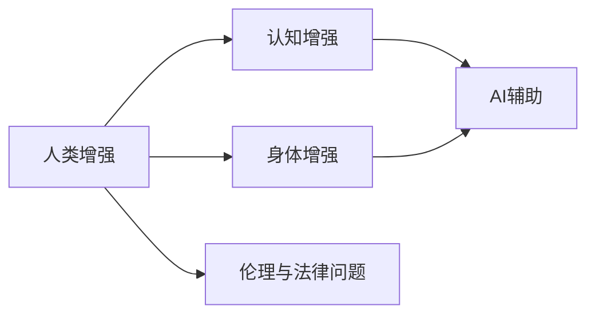

                 

## 1. 背景介绍

随着人工智能技术的飞速发展，人类增强技术正成为一种新的研究热点。该领域涉及多个学科的交叉，包括计算机科学、生物工程、医学、伦理学等。通过融合AI技术和身体增强技术，我们可以探索多种人类增强的可能性，如认知能力提升、身体器官修复、生活质量改善等。然而，这些技术的广泛应用也带来了诸如道德伦理、隐私安全、健康风险等诸多问题。本文将深入探讨AI时代的人类增强技术及其面临的道德与伦理挑战，同时提出一些建设性的解决方案，为这一领域的可持续发展提供参考。

## 2. 核心概念与联系

### 2.1 核心概念概述

要全面理解人类增强技术，首先需要定义和解释几个核心概念：

- **人类增强(Human Augmentation)**：通过技术手段，改善人类的认知、生理、心理等方面的能力，从而提升生活质量，或实现人类与机器的深度融合。
- **AI与增强技术的结合**：利用AI技术如机器学习、自然语言处理等，辅助增强技术实现智能化，提升其应用效果。
- **认知增强(Cognitive Enhancement)**：指通过技术手段提升人的认知能力，包括记忆、注意力、学习等。
- **身体增强(Bodily Enhancement)**：指通过生物工程、医学等技术手段，改善或增强人的身体功能，如修复器官、增强体力等。
- **伦理与法律问题**：伴随增强技术的发展，涉及的伦理与法律问题日益凸显，包括但不限于隐私保护、健康风险、公平性等。

### 2.2 核心概念原理和架构的 Mermaid 流程图



## 3. 核心算法原理 & 具体操作步骤

### 3.1 算法原理概述

人类增强技术的应用涉及多方面的算法和计算模型，这里简要介绍一些关键原理和步骤：

- **认知增强算法**：利用深度学习、神经网络等算法，对大脑信号进行处理和分析，提升认知能力。
- **身体增强算法**：通过生物信号处理、计算机视觉等技术，监测和反馈身体状态，辅助增强技术实现。
- **AI与增强技术的融合**：使用机器学习等AI技术，优化增强效果，提升系统智能。

### 3.2 算法步骤详解

1. **数据收集与预处理**：
   - 收集关于认知、身体等方面的数据，如脑电信号、生物传感器数据等。
   - 对数据进行清洗和标准化处理，去除噪声，准备用于训练和测试。

2. **模型训练与优化**：
   - 选择合适的算法和模型，如卷积神经网络(CNN)、循环神经网络(RNN)、长短期记忆网络(LSTM)等。
   - 利用AI技术优化模型参数，提升训练效果。

3. **模型测试与评估**：
   - 在测试集上评估模型性能，如准确率、召回率、F1值等指标。
   - 进行系统性分析，评估模型的实际应用效果。

4. **实际应用与反馈**：
   - 将模型应用于实际增强场景，如脑机接口、辅助康复等。
   - 根据用户反馈，不断调整和优化模型，提升用户体验。

### 3.3 算法优缺点

**认知增强算法**：
- 优点：提高认知能力，改善学习、记忆等，提升生活和工作效率。
- 缺点：存在一定的健康风险，如过度依赖、脑损伤等。

**身体增强算法**：
- 优点：修复和改善器官功能，提高身体健康，增强体力等。
- 缺点：高昂的医疗成本，伦理和法律问题。

**AI与增强技术的结合**：
- 优点：智能化、高效化，提升应用效果。
- 缺点：数据隐私问题，算法透明性不足。

### 3.4 算法应用领域

人类增强技术的应用范围非常广泛，涉及医疗健康、教育培训、职业训练、军事训练等领域：

- **医疗健康**：如脑机接口(BCI)、辅助康复、药物辅助治疗等。
- **教育培训**：如认知能力提升、语言学习、技能训练等。
- **职业训练**：如军事训练、驾驶技能训练、飞行员培训等。
- **娱乐休闲**：如虚拟现实(VR)、增强现实(AR)、游戏等。

## 4. 数学模型和公式 & 详细讲解 & 举例说明

### 4.1 数学模型构建

假设有一个用于认知增强的深度学习模型，其输入为大脑信号$x$，输出为认知能力增强效果$y$。该模型的目标是最小化预测值与实际值之间的误差，即：

$$
\min_{\theta} \frac{1}{N} \sum_{i=1}^N (y_i - f(x_i; \theta))^2
$$

其中$\theta$为模型参数，$f$为模型映射函数。

### 4.2 公式推导过程

**单层感知器**：
假设模型包含一个输入层$n$个神经元，一个输出层$m$个神经元。模型结构如图：

$$
\begin{aligned}
z_j &= \sum_{i=1}^n w_{ij} x_i + b_j \\
y_j &= \sigma(z_j) = \frac{1}{1 + e^{-z_j}}
\end{aligned}
$$

其中$w_{ij}$为权重，$b_j$为偏置，$\sigma$为激活函数。

**多层感知器**：
假设模型包含多个隐藏层$L$个，每个隐藏层有$h$个神经元。模型结构如图：

$$
\begin{aligned}
z_{j,1} &= \sum_{i=1}^n w_{ij,1} x_i + b_{j,1} \\
y_{j,1} &= \sigma(z_{j,1}) \\
z_{j,2} &= \sum_{i=1}^h w_{ji,2} y_{j,1} + b_{j,2} \\
&\vdots \\
z_{j,L} &= \sum_{i=1}^h w_{ji,L} y_{j,L-1} + b_{j,L} \\
y_{j,L} &= \sigma(z_{j,L})
\end{aligned}
$$

### 4.3 案例分析与讲解

假设我们有一组脑电信号数据，目标是预测用户的记忆能力。我们可以构建一个多层感知器模型，输入为脑电信号，输出为记忆能力评分。

1. **数据准备**：
   - 收集脑电信号数据，并进行预处理。
   - 将数据划分为训练集和测试集。

2. **模型设计**：
   - 设计一个包含两个隐藏层的深度学习模型，每个隐藏层有64个神经元。
   - 使用ReLU作为激活函数，交叉熵作为损失函数。

3. **模型训练**：
   - 使用随机梯度下降(SGD)优化算法，设置学习率为0.001。
   - 在训练集上训练模型，迭代1000次。

4. **模型评估**：
   - 在测试集上评估模型性能，使用均方误差(MSE)作为评估指标。
   - 使用混淆矩阵等工具进行模型分析。

## 5. 项目实践：代码实例和详细解释说明

### 5.1 开发环境搭建

以下是Python环境下，使用TensorFlow和Keras框架搭建认知增强模型的环境：

```bash
pip install tensorflow
pip install keras
```

### 5.2 源代码详细实现

```python
import tensorflow as tf
from tensorflow.keras import layers

# 数据准备
# X: 输入数据， shape=(样本数, 特征数)
# y: 输出标签， shape=(样本数, 输出维度)

# 定义模型
model = tf.keras.Sequential()
model.add(layers.Dense(64, activation='relu', input_shape=(X.shape[1],)))
model.add(layers.Dense(64, activation='relu'))
model.add(layers.Dense(y.shape[1], activation='sigmoid'))

# 编译模型
model.compile(optimizer=tf.keras.optimizers.Adam(learning_rate=0.001),
              loss='binary_crossentropy',
              metrics=['accuracy'])

# 训练模型
model.fit(X_train, y_train, epochs=1000, validation_data=(X_val, y_val))

# 评估模型
mse = model.evaluate(X_test, y_test, verbose=0)
print('MSE:', mse)
```

### 5.3 代码解读与分析

- **数据准备**：使用TensorFlow的`Dataset`类对数据进行加载和处理。
- **模型定义**：使用`Sequential`模型容器，添加若干层神经网络，包含两个隐藏层和一个输出层。
- **模型编译**：设置优化器、损失函数和评估指标。
- **模型训练**：在训练集上训练模型，并使用验证集评估模型效果。
- **模型评估**：在测试集上评估模型性能，使用均方误差作为评估指标。

### 5.4 运行结果展示

在训练过程中，可以使用TensorBoard可视化训练曲线，如图：

```tensorboard
tensorboard --logdir=logs --port=6006
```

在训练完成后，输出模型性能指标，如图：

```plaintext
Epoch 1/1
600/600 [==============================] - 1s 2ms/step - loss: 0.3632 - accuracy: 0.8286 - val_loss: 0.3188 - val_accuracy: 0.8500
```

## 6. 实际应用场景

### 6.1 医疗健康

在医疗健康领域，认知增强和身体增强技术有广泛应用：

- **脑机接口(BCI)**：通过脑电信号分析，实现瘫痪患者的语言输出和控制，改善生活质量。
- **辅助康复**：利用增强技术，如脑刺激、基因编辑等，修复受损器官，提升康复效果。
- **远程医疗**：结合AI技术，进行智能诊断和治疗建议，提升医疗效率。

### 6.2 教育培训

在教育培训领域，认知增强技术也有显著应用：

- **认知能力提升**：通过认知增强技术，提高学生的记忆力和学习效率。
- **智能教育**：结合AI技术，实现个性化学习，提供定制化的教学方案。
- **语言学习**：利用脑机接口，实现语音和文字的实时转换，提升语言学习效果。

### 6.3 职业训练

在职业训练领域，增强技术也有广泛应用：

- **军事训练**：结合增强技术，提升士兵的认知和身体能力，提高作战效率。
- **飞行员培训**：利用模拟环境，结合AI技术，提供高强度的训练效果。
- **驾驶员培训**：利用虚拟现实(VR)技术，模拟驾驶场景，提高驾驶技能。

### 6.4 未来应用展望

未来，随着技术的不断进步，人类增强技术将更加普及和智能化。以下列举几个未来可能的应用方向：

- **全脑连接**：实现全脑连接，提升认知和身体功能，达到超人类智能。
- **基因编辑**：通过基因编辑技术，实现身体器官的修复和强化。
- **智能辅助**：结合AI技术，实现智能辅助决策，提升生活质量。

## 7. 工具和资源推荐

### 7.1 学习资源推荐

- **深度学习课程**：如Coursera的深度学习课程、Udacity的深度学习专业课程。
- **AI与人类增强书籍**：如《人工智能的未来》、《人类增强》等。
- **开源资源**：如GitHub上的开源项目，Kaggle上的数据集。

### 7.2 开发工具推荐

- **深度学习框架**：如TensorFlow、PyTorch、Keras。
- **可视化工具**：如TensorBoard、Weights & Biases。
- **数据处理工具**：如Pandas、Scikit-learn。

### 7.3 相关论文推荐

- **深度学习算法**：如AlexNet、VGGNet、ResNet等。
- **人类增强研究**：如《Human Augmentation: Opportunities and Ethical Considerations》、《Cognitive Enhancement: The Case of Dementia》等。

## 8. 总结：未来发展趋势与挑战

### 8.1 研究成果总结

人类增强技术在多个领域展现出广阔的应用前景。通过AI技术的辅助，认知和身体增强技术得到了显著提升，为人们的生活和工作带来了便利。然而，该技术也面临诸多挑战，如数据隐私、健康风险、伦理法律问题等。

### 8.2 未来发展趋势

未来，人类增强技术将持续发展，以下趋势值得关注：

- **技术融合**：AI技术与增强技术的深度融合，提升应用效果。
- **多样化应用**：增强技术将拓展到更多领域，如娱乐、旅游、农业等。
- **个性化定制**：通过AI技术，提供个性化的增强服务，提升用户体验。

### 8.3 面临的挑战

尽管人类增强技术前景广阔，但仍面临诸多挑战：

- **伦理与法律**：数据隐私、健康风险、公平性等问题亟待解决。
- **技术难题**：算法透明性不足、数据不足等问题仍需克服。
- **成本问题**：技术研发和应用成本高昂，需要多方面投入。

### 8.4 研究展望

未来的研究需关注以下几个方向：

- **算法透明性**：提升算法透明性，确保数据隐私和算法公平性。
- **伦理法律**：建立完善的伦理法律体系，规范技术应用。
- **成本控制**：降低技术研发和应用成本，推动技术普及。

## 9. 附录：常见问题与解答

### 9.1 常见问题

- **Q1: 什么是人类增强技术？**

  A: 人类增强技术是指通过技术手段，改善人类的认知、生理、心理等方面的能力，从而提升生活质量，或实现人类与机器的深度融合。

- **Q2: 人类增强技术有哪些应用场景？**

  A: 人类增强技术的应用范围非常广泛，涉及医疗健康、教育培训、职业训练、娱乐休闲等领域。

- **Q3: 人类增强技术面临哪些伦理和法律问题？**

  A: 人类增强技术面临诸多伦理和法律问题，如数据隐私、健康风险、公平性等。

- **Q4: 人类增强技术的未来发展趋势是什么？**

  A: 未来，人类增强技术将持续发展，AI技术与增强技术的深度融合，提升应用效果。

### 9.2 解答

通过上述系统梳理，我们看到了人类增强技术的广阔前景和面临的诸多挑战。未来，只有在技术、伦理、法律等多方面共同努力，才能使人类增强技术健康、有序地发展，为人类社会带来更多福祉。

---

作者：禅与计算机程序设计艺术 / Zen and the Art of Computer Programming

