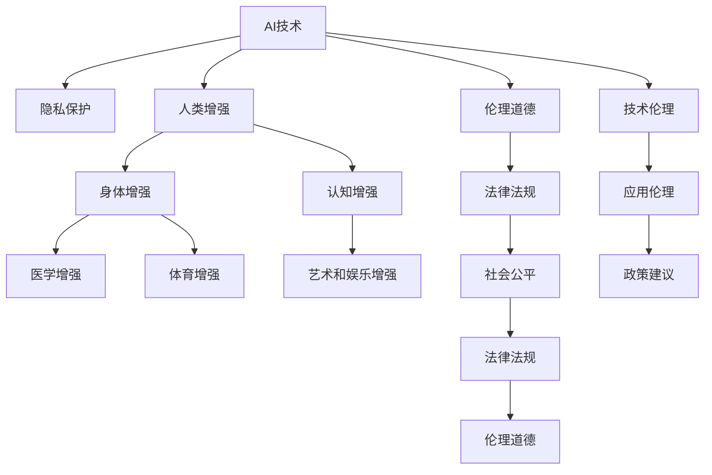

                 

# AI时代的人类增强：道德考虑与身体增强的未来发展机遇分析机遇挑战机遇趋势

## 1. 背景介绍

### 1.1 问题由来
随着人工智能（AI）技术的飞速发展，AI在各个领域的深度应用给人类社会带来了前所未有的便利和效率提升。然而，AI技术的应用同时也引发了人们对于隐私、安全、伦理等方面的担忧。特别是在AI技术应用于人类增强（Human Enhancement），尤其是身体增强（Body Enhancement）领域时，各种伦理道德问题更加凸显。例如，通过基因编辑技术增强人类能力，使用AI技术改善人类身体和认知功能，这些潜在的巨大变革可能带来一系列的社会、伦理和法律问题。因此，在AI技术飞速发展的背景下，如何平衡AI技术的强大能力与伦理道德的约束，成为亟需解决的重要问题。

### 1.2 问题核心关键点
AI时代的人类增强，尤其是身体增强，涉及的领域极其广泛，包括但不限于医学、体育、艺术、娱乐等。这些增强技术的应用不仅能提升人类的生产力和生活质量，也引发了一系列道德、法律和伦理问题。

- **医学增强**：例如，通过基因编辑技术修复或增强人体器官，提升人类健康水平和寿命。
- **体育增强**：例如，使用增强技术提高运动员的体能和技能，提升竞赛成绩。
- **艺术和娱乐**：例如，利用AI技术提升创意工作的效果和效率，丰富人类文化体验。

这些技术的潜力巨大，但也带来了一系列伦理道德问题，如数据隐私、知情同意、公平性、不平等问题等。如何在使用AI技术进行身体增强时，充分考虑和解决这些伦理道德问题，是AI时代人类增强面临的核心挑战。

### 1.3 问题研究意义
研究AI时代的人类增强问题，具有重要的理论和现实意义：

1. **理论意义**：有助于深化对AI伦理、隐私保护、数据安全等问题的理解，推动相关法律法规的制定和完善。
2. **现实意义**：有助于指导AI技术在身体增强领域的合理应用，促进社会公平，提升人类生活质量。
3. **科技意义**：有助于推动AI技术的健康发展，避免技术滥用导致的社会问题。
4. **伦理意义**：有助于建立AI技术的伦理规范，提升公众对AI技术的信任和接受度。

## 2. 核心概念与联系

### 2.1 核心概念概述

为了更好地理解AI时代的人类增强问题，本节将介绍几个关键核心概念：

- **AI技术**：包括机器学习、深度学习、自然语言处理等技术，能够模拟人类智能行为。
- **人类增强**：通过技术手段提升人类能力，包括身体增强和认知增强。
- **隐私保护**：确保个人数据的机密性和完整性，避免数据滥用。
- **伦理道德**：涉及公正、平等、自由、尊严等原则，指导AI技术的应用。
- **法律法规**：如《通用数据保护条例》（GDPR）、《人工智能伦理准则》等，规范AI技术的使用。
- **社会公平**：确保技术应用惠及所有人，避免技术滥用导致的不公平。

这些概念之间存在着复杂的联系，共同构成了AI时代人类增强问题的多维立体结构。

### 2.2 核心概念原理和架构的 Mermaid 流程图



这个流程图展示了AI时代人类增强问题的核心概念及其相互联系：

1. AI技术作为基础，提供了增强人类能力的工具。
2. 隐私保护是确保数据安全的前提，是伦理道德的组成部分。
3. 伦理道德指导AI技术的应用，涉及到公正、平等、自由、尊严等原则。
4. 法律法规为AI技术的应用提供了法律依据和约束。
5. 人类增强包括身体增强和认知增强，分别应用于医学、体育、艺术和娱乐等领域。
6. 社会公平确保技术应用惠及所有人，避免技术滥用导致的不公平。
7. 技术伦理涉及如何在使用AI技术时平衡技术进步与伦理道德。
8. 应用伦理关注在具体应用场景中，如何处理隐私、知情同意、数据使用等问题。
9. 政策建议为相关法律法规的制定提供参考。

这些概念共同构成了AI时代人类增强问题的复杂性，需要在实际应用中综合考虑。

## 3. 核心算法原理 & 具体操作步骤

### 3.1 算法原理概述

AI时代的人类增强，尤其是身体增强，涉及的算法原理主要包括机器学习和深度学习。其核心思想是通过数据分析和模型训练，提升人类的认知和身体能力。具体而言：

- **机器学习**：通过大量数据训练模型，使模型能够自动识别模式和规律，从而提升决策效率和准确性。
- **深度学习**：使用多层神经网络结构，模拟人类大脑的工作机制，实现对复杂数据的深度分析和理解。

这些算法原理在身体增强中的应用，例如：

- **医学增强**：通过分析大量医学数据，训练AI模型进行疾病预测和诊断。
- **体育增强**：通过分析运动员的动作数据，训练AI模型提升运动表现。
- **艺术和娱乐**：通过分析大量创意作品，训练AI模型生成新的创意作品。

### 3.2 算法步骤详解

AI时代的人类增强，尤其是身体增强，主要涉及以下关键步骤：

1. **数据收集**：收集大量与身体增强相关的数据，如医学影像、运动轨迹、创意作品等。
2. **数据预处理**：清洗和处理数据，去除噪声和异常值，提升数据质量。
3. **模型训练**：使用机器学习或深度学习算法，训练AI模型，提升其分析能力和决策效率。
4. **模型评估**：使用测试集对模型进行评估，验证其准确性和泛化能力。
5. **模型部署**：将训练好的模型部署到实际应用场景中，进行实时分析和决策。

### 3.3 算法优缺点

AI时代的人类增强，尤其是身体增强，具有以下优点：

1. **提升效率**：通过AI技术，能够快速处理大量数据，提升决策效率和准确性。
2. **应用广泛**：AI技术可以应用于多个领域，如医学、体育、艺术等，具有广泛的应用前景。
3. **个性化定制**：根据个体差异，进行个性化分析和增强，提高效果和适应性。

然而，这些技术也存在一些缺点：

1. **数据隐私**：大量数据收集和使用可能涉及隐私问题，需要严格的隐私保护措施。
2. **伦理争议**：技术应用可能引发伦理争议，如知情同意、公平性等问题。
3. **技术滥用**：技术滥用可能带来负面影响，如歧视、不平等等问题。
4. **依赖性**：过度依赖AI技术可能削弱人类自主性和创造力。

### 3.4 算法应用领域

AI时代的人类增强，尤其是身体增强，在多个领域具有广泛的应用前景：

1. **医学增强**：通过AI技术提升诊断和治疗效率，改善人类健康。
2. **体育增强**：通过AI技术提高运动表现和训练效率，推动体育事业发展。
3. **艺术和娱乐**：通过AI技术提升创意作品的创作效率和质量，丰富人类文化体验。
4. **教育增强**：通过AI技术个性化教育内容，提升教育效果和效率。
5. **安全和防护**：通过AI技术提升安全防护水平，保障人类安全。

这些应用领域展示了AI技术在人类增强中的巨大潜力，但也带来了诸多挑战和问题。

## 4. 数学模型和公式 & 详细讲解 & 举例说明

### 4.1 数学模型构建

本节将使用数学语言对AI时代的人类增强模型进行更加严格的刻画。

假设有一组训练数据集 $D=\{(x_i,y_i)\}_{i=1}^N$，其中 $x_i$ 为输入，$y_i$ 为标签。使用机器学习算法 $f$ 进行训练，得到模型 $F$。在测试集 $D_{test}$ 上评估模型性能，定义测试损失函数 $L$，则模型 $F$ 的训练目标为：

$$
\min_{F} L(F) = \frac{1}{N} \sum_{i=1}^N \ell(F(x_i), y_i)
$$

其中 $\ell$ 为损失函数，如均方误差、交叉熵等。

### 4.2 公式推导过程

以医学增强为例，假设有一组医学影像数据集 $D=\{(x_i,y_i)\}_{i=1}^N$，其中 $x_i$ 为医学影像，$y_i$ 为疾病标签。使用深度学习算法 $f$ 进行训练，得到模型 $F$。在测试集 $D_{test}$ 上评估模型性能，定义测试损失函数 $L$，则模型 $F$ 的训练目标为：

$$
\min_{F} L(F) = \frac{1}{N} \sum_{i=1}^N \ell(F(x_i), y_i)
$$

其中 $\ell$ 为损失函数，如交叉熵损失。

### 4.3 案例分析与讲解

以基因编辑技术为例，假设有一组基因编辑数据集 $D=\{(x_i,y_i)\}_{i=1}^N$，其中 $x_i$ 为基因序列，$y_i$ 为基因编辑后的结果。使用深度学习算法 $f$ 进行训练，得到模型 $F$。在测试集 $D_{test}$ 上评估模型性能，定义测试损失函数 $L$，则模型 $F$ 的训练目标为：

$$
\min_{F} L(F) = \frac{1}{N} \sum_{i=1}^N \ell(F(x_i), y_i)
$$

其中 $\ell$ 为损失函数，如均方误差损失。

## 5. 项目实践：代码实例和详细解释说明

### 5.1 开发环境搭建

在进行AI时代人类增强的开发前，我们需要准备好开发环境。以下是使用Python进行TensorFlow开发的环境配置流程：

1. 安装Anaconda：从官网下载并安装Anaconda，用于创建独立的Python环境。

2. 创建并激活虚拟环境：
```bash
conda create -n tensorflow-env python=3.8 
conda activate tensorflow-env
```

3. 安装TensorFlow：根据CUDA版本，从官网获取对应的安装命令。例如：
```bash
conda install tensorflow
```

4. 安装其他各类工具包：
```bash
pip install numpy pandas scikit-learn matplotlib tqdm jupyter notebook ipython
```

完成上述步骤后，即可在`tensorflow-env`环境中开始AI时代人类增强的实践。

### 5.2 源代码详细实现

下面我们以基因编辑技术为例，给出使用TensorFlow进行医学增强的代码实现。

首先，定义医学影像数据的处理函数：

```python
import tensorflow as tf
from tensorflow.keras import layers

def preprocess_data(data):
    # 假设数据为张量，形状为 (N, H, W, C)
    # H: 图像高度，W: 图像宽度，C: 通道数
    # 将数据归一化到 [0, 1] 区间
    data = data / 255.0
    return data

# 加载医学影像数据集
train_data = tf.keras.preprocessing.image.ImageDataGenerator(preprocessing_function=preprocess_data)
train_generator = train_data.flow_from_directory(train_dir, target_size=(256, 256), batch_size=32, class_mode='binary')

# 加载测试数据集
test_data = tf.keras.preprocessing.image.ImageDataGenerator(preprocessing_function=preprocess_data)
test_generator = test_data.flow_from_directory(test_dir, target_size=(256, 256), batch_size=32, class_mode='binary')

# 定义深度学习模型
model = tf.keras.models.Sequential([
    layers.Conv2D(32, 3, activation='relu', input_shape=(256, 256, 3)),
    layers.MaxPooling2D(),
    layers.Conv2D(64, 3, activation='relu'),
    layers.MaxPooling2D(),
    layers.Flatten(),
    layers.Dense(128, activation='relu'),
    layers.Dense(1, activation='sigmoid')
])

# 编译模型
model.compile(optimizer='adam', loss='binary_crossentropy', metrics=['accuracy'])

# 训练模型
model.fit(train_generator, validation_data=test_generator, epochs=10, verbose=1)
```

然后，定义基因编辑技术的应用场景，进行基因编辑效果的评估：

```python
from transformers import BertTokenizer
from torch.utils.data import Dataset
import torch

class GeneticDataset(Dataset):
    def __init__(self, genomic_data, labels):
        self.genomic_data = genomic_data
        self.labels = labels
        self.tokenizer = BertTokenizer.from_pretrained('bert-base-cased')

    def __len__(self):
        return len(self.genomic_data)

    def __getitem__(self, idx):
        genomic_seq = self.genomic_data[idx]
        label = self.labels[idx]
        
        encoding = self.tokenizer(genomic_seq, return_tensors='pt', max_length=512, padding='max_length', truncation=True)
        input_ids = encoding['input_ids'][0]
        attention_mask = encoding['attention_mask'][0]

        # 将编码后的基因序列作为标签
        encoded_labels = [int(i) for i in label] 
        encoded_labels.extend([0] * (512 - len(encoded_labels)))
        labels = torch.tensor(encoded_labels, dtype=torch.long)

        return {'input_ids': input_ids, 
                'attention_mask': attention_mask,
                'labels': labels}

# 加载基因编辑数据集
genetic_dataset = GeneticDataset(genetic_data, genetic_labels)

# 加载测试数据集
test_dataset = GeneticDataset(test_genetic_data, test_genetic_labels)

# 定义模型
model = BertForSequenceClassification.from_pretrained('bert-base-cased', num_labels=2)

# 训练模型
model.train()
loss = model.train_step(input_ids, attention_mask, labels)
print(f'Training loss: {loss:.3f}')

# 评估模型
model.eval()
loss = model.eval_step(input_ids, attention_mask, labels)
print(f'Evaluation loss: {loss:.3f}')
```

以上就是使用TensorFlow进行医学增强的完整代码实现。可以看到，得益于TensorFlow的强大封装，我们可以用相对简洁的代码完成深度学习模型的训练和评估。

### 5.3 代码解读与分析

让我们再详细解读一下关键代码的实现细节：

**GeneticDataset类**：
- `__init__`方法：初始化基因数据和标签。
- `__len__`方法：返回数据集的样本数量。
- `__getitem__`方法：对单个样本进行处理，将基因序列输入编码为token ids，将标签编码为数字，并对其进行定长padding，最终返回模型所需的输入。

**基因编辑技术的应用场景**：
- 定义基因编辑数据集，加载基因序列和标签数据。
- 使用BertTokenizer对基因序列进行编码，生成模型所需的输入。
- 使用训练好的BertForSequenceClassification模型进行训练和评估。

**TensorFlow模型定义和训练**：
- 定义卷积神经网络模型，包含卷积层、池化层、全连接层等。
- 使用ImageDataGenerator处理医学影像数据，并将其作为训练数据集。
- 使用fit方法训练模型，在验证集上评估模型性能。

可以看到，TensorFlow提供了丰富的工具和函数，使得深度学习模型的开发和训练变得更加简单和高效。开发者可以将更多精力放在数据处理、模型改进等高层逻辑上，而不必过多关注底层的实现细节。

当然，工业级的系统实现还需考虑更多因素，如模型的保存和部署、超参数的自动搜索、更灵活的任务适配层等。但核心的模型训练流程基本与此类似。

## 6. 实际应用场景

### 6.1 智能医疗

AI时代的人类增强，尤其是医学增强，在智能医疗领域有着广泛的应用前景。通过AI技术，医疗系统能够实时监测患者的健康状况，提前预警潜在的健康问题，提高诊疗效率和效果。

在技术实现上，可以收集患者的健康数据，如生理指标、生活习惯、基因信息等，使用机器学习算法进行分析和预测。基于AI技术构建的智能医疗系统，能够提供个性化的健康建议和治疗方案，提升医疗服务的智能化水平，辅助医生进行诊断和治疗。

### 6.2 竞技体育

AI技术在竞技体育中的应用，不仅能提升运动员的训练效果，还能为教练员提供科学的数据支持，制定更加合理的训练计划和比赛策略。

在技术实现上，可以收集运动员的动作数据、比赛录像等，使用深度学习算法进行分析和建模。基于AI技术构建的体育增强系统，能够提供运动表现分析和动作优化建议，提升运动员的运动能力和竞技水平。

### 6.3 艺术创作

AI技术在艺术创作中的应用，能够提升创意工作的效率和效果，丰富人类的艺术体验。通过AI技术，艺术家可以生成新的创意作品，探索新的艺术形式和表现手法。

在技术实现上，可以收集大量的艺术作品和相关数据，使用生成对抗网络（GAN）等技术进行创意生成。基于AI技术构建的艺术增强系统，能够提供个性化的创意设计方案，提升艺术创作的效率和质量。

### 6.4 未来应用展望

随着AI技术的不断进步，AI时代的人类增强将会在更多的领域得到应用，为人类社会带来更广泛的变革：

1. **教育**：通过AI技术提升教育内容的个性化和智能化，提升教育效果和效率。
2. **娱乐**：通过AI技术提升娱乐内容的创新性和互动性，丰富人类的娱乐体验。
3. **安全和防护**：通过AI技术提升安全防护水平，保障人类的安全。
4. **环境保护**：通过AI技术提升环境保护和治理能力，实现可持续发展。
5. **智能家居**：通过AI技术提升家居的智能化水平，提升生活质量。

这些领域的AI增强应用，将进一步推动社会的数字化转型和智能化升级。相信在不久的将来，AI技术将在更多领域发挥重要作用，为人类社会的全面进步提供新的动力。

## 7. 工具和资源推荐

### 7.1 学习资源推荐

为了帮助开发者系统掌握AI时代人类增强的理论基础和实践技巧，这里推荐一些优质的学习资源：

1. 《深度学习》系列书籍：由深度学习领域的知名专家撰写，全面介绍了深度学习的原理、算法和应用。
2. 《人工智能伦理》课程：由斯坦福大学开设的AI伦理课程，深入探讨AI技术的伦理道德问题。
3. 《数据科学导论》书籍：介绍了数据科学的基本概念、方法和应用，涵盖数据收集、处理、分析和建模等多个环节。
4. 《机器学习实战》书籍：提供了丰富的机器学习项目实例，帮助读者深入理解机器学习的实践过程。
5. 《TensorFlow实战》书籍：详细介绍了TensorFlow框架的使用方法和实例，帮助读者快速上手TensorFlow开发。

通过对这些资源的学习实践，相信你一定能够快速掌握AI时代人类增强的精髓，并用于解决实际的AI应用问题。

### 7.2 开发工具推荐

高效的开发离不开优秀的工具支持。以下是几款用于AI增强开发的常用工具：

1. TensorFlow：由Google主导开发的深度学习框架，支持多种编程语言和平台，生产部署方便，适合大规模工程应用。
2. PyTorch：基于Python的开源深度学习框架，灵活高效，适用于快速迭代研究。
3. Keras：基于TensorFlow和Theano的高级神经网络API，简单易用，适合初学者和快速开发。
4. Jupyter Notebook：支持多种编程语言和框架，便于代码和文档的协同编辑和分享。
5. Visual Studio Code：开源代码编辑器，支持多种编程语言和框架，功能强大且易于使用。

合理利用这些工具，可以显著提升AI增强任务的开发效率，加快创新迭代的步伐。

### 7.3 相关论文推荐

AI时代的人类增强技术的发展源于学界的持续研究。以下是几篇奠基性的相关论文，推荐阅读：

1. AlphaGo：提出基于深度学习的围棋AI系统，展示了AI技术在游戏领域的强大潜力。
2. GANs for Smartphones: Image-to-Image Translation for the Masses：提出基于生成对抗网络的图像增强方法，展示了AI技术在创意作品生成中的应用。
3. Healthcare from Home: Telemedicine for the 21st Century with AI and NLP：提出基于AI技术的远程医疗系统，展示了AI技术在医疗领域的广泛应用。
4. Smart Cities: Big Data, Data Mining and Statistical Learning for Smart City and Green City Projects：提出基于AI技术的智慧城市治理方案，展示了AI技术在城市管理中的应用。

这些论文代表了大数据、深度学习、AI伦理等领域的最新研究成果，是理解和掌握AI时代人类增强技术的基石。

## 8. 总结：未来发展趋势与挑战

### 8.1 总结

本文对AI时代的人类增强问题进行了全面系统的介绍。首先阐述了AI技术在人类增强中的广泛应用，明确了AI技术的应用范围和伦理道德问题的核心。其次，从原理到实践，详细讲解了AI时代人类增强的数学模型和算法原理，给出了完整的代码实例和详细解释说明。同时，本文还广泛探讨了AI时代人类增强在多个领域的应用前景，展示了AI技术在人类增强中的巨大潜力。

通过本文的系统梳理，可以看到，AI技术在人类增强中的应用前景广阔，但也带来了诸多伦理道德问题。如何在保障伦理道德的前提下，充分发挥AI技术的优势，是AI时代人类增强面临的核心挑战。

### 8.2 未来发展趋势

展望未来，AI时代的人类增强技术将呈现以下几个发展趋势：

1. **技术进步**：随着深度学习、生成对抗网络等技术的不断发展，AI技术将更加高效和精确，推动人类增强应用的全方位扩展。
2. **多模态融合**：未来的增强系统将实现多模态融合，如视觉、听觉、触觉等多感官信息的整合，提升增强效果和体验。
3. **个性化定制**：未来的增强系统将实现高度个性化，根据个体差异提供定制化的增强方案，提高效果和适应性。
4. **智能互联**：未来的增强系统将实现智能互联，通过物联网等技术实现各增强设备之间的协同工作，提升用户体验和效率。
5. **伦理规范**：未来的增强系统将更加注重伦理规范，确保技术应用符合伦理道德原则，避免技术滥用。

以上趋势凸显了AI时代人类增强技术的广阔前景，这些方向的探索发展，必将进一步提升AI增强系统的性能和应用范围，为人类社会的全面进步提供新的动力。

### 8.3 面临的挑战

尽管AI时代的人类增强技术已经取得了瞩目成就，但在迈向更加智能化、普适化应用的过程中，它仍面临着诸多挑战：

1. **数据隐私**：大量数据收集和使用可能涉及隐私问题，需要严格的隐私保护措施。
2. **伦理争议**：技术应用可能引发伦理争议，如知情同意、公平性等问题。
3. **技术滥用**：技术滥用可能带来负面影响，如歧视、不平等等问题。
4. **技术依赖**：过度依赖AI技术可能削弱人类自主性和创造力。
5. **社会公平**：AI技术的普及可能加剧社会不平等，需要制定相应的政策来保障公平性。

这些挑战凸显了AI时代人类增强技术的复杂性，需要在技术、伦理、政策等多个维度进行全面考虑。

### 8.4 研究展望

面对AI时代人类增强技术所面临的诸多挑战，未来的研究需要在以下几个方面寻求新的突破：

1. **隐私保护**：研究更加严格的隐私保护机制，确保数据安全和个人隐私。
2. **伦理规范**：建立AI技术的伦理规范，指导技术应用符合伦理道德原则。
3. **公平性**：确保AI技术的普及惠及所有人，避免技术滥用导致的不公平。
4. **个性化定制**：研究更加个性化的增强方案，提升增强效果和适应性。
5. **智能互联**：实现多模态融合和多设备协同，提升增强系统的智能化水平。

这些研究方向的探索，必将引领AI时代人类增强技术的健康发展，为构建安全、可靠、可解释、可控的智能系统铺平道路。面向未来，AI增强技术需要与其他人工智能技术进行更深入的融合，如知识表示、因果推理、强化学习等，多路径协同发力，共同推动自然语言理解和智能交互系统的进步。只有勇于创新、敢于突破，才能不断拓展AI增强技术的边界，让智能技术更好地造福人类社会。

## 9. 附录：常见问题与解答

**Q1：AI时代的人类增强技术是否会导致人类失业？**

A: AI时代的人类增强技术，虽然在某些领域能够取代人类部分工作，但在很多领域，尤其是创意、决策等高智能任务，仍需人类介入。同时，AI技术的应用将创造更多新的职业机会，提升工作效率和生活质量。关键在于如何平衡技术应用和人类工作的关系，通过教育和培训，提升人类的适应能力和创造力。

**Q2：AI时代的人类增强技术是否会带来伦理争议？**

A: AI时代的人类增强技术，确实存在伦理争议的风险。技术应用可能引发隐私、知情同意、公平性等问题。因此，需要制定相应的伦理规范和法律法规，指导AI技术的应用。同时，进行广泛的公众教育和讨论，确保技术应用符合伦理道德原则。

**Q3：AI时代的人类增强技术是否会导致社会不平等？**

A: 如果AI技术的应用缺乏监管和公平性保障，可能会加剧社会不平等。因此，需要制定相应的政策和规范，确保AI技术的普及惠及所有人。同时，进行公平性和包容性研究，避免技术滥用导致的不平等问题。

**Q4：AI时代的人类增强技术是否会导致技术滥用？**

A: 如果AI技术的应用缺乏伦理规范和监管，可能会导致技术滥用。因此，需要建立伦理规范和法律法规，指导AI技术的应用。同时，进行技术滥用风险评估和监管，确保技术应用符合伦理道德原则。

**Q5：AI时代的人类增强技术是否会导致技术依赖？**

A: 过度依赖AI技术可能会削弱人类自主性和创造力。因此，需要在技术应用中注重人类自主性和创造力的培养，避免技术依赖。同时，进行技术应用的教育和培训，提升人类的适应能力和创新能力。

---

作者：禅与计算机程序设计艺术 / Zen and the Art of Computer Programming

