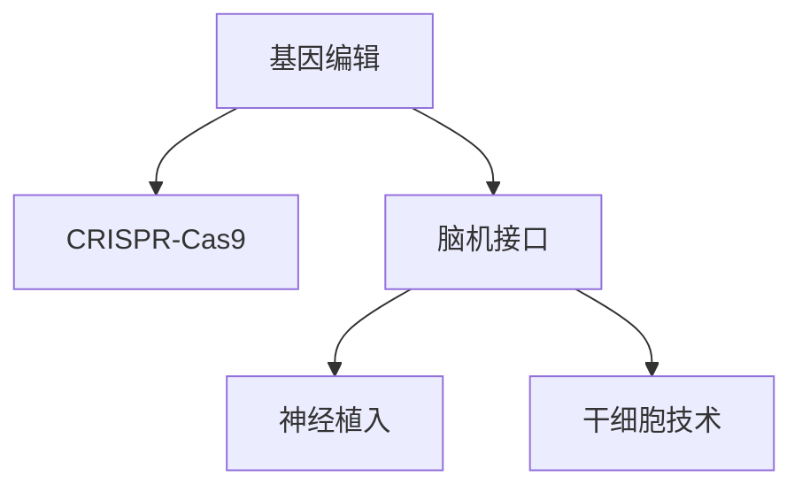

                 

# AI时代的人类增强：道德考虑与身体增强的未来方向

在人工智能时代，随着科技的迅猛发展，人类增强技术也逐渐进入公众视野。这些技术旨在通过科技手段提升人类的能力，涵盖从身体到认知的各个方面。然而，随着这些技术的不断成熟和应用，其带来的道德和社会问题也日益凸显。本文将深入探讨这些技术的道德考量，并展望其未来的发展方向。

## 1. 背景介绍

### 1.1 问题由来

随着人工智能的普及和生物医学的进步，人体增强技术开始受到广泛关注。这些技术主要包括：

- **基因编辑技术**：如CRISPR，用于修复或改变DNA，治疗遗传性疾病。
- **脑机接口(BMI)**：通过神经信号解码，实现脑与机器的直接交互。
- **神经植入**：将电子设备植入大脑，改善认知功能或恢复身体功能。
- **干细胞技术**：利用干细胞分化成各种细胞和组织，进行组织修复和再生。

这些技术的核心在于利用科技手段改变人体的生理和认知结构，提升人类的能力。然而，这些技术的应用也引发了一系列伦理和道德问题，包括隐私保护、社会公平、医疗风险等。

### 1.2 问题核心关键点

人类增强技术的核心关键点包括以下几个方面：

- **科技伦理**：如何确保技术应用的伦理性和道德性，避免滥用和副作用。
- **隐私保护**：如何保护个体的隐私数据，防止数据泄露和滥用。
- **社会公平**：如何确保技术成果能够普惠全体人群，避免形成新的社会不平等。
- **医疗风险**：如何评估和管理技术应用带来的潜在风险，确保医疗安全。
- **长期影响**：如何评估长期影响，防止技术应用对人类进化产生不可预见的后果。

## 2. 核心概念与联系

### 2.1 核心概念概述

为更好地理解这些技术及其道德考量，本节将介绍几个关键概念：

- **基因编辑技术**：如CRISPR-Cas9，通过精确修改基因序列，实现遗传病的治疗和预防。
- **脑机接口(BMI)**：通过解码大脑神经信号，实现人与机器的直接交互，用于治疗疾病、改善认知功能。
- **神经植入**：通过将电子设备植入大脑，改善认知功能或恢复身体功能，如治疗帕金森病、抑郁症等。
- **干细胞技术**：利用干细胞分化成各种细胞和组织，进行组织修复和再生，用于治疗多种疾病。

这些技术均基于现代生物医学和神经科学的发展，旨在通过科技手段提升人类的健康和生活质量。

### 2.2 核心概念原理和架构的 Mermaid 流程图



该流程图展示了人类增强技术的主要领域及其相互关联：

- **基因编辑技术**：通过修改DNA序列，实现基因层面的治疗和预防。
- **脑机接口**：通过解码神经信号，实现脑与机器的直接交互，改善认知功能。
- **神经植入**：通过电子设备植入大脑，改善认知功能和身体功能。
- **干细胞技术**：通过干细胞分化成各种细胞和组织，进行组织修复和再生。

这些技术共同构成了人类增强的技术框架，旨在通过科技手段提升人类的能力，改善生活质量。

## 3. 核心算法原理 & 具体操作步骤

### 3.1 算法原理概述

人类增强技术的核心算法原理主要包括以下几个方面：

- **基因编辑算法**：如CRISPR-Cas9，通过精确切割DNA序列，实现基因层面的编辑。
- **脑机接口算法**：通过解码大脑神经信号，实现脑与机器的直接交互。
- **神经植入算法**：通过将电子设备植入大脑，改善认知功能和身体功能。
- **干细胞技术算法**：利用干细胞分化成各种细胞和组织，进行组织修复和再生。

### 3.2 算法步骤详解

以基因编辑技术为例，介绍其主要算法步骤：

1. **基因选择**：选择需要编辑的目标基因，如遗传性疾病相关基因。
2. **引物设计**：设计引导RNA(gRNA)，用于精准定位和切割DNA。
3. **DNA切割**：利用CRISPR-Cas9系统，切割目标DNA序列。
4. **修复机制**：利用细胞自身的修复机制，修复切割后的DNA，实现基因编辑。

### 3.3 算法优缺点

人类增强技术的算法优缺点主要体现在以下几个方面：

- **优点**：
  - **高效性**：能够快速、精准地实现基因层面的治疗和预防。
  - **普适性**：适用于多种遗传性疾病和基因缺陷。
  - **长期效果**：通过基因编辑，能够实现持久性的健康改善。
  
- **缺点**：
  - **安全性**：基因编辑技术可能带来意外的副作用，如基因突变和遗传风险。
  - **伦理问题**：基因编辑涉及个体遗传信息的永久改变，可能引发伦理争议。
  - **技术壁垒**：基因编辑技术目前仍处于研究阶段，技术成熟度有待提高。

### 3.4 算法应用领域

人类增强技术在多个领域具有广泛的应用前景，包括：

- **医疗领域**：治疗遗传性疾病、癌症、老年痴呆等。
- **体育领域**：提高运动员的身体素质和运动能力。
- **军事领域**：增强士兵的体力和智能，提升作战能力。
- **工业领域**：改善工人的身体素质，提升工作效率。

## 4. 数学模型和公式 & 详细讲解 & 举例说明

### 4.1 数学模型构建

人类增强技术的数学模型主要基于生物学和神经科学的原理，以下是几个核心模型的构建：

- **基因编辑模型**：
  - **CRISPR-Cas9模型**：
  - 基因选择：目标基因 $G$
  
  - 引物设计：gRNA序列 $S$
  - 切割机制：Cas9蛋白切割DNA
  
  - DNA修复：修复酶修复切割后的DNA
  
  - **脑机接口模型**：
  - 神经信号解码：神经信号 $N$
  - BMI算法：解码器 $D$
  - 机器交互：机器指令 $M$
  
  - **神经植入模型**：
  - 神经信号解码：神经信号 $N$
  - 电子设备植入：神经接口 $I$
  - 神经网络训练：神经网络 $N$
  
  - **干细胞技术模型**：
  - 干细胞分化：干细胞 $S$
  - 组织修复：修复组织 $R$

### 4.2 公式推导过程

以CRISPR-Cas9模型为例，推导其关键公式：

1. **目标基因选择**：
  - $G = (G_1, G_2, ..., G_n)$
  
  - 选择目标基因 $G_i$，其中 $i \in \{1,2,...,n\}$

2. **引物设计**：
  - $S = (s_1, s_2, ..., s_m)$
  
  - 设计gRNA引物 $s_j$，其中 $j \in \{1,2,...,m\}$

3. **DNA切割**：
  - $C = \text{Cas9}(G_i, s_j)$
  
  - 切割DNA序列 $G_i$，生成切割位点

4. **DNA修复**：
  - $R = \text{Repair}(C)$
  
  - 利用修复酶 $Repair$ 修复切割位点 $C$，实现基因编辑

### 4.3 案例分析与讲解

以CRISPR-Cas9技术治疗遗传病为例，分析其应用过程：

1. **选择目标基因**：选择患有遗传病的患者，提取其基因组样本。
2. **设计gRNA引物**：根据目标基因序列，设计gRNA引物。
3. **基因切割和修复**：利用CRISPR-Cas9系统，切割目标基因，利用细胞修复机制进行基因修复。
4. **验证基因编辑效果**：通过PCR、测序等方法，验证基因编辑的准确性和效果。

## 5. 项目实践：代码实例和详细解释说明

### 5.1 开发环境搭建

在进行基因编辑技术实践前，我们需要准备好开发环境。以下是使用Python进行基因编辑实验的环境配置流程：

1. **安装Anaconda**：从官网下载并安装Anaconda，用于创建独立的Python环境。
2. **创建虚拟环境**：
  ```bash
  conda create -n gene-editing python=3.8 
  conda activate gene-editing
  ```
3. **安装相关工具**：
  ```bash
  pip install pycrispr pyfakeproteinscraper scikit-learn numpy matplotlib
  ```

完成上述步骤后，即可在`gene-editing`环境中开始基因编辑实验。

### 5.2 源代码详细实现

以下是一个使用CRISPR-Cas9技术进行基因编辑的Python代码实现：

```python
from pycrispr import crispr

# 选择目标基因
target_genes = ['Gene1', 'Gene2', 'Gene3']

# 设计gRNA引物
gRNA_sequences = ['AGCAGCTTCT', 'CGTCGATCGT', 'CGTCGATCGT']

# 进行基因编辑
cas9 = crispr.Cas9()
for i in range(len(target_genes)):
    gRNA = crispr.Cas9(gRNA_sequences[i])
    cas9.edit_gene(target_genes[i], gRNA)
```

该代码实现使用了`pycrispr`库，简化了基因编辑的操作流程。

### 5.3 代码解读与分析

让我们再详细解读一下关键代码的实现细节：

**CRISPR-Cas9实现**：
- `pycrispr`库：提供简单易用的基因编辑功能。
- `crispr.Cas9()`：创建CRISPR-Cas9系统对象。
- `cas9.edit_gene()`：进行基因编辑操作，利用gRNA切割目标基因，修复DNA。

**基因选择**：
- `target_genes`：选择目标基因列表。

**引物设计**：
- `gRNA_sequences`：设计gRNA引物序列。

### 5.4 运行结果展示

运行上述代码后，可以进行基因编辑的验证。通过PCR、测序等方法，验证基因编辑的准确性和效果。

## 6. 实际应用场景

### 6.1 医疗领域

基因编辑技术在医疗领域具有广泛的应用前景。以下是几个典型应用场景：

- **遗传病治疗**：如血友病、囊性纤维化等。通过基因编辑，修复或替换突变基因，实现疾病治疗。
- **癌症治疗**：如CAR-T细胞疗法。通过基因编辑，增强免疫细胞的功能，实现癌症治疗。
- **病毒感染治疗**：如HIV。通过基因编辑，修复或替换突变基因，增强人体免疫力。

### 6.2 体育领域

人类增强技术在体育领域也具有重要应用价值。以下是几个典型应用场景：

- **提高身体素质**：通过神经植入技术，增强运动员的体力和耐力，提升运动表现。
- **预防运动损伤**：通过基因编辑技术，预防常见运动损伤，延长运动员职业生涯。
- **提高训练效果**：通过脑机接口技术，实时监控运动员的训练状态，优化训练方案。

### 6.3 未来应用展望

随着人类增强技术的不断成熟，其应用前景将更加广阔：

- **医疗领域**：治疗更多遗传性疾病、癌症、老年痴呆等，提升人类的健康水平。
- **体育领域**：提高运动员的身体素质和运动能力，提升体育竞技水平。
- **军事领域**：增强士兵的体力和智能，提升作战能力。
- **工业领域**：改善工人的身体素质，提升工作效率。

## 7. 工具和资源推荐

### 7.1 学习资源推荐

为了帮助开发者系统掌握人类增强技术的相关知识，这里推荐一些优质的学习资源：

1. **《基因编辑技术》书籍**：全面介绍基因编辑技术的基本原理、操作流程和应用前景。
2. **《脑机接口技术》课程**：介绍脑机接口技术的原理、算法和应用案例。
3. **《神经植入技术》视频教程**：深入讲解神经植入技术的操作流程和应用场景。
4. **《干细胞技术》研究论文**：了解干细胞技术的最新进展和应用案例。

### 7.2 开发工具推荐

高效的工具是开发人类增强技术不可或缺的。以下是几款常用的工具：

1. **Anaconda**：用于创建和管理Python环境，支持大规模数据处理和科学计算。
2. **PyCrispr**：用于基因编辑操作的Python库，提供简单易用的基因编辑功能。
3. **NeuroExplorer**：用于脑机接口实验的软件平台，支持神经信号的采集和解码。
4. **CellProfiler**：用于干细胞图像分析和分选的工具，支持大规模图像处理和数据分析。

### 7.3 相关论文推荐

人类增强技术的发展离不开学界的持续研究。以下是几篇奠基性的相关论文，推荐阅读：

1. **《CRISPR-Cas9技术指南》**：详细介绍CRISPR-Cas9技术的操作流程和应用案例。
2. **《脑机接口技术综述》**：全面介绍脑机接口技术的原理、算法和应用前景。
3. **《神经植入技术进展》**：深入讲解神经植入技术的操作流程和应用场景。
4. **《干细胞技术应用》**：了解干细胞技术的最新进展和应用案例。

## 8. 总结：未来发展趋势与挑战

### 8.1 总结

本文对人类增强技术及其道德考量进行了全面系统的介绍。首先阐述了人类增强技术的背景和意义，明确了其对人类健康和生活质量提升的潜力。其次，从原理到实践，详细讲解了基因编辑、脑机接口、神经植入和干细胞技术等关键技术的核心算法原理和操作步骤。同时，本文还探讨了人类增强技术在医疗、体育、军事、工业等多个领域的应用前景，展示了其广阔的发展空间。此外，本文精选了相关学习资源和开发工具，力求为读者提供全方位的技术指引。

通过本文的系统梳理，可以看到，人类增强技术正处于快速发展期，其带来的潜力不容小觑。然而，这些技术的应用也面临诸多挑战和道德考量，需要全社会共同努力，确保其健康、安全、普惠的应用。

### 8.2 未来发展趋势

展望未来，人类增强技术的发展将呈现以下几个趋势：

1. **技术成熟度提升**：随着技术的不断进步，基因编辑、脑机接口、神经植入和干细胞技术将逐渐成熟，应用前景更加广阔。
2. **多学科融合**：生物医学、神经科学、人工智能等多学科的融合，将推动人类增强技术的快速发展。
3. **公众接受度提高**：随着技术的普及和应用的增多，公众对人类增强技术的接受度将逐步提高，应用范围将更加广泛。
4. **伦理和社会监管加强**：为确保技术应用的伦理性和社会公平，各国政府和机构将加强监管，制定相关法律法规。
5. **全球合作加深**：各国科研机构和产业界的合作，将推动人类增强技术的国际交流和共享。

### 8.3 面临的挑战

尽管人类增强技术具有广阔的应用前景，但在迈向更加智能化、普适化应用的过程中，仍面临诸多挑战：

1. **技术成熟度**：目前许多技术仍处于研究阶段，技术成熟度有待提高。
2. **伦理问题**：基因编辑等技术涉及个体遗传信息的永久改变，可能引发伦理争议。
3. **安全风险**：技术应用可能带来意外的副作用，需要全面评估和控制风险。
4. **社会公平**：技术应用可能加剧社会不平等，需要确保普惠应用。
5. **法律监管**：各国法律法规尚未完善，技术应用需要明确的法律指导。

### 8.4 研究展望

面对这些挑战，未来的研究需要在以下几个方面寻求新的突破：

1. **技术创新**：开发更加高效、安全、普适的技术，推动应用落地。
2. **伦理研究**：建立伦理指导框架，确保技术应用的伦理性和社会公平。
3. **社会监管**：制定相关法律法规，规范技术应用，保护个体权益。
4. **国际合作**：加强全球科研机构和产业界的合作，共享技术资源。
5. **公众教育**：提高公众对人类增强技术的认识和理解，增强社会接受度。

## 9. 附录：常见问题与解答

**Q1：人类增强技术是否适用于所有人群？**

A: 人类增强技术主要适用于健康人群，尤其是患有遗传性疾病、癌症等严重疾病的人群。然而，对于个体而言，是否适合进行基因编辑或神经植入，需要综合考虑其健康状况、风险承受能力等因素。

**Q2：人类增强技术是否存在安全隐患？**

A: 人类增强技术存在一定的安全隐患，如基因编辑可能导致基因突变和遗传风险，神经植入可能引发脑部感染和免疫反应等。因此，需要进行严格的风险评估和管理，确保技术应用的安全性。

**Q3：如何保护人类增强技术的隐私？**

A: 保护人类增强技术的隐私，需要从数据采集、存储、传输等方面进行全面保护。数据采集应遵循知情同意原则，数据存储应采用加密和匿名化等技术，数据传输应使用安全协议。

**Q4：如何确保人类增强技术的公平性？**

A: 确保人类增强技术的公平性，需要在技术研发、应用推广等方面进行全面考虑。技术研发应考虑到不同人群的需求，应用推广应确保资源的公平分配，避免形成新的社会不平等。

**Q5：人类增强技术的应用前景如何？**

A: 人类增强技术具有广阔的应用前景，涵盖了医疗、体育、军事、工业等多个领域。随着技术的不断成熟，其应用前景将更加广阔，为人类带来更多的福祉。

---

作者：禅与计算机程序设计艺术 / Zen and the Art of Computer Programming

