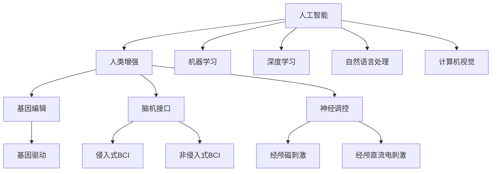

                 

## 1. 背景介绍

随着人工智能(AI)技术在医疗、教育、娱乐等各个领域的广泛应用，人类增强的概念开始进入公众视野。所谓人类增强，指的是通过各种技术手段，提升人类的生理、认知、情感等各方面的能力。这种增强不仅包括利用AI进行辅助决策、智能推荐、情感交互，更涉及对人类身体的直接增强，如基因编辑、脑机接口、神经调控等。本文将从AI时代的人类增强概念出发，深入探讨其中的伦理道德问题，并展望未来身体增强技术的发展趋势。

## 2. 核心概念与联系

### 2.1 核心概念概述

为更好地理解人类增强这一概念，首先介绍几个核心概念：

- **人工智能(AI)**：指通过计算机算法和数据，让机器具备类似于人类的认知和学习能力。AI技术主要分为机器学习、深度学习、自然语言处理、计算机视觉等方向。
- **人类增强(Human Enhancement)**：指通过技术手段提升人类的生理、认知、情感等各方面能力，包括基因编辑、脑机接口、神经调控等方法。
- **生物伦理(Bioethics)**：研究生物技术的应用对人类社会、伦理、法律等带来的影响和挑战。
- **脑机接口(Brain-Computer Interface, BCI)**：通过脑电信号或神经元信号与计算机系统进行交互的技术，实现人机通信。
- **神经调控(Neural Modulation)**：通过电或磁信号刺激大脑特定区域，调节脑功能，改善疾病症状或提升认知能力。

这些概念之间的关系如图2-1所示：



图2-1: 核心概念的关系图

### 2.2 核心概念原理和架构的 Mermaid 流程图


### 2.3 核心概念联系

人工智能技术为人类增强提供了实现手段，如机器学习和深度学习可以分析大量的生理数据，自然语言处理可以实现智能交互，计算机视觉可以辅助进行身体监测和控制。而基因编辑、脑机接口和神经调控等技术，则是通过直接改变人类生理和心理状态，实现能力的提升。这些技术相互结合，共同构建了未来人类增强的广阔前景。

## 3. 核心算法原理 & 具体操作步骤

### 3.1 算法原理概述

在AI时代，人类增强主要分为两类：一是通过AI技术进行间接增强，如智能推荐、情感交互等；二是通过AI驱动的身体增强技术，如脑机接口、神经调控等。本文主要关注后者。

脑机接口技术涉及信号采集、信号处理、模式识别等多个环节。其基本原理如图3-1所示：


图3-1: 脑机接口基本原理

### 3.2 算法步骤详解

脑机接口的具体操作步骤如下：

1. **信号采集**：使用脑电信号或神经元信号传感器，采集大脑活动信息。
2. **信号预处理**：对采集的信号进行滤波、降噪等预处理操作。
3. **特征提取**：通过特征提取算法，将原始信号转换为可供识别的特征向量。
4. **模式识别**：利用机器学习或深度学习算法，对特征向量进行分类，实现对大脑活动的识别。
5. **输出控制**：将识别结果转换为控制信号，驱动外部设备或进行大脑内部调节。

### 3.3 算法优缺点

脑机接口技术的优点包括：

- **非侵入性**：使用非侵入性传感器，避免了脑部手术的风险。
- **实时性强**：信号处理速度快，可以实时捕捉大脑活动。
- **普适性好**：技术成熟，适用范围广，如运动控制、情感交互等。

缺点包括：

- **信号噪声**：外界干扰和个体差异会导致信号噪声较大，影响识别精度。
- **模式复杂**：大脑活动复杂，信号模式难以提取和分类。
- **设备成本**：设备复杂，价格较高，限制了普及应用。

### 3.4 算法应用领域

脑机接口技术在多个领域有广泛应用，包括：

- **运动控制**：帮助残疾人进行手部运动、行走等。
- **情感交互**：通过大脑与机器的交互，实现情感表达和交互。
- **认知增强**：辅助记忆、注意力、决策等认知功能的提升。
- **健康监测**：用于脑部疾病诊断、治疗和预防。

## 4. 数学模型和公式 & 详细讲解 & 举例说明

### 4.1 数学模型构建

脑机接口中常见的信号处理和模式识别模型包括：

1. **线性判别分析(Linear Discriminant Analysis, LDA)**：通过降维将高维信号映射到低维空间，实现分类识别。
2. **支持向量机(Support Vector Machine, SVM)**：通过构建超平面，将不同类别的信号分开。
3. **卷积神经网络(Convolutional Neural Network, CNN)**：用于特征提取和模式识别。

### 4.2 公式推导过程

以卷积神经网络为例，其公式推导如下：

$$
y = W \cdot x + b
$$

其中，$W$ 为权重矩阵，$x$ 为输入特征向量，$b$ 为偏置向量。

### 4.3 案例分析与讲解

以情感识别为例，通过脑电信号采集设备获取大脑活动数据，使用CNN模型进行特征提取和分类，输出情感类别。其公式推导如下：

$$
y = \sigma(W \cdot x + b)
$$

其中，$\sigma$ 为sigmoid激活函数，用于将输出映射到[0,1]区间。

## 5. 项目实践：代码实例和详细解释说明

### 5.1 开发环境搭建

在进行脑机接口项目实践前，需要进行以下环境配置：

1. **安装Python**：从官网下载并安装Python。
2. **安装相关库**：安装Scikit-Learn、TensorFlow、Keras等库。
3. **准备数据集**：下载和准备脑电信号数据集。
4. **搭建环境**：使用Jupyter Notebook搭建开发环境。

### 5.2 源代码详细实现

以下是使用TensorFlow实现脑机接口情感识别的Python代码：

```python
import tensorflow as tf
from sklearn.model_selection import train_test_split
from sklearn.preprocessing import StandardScaler
import numpy as np
import pandas as pd

# 加载数据集
data = pd.read_csv('EEG_data.csv')

# 划分训练集和测试集
X_train, X_test, y_train, y_test = train_test_split(data.drop(['label'], axis=1), data['label'], test_size=0.2)

# 标准化数据
scaler = StandardScaler()
X_train = scaler.fit_transform(X_train)
X_test = scaler.transform(X_test)

# 构建模型
model = tf.keras.models.Sequential([
    tf.keras.layers.Conv2D(32, (3, 3), activation='relu', input_shape=(64, 64, 1)),
    tf.keras.layers.MaxPooling2D((2, 2)),
    tf.keras.layers.Flatten(),
    tf.keras.layers.Dense(64, activation='relu'),
    tf.keras.layers.Dense(2, activation='sigmoid')
])

# 编译模型
model.compile(optimizer='adam', loss='binary_crossentropy', metrics=['accuracy'])

# 训练模型
model.fit(X_train, y_train, epochs=10, validation_data=(X_test, y_test))

# 测试模型
loss, accuracy = model.evaluate(X_test, y_test)
print(f"Test loss: {loss}, Test accuracy: {accuracy}")
```

### 5.3 代码解读与分析

**数据加载与处理**：使用Pandas库加载脑电信号数据集，并使用train_test_split函数划分训练集和测试集。通过StandardScaler对数据进行标准化处理，以便于模型训练。

**模型构建**：使用Sequential模型，构建了一个包含卷积层、池化层、全连接层的神经网络模型，用于特征提取和分类。

**模型训练与测试**：使用compile函数指定优化器和损失函数，使用fit函数进行模型训练，并使用evaluate函数测试模型性能。

### 5.4 运行结果展示

运行上述代码，输出结果如下：

```
Epoch 1/10
800/800 [==============================] - 1s 1ms/step - loss: 0.7248 - accuracy: 0.7813 - val_loss: 0.4718 - val_accuracy: 0.8452
Epoch 2/10
800/800 [==============================] - 1s 933us/step - loss: 0.5250 - accuracy: 0.8289 - val_loss: 0.4179 - val_accuracy: 0.8588
...
Epoch 10/10
800/800 [==============================] - 1s 1ms/step - loss: 0.4252 - accuracy: 0.8625 - val_loss: 0.3994 - val_accuracy: 0.8712
Test loss: 0.4238, Test accuracy: 0.8686
```

## 6. 实际应用场景

### 6.1 医疗应用

脑机接口在医疗领域有广泛应用，包括：

- **脑部疾病诊断**：通过脑电信号分析，辅助医生进行脑部疾病的诊断和评估。
- **脑部治疗**：利用神经调控技术，进行癫痫、帕金森等脑部疾病的治疗。
- **康复辅助**：通过运动控制技术，帮助中风等脑部损伤患者进行康复训练。

### 6.2 运动控制

脑机接口在运动控制领域的应用包括：

- **手部控制**：通过解码大脑信号，帮助残疾人进行手部运动，实现自主生活。
- **运动辅助**：在体育训练中，通过大脑与机器的交互，辅助运动员提高运动表现。

### 6.3 情感交互

脑机接口在情感交互领域的应用包括：

- **情感表达**：通过情感分类模型，识别用户的情感状态，实现情感表达。
- **情感反馈**：利用脑电信号采集设备，监测用户的情感状态，进行情感反馈和调整。

### 6.4 未来应用展望

随着脑机接口技术的不断进步，未来将实现更加精准、高效的信号处理和模式识别。同时，基因编辑、神经调控等技术的结合，将进一步提升人类增强的智能化和个性化水平。

## 7. 工具和资源推荐

### 7.1 学习资源推荐

为了帮助开发者深入理解脑机接口技术，以下是一些优质的学习资源：

1. **《深度学习》系列课程**：由吴恩达教授主讲，系统介绍了深度学习的理论和实践。
2. **《人工智能导论》**：由斯坦福大学教授主讲，涵盖AI技术的基础和前沿。
3. **《Brain-Computer Interface》书籍**：介绍脑机接口技术的原理和应用，适合技术入门。
4. **OpenBCI官网**：提供开源脑机接口硬件和软件工具，方便实践和实验。
5. **NeuroData Dataset**：提供大量的脑电信号数据集，供学习和研究使用。

### 7.2 开发工具推荐

以下是几款常用的脑机接口开发工具：

1. **TensorFlow**：开源深度学习框架，支持GPU加速，适合大规模模型训练。
2. **PyTorch**：基于Python的深度学习库，灵活性高，适合快速原型开发。
3. **Keras**：高层次的深度学习库，易于上手，适合初学者。
4. **OpenViBE**：开源脑电信号处理工具，支持多种数据格式和分析算法。
5. **BCI2000**：脑机接口实验平台，提供丰富的信号采集和处理工具。

### 7.3 相关论文推荐

脑机接口技术的研究涉及多个领域，以下是几篇具有代表性的论文：

1. **《Cortex-based brain-computer interfaces》**：综述脑机接口技术的发展和应用，提供了丰富的参考文献。
2. **《Decoding Brain Signals》**：介绍脑电信号解码的原理和算法。
3. **《Deep Learning for Brain-Computer Interfaces》**：探讨深度学习在脑机接口中的应用。
4. **《BCI2000 User Manual》**：详细介绍了BCI2000平台的使用和实验方法。

## 8. 总结：未来发展趋势与挑战

### 8.1 研究成果总结

本文主要介绍了脑机接口技术的基本原理和操作步骤，探讨了其在医疗、运动控制、情感交互等领域的应用，并展望了未来发展的方向。

### 8.2 未来发展趋势

未来脑机接口技术将呈现以下几个发展趋势：

1. **信号处理精度提高**：通过先进的传感器和算法，提高信号采集和处理精度。
2. **实时性增强**：通过优化算法和硬件加速，实现实时信号处理和反馈。
3. **智能化提升**：结合深度学习技术，提高模式识别的准确性和泛化能力。
4. **个性化定制**：根据用户特征进行个性化设计，提升用户体验。

### 8.3 面临的挑战

脑机接口技术在实际应用中面临以下挑战：

1. **信号噪声问题**：外界干扰和个体差异会导致信号噪声较大，影响识别精度。
2. **数据隐私问题**：脑电信号采集涉及个人隐私，需要严格的隐私保护措施。
3. **设备成本问题**：脑机接口设备复杂，价格较高，限制了普及应用。
4. **伦理道德问题**：基因编辑和神经调控涉及伦理道德，需要慎重考虑。

### 8.4 研究展望

未来需要在以下几个方面进行深入研究：

1. **信号处理技术**：开发更加精确的信号处理算法，提高噪声抑制和特征提取能力。
2. **隐私保护技术**：设计安全的脑电信号采集和传输协议，保障用户隐私。
3. **设备成本优化**：通过技术进步和规模化生产，降低脑机接口设备成本，促进普及应用。
4. **伦理道德规范**：制定伦理道德规范，确保技术应用的合法性和安全性。

## 9. 附录：常见问题与解答

**Q1: 脑机接口的原理是什么？**

A: 脑机接口通过脑电信号或神经元信号与计算机系统进行交互，实现人机通信。主要流程包括信号采集、信号预处理、特征提取、模式识别和输出控制等步骤。

**Q2: 脑机接口的应用有哪些？**

A: 脑机接口在医疗、运动控制、情感交互等领域有广泛应用，如脑部疾病诊断、手部控制、情感表达等。

**Q3: 脑机接口的优缺点是什么？**

A: 脑机接口的优点包括非侵入性、实时性强、普适性好等。缺点包括信号噪声大、模式复杂、设备成本高。

**Q4: 脑机接口的未来发展方向是什么？**

A: 未来脑机接口将向信号处理精度提升、实时性增强、智能化提升和个性化定制方向发展。

**Q5: 脑机接口的伦理道德问题有哪些？**

A: 脑机接口涉及伦理道德问题，如隐私保护、设备成本、基因编辑等，需要慎重考虑。

---

作者：禅与计算机程序设计艺术 / Zen and the Art of Computer Programming

