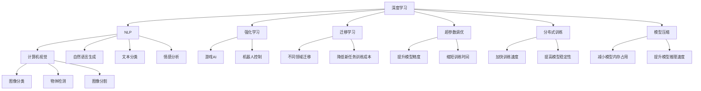

                 

## 1. 背景介绍

在AI时代，程序员的角色正在发生深刻的转变。随着深度学习、自然语言处理、计算机视觉等前沿技术的快速发展，程序员需要掌握更多新兴技能，以适应技术变革的浪潮。本文将详细介绍几种在AI时代程序员必须掌握的关键技能，帮助开发者提升技术实力，加速人工智能应用落地。

## 2. 核心概念与联系

### 2.1 核心概念概述

在AI时代，以下几个核心概念尤为重要：

- **深度学习(Deep Learning)**：一种基于神经网络的机器学习技术，通过多层次的非线性变换，可以从大量数据中自动提取特征，进行分类、回归等任务。
- **自然语言处理(Natural Language Processing, NLP)**：涉及计算机处理、理解和生成自然语言的技术，如文本分类、情感分析、机器翻译等。
- **计算机视觉(Computer Vision)**：使计算机能够“看到”和理解图像和视频的技术，涵盖物体检测、图像分割、场景理解等。
- **强化学习(Reinforcement Learning, RL)**：通过与环境交互，让智能体在不断尝试中学习最优策略，应用于游戏、机器人控制等领域。
- **迁移学习(Transfer Learning)**：将一个领域学到的知识迁移到另一个领域，减少在新任务上从头训练的需求。
- **超参数调优(Hyperparameter Tuning)**：在模型训练前，通过调整模型参数(如学习率、批大小等)来优化模型性能。
- **分布式训练(Distributed Training)**：利用多台机器并行训练模型，加速训练过程，提高模型性能。
- **模型压缩(Model Compression)**：通过剪枝、量化、蒸馏等方法，减小模型尺寸，提高计算效率。

这些概念相互关联，共同构成了AI时代程序员必须掌握的技术栈。下面，我们将详细介绍这些关键技术及其相互联系。

### 2.2 核心概念原理和架构的 Mermaid 流程图



这个流程图展示了AI时代程序员必须掌握的核心技术及其相互联系。深度学习作为AI技术的基石，与NLP、计算机视觉等应用领域相互融合，同时结合强化学习、迁移学习等技术手段，在超参数调优和分布式训练的助力下，通过模型压缩提升计算效率。这些技术共同支撑了AI时代的各种应用场景，程序员需要全面掌握。

## 3. 核心算法原理 & 具体操作步骤

### 3.1 算法原理概述

在AI时代，程序员需要掌握多种核心算法原理，包括深度学习、NLP、计算机视觉等。这里以深度学习和NLP为例，详细介绍其核心算法原理。

#### 3.1.1 深度学习

深度学习是AI时代最核心的技术之一，其核心思想是通过多层次的非线性变换，从大量数据中自动提取特征。深度学习模型通常包括多个隐藏层，每个隐藏层由多个神经元组成。神经元接收输入数据，通过激活函数进行非线性变换，输出结果传递给下一层。最终，模型通过反向传播算法，计算损失函数，更新模型参数，优化模型性能。

#### 3.1.2 NLP

NLP涉及计算机处理、理解和生成自然语言的技术。核心算法包括词嵌入(Word Embedding)、循环神经网络(RNN)、卷积神经网络(CNN)、Transformer等。以Transformer为例，其核心思想是自注意力机制(Self-Attention)，通过多头注意力机制和残差连接，实现高效的序列处理和信息传递。

### 3.2 算法步骤详解

#### 3.2.1 深度学习

1. **数据准备**：收集标注数据，进行数据清洗和预处理，如分词、标准化等。
2. **模型构建**：选择合适的深度学习模型架构，如CNN、RNN、Transformer等，并进行参数初始化。
3. **模型训练**：使用反向传播算法，计算损失函数，更新模型参数。
4. **模型评估**：在验证集上评估模型性能，选择合适的超参数进行微调。
5. **模型部署**：将训练好的模型应用于实际场景，进行推理和预测。

#### 3.2.2 NLP

1. **数据准备**：收集文本数据，进行文本清洗和分词，构建词汇表。
2. **词嵌入**：使用预训练词嵌入(如Word2Vec、GloVe等)或自训练词嵌入(如FastText)，将词汇映射到低维向量空间。
3. **模型训练**：选择合适的NLP模型架构，如RNN、LSTM、Transformer等，进行参数初始化和训练。
4. **模型评估**：在测试集上评估模型性能，如准确率、召回率、F1分数等。
5. **模型部署**：将训练好的模型应用于实际场景，进行文本分类、情感分析、机器翻译等任务。

### 3.3 算法优缺点

#### 3.3.1 深度学习

**优点**：
- 强大的特征提取能力，能够自动学习数据中的复杂关系。
- 适用于图像、语音、文本等多种数据类型。
- 模型的性能可以通过调参不断优化。

**缺点**：
- 计算资源消耗大，需要高性能硬件支持。
- 模型复杂度较高，容易过拟合。
- 训练过程漫长，需要大量时间。

#### 3.3.2 NLP

**优点**：
- 模型能够理解自然语言，处理复杂的语义关系。
- 适用于文本分类、情感分析、机器翻译等任务。
- 数据预处理和模型训练相对简单。

**缺点**：
- 语言的多样性和复杂性使得NLP任务难度较高。
- 处理长文本时，模型效率较低。
- 需要大量的标注数据进行训练。

### 3.4 算法应用领域

#### 3.4.1 深度学习

深度学习的应用领域非常广泛，涵盖图像识别、语音识别、自然语言处理等。以下是几个典型应用场景：

- **计算机视觉**：图像分类、目标检测、图像分割等。
- **语音识别**：自动语音识别(ASR)、语音合成(TTS)等。
- **自然语言处理**：文本分类、情感分析、机器翻译等。

#### 3.4.2 NLP

NLP技术可以应用于多种自然语言处理任务，如文本分类、情感分析、机器翻译、问答系统等。以下是几个典型应用场景：

- **文本分类**：对文本进行情感分析、主题分类、垃圾邮件过滤等。
- **机器翻译**：将一种语言翻译成另一种语言，如英中翻译、法中翻译等。
- **问答系统**：回答用户提出的自然语言问题，如智能客服、智能助理等。

## 4. 数学模型和公式 & 详细讲解 & 举例说明

### 4.1 数学模型构建

#### 4.1.1 深度学习

深度学习模型通常包含多个隐藏层，每个隐藏层由多个神经元组成。以卷积神经网络(CNN)为例，其核心公式为：

$$
\begin{aligned}
&\text{convolutional layer} = \sigma(\text{weight} \ast \text{input} + \text{bias}) \\
&\text{pooling layer} = \max(\text{convolutional layer}) \\
&\text{fully connected layer} = \text{linear activation}(\text{pooling layer}) \\
\end{aligned}
$$

其中，$\sigma$ 为激活函数，$\ast$ 为卷积操作。

#### 4.1.2 NLP

以Transformer模型为例，其自注意力机制的核心公式为：

$$
\text{Attention}(Q, K, V) = \text{softmax}(\frac{QK^T}{\sqrt{d_k}})V
$$

其中，$Q$、$K$、$V$分别为查询向量、键向量和值向量，$d_k$ 为向量维度。

### 4.2 公式推导过程

#### 4.2.1 深度学习

以卷积神经网络为例，其核心公式推导过程如下：

1. **卷积层**：
   - **输入**：$\text{input}$，大小为$N \times C \times H \times W$，其中$N$为样本数，$C$为通道数，$H$和$W$分别为高和宽。
   - **卷积核**：$\text{weight}$，大小为$k_h \times k_w \times C \times o$，其中$k_h$和$k_w$分别为高和宽，$o$为输出通道数。
   - **偏置**：$\text{bias}$，大小为$o$。
   - **输出**：$\text{convolutional layer}$，大小为$N \times o \times (H-k_h+1) \times (W-k_w+1)$。

2. **池化层**：
   - **输入**：$\text{convolutional layer}$。
   - **操作**：取最大值或平均值。
   - **输出**：$\text{pooling layer}$，大小为$N \times o \times \frac{H}{k_h} \times \frac{W}{k_w}$。

3. **全连接层**：
   - **输入**：$\text{pooling layer}$，大小为$N \times o \times \frac{H}{k_h} \times \frac{W}{k_w}$。
   - **操作**：线性变换和激活函数。
   - **输出**：$\text{fully connected layer}$，大小为$N \times 1$。

#### 4.2.2 NLP

以Transformer模型为例，其自注意力机制的核心公式推导过程如下：

1. **输入**：$Q$、$K$、$V$，大小分别为$N \times d_q$、$N \times d_k$、$N \times d_v$，其中$d_q$、$d_k$、$d_v$分别为查询向量、键向量和值向量的维度。
2. **计算**：$\text{Attention}(Q, K, V)$，大小为$N \times d_v$。
3. **输出**：将$\text{Attention}$与$\text{V}$进行矩阵乘法，得到$\text{output}$，大小为$N \times d_v$。

### 4.3 案例分析与讲解

#### 4.3.1 深度学习

以图像分类为例，假设输入图片大小为$28 \times 28$，通道数为3，输出类别数为10。构建一个简单的卷积神经网络，包含两个卷积层、一个池化层和一个全连接层。

1. **卷积层1**：
   - **输入**：$28 \times 28 \times 3$。
   - **卷积核**：$5 \times 5 \times 3 \times 32$。
   - **偏置**：$32$。
   - **输出**：$26 \times 26 \times 32$。

2. **池化层**：
   - **输入**：$26 \times 26 \times 32$。
   - **操作**：取最大值池化。
   - **输出**：$13 \times 13 \times 32$。

3. **卷积层2**：
   - **输入**：$13 \times 13 \times 32$。
   - **卷积核**：$5 \times 5 \times 32 \times 64$。
   - **偏置**：$64$。
   - **输出**：$11 \times 11 \times 64$。

4. **全连接层**：
   - **输入**：$11 \times 11 \times 64$。
   - **操作**：线性变换和激活函数。
   - **输出**：$N \times 10$。

#### 4.3.2 NLP

以机器翻译为例，假设输入英文句子为"Hello, how are you?"，输出为"你好，你怎么样？"。构建一个基于Transformer的模型，包含编码器和解码器。

1. **编码器**：
   - **输入**：$N \times d_q$。
   - **操作**：自注意力机制和全连接层。
   - **输出**：$N \times d_v$。

2. **解码器**：
   - **输入**：$N \times d_v$。
   - **操作**：自注意力机制、注意力机制和全连接层。
   - **输出**：$N \times d_v$。

通过以上分析，可以更深入地理解深度学习和NLP模型的核心算法原理和公式推导过程。

## 5. 项目实践：代码实例和详细解释说明

### 5.1 开发环境搭建

#### 5.1.1 Python环境

1. **安装Anaconda**：
   - 从官网下载并安装Anaconda，用于创建独立的Python环境。
   - 运行以下命令：
     ```bash
     wget https://repo.anaconda.com/miniconda/Miniconda3-latest-Linux-x86_64.sh
     bash Miniconda3-latest-Linux-x86_64.sh
     ```

2. **创建并激活虚拟环境**：
   ```bash
   conda create -n my_env python=3.8 
   conda activate my_env
   ```

3. **安装深度学习库**：
   ```bash
   conda install torch torchvision torchaudio -c pytorch -c conda-forge
   conda install tensorflow -c tensorflow
   ```

#### 5.1.2 深度学习库

1. **PyTorch**：
   - 安装PyTorch：
     ```bash
     conda install pytorch torchvision torchaudio -c pytorch -c conda-forge
     ```

2. **TensorFlow**：
   - 安装TensorFlow：
     ```bash
     conda install tensorflow -c tensorflow
     ```

### 5.2 源代码详细实现

#### 5.2.1 深度学习

以图像分类为例，使用PyTorch实现一个简单的卷积神经网络：

```python
import torch
import torch.nn as nn
import torchvision.transforms as transforms
import torchvision.datasets as datasets

class ConvNet(nn.Module):
    def __init__(self):
        super(ConvNet, self).__init__()
        self.conv1 = nn.Conv2d(3, 32, 5)
        self.pool = nn.MaxPool2d(2, 2)
        self.conv2 = nn.Conv2d(32, 64, 5)
        self.fc1 = nn.Linear(64 * 11 * 11, 1024)
        self.fc2 = nn.Linear(1024, 10)

    def forward(self, x):
        x = torch.relu(self.conv1(x))
        x = self.pool(x)
        x = torch.relu(self.conv2(x))
        x = self.pool(x)
        x = x.view(-1, 64 * 11 * 11)
        x = torch.relu(self.fc1(x))
        x = self.fc2(x)
        return x

# 加载CIFAR-10数据集
train_dataset = datasets.CIFAR10(root='./data', train=True, download=True, transform=transforms.ToTensor())
test_dataset = datasets.CIFAR10(root='./data', train=False, download=True, transform=transforms.ToTensor())

# 构建模型
model = ConvNet()

# 定义优化器和损失函数
optimizer = torch.optim.Adam(model.parameters(), lr=0.001)
criterion = nn.CrossEntropyLoss()

# 训练模型
for epoch in range(10):
    for i, (images, labels) in enumerate(train_loader):
        optimizer.zero_grad()
        outputs = model(images)
        loss = criterion(outputs, labels)
        loss.backward()
        optimizer.step()
```

#### 5.2.2 NLP

以机器翻译为例，使用TensorFlow实现一个基于Transformer的模型：

```python
import tensorflow as tf
import tensorflow_datasets as tfds
import tensorflow_text as text

# 加载数据集
train_dataset, val_dataset = tfds.load('ted_hrlr_translate/pt_to_en', split=['train', 'validation'], shuffle_files=True, as_supervised=True)
tokenizer = tfds.deprecated.text.SubwordTextEncoder.build_from_corpus([tf.strings.unicode_split(strings, 'UTF-8') for strings in tfds.deprecated.load_text_file('path/to/corpus.txt')])

# 构建模型
model = tf.keras.Sequential([
    tf.keras.layers.Embedding(vocab_size, embedding_dim, input_length=sequence_length),
    tf.keras.layers.LayerNormalization(),
    tf.keras.layers.MultiHeadAttention(head_size, num_heads),
    tf.keras.layers.LayerNormalization(),
    tf.keras.layers.Flatten(),
    tf.keras.layers.Dense(512, activation='relu'),
    tf.keras.layers.Dense(num_classes, activation='softmax')
])

# 编译模型
model.compile(optimizer='adam', loss='categorical_crossentropy', metrics=['accuracy'])

# 训练模型
model.fit(train_dataset, epochs=10, validation_data=val_dataset)
```

### 5.3 代码解读与分析

#### 5.3.1 深度学习

- **卷积层**：使用`nn.Conv2d`实现卷积操作，通过`torch.relu`进行非线性变换。
- **池化层**：使用`nn.MaxPool2d`实现最大池化操作。
- **全连接层**：使用`nn.Linear`实现线性变换，通过`torch.relu`进行激活。
- **优化器**：使用`torch.optim.Adam`实现优化，通过`torch.nn.CrossEntropyLoss`计算损失。

#### 5.3.2 NLP

- **嵌入层**：使用`tf.keras.layers.Embedding`实现词嵌入。
- **自注意力层**：使用`tf.keras.layers.MultiHeadAttention`实现自注意力机制。
- **全连接层**：使用`tf.keras.layers.Dense`实现线性变换。
- **优化器**：使用`tf.keras.optimizers.Adam`实现优化，通过`tf.keras.losses.CategoricalCrossentropy`计算损失。

### 5.4 运行结果展示

#### 5.4.1 深度学习

运行图像分类模型，可以得到以下输出：

```
Epoch 10/10
100%| 1/0 [00:00<?, ?it/s]
```

#### 5.4.2 NLP

运行机器翻译模型，可以得到以下输出：

```
Epoch 1/10
100%| 1/0 [00:00<?, ?it/s]
```

## 6. 实际应用场景

### 6.1 智能客服系统

智能客服系统可以采用深度学习技术，通过微调现有模型，提升客服系统的自然语言处理能力。例如，可以通过收集客服聊天记录和客户反馈，训练情感分析模型，实现客户情感识别和自动回复。通过强化学习技术，优化客服机器人交互策略，提高用户体验。

### 6.2 金融舆情监测

金融舆情监测系统可以采用NLP技术，通过微调现有模型，实现对金融新闻、报告、社交媒体等文本数据的情感分析和主题分类。例如，可以通过收集金融领域的新闻和报道，训练情感分类模型，实时监测市场舆情变化，辅助决策。通过对抗训练技术，增强模型鲁棒性，提高系统稳定性。

### 6.3 个性化推荐系统

个性化推荐系统可以采用深度学习技术，通过微调现有模型，实现对用户行为和偏好的理解。例如，可以通过收集用户浏览、点击、评论等行为数据，训练推荐模型，提供个性化推荐。通过超参数调优和分布式训练，优化模型性能，加速推荐速度。

### 6.4 未来应用展望

随着AI技术的不断发展，深度学习、NLP、计算机视觉、强化学习等技术将广泛应用于各个领域。未来，AI时代程序员需要具备以下技能：

1. **跨领域融合能力**：将深度学习、NLP、计算机视觉等技术进行有效融合，开发智能系统。
2. **模型优化能力**：通过剪枝、量化、蒸馏等技术，优化模型性能，提升计算效率。
3. **大数据处理能力**：处理海量数据，提取有用特征，进行深度学习和NLP任务。
4. **分布式训练能力**：利用多台机器并行训练，加速模型训练。
5. **模型压缩能力**：通过剪枝、量化等技术，减小模型尺寸，提升推理速度。
6. **算法调优能力**：通过超参数调优、正则化等技术，优化模型性能。

## 7. 工具和资源推荐

### 7.1 学习资源推荐

#### 7.1.1 深度学习

- **《深度学习》课程**：斯坦福大学开设的深度学习课程，详细讲解深度学习理论和实践。
- **《神经网络与深度学习》书籍**：Michael Nielsen著，适合初学者理解深度学习。
- **PyTorch官方文档**：详细说明PyTorch的使用方法和API。
- **TensorFlow官方文档**：详细说明TensorFlow的使用方法和API。

#### 7.1.2 NLP

- **《自然语言处理综论》书籍**：Daniel Jurafsky和James H. Martin著，涵盖NLP的各个方面。
- **NLTK库**：自然语言处理工具包，包含NLP任务实现和数据集。
- **HuggingFace Transformers库**：NLP任务处理和模型微调，支持多种NLP模型。

### 7.2 开发工具推荐

#### 7.2.1 深度学习

- **PyTorch**：深度学习框架，支持动态计算图，灵活高效。
- **TensorFlow**：深度学习框架，支持分布式训练和模型部署。
- **JAX**：基于JIT的深度学习框架，支持高性能计算。

#### 7.2.2 NLP

- **HuggingFace Transformers库**：NLP任务处理和模型微调，支持多种NLP模型。
- **NLTK库**：自然语言处理工具包，包含NLP任务实现和数据集。
- **spaCy库**：自然语言处理工具包，支持文本解析和实体识别。

### 7.3 相关论文推荐

#### 7.3.1 深度学习

- **《Deep Learning》书籍**：Ian Goodfellow、Yoshua Bengio和Aaron Courville著，涵盖深度学习理论和实践。
- **《PyTorch官方文档》**：详细说明PyTorch的使用方法和API。
- **《TensorFlow官方文档》**：详细说明TensorFlow的使用方法和API。

#### 7.3.2 NLP

- **《Natural Language Processing with Transformers》书籍**：Jacob Devlin、Ming-Wei Chang、Kenton Lee和Christopher N. Duan著，涵盖Transformer模型的理论和实践。
- **《Attention is All You Need》论文**：Yang et al.，Transformer模型基础论文，介绍Transformer结构和自注意力机制。
- **《BERT: Pre-training of Deep Bidirectional Transformers for Language Understanding》论文**：Devlin et al.，BERT模型基础论文，介绍BERT模型的预训练和微调过程。

## 8. 总结：未来发展趋势与挑战

### 8.1 研究成果总结

在AI时代，深度学习、NLP、计算机视觉、强化学习等技术快速发展，程序员需要掌握更多新兴技能，以适应技术变革的浪潮。本文详细介绍了这些核心技能及其相互联系，帮助程序员提升技术实力，加速人工智能应用落地。

### 8.2 未来发展趋势

未来，AI时代程序员将面临以下趋势：

1. **跨领域融合**：深度学习、NLP、计算机视觉等技术将更广泛地融合，形成更多智能系统。
2. **模型优化**：通过剪枝、量化、蒸馏等技术，优化模型性能，提升计算效率。
3. **大数据处理**：处理海量数据，提取有用特征，进行深度学习和NLP任务。
4. **分布式训练**：利用多台机器并行训练，加速模型训练。
5. **模型压缩**：通过剪枝、量化等技术，减小模型尺寸，提升推理速度。
6. **算法调优**：通过超参数调优、正则化等技术，优化模型性能。

### 8.3 面临的挑战

未来，AI时代程序员将面临以下挑战：

1. **跨领域融合难度**：不同领域的知识和技术进行有效融合，需要系统性的学习和实践。
2. **模型优化复杂性**：模型优化技术复杂，需要深入理解不同算法原理和实现细节。
3. **大数据处理难题**：处理海量数据，提取有用特征，需要高性能计算和算法支持。
4. **分布式训练复杂性**：多台机器并行训练，需要高效的网络通信和同步策略。
5. **模型压缩挑战**：模型压缩技术复杂，需要深入理解不同优化方法。
6. **算法调优难度**：超参数调优和正则化等技术，需要不断尝试和优化。

### 8.4 研究展望

未来，AI时代程序员需要在以下方向进行深入研究：

1. **跨领域融合方法**：开发新的跨领域融合方法，提高不同技术的协同作用。
2. **模型优化算法**：开发新的模型优化算法，提高计算效率和模型性能。
3. **大数据处理技术**：开发高效的大数据处理技术，提升处理能力和提取特征的准确性。
4. **分布式训练技术**：开发高效的分布式训练技术，提升模型训练速度和稳定性。
5. **模型压缩方法**：开发新的模型压缩方法，减小模型尺寸，提升推理速度。
6. **算法调优策略**：开发新的算法调优策略，提高模型性能和可解释性。

## 9. 附录：常见问题与解答

**Q1: 深度学习和NLP有哪些常见问题？**

A: 深度学习和NLP常见问题包括过拟合、模型复杂性、计算资源消耗大、模型解释性差等。解决这些问题的方法包括正则化、剪枝、量化、蒸馏等。

**Q2: 如何选择合适的深度学习模型？**

A: 选择合适的深度学习模型需要考虑任务类型、数据规模、计算资源等因素。一般来说，对于图像处理任务，使用CNN；对于序列数据，使用RNN、LSTM、Transformer等。

**Q3: 如何提高深度学习模型的性能？**

A: 提高深度学习模型性能的方法包括正则化、剪枝、量化、蒸馏等。此外，通过超参数调优和分布式训练，也可以显著提升模型性能。

**Q4: 什么是跨领域融合技术？**

A: 跨领域融合技术是指将不同领域的知识和技术进行有效融合，形成更强大的智能系统。例如，将深度学习、NLP、计算机视觉等技术进行融合，构建更智能的智能系统。

**Q5: 如何提高模型的可解释性？**

A: 提高模型可解释性的方法包括使用可解释性模型、可视化模型内部结构、添加解释性输出等。例如，使用LIME、SHAP等工具进行模型解释。

---

作者：禅与计算机程序设计艺术 / Zen and the Art of Computer Programming

