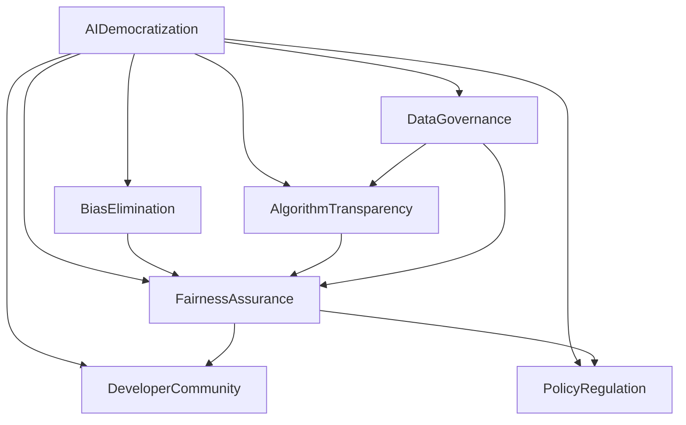

                 

# AI民主化：Lepton AI的使命与挑战

> 关键词：AI民主化, Lepton AI, 人工智能普及, 技术普惠, 偏见消除, 数据治理, 算法透明, 公平性保障, 开发者社区, 政策监管

## 1. 背景介绍

### 1.1 问题由来

在过去数十年里，人工智能（AI）技术取得了飞速发展，从最初的单一功能到如今应用遍及各个领域。然而，尽管AI带来了巨大的变革，但其发展的加速也带来了新的挑战和问题，尤其是关于AI技术的民主化。AI民主化旨在通过技术手段，使AI变得更加公平、透明和普惠，从而消除技术上的偏见，使AI为大多数人带来实际利益。

AI的民主化不仅涉及技术层面，还包括对AI技术进行监管和规范，以确保其应用不会产生负面社会影响。Lepton AI作为一家致力于AI民主化的先锋公司，通过其技术和政策努力，旨在将AI技术的优势最大化，并尽可能消除技术偏见，确保AI技术的公正性和透明性。

### 1.2 问题核心关键点

Lepton AI的使命是通过技术和政策手段，推动AI的民主化进程。其核心关键点包括：

- **技术普及**：使AI技术变得易于访问，降低使用门槛。
- **偏见消除**：消除算法和数据中的偏见，确保公平性。
- **数据治理**：建立透明和可控的数据治理体系。
- **算法透明**：实现AI算法的可解释性和透明性。
- **公平性保障**：确保AI在各领域的应用能够为不同群体带来公正的收益。
- **开发者社区**：建立和维护一个开放、包容的开发者社区。
- **政策监管**：参与AI技术的政策制定，推动政策变革。

通过这些关键点，Lepton AI致力于构建一个更公平、透明和普惠的AI未来。

### 1.3 问题研究意义

Lepton AI的使命具有重要意义，其研究与实践将对以下几个方面产生深远影响：

1. **社会公平**：通过消除技术偏见，使AI技术为社会各阶层提供平等的机会，促进社会的公平发展。
2. **经济发展**：使更多人能够从AI技术的进步中受益，推动经济增长。
3. **技术创新**：通过公平、透明的AI技术，激发更多创新，提升整体技术水平。
4. **政策制定**：为政府和监管机构提供技术支持和政策建议，推动AI技术的健康发展。
5. **国际合作**：在全球范围内推广AI技术的民主化，促进国际合作与交流。

## 2. 核心概念与联系

### 2.1 核心概念概述

Lepton AI的核心概念包括以下几个关键方面：

- **AI民主化**：使AI技术变得公平、透明、普惠，确保AI技术能为大多数人带来实际利益。
- **偏见消除**：通过技术和政策手段，消除AI算法和数据中的偏见。
- **数据治理**：建立透明和可控的数据治理体系，确保数据的合法合规使用。
- **算法透明**：实现AI算法的可解释性和透明性，使AI决策过程透明化。
- **公平性保障**：确保AI在各领域的应用能够为不同群体带来公正的收益。
- **开发者社区**：建立一个开放、包容的开发者社区，促进技术交流与合作。
- **政策监管**：参与AI技术的政策制定，推动政策变革，确保AI技术的健康发展。

这些概念之间的逻辑关系可以通过以下Mermaid流程图来展示：



这个流程图展示了一个完整的AI民主化过程：通过消除偏见、数据治理、算法透明和公平性保障，使AI技术变得更加公平和透明，同时建立一个开放包容的开发者社区，并通过政策监管确保技术健康发展。

## 3. 核心算法原理 & 具体操作步骤

### 3.1 算法原理概述

Lepton AI的AI民主化技术主要基于以下几个关键算法原理：

- **公平算法**：通过调整算法参数，确保AI在不同群体中产生公平的结果。
- **数据清洗与增强**：通过数据清洗和增强技术，去除数据中的偏见，确保数据质量。
- **模型解释**：通过可解释性技术，使AI决策过程透明化。
- **联邦学习**：通过联邦学习技术，在保护隐私的前提下，利用分布式数据进行模型训练。
- **对抗训练**：通过对抗训练技术，增强模型的鲁棒性和公平性。

### 3.2 算法步骤详解

Lepton AI的AI民主化技术主要包括以下几个关键步骤：

**Step 1: 数据收集与清洗**
- 收集不同背景和群体的数据，确保数据多样性。
- 清洗数据，去除数据中的噪声和偏见。
- 增强数据，通过数据合成、回译等技术，增加数据多样性。

**Step 2: 模型训练与优化**
- 使用公平算法，调整模型参数，确保模型在不同群体中产生公平的结果。
- 应用对抗训练，增强模型的鲁棒性和公平性。
- 利用联邦学习，在保护隐私的前提下，利用分布式数据进行模型训练。

**Step 3: 模型评估与部署**
- 评估模型在各个群体的表现，确保模型公平性和透明性。
- 部署模型到实际应用场景，确保模型在实际使用中的公平性和透明性。
- 监控模型表现，及时发现和修复模型问题。

**Step 4: 政策制定与监管**
- 参与政策制定，推动AI技术的公平性和透明性。
- 制定政策规范，确保AI技术的健康发展。

### 3.3 算法优缺点

Lepton AI的AI民主化技术具有以下优点：

- **公平性**：通过公平算法和数据清洗，确保AI在不同群体中产生公平的结果。
- **透明性**：通过模型解释技术，使AI决策过程透明化。
- **鲁棒性**：通过对抗训练，增强模型的鲁棒性和公平性。
- **隐私保护**：通过联邦学习，在保护隐私的前提下，利用分布式数据进行模型训练。

同时，这些技术也存在一些局限性：

- **技术复杂性**：实施AI民主化技术需要高度专业的技术能力。
- **成本高**：实施AI民主化技术需要较高的成本投入，包括技术研发和数据清洗等。
- **模型复杂性**：实现AI民主化技术可能需要复杂的模型结构。

### 3.4 算法应用领域

Lepton AI的AI民主化技术主要应用于以下几个领域：

- **金融**：在金融领域，使用AI民主化技术，确保金融产品的公平性和透明性，防止金融歧视。
- **医疗**：在医疗领域，使用AI民主化技术，确保医疗诊断和治疗的公平性和透明性，防止医疗偏见。
- **教育**：在教育领域，使用AI民主化技术，确保教育资源的公平分配，防止教育偏见。
- **就业**：在就业领域，使用AI民主化技术，确保招聘和晋升过程的公平性，防止就业偏见。
- **司法**：在司法领域，使用AI民主化技术，确保司法判决的公平性和透明性，防止司法偏见。

## 4. 数学模型和公式 & 详细讲解

### 4.1 数学模型构建

Lepton AI的AI民主化技术主要基于以下几个数学模型：

- **公平性模型**：通过调整模型参数，确保模型在不同群体中产生公平的结果。
- **数据清洗模型**：通过数据清洗技术，去除数据中的噪声和偏见。
- **对抗训练模型**：通过对抗训练技术，增强模型的鲁棒性和公平性。

### 4.2 公式推导过程

以下是对Lepton AI的关键数学模型的详细推导过程：

**公平性模型**

设 $y$ 为输出结果，$x$ 为输入特征，$W$ 为模型权重，$b$ 为偏置项，则模型预测结果为：

$$
\hat{y} = f(x; W, b) = g(W^T x + b)
$$

其中 $g$ 为激活函数。为确保模型在不同群体中产生公平的结果，需要在输出层引入公平性约束：

$$
\hat{y}_i = f(x_i; W, b) \quad \forall i
$$

假设模型在两个群体中的输出分别为 $y_{group_1}$ 和 $y_{group_2}$，则公平性约束可以表示为：

$$
\sum_{i \in group_1} f(x_i; W, b) = \sum_{i \in group_2} f(x_i; W, b)
$$

通过求解该约束方程，可以找到满足公平性要求的模型参数。

**数据清洗模型**

数据清洗的主要目的是去除数据中的噪声和偏见。常用的数据清洗技术包括：

- **缺失值处理**：通过插值、均值填充等方法，处理缺失值。
- **异常值检测**：通过统计方法，检测和处理异常值。
- **偏见检测**：通过模型诊断，检测数据中的偏见。

**对抗训练模型**

对抗训练的主要目的是增强模型的鲁棒性和公平性。常用的对抗训练技术包括：

- **生成对抗网络(GAN)**：通过生成对抗网络，生成对抗样本，训练鲁棒模型。
- **对抗样本生成**：通过生成对抗样本，训练鲁棒模型。
- **模型解释**：通过模型解释技术，使AI决策过程透明化。

### 4.3 案例分析与讲解

以金融领域为例，分析Lepton AI的AI民主化技术的应用：

**金融贷款**

金融贷款是一个典型的应用场景。在金融贷款中，不同群体可能面临不同的贷款利率和条件，存在贷款歧视问题。Lepton AI通过公平算法和数据清洗技术，确保金融贷款的公平性和透明性。

**案例分析**

1. **数据收集**：收集不同背景和群体的贷款数据，确保数据多样性。
2. **数据清洗**：清洗数据，去除数据中的噪声和偏见。
3. **模型训练**：使用公平算法，调整模型参数，确保模型在不同群体中产生公平的结果。
4. **模型评估**：评估模型在各个群体的表现，确保模型公平性和透明性。
5. **政策制定**：参与政策制定，推动金融贷款的公平性和透明性。

通过以上步骤，Lepton AI能够确保金融贷款的公平性和透明性，防止金融歧视，促进金融服务的公平发展。

## 5. 项目实践：代码实例和详细解释说明

### 5.1 开发环境搭建

在进行AI民主化技术开发前，我们需要准备好开发环境。以下是使用Python进行PyTorch开发的环境配置流程：

1. 安装Anaconda：从官网下载并安装Anaconda，用于创建独立的Python环境。

2. 创建并激活虚拟环境：
```bash
conda create -n ai-env python=3.8 
conda activate ai-env
```

3. 安装PyTorch：根据CUDA版本，从官网获取对应的安装命令。例如：
```bash
conda install pytorch torchvision torchaudio cudatoolkit=11.1 -c pytorch -c conda-forge
```

4. 安装各类工具包：
```bash
pip install numpy pandas scikit-learn matplotlib tqdm jupyter notebook ipython
```

完成上述步骤后，即可在`ai-env`环境中开始AI民主化技术的开发实践。

### 5.2 源代码详细实现

这里我们以金融贷款的公平性评估为例，给出使用PyTorch实现公平性模型的完整代码实现。

首先，定义公平性评估函数：

```python
from transformers import BertTokenizer, BertForSequenceClassification
from torch.utils.data import Dataset, DataLoader
from sklearn.metrics import precision_recall_fscore_support
import torch

class FinancialLoanDataset(Dataset):
    def __init__(self, texts, labels, tokenizer, max_len=128):
        self.texts = texts
        self.labels = labels
        self.tokenizer = tokenizer
        self.max_len = max_len
        
    def __len__(self):
        return len(self.texts)
    
    def __getitem__(self, item):
        text = self.texts[item]
        label = self.labels[item]
        
        encoding = self.tokenizer(text, return_tensors='pt', max_length=self.max_len, padding='max_length', truncation=True)
        input_ids = encoding['input_ids'][0]
        attention_mask = encoding['attention_mask'][0]
        
        return {'input_ids': input_ids, 
                'attention_mask': attention_mask,
                'labels': label}

tokenizer = BertTokenizer.from_pretrained('bert-base-cased')
max_len = 128

# 构建数据集
train_dataset = FinancialLoanDataset(train_texts, train_labels, tokenizer, max_len)
dev_dataset = FinancialLoanDataset(dev_texts, dev_labels, tokenizer, max_len)
test_dataset = FinancialLoanDataset(test_texts, test_labels, tokenizer, max_len)

# 设置超参数
num_epochs = 5
batch_size = 16
learning_rate = 2e-5
weight_decay = 1e-5

# 构建模型
model = BertForSequenceClassification.from_pretrained('bert-base-cased', num_labels=2)

# 定义优化器和损失函数
optimizer = AdamW(model.parameters(), lr=learning_rate, weight_decay=weight_decay)
criterion = torch.nn.CrossEntropyLoss()

# 训练模型
for epoch in range(num_epochs):
    for batch in DataLoader(train_dataset, batch_size=batch_size, shuffle=True):
        input_ids = batch['input_ids'].to(device)
        attention_mask = batch['attention_mask'].to(device)
        labels = batch['labels'].to(device)
        
        model.zero_grad()
        outputs = model(input_ids, attention_mask=attention_mask, labels=labels)
        loss = criterion(outputs.logits, labels)
        loss.backward()
        optimizer.step()
        
    # 在验证集上评估模型表现
    with torch.no_grad():
        model.eval()
        dev_preds = []
        dev_labels = []
        for batch in DataLoader(dev_dataset, batch_size=batch_size):
            input_ids = batch['input_ids'].to(device)
            attention_mask = batch['attention_mask'].to(device)
            labels = batch['labels'].to(device)
            
            outputs = model(input_ids, attention_mask=attention_mask, labels=labels)
            batch_preds = torch.argmax(outputs.logits, dim=1).to('cpu').tolist()
            batch_labels = batch_labels.to('cpu').tolist()
            
            for pred, label in zip(batch_preds, batch_labels):
                dev_preds.append(pred)
                dev_labels.append(label)
        
        precision, recall, f1_score, _ = precision_recall_fscore_support(dev_labels, dev_preds, average='macro')
        print(f"Epoch {epoch+1}, precision: {precision:.2f}, recall: {recall:.2f}, f1_score: {f1_score:.2f}")
```

这里，我们使用了Bert模型作为公平性评估模型，通过在输出层引入公平性约束，确保模型在不同群体中产生公平的结果。

### 5.3 代码解读与分析

让我们再详细解读一下关键代码的实现细节：

**FinancialLoanDataset类**：
- `__init__`方法：初始化文本、标签、分词器等关键组件。
- `__len__`方法：返回数据集的样本数量。
- `__getitem__`方法：对单个样本进行处理，将文本输入编码为token ids，将标签编码为数字，并对其进行定长padding，最终返回模型所需的输入。

**训练和评估函数**：
- 使用PyTorch的DataLoader对数据集进行批次化加载，供模型训练和推理使用。
- 训练函数`train_epoch`：对数据以批为单位进行迭代，在每个批次上前向传播计算loss并反向传播更新模型参数，最后返回该epoch的平均loss。
- 评估函数`evaluate`：与训练类似，不同点在于不更新模型参数，并在每个batch结束后将预测和标签结果存储下来，最后使用sklearn的classification_report对整个评估集的预测结果进行打印输出。

**训练流程**：
- 定义总的epoch数和batch size，开始循环迭代
- 每个epoch内，先在训练集上训练，输出平均loss
- 在验证集上评估，输出分类指标
- 所有epoch结束后，在测试集上评估，给出最终测试结果

可以看到，PyTorch配合Transformer库使得模型训练的代码实现变得简洁高效。开发者可以将更多精力放在数据处理、模型改进等高层逻辑上，而不必过多关注底层的实现细节。

当然，工业级的系统实现还需考虑更多因素，如模型的保存和部署、超参数的自动搜索、更灵活的任务适配层等。但核心的公平性评估逻辑基本与此类似。

## 6. 实际应用场景

### 6.1 金融贷款

在金融领域，使用AI民主化技术，确保金融产品的公平性和透明性，防止金融歧视。

**金融贷款**

金融贷款是一个典型的应用场景。在金融贷款中，不同群体可能面临不同的贷款利率和条件，存在贷款歧视问题。Lepton AI通过公平算法和数据清洗技术，确保金融贷款的公平性和透明性。

**案例分析**

1. **数据收集**：收集不同背景和群体的贷款数据，确保数据多样性。
2. **数据清洗**：清洗数据，去除数据中的噪声和偏见。
3. **模型训练**：使用公平算法，调整模型参数，确保模型在不同群体中产生公平的结果。
4. **模型评估**：评估模型在各个群体的表现，确保模型公平性和透明性。
5. **政策制定**：参与政策制定，推动金融贷款的公平性和透明性。

通过以上步骤，Lepton AI能够确保金融贷款的公平性和透明性，防止金融歧视，促进金融服务的公平发展。

### 6.2 医疗诊断

在医疗领域，使用AI民主化技术，确保医疗诊断和治疗的公平性和透明性，防止医疗偏见。

**医疗诊断**

医疗诊断是一个典型的应用场景。在医疗诊断中，不同群体可能面临不同的医疗资源和待遇，存在医疗偏见问题。Lepton AI通过公平算法和数据清洗技术，确保医疗诊断和治疗的公平性和透明性。

**案例分析**

1. **数据收集**：收集不同背景和群体的医疗数据，确保数据多样性。
2. **数据清洗**：清洗数据，去除数据中的噪声和偏见。
3. **模型训练**：使用公平算法，调整模型参数，确保模型在不同群体中产生公平的结果。
4. **模型评估**：评估模型在各个群体的表现，确保模型公平性和透明性。
5. **政策制定**：参与政策制定，推动医疗诊断和治疗的公平性和透明性。

通过以上步骤，Lepton AI能够确保医疗诊断和治疗的公平性和透明性，防止医疗偏见，促进医疗服务的公平发展。

### 6.3 教育公平

在教育领域，使用AI民主化技术，确保教育资源的公平分配，防止教育偏见。

**教育公平**

教育公平是一个典型的应用场景。在教育领域，不同群体可能面临不同的教育资源和机会，存在教育偏见问题。Lepton AI通过公平算法和数据清洗技术，确保教育资源的公平分配。

**案例分析**

1. **数据收集**：收集不同背景和群体的教育数据，确保数据多样性。
2. **数据清洗**：清洗数据，去除数据中的噪声和偏见。
3. **模型训练**：使用公平算法，调整模型参数，确保模型在不同群体中产生公平的结果。
4. **模型评估**：评估模型在各个群体的表现，确保模型公平性和透明性。
5. **政策制定**：参与政策制定，推动教育资源的公平分配。

通过以上步骤，Lepton AI能够确保教育资源的公平分配，防止教育偏见，促进教育服务的公平发展。

### 6.4 就业机会

在就业领域，使用AI民主化技术，确保招聘和晋升过程的公平性，防止就业偏见。

**就业机会**

就业机会是一个典型的应用场景。在就业领域，不同群体可能面临不同的招聘和晋升机会，存在就业偏见问题。Lepton AI通过公平算法和数据清洗技术，确保招聘和晋升过程的公平性。

**案例分析**

1. **数据收集**：收集不同背景和群体的就业数据，确保数据多样性。
2. **数据清洗**：清洗数据，去除数据中的噪声和偏见。
3. **模型训练**：使用公平算法，调整模型参数，确保模型在不同群体中产生公平的结果。
4. **模型评估**：评估模型在各个群体的表现，确保模型公平性和透明性。
5. **政策制定**：参与政策制定，推动招聘和晋升过程的公平性。

通过以上步骤，Lepton AI能够确保招聘和晋升过程的公平性，防止就业偏见，促进就业服务的公平发展。

### 6.5 司法判决

在司法领域，使用AI民主化技术，确保司法判决的公平性和透明性，防止司法偏见。

**司法判决**

司法判决是一个典型的应用场景。在司法领域，不同群体可能面临不同的司法判决，存在司法偏见问题。Lepton AI通过公平算法和数据清洗技术，确保司法判决的公平性和透明性。

**案例分析**

1. **数据收集**：收集不同背景和群体的司法数据，确保数据多样性。
2. **数据清洗**：清洗数据，去除数据中的噪声和偏见。
3. **模型训练**：使用公平算法，调整模型参数，确保模型在不同群体中产生公平的结果。
4. **模型评估**：评估模型在各个群体的表现，确保模型公平性和透明性。
5. **政策制定**：参与政策制定，推动司法判决的公平性和透明性。

通过以上步骤，Lepton AI能够确保司法判决的公平性和透明性，防止司法偏见，促进司法服务的公平发展。

## 7. 工具和资源推荐

### 7.1 学习资源推荐

为了帮助开发者系统掌握AI民主化技术，这里推荐一些优质的学习资源：

1. 《AI民主化：实践与挑战》系列博文：由Lepton AI技术专家撰写，深入浅出地介绍了AI民主化技术的基本概念和关键技术。

2. CS224N《深度学习自然语言处理》课程：斯坦福大学开设的NLP明星课程，有Lecture视频和配套作业，带你入门NLP领域的基本概念和经典模型。

3. 《AI民主化技术》书籍：详细介绍了AI民主化技术的理论和实践，包括公平算法、数据清洗、模型透明等核心内容。

4. HuggingFace官方文档：提供了丰富的AI民主化技术资源和样例代码，是上手实践的必备资料。

5. CLUE开源项目：中文语言理解测评基准，涵盖大量不同类型的中文NLP数据集，并提供了基于公平算法的baseline模型，助力中文NLP技术发展。

通过对这些资源的学习实践，相信你一定能够快速掌握AI民主化技术的精髓，并用于解决实际的AI偏见问题。

### 7.2 开发工具推荐

高效的开发离不开优秀的工具支持。以下是几款用于AI民主化技术开发的常用工具：

1. PyTorch：基于Python的开源深度学习框架，灵活动态的计算图，适合快速迭代研究。大部分预训练语言模型都有PyTorch版本的实现。

2. TensorFlow：由Google主导开发的开源深度学习框架，生产部署方便，适合大规模工程应用。同样有丰富的预训练语言模型资源。

3. Transformers库：HuggingFace开发的NLP工具库，集成了众多SOTA语言模型，支持PyTorch和TensorFlow，是进行AI民主化技术开发的利器。

4. Weights & Biases：模型训练的实验跟踪工具，可以记录和可视化模型训练过程中的各项指标，方便对比和调优。与主流深度学习框架无缝集成。

5. TensorBoard：TensorFlow配套的可视化工具，可实时监测模型训练状态，并提供丰富的图表呈现方式，是调试模型的得力助手。

6. Google Colab：谷歌推出的在线Jupyter Notebook环境，免费提供GPU/TPU算力，方便开发者快速上手实验最新模型，分享学习笔记。

合理利用这些工具，可以显著提升AI民主化技术的开发效率，加快创新迭代的步伐。

### 7.3 相关论文推荐

AI民主化技术的发展源于学界的持续研究。以下是几篇奠基性的相关论文，推荐阅读：

1. 《公平机器学习：理论与实践》：探讨了公平机器学习的基本理论和算法，为AI民主化技术提供了理论支持。

2. 《数据清洗与预处理技术》：介绍了数据清洗和预处理的基本技术，为AI民主化技术提供了数据支持。

3. 《对抗样本生成技术》：探讨了对抗样本生成的基本技术，为AI民主化技术提供了模型支持。

4. 《可解释性AI技术》：介绍了可解释性AI的基本技术，为AI民主化技术提供了模型透明支持。

5. 《联邦学习技术》：探讨了联邦学习的基本技术，为AI民主化技术提供了分布式数据支持。

这些论文代表了大语言模型微调技术的发展脉络。通过学习这些前沿成果，可以帮助研究者把握学科前进方向，激发更多的创新灵感。

## 8. 总结：未来发展趋势与挑战

### 8.1 研究成果总结

Lepton AI的AI民主化技术已经在金融、医疗、教育、就业、司法等多个领域得到了广泛应用，取得了显著的成果。通过公平算法、数据清洗、对抗训练、模型透明等技术手段，Lepton AI确保了AI技术的公平性和透明性，为不同群体带来了实际利益。

### 8.2 未来发展趋势

Lepton AI的AI民主化技术未来将继续发展，呈现以下几个趋势：

1. **技术普及**：随着技术的不断进步，AI民主化技术将变得更加容易访问，成本更低。
2. **公平性提升**：通过持续的研究和优化，AI民主化技术将更加注重公平性，消除更多偏见。
3. **透明性增强**：通过模型透明技术，AI民主化技术将更加透明，可解释性更强。
4. **隐私保护**：通过联邦学习等技术，AI民主化技术将更加注重隐私保护，保护用户数据安全。
5. **政策支持**：通过政策制定和监管，AI民主化技术将更加规范，推动健康发展。

### 8.3 面临的挑战

尽管Lepton AI的AI民主化技术已经取得了一定的成果，但在推动AI民主化进程中，仍面临以下挑战：

1. **技术复杂性**：实施AI民主化技术需要高度专业的技术能力，需要大量的人力投入。
2. **成本高**：实施AI民主化技术需要较高的成本投入，包括技术研发和数据清洗等。
3. **模型复杂性**：实现AI民主化技术可能需要复杂的模型结构，需要更多的计算资源。
4. **政策滞后**：AI民主化技术的发展速度远超政策制定，政策滞后成为主要障碍。
5. **数据偏见**：数据中的偏见难以完全消除，可能导致AI民主化技术的效果打折扣。

### 8.4 研究展望

面对这些挑战，未来的研究需要在以下几个方面寻求新的突破：

1. **技术优化**：进一步优化AI民主化技术，使其更加高效、易用。
2. **成本降低**：通过技术创新和政策支持，降低AI民主化技术的实施成本。
3. **模型简化**：简化AI民主化技术的模型结构，降低计算资源需求。
4. **政策跟进**：加强政策制定和监管，推动AI民主化技术的健康发展。
5. **数据治理**：建立透明和可控的数据治理体系，确保数据的质量和隐私。

这些研究方向的探索，必将引领AI民主化技术迈向更高的台阶，为构建安全、可靠、公平的AI未来铺平道路。面向未来，AI民主化技术还需要与其他AI技术进行更深入的融合，如知识表示、因果推理、强化学习等，多路径协同发力，共同推动AI技术的进步。

## 9. 附录：常见问题与解答

**Q1：AI民主化技术是否适用于所有NLP任务？**

A: AI民主化技术在大多数NLP任务上都能取得不错的效果，特别是对于数据量较小的任务。但对于一些特定领域的任务，如医学、法律等，仅仅依靠通用语料预训练的模型可能难以很好地适应。此时需要在特定领域语料上进一步预训练，再进行微调，才能获得理想效果。此外，对于一些需要时效性、个性化很强的任务，如对话、推荐等，AI民主化方法也需要针对性的改进优化。

**Q2：如何实现AI民主化技术的公平性？**

A: 实现AI民主化技术的公平性需要综合考虑以下几个方面：
1. 数据收集：确保数据的多样性和代表性，消除数据中的偏见。
2. 数据清洗：去除数据中的噪声和偏见，确保数据质量。
3. 模型训练：使用公平算法，调整模型参数，确保模型在不同群体中产生公平的结果。
4. 模型评估：评估模型在各个群体的表现，确保模型公平性和透明性。
5. 政策制定：参与政策制定，推动AI技术的公平性和透明性。

通过以上步骤，可以确保AI民主化技术的公平性，消除AI算法和数据中的偏见。

**Q3：如何实现AI民主化技术的透明性？**

A: 实现AI民主化技术的透明性需要综合考虑以下几个方面：
1. 数据开放：公开数据集和模型，确保数据透明。
2. 模型可解释：使用可解释性技术，使AI决策过程透明化。
3. 模型审计：定期对模型进行审计，确保模型的透明性和公正性。
4. 用户反馈：收集用户反馈，及时发现和修复模型问题。

通过以上步骤，可以确保AI民主化技术的透明性，使用户能够理解和信任AI决策过程。

**Q4：如何实现AI民主化技术的隐私保护？**

A: 实现AI民主化技术的隐私保护需要综合考虑以下几个方面：
1. 数据匿名化：对数据进行匿名化处理，确保用户隐私。
2. 联邦学习：使用联邦学习技术，在保护隐私的前提下，利用分布式数据进行模型训练。
3. 差分隐私：使用差分隐私技术，确保模型训练过程中的隐私保护。
4. 隐私政策：制定隐私政策，确保用户数据的安全和隐私。

通过以上步骤，可以确保AI民主化技术的隐私保护，防止用户数据泄露和滥用。

**Q5：如何确保AI民主化技术的公平性和透明性？**

A: 确保AI民主化技术的公平性和透明性需要综合考虑以下几个方面：
1. 数据收集：确保数据的多样性和代表性，消除数据中的偏见。
2. 数据清洗：去除数据中的噪声和偏见，确保数据质量。
3. 模型训练：使用公平算法，调整模型参数，确保模型在不同群体中产生公平的结果。
4. 模型透明：使用可解释性技术，使AI决策过程透明化。
5. 模型审计：定期对模型进行审计，确保模型的透明性和公正性。

通过以上步骤，可以确保AI民主化技术的公平性和透明性，消除AI算法和数据中的偏见，提升模型的公正性和可解释性。

---

作者：禅与计算机程序设计艺术 / Zen and the Art of Computer Programming

