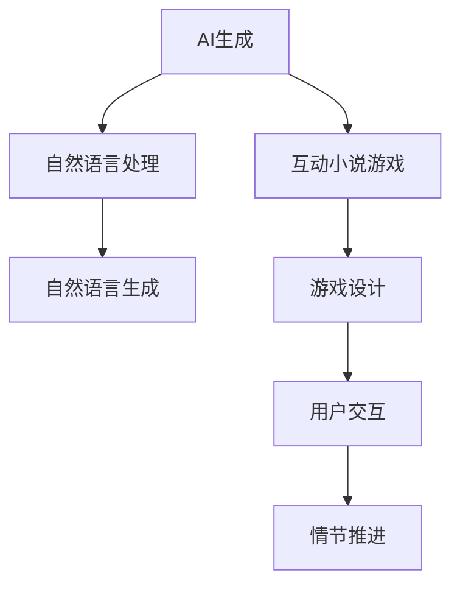

                 

# AI生成的互动小说游戏：故事与游戏的融合

> 关键词：AI生成,互动小说游戏,故事与游戏融合,自然语言处理,自然语言生成,游戏开发

## 1. 背景介绍

### 1.1 问题由来
近年来，随着人工智能技术的快速发展，AI在自然语言处理(NLP)和自然语言生成(NLG)领域取得了显著进展。特别是预训练语言模型如GPT-3等，展现了强大的文本生成能力，对文学、游戏等行业产生了深远影响。其中，互动小说游戏作为一个以故事为中心的游戏类型，需要高度自然流畅的对话和丰富的剧情发展。AI生成的互动小说游戏（AI-generated Interactive Fiction Games），结合了故事生成的创新能力和游戏设计的交互性，成为NLP和游戏领域的热点研究方向。

### 1.2 问题核心关键点
AI生成的互动小说游戏主要围绕如何利用AI技术生成丰富、连贯的故事内容，并通过用户互动来推进游戏进程。核心问题包括：
1. **故事生成**：如何通过AI生成既符合游戏世界观又吸引玩家的故事。
2. **对话生成**：如何生成自然流畅、符合角色性格的对话。
3. **情节推进**：如何设计机制让AI生成的故事能够引导玩家做出选择，从而推进情节。
4. **用户互动**：如何通过AI技术提高玩家的游戏体验，使其感觉像是在与真人互动。

### 1.3 问题研究意义
AI生成的互动小说游戏不仅能够拓展AI应用场景，提升用户体验，还能够促进NLP和游戏设计的交叉创新。通过这种创新，AI技术在娱乐和教育中的应用得到了新的突破，为构建沉浸式、智能化的游戏体验提供了新的可能。

## 2. 核心概念与联系

### 2.1 核心概念概述

为更好地理解AI生成的互动小说游戏，本节将介绍几个关键概念：

- **AI生成**：通过机器学习、自然语言处理等技术，自动生成文本内容。
- **互动小说游戏**：一种以文本互动为核心的游戏类型，玩家通过阅读文本和选择选项来进行游戏。
- **自然语言处理**：处理和理解人类语言的技术，包括分词、句法分析、语义理解等。
- **自然语言生成**：生成符合语法和语义规则的文本内容，是AI生成互动小说的核心技术之一。
- **游戏设计**：包括游戏规则、角色设定、情节推进等，是构建互动小说游戏的关键。
- **用户交互**：玩家通过与游戏系统的互动，影响游戏进程和结局，提升游戏沉浸感。

这些核心概念之间的逻辑关系可以通过以下Mermaid流程图来展示：



这个流程图展示了AI生成、自然语言处理、自然语言生成与互动小说游戏的联系，以及如何通过游戏设计和用户交互来构建故事。

## 3. 核心算法原理 & 具体操作步骤
### 3.1 算法原理概述

AI生成的互动小说游戏的核心在于如何通过自然语言处理和自然语言生成技术，自动化地生成吸引玩家的故事情节和对话。这一过程大致可以分为以下几个步骤：

1. **故事背景生成**：通过自然语言处理技术，自动生成游戏世界的背景设定。
2. **角色设定**：为玩家选择或自动生成具有不同性格和背景的角色。
3. **情节规划**：利用规则引擎设计游戏情节推进的逻辑，包括玩家的选择影响和随机事件。
4. **对话生成**：根据当前情境和角色性格，自动生成自然流畅的对话。
5. **剧情发展**：基于玩家的选择和角色行动，动态生成游戏剧情。
6. **结局生成**：根据玩家的最终选择和情节发展，生成多个可能的结局。

### 3.2 算法步骤详解

以下是具体的算法步骤：

**Step 1: 构建游戏世界背景**
- 使用文本生成模型，自动生成游戏世界的背景设定。可以通过无监督或监督学习的方法训练模型。
- 对于无监督学习，可以使用GPT-3等模型，输入一些示例背景文本，训练模型生成类似风格的文本。
- 对于监督学习，可以提供带标签的背景文本数据，指导模型生成符合特定风格的故事背景。

**Step 2: 设计角色和设定**
- 为玩家提供角色选择界面，或者通过AI自动生成角色。
- 利用NLP技术，分析角色对话历史，自动调整角色的性格和语言风格，使其符合当前情境。
- 设定角色的初始状态和目标，为情节推进提供基础。

**Step 3: 规划情节推进**
- 设计规则引擎，定义玩家的选择如何影响情节发展。
- 引入随机事件，增加游戏的可玩性和不可预测性。
- 设计多个分支剧情，提供丰富的结局选择。

**Step 4: 生成对话和剧情**
- 根据当前情境和角色性格，利用对话生成模型生成自然流畅的对话。
- 结合情节推进规则，动态生成剧情，更新角色状态和游戏世界。
- 不断循环执行，直到玩家做出最终选择。

**Step 5: 生成结局**
- 根据玩家的选择和剧情发展，生成多个可能的结局。
- 利用情感分析技术，评估每个结局的情感倾向，提供情感丰富、吸引人的结局选项。
- 允许玩家选择结局，并展示相应的结局描述。

### 3.3 算法优缺点

AI生成的互动小说游戏具有以下优点：
1. **效率高**：通过自动化生成，快速构建复杂的游戏世界和故事情节。
2. **灵活性**：可以根据玩家的选择，动态生成不同剧情和结局，提供多样化的游戏体验。
3. **创新性**：结合自然语言处理和自然语言生成技术，探索新的游戏设计和故事叙述方式。

同时，该方法也存在一定的局限性：
1. **质量不稳定**：自动生成的文本可能存在语法错误、逻辑不连贯等问题。
2. **依赖数据**：需要大量标注数据训练对话生成模型，生成高质量对话的难度较大。
3. **玩家适应**：部分玩家可能对自动生成的对话和情节不太适应，影响游戏体验。

尽管存在这些局限性，AI生成的互动小说游戏仍然具有巨大的潜力和市场前景，值得进一步研究和优化。

### 3.4 算法应用领域

AI生成的互动小说游戏已经在文学创作、教育游戏、企业培训等多个领域得到应用，展示了其广泛的应用价值：

- **文学创作**：通过AI生成故事大纲和情节，辅助作者快速构思和创作长篇小说或短篇故事。
- **教育游戏**：设计互动小说游戏作为教育工具，通过沉浸式学习提升学生的语言理解和文学鉴赏能力。
- **企业培训**：开发互动小说游戏，提供情境模拟和角色扮演，帮助员工在虚拟环境中学习和提升技能。
- **心理治疗**：结合心理学的理论和实践，开发互动小说游戏作为心理治疗的辅助工具，帮助患者在互动中缓解压力和情感问题。

## 4. 数学模型和公式 & 详细讲解 & 举例说明

### 4.1 数学模型构建

假设有一个互动小说游戏，玩家通过选择选项来推进情节，游戏世界由一个语言模型 $M$ 描述。玩家的选择和游戏世界的互动可以表示为序列 $(x_1, a_1, x_2, a_2, ..., x_n, a_n)$，其中 $x_i$ 表示当前情境的描述，$a_i$ 表示玩家的选择。

我们定义一个函数 $f$ 来计算玩家的选择对游戏世界的直接影响，例如：
$$
f(x_i, a_i) = \begin{cases} 
x_{i+1} & \text{如果 } a_i \text{ 对 } x_{i+1} 有直接影响 \\
x_i & \text{如果 } a_i \text{ 对 } x_{i+1} 没有直接影响 
\end{cases}
$$

在每一步中，游戏世界 $x_i$ 由自然语言处理模型 $M$ 生成，玩家的选择 $a_i$ 通过自然语言生成模型 $G$ 自动生成。游戏情节推进的逻辑可以表示为：
$$
x_{i+1} = M(x_i)
$$

### 4.2 公式推导过程

在实际应用中，我们需要将上述抽象模型具体化。例如，可以通过序列到序列模型来实现玩家选择到游戏世界变化的映射。给定一个当前情境 $x_i$ 和玩家选择 $a_i$，我们可以使用Seq2Seq模型将 $a_i$ 映射到新的情境 $x_{i+1}$：
$$
x_{i+1} = M(x_i, a_i)
$$

其中，$M$ 为Seq2Seq模型的编码器和解码器，$a_i$ 通过自然语言生成模型 $G$ 生成。

为了确保生成的对话和剧情连贯自然，我们可以使用Transformer等先进模型，结合上下文信息进行文本生成。假设使用Transformer模型生成对话，其公式为：
$$
a_i = G(x_i, x_{i-1}, ..., x_1)
$$

其中，$G$ 为Transformer模型，$x_{i-1}, ..., x_1$ 为对话历史。

### 4.3 案例分析与讲解

以一个简单的互动小说游戏为例，玩家在一个神秘的森林中探索。游戏世界由一个语言模型 $M$ 描述，玩家的每一个选择都影响着游戏世界的变化。例如，玩家可以选择向左或向右走，或者与某个NPC（Non-Player Character）交谈。这些选择通过自然语言生成模型 $G$ 自动生成。

假设玩家当前的情境为“你站在一条小河边，面前有两条路”，可以选择“向左走”或“向右走”。使用Transformer模型 $G$ 生成玩家的选择，再将这个选择输入到语言模型 $M$ 中，生成新的情境。例如：
$$
x_{i+1} = M(\text{"你站在一条小河边，面前有两条路"}, a_i)
$$

通过这种方式，游戏可以动态生成剧情，使玩家能够在不同的情境下做出选择，从而推进游戏进程。

## 5. 项目实践：代码实例和详细解释说明
### 5.1 开发环境搭建

在进行项目实践前，我们需要准备好开发环境。以下是使用Python进行PyTorch开发的环境配置流程：

1. 安装Anaconda：从官网下载并安装Anaconda，用于创建独立的Python环境。

2. 创建并激活虚拟环境：
```bash
conda create -n pytorch-env python=3.8 
conda activate pytorch-env
```

3. 安装PyTorch：根据CUDA版本，从官网获取对应的安装命令。例如：
```bash
conda install pytorch torchvision torchaudio cudatoolkit=11.1 -c pytorch -c conda-forge
```

4. 安装Transformers库：
```bash
pip install transformers
```

5. 安装各类工具包：
```bash
pip install numpy pandas scikit-learn matplotlib tqdm jupyter notebook ipython
```

完成上述步骤后，即可在`pytorch-env`环境中开始项目实践。

### 5.2 源代码详细实现

这里以一个简单的互动小说游戏为例，展示如何利用PyTorch和Transformers库进行项目开发。

首先，定义游戏世界和情节推进规则：

```python
import torch
from transformers import GPT2Tokenizer, GPT2LMHeadModel

class GameWorld:
    def __init__(self, model):
        self.model = model
        self.tokenizer = GPT2Tokenizer.from_pretrained('gpt2')
        
    def generate_context(self, text):
        input_ids = self.tokenizer.encode(text, return_tensors='pt')
        output_ids = self.model.generate(input_ids, max_length=50)
        return self.tokenizer.decode(output_ids[0], skip_special_tokens=True)
        
    def next_state(self, state, action):
        state, _ = self.generate_context(state + action)
        return state

# 定义情节推进规则
def next_state_rule(state, action):
    if action == 'left':
        return '你向左走，发现了一片荒废的村庄。'
    elif action == 'right':
        return '你向右走，发现了一条蜿蜒的小路。'
    else:
        return '你无法做出选择，停留在原地。'

# 初始化游戏世界
game_world = GameWorld(GPT2LMHeadModel.from_pretrained('gpt2'))
```

接下来，实现对话生成和用户互动：

```python
from transformers import GPT2Tokenizer, GPT2LMHeadModel
import random

class Player:
    def __init__(self, game_world):
        self.game_world = game_world
        self.tokenizer = GPT2Tokenizer.from_pretrained('gpt2')
        
    def generate_response(self, context):
        input_ids = self.tokenizer.encode(context, return_tensors='pt')
        output_ids = self.game_world.model.generate(input_ids, max_length=20, temperature=0.8)
        return self.tokenizer.decode(output_ids[0], skip_special_tokens=True)
        
    def choose_action(self, context):
        while True:
            action = self.generate_response(context)
            if action == 'left' or action == 'right':
                return action
            else:
                print('无效选择，请重新选择。')

# 玩家和游戏世界的交互
game_state = "你站在一条小河边，面前有两条路。"
player = Player(game_world)
while True:
    action = player.choose_action(game_state)
    game_state = next_state_rule(game_state, action)
    print(game_state)
```

在这个例子中，我们定义了一个简单的游戏世界，通过GPT-2模型生成对话，玩家通过选择“向左”或“向右”来进行游戏。

### 5.3 代码解读与分析

让我们再详细解读一下关键代码的实现细节：

**GameWorld类**：
- `__init__`方法：初始化游戏世界的语言模型和分词器。
- `generate_context`方法：通过语言模型生成新的情境。
- `next_state`方法：根据玩家的选择，更新游戏状态。

**Player类**：
- `__init__`方法：初始化玩家和游戏世界的交互。
- `generate_response`方法：使用语言模型生成对话。
- `choose_action`方法：引导玩家做出选择。

**游戏流程**：
- 玩家初始状态为“你站在一条小河边，面前有两条路。”
- 玩家通过选择“向左”或“向右”，游戏世界状态发生变化，玩家可以看到新的情境。
- 游戏无限循环，直到玩家做出选择或游戏结束。

这个代码实现展示了如何通过PyTorch和Transformers库，利用AI技术自动生成对话和剧情，从而实现一个简单的互动小说游戏。

## 6. 实际应用场景

### 6.1 教育游戏

AI生成的互动小说游戏在教育领域有着广泛的应用前景。传统的教育游戏通常依赖人工编写剧情和对话，开发成本高、更新频率低。而利用AI技术生成故事和对话，可以大大降低开发成本，提高游戏的多样性和更新速度。

例如，可以设计一个互动小说游戏，让学生在游戏中学习历史事件、科学概念等知识。通过游戏互动，学生可以更加沉浸式地学习，提升学习效果。

### 6.2 心理健康

互动小说游戏也可以作为心理健康治疗的工具。通过精心设计的故事情节和对话，引导患者在互动中缓解压力、释放情感。AI生成的故事可以根据患者的反馈，动态调整情节和对话，提供个性化的心理支持。

例如，可以开发一个互动小说游戏，通过角色扮演和情节推进，帮助患者处理焦虑、抑郁等问题。通过与NPC的互动，患者可以在虚拟环境中逐渐释放内心的压力和情感，获得心理上的支持和安慰。

### 6.3 创意写作

AI生成的互动小说游戏还可以作为创意写作的辅助工具。作家可以利用AI生成的故事大纲和情节，快速构思和创作长篇小说或短篇故事。AI生成的对话和描写也可以作为创作的灵感来源，提升创作效率和质量。

例如，作家可以设计一个互动小说游戏，在游戏中设定不同的情境和角色，通过与AI的互动，获得灵感和创意。游戏的情节和对话也可以作为创作素材，丰富小说的内容和情感深度。

## 7. 工具和资源推荐
### 7.1 学习资源推荐

为了帮助开发者系统掌握AI生成的互动小说游戏，这里推荐一些优质的学习资源：

1. 《自然语言处理入门》：介绍自然语言处理的基本概念和技术，适合初学者入门。
2. 《Transformer理论与实践》：深入讲解Transformer模型，结合实际案例进行详细讲解。
3. 《AI生成的文本游戏》：介绍AI生成的文本游戏的基础原理和开发方法。
4. 《互动小说游戏设计与开发》：结合NLP和游戏设计的理论，介绍互动小说游戏的开发技巧。
5. HuggingFace官方文档：提供丰富的预训练模型和代码示例，方便快速上手项目实践。

通过对这些资源的学习实践，相信你一定能够快速掌握AI生成的互动小说游戏的开发方法，并用于解决实际的NLP和游戏问题。
###  7.2 开发工具推荐

高效的开发离不开优秀的工具支持。以下是几款用于AI生成的互动小说游戏开发的常用工具：

1. PyTorch：基于Python的开源深度学习框架，灵活的计算图设计，适合深度学习任务的开发。
2. TensorFlow：由Google主导开发的深度学习框架，支持大规模工程应用。
3. Transformers库：HuggingFace开发的NLP工具库，提供丰富的预训练模型和API接口。
4. Weights & Biases：模型训练的实验跟踪工具，记录和可视化模型训练过程中的各项指标，方便调试和优化。
5. Google Colab：谷歌推出的在线Jupyter Notebook环境，免费提供GPU/TPU算力，方便快速实验和分享代码。
6. TensorBoard：TensorFlow配套的可视化工具，实时监测模型训练状态，提供丰富的图表展示。

合理利用这些工具，可以显著提升AI生成的互动小说游戏的开发效率，加快创新迭代的步伐。

### 7.3 相关论文推荐

AI生成的互动小说游戏的研究源于学界的持续探索。以下是几篇奠基性的相关论文，推荐阅读：

1. "AI生成的互动小说游戏"（AI-Generated Interactive Fiction Games）：介绍AI生成故事和对话的基本原理和方法。
2. "自然语言生成在互动小说游戏中的应用"（Natural Language Generation in Interactive Fiction Games）：探讨自然语言生成技术在互动小说游戏中的具体应用。
3. "游戏设计中的AI技术"（Artificial Intelligence in Game Design）：介绍AI技术在游戏设计中的应用，包括情节推进和角色生成。
4. "互动小说游戏的情节生成"（Generating Plot in Interactive Fiction Games）：介绍通过AI生成情节的算法和技术。
5. "情感分析在互动小说游戏中的应用"（Sentiment Analysis in Interactive Fiction Games）：探讨情感分析技术在评估游戏结局中的应用。

这些论文代表了大语言模型微调技术的发展脉络。通过学习这些前沿成果，可以帮助研究者把握学科前进方向，激发更多的创新灵感。

## 8. 总结：未来发展趋势与挑战

### 8.1 总结

本文对AI生成的互动小说游戏进行了全面系统的介绍。首先阐述了AI生成和互动小说游戏的研究背景和意义，明确了AI生成故事和对话在游戏设计中的核心价值。其次，从原理到实践，详细讲解了自然语言处理和自然语言生成技术在游戏开发中的应用，提供了完整的代码实例。同时，本文还广泛探讨了AI生成的互动小说游戏在教育、心理健康、创意写作等多个领域的应用前景，展示了其广阔的应用价值。此外，本文精选了AI生成的互动小说游戏的学习资源、开发工具和相关论文，力求为开发者提供全方位的技术指引。

通过本文的系统梳理，可以看到，AI生成的互动小说游戏正在成为NLP和游戏设计交叉领域的重要方向，极大地拓展了AI技术在游戏中的应用边界，催生了更多的创新场景。AI技术在故事生成、对话生成和情节推进等方面展现出巨大潜力，为构建沉浸式、智能化的游戏体验提供了新的可能。未来，伴随自然语言处理和自然语言生成技术的持续演进，AI生成的互动小说游戏必将在更多领域大放异彩，深刻影响人类的娱乐和教育方式。

### 8.2 未来发展趋势

展望未来，AI生成的互动小说游戏将呈现以下几个发展趋势：

1. **更加个性化**：结合用户的反馈和偏好，动态调整故事情节和对话，提供更加个性化的游戏体验。
2. **更高效的情节推进**：引入更多自动化技术，如自动化剧情生成和情节推理，提高游戏设计的效率。
3. **多模态融合**：结合图像、声音等多模态信息，增强游戏互动的丰富性和真实性。
4. **情感计算**：利用情感分析技术，评估玩家的游戏体验，优化游戏设计。
5. **跨领域应用**：将AI生成的互动小说游戏应用到更多领域，如心理健康、社交娱乐等，提升社会价值。
6. **增强现实与虚拟现实结合**：利用AR/VR技术，增强游戏的沉浸感和交互性，带来全新的游戏体验。

以上趋势凸显了AI生成的互动小说游戏的发展潜力。这些方向的探索发展，必将进一步提升游戏设计的创新性和用户体验，推动游戏产业的创新升级。

### 8.3 面临的挑战

尽管AI生成的互动小说游戏已经取得了瞩目成就，但在迈向更加智能化、普适化应用的过程中，它仍面临着诸多挑战：

1. **故事质量**：自动生成的故事可能存在逻辑不连贯、情节单一等问题，影响用户体验。
2. **对话自然度**：生成的对话可能不够自然流畅，导致玩家无法沉浸到虚拟世界中。
3. **用户适应**：部分玩家可能对自动生成的内容不太适应，影响游戏体验。
4. **数据依赖**：需要大量标注数据训练对话生成模型，生成高质量对话的难度较大。
5. **技术复杂度**：结合自然语言处理和游戏设计的复杂性，开发难度较大。
6. **伦理问题**：自动生成的内容可能包含偏见、有害信息，需要注意伦理和道德问题。

尽管存在这些挑战，未来的研究仍需不断攻克技术难题，优化算法模型，提升生成内容的自然度和质量，从而更好地服务用户。

### 8.4 研究展望

面对AI生成的互动小说游戏所面临的挑战，未来的研究需要在以下几个方面寻求新的突破：

1. **深度学习模型的改进**：开发更加高效的自然语言生成模型，提升故事和对话的质量。
2. **跨模态融合**：结合图像、声音等多模态信息，增强游戏的互动性和沉浸感。
3. **用户适应性优化**：利用用户反馈和行为数据，动态调整生成内容，提高用户适应性。
4. **道德伦理的考量**：在生成内容中引入伦理导向的评估指标，避免偏见和有害信息的传播。
5. **跨领域应用**：将AI生成的互动小说游戏应用到更多领域，如心理健康、社交娱乐等，提升社会价值。
6. **人机协同设计**：引入设计师的创意和经验，与AI技术结合，提高游戏设计的质量。

这些研究方向的探索，必将引领AI生成的互动小说游戏技术迈向更高的台阶，为构建更加智能、互动的游戏体验提供新的动力。面向未来，AI生成的互动小说游戏需要在技术创新、用户体验和伦理道德之间找到平衡，才能真正实现其应用价值。

## 9. 附录：常见问题与解答

**Q1：AI生成的互动小说游戏是否适用于所有NLP任务？**

A: AI生成的互动小说游戏主要聚焦于自然语言生成和情感分析等任务，适合那些需要大量文本交互的场景。对于需要具体逻辑推理和决策的任务，如编程、逻辑推理等，可能不是最合适的选择。

**Q2：如何提高AI生成故事的质量？**

A: 提高AI生成故事的质量需要结合多方面的技术手段：
1. 使用更加高效的自然语言生成模型，如GPT-3、BERT等，提升故事的自然度和连贯性。
2. 通过监督学习，提供大量高质量的标注数据，指导模型生成符合特定风格的故事。
3. 结合人类设计师的经验，与AI技术结合，优化故事生成过程。
4. 引入自动化情节规划技术，提高故事生成的逻辑性和多样性。

**Q3：AI生成的互动小说游戏如何适应不同年龄段的玩家？**

A: 为了适应不同年龄段的玩家，AI生成的互动小说游戏可以从以下几个方面进行优化：
1. 根据年龄设定不同的故事情节和难度。
2. 设计适合不同年龄段的语言风格和角色设定。
3. 引入情感分析技术，评估玩家的游戏体验，动态调整故事内容和难度。
4. 提供适合不同年龄段玩家的多样化互动方式。

**Q4：AI生成的互动小说游戏在实际应用中是否存在伦理问题？**

A: AI生成的互动小说游戏需要特别注意伦理问题，尤其是在涉及情感、隐私等方面。为避免伦理问题，可以采取以下措施：
1. 设计符合伦理道德的故事情节和对话。
2. 引入情感分析技术，评估生成内容是否包含偏见、有害信息。
3. 提供人工干预和审核机制，确保生成内容符合伦理道德标准。
4. 在设计和开发过程中，进行伦理影响评估，确保技术应用不会带来负面影响。

这些措施可以帮助开发者在设计AI生成的互动小说游戏时，注重伦理道德，提升用户体验和社会价值。

---

作者：禅与计算机程序设计艺术 / Zen and the Art of Computer Programming

