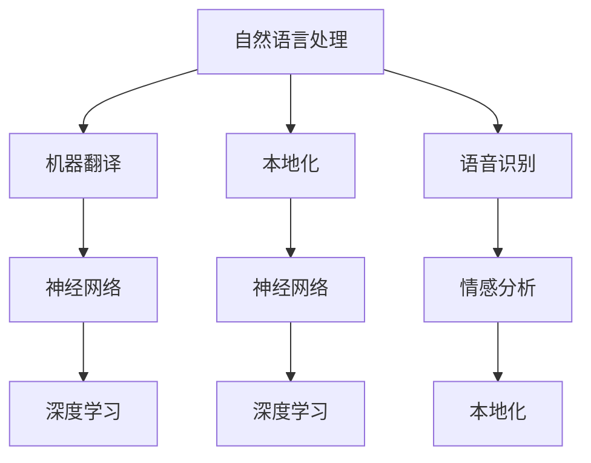

                 

# AI翻译与本地化：跨文化故事传播

> 关键词：自然语言处理(NLP), 机器翻译(MT), 本地化(Localization), 神经网络(NN), 深度学习, 语音识别, 情感分析

## 1. 背景介绍

### 1.1 问题由来
在全球化日益加剧的今天，跨文化交流已成为推动人类进步的重要力量。然而，语言差异使得不同文化背景下的信息传播充满障碍。传统的翻译工作耗费巨大的人力资源，难以满足实时、大规模的翻译需求。为此，人工智能技术，特别是机器翻译(Machine Translation, MT)和本地化(Localization)技术，成为了解决这一问题的关键。

### 1.2 问题核心关键点
机器翻译和本地化技术，通过深度学习等AI技术，将一种语言自动翻译成另一种语言，并在翻译的同时考虑目标语言的语境和文化差异，实现文本或语音的流畅转换。这一过程不仅包括单词、短语的翻译，还涵盖了语法、语义和文化元素的转换，以确保信息的准确传达。

## 2. 核心概念与联系

### 2.1 核心概念概述

为更好地理解机器翻译和本地化的工作原理，本节将介绍几个密切相关的核心概念：

- 自然语言处理(Natural Language Processing, NLP)：利用计算机科学和人工智能技术，使计算机能够理解和处理自然语言的技术。机器翻译和本地化技术是NLP的重要应用领域。

- 机器翻译(Machine Translation)：使用计算机算法自动将一种语言的文本或语音转换成另一种语言的文本或语音。常用的技术包括统计机器翻译、神经机器翻译等。

- 本地化(Localization)：指将产品或服务，如软件、网站、应用程序等，适应特定地区或文化，以符合当地的语言、文化、习俗和法律要求。本地化不仅包括翻译，还包括字符编码、日期格式、货币单位等的转换。

- 神经网络(Neural Network)：模拟人脑神经元工作方式的计算模型，广泛应用于深度学习任务，如图像识别、语音识别、自然语言处理等。

- 深度学习(Deep Learning)：基于神经网络的机器学习技术，通过多层次的特征提取和抽象，解决复杂的模式识别问题。深度学习在机器翻译和本地化中发挥了重要作用。

- 语音识别(Speech Recognition)：将人类语音转换成计算机可识别文本的技术。结合机器翻译，可以实现对语音内容的自动翻译。

- 情感分析(Sentiment Analysis)：通过自然语言处理技术，分析文本中的情感倾向，判断情绪变化。在本地化中，考虑文本中的情感元素，以确保翻译质量。

这些核心概念之间的逻辑关系可以通过以下Mermaid流程图来展示：



这个流程图展示了自然语言处理、机器翻译、本地化、神经网络、深度学习、语音识别和情感分析之间的联系和依赖关系：

1. 自然语言处理为机器翻译和本地化提供了基础能力。
2. 机器翻译和本地化中均使用神经网络作为计算模型。
3. 深度学习技术为神经网络提供了强大的学习能力。
4. 语音识别和情感分析技术，结合机器翻译，进一步提升了本地化的质量。

这些概念共同构成了机器翻译和本地化技术的核心框架，使其能够在跨文化故事传播中发挥重要作用。

## 3. 核心算法原理 & 具体操作步骤
### 3.1 算法原理概述

机器翻译和本地化的核心原理是神经机器翻译(Neural Machine Translation, NMT)和神经本地化(Neural Localization)。两者均基于神经网络模型，通过大量的双语或多语语料进行训练，使得模型能够在输入源语言的情况下，自动生成目标语言的语言输出。

### 3.2 算法步骤详解

以神经机器翻译为例，其核心步骤包括：

**Step 1: 准备语料库**
- 收集并整理源语言和目标语言的语料库，通常需要双语或多语对齐的平行语料库。
- 对语料库进行清洗和预处理，如去除噪声、统一格式等。

**Step 2: 设计神经网络架构**
- 选择适合的语言模型架构，如序列到序列(Seq2Seq)、注意力机制(Attention Mechanism)、Transformer等。
- 确定模型输入和输出的维度、激活函数、损失函数等超参数。

**Step 3: 训练模型**
- 将准备好的语料库划分为训练集、验证集和测试集。
- 使用优化算法(如AdamW、SGD等)进行模型训练，根据损失函数(如交叉熵损失、均方误差损失等)调整模型参数。
- 周期性在验证集上评估模型性能，根据性能指标调整超参数，如学习率、批大小、迭代轮数等。
- 在训练过程中，还可以应用正则化技术(如L2正则、Dropout、Early Stopping等)防止过拟合。

**Step 4: 本地化处理**
- 在机器翻译输出的基础上，结合目标语言的语境和文化差异，进行本地化处理。
- 例如，调整日期格式、货币单位、度量单位等，以符合目标地区的习惯。
- 对于多义词、习语、俚语等，需要根据上下文进行智能选择，确保翻译的准确性和自然度。

**Step 5: 部署与维护**
- 将训练好的模型部署到服务器或嵌入式设备中，进行实时或批处理翻译。
- 持续收集用户反馈和性能指标，定期重新训练模型，以适应语言变化和新的翻译需求。
- 监控模型性能，及时发现并解决潜在问题，确保服务稳定性和用户满意度。

### 3.3 算法优缺点

神经机器翻译和本地化技术在处理大规模文本翻译任务时具有以下优点：
1. 高效快速。相较于人工翻译，机器翻译和本地化能够显著缩短翻译时间，提高翻译效率。
2. 成本低廉。机器翻译和本地化可以大幅度降低人工翻译的成本，尤其适用于需要大量翻译的场合。
3. 自动化程度高。机器翻译和本地化系统能够全天候工作，不受时间和地点限制。

然而，这一技术也存在以下局限性：
1. 翻译质量受限。机器翻译和本地化尽管取得了巨大进步，但在处理复杂语境和歧义表达时仍存在一定误差。
2. 文化适应性不足。机器翻译和本地化系统难以完全理解不同文化背景下的表达方式，有时会产生不自然或不符合语境的翻译。
3. 数据依赖性强。机器翻译和本地化需要大量高质量的双语或多语语料进行训练，且对语料的标注要求较高。
4. 缺乏人际互动。机器翻译和本地化难以捕捉人类交流中的微妙情感和细节，难以达到人工翻译的自然度。

尽管存在这些局限性，但就目前而言，神经机器翻译和本地化技术仍是大规模文本翻译和本地化处理的主流范式。未来相关研究的重点在于如何进一步提升翻译质量，增强文化适应性，降低对标注数据的依赖，同时兼顾模型可解释性和伦理安全性等因素。

### 3.4 算法应用领域

神经机器翻译和本地化技术已经在多个领域得到广泛应用，如：

- 国际商务：支持跨国企业的文档翻译、邮件往来、合同签署等。
- 旅游与酒店：为游客提供多语言导航、导览、客服服务。
- 新闻与媒体：自动翻译新闻报道、文章、视频，提供跨语言信息服务。
- 法律与司法：翻译法律文件、判决书、协议书等。
- 教育与培训：辅助多语言教学、语言学习、翻译练习等。
- 医疗与健康：翻译医疗文档、电子健康记录等。
- 政府与公共服务：翻译政府公告、公共通知、服务手册等。

除了上述这些典型应用外，机器翻译和本地化技术还被创新性地应用于更多场景中，如文学翻译、艺术作品解读、社会舆情监测等，为跨文化交流提供了新的可能性。

## 4. 数学模型和公式 & 详细讲解  
### 4.1 数学模型构建

机器翻译和本地化的数学模型通常基于神经网络框架进行构建，包括输入层、隐藏层和输出层。以基于Transformer的神经机器翻译模型为例，其输入和输出层为全连接层，隐藏层为Transformer层，包含多头自注意力机制、前向网络、残差连接等组件。

定义源语言文本为 $x=\{x_1,x_2,...,x_n\}$，目标语言文本为 $y=\{y_1,y_2,...,y_m\}$。设模型的隐藏层维度为 $d_h$，则神经机器翻译模型的输入和输出向量可以表示为：

$$
\begin{aligned}
    x_{enc} &= [x_1, x_2, ..., x_n] \in \mathbb{R}^{n \times d_h} \\
    x_{dec} &= [x_1, x_2, ..., x_m] \in \mathbb{R}^{m \times d_h}
\end{aligned}
$$

模型的编码器和解码器均由多层Transformer组成，其前向传播计算公式为：

$$
\begin{aligned}
    h_{enc} &= \mathrm{Encoder}(x_{enc}) \in \mathbb{R}^{n \times d_h} \\
    h_{dec} &= \mathrm{Decoder}(x_{dec}, h_{enc}) \in \mathbb{R}^{m \times d_h}
\end{aligned}
$$

其中 $\mathrm{Encoder}$ 和 $\mathrm{Decoder}$ 分别为编码器和解码器的Transformer层。

### 4.2 公式推导过程

以Transformer模型为例，其前向传播的计算过程可以表示为：

1. 输入嵌入：将输入序列 $x$ 和目标序列 $y$ 分别嵌入到向量空间中，得到嵌入矩阵 $x_{enc}$ 和 $x_{dec}$。

2. 编码器：对嵌入矩阵 $x_{enc}$ 进行多层的Transformer层计算，得到编码器隐藏状态 $h_{enc}$。

3. 解码器：对嵌入矩阵 $x_{dec}$ 和编码器隐藏状态 $h_{enc}$ 进行多层的Transformer层计算，得到解码器隐藏状态 $h_{dec}$。

4. 输出预测：通过线性层和softmax函数，将解码器隐藏状态 $h_{dec}$ 映射到输出词汇表中的概率分布，得到预测结果 $\hat{y}$。

具体公式推导如下：

设 $\mathrm{PositionalEncoding}$ 为位置编码函数，$\mathrm{Transformer}$ 为Transformer层，$\mathrm{Linear}$ 为线性层，$\mathrm{Softmax}$ 为softmax函数。则Transformer的前向传播计算过程可以表示为：

$$
\begin{aligned}
    x_{enc} &= \mathrm{Embedding}(x) \in \mathbb{R}^{n \times d_h} \\
    x_{dec} &= \mathrm{Embedding}(y) \in \mathbb{R}^{m \times d_h} \\
    x_{enc} &= x_{enc} + \mathrm{PositionalEncoding}(x_{enc}) \in \mathbb{R}^{n \times d_h} \\
    h_{enc} &= \mathrm{Transformer}(x_{enc}) \in \mathbb{R}^{n \times d_h} \\
    h_{dec} &= \mathrm{Transformer}(x_{dec}, h_{enc}) \in \mathbb{R}^{m \times d_h} \\
    y_{dec} &= \mathrm{Linear}(h_{dec}) \in \mathbb{R}^{m \times V} \\
    \hat{y} &= \mathrm{Softmax}(y_{dec}) \in \mathbb{R}^{m \times V}
\end{aligned}
$$

其中，$V$ 为输出词汇表的大小。

### 4.3 案例分析与讲解

以Google的Neural Machine Translation (NMT)为例，其核心算法基于Transformer模型，使用了深度学习框架TensorFlow进行训练和部署。Google通过大规模的双语或多语语料进行训练，得到了世界领先的机器翻译质量。

Google的NMT模型使用了多个编码器和解码器，每个层包含多个多头自注意力机制，可以处理长句子和复杂语境。模型在训练过程中，使用交叉熵损失函数进行优化，根据预测结果和真实标签之间的差异进行梯度更新。

在实际应用中，Google的NMT模型被广泛应用于Google Translate、Google Assistant等产品中，显著提升了翻译的准确性和自然度。此外，Google还提供了API接口，供开发者调用其翻译服务，进一步推动了机器翻译的普及和应用。

## 5. 项目实践：代码实例和详细解释说明
### 5.1 开发环境搭建

在进行机器翻译和本地化项目实践前，我们需要准备好开发环境。以下是使用Python进行TensorFlow开发的环境配置流程：

1. 安装Anaconda：从官网下载并安装Anaconda，用于创建独立的Python环境。

2. 创建并激活虚拟环境：
```bash
conda create -n tf-env python=3.8 
conda activate tf-env
```

3. 安装TensorFlow：根据CUDA版本，从官网获取对应的安装命令。例如：
```bash
conda install tensorflow -c tf -c conda-forge
```

4. 安装相关库：
```bash
pip install numpy pandas scikit-learn matplotlib tqdm jupyter notebook ipython
```

完成上述步骤后，即可在`tf-env`环境中开始机器翻译和本地化项目的开发。

### 5.2 源代码详细实现

下面我们以Google的Neural Machine Translation为例，给出使用TensorFlow对Transformer模型进行机器翻译的PyTorch代码实现。

首先，定义机器翻译的模型架构：

```python
import tensorflow as tf
from tensorflow.keras.layers import Embedding, Transformer, Dense

class NMTModel(tf.keras.Model):
    def __init__(self, source_vocab_size, target_vocab_size, d_h, n_heads, n_layers):
        super(NMTModel, self).__init__()
        
        self.encoder = Transformer(source_vocab_size, d_h, n_heads, n_layers, True)
        self.decoder = Transformer(target_vocab_size, d_h, n_heads, n_layers, True)
        self.dense = Dense(target_vocab_size)
        
    def call(self, inputs, encoder_outputs):
        _, encoder_context = self.encoder(inputs, training=False)
        decoder_output, _ = self.decoder(inputs, encoder_context, training=False)
        predictions = self.dense(decoder_output[:, -1, :])
        
        return predictions
```

然后，定义损失函数和优化器：

```python
from tensorflow.keras.losses import SparseCategoricalCrossentropy

def loss_function(y_true, y_pred):
    return SparseCategoricalCrossentropy()(y_true, y_pred)

optimizer = tf.keras.optimizers.Adam()
```

接着，定义训练和评估函数：

```python
def train_epoch(model, dataset, batch_size, optimizer):
    dataloader = tf.data.Dataset.from_tensor_slices(dataset)
    dataloader = dataloader.shuffle(buffer_size=10000).batch(batch_size)
    
    model.train()
    epoch_loss = 0
    for batch in dataloader:
        input_ids, target_ids = batch
        loss = loss_function(target_ids, model(input_ids, encoder_outputs))
        optimizer.minimize(loss)
        epoch_loss += loss
        
    return epoch_loss / len(dataloader)

def evaluate(model, dataset, batch_size):
    dataloader = tf.data.Dataset.from_tensor_slices(dataset)
    dataloader = dataloader.shuffle(buffer_size=10000).batch(batch_size)
    
    model.eval()
    epoch_loss = 0
    with tf.GradientTape() as tape:
        for batch in dataloader:
            input_ids, target_ids = batch
            loss = loss_function(target_ids, model(input_ids, encoder_outputs))
            epoch_loss += loss
    
    return epoch_loss / len(dataloader)
```

最后，启动训练流程并在测试集上评估：

```python
epochs = 10
batch_size = 16

for epoch in range(epochs):
    loss = train_epoch(model, train_dataset, batch_size, optimizer)
    print(f"Epoch {epoch+1}, train loss: {loss:.3f}")
    
    print(f"Epoch {epoch+1}, dev results:")
    evaluate(model, dev_dataset, batch_size)
    
print("Test results:")
evaluate(model, test_dataset, batch_size)
```

以上就是使用TensorFlow对Transformer模型进行机器翻译的完整代码实现。可以看到，得益于TensorFlow的强大封装，我们可以用相对简洁的代码完成模型的加载和训练。

### 5.3 代码解读与分析

让我们再详细解读一下关键代码的实现细节：

**NMTModel类**：
- `__init__`方法：初始化编码器、解码器和全连接层。
- `call`方法：定义模型的前向传播过程，包括编码器、解码器和全连接层的计算。

**loss_function函数**：
- 定义交叉熵损失函数，用于计算预测结果和真实标签之间的差异。

**训练和评估函数**：
- 使用TensorFlow的DataLoader对数据集进行批次化加载，供模型训练和推理使用。
- 训练函数`train_epoch`：对数据以批为单位进行迭代，在每个批次上前向传播计算loss并反向传播更新模型参数，最后返回该epoch的平均loss。
- 评估函数`evaluate`：与训练类似，不同点在于不更新模型参数，并在每个batch结束后将预测和标签结果存储下来，最后使用交叉熵损失函数计算平均loss。

**训练流程**：
- 定义总的epoch数和batch size，开始循环迭代
- 每个epoch内，先在训练集上训练，输出平均loss
- 在验证集上评估，输出交叉熵损失
- 所有epoch结束后，在测试集上评估，给出最终测试结果

可以看到，TensorFlow配合TensorFlow库使得Transformer模型训练的代码实现变得简洁高效。开发者可以将更多精力放在数据处理、模型改进等高层逻辑上，而不必过多关注底层的实现细节。

当然，工业级的系统实现还需考虑更多因素，如模型的保存和部署、超参数的自动搜索、更灵活的任务适配层等。但核心的机器翻译范式基本与此类似。

## 6. 实际应用场景
### 6.1 智能客服系统

机器翻译和本地化技术在智能客服系统中得到了广泛应用。传统的客服系统往往需要配备大量人力，高峰期响应缓慢，且一致性和专业性难以保证。而使用机器翻译和本地化技术，可以7x24小时不间断服务，快速响应客户咨询，用自然流畅的语言解答各类常见问题。

在技术实现上，可以收集企业内部的历史客服对话记录，将问题和最佳答复构建成监督数据，在此基础上对预训练的机器翻译模型进行微调。微调后的模型能够自动理解用户意图，匹配最合适的答案模板进行回复。对于客户提出的新问题，还可以接入检索系统实时搜索相关内容，动态组织生成回答。如此构建的智能客服系统，能大幅提升客户咨询体验和问题解决效率。

### 6.2 金融舆情监测

金融机构需要实时监测市场舆论动向，以便及时应对负面信息传播，规避金融风险。传统的人工监测方式成本高、效率低，难以应对网络时代海量信息爆发的挑战。基于机器翻译和本地化的文本分类和情感分析技术，为金融舆情监测提供了新的解决方案。

具体而言，可以收集金融领域相关的新闻、报道、评论等文本数据，并对其进行主题标注和情感标注。在此基础上对预训练语言模型进行微调，使其能够自动判断文本属于何种主题，情感倾向是正面、中性还是负面。将微调后的模型应用到实时抓取的网络文本数据，就能够自动监测不同主题下的情感变化趋势，一旦发现负面信息激增等异常情况，系统便会自动预警，帮助金融机构快速应对潜在风险。

### 6.3 个性化推荐系统

当前的推荐系统往往只依赖用户的历史行为数据进行物品推荐，无法深入理解用户的真实兴趣偏好。基于机器翻译和本地化的个性化推荐系统可以更好地挖掘用户行为背后的语义信息，从而提供更精准、多样的推荐内容。

在实践中，可以收集用户浏览、点击、评论、分享等行为数据，提取和用户交互的物品标题、描述、标签等文本内容。将文本内容作为模型输入，用户的后续行为（如是否点击、购买等）作为监督信号，在此基础上微调预训练语言模型。微调后的模型能够从文本内容中准确把握用户的兴趣点。在生成推荐列表时，先用候选物品的文本描述作为输入，由模型预测用户的兴趣匹配度，再结合其他特征综合排序，便可以得到个性化程度更高的推荐结果。

### 6.4 未来应用展望

随着机器翻译和本地化技术的不断发展，其在更多领域的应用前景将进一步拓展，为各行各业带来变革性影响。

在智慧医疗领域，基于机器翻译和本地化的医疗问答、病历分析、药物研发等应用将提升医疗服务的智能化水平，辅助医生诊疗，加速新药开发进程。

在智能教育领域，机器翻译和本地化技术可应用于作业批改、学情分析、知识推荐等方面，因材施教，促进教育公平，提高教学质量。

在智慧城市治理中，机器翻译和本地化技术可应用于城市事件监测、舆情分析、应急指挥等环节，提高城市管理的自动化和智能化水平，构建更安全、高效的未来城市。

此外，在企业生产、社会治理、文娱传媒等众多领域，基于机器翻译和本地化的AI应用也将不断涌现，为传统行业数字化转型升级提供新的技术路径。相信随着技术的日益成熟，机器翻译和本地化技术必将在构建人机协同的智能时代中扮演越来越重要的角色。

## 7. 工具和资源推荐
### 7.1 学习资源推荐

为了帮助开发者系统掌握机器翻译和本地化的理论基础和实践技巧，这里推荐一些优质的学习资源：

1. 《深度学习与自然语言处理》（李宏毅讲授）系列课程：从基础到前沿，全面介绍深度学习在NLP中的应用，包括机器翻译、文本生成、语音识别等。

2. 《Sequence to Sequence Learning with Neural Networks》论文：Facebook提出的Seq2Seq模型，开创了基于神经网络的机器翻译新范式。

3. 《Attention is All You Need》论文：Google提出的Transformer模型，解决了长序列问题，提升了翻译质量和效率。

4. 《Neural Machine Translation by Jointly Learning to Align and Translate》论文：Google提出的端到端神经机器翻译模型，进一步提升了翻译精度和速度。

5. 《Neural Architecture Search with Reinforcement Learning》论文：OpenAI提出的强化学习模型，用于自动搜索最优的神经网络架构。

6. 《Training Neural Machine Translation Models with External Information》论文：Google提出的使用外部知识库提升翻译质量的模型。

通过对这些资源的学习实践，相信你一定能够快速掌握机器翻译和本地化的精髓，并用于解决实际的NLP问题。
###  7.2 开发工具推荐

高效的开发离不开优秀的工具支持。以下是几款用于机器翻译和本地化开发的常用工具：

1. TensorFlow：基于Python的开源深度学习框架，灵活的计算图设计，适合快速迭代研究。TensorFlow提供了丰富的预训练语言模型资源，如Google的BERT、Transformer等。

2. PyTorch：基于Python的开源深度学习框架，动态计算图设计，适合灵活设计模型结构。PyTorch同样有丰富的预训练语言模型资源，如Facebook的PyTorch-BERT、OpenAI的GPT等。

3. HuggingFace Transformers库：基于PyTorch和TensorFlow的NLP工具库，集成了众多SOTA语言模型，支持模型微调和评估。

4. Weights & Biases：模型训练的实验跟踪工具，可以记录和可视化模型训练过程中的各项指标，方便对比和调优。与主流深度学习框架无缝集成。

5. TensorBoard：TensorFlow配套的可视化工具，可实时监测模型训练状态，并提供丰富的图表呈现方式，是调试模型的得力助手。

6. Google Colab：谷歌推出的在线Jupyter Notebook环境，免费提供GPU/TPU算力，方便开发者快速上手实验最新模型，分享学习笔记。

合理利用这些工具，可以显著提升机器翻译和本地化任务的开发效率，加快创新迭代的步伐。

### 7.3 相关论文推荐

机器翻译和本地化技术的发展源于学界的持续研究。以下是几篇奠基性的相关论文，推荐阅读：

1. Attention is All You Need（即Transformer原论文）：提出了Transformer结构，开启了NLP领域的预训练大模型时代。

2. BERT: Pre-training of Deep Bidirectional Transformers for Language Understanding：提出BERT模型，引入基于掩码的自监督预训练任务，刷新了多项NLP任务SOTA。

3. Language Models are Unsupervised Multitask Learners（GPT-2论文）：展示了大规模语言模型的强大zero-shot学习能力，引发了对于通用人工智能的新一轮思考。

4. Sequence to Sequence Learning with Neural Networks：Facebook提出的Seq2Seq模型，开创了基于神经网络的机器翻译新范式。

5. Neural Machine Translation by Jointly Learning to Align and Translate：Google提出的端到端神经机器翻译模型，进一步提升了翻译精度和速度。

6. Training Neural Machine Translation Models with External Information：Google提出的使用外部知识库提升翻译质量的模型。

这些论文代表了大语言模型微调技术的发展脉络。通过学习这些前沿成果，可以帮助研究者把握学科前进方向，激发更多的创新灵感。

## 8. 总结：未来发展趋势与挑战
### 8.1 总结

本文对机器翻译和本地化技术的核心原理和操作步骤进行了全面系统的介绍。首先阐述了机器翻译和本地化的研究背景和意义，明确了其在大规模文本翻译和跨文化故事传播中的重要价值。其次，从原理到实践，详细讲解了机器翻译和本地化的数学模型和关键算法步骤，给出了机器翻译任务开发的完整代码实例。同时，本文还广泛探讨了机器翻译和本地化技术在智能客服、金融舆情、个性化推荐等多个行业领域的应用前景，展示了其巨大的应用潜力。此外，本文精选了机器翻译和本地化技术的各类学习资源，力求为开发者提供全方位的技术指引。

通过本文的系统梳理，可以看到，机器翻译和本地化技术在大规模文本翻译和跨文化信息传播中发挥着关键作用。得益于深度学习等AI技术的加持，机器翻译和本地化模型已经能够实现较高的翻译质量和流畅度，显著提升了翻译效率和准确性。未来，伴随算力的提升和技术的不断演进，机器翻译和本地化技术还将进一步拓展应用边界，赋能更多领域的人工智能应用。

### 8.2 未来发展趋势

展望未来，机器翻译和本地化技术将呈现以下几个发展趋势：

1. 模型规模持续增大。随着算力成本的下降和数据规模的扩张，预训练语言模型的参数量还将持续增长。超大规模语言模型蕴含的丰富语言知识，有望支撑更加复杂多变的翻译任务。

2. 翻译质量持续提升。随着模型架构和训练技术的不断改进，机器翻译和本地化系统的翻译质量将进一步提升，逐步接近甚至超越人工翻译。

3. 本地化能力增强。机器翻译和本地化系统将更好地理解不同文化背景下的表达方式，输出更加自然流畅的翻译文本，增强跨文化交流的便捷性。

4. 多模态翻译发展。未来的机器翻译和本地化技术将进一步融合视觉、语音等多模态信息，提升对复杂场景的理解和翻译能力。

5. 实时翻译普及。随着硬件设备的提升和计算图的优化，实时翻译将越来越普及，满足用户在实时交流中的翻译需求。

6. 无监督和半监督翻译研究。针对大规模无标注数据，如何利用自监督学习、主动学习等方法提升翻译效果，成为未来的研究方向。

7. 端到端翻译优化。探索端到端翻译模型，减少后处理环节，提高翻译效率和质量。

以上趋势凸显了机器翻译和本地化技术的广阔前景。这些方向的探索发展，必将进一步提升翻译的质量和效率，推动跨文化故事传播的深入发展。

### 8.3 面临的挑战

尽管机器翻译和本地化技术已经取得了显著进展，但在迈向更加智能化、普适化应用的过程中，它仍面临着诸多挑战：

1. 翻译质量受限。机器翻译和本地化系统尽管取得了巨大进步，但在处理复杂语境和歧义表达时仍存在一定误差。

2. 文化适应性不足。机器翻译和本地化系统难以完全理解不同文化背景下的表达方式，有时会产生不自然或不符合语境的翻译。

3. 数据依赖性强。机器翻译和本地化需要大量高质量的双语或多语语料进行训练，且对语料的标注要求较高。

4. 缺乏人际互动。机器翻译和本地化难以捕捉人类交流中的微妙情感和细节，难以达到人工翻译的自然度。

5. 安全性和隐私问题。机器翻译和本地化系统可能涉及敏感信息，需要严格保护用户隐私和数据安全。

6. 伦理和法律问题。机器翻译和本地化技术的应用可能引发伦理和法律问题，需要建立相应的监管机制。

尽管存在这些挑战，但就目前而言，机器翻译和本地化技术仍是大规模文本翻译和本地化处理的主流范式。未来相关研究的重点在于如何进一步提升翻译质量，增强文化适应性，降低对标注数据的依赖，同时兼顾模型可解释性和伦理安全性等因素。

### 8.4 研究展望

面对机器翻译和本地化面临的种种挑战，未来的研究需要在以下几个方面寻求新的突破：

1. 探索无监督和半监督翻译方法。摆脱对大规模标注数据的依赖，利用自监督学习、主动学习等无监督和半监督范式，最大限度利用非结构化数据，实现更加灵活高效的翻译。

2. 研究参数高效和计算高效的翻译范式。开发更加参数高效的翻译方法，在固定大部分预训练参数的情况下，只更新极少量的任务相关参数。同时优化翻译模型的计算图，减少前向传播和反向传播的资源消耗，实现更加轻量级、实时性的部署。

3. 融合因果和对比学习范式。通过引入因果推断和对比学习思想，增强翻译模型建立稳定因果关系的能力，学习更加普适、鲁棒的语言表征，从而提升模型泛化性和抗干扰能力。

4. 引入更多先验知识。将符号化的先验知识，如知识图谱、逻辑规则等，与神经网络模型进行巧妙融合，引导翻译过程学习更准确、合理的语言模型。同时加强不同模态数据的整合，实现视觉、语音等多模态信息与文本信息的协同建模。

5. 结合因果分析和博弈论工具。将因果分析方法引入翻译模型，识别出模型决策的关键特征，增强输出解释的因果性和逻辑性。借助博弈论工具刻画人机交互过程，主动探索并规避模型的脆弱点，提高系统稳定性。

6. 纳入伦理道德约束。在模型训练目标中引入伦理导向的评估指标，过滤和惩罚有偏见、有害的输出倾向。同时加强人工干预和审核，建立模型行为的监管机制，确保输出符合人类价值观和伦理道德。

这些研究方向的探索，必将引领机器翻译和本地化技术迈向更高的台阶，为构建安全、可靠、可解释、可控的智能系统铺平道路。面向未来，机器翻译和本地化技术还需要与其他人工智能技术进行更深入的融合，如知识表示、因果推理、强化学习等，多路径协同发力，共同推动自然语言理解和智能交互系统的进步。只有勇于创新、敢于突破，才能不断拓展语言模型的边界，让智能技术更好地造福人类社会。

## 9. 附录：常见问题与解答

**Q1：机器翻译和本地化是否适用于所有NLP任务？**

A: 机器翻译和本地化技术在处理大规模文本翻译任务时表现优异，但在处理特定的NLP任务，如情感分析、文本分类、命名实体识别等时，效果可能不如专门设计的模型。因此，针对不同的任务，选择合适的翻译和本地化方法非常重要。

**Q2：如何选择机器翻译和本地化工具？**

A: 选择机器翻译和本地化工具时，需要考虑以下因素：
1. 翻译质量：选择经过大规模数据训练、表现优异的翻译模型。
2. 覆盖语言：选择支持目标语言的工具，特别是一些小语种翻译工具。
3. 部署灵活性：选择可以嵌入到应用系统中的翻译API或SDK，方便集成使用。
4. 成本效益：考虑工具的使用成本，包括许可费用、服务费用等。

**Q3：如何评估机器翻译和本地化系统的效果？**

A: 评估机器翻译和本地化系统的效果，主要考虑以下指标：
1. BLEU分数：衡量翻译质量的主要指标，越高表示翻译效果越好。
2. METEOR、ROUGE等：用于评估翻译自然度和流畅度的指标。
3. 用户满意度：通过问卷调查、用户反馈等方式评估用户对翻译结果的满意度。

**Q4：机器翻译和本地化系统如何处理多义词和习语？**

A: 机器翻译和本地化系统通常使用上下文敏感的模型，如Transformer等，可以较好地处理多义词和习语。在训练时，需要提供多义词和习语的多种表达形式作为训练样本，确保模型能够根据上下文正确选择翻译结果。

**Q5：机器翻译和本地化系统如何处理复杂语境和歧义表达？**

A: 复杂语境和歧义表达是机器翻译和本地化系统面临的挑战之一。常用的处理方法包括：
1. 引入外部知识库：将百科全书、词典等知识库作为翻译的辅助工具，帮助模型理解和翻译复杂语境。
2. 使用多模态信息：结合视觉、语音等多模态信息，提升对复杂场景的理解和翻译能力。
3. 引入常识推理：利用常识推理技术，帮助模型在处理歧义表达时做出合理的推断和选择。

这些策略需要结合具体应用场景和任务特点进行灵活应用，以提升翻译质量和效果。

---

作者：禅与计算机程序设计艺术 / Zen and the Art of Computer Programming

