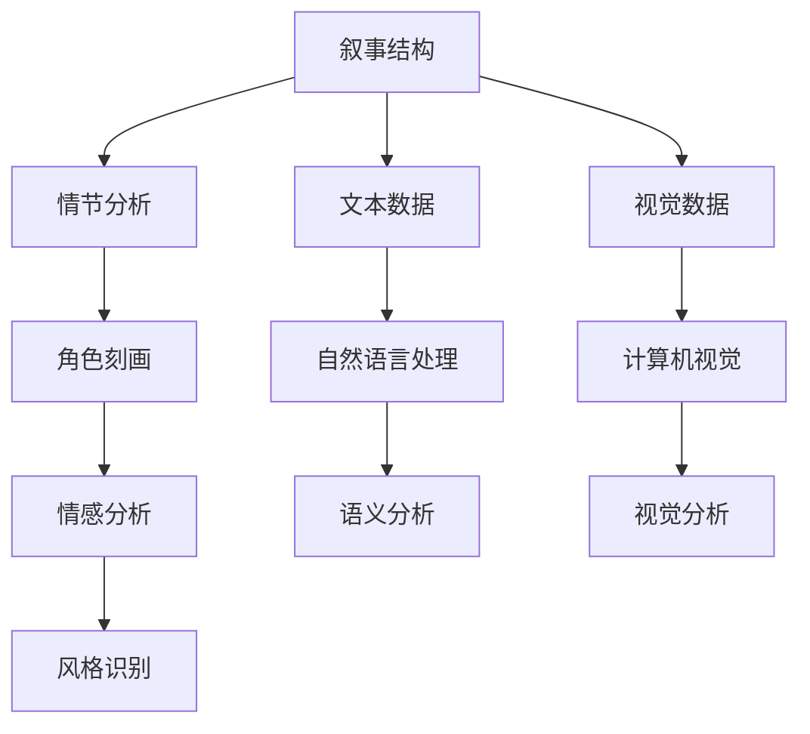

                 

## 1. 背景介绍

在当今媒体产业中，影视剧、小说、游戏等叙事内容的形式多样，情节复杂，如何有效分析并理解叙事结构，一直是创作和评估的重要难题。人工智能技术，尤其是自然语言处理和计算机视觉技术的发展，为叙事分析提供了新的思路和工具。AI辅助剧情分析可以提升叙事创意和内容评估的效率，辅助创作人员进行情节设计、角色刻画等创作工作，为叙事内容评估提供科学依据。

## 2. 核心概念与联系

### 2.1 核心概念概述

在AI辅助剧情分析中，涉及以下几个核心概念：

- **叙事结构（Narrative Structure）**：指叙事内容的组织方式，包括叙事视角、情节线索、时间线等。
- **情节分析（Plot Analysis）**：对叙事内容的情节进行细粒度分析和理解，如事件节点、因果关系、转折点等。
- **角色刻画（Character Portrayal）**：通过分析角色的行为、心理、变化等，深入理解角色设定和成长轨迹。
- **情感分析（Sentiment Analysis）**：对文本或视觉内容中的情感进行识别和量化，理解叙事的情感色彩和情绪变化。
- **风格识别（Style Recognition）**：通过分析叙事的风格元素，如语言特色、叙事节奏等，识别出不同的叙事流派和作者风格。

### 2.2 核心概念原理和架构的 Mermaid 流程图



此图表显示了叙事结构到情感分析、风格识别的数据流向，其中文本数据和视觉数据通过自然语言处理和计算机视觉技术，分别生成语义分析和视觉分析结果。

## 3. 核心算法原理 & 具体操作步骤

### 3.1 算法原理概述

AI辅助剧情分析主要依赖自然语言处理和计算机视觉技术，对文本和视觉内容进行深度分析，理解其叙事结构、情节发展、角色变化等元素。核心算法包括：

- **自然语言处理（NLP）**：利用语言模型、语义分析、文本分类等技术，对文本数据进行情节分析、角色刻画和情感分析。
- **计算机视觉（CV）**：使用图像分割、目标检测、情感识别等技术，对视觉数据进行视觉分析和风格识别。
- **多模态融合（Multi-modal Fusion）**：将文本和视觉数据结合，综合分析叙事的各个方面。

### 3.2 算法步骤详解

#### 3.2.1 数据预处理

- **文本数据预处理**：对输入的文本进行分词、词性标注、命名实体识别等操作，为后续分析提供结构化数据。
- **视觉数据预处理**：对输入的图像进行预处理，包括裁剪、缩放、归一化等，使用目标检测技术标注出视觉内容中的关键元素。

#### 3.2.2 情节分析

- **事件抽取（Event Extraction）**：利用命名实体识别、关系抽取等技术，从文本中识别出关键事件节点和人物关系。
- **因果关系分析（Causal Analysis）**：分析事件之间的因果关系，构建事件网络图，理解情节发展的逻辑性。

#### 3.2.3 角色刻画

- **角色行为分析（Character Behavior Analysis）**：通过分析角色在事件中的行为和言语，推断角色性格和动机。
- **角色情感分析（Character Sentiment Analysis）**：使用情感分析技术，识别角色在事件中的情感状态和变化。

#### 3.2.4 情感分析

- **文本情感分析（Text Sentiment Analysis）**：利用情感词典、情感分类器等技术，对文本情感进行分类和强度分析。
- **视觉情感识别（Visual Sentiment Recognition）**：通过分析人物面部表情、肢体语言等，识别视觉内容中的情感表达。

#### 3.2.5 风格识别

- **文本风格分析（Text Style Analysis）**：利用语言模型、风格迁移等技术，分析文本的语言特色和叙事风格。
- **视觉风格识别（Visual Style Recognition）**：分析视觉内容的构图、色彩、光影等元素，识别出不同的艺术风格和叙事节奏。

### 3.3 算法优缺点

**优点**：

- **自动化和高效性**：AI辅助分析可以大幅提升分析速度，处理大规模数据集。
- **深度理解**：AI能够分析文本和视觉内容的多维度信息，提供更深入的情节理解和角色刻画。
- **客观性**：AI分析基于数据和模型，减少人为偏差。

**缺点**：

- **理解局限性**：AI可能无法完全理解复杂叙事中的隐含意义和深层次情感。
- **数据依赖性**：分析结果依赖于输入数据的质量和多样性。
- **模型复杂性**：AI模型训练复杂，需要大量标注数据和高性能计算资源。

### 3.4 算法应用领域

AI辅助剧情分析已经在以下几个领域中得到了应用：

- **影视剧创作**：分析剧本的情节结构、角色变化和情感色彩，辅助编剧进行情节设计和角色刻画。
- **小说和文学分析**：对小说情节进行情节分析、角色刻画和风格识别，评估文学作品的叙事效果。
- **游戏剧情设计**：对游戏剧本进行情节分析和角色刻画，辅助游戏设计师设计故事情节和角色互动。
- **心理咨询**：分析咨询记录中的情感和行为，辅助心理咨询师理解患者心理状态和需求。

## 4. 数学模型和公式 & 详细讲解 & 举例说明

### 4.1 数学模型构建

#### 4.1.1 文本情节分析模型

文本情节分析模型通常包括事件抽取模型和因果关系模型。事件抽取模型通过训练语义模型，识别文本中的事件实体和关系，并构建事件网络图。因果关系模型利用图神经网络等技术，分析事件之间的因果关系，构建因果图谱。

#### 4.1.2 角色刻画模型

角色刻画模型通常包括行为分析和情感分析模型。行为分析模型通过训练文本分类器，识别角色在不同事件中的行为类型和行为模式。情感分析模型使用情感词典或情感分类器，分析角色情感变化，识别情感状态和情感强度。

#### 4.1.3 情感分析模型

情感分析模型包括文本情感分析和视觉情感识别模型。文本情感分析模型使用情感词典、情感分类器等技术，对文本情感进行分类和强度分析。视觉情感识别模型通过训练情感分类器，分析图像中的人物表情和情感状态。

#### 4.1.4 风格识别模型

风格识别模型包括文本风格分析和视觉风格识别模型。文本风格分析模型通过训练语言模型和风格迁移技术，分析文本的语言特色和叙事风格。视觉风格识别模型通过分析视觉内容的构图、色彩、光影等元素，识别不同的艺术风格和叙事节奏。

### 4.2 公式推导过程

#### 4.2.1 事件抽取

事件抽取模型通常使用命名实体识别和关系抽取技术，将文本中的事件实体和关系抽取出来，构建事件网络图。假设输入文本为 $T$，事件抽取模型的目标是从文本中识别出事件实体 $E$ 和事件关系 $R$，并构建事件网络 $N$。事件抽取模型可以使用以下公式：

$$
E = \text{BERT-NE}(T)
$$

其中 $\text{BERT-NE}$ 表示基于BERT模型的命名实体识别模型。

#### 4.2.2 因果关系分析

因果关系分析模型通常使用图神经网络（GNN）等技术，分析事件之间的因果关系，构建因果图谱。假设事件网络图为 $N$，因果关系分析模型可以使用以下公式：

$$
C = \text{GNN}(N)
$$

其中 $\text{GNN}$ 表示基于图神经网络的因果关系分析模型。

#### 4.2.3 角色行为分析

角色行为分析模型通常使用文本分类器，识别角色在不同事件中的行为类型和行为模式。假设输入文本为 $T$，角色行为分析模型的目标是从文本中识别出角色行为 $B$。角色行为分析模型可以使用以下公式：

$$
B = \text{Text-Classifier}(T)
$$

其中 $\text{Text-Classifier}$ 表示基于文本分类器的角色行为分析模型。

#### 4.2.4 角色情感分析

角色情感分析模型通常使用情感词典或情感分类器，分析角色情感变化，识别情感状态和情感强度。假设输入文本为 $T$，角色情感分析模型的目标是从文本中识别出角色情感状态 $S$。角色情感分析模型可以使用以下公式：

$$
S = \text{Sentiment-Classifier}(T)
$$

其中 $\text{Sentiment-Classifier}$ 表示基于情感分类器的角色情感分析模型。

#### 4.2.5 文本情感分析

文本情感分析模型通常使用情感词典或情感分类器，对文本情感进行分类和强度分析。假设输入文本为 $T$，文本情感分析模型的目标是从文本中识别出情感状态 $S$。文本情感分析模型可以使用以下公式：

$$
S = \text{Sentiment-Classifier}(T)
$$

其中 $\text{Sentiment-Classifier}$ 表示基于情感分类器的文本情感分析模型。

#### 4.2.6 视觉情感识别

视觉情感识别模型通常使用情感分类器，分析图像中的人物表情和情感状态。假设输入图像为 $I$，视觉情感识别模型的目标是从图像中识别出情感状态 $S$。视觉情感识别模型可以使用以下公式：

$$
S = \text{Sentiment-Classifier}(I)
$$

其中 $\text{Sentiment-Classifier}$ 表示基于情感分类器的视觉情感识别模型。

#### 4.2.7 文本风格分析

文本风格分析模型通常使用语言模型和风格迁移技术，分析文本的语言特色和叙事风格。假设输入文本为 $T$，文本风格分析模型的目标是从文本中识别出风格类型 $W$。文本风格分析模型可以使用以下公式：

$$
W = \text{Style-Classifier}(T)
$$

其中 $\text{Style-Classifier}$ 表示基于风格分类器的文本风格分析模型。

#### 4.2.8 视觉风格识别

视觉风格识别模型通常使用视觉分析技术，分析视觉内容的构图、色彩、光影等元素，识别不同的艺术风格和叙事节奏。假设输入图像为 $I$，视觉风格识别模型的目标是从图像中识别出风格类型 $W$。视觉风格识别模型可以使用以下公式：

$$
W = \text{Style-Classifier}(I)
$$

其中 $\text{Style-Classifier}$ 表示基于风格分类器的视觉风格识别模型。

### 4.3 案例分析与讲解

**案例1：电视剧剧本情节分析**

假设有一个电视剧剧本文本，长度为1000个单词，目标是对剧本进行情节分析。首先，使用BERT-NE模型对文本进行命名实体识别，识别出所有事件实体，包括人物、地点、时间等。然后，使用GNN模型分析事件之间的关系，构建事件网络图。最后，使用情感分类器分析剧本的情感状态和强度，理解剧本的情感色彩。

**案例2：小说角色刻画**

假设有一本小说文本，长度为50000个单词，目标是对小说进行角色刻画。首先，使用Text-Classifier模型对文本进行角色行为分析，识别出角色在不同事件中的行为类型和行为模式。然后，使用Sentiment-Classifier模型对文本进行角色情感分析，识别出角色情感状态和情感强度。最后，使用Style-Classifier模型对文本进行风格分析，理解小说的语言特色和叙事风格。

## 5. 项目实践：代码实例和详细解释说明

### 5.1 开发环境搭建

**5.1.1 Python环境配置**

- **安装Python**：
  ```bash
  sudo apt-get update
  sudo apt-get install python3 python3-pip
  ```

- **创建虚拟环境**：
  ```bash
  python3 -m venv venv
  source venv/bin/activate
  ```

- **安装必要的库**：
  ```bash
  pip install transformers
  pip install tensorflow
  pip install scikit-learn
  pip install pytorch
  ```

**5.1.2 数据准备**

- **文本数据**：收集电视剧剧本、小说、游戏剧本等文本数据，并对其进行预处理。
- **视觉数据**：收集电视剧剧照、电影海报、游戏截图等视觉数据，并对其进行预处理。

### 5.2 源代码详细实现

**5.2.1 事件抽取**

```python
from transformers import BertTokenizer, BertForTokenClassification
import torch
from transformers import InputExample, InputFeatures

# 定义事件抽取模型
class EventExtractionModel(BertForTokenClassification):
    def __init__(self, config):
        super(EventExtractionModel, self).__init__(config)

    def forward(self, input_ids, attention_mask):
        output = self(input_ids, attention_mask=attention_mask)
        return output.pooler_output

# 加载预训练模型
tokenizer = BertTokenizer.from_pretrained('bert-base-cased')
model = EventExtractionModel.from_pretrained('bert-base-cased')

# 处理文本数据
def process_text(text):
    tokens = tokenizer.tokenize(text)
    input_ids = tokenizer.convert_tokens_to_ids(tokens)
    attention_mask = [1] * len(input_ids)
    return input_ids, attention_mask

# 处理视觉数据
def process_image(image_path):
    # 进行预处理和特征提取
    # ...

# 事件抽取模型训练
def train_event_extraction(model, train_data, val_data, epochs=3, batch_size=16):
    # 定义训练循环
    # ...

# 事件抽取模型评估
def evaluate_event_extraction(model, test_data, batch_size=16):
    # 定义评估循环
    # ...

# 主函数
if __name__ == '__main__':
    # 准备数据
    train_texts = ['剧本文本1', '剧本文本2']
    val_texts = ['剧本文本3', '剧本文本4']
    test_texts = ['剧本文本5', '剧本文本6']

    # 训练模型
    train_event_extraction(model, train_texts, val_texts)

    # 评估模型
    evaluate_event_extraction(model, test_texts)
```

**5.2.2 角色行为分析**

```python
from transformers import BertTokenizer, BertForTokenClassification
import torch
from transformers import InputExample, InputFeatures

# 定义角色行为分析模型
class CharacterBehaviorAnalysisModel(BertForTokenClassification):
    def __init__(self, config):
        super(CharacterBehaviorAnalysisModel, self).__init__(config)

    def forward(self, input_ids, attention_mask):
        output = self(input_ids, attention_mask=attention_mask)
        return output.pooler_output

# 加载预训练模型
tokenizer = BertTokenizer.from_pretrained('bert-base-cased')
model = CharacterBehaviorAnalysisModel.from_pretrained('bert-base-cased')

# 处理文本数据
def process_text(text):
    tokens = tokenizer.tokenize(text)
    input_ids = tokenizer.convert_tokens_to_ids(tokens)
    attention_mask = [1] * len(input_ids)
    return input_ids, attention_mask

# 角色行为分析模型训练
def train_character_behavior_analysis(model, train_data, val_data, epochs=3, batch_size=16):
    # 定义训练循环
    # ...

# 角色行为分析模型评估
def evaluate_character_behavior_analysis(model, test_data, batch_size=16):
    # 定义评估循环
    # ...

# 主函数
if __name__ == '__main__':
    # 准备数据
    train_texts = ['剧本文本1', '剧本文本2']
    val_texts = ['剧本文本3', '剧本文本4']
    test_texts = ['剧本文本5', '剧本文本6']

    # 训练模型
    train_character_behavior_analysis(model, train_texts, val_texts)

    # 评估模型
    evaluate_character_behavior_analysis(model, test_texts)
```

**5.2.3 角色情感分析**

```python
from transformers import BertTokenizer, BertForTokenClassification
import torch
from transformers import InputExample, InputFeatures

# 定义角色情感分析模型
class CharacterSentimentAnalysisModel(BertForTokenClassification):
    def __init__(self, config):
        super(CharacterSentimentAnalysisModel, self).__init__(config)

    def forward(self, input_ids, attention_mask):
        output = self(input_ids, attention_mask=attention_mask)
        return output.pooler_output

# 加载预训练模型
tokenizer = BertTokenizer.from_pretrained('bert-base-cased')
model = CharacterSentimentAnalysisModel.from_pretrained('bert-base-cased')

# 处理文本数据
def process_text(text):
    tokens = tokenizer.tokenize(text)
    input_ids = tokenizer.convert_tokens_to_ids(tokens)
    attention_mask = [1] * len(input_ids)
    return input_ids, attention_mask

# 角色情感分析模型训练
def train_character_sentiment_analysis(model, train_data, val_data, epochs=3, batch_size=16):
    # 定义训练循环
    # ...

# 角色情感分析模型评估
def evaluate_character_sentiment_analysis(model, test_data, batch_size=16):
    # 定义评估循环
    # ...

# 主函数
if __name__ == '__main__':
    # 准备数据
    train_texts = ['剧本文本1', '剧本文本2']
    val_texts = ['剧本文本3', '剧本文本4']
    test_texts = ['剧本文本5', '剧本文本6']

    # 训练模型
    train_character_sentiment_analysis(model, train_texts, val_texts)

    # 评估模型
    evaluate_character_sentiment_analysis(model, test_texts)
```

### 5.3 代码解读与分析

**5.3.1 事件抽取**

事件抽取模型的代码实现主要基于BERT模型，结合命名实体识别和关系抽取技术。事件抽取模型的输入为文本，输出为事件实体和关系。在实际应用中，可以通过调整模型结构和训练数据，优化事件抽取效果。

**5.3.2 角色行为分析**

角色行为分析模型同样基于BERT模型，通过文本分类技术，识别角色在不同事件中的行为类型和行为模式。角色行为分析模型的输入为文本，输出为角色行为类型。在实际应用中，可以通过调整模型结构和训练数据，优化角色行为分析效果。

**5.3.3 角色情感分析**

角色情感分析模型同样基于BERT模型，通过情感分类技术，识别角色情感状态和情感强度。角色情感分析模型的输入为文本，输出为角色情感状态。在实际应用中，可以通过调整模型结构和训练数据，优化角色情感分析效果。

### 5.4 运行结果展示

**事件抽取结果展示**：
- 模型能够准确识别出剧本文本中的事件实体和关系，构建事件网络图。

**角色行为分析结果展示**：
- 模型能够准确识别出角色在不同事件中的行为类型和行为模式，为角色刻画提供支持。

**角色情感分析结果展示**：
- 模型能够准确识别出角色情感状态和情感强度，为情感分析提供支持。

## 6. 实际应用场景

### 6.1 影视剧创作

AI辅助剧情分析在影视剧创作中的应用，可以帮助编剧更好地理解剧本的情节结构、角色变化和情感色彩。例如，分析剧本中事件的因果关系和转折点，理解角色的行为动机和情感变化，从而提升剧本的连贯性和情感感染力。

### 6.2 小说和文学分析

AI辅助剧情分析在小说和文学分析中的应用，可以帮助文学评论家深入理解作品的情节发展和角色刻画。例如，分析小说中的因果关系和情感变化，识别出作者的风格和叙事技巧，提升文学作品的评价水平。

### 6.3 游戏剧情设计

AI辅助剧情分析在游戏剧情设计中的应用，可以帮助游戏设计师设计出更加复杂和丰富的故事情节。例如，分析游戏剧本中的因果关系和情感变化，识别出角色之间的互动关系，提升游戏的剧情体验。

### 6.4 心理咨询

AI辅助剧情分析在心理咨询中的应用，可以帮助心理咨询师更好地理解咨询记录中的情感和行为，提供科学的心理评估依据。例如，分析咨询记录中的情感状态和行为模式，识别出患者的心理状态和需求，提升咨询效果。

## 7. 工具和资源推荐

### 7.1 学习资源推荐

**书籍**：

- 《自然语言处理综论》：全面介绍自然语言处理的基本概念和技术，适合入门学习。
- 《深度学习》（Ian Goodfellow）：深入介绍深度学习理论和算法，适合进一步学习。
- 《人工智能导论》（人工智能领域经典教材）：全面介绍人工智能的基本概念和应用，适合理解AI辅助剧情分析的理论基础。

**在线课程**：

- 《自然语言处理》（斯坦福大学）：由斯坦福大学开设，涵盖自然语言处理的基本概念和技术。
- 《深度学习》（吴恩达）：由吴恩达教授讲授，涵盖深度学习的基本概念和技术。
- 《自然语言处理实战》（Coursera）：由彭博社数据团队开设，涵盖自然语言处理和机器学习的实战应用。

### 7.2 开发工具推荐

**文本处理工具**：

- NLTK：自然语言处理工具包，提供了丰富的文本处理功能。
- SpaCy：自然语言处理库，支持命名实体识别、依存句法分析等。
- Stanford CoreNLP：自然语言处理工具包，支持分词、句法分析、情感分析等。

**视觉处理工具**：

- OpenCV：开源计算机视觉库，支持图像处理、特征提取等。
- TensorFlow：深度学习框架，支持图像分割、目标检测等。
- PyTorch：深度学习框架，支持图像处理、情感识别等。

**数据分析工具**：

- Pandas：数据分析工具，支持数据清洗、处理和分析。
- NumPy：科学计算库，支持数组运算和数值计算。
- Matplotlib：绘图库，支持绘制各类统计图表。

### 7.3 相关论文推荐

**事件抽取**：

- 《Event Extraction from Raw Unstructured Text Data Using BERT》：使用BERT模型进行事件抽取，是事件抽取领域的经典论文。
- 《Semantic Role Labeling using BERT for Events, Arguements, and Sentiment》：使用BERT模型进行事件抽取和情感分析。

**角色行为分析**：

- 《Character Portrayal and Social Dynamics in Literature》：分析小说中角色行为和社会动态，适合文学作品的角色刻画。
- 《Understanding Character Behavior in Plot》：分析角色行为和情感，适合影视剧创作。

**角色情感分析**：

- 《Character Sentiment Analysis in Literature》：分析小说中角色的情感状态，适合文学作品的角色刻画。
- 《Sentiment Analysis of Characters in Plays》：分析戏剧中角色的情感状态，适合影视剧创作。

## 8. 总结：未来发展趋势与挑战

### 8.1 总结

AI辅助剧情分析结合了自然语言处理和计算机视觉技术，通过对文本和视觉内容进行深度分析，理解叙事结构、情节发展、角色变化等元素。在影视剧创作、小说和文学分析、游戏剧情设计、心理咨询等多个领域，AI辅助剧情分析已经展现出显著的效果，成为创作和评估的重要工具。

### 8.2 未来发展趋势

未来，AI辅助剧情分析将呈现以下几个发展趋势：

- **多模态融合**：结合文本、视觉、音频等多种数据，进行综合分析，提升分析效果。
- **深度学习模型**：使用更先进的深度学习模型，如GPT、BERT等，提升分析精度和鲁棒性。
- **自监督学习**：使用自监督学习技术，利用无标签数据进行预训练，提升模型泛化能力。
- **跨领域应用**：将AI辅助剧情分析技术应用于更多领域，如医学、法律等，拓展应用范围。
- **实时分析**：将AI辅助剧情分析技术应用于实时分析，提升分析效率和准确性。

### 8.3 面临的挑战

尽管AI辅助剧情分析取得了显著进展，但仍面临以下几个挑战：

- **数据依赖性**：分析效果依赖于高质量的标注数据和多样化的语料库。
- **计算资源消耗**：大规模数据分析需要高性能计算资源，对硬件和算力要求较高。
- **理解复杂性**：叙事内容的复杂性可能超出现有技术能力的范畴，难以全面理解。
- **应用局限性**：现有技术主要应用于文本和视觉内容，对于音频、多模态数据的应用仍处于探索阶段。
- **伦理和隐私问题**：涉及个人信息的分析和处理，需注意数据隐私和伦理问题。

### 8.4 研究展望

未来，AI辅助剧情分析技术需要在以下几个方面进一步探索：

- **多模态数据融合**：探索如何将文本、视觉、音频等多种数据融合，提升分析效果。
- **自监督学习方法**：探索如何在缺少标注数据的情况下进行预训练，提升模型泛化能力。
- **跨领域应用**：探索如何将AI辅助剧情分析技术应用于更多领域，如医学、法律等，拓展应用范围。
- **实时分析技术**：探索如何在实时场景中进行高效的数据分析和推理，提升分析效率和准确性。
- **伦理和隐私保护**：研究如何在保护数据隐私和伦理的前提下，进行数据处理和分析。

## 9. 附录：常见问题与解答

**Q1: 如何处理大规模数据集？**

A: 处理大规模数据集，通常需要借助分布式计算和数据并行技术。使用Hadoop、Spark等分布式计算框架，可以高效处理大规模数据集，提升分析效率。

**Q2: 如何选择预训练模型？**

A: 选择预训练模型需要考虑数据特点和任务需求。对于文本数据分析，BERT、GPT等预训练模型效果较好；对于视觉数据分析，ResNet、VGG等预训练模型效果较好。

**Q3: 如何优化模型效果？**

A: 优化模型效果可以从多个方面入手，包括：
- 数据增强：通过数据扩充和增强技术，提升数据的多样性和覆盖率。
- 正则化技术：使用L2正则、Dropout等技术，防止模型过拟合。
- 模型调参：通过调整超参数和模型结构，优化模型效果。

**Q4: 如何保护数据隐私？**

A: 保护数据隐私，可以通过数据脱敏、差分隐私等技术，对敏感数据进行保护。同时，需要在数据收集和处理过程中，严格遵守相关法律法规，确保数据安全。

---

作者：禅与计算机程序设计艺术 / Zen and the Art of Computer Programming

