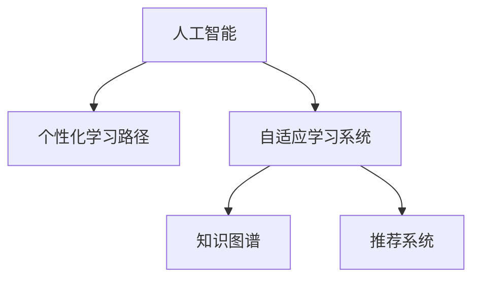

                 

## 1. 背景介绍

### 1.1 问题由来
教育行业的数字化转型正在如火如荼地进行中，传统的线下教学模式正在逐渐被线上教学所取代。然而，当前的教育系统仍然存在很多问题，比如教学内容刻板、学习方式单一、个性化程度不足等。这些问题导致学生的学习效果差强人意，教师的负担过重。为了解决这个问题，AI辅助教育成为了一个热门的研究方向，通过个性化学习路径设计，提供更加适合学生的学习方式，提高教育效果。

### 1.2 问题核心关键点
AI辅助教育的核心是利用人工智能技术，通过分析学生的学习行为和表现，设计个性化的学习路径，以提升学生的学习效果和兴趣。个性化的学习路径设计需要考虑多个因素，包括学生的学习风格、知识水平、兴趣爱好等。同时，还需要结合教师的教学经验和教学资源，形成一个综合性的个性化学习方案。

### 1.3 问题研究意义
AI辅助教育的个性化学习路径设计，对于提升教育质量、减轻教师负担、激发学生兴趣具有重要意义：

1. **提升教育质量**：通过个性化的学习路径，可以针对学生的特点进行针对性的教学，提高学生的学习效果。
2. **减轻教师负担**：通过AI技术，可以自动化地分析学生数据，生成个性化的学习路径，减轻教师的工作量。
3. **激发学生兴趣**：通过设计有趣的学习路径，可以增强学生的学习动机，提高学习效率。

## 2. 核心概念与联系

### 2.1 核心概念概述

为更好地理解AI辅助教育个性化学习路径设计方法，本节将介绍几个密切相关的核心概念：

- **人工智能**：利用计算机科学和数学原理，使计算机系统具有人类智能特性的技术。
- **个性化学习路径**：根据学生的学习特点和需求，设计出最适合其学习路径的方案。
- **自适应学习系统**：能够根据学生的学习行为和反馈，动态调整学习内容和方式的学习系统。
- **知识图谱**：一种用于描述知识之间的关联关系的图形结构，可以帮助系统理解复杂的知识体系。
- **推荐系统**：能够根据用户的行为和偏好，推荐合适的学习内容和资源。

这些核心概念之间的逻辑关系可以通过以下Mermaid流程图来展示：



这个流程图展示了个性化学习路径设计的核心概念及其之间的关系：

1. 人工智能技术为个性化学习路径设计提供了技术支持。
2. 自适应学习系统能够根据学生学习行为进行调整，实现个性化学习路径。
3. 知识图谱和推荐系统能够帮助系统理解知识结构和推荐合适的学习资源。

## 3. 核心算法原理 & 具体操作步骤
### 3.1 算法原理概述

AI辅助教育个性化学习路径设计，本质上是一个基于人工智能的自适应学习过程。其核心思想是：利用人工智能技术，分析学生的学习行为和表现，生成个性化的学习路径，以提升学生的学习效果。

形式化地，假设一个学生的学习状态为 $S$，其学习路径为 $P$，则学习路径设计问题可以表示为：

$$
P^* = \mathop{\arg\min}_{P} \mathcal{L}(S, P)
$$

其中 $\mathcal{L}$ 为学习路径的损失函数，用于衡量学习路径 $P$ 对学生 $S$ 的学习效果的影响。损失函数的设计需要考虑学生的学习风格、知识水平、兴趣爱好等因素。

通过梯度下降等优化算法，学习路径设计过程不断更新学习路径 $P$，最小化损失函数 $\mathcal{L}$，使得学习路径 $P$ 能够最大化提升学生的学习效果。

### 3.2 算法步骤详解

AI辅助教育个性化学习路径设计一般包括以下几个关键步骤：

**Step 1: 收集和分析学生数据**
- 收集学生的学习行为数据，如学习时间、题目正确率、学习进度等。
- 分析学生的知识水平和学习风格，生成学生画像。
- 结合知识图谱和推荐系统，推荐合适的学习资源和路径。

**Step 2: 设计学习路径**
- 根据学生的学习特点和需求，设计个性化的学习路径。
- 学习路径需要考虑学生的知识水平、兴趣爱好等因素。
- 确定学习路径的起点、终点、中间节点和转换条件。

**Step 3: 实现自适应学习系统**
- 开发自适应学习系统，根据学生的学习行为和反馈，动态调整学习路径。
- 系统需要实时监测学生的学习状态，根据情况进行路径调整。
- 提供可视化界面，展示学习路径和学习进度。

**Step 4: 评估和优化**
- 定期评估学生的学习效果和路径效果，生成评估报告。
- 根据评估结果，优化学习路径和系统算法。
- 不断迭代优化，提升学习路径设计的精确度和效果。

### 3.3 算法优缺点

AI辅助教育个性化学习路径设计方法具有以下优点：
1. 能够提供个性化的学习方案，提高学习效果。
2. 利用AI技术，能够自动分析和优化学习路径，减轻教师负担。
3. 能够实时监测学生学习情况，动态调整学习路径。

同时，该方法也存在一定的局限性：
1. 数据质量和完整性问题。学生的学习数据可能存在噪声和不完整，影响路径设计。
2. 路径设计的复杂度问题。个性化路径设计需要考虑多种因素，复杂度较高。
3. 系统实现的复杂性。自适应学习系统的设计和实现比较复杂，需要较高的技术水平。

尽管存在这些局限性，但就目前而言，基于AI的个性化学习路径设计方法仍然是最主流的研究方向。未来相关研究的重点在于如何进一步降低数据收集和处理难度，提高路径设计的灵活性和效率，同时兼顾可解释性和伦理安全性等因素。

### 3.4 算法应用领域

基于AI的个性化学习路径设计方法，在教育领域已经得到了广泛的应用，覆盖了从小学到大学的各个阶段。以下是几个典型的应用场景：

- **K-12教育**：针对中小学生设计个性化的学习路径，提供定制化的学习资源和练习。
- **高等教育**：针对大学生设计个性化的选课方案和作业安排，提升学习效率。
- **职业培训**：针对职业技能培训，设计个性化的培训路径和资源推荐，提高培训效果。
- **终身学习**：针对成人和老年人，设计个性化的学习路径和资源推荐，提升终身学习能力。

这些应用场景展示了个性化学习路径设计的广泛适用性，为不同年龄段和不同类型的学习者提供了更加灵活和高效的学习方案。

## 4. 数学模型和公式 & 详细讲解 & 举例说明（备注：数学公式请使用latex格式，latex嵌入文中独立段落使用 $$，段落内使用 $)
### 4.1 数学模型构建

本节将使用数学语言对AI辅助教育个性化学习路径设计过程进行更加严格的刻画。

假设学生的学习状态为 $S$，其学习路径为 $P$，则学习路径设计的目标为最大化学生的学习效果 $E$，可以表示为：

$$
E(S, P) = \max \left\{ E(S, P_1), E(S, P_2), \cdots, E(S, P_k) \right\}
$$

其中 $P_1, P_2, \cdots, P_k$ 为不同的学习路径，$E(S, P)$ 为学生 $S$ 在路径 $P$ 上的学习效果，需要考虑多个因素，如学习时间、题目正确率、知识掌握度等。

为了设计合适的学习路径，我们需要构建一个损失函数 $\mathcal{L}(S, P)$，用于衡量学习路径对学生学习效果的影响。常见的损失函数包括：

- 交叉熵损失：用于衡量学生对知识的掌握程度与预期之间的差异。
- 均方误差损失：用于衡量学生的学习时间和题目正确率与预期之间的差异。
- KL散度损失：用于衡量学生的学习路径与预期之间的差异。

### 4.2 公式推导过程

以下我们以交叉熵损失为例，推导其计算公式。

假设学生的学习状态为 $S$，其学习路径为 $P$，则交叉熵损失函数定义为：

$$
\mathcal{L}(S, P) = -\sum_{i=1}^N S_i \log P_i
$$

其中 $S_i$ 为学生学习状态的第 $i$ 个属性，$P_i$ 为学习路径中的第 $i$ 个节点。

根据链式法则，损失函数对路径 $P$ 的梯度为：

$$
\frac{\partial \mathcal{L}(S, P)}{\partial P} = -\sum_{i=1}^N S_i \frac{\partial \log P_i}{\partial P}
$$

其中 $\frac{\partial \log P_i}{\partial P}$ 为节点 $P_i$ 的梯度，可通过反向传播算法高效计算。

在得到损失函数的梯度后，即可带入优化算法公式，完成学习路径的迭代优化。重复上述过程直至收敛，最终得到最适合学生 $S$ 的学习路径 $P^*$。

### 4.3 案例分析与讲解

假设一个学生 $S$ 的学习状态包括三个属性：学习时间、题目正确率、知识掌握度。根据历史数据，学习路径 $P$ 中的节点 $P_1$ 表示数学题的正确率，$P_2$ 表示英语阅读理解，$P_3$ 表示科学实验。

- 假设 $S_1=10$（学习时间），$S_2=0.9$（题目正确率），$S_3=0.8$（知识掌握度）。
- 假设 $P_1=0.7$，$P_2=0.8$，$P_3=0.6$。

根据交叉熵损失函数，计算 $S$ 在路径 $P$ 上的损失：

$$
\mathcal{L}(S, P) = -10 \log 0.7 - 0.9 \log 0.8 - 0.8 \log 0.6 \approx 1.52
$$

根据损失函数的梯度公式，计算路径 $P$ 的梯度：

$$
\frac{\partial \mathcal{L}(S, P)}{\partial P} = -10 \frac{1}{0.7} - 0.9 \frac{1}{0.8} - 0.8 \frac{1}{0.6} \approx -7.1
$$

根据梯度下降算法，更新路径 $P$，以降低损失：

$$
P' = P - \eta \frac{\partial \mathcal{L}(S, P)}{\partial P} \approx 0.7 - \eta(-7.1)
$$

其中 $\eta$ 为学习率。重复上述过程，直到收敛，即可得到最适合学生 $S$ 的学习路径 $P^*$。

## 5. 项目实践：代码实例和详细解释说明
### 5.1 开发环境搭建

在进行个性化学习路径设计实践前，我们需要准备好开发环境。以下是使用Python进行TensorFlow开发的环境配置流程：

1. 安装Anaconda：从官网下载并安装Anaconda，用于创建独立的Python环境。

2. 创建并激活虚拟环境：
```bash
conda create -n tensorflow-env python=3.8 
conda activate tensorflow-env
```

3. 安装TensorFlow：根据CUDA版本，从官网获取对应的安装命令。例如：
```bash
conda install tensorflow tensorflow-gpu cudatoolkit=11.1 -c pytorch -c conda-forge
```

4. 安装各类工具包：
```bash
pip install numpy pandas scikit-learn matplotlib tqdm jupyter notebook ipython
```

完成上述步骤后，即可在`tensorflow-env`环境中开始开发实践。

### 5.2 源代码详细实现

这里我们以一个简单的学习路径设计为例，给出使用TensorFlow进行开发的PyTorch代码实现。

首先，定义学习路径的损失函数：

```python
import tensorflow as tf
from tensorflow.keras import layers

def cross_entropy_loss(y_true, y_pred):
    return tf.keras.losses.categorical_crossentropy(y_true, y_pred)
```

然后，定义学习路径的设计过程：

```python
class LearningPath(tf.keras.Model):
    def __init__(self, num_nodes, num_classes):
        super(LearningPath, self).__init__()
        self.num_nodes = num_nodes
        self.node_outputs = [layers.Dense(num_classes, activation='softmax') for _ in range(num_nodes)]
    
    def call(self, inputs):
        path_outputs = []
        for node in self.node_outputs:
            node_output = node(inputs)
            path_outputs.append(node_output)
        return path_outputs

# 创建一个学习路径模型
path_model = LearningPath(num_nodes=3, num_classes=3)
```

接着，定义学生的学习状态和目标函数：

```python
def student_state():
    return tf.random.normal(shape=(1, 3))

def target_loss(inputs, outputs, target_outputs):
    return cross_entropy_loss(target_outputs, outputs)
```

最后，启动训练流程：

```python
optimizer = tf.keras.optimizers.Adam(learning_rate=0.01)

# 训练过程
for epoch in range(1000):
    inputs = student_state()
    targets = tf.one_hot(tf.random.randint(0, 3, size=(1,)), depth=3)
    path_outputs = path_model(inputs)
    
    with tf.GradientTape() as tape:
        loss = target_loss(inputs, path_outputs, targets)
    
    gradients = tape.gradient(loss, path_model.trainable_variables)
    optimizer.apply_gradients(zip(gradients, path_model.trainable_variables))
    
    if (epoch+1) % 100 == 0:
        print(f"Epoch {epoch+1}, loss: {loss:.4f}")
```

以上就是使用TensorFlow进行个性化学习路径设计的基本代码实现。可以看到，TensorFlow提供了丰富的工具和API，可以方便地构建和训练学习路径模型。

### 5.3 代码解读与分析

让我们再详细解读一下关键代码的实现细节：

**LearningPath类**：
- `__init__`方法：初始化学习路径模型的节点数量和类别数。
- `call`方法：定义模型前向传播过程，返回每个节点的输出。

**学生状态函数和目标损失函数**：
- `student_state`方法：生成随机学习状态。
- `target_loss`方法：定义交叉熵损失函数。

**训练过程**：
- 定义优化器，学习率为0.01。
- 在每个epoch中，生成随机学习状态和目标输出。
- 计算模型输出与目标输出的交叉熵损失。
- 计算损失梯度并应用优化器更新模型参数。
- 每隔100个epoch输出当前损失，用于调试和观察训练效果。

可以看到，TensorFlow提供了丰富的工具和API，可以方便地构建和训练学习路径模型。开发者可以利用TensorFlow的灵活性和可扩展性，实现更加复杂的个性化学习路径设计。

当然，工业级的系统实现还需考虑更多因素，如模型的保存和部署、超参数的自动搜索、更灵活的任务适配层等。但核心的学习路径设计基本与此类似。

## 6. 实际应用场景
### 6.1 智能推荐系统

基于AI的个性化学习路径设计，可以广泛应用于智能推荐系统中。传统的推荐系统通常只根据用户历史行为进行推荐，难以考虑用户的个性化需求。而利用个性化学习路径设计，可以深入分析用户的兴趣爱好，推荐更加贴合用户需求的学习资源和路径。

在技术实现上，可以收集用户的学习行为数据，如浏览、点击、评论等，分析用户的知识水平和学习风格，生成用户画像。在此基础上，对学习路径进行微调，生成推荐的学习资源和路径。如此构建的智能推荐系统，能显著提升用户体验和满意度。

### 6.2 学习辅助工具

智能学习辅助工具是另一个重要的应用场景。传统的学习辅助工具通常只提供固定的学习资源和路径，难以满足学生的个性化需求。而利用个性化学习路径设计，可以设计更加灵活和动态的学习路径，提供更加个性化的学习资源和练习。

在技术实现上，可以构建一个在线学习平台，收集学生的学习行为数据，分析学生的学习状态和特点，设计个性化的学习路径和资源。同时，提供动态调整和优化功能，根据学生的学习效果和反馈，实时调整学习路径和资源，提升学习效果。

### 6.3 在线课程设计

在线课程设计也是个性化学习路径设计的典型应用场景。传统的在线课程通常采用固定的教学模式，难以适应不同学生的学习需求。而利用个性化学习路径设计，可以根据学生的学习状态和特点，设计个性化的课程内容和学习路径，提供更加贴合学生需求的教学方案。

在技术实现上，可以构建一个在线课程平台，收集学生的学习行为数据，分析学生的学习状态和特点，设计个性化的课程内容和路径。同时，提供动态调整和优化功能，根据学生的学习效果和反馈，实时调整课程内容和路径，提升学习效果。

### 6.4 未来应用展望

随着AI辅助教育技术的不断发展，基于个性化学习路径设计的方法将会在更多领域得到应用，为教育行业带来变革性影响。

在智慧教育领域，基于个性化学习路径设计的方法可以帮助学生自主学习，提高学习效果。对于教师而言，可以减少教学负担，有更多时间进行个性化辅导。

在在线教育领域，基于个性化学习路径设计的方法可以帮助在线教育平台提供更加个性化和灵活的教学方案，提升用户体验。

在教育技术领域，基于个性化学习路径设计的方法可以与其他教育技术进行融合，如虚拟现实(VR)、增强现实(AR)等，提供更加沉浸式和互动式学习体验。

此外，在企业培训、职业认证等领域，基于个性化学习路径设计的方法也可以发挥重要作用，提高培训效果和员工素质。

## 7. 工具和资源推荐
### 7.1 学习资源推荐

为了帮助开发者系统掌握AI辅助教育个性化学习路径设计理论基础和实践技巧，这里推荐一些优质的学习资源：

1. Coursera《AI for Education》课程：由斯坦福大学开设，介绍了AI在教育领域的应用，涵盖个性化学习路径设计等前沿话题。

2. Google AI Education：Google推出的教育AI项目，提供了大量教育领域的AI技术和应用案例，包括个性化学习路径设计等。

3. IEEE Xplore：IEEE出版的期刊和会议论文库，包含大量AI教育领域的学术论文和技术报告。

4. arXiv：arXiv上的AI教育相关论文，涵盖个性化学习路径设计等前沿研究方向。

通过对这些资源的学习实践，相信你一定能够快速掌握个性化学习路径设计的精髓，并用于解决实际的AI辅助教育问题。

### 7.2 开发工具推荐

高效的开发离不开优秀的工具支持。以下是几款用于AI辅助教育个性化学习路径设计开发的常用工具：

1. TensorFlow：由Google主导开发的开源深度学习框架，生产部署方便，适合大规模工程应用。提供了丰富的API和工具，支持个性化学习路径设计。

2. PyTorch：基于Python的开源深度学习框架，灵活动态的计算图，适合快速迭代研究。同样支持个性化学习路径设计。

3. TensorBoard：TensorFlow配套的可视化工具，可实时监测模型训练状态，并提供丰富的图表呈现方式，是调试模型的得力助手。

4. Jupyter Notebook：轻量级的交互式编程环境，支持Python、TensorFlow等多种语言，方便进行模型调试和实验。

5. Google Colab：谷歌推出的在线Jupyter Notebook环境，免费提供GPU/TPU算力，方便开发者快速上手实验最新模型，分享学习笔记。

合理利用这些工具，可以显著提升个性化学习路径设计的开发效率，加快创新迭代的步伐。

### 7.3 相关论文推荐

AI辅助教育个性化学习路径设计的研究源于学界的持续研究。以下是几篇奠基性的相关论文，推荐阅读：

1. "Personalized Learning Paths in Online Education"：探讨了基于机器学习的个性化学习路径设计方法，提出了基于协同过滤和规则推理的路径设计算法。

2. "Adaptive Learning Systems"：介绍了自适应学习系统的原理和实现方法，为个性化学习路径设计提供了技术基础。

3. "Knowledge Graphs for Educational Applications"：探讨了知识图谱在教育中的应用，为个性化学习路径设计提供了知识整合的支持。

4. "Recommender Systems in Education"：介绍了推荐系统在教育中的应用，为个性化学习路径设计提供了推荐引擎的支持。

这些论文代表了大规模学习路径设计的研究进展，通过学习这些前沿成果，可以帮助研究者把握学科前进方向，激发更多的创新灵感。

## 8. 总结：未来发展趋势与挑战
### 8.1 总结

本文对AI辅助教育个性化学习路径设计方法进行了全面系统的介绍。首先阐述了个性化学习路径设计的背景和意义，明确了其在提升教育效果、减轻教师负担、激发学生兴趣方面的独特价值。其次，从原理到实践，详细讲解了个性化学习路径设计的数学原理和关键步骤，给出了个性化学习路径设计的完整代码实例。同时，本文还广泛探讨了个性化学习路径设计在智能推荐系统、学习辅助工具、在线课程设计等领域的广泛应用前景，展示了其巨大潜力。

通过本文的系统梳理，可以看到，基于AI的个性化学习路径设计技术正在成为教育领域的重要范式，极大地拓展了教育系统的应用边界，催生了更多的落地场景。受益于人工智能技术的日益成熟，个性化学习路径设计必将在教育行业带来颠覆性变革，提升教育质量，激发学生潜力，引领教育技术的创新发展。

### 8.2 未来发展趋势

展望未来，个性化学习路径设计技术将呈现以下几个发展趋势：

1. 个性化程度将进一步提升。随着算力成本的下降和数据规模的扩张，个性化学习路径设计将更加精细化，能够更加贴合学生的个性化需求。

2. 自适应能力将进一步增强。未来的个性化学习路径设计将更加动态，能够实时调整学习路径和资源，满足学生的即时需求。

3. 知识图谱的应用将更加广泛。知识图谱将在个性化学习路径设计中扮演重要角色，帮助系统理解知识结构和推荐合适的学习资源。

4. 推荐系统将更加精准。未来的推荐系统将结合个性化学习路径设计，提供更加精准的学习资源推荐，提升学习效果。

5. 跨模态学习将更加普及。未来的个性化学习路径设计将不再局限于单一模态，能够融合视觉、语音、文本等多种模态信息，提升系统的感知能力和适应性。

6. 深度学习将更加深入。未来的个性化学习路径设计将更多地结合深度学习技术，如神经网络、生成对抗网络等，提升系统的智能化水平。

以上趋势凸显了个性化学习路径设计的广阔前景。这些方向的探索发展，必将进一步提升教育系统的智能化水平，为学生提供更加灵活、高效、个性化的学习体验。

### 8.3 面临的挑战

尽管个性化学习路径设计技术已经取得了瞩目成就，但在迈向更加智能化、普适化应用的过程中，它仍面临着诸多挑战：

1. 数据质量和隐私问题。学生的学习数据可能存在噪声和不完整，同时如何保护学生隐私也是一大挑战。

2. 系统实现复杂度问题。个性化学习路径设计需要考虑多种因素，实现复杂度高，需要较高的技术水平。

3. 模型解释性和透明性问题。如何赋予模型更强的可解释性，增强教师和学生对学习路径的理解，还需要更多的研究和探索。

4. 跨领域知识整合问题。如何将符号化的先验知识与神经网络模型进行有效融合，实现知识的灵活整合和迁移，是一大难题。

5. 跨模态数据融合问题。如何将视觉、语音、文本等多种模态信息进行协同建模，提升系统的感知能力和适应性，还需要更多的探索。

6. 伦理和安全问题。如何避免算法偏见，确保学习路径设计的公平性和安全性，还需要进一步的伦理和安全保障。

正视个性化学习路径设计面临的这些挑战，积极应对并寻求突破，将是个性化学习路径设计走向成熟的必由之路。相信随着学界和产业界的共同努力，这些挑战终将一一被克服，个性化学习路径设计必将在教育行业带来更广泛的应用和更深入的研究。

### 8.4 研究展望

面向未来，个性化学习路径设计的未来研究需要在以下几个方面寻求新的突破：

1. 探索无监督和半监督学习路径设计方法。摆脱对大规模标注数据的依赖，利用自监督学习、主动学习等无监督和半监督范式，最大限度利用非结构化数据，实现更加灵活高效的路径设计。

2. 研究参数高效和计算高效的路径设计方法。开发更加参数高效的路径设计算法，在固定大部分预训练参数的同时，只更新极少量的路径相关参数。同时优化路径设计模型的计算图，减少前向传播和反向传播的资源消耗，实现更加轻量级、实时性的部署。

3. 融合因果和对比学习范式。通过引入因果推断和对比学习思想，增强路径设计模型建立稳定因果关系的能力，学习更加普适、鲁棒的学习路径。

4. 引入更多先验知识。将符号化的先验知识，如知识图谱、逻辑规则等，与神经网络模型进行巧妙融合，引导路径设计过程学习更准确、合理的学习路径。

5. 结合因果分析和博弈论工具。将因果分析方法引入路径设计模型，识别出路径设计的关键特征，增强输出解释的因果性和逻辑性。借助博弈论工具刻画人机交互过程，主动探索并规避路径设计的脆弱点，提高系统稳定性。

6. 纳入伦理道德约束。在路径设计目标中引入伦理导向的评估指标，过滤和惩罚有偏见、有害的路径设计结果。同时加强人工干预和审核，建立路径设计行为的监管机制，确保路径设计的公平性和安全性。

这些研究方向的探索，必将引领个性化学习路径设计技术迈向更高的台阶，为构建安全、可靠、可解释、可控的智能教育系统铺平道路。面向未来，个性化学习路径设计技术还需要与其他人工智能技术进行更深入的融合，如知识表示、因果推理、强化学习等，多路径协同发力，共同推动教育技术的创新发展。只有勇于创新、敢于突破，才能不断拓展学习路径设计的边界，让智能化教育技术更好地造福人类社会。

## 9. 附录：常见问题与解答
**Q1：个性化学习路径设计是否适用于所有教育场景？**

A: 个性化学习路径设计在大多数教育场景中都能取得不错的效果，特别是对于大规模个性化需求的教育场景。但对于一些特定领域的教育场景，如个别辅导、职业教育等，由于数据收集和处理的难度较大，个性化路径设计的复杂度较高，因此需要结合实际场景进行灵活设计。

**Q2：如何选择合适的学习率？**

A: 学习率的选择需要根据实际数据和模型特性进行优化。一般建议从0.001开始调参，逐步减小学习率，直至收敛。同时，可以使用warmup策略，在开始阶段使用较小的学习率，再逐渐过渡到预设值。需要注意的是，不同的优化器(如Adam、SGD等)以及不同的学习率调度策略，可能需要设置不同的学习率阈值。

**Q3：数据质量和隐私问题如何处理？**

A: 数据质量和隐私问题是个性化学习路径设计中的重要挑战。为解决这些问题，可以采用数据预处理、数据增强、数据匿名化等技术，提高数据质量和数据隐私保护水平。同时，可以使用差分隐私技术，在保护隐私的前提下，进行有效的数据分析。

**Q4：系统实现的复杂度问题如何解决？**

A: 系统实现的复杂度问题是个性化学习路径设计中的一大挑战。为了降低复杂度，可以采用模块化设计、组件复用等方法，简化系统的设计和实现。同时，可以利用云计算平台和开源框架，提高系统的开发效率和可扩展性。

**Q5：模型解释性和透明性问题如何解决？**

A: 模型解释性和透明性问题是个性化学习路径设计中的一大难题。为了解决这些问题，可以采用模型可视化和解释工具，如TensorBoard、Keras等，帮助教师和学生理解模型的内部结构和决策过程。同时，可以设计更加可解释的模型结构，如决策树、规则引擎等，增强模型的可解释性和透明性。

这些技术方法和思路，可以有效地解决个性化学习路径设计中面临的挑战，提升系统的智能化水平和用户满意度。

