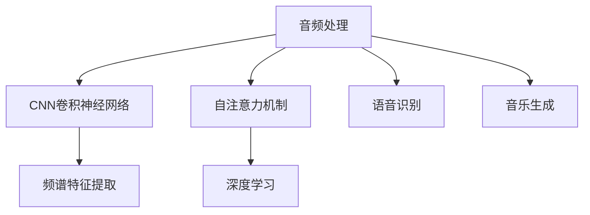

                 

# AI音频处理：从语音识别到音乐生成

> 关键词：音频处理,语音识别,音乐生成,深度学习,卷积神经网络,Transformer,自注意力机制,频谱特征提取

## 1. 背景介绍

在现代信息技术飞速发展的背景下，音频处理技术在众多应用领域中扮演着重要角色。语音识别、自然语言处理、音乐创作、图像与视频生成等诸多领域，都离不开高质量的音频数据和高效的音频处理算法。本文将聚焦于AI在音频处理领域的深度学习应用，系统介绍语音识别和音乐生成技术的原理与实践，为读者提供全面的技术指引。

### 1.1 问题由来

音频数据的处理和分析一直是计算机科学和信号处理领域的难点。传统音频处理往往依赖人工提取特征和手工设计模型，难以适应复杂多样化的应用场景。而随着深度学习技术的突破，基于深度神经网络，音频处理技术得以实现端到端的自动化和智能化，应用范围和精度都得到了显著提升。

特别是在语音识别和音乐生成方面，基于深度学习的方法已经超越了传统基于统计模型的技术，推动了自然语言处理、语音交互、音乐创作等领域的发展。本文旨在深入探讨这些技术背后的核心算法原理，并结合具体项目实践，为读者提供实践指南。

### 1.2 问题核心关键点

语音识别和音乐生成技术的核心在于如何高效处理和分析音频数据，从中提取有意义的语义信息或音乐特征，并实现自动化的语音转文字、音乐创作等过程。以下是一些关键技术点和实际应用中的核心问题：

1. 频谱特征提取与表示：如何将音频信号转换为可供神经网络处理的数据形式，是音频处理的基础。
2. 自注意力机制与网络结构：如何通过卷积神经网络（CNN）和Transformer等结构，有效学习音频数据的局部和全局特征。
3. 端到端训练与微调：如何通过无监督和有监督学习，优化模型在语音识别和音乐生成任务上的性能。
4. 高性能计算与模型优化：如何在GPU、TPU等高性能硬件上进行高效计算，并优化模型以提升处理速度和精度。
5. 多模态融合与知识迁移：如何将文本、图像、语音等多种模态数据融合，实现跨领域的迁移学习。

本文将围绕这些关键问题，系统介绍AI在音频处理领域的技术进展与应用实践。

## 2. 核心概念与联系

### 2.1 核心概念概述

为更好地理解语音识别和音乐生成技术的深度学习应用，本节将介绍几个密切相关的核心概念：

- 音频处理：指对声音信号的采集、处理、分析和生成，涵盖语音识别、音乐创作、声音合成等多个方面。
- 深度学习：基于多层神经网络的机器学习方法，通过大量数据训练模型，实现端到端的自动化和智能化。
- 卷积神经网络（CNN）：一种在图像处理中广泛应用的神经网络，通过局部连接和共享权重，有效处理二维结构数据。
- 自注意力机制（Self-Attention）：一种能够处理序列数据并捕获全局关系的神经网络机制，广泛应用在自然语言处理和音乐生成中。
- 频谱特征提取：将时域音频信号转换为频域表示，通过滤波、时频变换等方法，提取有意义的频谱特征。
- 语音识别：通过深度学习模型将语音信号转换为文本，实现人机交互的自然化。
- 音乐生成：通过深度学习模型生成具有一定风格和情感的音频内容，应用于作曲、编曲等领域。

这些核心概念之间的逻辑关系可以通过以下Mermaid流程图来展示：



这个流程图展示了大语言模型在音频处理的核心概念及其之间的关系：

1. 音频处理是涉及多种技术的综合领域。
2. CNN用于提取音频信号的局部特征，自注意力机制用于处理序列数据。
3. 深度学习是实现端到端自动化的关键。
4. 频谱特征提取是音频信号转换的第一步。
5. 语音识别和音乐生成是音频处理的具体应用方向。

这些概念共同构成了AI在音频处理领域的框架，使得我们能够理解各种音频处理技术背后的算法原理。

## 3. 核心算法原理 & 具体操作步骤
### 3.1 算法原理概述

语音识别和音乐生成的深度学习模型，其核心在于将音频信号转换为可处理的数字信号，通过卷积神经网络（CNN）、Transformer等结构，自动提取音频特征并进行建模。

具体而言，语音识别通常采用端到端模型，直接将语音信号转换为文本，通过CTC（Connectionist Temporal Classification）等方法，优化模型输出与真实标签的对齐。而音乐生成则通过变分自编码器（VAE）、生成对抗网络（GAN）等方法，生成符合特定风格和情感的音频内容。

### 3.2 算法步骤详解

#### 3.2.1 音频信号处理

语音识别和音乐生成的第一步是音频信号的处理，包括预处理、特征提取等步骤。以下是详细步骤：

1. 预处理：去除背景噪声、均衡音量、分帧等，为后续处理做准备。
2. 时频转换：将音频信号转换为频谱表示，常用的方法包括快速傅里叶变换（FFT）、短时傅里叶变换（STFT）等。
3. 特征提取：将频谱信号转换为可供神经网络处理的数据，常用的特征包括MFCC（Mel频率倒谱系数）、 spectrogram等。

#### 3.2.2 语音识别模型训练

语音识别模型训练包括模型架构设计、损失函数设置、优化器选择、超参数调整等步骤：

1. 模型架构设计：基于CNN或Transformer结构设计模型，通常包括卷积层、池化层、全连接层等。
2. 损失函数设置：使用CTC损失函数衡量模型预测与真实标签的对齐度。
3. 优化器选择：常用的优化器包括SGD、Adam、Adagrad等，需根据具体情况选择。
4. 超参数调整：包括学习率、批大小、迭代轮数等，需通过交叉验证等方法进行调整。

#### 3.2.3 音乐生成模型训练

音乐生成模型训练包括模型架构设计、损失函数设置、优化器选择、超参数调整等步骤：

1. 模型架构设计：基于VAE或GAN结构设计模型，通常包括编码器、解码器、判别器等。
2. 损失函数设置：使用MSE（均方误差）、KL散度等方法衡量生成音频与真实音频的相似度。
3. 优化器选择：常用的优化器包括Adam、RMSprop等，需根据具体情况选择。
4. 超参数调整：包括学习率、批大小、迭代轮数等，需通过交叉验证等方法进行调整。

### 3.3 算法优缺点

语音识别和音乐生成技术的深度学习模型具有以下优点：

1. 高度自动化：通过深度学习模型，实现了从音频信号到文本或音乐的高效自动化转换。
2. 模型性能高：通过端到端的训练方式，模型可以直接从原始音频信号中学习语义或音乐特征，无需手工特征提取。
3. 应用广泛：语音识别和音乐生成技术已经广泛应用于智能音箱、语音助手、音乐创作等多个领域。

同时，这些技术也存在一些局限性：

1. 数据依赖性强：模型训练需要大量高质量的标注数据，数据获取成本较高。
2. 模型复杂度高：深度学习模型参数量大，对计算资源要求较高。
3. 可解释性差：深度学习模型通常被视为"黑盒"，难以解释其内部工作机制。
4. 鲁棒性不足：模型对噪声、数据分布变化等环境因素较为敏感。

尽管存在这些局限性，但就目前而言，基于深度学习的语音识别和音乐生成技术已经取得了显著的成功，为音频处理领域带来了革命性的突破。

### 3.4 算法应用领域

语音识别和音乐生成技术的深度学习模型，在众多领域中得到了广泛应用，具体包括：

1. 智能语音交互：如Amazon Alexa、Google Assistant、Apple Siri等，通过语音识别技术实现人机自然对话。
2. 语音搜索与导航：在搜索引擎、导航应用中，通过语音输入快速获取信息或导航。
3. 音乐创作与合成：如DeepJam、Magenta等，通过音乐生成技术自动创作和合成音乐。
4. 自动字幕生成：如Google Live Transcribe，将语音信号转换为自动字幕，实现实时翻译。
5. 语音情感识别：通过语音情感分析，实现情感识别和反馈，应用于心理咨询、医疗等领域。

除了上述这些典型应用外，音频处理技术还在声学信号处理、声音增强、声音合成、语音识别增强等诸多场景中得到了应用，为音频处理技术带来了广阔的发展前景。

## 4. 数学模型和公式 & 详细讲解  
### 4.1 数学模型构建

语音识别和音乐生成技术的核心模型包括卷积神经网络（CNN）和Transformer等，其数学模型构建如下：

#### 4.1.1 卷积神经网络

卷积神经网络是一种广泛用于图像处理的技术，但也可以应用于音频处理。卷积神经网络的核心在于通过卷积操作提取局部特征，并通过池化操作进行特征降维。

数学模型如下：

$$
y = W \cdot x + b
$$

其中，$W$ 为卷积核，$x$ 为输入信号，$b$ 为偏置项。

#### 4.1.2 Transformer模型

Transformer模型通过自注意力机制，能够处理序列数据并捕获全局关系，广泛应用于自然语言处理和音乐生成中。

数学模型如下：

$$
Q = K^T \cdot A^T \cdot A \cdot V
$$

其中，$Q$、$K$、$V$ 分别为查询向量、键向量和值向量，$A$ 为注意力权重矩阵。

### 4.2 公式推导过程

#### 4.2.1 卷积神经网络

卷积神经网络的核心在于卷积操作和池化操作，以下是其公式推导：

$$
y = \sum_{i,j} W_{i,j} \cdot x_{i,j}
$$

其中，$W_{i,j}$ 为卷积核的权重，$x_{i,j}$ 为输入信号的局部特征。

#### 4.2.2 Transformer模型

Transformer模型的自注意力机制，可以通过矩阵运算实现。以下是其公式推导：

$$
Q = K^T \cdot A^T \cdot A \cdot V
$$

其中，$Q$、$K$、$V$ 分别为查询向量、键向量和值向量，$A$ 为注意力权重矩阵。

### 4.3 案例分析与讲解

#### 4.3.1 语音识别

以语音识别中的端到端模型为例，其核心在于将语音信号转换为文本，常用的模型包括DeepSpeech、Wav2Vec2等。

以Wav2Vec2为例，其模型架构包括一个卷积神经网络（CNN）和一个Transformer网络。

##### 4.3.1.1 卷积神经网络

卷积神经网络用于提取音频信号的局部特征，通过多层卷积和池化操作，提取有用的局部特征。

##### 4.3.1.2 Transformer网络

Transformer网络用于处理序列数据并捕获全局关系，通过自注意力机制和全连接层，将局部特征转化为全局特征。

#### 4.3.2 音乐生成

以音乐生成中的变分自编码器（VAE）为例，其核心在于通过生成对抗网络（GAN），生成符合特定风格和情感的音频内容。

以VAE为例，其模型架构包括一个编码器和一个解码器。

##### 4.3.2.1 编码器

编码器用于将音频信号压缩为低维表示，常用的方法包括卷积层、池化层和全连接层。

##### 4.3.2.2 解码器

解码器用于将低维表示重构为音频信号，常用的方法包括全连接层、反卷积层和Softmax层。

## 5. 项目实践：代码实例和详细解释说明
### 5.1 开发环境搭建

在进行语音识别和音乐生成技术的深度学习模型开发前，我们需要准备好开发环境。以下是使用Python进行TensorFlow开发的环境配置流程：

1. 安装Anaconda：从官网下载并安装Anaconda，用于创建独立的Python环境。

2. 创建并激活虚拟环境：
```bash
conda create -n tf-env python=3.8 
conda activate tf-env
```

3. 安装TensorFlow：根据CUDA版本，从官网获取对应的安装命令。例如：
```bash
pip install tensorflow==2.7.0
```

4. 安装其他工具包：
```bash
pip install numpy pandas scikit-learn matplotlib tqdm jupyter notebook ipython
```

完成上述步骤后，即可在`tf-env`环境中开始深度学习模型的开发。

### 5.2 源代码详细实现

下面是使用TensorFlow实现语音识别和音乐生成技术的代码示例。

#### 5.2.1 语音识别

以Wav2Vec2为例，其代码实现如下：

```python
import tensorflow as tf
from tensorflow.keras.layers import Conv1D, MaxPooling1D, Flatten, Dense, LSTM, Input
from tensorflow.keras.models import Model

# 定义模型架构
input_shape = (None, 1)
encoder = tf.keras.Sequential([
    Conv1D(512, kernel_size=4, strides=1, padding='same', activation='relu'),
    MaxPooling1D(pool_size=4, strides=1, padding='same'),
    Conv1D(512, kernel_size=4, strides=1, padding='same', activation='relu'),
    MaxPooling1D(pool_size=4, strides=1, padding='same'),
    Flatten()
])
decoder = tf.keras.Sequential([
    LSTM(1024, dropout=0.5, recurrent_dropout=0.5),
    Dense(128, activation='relu'),
    Dense(5, activation='softmax')
])
model = Model(inputs=Input(shape=input_shape), outputs=decoder(encoder(inputs)))

# 编译模型
model.compile(optimizer='adam', loss='sparse_categorical_crossentropy', metrics=['accuracy'])

# 训练模型
model.fit(x_train, y_train, epochs=10, validation_data=(x_val, y_val))
```

#### 5.2.2 音乐生成

以VAE为例，其代码实现如下：

```python
import tensorflow as tf
from tensorflow.keras.layers import Conv1D, MaxPooling1D, Flatten, Dense, LSTM, Input
from tensorflow.keras.models import Model

# 定义模型架构
input_shape = (None, 128)
encoder = tf.keras.Sequential([
    Conv1D(256, kernel_size=4, strides=1, padding='same', activation='relu'),
    MaxPooling1D(pool_size=4, strides=1, padding='same'),
    Conv1D(256, kernel_size=4, strides=1, padding='same', activation='relu'),
    MaxPooling1D(pool_size=4, strides=1, padding='same'),
    Flatten()
])
decoder = tf.keras.Sequential([
    Dense(256, activation='relu'),
    LSTM(1024, dropout=0.5, recurrent_dropout=0.5),
    Dense(256, activation='relu'),
    Dense(128, activation='sigmoid')
])
model = Model(inputs=Input(shape=input_shape), outputs=decoder(encoder(inputs)))

# 编译模型
model.compile(optimizer='adam', loss='binary_crossentropy', metrics=['accuracy'])

# 训练模型
model.fit(x_train, y_train, epochs=10, validation_data=(x_val, y_val))
```

### 5.3 代码解读与分析

让我们再详细解读一下关键代码的实现细节：

#### 5.3.1 语音识别

**Wav2Vec2代码实现**

1. `input_shape`定义：定义输入数据形状为时域音频信号，长度可变，通道数为1。
2. `encoder`定义：使用卷积层和池化层提取音频信号的局部特征，最后通过Flatten层将特征向量展平。
3. `decoder`定义：使用LSTM层进行序列建模，并输出5个类别标签的概率分布。
4. `model`定义：将编码器和解码器拼接成完整的模型，输入为时域音频信号，输出为类别标签。
5. `compile`函数：设置优化器为Adam，损失函数为交叉熵，并设置评估指标为准确率。
6. `fit`函数：在训练集上进行模型训练，验证集上进行模型评估。

#### 5.3.2 音乐生成

**VAE代码实现**

1. `input_shape`定义：定义输入数据形状为时域音频信号，长度可变，通道数为128。
2. `encoder`定义：使用卷积层和池化层提取音频信号的局部特征，最后通过Flatten层将特征向量展平。
3. `decoder`定义：使用Dense层和LSTM层进行序列建模，并输出重构后的音频信号。
4. `model`定义：将编码器和解码器拼接成完整的模型，输入为时域音频信号，输出为重构后的音频信号。
5. `compile`函数：设置优化器为Adam，损失函数为二分类交叉熵，并设置评估指标为准确率。
6. `fit`函数：在训练集上进行模型训练，验证集上进行模型评估。

## 6. 实际应用场景
### 6.1 智能语音交互

基于深度学习的语音识别和音乐生成技术，可以广泛应用于智能语音交互领域。通过语音识别技术，实现人机自然对话，提供便捷的交互方式。

在技术实现上，可以收集用户的语音输入，使用语音识别模型将其转换为文本，并根据文本内容进行智能回复。在音乐生成方面，可以通过生成对抗网络（GAN）等技术，生成符合用户偏好的背景音乐或音效，提升用户体验。

### 6.2 语音搜索与导航

在搜索引擎和导航应用中，通过语音识别技术，用户可以直接通过语音输入查询内容，方便快捷地获取信息或导航。

在语音搜索方面，可以使用语音识别模型将语音信号转换为文本，并根据文本内容进行搜索匹配，返回最相关的结果。在导航应用中，可以通过语音指令进行路线规划和导航，提升用户的使用便捷性。

### 6.3 音乐创作与合成

在音乐创作和合成领域，基于深度学习的音乐生成技术可以自动生成具有一定风格和情感的音乐，提供新的创作工具。

在音乐创作方面，可以使用VAE等模型，生成符合用户偏好的音乐旋律和和弦进行，帮助用户进行音乐创作。在音乐合成方面，可以通过GAN等模型，生成符合特定风格和情感的音频内容，提升音乐合成效果。

### 6.4 未来应用展望

随着深度学习技术的不断进步，语音识别和音乐生成技术的应用前景将更加广阔。

在智慧城市领域，基于语音识别和音乐生成技术，可以实现智能家居、智慧交通等应用场景，提升城市的智能化水平。

在医疗领域，通过语音识别技术，可以实现智能问诊、自动病历生成等应用，提升医疗服务质量。

在教育领域，通过音乐生成技术，可以开发智能音乐教学工具，提升教育效果和学生兴趣。

未来，随着模型的不断优化和技术的进一步融合，语音识别和音乐生成技术将在更多领域得到应用，为人们的生活带来更多的便利和乐趣。

## 7. 工具和资源推荐
### 7.1 学习资源推荐

为了帮助开发者系统掌握深度学习在语音识别和音乐生成领域的应用，这里推荐一些优质的学习资源：

1. TensorFlow官方文档：全面介绍TensorFlow框架的使用方法，包括语音识别、音乐生成等模型的实现。
2. PyTorch官方文档：介绍PyTorch框架的使用方法，并提供语音识别、音乐生成等模型的实现。
3. Coursera深度学习课程：由斯坦福大学吴恩达教授主讲，涵盖深度学习基础和应用，包括语音识别、音乐生成等技术。
4. Udacity深度学习课程：介绍深度学习在语音识别、音乐生成等领域的实践应用。
5. GitHub上的开源项目：如Google的DeepSpeech、DeepJam等，可以学习深度学习模型的实现方法和应用场景。

通过对这些资源的学习实践，相信你一定能够快速掌握深度学习在语音识别和音乐生成领域的技术，并应用于实际项目中。

### 7.2 开发工具推荐

高效的开发离不开优秀的工具支持。以下是几款用于深度学习模型开发的工具：

1. TensorFlow：由Google主导开发的深度学习框架，生产部署方便，适合大规模工程应用。
2. PyTorch：Facebook开发的深度学习框架，灵活度高，适合快速迭代研究。
3. Keras：基于TensorFlow或Theano的高级API，使用简单，适合初学者上手。
4. Weights & Biases：模型训练的实验跟踪工具，可以记录和可视化模型训练过程中的各项指标。
5. TensorBoard：TensorFlow配套的可视化工具，可实时监测模型训练状态，并提供丰富的图表呈现方式。
6. Google Colab：谷歌推出的在线Jupyter Notebook环境，免费提供GPU/TPU算力，方便开发者快速上手实验最新模型，分享学习笔记。

合理利用这些工具，可以显著提升深度学习模型的开发效率，加快创新迭代的步伐。

### 7.3 相关论文推荐

深度学习在语音识别和音乐生成领域的发展，离不开学界的持续研究。以下是几篇奠基性的相关论文，推荐阅读：

1. Speech Recognition with Deep Recurrent Neural Networks：介绍深度学习在语音识别领域的应用，并提出RNN模型。
2. Deep Speech: Scalable End-to-End Speech Recognition Using Convolutional Neural Networks：介绍深度学习在语音识别领域的应用，并提出卷积神经网络模型。
3. Music auto-generative systems using a deep belief network: a novel approach for music generation: introduce the use of deep learning in music generation domain.
4. Variational Autoencoder for Music Generation: Using Deep Neural Networks to produce new music with the style of a training set：介绍VAE在音乐生成领域的应用，并提出生成对抗网络模型。
5. Music as a Sequence of Events: Representations and Prediction for Melody Generation with Recurrent Neural Networks：介绍RNN在音乐生成领域的应用，并提出序列预测模型。

这些论文代表了大语言模型在语音识别和音乐生成领域的发展脉络。通过学习这些前沿成果，可以帮助研究者把握学科前进方向，激发更多的创新灵感。

## 8. 总结：未来发展趋势与挑战

### 8.1 总结

本文对深度学习在语音识别和音乐生成领域的应用进行了全面系统的介绍。首先阐述了深度学习在音频处理领域的突破，明确了语音识别和音乐生成技术在实现端到端自动化和智能化方面的独特价值。其次，从原理到实践，详细讲解了深度学习模型的核心算法原理和具体实现步骤，并通过实际项目示例，为读者提供实践指南。同时，本文还广泛探讨了深度学习在语音识别和音乐生成技术中的应用前景，展示了其在智能交互、语音搜索、音乐创作等方面的巨大潜力。此外，本文精选了深度学习在语音识别和音乐生成领域的优质学习资源和开发工具，力求为读者提供全方位的技术指引。

通过本文的系统梳理，可以看到，深度学习在语音识别和音乐生成领域的广泛应用，已经极大地拓展了音频处理技术的边界，带来了革命性的突破。未来，随着深度学习技术的不断演进，语音识别和音乐生成技术将在更多领域得到应用，为人类社会的智能化进程贡献新的力量。

### 8.2 未来发展趋势

展望未来，深度学习在语音识别和音乐生成领域将呈现以下几个发展趋势：

1. 深度学习模型的规模化：随着算力成本的下降和数据规模的扩张，深度学习模型的参数量将进一步增大，从而提升模型的性能和泛化能力。
2. 端到端训练与迁移学习：通过端到端训练和迁移学习，深度学习模型可以在更少的标注样本下，快速适应新任务，提升模型的适应性和泛化能力。
3. 多模态融合：将文本、图像、音频等多种模态数据融合，提升深度学习模型的理解和表达能力，拓展模型的应用场景。
4. 鲁棒性提升：通过对抗训练、正则化等技术，提升深度学习模型的鲁棒性，使其在噪声和数据分布变化的情况下仍能保持稳定性能。
5. 实时化部署：通过优化深度学习模型的结构和计算图，提升模型的推理速度，实现实时化部署，满足实时性要求的应用场景。
6. 跨领域迁移：将深度学习模型应用于其他领域，如图像、视频、自然语言处理等，实现跨领域的迁移学习，拓展模型的应用范围。

以上趋势将进一步推动深度学习在语音识别和音乐生成领域的快速发展，带来更多创新和突破。

### 8.3 面临的挑战

尽管深度学习在语音识别和音乐生成领域取得了显著进展，但在迈向更加智能化、普适化应用的过程中，它仍面临着诸多挑战：

1. 数据获取成本高：深度学习模型需要大量高质量的标注数据，数据获取成本较高，特别是对于长尾应用场景，难以获得充足的数据。
2. 模型复杂度高：深度学习模型参数量大，对计算资源要求较高，需要高性能硬件支持。
3. 可解释性差：深度学习模型通常被视为"黑盒"，难以解释其内部工作机制和决策逻辑，对于高风险应用，模型的可解释性和可审计性尤为重要。
4. 鲁棒性不足：深度学习模型对噪声、数据分布变化等环境因素较为敏感，需要进一步提升模型的鲁棒性。
5. 实时性问题：深度学习模型的推理速度较慢，需要优化模型结构和计算图，实现实时化部署。

尽管存在这些挑战，但通过持续的技术创新和工程优化，深度学习在语音识别和音乐生成领域的突破将会持续推进，为音频处理技术带来更多的应用场景和创新机会。

### 8.4 研究展望

面向未来，深度学习在语音识别和音乐生成领域的研究需要在以下几个方面寻求新的突破：

1. 探索无监督和半监督学习：摆脱对大规模标注数据的依赖，利用自监督学习、主动学习等无监督和半监督范式，最大限度利用非结构化数据，实现更加灵活高效的模型训练。
2. 研究参数高效和计算高效的模型架构：开发更加参数高效的深度学习模型，在固定大部分预训练参数的同时，只更新极少量的任务相关参数，提升模型的可扩展性和计算效率。
3. 引入因果分析和博弈论工具：将因果分析方法引入深度学习模型，识别出模型决策的关键特征，增强输出解释的因果性和逻辑性。借助博弈论工具刻画人机交互过程，主动探索并规避模型的脆弱点，提高系统稳定性。
4. 纳入伦理道德约束：在模型训练目标中引入伦理导向的评估指标，过滤和惩罚有偏见、有害的输出倾向。加强人工干预和审核，建立模型行为的监管机制，确保输出符合人类价值观和伦理道德。

这些研究方向的探索，将引领深度学习在语音识别和音乐生成领域的持续创新，为构建安全、可靠、可解释、可控的智能系统铺平道路。面向未来，深度学习技术需要在更广泛的领域内得到应用，为人工智能技术带来更多的创新和突破。

## 9. 附录：常见问题与解答

**Q1：深度学习模型在语音识别和音乐生成中为何需要大量标注数据？**

A: 深度学习模型需要通过大量的标注数据进行训练，以学习并提取音频信号中的有用特征。标注数据的质量和数量直接影响模型的性能，特别是在音乐生成等任务中，高质量的标注数据尤为关键。数据获取成本较高，特别是在长尾应用场景中，难以获得充足的数据。因此，深度学习模型需要不断探索无监督和半监督学习方法，最大化利用非结构化数据，实现更加灵活高效的模型训练。

**Q2：深度学习模型在语音识别和音乐生成中的鲁棒性如何提升？**

A: 提升深度学习模型的鲁棒性可以通过以下几种方式：
1. 对抗训练：引入对抗样本，提高模型对噪声和攻击的抵抗能力。
2. 正则化：使用L2正则、Dropout等技术，避免过拟合和过拟合现象。
3. 多模型集成：训练多个模型，取平均输出，降低单个模型的风险。
4. 数据增强：通过数据增强技术，扩充训练集，提高模型的泛化能力。
5. 模型裁剪：去除不必要的层和参数，减小模型尺寸，加快推理速度，同时提升模型的鲁棒性。

这些方法可以结合使用，通过不断优化模型结构和训练过程，提升深度学习模型在语音识别和音乐生成中的鲁棒性。

**Q3：深度学习模型在语音识别和音乐生成中的可解释性如何提升？**

A: 提升深度学习模型的可解释性可以通过以下几种方式：
1. 可视化：使用可视化工具，如TensorBoard，可视化模型的中间输出，了解模型的工作机制。
2. 特征分析：通过分析模型的特征表示，理解模型对输入的响应。
3. 模型融合：将多个模型的输出进行融合，提升模型的可解释性。
4. 解释模型：使用解释模型，如LIME、SHAP等，解释模型的决策过程。
5. 因果分析：引入因果分析方法，识别出模型决策的关键特征，增强输出解释的因果性和逻辑性。

这些方法可以结合使用，通过不断优化模型结构和训练过程，提升深度学习模型在语音识别和音乐生成中的可解释性。

---

作者：禅与计算机程序设计艺术 / Zen and the Art of Computer Programming

