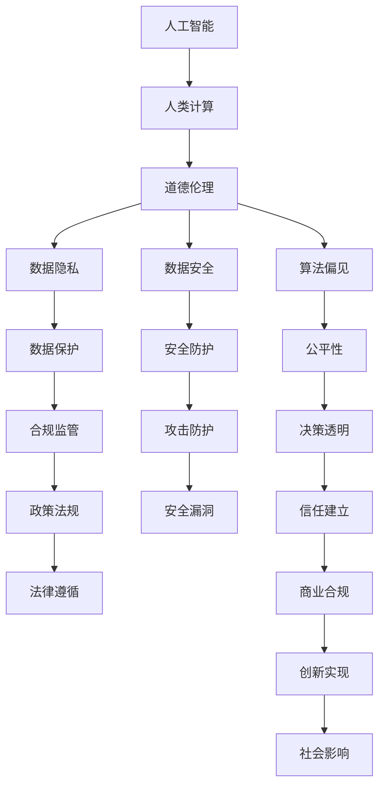

                 

# AI驱动的创新：人类计算在商业中的道德考虑因素

> 关键词：人工智能(AI)、人类计算、道德伦理、商业创新、隐私保护、数据安全、可持续发展

## 1. 背景介绍

### 1.1 问题由来

随着人工智能技术的迅猛发展，AI正逐步渗透到各行各业，驱动着创新和变革的浪潮。然而，AI的发展也引发了一系列伦理和道德问题，特别是在商业应用中，如何平衡技术创新与社会道德、隐私保护、公平性等价值导向，成为了一个亟待解决的难题。

在过去的两三年里，AI技术在商业中的应用日益广泛，涉及领域包括智能客服、推荐系统、市场营销、供应链优化等。虽然这些技术的应用带来了显著的商业价值，但其潜在的伦理和道德风险也不容忽视。数据隐私泄露、算法偏见、对就业的影响等负面效应，引起了社会各界的广泛关注和讨论。

### 1.2 问题核心关键点

本文聚焦于AI驱动的商业创新中，如何处理和平衡技术进步与道德伦理的考虑。将从AI在商业中的应用、当前面临的道德伦理问题、解决策略等多个角度进行深入分析，力求为AI技术的健康发展提供切实可行的方案。

## 2. 核心概念与联系

### 2.1 核心概念概述

为更好地理解AI在商业中的道德考虑，本节将介绍几个关键概念：

- 人工智能(AI)：指由算法、计算能力和数据组成的智能系统，可以模拟人类的学习、推理和感知能力。
- 人类计算：指通过模拟人类思维和行为模式，来解决问题或创造价值的技术。
- 道德伦理：涉及人类行为和决策的伦理原则和规范，对AI技术在商业应用中的行为提出指导和规范。
- 数据隐私：指个人或机构数据在收集、存储、处理和分享过程中，保护其不被滥用或泄露的权利。
- 数据安全：指确保数据在传输、存储、访问过程中不被非法篡改、破坏或窃取，保护数据完整性和可用性。
- 算法偏见：指算法在训练或应用过程中，由于数据偏差、模型设计等因素导致的对某些群体的歧视或不公平对待。
- 商业创新：指企业通过引入新技术或改变商业模式，创造新的产品、服务或业务模式的创新活动。

这些核心概念之间的逻辑关系可以通过以下Mermaid流程图来展示：



这个流程图展示了一系列相关概念及其之间的关系：

1. 人工智能和人类计算是商业创新的基础技术。
2. 道德伦理对AI技术在商业应用中的行为提出指导和规范。
3. 数据隐私和数据安全是保障AI技术健康发展的关键。
4. 算法偏见和公平性是AI技术应用中必须正视的伦理问题。
5. 合规监管和法律遵循是确保AI技术应用的合法性和公平性的保障。
6. 商业创新和社会影响是AI技术应用的最终目标和评估标准。

## 3. 核心算法原理 & 具体操作步骤

### 3.1 算法原理概述

AI驱动的商业创新中，算法原理是核心。通过数据分析、模型训练、决策优化等过程，AI技术可以模拟人类的思维和行为模式，驱动商业创新的发生。

算法原理一般分为以下几个步骤：

1. 数据收集：从多个来源收集数据，涵盖客户行为、市场趋势、行业报告等。
2. 数据预处理：对原始数据进行清洗、去重、格式化等预处理，确保数据质量。
3. 模型训练：选择合适的模型，利用预处理后的数据进行训练，学习到数据中的模式和规律。
4. 决策支持：利用训练好的模型进行预测和推荐，支持商业决策。
5. 持续优化：根据反馈和实际情况，不断调整模型和算法，提升决策效果。

### 3.2 算法步骤详解

以下是详细描述AI在商业创新中常见的算法步骤：

**Step 1: 数据收集**
- 确定数据收集的目标和范围，涵盖客户的各类行为数据、市场竞争情况、政策法规等信息。
- 选择合适的数据源，包括自有数据、第三方数据、公开数据等，确保数据来源多样性和代表性。

**Step 2: 数据预处理**
- 清洗数据，去除无效和异常值，确保数据完整性和准确性。
- 对文本数据进行分词、去除停用词、提取特征等处理，便于模型训练。
- 对图像数据进行缩放、归一化、增强等预处理，提高模型鲁棒性。

**Step 3: 模型训练**
- 选择适合的算法，如决策树、随机森林、深度学习等，根据数据特点进行模型选择。
- 将预处理后的数据分为训练集和验证集，利用训练集训练模型，在验证集上进行评估和调优。
- 应用正则化、交叉验证等技术，防止模型过拟合。

**Step 4: 决策支持**
- 利用训练好的模型进行预测和推荐，如客户行为预测、产品推荐、营销策略优化等。
- 结合业务逻辑，将模型输出转化为可行的商业决策，如调整定价策略、优化广告投放、改善供应链管理等。

**Step 5: 持续优化**
- 收集模型决策的反馈数据，评估模型效果。
- 根据反馈数据，不断调整模型参数和算法，提高模型性能。
- 定期进行模型重训和参数更新，确保模型适应新的数据和业务需求。

### 3.3 算法优缺点

AI驱动的商业创新中，算法具有以下优点：

1. 高效性：AI算法可以处理大规模数据，快速发现数据中的模式和规律，驱动商业决策。
2. 精确性：通过训练优化，AI算法能够提供高精度的预测和推荐结果，减少人为错误。
3. 灵活性：AI算法可以结合多源数据，进行跨领域、跨行业的融合创新。
4. 自动化：AI算法可以自动化处理数据和执行决策，降低人力成本和提升效率。

同时，算法也存在一些局限性：

1. 数据依赖性：AI算法依赖高质量的数据进行训练，数据质量差或偏差大的情况下，模型效果不佳。
2. 算法复杂性：复杂的算法模型需要大量的计算资源和时间，难以快速迭代和优化。
3. 结果可解释性：AI算法通常被视为"黑箱"模型，其决策过程难以解释，难以获得用户的信任。
4. 伦理风险：AI算法可能存在算法偏见、数据隐私泄露等伦理风险，影响社会公平和信任。

### 3.4 算法应用领域

AI驱动的商业创新应用广泛，涵盖多个领域，例如：

- 智能客服：利用自然语言处理(NLP)技术，提升客户服务效率和满意度。
- 推荐系统：通过分析用户行为数据，提供个性化推荐，提升用户体验。
- 市场营销：利用数据挖掘和机器学习，优化广告投放策略，提高转化率。
- 供应链管理：通过预测分析，优化库存管理和物流配送，提升运营效率。
- 金融科技：应用AI进行风险控制、欺诈检测、投资策略优化等。
- 医疗健康：利用AI进行疾病预测、影像分析、患者管理等，提升医疗服务质量。
- 能源管理：通过AI优化能源消耗和分配，降低环境影响。

## 4. 数学模型和公式 & 详细讲解 & 举例说明

### 4.1 数学模型构建

为了更系统地描述AI在商业创新中的应用，本节将通过数学模型来详细解析AI驱动的商业创新过程。

假设一家电商平台需要利用AI进行客户行为预测和推荐系统优化，其数学模型可表示为：

$$
Y = f(X; \theta)
$$

其中，$X$ 为输入数据，$Y$ 为输出结果（如客户购买行为、推荐结果等），$f$ 为预测函数，$\theta$ 为模型参数。

对于推荐系统，可以采用协同过滤、内容推荐、基于知识图谱的推荐等方法，具体模型如下：

- **协同过滤模型**：基于用户行为数据，推荐用户可能感兴趣的商品。公式表示为：

  $$
  Y_{u,i} = f(X_{u,i}; \theta)
  $$
  
  其中，$X_{u,i}$ 为用户$u$对商品$i$的行为数据，$f$为预测函数，$\theta$为模型参数。
  
- **内容推荐模型**：基于商品内容特征，推荐用户可能感兴趣的商品。公式表示为：

  $$
  Y_{i,j} = f(X_{i,j}; \theta)
  $$
  
  其中，$X_{i,j}$为商品$i$的内容特征，$f$为预测函数，$\theta$为模型参数。

### 4.2 公式推导过程

以下是协同过滤和内容推荐模型的详细公式推导过程：

**协同过滤模型**：

1. 用户行为矩阵：$X_{u,i} = [u_i, i_j, r_{u,i}]$，其中$u_i$为用户$i$的兴趣标签，$i_j$为商品$i$的兴趣标签，$r_{u,i}$为用户$i$对商品$i$的行为评分（如点击次数、购买次数等）。
2. 用户行为矩阵的矩阵分解：$X_{u,i} \approx \theta_u \odot \theta_i$，其中$\theta_u$和$\theta_i$为低维用户和商品向量。
3. 预测函数：$Y_{u,i} = \langle \theta_u, \theta_i \rangle$，其中$\langle \cdot, \cdot \rangle$为向量点积。

**内容推荐模型**：

1. 商品内容特征向量：$X_{i,j} = [i_j, j_k]$，其中$i_j$为商品$i$的兴趣标签，$j_k$为商品内容特征。
2. 商品内容特征矩阵的矩阵分解：$X_{i,j} \approx \theta_i \odot \theta_j$，其中$\theta_i$和$\theta_j$为低维商品和内容向量。
3. 预测函数：$Y_{i,j} = \langle \theta_i, \theta_j \rangle$，其中$\langle \cdot, \cdot \rangle$为向量点积。

通过以上公式，我们可以看到，协同过滤和内容推荐模型都基于矩阵分解和向量点积的方法，利用用户行为数据或商品内容特征，预测用户可能感兴趣的商品，驱动商业创新。

### 4.3 案例分析与讲解

**电商平台推荐系统**：

假设一家电商平台需要提升用户推荐系统的效果，采用协同过滤和内容推荐模型相结合的方法，步骤如下：

1. 数据准备：收集用户历史行为数据，包含购买历史、浏览历史、点击历史等。
2. 用户行为矩阵构建：将用户历史行为数据表示为用户行为矩阵$X_{u,i}$。
3. 协同过滤模型训练：利用用户行为矩阵进行协同过滤模型训练，得到低维用户向量$\theta_u$。
4. 商品内容特征提取：从商品详情页提取商品特征，构建商品内容特征向量$X_{i,j}$。
5. 内容推荐模型训练：利用商品内容特征向量进行内容推荐模型训练，得到低维商品向量$\theta_i$。
6. 推荐系统优化：结合协同过滤和内容推荐模型，生成个性化推荐结果，提升用户体验。

## 5. 项目实践：代码实例和详细解释说明

### 5.1 开发环境搭建

在进行AI驱动的商业创新实践前，我们需要准备好开发环境。以下是使用Python进行PyTorch开发的环境配置流程：

1. 安装Anaconda：从官网下载并安装Anaconda，用于创建独立的Python环境。

2. 创建并激活虚拟环境：
```bash
conda create -n ai-env python=3.8 
conda activate ai-env
```

3. 安装PyTorch：根据CUDA版本，从官网获取对应的安装命令。例如：
```bash
conda install pytorch torchvision torchaudio cudatoolkit=11.1 -c pytorch -c conda-forge
```

4. 安装必要的依赖包：
```bash
pip install numpy pandas scikit-learn sklearn-optimize
```

完成上述步骤后，即可在`ai-env`环境中开始项目实践。

### 5.2 源代码详细实现

这里我们以电商推荐系统为例，给出使用PyTorch进行协同过滤和内容推荐模型实现的代码实现。

首先，定义协同过滤和内容推荐模型：

```python
import torch
import torch.nn as nn
import torch.nn.functional as F

class CollaborativeFiltering(nn.Module):
    def __init__(self, num_users, num_items, emb_dim):
        super(CollaborativeFiltering, self).__init__()
        self.num_users = num_users
        self.num_items = num_items
        self.emb_dim = emb_dim
        
        self.user_emb = nn.Embedding(num_users, emb_dim)
        self.item_emb = nn.Embedding(num_items, emb_dim)
        self.weight = nn.Parameter(torch.randn(emb_dim, emb_dim))
        
    def forward(self, user_ids, item_ids):
        user_embs = self.user_emb(user_ids)
        item_embs = self.item_emb(item_ids)
        preds = torch.matmul(user_embs, self.weight) * torch.matmul(item_embs, self.weight).t()
        return preds

class ContentBasedRecommendation(nn.Module):
    def __init__(self, num_items, emb_dim):
        super(ContentBasedRecommendation, self).__init__()
        self.num_items = num_items
        self.emb_dim = emb_dim
        
        self.item_emb = nn.Embedding(num_items, emb_dim)
        self.content_emb = nn.Embedding(num_items, emb_dim)
        self.weight = nn.Parameter(torch.randn(emb_dim, emb_dim))
        
    def forward(self, item_ids):
        item_embs = self.item_emb(item_ids)
        content_embs = self.content_emb(item_ids)
        preds = torch.matmul(item_embs, self.weight) * torch.matmul(content_embs, self.weight).t()
        return preds
```

然后，定义数据加载器：

```python
from torch.utils.data import DataLoader

class DataLoader:
    def __init__(self, data):
        self.data = data
        
    def __getitem__(self, idx):
        user_ids = self.data[idx][0]
        item_ids = self.data[idx][1]
        return user_ids, item_ids
    
    def __len__(self):
        return len(self.data)
```

接着，定义优化器和损失函数：

```python
from torch.optim import Adam

def train_collaborative_filtering(model, train_loader, val_loader, num_epochs, batch_size):
    optimizer = Adam(model.parameters(), lr=0.001)
    criterion = nn.MSELoss()
    
    for epoch in range(num_epochs):
        model.train()
        for user_ids, item_ids in train_loader:
            optimizer.zero_grad()
            output = model(user_ids, item_ids)
            loss = criterion(output, target)
            loss.backward()
            optimizer.step()
            
        model.eval()
        val_loss = 0
        for user_ids, item_ids in val_loader:
            output = model(user_ids, item_ids)
            loss = criterion(output, target)
            val_loss += loss.item()
        val_loss /= len(val_loader)
        
        print(f'Epoch {epoch+1}, train loss: {loss:.3f}, val loss: {val_loss:.3f}')
```

最后，启动训练流程并在测试集上评估：

```python
train_collaborative_filtering(model1, train_loader1, val_loader1, num_epochs, batch_size)
train_content_based_recommendation(model2, train_loader2, val_loader2, num_epochs, batch_size)
```

以上就是使用PyTorch实现协同过滤和内容推荐模型的完整代码实现。可以看到，通过简单的定义和调用，即可高效实现AI驱动的商业创新。

### 5.3 代码解读与分析

让我们再详细解读一下关键代码的实现细节：

**CollaborativeFiltering类**：
- `__init__`方法：初始化用户、商品和嵌入向量的维度。
- `forward`方法：根据用户和商品ID，获取用户和商品嵌入向量，计算预测结果。

**ContentBasedRecommendation类**：
- `__init__`方法：初始化商品和内容嵌入向量的维度。
- `forward`方法：根据商品ID，获取商品和内容嵌入向量，计算预测结果。

**DataLoader类**：
- `__getitem__`方法：根据索引获取用户ID和商品ID。
- `__len__`方法：返回数据集长度。

**train_collaborative_filtering函数**：
- 定义优化器和损失函数。
- 在每个epoch内，使用训练集进行模型训练，并在验证集上进行评估。
- 打印每个epoch的训练和验证损失。

**训练流程**：
- 定义模型和数据加载器。
- 定义优化器和损失函数。
- 启动训练过程，迭代优化模型。

可以看到，使用PyTorch进行AI驱动的商业创新，代码实现简洁高效，开发者可以专注于算法的优化和模型的迭代。

## 6. 实际应用场景

### 6.1 智能客服系统

AI驱动的智能客服系统可以显著提升客户服务效率和质量。通过自然语言处理(NLP)技术，智能客服系统能够理解和处理客户的自然语言输入，提供24小时不间断的服务。

在技术实现上，可以收集历史客服记录，训练一个基于深度学习的NLP模型，用于理解和回复客户问题。模型通过不断优化，逐渐学习到更准确、更自然的回答方式。在实际应用中，智能客服系统可以集成到企业的客服系统，替代人工客服，提供更快速、更精准的客户服务。

### 6.2 推荐系统

推荐系统是AI在电商、媒体、社交平台等领域的典型应用。通过分析用户行为数据，推荐系统能够提供个性化的商品或内容推荐，提升用户体验和转化率。

在技术实现上，可以采用协同过滤、内容推荐、混合推荐等方法。协同过滤模型根据用户行为数据进行推荐，内容推荐模型根据商品内容特征进行推荐，混合推荐模型结合协同过滤和内容推荐两种方法。推荐系统通过不断优化，学习用户兴趣和商品特征，提供更准确、更个性化的推荐结果。

### 6.3 市场营销

市场营销中，AI可以用于市场细分、广告投放优化、客户画像分析等。通过数据分析和机器学习，AI可以提供精准的市场细分结果，优化广告投放策略，提升客户转化率。

在技术实现上，可以采用聚类算法、回归分析、预测模型等方法。聚类算法可以将客户分成不同细分群体，回归分析可以预测客户的购买意愿，预测模型可以优化广告投放策略。市场营销通过不断优化，提升广告投放效果，提高客户转化率和客户满意度。

### 6.4 未来应用展望

随着AI技术的不断发展，未来AI在商业中的应用将更加广泛和深入。以下是对未来应用展望的几个方面：

1. **智能制造**：AI可以通过预测性维护、优化生产流程等方式，提升制造业的效率和质量。
2. **智慧城市**：AI可以用于城市管理、交通调度、公共安全等领域，提升城市运行效率和服务质量。
3. **医疗健康**：AI可以通过图像分析、疾病预测等方式，提升医疗服务的质量和效率。
4. **金融科技**：AI可以用于风险控制、欺诈检测、投资策略优化等领域，提升金融机构的业务效率和客户体验。
5. **可持续发展**：AI可以通过能源管理、环境监测等方式，促进可持续发展目标的实现。

## 7. 工具和资源推荐

### 7.1 学习资源推荐

为了帮助开发者系统掌握AI驱动的商业创新的相关知识，这里推荐一些优质的学习资源：

1. **《深度学习》书籍**：Ian Goodfellow等人所著，介绍了深度学习的基本原理和应用。
2. **《Python深度学习》书籍**：Francois Chollet所著，介绍了使用TensorFlow和Keras进行深度学习开发的技术。
3. **Coursera《深度学习专项课程》**：由Andrew Ng等人授课，涵盖了深度学习的基本概念和技术。
4. **Udacity《人工智能》纳米学位课程**：涵盖了机器学习、深度学习、自然语言处理等领域的知识。
5. **Kaggle竞赛平台**：提供大量的机器学习和深度学习竞赛，提升实战能力。

通过这些学习资源，相信你一定能够系统掌握AI驱动的商业创新的相关知识，并用于解决实际的商业问题。

### 7.2 开发工具推荐

高效的开发离不开优秀的工具支持。以下是几款用于AI驱动的商业创新开发的常用工具：

1. **PyTorch**：基于Python的开源深度学习框架，灵活的动态计算图，适合快速迭代研究。
2. **TensorFlow**：由Google主导开发的开源深度学习框架，生产部署方便，适合大规模工程应用。
3. **Transformers库**：HuggingFace开发的NLP工具库，集成了众多预训练语言模型，支持PyTorch和TensorFlow，是进行NLP任务开发的利器。
4. **Jupyter Notebook**：支持Python等编程语言的交互式开发环境，方便实时调试和测试。
5. **Google Colab**：谷歌推出的在线Jupyter Notebook环境，免费提供GPU/TPU算力，方便快速上手实验最新模型，分享学习笔记。

合理利用这些工具，可以显著提升AI驱动的商业创新开发的效率，加快创新迭代的步伐。

### 7.3 相关论文推荐

AI驱动的商业创新涉及多个领域，以下推荐几篇相关论文，供参考阅读：

1. **《智能客服系统设计与实现》**：介绍了一种基于深度学习的智能客服系统的设计和实现方法，适用于客户服务自动化。
2. **《推荐系统研究综述》**：全面介绍了推荐系统的发展历程、方法和应用，提供了系统性的知识体系。
3. **《市场营销中的AI应用》**：探讨了AI在市场营销中的多方面应用，包括市场细分、广告优化等。
4. **《可持续发展的AI应用》**：介绍了AI在可持续发展的多个领域的应用，如能源管理、环境保护等。

这些论文涵盖了AI驱动的商业创新中的多个方面，有助于深入理解相关技术及其应用。

## 8. 总结：未来发展趋势与挑战

### 8.1 研究成果总结

本文对AI驱动的商业创新中的道德考虑进行了深入探讨，分析了其在智能客服、推荐系统、市场营销等领域的实际应用，探讨了其未来发展趋势和面临的挑战。通过系统性分析，希望为AI技术的健康发展提供一定的指导和参考。

### 8.2 未来发展趋势

展望未来，AI驱动的商业创新将呈现以下几个发展趋势：

1. **多模态融合**：将文本、图像、视频、语音等多种模态数据融合，提升AI系统的感知和理解能力。
2. **模型集成**：将多个AI模型进行集成，结合各自优势，提升系统的鲁棒性和泛化能力。
3. **自动化决策**：通过AI算法自动化决策，提升商业系统的效率和准确性。
4. **实时化应用**：通过实时计算和处理，实现系统的实时响应和决策，提升用户体验。
5. **个性化服务**：通过分析用户数据，提供个性化的商品或服务，提升客户满意度。
6. **跨领域应用**：将AI技术应用到更多领域，如智能制造、智慧城市、医疗健康等，提升行业创新能力。

### 8.3 面临的挑战

尽管AI驱动的商业创新取得了显著成果，但仍面临一些挑战：

1. **数据隐私问题**：在收集和处理用户数据时，如何保护用户隐私，避免数据泄露。
2. **算法公平性**：AI算法可能存在算法偏见，如何确保算法的公平性和透明性。
3. **模型鲁棒性**：AI模型在应对数据分布变化时，如何保持鲁棒性和稳定性。
4. **系统安全性**：AI系统可能受到攻击和恶意使用，如何保障系统安全。
5. **技术标准**：在AI技术发展过程中，如何制定统一的技术标准和规范，避免技术滥用。

### 8.4 研究展望

面对AI驱动的商业创新中面临的挑战，未来的研究需要在以下几个方面进行深入探索：

1. **隐私保护技术**：发展隐私保护技术，如差分隐私、联邦学习等，保护用户隐私。
2. **公平性算法**：研发公平性算法，确保算法的透明性和公正性。
3. **模型鲁棒性提升**：研究模型鲁棒性提升技术，如对抗训练、鲁棒优化等。
4. **安全防御技术**：开发安全防御技术，保障AI系统的安全性。
5. **技术标准制定**：制定统一的技术标准和规范，推动AI技术的健康发展。

通过这些研究方向的探索，相信AI驱动的商业创新将更健康、更可靠、更公平、更透明，为人类社会带来更大的价值。

## 9. 附录：常见问题与解答

**Q1：AI在商业应用中是否面临数据隐私问题？**

A: 是的，AI在商业应用中确实面临数据隐私问题。收集和处理用户数据时，必须确保数据的匿名化和去标识化，避免泄露用户个人信息。同时，需要遵守相关的法律法规，如GDPR、CCPA等，保护用户隐私权利。

**Q2：如何避免AI算法中的算法偏见？**

A: 避免AI算法中的算法偏见，需要在数据收集、模型设计和模型训练等多个环节进行综合考虑。具体措施包括：
1. 数据多样化：确保训练数据的多样性，涵盖不同群体的数据。
2. 数据预处理：去除数据中的偏见性样本，确保数据平衡。
3. 模型选择：选择公平性更高的算法模型，如公平性算法、对抗性算法等。
4. 透明性：公开算法模型和训练过程，接受社区监督。
5. 定期评估：定期评估算法模型，检测和纠正算法偏见。

**Q3：如何提高AI系统的鲁棒性？**

A: 提高AI系统的鲁棒性，需要在模型设计、数据处理和系统部署等多个环节进行优化。具体措施包括：
1. 数据增强：通过对训练数据进行扩充和增强，提高模型的泛化能力。
2. 对抗训练：在训练过程中引入对抗样本，提高模型的鲁棒性和防御能力。
3. 模型蒸馏：通过模型蒸馏技术，将复杂模型转换为轻量级模型，提升系统的计算效率。
4. 持续学习：通过持续学习技术，使系统能够不断从新数据中学习，保持模型的适应性和鲁棒性。
5. 模型压缩：通过模型压缩技术，减小模型规模，提高系统的计算效率和推理速度。

**Q4：如何保护AI系统的安全性？**

A: 保护AI系统的安全性，需要在数据安全、模型安全和技术安全等多个方面进行综合考虑。具体措施包括：
1. 数据加密：对数据进行加密处理，防止数据泄露和篡改。
2. 模型保护：对模型进行保护，防止模型被恶意攻击和复制。
3. 访问控制：对系统的访问进行严格控制，防止未经授权的访问。
4. 安全审计：定期对系统进行安全审计，检测和修复安全漏洞。
5. 应急响应：建立应急响应机制，快速处理和修复安全事件。

通过这些措施，可以有效保护AI系统的安全性，保障系统的稳定运行和用户的数据安全。

**Q5：AI技术在商业应用中如何平衡创新与伦理道德？**

A: 平衡AI技术在商业应用中的创新与伦理道德，需要在技术研发、商业应用和社会监督等多个层面进行综合考虑。具体措施包括：
1. 技术合规：确保AI技术的应用符合法律法规和行业标准，如GDPR、CCPA等。
2. 透明性：公开AI技术的应用场景、算法模型和决策过程，增强透明度。
3. 用户参与：在AI技术的应用中，充分听取用户的意见和反馈，确保用户的知情权和选择权。
4. 伦理培训：对技术人员进行伦理培训，增强其道德意识和责任感。
5. 社会监督：建立社会监督机制，接受公众和监管机构的监督。

通过这些措施，可以有效平衡AI技术在商业应用中的创新与伦理道德，促进技术的健康发展。

---

作者：禅与计算机程序设计艺术 / Zen and the Art of Computer Programming

