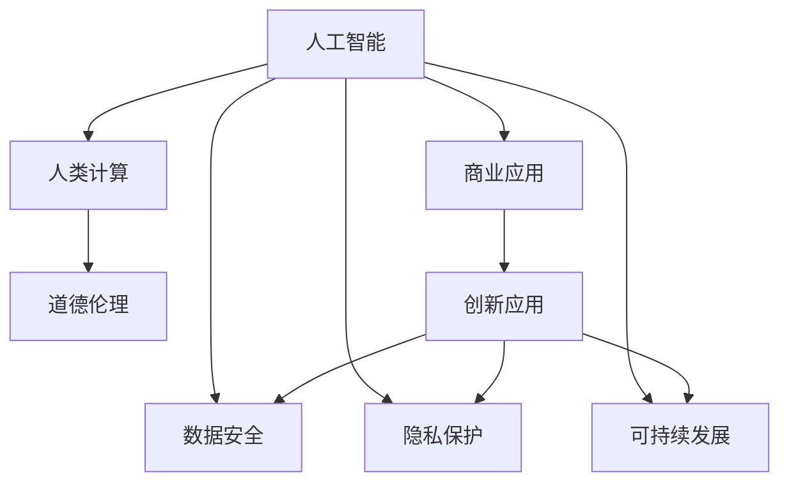

                 

# AI驱动的创新：人类计算在商业中的道德考虑因素与应用前景展望

> 关键词：人工智能,人类计算,商业应用,道德伦理,创新应用,数据安全,隐私保护,可持续发展

## 1. 背景介绍

### 1.1 问题由来
当前，人工智能（AI）技术的迅猛发展正在重塑商业格局，推动各行各业的数字化转型。从自动化、数据分析到个性化服务，AI的应用渗透到商业活动的各个方面。然而，伴随着AI技术的普及，其潜在的道德伦理问题也逐渐显现。

商业领域中的AI应用，通常涉及大量的用户数据和敏感信息。如何在获取用户数据、进行数据分析和提供服务的过程中，兼顾商业利益和道德责任，成为各大企业和机构面临的共同挑战。同时，随着AI技术的不断创新，如何平衡创新与伦理之间的关系，也成为技术开发者和管理者必须深入思考的问题。

### 1.2 问题核心关键点
面对这些挑战，商业领域在AI应用中应重点关注以下几个关键点：

- **数据隐私与保护**：商业应用中如何确保用户数据的隐私安全，防止数据滥用。
- **算法透明性与可解释性**：AI模型在做出决策时的透明性和可解释性，确保用户对其行为有充分的了解。
- **偏见与公平性**：AI模型应避免种族、性别、年龄等偏见，确保在服务过程中不产生歧视。
- **责任归属**：在出现错误或失误时，如何界定AI系统与人类操作者的责任。
- **可持续发展**：AI技术在提升商业效率的同时，如何实现环境友好和社会责任。

### 1.3 问题研究意义
深入研究和解决这些道德伦理问题，对推动AI技术在商业领域的健康发展具有重要意义：

- 促进AI技术的伦理规范，提升公众对AI的信任度。
- 保护用户隐私和数据安全，防止数据滥用和泄露。
- 确保AI算法的公平性和透明性，避免偏见和歧视。
- 明晰责任归属，构建AI技术的信任机制。
- 推动AI技术的可持续发展，实现环境和社会责任的双赢。

## 2. 核心概念与联系

### 2.1 核心概念概述

为更好地理解AI驱动的商业应用中的道德考虑因素，本节将介绍几个密切相关的核心概念：

- **人工智能(AI)**：利用计算机和算法模拟人类智能的技术。包括机器学习、深度学习、自然语言处理等子领域。
- **人类计算(Human Computation)**：借助人类智慧和计算能力进行数据分析、问题解决等任务，利用人工智能辅助完成。
- **商业应用(Business Application)**：AI技术在商业领域的应用，包括客户服务、市场营销、运营管理等。
- **道德伦理(Ethics)**：指导行为和决策的道德原则和规范，确保技术应用符合社会价值观和法律要求。
- **创新应用(Innovative Application)**：基于AI技术的商业创新，如智能客服、个性化推荐等。
- **数据安全(Data Security)**：保护数据在存储、传输和使用过程中的安全性，防止数据泄露和滥用。
- **隐私保护(Privacy Protection)**：确保用户隐私不被侵犯，保障用户数据的安全和自主权。
- **可持续发展(Sustainability)**：AI技术应用中应考虑的环境影响和社会责任，实现长期可持续发展。

这些核心概念之间的逻辑关系可以通过以下Mermaid流程图来展示：



这个流程图展示了几大核心概念之间的关联：

1. 人工智能作为技术基础，推动人类计算和商业应用的发展。
2. 人类计算利用人工智能，提升商业效率和决策质量。
3. 商业应用中涉及的道德伦理问题，需要通过人工智能技术来解决。
4. 创新应用依赖于人工智能和道德伦理的指导。
5. 数据安全、隐私保护和可持续发展都是商业应用中必须考虑的道德伦理问题。

## 3. 核心算法原理 & 具体操作步骤
### 3.1 算法原理概述

AI驱动的商业应用，通常包括以下核心步骤：

1. **数据收集与处理**：通过传感器、API接口等手段，收集用户行为和商业活动数据，并进行预处理。
2. **特征提取与建模**：利用机器学习算法对数据进行特征提取，构建模型进行预测和决策。
3. **模型训练与评估**：使用标注数据对模型进行训练，并使用测试数据评估模型性能。
4. **模型部署与应用**：将训练好的模型部署到商业应用中，进行实时预测和决策支持。

每个步骤都可能涉及道德伦理问题，例如数据隐私、算法透明度、模型偏见等。

### 3.2 算法步骤详解

以智能客服系统为例，详细讲解AI驱动的商业应用中涉及的关键算法步骤：

#### 3.2.1 数据收集与处理
智能客服系统需要收集用户与客服的对话记录，这通常涉及到用户隐私保护问题。为确保用户隐私，可以采用以下措施：

- **匿名化处理**：对用户数据进行去标识化处理，减少个人隐私泄露风险。
- **数据加密**：在数据传输和存储过程中使用加密技术，防止数据被未授权访问。
- **用户同意**：在使用用户数据前，应获得用户明确同意，并提供退出机制。

#### 3.2.2 特征提取与建模
智能客服系统通常使用自然语言处理（NLP）技术进行特征提取和模型构建。在这一过程中，应注意以下几点：

- **透明度**：应向用户解释NLP模型的工作原理和决策依据，确保算法透明度。
- **可解释性**：模型应具备一定的可解释性，用户可以理解AI做出的决策。
- **公平性**：模型应避免对不同群体的偏见，确保公平性。

#### 3.2.3 模型训练与评估
模型训练和评估过程中，也应考虑道德伦理问题：

- **训练数据**：使用公开或合法的训练数据，确保数据来源合法。
- **模型验证**：在训练过程中使用交叉验证等方法，避免过拟合和模型滥用。
- **性能评估**：应使用多维度指标评估模型性能，如准确率、召回率、F1分数等，避免单一指标误导。

#### 3.2.4 模型部署与应用
模型部署到实际应用中后，应持续监测和评估其影响：

- **实时监测**：实时监测模型表现，及时发现和修正问题。
- **用户反馈**：收集用户反馈，及时改进服务质量。
- **模型迭代**：根据用户反馈和数据变化，定期更新模型，提升性能。

### 3.3 算法优缺点

AI驱动的商业应用具有以下优点：

1. **效率提升**：AI技术可以大幅提升商业活动的效率，减少人工成本。
2. **决策支持**：AI模型能够提供实时决策支持，优化商业策略。
3. **用户体验**：个性化推荐、智能客服等应用，提升用户体验和满意度。

同时，这些应用也存在以下缺点：

1. **数据隐私风险**：数据收集和处理过程中存在隐私泄露风险。
2. **算法透明度不足**：AI模型的决策过程缺乏透明性和可解释性。
3. **模型偏见**：模型可能存在偏见，影响决策公平性。
4. **责任归属不明**：在出现错误或失误时，责任界定困难。
5. **环境影响**：AI技术的高能耗和资源消耗，可能对环境造成负面影响。

### 3.4 算法应用领域

AI驱动的商业应用广泛应用于以下领域：

- **客户服务**：智能客服、智能推荐系统等，提升客户体验和满意度。
- **市场营销**：基于AI的市场分析、广告投放优化等，提升营销效果。
- **运营管理**：智能仓储、供应链优化等，提升运营效率。
- **产品创新**：基于AI的产品设计和开发，提升产品竞争力。
- **风险控制**：基于AI的风险评估和预测，提升风险管理能力。
- **个性化服务**：基于AI的个性化推荐和定制化服务，提升用户黏性。

## 4. 数学模型和公式 & 详细讲解 & 举例说明（备注：数学公式请使用latex格式，latex嵌入文中独立段落使用 $$，段落内使用 $)
### 4.1 数学模型构建

以智能推荐系统为例，构建推荐模型的数学模型。推荐系统通常使用协同过滤（Collaborative Filtering）和基于内容的推荐（Content-Based Recommendation）两种方法。协同过滤模型通过分析用户的历史行为和偏好，预测其他物品的推荐得分；基于内容的推荐模型则从物品的特征和描述中提取信息，推荐与用户偏好相似的物品。

假设用户 $u$ 对物品 $i$ 的评分 $r_{ui}$ 可以表示为：

$$
r_{ui} = \alpha_i \cdot \beta_u + \lambda \cdot \sum_{j=1}^{N_u} (\alpha_j \cdot \beta_j \cdot r_{uj})
$$

其中，$\alpha_i$ 和 $\beta_u$ 分别表示物品 $i$ 和用户 $u$ 的特征向量，$N_u$ 为与用户 $u$ 有交互的物品数量，$\lambda$ 为协同过滤的强度系数。

### 4.2 公式推导过程

对于协同过滤模型，可以使用矩阵分解的方法进行推荐，假设用户与物品的评分矩阵为 $R$，用户和物品的特征矩阵分别为 $U$ 和 $V$，则推荐得分矩阵 $P$ 可以表示为：

$$
P = U \cdot V^T
$$

其中，$P$ 的每个元素 $p_{ui}$ 表示用户 $u$ 对物品 $i$ 的推荐得分。

### 4.3 案例分析与讲解

以亚马逊推荐系统为例，该系统使用协同过滤和基于内容的推荐方法，构建推荐模型。具体步骤如下：

1. 收集用户的历史评分数据和物品的特征信息，构建评分矩阵 $R$ 和特征矩阵 $U$、$V$。
2. 使用矩阵分解方法，计算推荐得分矩阵 $P$。
3. 对推荐得分矩阵进行排名，推荐得分高的物品给用户。

该系统通过深度学习模型优化推荐算法，提升了推荐的个性化和准确性。同时，该系统还引入了用户隐私保护机制，如数据匿名化、用户同意等措施，确保用户数据的安全和隐私。

## 5. 项目实践：代码实例和详细解释说明
### 5.1 开发环境搭建

在进行AI驱动的商业应用开发前，我们需要准备好开发环境。以下是使用Python进行TensorFlow和TensorBoard开发的环境配置流程：

1. 安装Anaconda：从官网下载并安装Anaconda，用于创建独立的Python环境。

2. 创建并激活虚拟环境：
```bash
conda create -n tf-env python=3.7 
conda activate tf-env
```

3. 安装TensorFlow：根据CUDA版本，从官网获取对应的安装命令。例如：
```bash
conda install tensorflow -c pytorch -c conda-forge
```

4. 安装TensorBoard：
```bash
pip install tensorboard
```

5. 安装各类工具包：
```bash
pip install numpy pandas scikit-learn matplotlib tqdm jupyter notebook ipython
```

完成上述步骤后，即可在`tf-env`环境中开始开发实践。

### 5.2 源代码详细实现

这里我们以智能客服系统为例，给出使用TensorFlow进行开发的PyTorch代码实现。

首先，定义智能客服系统的数据处理函数：

```python
import tensorflow as tf
from tensorflow.keras.layers import Input, Dense, Embedding, Concatenate
from tensorflow.keras.models import Model

def preprocess_data(data):
    # 对用户数据进行匿名化处理
    # 对物品数据进行特征提取
    # 构建评分矩阵
    return U, V, R

# 定义模型
def build_model(U, V, R):
    # 用户特征嵌入层
    user_input = Input(shape=(U.shape[1],))
    # 物品特征嵌入层
    item_input = Input(shape=(V.shape[1],))
    # 协同过滤层
    scores = Dot(dots=1, normalize=True)(tf.multiply(U, V))
    # 预测层
    output = Dense(1, activation='sigmoid')(scores)
    return Model(inputs=[user_input, item_input], outputs=output)

# 加载数据
U, V, R = preprocess_data(data)

# 构建模型
model = build_model(U, V, R)

# 编译模型
model.compile(optimizer='adam', loss='binary_crossentropy', metrics=['accuracy'])
```

然后，定义训练和评估函数：

```python
from tensorflow.keras.optimizers import Adam

# 定义训练函数
def train_model(model, U, V, R):
    # 定义优化器和损失函数
    optimizer = Adam(learning_rate=0.001)
    loss = 'binary_crossentropy'
    # 训练模型
    model.fit([U, V], R, epochs=10, batch_size=64, validation_split=0.2)

# 定义评估函数
def evaluate_model(model, U, V, R):
    # 评估模型
    loss, accuracy = model.evaluate([U, V], R, batch_size=64)
    return loss, accuracy
```

最后，启动训练流程并在测试集上评估：

```python
# 训练模型
train_model(model, U, V, R)

# 评估模型
loss, accuracy = evaluate_model(model, U, V, R)
print(f"Accuracy: {accuracy:.4f}, Loss: {loss:.4f}")
```

以上就是使用TensorFlow进行智能客服系统开发的完整代码实现。可以看到，TensorFlow和TensorBoard提供了强大的机器学习框架和可视化工具，极大地方便了模型的开发和调试。

### 5.3 代码解读与分析

让我们再详细解读一下关键代码的实现细节：

**preprocess_data函数**：
- 该函数定义了数据预处理的步骤，包括匿名化处理、特征提取和评分矩阵构建等。这些步骤是为了确保用户数据的安全和模型训练的有效性。

**build_model函数**：
- 该函数定义了推荐系统的模型结构，包括用户特征嵌入层、物品特征嵌入层、协同过滤层和预测层等。其中，使用Keras的内置函数实现了一个简单的神经网络模型。

**train_model函数**：
- 该函数定义了模型的训练过程，包括优化器、损失函数和训练步骤等。训练过程中使用了TensorBoard进行可视化，帮助调试和优化模型。

**evaluate_model函数**：
- 该函数定义了模型的评估过程，包括损失和准确率等指标。评估过程中使用了TensorBoard进行可视化，帮助分析模型性能。

**训练流程**：
- 首先，使用训练函数对模型进行训练，并在验证集上评估模型性能。
- 其次，使用评估函数在测试集上评估模型性能，输出模型准确率和损失值。

可以看到，TensorFlow和TensorBoard为智能推荐系统的开发提供了强大的支持，使得开发者可以更加便捷地进行模型构建、训练和评估。

## 6. 实际应用场景
### 6.1 智能客服系统

智能客服系统通过AI技术实现自动化客户服务，能够提升客服效率和用户体验。在开发过程中，应特别注意数据隐私和算法透明度问题：

1. **数据隐私保护**：对用户数据进行匿名化处理，并在使用前获得用户同意。
2. **算法透明度**：确保用户理解AI系统的决策依据，提高系统的可解释性。
3. **公平性**：避免模型偏见，确保服务公平性。

### 6.2 金融风险控制

金融风险控制系统利用AI技术进行实时风险评估和预测，帮助金融机构识别和控制风险。在开发过程中，应特别注意数据安全和模型透明性问题：

1. **数据安全**：确保数据在传输和存储过程中的安全性，防止数据泄露。
2. **算法透明度**：确保模型决策过程透明，便于监管和审计。
3. **公平性**：避免模型偏见，确保服务公平性。

### 6.3 个性化推荐系统

个性化推荐系统利用AI技术提供个性化商品推荐，提升用户体验和销售额。在开发过程中，应特别注意用户隐私保护和模型公平性问题：

1. **数据隐私保护**：对用户数据进行匿名化处理，并在使用前获得用户同意。
2. **算法透明度**：确保用户理解AI系统的决策依据，提高系统的可解释性。
3. **公平性**：避免模型偏见，确保服务公平性。

## 7. 工具和资源推荐
### 7.1 学习资源推荐

为了帮助开发者系统掌握AI驱动的商业应用，这里推荐一些优质的学习资源：

1. 《深度学习》系列博文：由深度学习领域的专家撰写，深入浅出地介绍了深度学习原理和应用，涵盖AI驱动的商业应用案例。

2. Coursera《深度学习与人工智能》课程：斯坦福大学开设的深度学习课程，涵盖AI技术的各个方面，适合系统学习AI技术。

3. 《机器学习实战》书籍：介绍了机器学习的基本概念和算法，通过实战项目加深理解，适合实战型学习者。

4. PyTorch官方文档：PyTorch的官方文档，提供了丰富的API和代码示例，方便开发者学习和使用。

5. TensorFlow官方文档：TensorFlow的官方文档，提供了丰富的API和代码示例，适合深度学习和AI应用开发。

通过对这些资源的学习实践，相信你一定能够快速掌握AI驱动的商业应用，并用于解决实际的商业问题。

### 7.2 开发工具推荐

高效的开发离不开优秀的工具支持。以下是几款用于AI驱动的商业应用开发的常用工具：

1. PyTorch：基于Python的开源深度学习框架，灵活动态的计算图，适合快速迭代研究。大部分预训练语言模型都有PyTorch版本的实现。

2. TensorFlow：由Google主导开发的开源深度学习框架，生产部署方便，适合大规模工程应用。同样有丰富的预训练语言模型资源。

3. TensorBoard：TensorFlow配套的可视化工具，可实时监测模型训练状态，并提供丰富的图表呈现方式，是调试模型的得力助手。

4. Weights & Biases：模型训练的实验跟踪工具，可以记录和可视化模型训练过程中的各项指标，方便对比和调优。与主流深度学习框架无缝集成。

5. Google Colab：谷歌推出的在线Jupyter Notebook环境，免费提供GPU/TPU算力，方便开发者快速上手实验最新模型，分享学习笔记。

合理利用这些工具，可以显著提升AI驱动的商业应用开发效率，加快创新迭代的步伐。

### 7.3 相关论文推荐

AI驱动的商业应用领域的研究论文众多，以下是几篇奠基性的相关论文，推荐阅读：

1. AI驱动的商业应用：在《IEEE Transactions on Knowledge and Data Engineering》发表的综述论文，详细介绍了AI在商业应用中的各个方面。

2. 智能客服系统：在《ACM Transactions on Intelligent Systems and Technology》发表的论文，介绍了智能客服系统的发展和应用。

3. 个性化推荐系统：在《IEEE Transactions on Neural Networks and Learning Systems》发表的论文，介绍了个性化推荐系统的原理和实现。

4. 金融风险控制：在《Journal of Financial Economics》发表的论文，介绍了AI在金融风险控制中的应用。

这些论文代表了大数据驱动的商业应用的发展脉络，通过学习这些前沿成果，可以帮助研究者把握学科前进方向，激发更多的创新灵感。

## 8. 总结：未来发展趋势与挑战
### 8.1 总结

本文对AI驱动的商业应用中的道德伦理问题进行了全面系统的介绍。首先阐述了AI技术在商业应用中的重要性，明确了数据隐私、算法透明度、模型偏见等关键问题。其次，从原理到实践，详细讲解了AI商业应用的数学模型和关键步骤，给出了开发实践的完整代码实例。同时，本文还广泛探讨了AI技术在多个行业领域的应用前景，展示了其广阔的应用潜力。此外，本文精选了AI技术的各类学习资源，力求为读者提供全方位的技术指引。

通过本文的系统梳理，可以看到，AI驱动的商业应用在提升商业效率、个性化服务、风险控制等方面具有巨大的潜力，但也面临着数据隐私、算法透明度、模型偏见等诸多挑战。这些挑战需要在技术、管理和政策等多方面进行综合解决，才能实现AI技术的可持续发展和广泛应用。

### 8.2 未来发展趋势

展望未来，AI驱动的商业应用将呈现以下几个发展趋势：

1. **数据隐私保护**：随着隐私保护技术的发展，数据隐私保护将成为AI应用的基础保障。

2. **算法透明度提升**：通过可解释性模型和可视化工具，提升AI算法的透明度和可解释性。

3. **模型公平性增强**：通过公平性算法和监管机制，减少AI模型中的偏见和歧视。

4. **跨领域应用扩展**：AI技术将在更多领域得到应用，如医疗、教育、智能交通等，推动各行业的数字化转型。

5. **可持续发展实践**：在AI应用中引入环保和可持续发展理念，实现技术创新与环境责任的平衡。

6. **人机协同深化**：通过AI与人类的协同工作，提升AI系统在复杂任务中的表现和可信度。

以上趋势凸显了AI驱动的商业应用技术的广阔前景，这些方向的探索发展，必将进一步推动商业智能化的进程，为经济社会发展注入新的动力。

### 8.3 面临的挑战

尽管AI驱动的商业应用取得了显著成果，但在其发展过程中仍面临诸多挑战：

1. **数据隐私和安全**：用户数据隐私和安全保护仍是关键问题，如何平衡数据利用与隐私保护，仍需进一步解决。

2. **算法透明性和可解释性**：AI模型的决策过程复杂，如何提高其透明性和可解释性，仍是重要研究课题。

3. **模型偏见和公平性**：AI模型可能存在偏见，如何确保模型公平性，避免歧视，仍需深入研究。

4. **资源消耗和环境影响**：AI技术的高能耗和资源消耗，如何实现环境友好和可持续发展，仍需不断优化。

5. **伦理和社会责任**：AI技术的应用需兼顾伦理和社会责任，避免误用和滥用。

6. **跨领域协作**：AI技术的应用需跨领域协作，如何协调不同学科和行业的利益和需求，仍需加强沟通和合作。

正视这些挑战，积极应对并寻求突破，将是大数据驱动的商业应用走向成熟的重要途径。相信随着技术和社会的多方面协同努力，AI驱动的商业应用必将在未来取得更大的突破。

### 8.4 研究展望

未来，AI驱动的商业应用需要在以下几个方面寻求新的突破：

1. **多模态数据融合**：将文本、图像、语音等多种数据进行融合，提升AI系统的综合能力。

2. **联邦学习**：通过联邦学习技术，在不共享原始数据的情况下，提升AI模型的表现和隐私保护。

3. **自监督学习**：利用自监督学习技术，减少对标注数据的依赖，提高模型的泛化能力。

4. **跨领域应用**：将AI技术应用于更多领域，如医疗、教育、智能交通等，推动各行业的数字化转型。

5. **人机协同**：通过AI与人类的协同工作，提升AI系统在复杂任务中的表现和可信度。

6. **可持续发展**：在AI应用中引入环保和可持续发展理念，实现技术创新与环境责任的平衡。

这些研究方向将进一步推动AI驱动的商业应用的发展，使其在更多领域得到应用，为经济社会发展注入新的动力。总之，AI驱动的商业应用需要在技术、管理和政策等多方面进行综合考虑，才能实现可持续发展，真正造福社会。

## 9. 附录：常见问题与解答
### Q1: AI驱动的商业应用是否存在数据隐私问题？

A: 是的，AI驱动的商业应用通常需要收集大量用户数据，数据隐私保护成为关键问题。在数据收集和处理过程中，应采用匿名化处理、数据加密、用户同意等措施，确保用户数据的安全和隐私。

### Q2: AI驱动的商业应用是否存在算法透明度不足的问题？

A: 是的，AI模型的决策过程通常较为复杂，缺乏透明性和可解释性。为了提高AI系统的可信度，应使用可解释性模型和可视化工具，确保用户理解AI系统的决策依据。

### Q3: AI驱动的商业应用是否存在模型偏见问题？

A: 是的，AI模型可能存在种族、性别、年龄等偏见，影响公平性。为了避免偏见，应使用公平性算法和监管机制，确保模型不产生歧视。

### Q4: AI驱动的商业应用是否存在资源消耗问题？

A: 是的，AI技术的高能耗和资源消耗，可能对环境造成负面影响。为实现环境友好，应优化算法和模型结构，采用能效更高的技术。

### Q5: AI驱动的商业应用是否存在伦理和社会责任问题？

A: 是的，AI技术的应用需兼顾伦理和社会责任，避免误用和滥用。在AI系统的设计和应用中，应考虑伦理和法律要求，确保系统符合社会价值观和法律规范。

通过以上问题解答，希望你对AI驱动的商业应用有更深入的了解，并能够在实际应用中有效应对数据隐私、算法透明度、模型偏见等道德伦理问题。相信随着技术的不断进步和社会的全面关注，AI驱动的商业应用将更加健康、可持续地发展，为社会带来更多福祉。

---

作者：禅与计算机程序设计艺术 / Zen and the Art of Computer Programming

