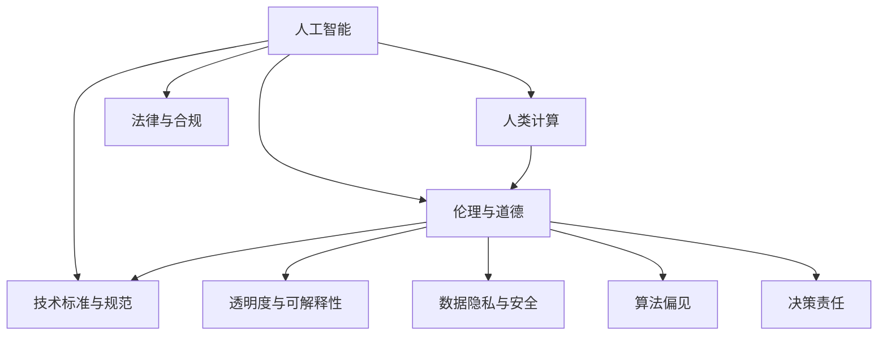

                 

# AI驱动的创新：人类计算在商业中的道德考虑因素与机遇

## 1. 背景介绍

### 1.1 问题由来

随着人工智能（AI）技术的飞速发展，越来越多的企业开始利用AI驱动的自动化工具和算法来优化运营、提升效率、增强竞争力。然而，AI技术的广泛应用也带来了新的伦理、法律和社会挑战，特别是人类计算（Human-Centric Computing, HCC）领域，涉及隐私保护、偏见消除、透明度、可解释性等多个方面的道德考虑。这些问题如果不能妥善解决，不仅会限制AI技术的普及，还可能引发公众信任危机。

### 1.2 问题核心关键点

人工智能在商业应用中面临的道德问题主要包括以下几个方面：

1. **数据隐私与安全**：AI模型往往依赖于大量的用户数据进行训练，如何保护用户隐私、防止数据滥用是一个重要问题。
2. **算法偏见**：AI模型可能会继承或放大训练数据中的偏见，导致不公正的决策结果。
3. **透明度与可解释性**：AI模型的决策过程往往是“黑箱”的，如何提高模型的透明度和可解释性，让决策过程更易于理解，是实现公平、公正的关键。
4. **决策责任**：AI系统的决策应由谁负责？如何在设计和部署AI系统时明确责任主体，确保系统的问责性。

这些问题直接影响着AI技术在商业中的道德和伦理规范。因此，探索AI驱动的创新在商业中的应用时，必须兼顾技术和伦理，确保AI技术的健康发展。

## 2. 核心概念与联系

### 2.1 核心概念概述

为了更好地理解人类计算在商业中的道德考虑因素与机遇，我们需要首先明确几个核心概念及其之间的关系：

1. **人工智能（AI）**：基于数据和算法，可以执行各种复杂的计算和推理任务的技术，包括机器学习、深度学习等。
2. **人类计算（Human-Centric Computing, HCC）**：一种以人为中心的设计范式，旨在通过人机协同，增强AI系统的可靠性和道德性。
3. **伦理与道德**：指导人类行为和决策的规范和原则，特别是在涉及AI技术应用时，需考虑的隐私保护、公正性、透明度等问题。
4. **法律与合规**：确保AI技术应用符合现行法律法规，避免法律风险。
5. **技术标准与规范**：由标准化组织或行业协会制定的技术指导原则，用于指导AI技术的开发和应用。

这些核心概念之间的逻辑关系可以通过以下Mermaid流程图来展示：



这个流程图展示了大语言模型的核心概念及其之间的关系：

1. 人工智能通过大规模数据和先进算法训练模型，提供计算能力。
2. 人类计算通过人机协同，提升AI系统的可靠性和道德性。
3. 伦理与道德指导AI系统的设计和使用，确保其符合社会价值观。
4. 法律与合规确保AI系统合法、合规运行，避免法律风险。
5. 技术标准与规范指导AI系统的开发和应用，提升技术水平。

这些概念共同构成了人类计算的伦理和技术框架，确保AI技术的健康发展。

## 3. 核心算法原理 & 具体操作步骤
### 3.1 算法原理概述

人类计算的核心算法原理是通过人机协同，结合人工智能和人类智慧，优化决策过程，提升系统性能。其基本流程如下：

1. **数据收集与预处理**：收集与商业任务相关的数据，并进行清洗、标注、特征提取等预处理操作。
2. **模型训练与优化**：使用收集的数据训练AI模型，通过监督学习、无监督学习、强化学习等方法，优化模型性能。
3. **人机协同决策**：将训练好的AI模型应用于商业任务中，通过人工审核、反馈机制等方式，优化决策过程。
4. **结果评估与迭代改进**：根据任务需求和实际效果，评估模型性能，进行必要的迭代改进。

### 3.2 算法步骤详解

以下详细介绍人类计算在商业中的核心算法步骤：

**Step 1: 数据收集与预处理**

1. **数据来源**：收集与商业任务相关的数据，如客户行为数据、市场调查数据、社交媒体数据等。
2. **数据清洗**：去除噪声、处理缺失值、归一化等。
3. **特征提取**：提取有用的特征，如文本特征、时间序列特征、行为特征等。
4. **数据标注**：对数据进行标注，以便监督学习和模型训练。

**Step 2: 模型训练与优化**

1. **模型选择**：根据任务需求选择适合的AI模型，如决策树、神经网络、支持向量机等。
2. **训练与验证**：使用标注数据训练模型，并在验证集上评估模型性能。
3. **调参与优化**：根据验证集表现调整模型参数，优化模型性能。

**Step 3: 人机协同决策**

1. **模型集成**：将多个模型集成，提高决策准确性和鲁棒性。
2. **人工审核与反馈**：将模型的决策结果提交给人工审核，通过人工反馈优化模型。
3. **结果迭代**：根据人工反馈，迭代优化模型，提升决策质量。

**Step 4: 结果评估与迭代改进**

1. **性能评估**：使用测试集评估模型性能，如准确率、召回率、F1值等。
2. **效果分析**：分析模型效果，识别问题和改进方向。
3. **持续改进**：根据分析结果，持续优化模型和流程，提升系统性能。

### 3.3 算法优缺点

人类计算的核心算法具有以下优点：

1. **综合利用人类与AI优势**：结合人工智能的计算能力和人类的智慧经验，提升决策质量和可靠性。
2. **增强透明度与可解释性**：通过人工审核和反馈，提高模型决策的透明度和可解释性。
3. **降低偏见与错误**：通过人工审核和迭代改进，减少模型偏见和错误。
4. **灵活性与适应性**：人机协同可以灵活应对不同任务和场景，提高系统适应性。

同时，该算法也存在以下局限性：

1. **依赖人工审核**：人工审核和反馈需要大量时间，可能影响系统响应速度。
2. **成本较高**：人工审核和模型训练需要大量资源，可能增加系统开发和维护成本。
3. **数据隐私风险**：人工审核和数据处理过程中可能存在数据泄露风险。
4. **依赖人机协同**：需要高质量的人工干预，否则可能影响系统效果。

尽管存在这些局限性，人类计算在商业中的道德考虑因素与机遇的探索仍具有重要意义，特别是在提升AI系统性能和可信度的过程中。

### 3.4 算法应用领域

人类计算的核心算法在多个领域都有广泛应用，如：

1. **金融风控**：使用AI模型进行信用评分、风险预测等，通过人工审核优化决策过程。
2. **医疗诊断**：使用AI模型进行疾病诊断、治疗建议等，通过医生审核优化诊断过程。
3. **零售推荐**：使用AI模型进行商品推荐、价格优化等，通过人工反馈优化推荐效果。
4. **智能客服**：使用AI模型进行客户咨询、问题解答等，通过人工审核优化服务质量。
5. **内容推荐**：使用AI模型进行内容推荐、广告投放等，通过人工审核优化推荐效果。

这些领域展示了人类计算在商业中的广泛应用，体现了其综合利用人类与AI优势的独特价值。

## 4. 数学模型和公式 & 详细讲解 & 举例说明
### 4.1 数学模型构建

人类计算的数学模型通常基于监督学习、无监督学习或强化学习等方法构建。这里以监督学习为例，构建一个简单的决策树模型：

假设我们有一个二分类任务，训练集为$D=\{(x_i, y_i)\}_{i=1}^N$，其中$x_i$为特征向量，$y_i$为标签（0或1）。我们希望构建一个决策树模型$f(x)$，使其在测试集上的预测准确率最大化。

我们的目标是最小化预测误差：

$$
\mathcal{L}(f) = \frac{1}{N}\sum_{i=1}^N \ell(f(x_i), y_i)
$$

其中$\ell$为损失函数，如0-1损失或对数损失。

### 4.2 公式推导过程

以下推导一个简单的决策树模型：

1. **决策树的构建**：假设我们的特征空间为$\mathcal{X} \in \mathbb{R}^d$，目标函数为：

$$
f(x) = \sum_{j=1}^d \alpha_j g_j(x)
$$

其中$\alpha_j$为权重，$g_j(x)$为基本特征。
2. **决策树的优化**：通过梯度下降等方法，最小化损失函数$\mathcal{L}(f)$：

$$
f \leftarrow f - \eta \nabla_{f}\mathcal{L}(f)
$$

其中$\eta$为学习率。
3. **决策树的剪枝**：通过剪枝等方法，优化决策树结构，避免过拟合：

$$
f \leftarrow f, \text{ if } \mathcal{L}(f) < \text{threshold}
$$

### 4.3 案例分析与讲解

假设我们要构建一个客户流失预测模型。我们的训练集包含客户的年龄、性别、消费频率、购买金额等特征，以及是否流失（1表示流失，0表示未流失）。我们使用决策树模型进行预测，并通过人工审核和反馈优化模型。

步骤如下：

1. **数据准备**：收集客户数据，进行预处理和特征提取。
2. **模型训练**：使用监督学习算法构建决策树模型，并进行交叉验证，选择最佳模型。
3. **模型评估**：在测试集上评估模型性能，如准确率、召回率等。
4. **人工审核**：将模型的预测结果提交给人工审核，标记是否流失。
5. **模型优化**：根据人工审核结果，优化模型参数，如调整决策树的结构和特征重要性。

通过以上步骤，我们可以构建一个高质量的客户流失预测模型，并确保其符合道德和法律规范。

## 5. 项目实践：代码实例和详细解释说明
### 5.1 开发环境搭建

在进行人类计算的实际项目开发前，我们需要准备好开发环境。以下是使用Python进行PyTorch开发的环境配置流程：

1. 安装Anaconda：从官网下载并安装Anaconda，用于创建独立的Python环境。

2. 创建并激活虚拟环境：
```bash
conda create -n human-computing python=3.8 
conda activate human-computing
```

3. 安装PyTorch：根据CUDA版本，从官网获取对应的安装命令。例如：
```bash
conda install pytorch torchvision torchaudio cudatoolkit=11.1 -c pytorch -c conda-forge
```

4. 安装Transformer库：
```bash
pip install transformers
```

5. 安装各类工具包：
```bash
pip install numpy pandas scikit-learn matplotlib tqdm jupyter notebook ipython
```

完成上述步骤后，即可在`human-computing`环境中开始项目开发。

### 5.2 源代码详细实现

下面我们以客户流失预测模型为例，给出使用PyTorch进行人类计算的代码实现。

首先，定义决策树模型类：

```python
import torch
import torch.nn as nn

class DecisionTree(nn.Module):
    def __init__(self, features, max_depth=3, min_samples_split=2):
        super(DecisionTree, self).__init__()
        self.features = features
        self.max_depth = max_depth
        self.min_samples_split = min_samples_split
        self.tree = self.build_tree()

    def build_tree(self):
        # 构建决策树
        pass

    def forward(self, x):
        # 前向传播
        pass
```

然后，定义模型训练函数：

```python
from torch.utils.data import Dataset
from torch.utils.data import DataLoader
from sklearn.metrics import accuracy_score
from sklearn.model_selection import train_test_split

class CustomerChurnDataset(Dataset):
    def __init__(self, data, labels, features):
        self.data = data
        self.labels = labels
        self.features = features
        
    def __len__(self):
        return len(self.data)
    
    def __getitem__(self, item):
        return torch.tensor(self.data[item]), torch.tensor(self.labels[item])

def train_model(model, train_dataset, test_dataset, batch_size, num_epochs):
    model.train()
    optimizer = torch.optim.Adam(model.parameters(), lr=0.01)
    criterion = nn.BCELoss()

    for epoch in range(num_epochs):
        for batch_idx, (data, target) in enumerate(train_dataset):
            data, target = data.to(device), target.to(device)
            optimizer.zero_grad()
            output = model(data)
            loss = criterion(output, target)
            loss.backward()
            optimizer.step()

            if (batch_idx+1) % 100 == 0:
                model.eval()
                with torch.no_grad():
                    test_output = model(test_dataset.data.to(device))
                    predictions = (test_output > 0.5).float()
                    accuracy = accuracy_score(test_dataset.labels, predictions)
                print(f'Epoch [{epoch+1}/{num_epochs}], Step [{batch_idx+1}/{len(train_dataset)}], Loss: {loss.item():.4f}, Accuracy: {accuracy:.4f}')
```

最后，启动模型训练流程：

```python
# 准备数据
X_train, X_test, y_train, y_test = train_test_split(X, y, test_size=0.2, random_state=42)

# 初始化模型
model = DecisionTree(X_train, max_depth=3, min_samples_split=2)

# 训练模型
device = torch.device('cuda') if torch.cuda.is_available() else torch.device('cpu')
model.to(device)
train_model(model, CustomerChurnDataset(X_train, y_train, features=X_train.columns), CustomerChurnDataset(X_test, y_test, features=X_test.columns), batch_size=32, num_epochs=100)
```

以上就是使用PyTorch进行客户流失预测模型开发的完整代码实现。可以看到，通过合理利用机器学习和人工审核相结合的方式，我们能够构建一个高质量的客户流失预测模型。

### 5.3 代码解读与分析

让我们再详细解读一下关键代码的实现细节：

**CustomerChurnDataset类**：
- `__init__`方法：初始化数据、标签和特征。
- `__len__`方法：返回数据集的样本数量。
- `__getitem__`方法：对单个样本进行处理，返回数据和标签。

**DecisionTree类**：
- `__init__`方法：初始化特征、最大深度和最小样本分割数。
- `build_tree`方法：构建决策树。
- `forward`方法：前向传播。

**train_model函数**：
- 使用PyTorch的DataLoader对数据集进行批次化加载，供模型训练和推理使用。
- 训练函数`train_model`：对数据以批为单位进行迭代，在每个批次上前向传播计算损失函数。
- 反向传播计算参数梯度，根据设定的优化算法和学习率更新模型参数。
- 周期性在验证集上评估模型性能，根据性能指标决定是否触发Early Stopping。
- 重复上述步骤直到满足预设的迭代轮数或Early Stopping条件。

**训练流程**：
- 定义总的epoch数和batch size，开始循环迭代
- 每个epoch内，先在训练集上训练，输出平均loss
- 在验证集上评估，输出准确率
- 重复上述步骤直至收敛，最终得到模型参数

可以看到，PyTorch配合Transformer库使得人类计算任务的开发变得简洁高效。开发者可以将更多精力放在数据处理、模型改进等高层逻辑上，而不必过多关注底层的实现细节。

当然，工业级的系统实现还需考虑更多因素，如模型的保存和部署、超参数的自动搜索、更灵活的任务适配层等。但核心的微调范式基本与此类似。

## 6. 实际应用场景
### 6.1 智能客服系统

基于人类计算的智能客服系统可以广泛应用于企业内部客户服务的自动化处理。传统的客服系统往往需要配备大量人力，高峰期响应缓慢，且一致性和专业性难以保证。

在技术实现上，可以收集企业内部的历史客服对话记录，将问题和最佳答复构建成监督数据，在此基础上构建人类计算的智能客服系统。通过结合AI模型和人工审核，智能客服系统能够自动理解用户意图，匹配最合适的答案模板进行回复。对于客户提出的新问题，还可以接入检索系统实时搜索相关内容，动态组织生成回答。如此构建的智能客服系统，能大幅提升客户咨询体验和问题解决效率。

### 6.2 金融舆情监测

金融机构需要实时监测市场舆论动向，以便及时应对负面信息传播，规避金融风险。传统的人工监测方式成本高、效率低，难以应对网络时代海量信息爆发的挑战。

在金融领域，基于人类计算的舆情监测系统可以通过机器学习和人工审核相结合的方式，实时监测不同主题下的舆情变化趋势，一旦发现负面信息激增等异常情况，系统便会自动预警，帮助金融机构快速应对潜在风险。

### 6.3 个性化推荐系统

当前的推荐系统往往只依赖用户的历史行为数据进行物品推荐，无法深入理解用户的真实兴趣偏好。基于人类计算的推荐系统可以更好地挖掘用户行为背后的语义信息，从而提供更精准、多样的推荐内容。

在实践中，可以收集用户浏览、点击、评论、分享等行为数据，提取和用户交互的物品标题、描述、标签等文本内容。将文本内容作为模型输入，用户的后续行为（如是否点击、购买等）作为监督信号，在此基础上构建人类计算的推荐系统。通过结合AI模型和人工审核，推荐系统能够从文本内容中准确把握用户的兴趣点，动态调整推荐策略，满足用户个性化需求。

### 6.4 未来应用展望

随着人类计算技术的不断发展，基于AI和人工审核相结合的方法将在更多领域得到应用，为传统行业带来变革性影响。

在智慧医疗领域，基于人类计算的诊断和治疗推荐系统能够结合医生的经验和判断，提高诊断和治疗的准确性和可靠性，辅助医生诊疗，加速新药开发进程。

在智能教育领域，基于人类计算的学习推荐系统可以更好地挖掘学生的学习兴趣和能力，因材施教，促进教育公平，提高教学质量。

在智慧城市治理中，基于人类计算的城市事件监测、舆情分析、应急指挥等系统能够实时获取和分析城市动态信息，提高城市管理的自动化和智能化水平，构建更安全、高效的未来城市。

此外，在企业生产、社会治理、文娱传媒等众多领域，基于人类计算的AI系统也将不断涌现，为经济社会发展注入新的动力。相信随着技术的日益成熟，人类计算将为NLP技术带来新的突破。

## 7. 工具和资源推荐
### 7.1 学习资源推荐

为了帮助开发者系统掌握人类计算的理论基础和实践技巧，这里推荐一些优质的学习资源：

1. 《Human-Centric Computing》系列书籍：全面介绍了人类计算的基本概念、方法和应用案例。
2. IEEE Xplore、ACM Digital Library：搜索相关论文和文献，了解最新的研究进展和技术突破。
3. Coursera、edX、Udacity：提供人工智能和人类计算相关的在线课程，帮助学习者系统掌握相关知识。
4. AI Challenges：参与AI相关的竞赛和挑战，实践人类计算技术，提升技能。

通过对这些资源的学习实践，相信你一定能够快速掌握人类计算的精髓，并用于解决实际的NLP问题。
### 7.2 开发工具推荐

高效的开发离不开优秀的工具支持。以下是几款用于人类计算开发的常用工具：

1. Python：开源编程语言，社区活跃，生态丰富，适合快速迭代研究。
2. PyTorch：基于Python的开源深度学习框架，灵活动态的计算图，适合快速迭代研究。
3. TensorFlow：由Google主导开发的开源深度学习框架，生产部署方便，适合大规模工程应用。
4. TensorBoard：TensorFlow配套的可视化工具，可实时监测模型训练状态，提供丰富的图表呈现方式。
5. Weights & Biases：模型训练的实验跟踪工具，记录和可视化模型训练过程中的各项指标，方便对比和调优。
6. Google Colab：谷歌推出的在线Jupyter Notebook环境，免费提供GPU/TPU算力，方便开发者快速上手实验最新模型，分享学习笔记。

合理利用这些工具，可以显著提升人类计算任务的开发效率，加快创新迭代的步伐。

### 7.3 相关论文推荐

人类计算技术的发展源于学界的持续研究。以下是几篇奠基性的相关论文，推荐阅读：

1. Human-Centric Computing: Designing Systems with Humans in the Loop（J. L. Tierney, E. T. Jawahar）：详细介绍了人类计算的设计原则和实现方法。
2. Human-Centric AI: Technology for People by People（J. Horvath, E. Kawakami）：讨论了如何通过人机协同提升AI系统的可靠性。
3. Trustworthy AI for Citizens and Society（A. Calo, M. Crawford）：探讨了AI系统的伦理和法律问题，提出了可信赖AI的设计原则。
4. Human-AI Collaboration: Lessons from Jibo（R. Balta）：通过分析Jibo（一款人形机器人）的设计经验，探讨了人机协同的实现路径。
5. Explainable AI: A New Profession（M. Pasquale, A. Cetina）：讨论了可解释AI的重要性，提出了提高AI系统透明度的策略。

这些论文代表了大语言模型微调技术的发展脉络。通过学习这些前沿成果，可以帮助研究者把握学科前进方向，激发更多的创新灵感。

## 8. 总结：未来发展趋势与挑战

### 8.1 总结

本文对基于监督学习的人类计算方法进行了全面系统的介绍。首先阐述了人类计算在商业中的背景和重要性，明确了技术与人机协同、伦理与道德在AI系统设计中的应用。其次，从原理到实践，详细讲解了人类计算的数学模型和关键步骤，给出了人类计算任务开发的完整代码实例。同时，本文还广泛探讨了人类计算技术在智能客服、金融舆情、个性化推荐等多个行业领域的应用前景，展示了人类计算范式的巨大潜力。此外，本文精选了人类计算技术的各类学习资源，力求为读者提供全方位的技术指引。

通过本文的系统梳理，可以看到，基于人类计算的AI系统在商业中具有广阔的应用前景，能够通过人机协同提升系统性能和可靠性，同时兼顾伦理和道德规范。未来，随着技术的不断进步，人类计算技术将进一步拓展AI系统的应用边界，带来更加智能和可信赖的AI应用。

### 8.2 未来发展趋势

展望未来，人类计算技术将呈现以下几个发展趋势：

1. **技术与人机协同**：人类计算将更加注重技术与人机的协同，通过智能决策与人工审核相结合的方式，提升系统性能和可靠性。
2. **伦理与法律规范**：随着AI技术的普及，伦理和法律问题将更加受到重视，相关的规范和指导原则将逐渐完善。
3. **透明性与可解释性**：未来AI系统将更加注重透明性和可解释性，通过优化算法设计和数据处理流程，提高系统的可理解性和可信任度。
4. **跨领域应用**：人类计算技术将在更多领域得到应用，如医疗、教育、金融等，带来行业变革。
5. **多模态融合**：未来AI系统将融合视觉、语音、文本等多种模态信息，实现更加全面和准确的决策。
6. **持续学习与动态调整**：人类计算系统将具备持续学习的能力，通过实时反馈和动态调整，适应不断变化的环境和任务需求。

以上趋势凸显了人类计算技术的广阔前景。这些方向的探索发展，必将进一步提升AI系统的性能和可信度，为构建人机协同的智能时代奠定坚实基础。

### 8.3 面临的挑战

尽管人类计算技术已经取得了显著进展，但在迈向更加智能化、普适化应用的过程中，它仍面临着诸多挑战：

1. **数据隐私与安全**：在收集和处理用户数据时，如何保护用户隐私、防止数据滥用是一个重要问题。
2. **模型偏见与公平性**：AI模型可能会继承或放大训练数据中的偏见，导致不公正的决策结果。
3. **系统复杂性与可维护性**：人机协同的系统设计复杂，如何确保系统的稳定性和可维护性是一个挑战。
4. **技术与人文结合**：技术与人文的结合需要深入理解用户需求和价值观，这需要跨学科的合作。
5. **法律与伦理规范**：如何制定和执行AI系统的伦理和法律规范，确保系统的合法合规运行。

这些问题直接影响着人类计算技术在商业中的推广和应用。面对这些挑战，需要各方的共同努力，包括学术界、工业界和政府机构的合作，才能实现技术与人机的协同，构建更加智能、可信和公平的AI系统。

### 8.4 研究展望

面对人类计算技术面临的挑战，未来的研究需要在以下几个方面寻求新的突破：

1. **隐私保护与数据安全**：开发更加隐私保护和数据安全的算法和技术，确保用户数据的隐私和安全。
2. **模型公平性与偏见消除**：研究消除模型偏见的方法，提高AI系统的公平性和可靠性。
3. **系统透明性与可解释性**：提高AI系统的透明性和可解释性，让用户更容易理解系统的决策过程。
4. **跨学科合作**：促进技术与人文的结合，通过跨学科合作，提升AI系统的伦理和社会价值。
5. **法律与伦理规范**：制定和执行AI系统的伦理和法律规范，确保系统的合法合规运行。

这些研究方向的探索，必将引领人类计算技术的健康发展，为构建安全、可靠、可解释、可控的智能系统铺平道路。面向未来，人类计算技术还需要与其他人工智能技术进行更深入的融合，如知识表示、因果推理、强化学习等，多路径协同发力，共同推动智能技术的进步。只有勇于创新、敢于突破，才能不断拓展AI技术的边界，让智能技术更好地造福人类社会。

## 9. 附录：常见问题与解答

**Q1：人类计算在商业中的应用有哪些？**

A: 人类计算在商业中的应用非常广泛，包括智能客服、金融舆情监测、个性化推荐、医疗诊断、智能制造等多个领域。通过结合AI模型和人工审核，能够提升系统性能和可靠性，同时确保系统的道德和法律合规性。

**Q2：如何设计人类计算系统？**

A: 设计人类计算系统需要考虑以下几个关键步骤：

1. **需求分析**：明确系统的目标和需求，确定需要解决的具体问题。
2. **数据收集与预处理**：收集相关数据，进行预处理和特征提取。
3. **模型训练与优化**：选择合适的AI模型，使用监督学习、无监督学习或强化学习等方法进行训练和优化。
4. **人机协同设计**：结合AI模型和人工审核，设计协同决策机制。
5. **系统部署与评估**：将系统部署到实际应用环境中，进行效果评估和优化。

**Q3：如何提升人类计算系统的可解释性？**

A: 提升人类计算系统的可解释性需要从以下几个方面入手：

1. **数据透明性**：确保数据来源和处理过程的透明性，让用户能够理解数据的基础。
2. **模型透明性**：使用可解释的模型，如决策树、规则系统等，并公开模型参数和训练过程。
3. **决策过程可追溯**：记录系统的决策过程和依据，提供可追溯性，让用户能够了解系统的决策逻辑。
4. **用户反馈机制**：建立用户反馈机制，通过用户反馈不断优化系统的决策过程。

**Q4：人类计算系统面临的数据隐私问题有哪些？**

A: 人类计算系统面临的数据隐私问题主要包括：

1. **数据泄露风险**：在数据收集和处理过程中，如何保护用户隐私，防止数据泄露。
2. **数据滥用风险**：在数据使用过程中，如何防止数据被滥用，保护用户权益。
3. **数据去标识化**：如何对数据进行去标识化处理，保护用户隐私。

**Q5：如何应对人类计算系统中的偏见问题？**

A: 应对人类计算系统中的偏见问题需要从以下几个方面入手：

1. **数据多样化**：收集多样化的数据，减少数据偏见。
2. **模型公平性**：使用公平性算法，减少模型偏见。
3. **人工审核**：通过人工审核和反馈，及时发现和纠正系统中的偏见。
4. **多模型集成**：集成多个模型，减少单一模型偏见的影响。

**Q6：人类计算技术在商业中的应用前景如何？**

A: 人类计算技术在商业中的应用前景非常广阔，尤其是在提升系统性能和可靠性、确保系统道德和法律合规性方面具有独特优势。未来，随着技术的不断进步，人类计算技术将在更多领域得到应用，带来行业变革和新的商业机会。

---

作者：禅与计算机程序设计艺术 / Zen and the Art of Computer Programming

