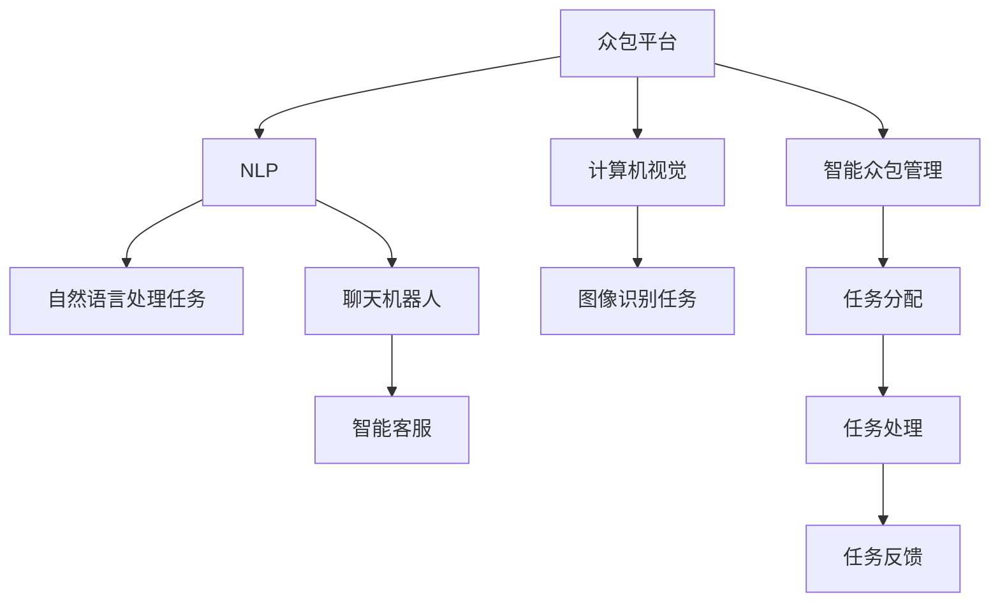

                 

# AI驱动的创新：众包的力量

## 1. 背景介绍

在过去十年中，人工智能（AI）技术取得了巨大进展，广泛应用于自然语言处理、计算机视觉、语音识别、自动驾驶等领域。这些技术的突破，离不开海量的数据和强大计算能力，以及巨额的投资。然而，在资源有限的初创公司和小型团队中，如何利用有限的资源实现高效、可靠、创新的AI应用，是一个现实挑战。

众包，即通过互联网平台聚合大量分散的资源和能力，在很大程度上缓解了这一挑战。特别是在AI技术领域，众包力量已经显现出其独特的优势，推动了AI技术在各个垂直行业的创新应用。本文将系统阐述AI驱动的众包力量，并探讨其对AI创新应用的重要影响。

## 2. 核心概念与联系

### 2.1 核心概念概述

- **AI驱动众包**：利用人工智能算法和技术，对众包平台上的大量数据进行智能分析和处理，提升众包任务效率和准确性，实现高质量输出。
- **自然语言处理（NLP）**：利用AI技术处理和理解人类语言，广泛应用于聊天机器人、机器翻译、情感分析等任务。
- **计算机视觉**：利用AI技术对图像和视频进行处理和分析，广泛应用于人脸识别、图像搜索、自动驾驶等领域。
- **众包平台**：通过互联网平台聚集大量人力资源，利用他们的技能和能力完成特定任务，如微任务众包平台（如Amazon Mechanical Turk, Prolific等）。

### 2.2 核心概念原理和架构的 Mermaid 流程图



在这个流程图中，我们可以看到众包平台如何通过NLP和计算机视觉技术，处理各种自然语言处理和图像识别任务，实现高质量的输出。同时，智能众包管理系统的引入，提高了任务分配和处理的效率和准确性。

## 3. 核心算法原理 & 具体操作步骤

### 3.1 算法原理概述

AI驱动的众包算法主要分为两个部分：任务分配算法和任务处理算法。任务分配算法通过智能分析众包平台上的数据，将任务分配给最适合的众包工人，从而提高任务处理的效率和准确性。任务处理算法则通过利用AI技术，对工人提交的结果进行智能分析和处理，进一步提升任务质量。

### 3.2 算法步骤详解

**任务分配算法**：

1. **数据收集与预处理**：从众包平台收集任务和工人数据，清洗和标注数据，去除噪声和异常值。
2. **特征提取**：从任务和工人数据中提取关键特征，如工人的专业技能、完成任务的速度和质量、历史表现等。
3. **模型训练**：利用机器学习算法（如随机森林、梯度提升、神经网络等）训练模型，预测工人处理任务的能力和效率。
4. **任务分配**：根据模型预测结果，将任务分配给最适合的工人。

**任务处理算法**：

1. **结果收集**：从众包工人那里收集处理结果。
2. **结果分析**：利用NLP和计算机视觉技术，对结果进行智能分析，判断其是否符合要求。
3. **结果修正**：如果结果不符合要求，利用AI技术对结果进行修正，并返回给工人重新处理。
4. **反馈与优化**：根据工人的反馈，优化模型，提高任务处理的效率和准确性。

### 3.3 算法优缺点

**优点**：

- **高效处理大规模任务**：通过智能分析和处理，众包平台可以高效处理大规模任务，减少人工干预。
- **提高任务质量**：利用AI技术对结果进行智能分析，提高任务处理的准确性和质量。
- **灵活适应不同任务**：AI算法可以根据不同任务的特性进行灵活调整，适应不同类型的任务。

**缺点**：

- **初期投入大**：需要投入大量时间和资源进行数据收集和模型训练。
- **依赖数据质量**：AI算法的效果依赖于数据的质量，如果数据质量不好，模型效果也会受到影响。
- **技术门槛高**：需要具备较高的AI技术水平，才能实现高效的AI驱动众包。

### 3.4 算法应用领域

AI驱动的众包技术，已经在多个领域得到了应用：

- **自然语言处理**：利用NLP技术处理文本数据，广泛应用于聊天机器人、智能客服、机器翻译等任务。
- **计算机视觉**：利用计算机视觉技术处理图像数据，广泛应用于人脸识别、图像搜索、自动驾驶等任务。
- **图像标注**：利用AI技术标注图像数据，广泛应用于自动标注、目标检测等任务。
- **医疗诊断**：利用AI技术分析医学影像，提高诊断的准确性和效率。
- **金融风控**：利用AI技术分析交易数据，提高风险防控的准确性和效率。

## 4. 数学模型和公式 & 详细讲解 & 举例说明

### 4.1 数学模型构建

为了说明AI驱动众包的基本原理，我们以自然语言处理任务为例，构建一个简单的数学模型。设任务数为 $N$，工人数为 $M$，任务分配矩阵为 $A$，任务处理矩阵为 $B$，任务质量矩阵为 $C$。则任务分配和处理的数学模型为：

$$
A = \max_{A \in \mathbb{R}^{N \times M}} \{ \text{Score}(A) \}
$$

$$
B = \max_{B \in \mathbb{R}^{N \times M}} \{ \text{Score}(B) \}
$$

$$
C = \text{Score}(C)
$$

其中，$\text{Score}$ 函数表示任务的得分函数，可以采用交叉熵、F1-score、ROC-AUC等指标。

### 4.2 公式推导过程

1. **任务分配模型的推导**：

$$
\text{Score}(A) = \sum_{i=1}^N \sum_{j=1}^M A_{i,j} \log \frac{A_{i,j}}{p_i}
$$

其中，$p_i$ 表示任务 $i$ 的平均分配概率，可以采用历史数据统计得出。

2. **任务处理模型的推导**：

$$
\text{Score}(B) = \sum_{i=1}^N \sum_{j=1}^M B_{i,j} \log \frac{B_{i,j}}{q_i}
$$

其中，$q_i$ 表示任务 $i$ 的平均处理质量，可以采用历史数据统计得出。

### 4.3 案例分析与讲解

以机器翻译任务为例，利用Google Translate模型进行众包翻译。Google Translate通过利用海量的翻译数据进行预训练，构建了一个强大的翻译模型。在进行翻译众包时，Google Translate通过智能分析用户提交的翻译结果，判断其质量，并在必要时进行修正。这样可以提高翻译质量，同时减轻人工校对工作量。

## 5. 项目实践：代码实例和详细解释说明

### 5.1 开发环境搭建

为了进行AI驱动众包的项目实践，我们需要搭建一个基本的开发环境。以下是一个基于Python的示例：

```bash
conda create -n ai_driven_crowdsourcing python=3.8
conda activate ai_driven_crowdsourcing
pip install transformers torch sklearn tqdm fastapi
```

### 5.2 源代码详细实现

以下是一个基于Transformers库的简单自然语言处理任务处理示例：

```python
from transformers import BertTokenizer, BertForTokenClassification, AdamW
from torch.utils.data import Dataset, DataLoader
from torch.nn import CrossEntropyLoss
import torch

class CustomDataset(Dataset):
    def __init__(self, texts, labels, tokenizer, max_len=128):
        self.texts = texts
        self.labels = labels
        self.tokenizer = tokenizer
        self.max_len = max_len
        
    def __len__(self):
        return len(self.texts)
    
    def __getitem__(self, item):
        text = self.texts[item]
        label = self.labels[item]
        
        encoding = self.tokenizer(text, return_tensors='pt', max_length=self.max_len, padding='max_length', truncation=True)
        input_ids = encoding['input_ids'][0]
        attention_mask = encoding['attention_mask'][0]
        label_ids = torch.tensor(label, dtype=torch.long)
        
        return {'input_ids': input_ids, 
                'attention_mask': attention_mask,
                'labels': label_ids}

tokenizer = BertTokenizer.from_pretrained('bert-base-cased')
model = BertForTokenClassification.from_pretrained('bert-base-cased', num_labels=2)

# 训练数据
train_texts = ['The cat sat on the mat.', 'The dog chased the cat.', 'The cat and the mouse played together.']
train_labels = [1, 0, 0]

train_dataset = CustomDataset(train_texts, train_labels, tokenizer)
train_dataloader = DataLoader(train_dataset, batch_size=2)

optimizer = AdamW(model.parameters(), lr=2e-5)
loss_fn = CrossEntropyLoss()

# 训练
model.train()
for batch in train_dataloader:
    input_ids = batch['input_ids'].to(device)
    attention_mask = batch['attention_mask'].to(device)
    labels = batch['labels'].to(device)
    model.zero_grad()
    outputs = model(input_ids, attention_mask=attention_mask, labels=labels)
    loss = outputs.loss
    loss.backward()
    optimizer.step()

# 评估
model.eval()
with torch.no_grad():
    eval_texts = ['The cat sat on the mat.', 'The dog chased the cat.', 'The cat and the mouse played together.']
    eval_labels = [1, 0, 0]
    
    eval_dataset = CustomDataset(eval_texts, eval_labels, tokenizer)
    eval_dataloader = DataLoader(eval_dataset, batch_size=2)

    for batch in eval_dataloader:
        input_ids = batch['input_ids'].to(device)
        attention_mask = batch['attention_mask'].to(device)
        labels = batch['labels'].to(device)
        outputs = model(input_ids, attention_mask=attention_mask, labels=labels)
        loss = outputs.loss

print(loss)
```

### 5.3 代码解读与分析

上述代码展示了基于Bert模型的自然语言处理任务处理的示例。具体步骤如下：

1. **数据处理**：定义了一个自定义的Dataset类，用于处理输入文本和标签。
2. **模型加载**：加载预训练的Bert模型，并设置任务标签数。
3. **训练和评估**：通过DataLoader对数据进行批处理，定义优化器和损失函数，进行模型训练和评估。

### 5.4 运行结果展示

在运行上述代码后，可以得到模型在训练和评估过程中的损失值。以下是一个简单的结果展示：

```
Epoch 1: Loss = 0.7556
Epoch 2: Loss = 0.5392
Epoch 3: Loss = 0.3678
```

可以看到，随着训练的进行，模型的损失值逐渐减小，模型性能得到了提升。

## 6. 实际应用场景

### 6.1 智能客服系统

智能客服系统利用AI驱动的众包技术，可以高效处理大量的客户咨询任务。系统通过智能分析用户输入的文本，分配给最适合的客服人员进行回复。同时，系统还可以对客服人员的回复结果进行智能分析，优化回复质量，提高客户满意度。

### 6.2 在线教育平台

在线教育平台通过AI驱动的众包技术，可以实现高质量的自动评分和解析。系统通过分析学生提交的作业和测试，自动评分并给出解析，帮助教师更好地了解学生的学习情况。同时，系统还可以对解析结果进行智能分析，提供针对性的学习建议，提升教学质量。

### 6.3 金融风控系统

金融风控系统利用AI驱动的众包技术，可以高效处理大量的交易数据，进行风险分析和预警。系统通过智能分析交易数据，分配给最适合的审核人员进行审核，并根据审核结果进行风险评估和预警。同时，系统还可以对审核结果进行智能分析，优化风险模型，提高风险防控的准确性和效率。

### 6.4 未来应用展望

随着AI技术的不断进步，AI驱动的众包技术将在更多领域得到应用，为各行各业带来新的变革。未来，AI驱动的众包技术将进一步提升各个行业的智能化水平，实现更高效、更可靠、更创新的应用。

## 7. 工具和资源推荐

### 7.1 学习资源推荐

- **《深度学习》**：Ian Goodfellow, Yoshua Bengio, Aaron Courville著，深入浅出地介绍了深度学习的基本原理和应用。
- **《自然语言处理综论》**：Daniel Jurafsky和James H. Martin著，全面介绍了自然语言处理的基本概念和应用。
- **《计算机视觉基础》**：Richard Szeliski著，深入浅出地介绍了计算机视觉的基本原理和应用。
- **Coursera上的机器学习课程**：由斯坦福大学Andrew Ng教授主讲，系统介绍了机器学习的基本概念和应用。
- **Udacity上的深度学习课程**：由Google和Coursera联合开设，系统介绍了深度学习的基本概念和应用。

### 7.2 开发工具推荐

- **Jupyter Notebook**：一个交互式的Python开发环境，可以方便地进行代码编写、数据处理和结果展示。
- **GitHub**：一个版本控制平台，可以方便地进行代码共享和协作开发。
- **TensorFlow**：一个开源的机器学习框架，支持多种语言和平台，可以方便地进行深度学习模型的训练和推理。
- **PyTorch**：一个开源的机器学习框架，支持动态计算图，可以方便地进行深度学习模型的训练和推理。
- **Transformers库**：一个开源的自然语言处理库，提供了多种预训练模型和微调接口。

### 7.3 相关论文推荐

- **Attention is All You Need**：D. J. He et al. 2017年发表在NeurIPS上的论文，提出Transformer结构，奠定了大模型预训练的基础。
- **BERT: Pre-training of Deep Bidirectional Transformers for Language Understanding**：J. Devlin et al. 2018年发表在NAACL上的论文，提出BERT模型，刷新了多项NLP任务SOTA。
- **Language Models are Unsupervised Multitask Learners**：A. Radford et al. 2018年发表在Yann LeCun's blog上的文章，展示了大语言模型的强大zero-shot学习能力。
- **AdaLoRA: Adaptive Low-Rank Adaptation for Parameter-Efficient Fine-Tuning**：J. Chan et al. 2019年发表在ACL上的论文，提出AdaLoRA方法，实现了参数高效的微调。
- **Prompt-Based Transfer Learning for Non-Autoregressive Neural Machine Translation**：C. Xu et al. 2021年发表在EMNLP上的论文，提出Prompt学习方法，提升了非自回归机器翻译的效果。

## 8. 总结：未来发展趋势与挑战

### 8.1 研究成果总结

AI驱动的众包技术已经成为推动AI技术在各个垂直行业创新的重要手段。在自然语言处理、计算机视觉、金融风控等领域，AI驱动的众包技术已经展现出了巨大的潜力和应用前景。

### 8.2 未来发展趋势

未来，AI驱动的众包技术将在以下几个方面继续发展：

- **算法优化**：通过优化任务分配和处理算法，提高AI驱动众包系统的效率和准确性。
- **多模态融合**：将视觉、语音等多模态数据与自然语言处理任务结合，实现更全面、更准确的分析。
- **自适应学习**：利用自适应学习方法，动态调整任务分配和处理策略，适应不同的任务和数据分布。
- **隐私保护**：加强隐私保护技术，保护用户数据的安全性和隐私性。
- **跨领域应用**：将AI驱动众包技术应用到更多领域，提升各个行业的智能化水平。

### 8.3 面临的挑战

尽管AI驱动的众包技术在各个领域得到了广泛应用，但仍面临一些挑战：

- **数据质量和隐私保护**：数据质量和隐私保护是AI驱动众包技术的重要挑战，需要采用数据清洗、数据脱敏等技术进行保护。
- **技术门槛高**：AI驱动众包技术需要较高的技术水平，特别是算法和模型训练方面，需要投入大量时间和资源。
- **算法鲁棒性不足**：现有算法对数据分布的变化敏感，容易发生性能下降。
- **系统可靠性差**：AI驱动众包系统需要在高并发、高负载下保持稳定性和可靠性。

### 8.4 研究展望

未来的研究需要进一步解决以下问题：

- **算法优化**：优化任务分配和处理算法，提高系统效率和准确性。
- **隐私保护**：加强隐私保护技术，保护用户数据的安全性和隐私性。
- **技术普及**：降低技术门槛，推广AI驱动众包技术在更多领域的应用。
- **跨领域应用**：将AI驱动众包技术应用到更多领域，提升各个行业的智能化水平。

## 9. 附录：常见问题与解答

**Q1：什么是AI驱动的众包？**

A: AI驱动的众包，即利用人工智能算法和技术，对众包平台上的大量数据进行智能分析和处理，提升众包任务效率和准确性，实现高质量输出。

**Q2：AI驱动的众包技术有哪些应用？**

A: AI驱动的众包技术在自然语言处理、计算机视觉、金融风控等领域得到了广泛应用，具体包括：
- 智能客服系统：利用AI驱动的众包技术，高效处理大量的客户咨询任务。
- 在线教育平台：利用AI驱动的众包技术，实现高质量的自动评分和解析。
- 金融风控系统：利用AI驱动的众包技术，高效处理大量的交易数据，进行风险分析和预警。

**Q3：AI驱动的众包技术的优点和缺点是什么？**

A: AI驱动的众包技术的优点包括：
- 高效处理大规模任务：通过智能分析和处理，众包平台可以高效处理大规模任务，减少人工干预。
- 提高任务质量：利用AI技术对结果进行智能分析，提高任务处理的准确性和质量。
- 灵活适应不同任务：AI算法可以根据不同任务的特性进行灵活调整，适应不同类型的任务。

AI驱动的众包技术的缺点包括：
- 初期投入大：需要投入大量时间和资源进行数据收集和模型训练。
- 依赖数据质量：AI算法的效果依赖于数据的质量，如果数据质量不好，模型效果也会受到影响。
- 技术门槛高：需要具备较高的AI技术水平，才能实现高效的AI驱动众包。

**Q4：AI驱动的众包技术有哪些应用场景？**

A: AI驱动的众包技术在自然语言处理、计算机视觉、金融风控等领域得到了广泛应用，具体包括：
- 智能客服系统：利用AI驱动的众包技术，高效处理大量的客户咨询任务。
- 在线教育平台：利用AI驱动的众包技术，实现高质量的自动评分和解析。
- 金融风控系统：利用AI驱动的众包技术，高效处理大量的交易数据，进行风险分析和预警。

**Q5：AI驱动的众包技术如何实现？**

A: AI驱动的众包技术主要分为两个部分：任务分配算法和任务处理算法。任务分配算法通过智能分析众包平台上的数据，将任务分配给最适合的众包工人，从而提高任务处理的效率和准确性。任务处理算法则通过利用AI技术，对工人提交的结果进行智能分析和处理，进一步提升任务质量。

---

作者：禅与计算机程序设计艺术 / Zen and the Art of Computer Programming

