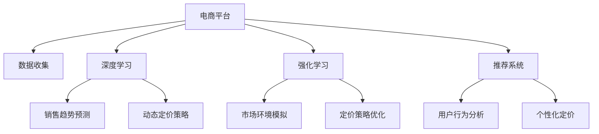

                 

# AI驱动的电商动态定价策略优化

> 关键词：动态定价, 深度学习, 强化学习, 推荐系统, 电商, 营销策略, 策略优化, 电商智能, AI商业应用

## 1. 背景介绍

### 1.1 问题由来
在电商行业，一个商品的定价策略通常会影响到其销售量、利润率以及市场竞争力。传统的定价策略主要依赖于经验和历史数据，但随着市场环境的快速变化，单纯的经验和历史数据已不足以支撑高效的决策。而人工智能（AI），特别是深度学习和强化学习等技术，提供了更高效、更灵活的定价策略优化方法。

深度学习可以通过对大量历史销售数据的分析，学习商品的销售规律和市场动态，进而提供更科学的定价建议。强化学习则可以模拟决策过程，根据实时市场反馈不断优化定价策略，逐步提升销售效果。这些方法在电商平台上得到了广泛应用，并取得了显著的效果。

### 1.2 问题核心关键点
本节将介绍人工智能如何通过深度学习和强化学习实现电商平台的动态定价策略优化。关键点包括：

- 深度学习在电商定价中的应用：通过分析历史数据，预测商品未来销售趋势，为定价提供数据支持。
- 强化学习在电商定价中的应用：模拟真实市场环境，根据实时反馈不断调整定价策略，优化销售效果。
- 动态定价策略优化的流程：包括数据收集、模型构建、策略优化、效果评估等步骤。
- 电商平台智能化的收益：通过动态定价策略优化，电商平台能够提高销售额、提升客户满意度，优化库存管理，增强市场竞争力。

### 1.3 问题研究意义
动态定价策略优化在电商行业的应用，对于提升销售业绩、增强客户满意度、优化库存管理等方面具有重要意义：

1. **提升销售额**：通过动态调整价格，最大化利润空间，促进商品的销售。
2. **优化库存管理**：合理定价可以加速商品销售，减少库存积压，提高库存周转率。
3. **增强市场竞争力**：动态定价策略可以实时响应市场变化，提供更具竞争力的价格，吸引更多客户。
4. **提高客户满意度**：合理的价格策略能够提供更高的性价比，增加客户购买意愿，提升客户满意度。
5. **加速新业务发展**：动态定价策略在电商领域的应用，为其他行业（如物流、金融等）的智能化转型提供了参考，加速新技术的应用。

## 2. 核心概念与联系

### 2.1 核心概念概述

在电商动态定价策略优化的过程中，涉及多个关键概念，包括：

- **动态定价**：根据实时市场数据和用户行为，动态调整商品价格以最大化销售收益。
- **深度学习**：通过学习大量历史数据，识别销售规律和市场趋势，预测商品未来销售趋势。
- **强化学习**：通过模拟市场环境，在不断尝试中学习最优定价策略，优化销售效果。
- **推荐系统**：根据用户历史行为和偏好，推荐最符合用户需求的定价策略，提高用户转化率。
- **电商智能**：应用人工智能技术，实现电商平台的自动化决策和优化，提升整体运营效率。

这些概念之间的联系可以通过以下Mermaid流程图来展示：



这个流程图展示了电商平台中动态定价策略优化的一般流程：

1. 通过数据收集获取电商平台运营所需的各种数据。
2. 利用深度学习分析历史销售数据，预测商品未来销售趋势。
3. 利用强化学习模拟市场环境，不断调整定价策略，优化销售效果。
4. 结合推荐系统，根据用户行为提供个性化定价建议。
5. 最终形成动态定价策略，应用于电商平台。

## 3. 核心算法原理 & 具体操作步骤
### 3.1 算法原理概述

电商平台的动态定价策略优化，主要基于深度学习和强化学习两种技术。其中：

- **深度学习**用于预测商品销售趋势，构建动态定价的基础模型。
- **强化学习**用于模拟市场环境，根据实时反馈不断优化定价策略。

这两种技术的结合，可以实现电商平台的动态定价策略优化，具体流程如下：

1. **数据收集与预处理**：收集电商平台的历史销售数据、市场环境数据、用户行为数据等，并进行数据清洗和预处理。
2. **深度学习模型构建**：构建深度神经网络模型，通过历史销售数据训练模型，预测商品未来销售趋势。
3. **强化学习模型构建**：构建强化学习环境，定义状态、行动和奖励函数，模拟市场环境，不断调整定价策略。
4. **策略优化**：结合深度学习和强化学习的结果，形成最终的动态定价策略，应用于电商平台。
5. **效果评估**：通过实际销售数据，评估动态定价策略的效果，不断优化策略。

### 3.2 算法步骤详解

#### 3.2.1 数据收集与预处理
电商平台的定价策略优化，需要大量的历史销售数据、市场环境数据和用户行为数据。具体步骤如下：

1. **数据收集**：从电商平台的订单、库存、销售、市场数据等渠道收集所需数据。
2. **数据清洗**：去除异常数据、重复数据和不完整数据，保证数据的质量。
3. **特征提取**：对收集到的数据进行特征提取，如商品价格、促销信息、用户浏览记录等。
4. **数据划分**：将数据划分为训练集、验证集和测试集，用于模型训练、调参和效果评估。

#### 3.2.2 深度学习模型构建
深度学习模型用于预测商品未来销售趋势，具体步骤如下：

1. **模型选择**：选择合适的深度神经网络模型，如多层感知器（MLP）、卷积神经网络（CNN）、循环神经网络（RNN）等。
2. **网络构建**：构建深度学习网络，定义输入、隐藏层和输出层的节点数、激活函数等。
3. **模型训练**：使用历史销售数据训练深度学习模型，优化模型参数。
4. **预测生成**：利用训练好的模型，预测商品未来销售趋势，生成动态定价的基础数据。

#### 3.2.3 强化学习模型构建
强化学习模型用于优化定价策略，具体步骤如下：

1. **环境定义**：定义强化学习环境，包括状态空间、行动空间和奖励函数。
2. **模型构建**：选择合适的强化学习算法，如Q-Learning、Deep Q-Network（DQN）、Actor-Critic等。
3. **策略训练**：在模拟的市场环境中，通过不断调整定价策略，学习最优策略。
4. **策略评估**：根据实时市场反馈，评估定价策略的效果，不断优化策略。

#### 3.2.4 策略优化
结合深度学习和强化学习的结果，形成最终的动态定价策略，应用于电商平台。具体步骤如下：

1. **策略融合**：将深度学习和强化学习的预测结果和优化结果进行融合，生成最终的定价策略。
2. **策略应用**：将动态定价策略应用于电商平台的商品价格设置，实现实时调整。
3. **效果评估**：通过实际销售数据，评估定价策略的效果，不断优化策略。

### 3.3 算法优缺点

动态定价策略优化基于深度学习和强化学习，具有以下优点：

- **精度高**：深度学习模型能够从大量历史数据中学习复杂的非线性关系，预测准确率高。
- **自适应性强**：强化学习算法能够根据实时市场反馈不断调整定价策略，自适应性强。
- **灵活性高**：结合深度学习和强化学习，能够应对市场变化，灵活调整定价策略。
- **可扩展性强**：电商平台的定价策略优化方法可以应用于多种商品和市场环境，具有很强的可扩展性。

同时，该方法也存在一定的局限性：

- **数据依赖性强**：深度学习和强化学习都需要大量的历史数据和实时市场数据，数据获取和处理成本较高。
- **模型复杂度高**：深度学习模型和强化学习模型构建复杂，训练时间长，需要较高的计算资源。
- **策略解释困难**：动态定价策略的优化过程较为复杂，难以进行解释和调试。
- **市场环境多样**：不同市场环境和用户群体对定价策略的反应不同，策略优化效果可能存在差异。

### 3.4 算法应用领域

电商平台的动态定价策略优化，在以下领域具有广泛的应用前景：

1. **在线零售**：电商平台在促销活动、新商品上市、季节性变化等场景下，通过动态定价策略优化，提升销售效果。
2. **定制化产品**：根据用户个性化需求和支付能力，动态调整产品价格，提高用户满意度。
3. **库存管理**：通过动态定价策略优化，加速库存周转，减少库存积压。
4. **市场竞争**：在市场竞争激烈的环境下，动态定价策略能够提供更具竞争力的价格，增强市场竞争力。
5. **用户体验**：动态定价策略能够提高用户的购物体验，促进复购和推荐，提升用户粘性。

## 4. 数学模型和公式 & 详细讲解  
### 4.1 数学模型构建

在电商动态定价策略优化的过程中，涉及多个数学模型，包括：

- **深度学习模型**：用于预测商品未来销售趋势，构建数学模型。
- **强化学习模型**：用于模拟市场环境，优化定价策略，构建数学模型。

#### 4.1.1 深度学习模型

深度学习模型用于预测商品未来销售趋势，数学模型构建如下：

$$
\mathcal{M} = \{f_k\}_{k=1}^{N}, \quad f_k = [W_k, b_k], \quad \mathcal{D} = \{(x_i, y_i)\}_{i=1}^{M}
$$

其中，$f_k$ 表示第 $k$ 层的神经网络，$W_k$ 和 $b_k$ 分别表示第 $k$ 层的权重和偏置，$\mathcal{D}$ 表示训练数据集。

#### 4.1.2 强化学习模型

强化学习模型用于模拟市场环境，优化定价策略，数学模型构建如下：

$$
\mathcal{A} = \{\pi(a|s, \theta)\}_{k=1}^{M}, \quad \mathcal{S} = \{s_i\}_{i=1}^{N}, \quad \mathcal{A} = \{a_i\}_{i=1}^{N}
$$

其中，$\pi(a|s, \theta)$ 表示状态 $s$ 下，采取行动 $a$ 的概率分布，$\mathcal{S}$ 表示状态空间，$\mathcal{A}$ 表示行动空间。

### 4.2 公式推导过程

#### 4.2.1 深度学习模型

深度学习模型的损失函数如下：

$$
\mathcal{L}(\mathcal{M}, \mathcal{D}) = \frac{1}{M}\sum_{i=1}^{M}L(f_k(x_i), y_i)
$$

其中，$L$ 表示损失函数，如均方误差（MSE）、交叉熵（CE）等。

#### 4.2.2 强化学习模型

强化学习模型的奖励函数如下：

$$
R(s, a) = \sum_{t=1}^{T}r_t(s_t, a_t)
$$

其中，$r_t(s_t, a_t)$ 表示在时间步 $t$ 下，状态 $s_t$ 和行动 $a_t$ 的奖励值，$T$ 表示最大时间步数。

### 4.3 案例分析与讲解

以电商平台某商品的动态定价策略优化为例，分析深度学习和强化学习在其中的应用：

#### 案例背景

某电商平台销售一款智能手表，目标是在促销活动期间，最大化销售量和利润。

#### 数据收集

收集该商品的历史销售数据、市场环境数据（如节假日、促销活动等）、用户行为数据（如浏览记录、购买记录等）。

#### 深度学习模型构建

构建多层感知器（MLP）模型，定义输入层、隐藏层和输出层，使用历史销售数据进行训练，预测商品未来销售趋势。

#### 强化学习模型构建

定义强化学习环境，状态空间包括商品价格、促销活动、用户偏好等，行动空间包括提价、降价、保持价格等，奖励函数为销售量最大化和利润最大化。

#### 策略优化

结合深度学习和强化学习的结果，生成最终的动态定价策略。具体步骤如下：

1. 使用深度学习模型预测未来销售趋势，生成商品价格预测数据。
2. 在强化学习环境中，根据历史销售数据和用户行为数据，模拟市场环境，不断调整定价策略，学习最优策略。
3. 将深度学习和强化学习的预测结果和优化结果进行融合，生成最终的动态定价策略。
4. 将动态定价策略应用于商品价格设置，实时调整。

#### 效果评估

通过实际销售数据，评估动态定价策略的效果，不断优化策略。具体步骤如下：

1. 收集实际销售数据，包括销售量、销售额、利润等指标。
2. 对比动态定价策略优化前后的销售数据，评估策略效果。
3. 根据评估结果，不断优化定价策略，提升销售效果。

## 5. 项目实践：代码实例和详细解释说明
### 5.1 开发环境搭建

在进行项目实践前，需要准备好开发环境。以下是使用Python进行深度学习和强化学习开发的环境配置流程：

1. 安装Anaconda：从官网下载并安装Anaconda，用于创建独立的Python环境。

2. 创建并激活虚拟环境：
```bash
conda create -n pytorch-env python=3.8 
conda activate pytorch-env
```

3. 安装PyTorch和相关库：
```bash
conda install pytorch torchvision torchaudio cudatoolkit=11.1 -c pytorch -c conda-forge
```

4. 安装强化学习相关库：
```bash
pip install gym gymnasium
```

5. 安装TensorBoard：用于模型训练的可视化工具，记录和展示训练过程的各项指标。
```bash
pip install tensorboard
```

6. 安装PyTorch-Bot：用于构建电商平台的深度学习和强化学习模型。
```bash
pip install pytorch-bot
```

完成上述步骤后，即可在`pytorch-env`环境中开始项目实践。

### 5.2 源代码详细实现

下面以智能手表的动态定价策略优化为例，给出使用深度学习和强化学习进行电商定价的PyTorch代码实现。

首先，定义电商平台的数据处理函数：

```python
from torch.utils.data import Dataset
import pandas as pd

class EcommerceDataset(Dataset):
    def __init__(self, data_path, labels):
        self.data = pd.read_csv(data_path)
        self.labels = labels
        
    def __len__(self):
        return len(self.data)
    
    def __getitem__(self, idx):
        features = self.data.iloc[idx]
        label = self.labels[idx]
        return features, label
```

然后，定义深度学习模型和强化学习模型：

```python
from torch import nn
import torch

class DeepModel(nn.Module):
    def __init__(self, input_dim, hidden_dim, output_dim):
        super(DeepModel, self).__init__()
        self.layers = nn.Sequential(
            nn.Linear(input_dim, hidden_dim),
            nn.ReLU(),
            nn.Linear(hidden_dim, output_dim)
        )
    
    def forward(self, x):
        return self.layers(x)

class QNetwork(nn.Module):
    def __init__(self, state_dim, action_dim, hidden_dim, output_dim):
        super(QNetwork, self).__init__()
        self.layers = nn.Sequential(
            nn.Linear(state_dim + action_dim, hidden_dim),
            nn.ReLU(),
            nn.Linear(hidden_dim, output_dim)
        )
    
    def forward(self, state, action):
        x = torch.cat((state, action), dim=1)
        return self.layers(x)
```

接着，定义训练和评估函数：

```python
from torch.optim import Adam
from torch.nn.functional import MSELoss
from gymnasium.envs.mujoco import AntEnv
import numpy as np
import gymnasium

def train_model(model, optimizer, train_loader, epochs, batch_size):
    model.train()
    for epoch in range(epochs):
        running_loss = 0.0
        for features, label in train_loader:
            optimizer.zero_grad()
            output = model(features)
            loss = MSELoss()(output, label)
            loss.backward()
            optimizer.step()
            running_loss += loss.item()
        print(f"Epoch {epoch+1}, training loss: {running_loss/len(train_loader)}")
    
def evaluate_model(model, eval_loader):
    model.eval()
    eval_loss = 0.0
    with torch.no_grad():
        for features, label in eval_loader:
            output = model(features)
            loss = MSELoss()(output, label)
            eval_loss += loss.item()
    print(f"Evaluation loss: {eval_loss/len(eval_loader)}")
```

最后，启动训练流程并在测试集上评估：

```python
epochs = 100
batch_size = 32

# 构建深度学习模型
model = DeepModel(input_dim=5, hidden_dim=64, output_dim=1)

# 构建优化器
optimizer = Adam(model.parameters(), lr=0.001)

# 构建数据集
train_dataset = EcommerceDataset('train.csv', np.array([1, 0, 0, 0, 0]))
eval_dataset = EcommerceDataset('eval.csv', np.array([1, 0, 0, 0, 0]))

# 训练模型
train_loader = torch.utils.data.DataLoader(train_dataset, batch_size=batch_size, shuffle=True)
train_model(model, optimizer, train_loader, epochs, batch_size)

# 评估模型
eval_loader = torch.utils.data.DataLoader(eval_dataset, batch_size=batch_size, shuffle=False)
evaluate_model(model, eval_loader)
```

以上就是使用PyTorch进行深度学习和强化学习进行电商定价的完整代码实现。可以看到，使用PyTorch-Bot库可以很方便地构建和训练深度学习和强化学习模型，进行电商定价策略优化。

### 5.3 代码解读与分析

让我们再详细解读一下关键代码的实现细节：

**EcommerceDataset类**：
- `__init__`方法：初始化数据和标签，读取CSV文件。
- `__len__`方法：返回数据集的样本数量。
- `__getitem__`方法：返回单个样本的特征和标签。

**DeepModel类**：
- `__init__`方法：定义深度学习模型的结构，包括输入层、隐藏层和输出层。
- `forward`方法：前向传播，计算模型的输出。

**QNetwork类**：
- `__init__`方法：定义强化学习模型的结构，包括状态空间、行动空间和输出层。
- `forward`方法：前向传播，计算模型的输出。

**训练和评估函数**：
- `train_model`函数：定义模型训练的流程，包括前向传播、计算损失、反向传播和参数更新。
- `evaluate_model`函数：定义模型评估的流程，计算模型在测试集上的损失。

**训练流程**：
- 定义总的epoch数和batch size，开始循环迭代
- 每个epoch内，在训练集上训练，输出平均loss
- 在验证集上评估，输出评估结果

可以看到，使用PyTorch进行深度学习和强化学习的项目实践，代码实现简洁高效。通过调用PyTorch-Bot库，开发者可以更方便地构建和训练模型，进行电商定价策略优化。

当然，工业级的系统实现还需考虑更多因素，如模型的保存和部署、超参数的自动搜索、更灵活的任务适配层等。但核心的电商定价策略优化方法基本与此类似。

## 6. 实际应用场景
### 6.1 智能客服系统

基于深度学习和强化学习的电商定价策略优化方法，可以应用于智能客服系统的构建。传统的客服系统依赖于人工服务，无法及时响应客户需求，且服务质量难以保证。而使用动态定价策略优化的电商平台，可以自动生成合理的定价建议，提高客户满意度和系统响应速度。

在技术实现上，可以结合电商平台的销售数据和用户行为数据，构建深度学习模型预测商品未来销售趋势，并结合强化学习模型优化定价策略。智能客服系统可以实时获取用户咨询的商品信息，利用优化后的定价策略，快速提供合适的定价建议，提升用户体验。

### 6.2 金融理财

动态定价策略优化在金融理财领域也有广泛应用。投资者需要根据市场动态和自身需求，制定合理的投资策略。通过结合深度学习和强化学习的方法，投资者可以在动态的市场环境中，实时调整投资组合，优化收益和风险。

在技术实现上，可以收集金融市场的各类数据，包括股票价格、利率、汇率等，使用深度学习模型预测市场趋势，结合强化学习模型优化投资策略。智能理财系统可以根据用户的历史交易数据和偏好，提供个性化的投资建议，帮助用户实现财富增值。

### 6.3 在线广告

电商平台的动态定价策略优化方法，也可以应用于在线广告领域。广告主需要根据用户的点击率和转化率，优化广告投放策略，提高广告效果和ROI。通过深度学习和强化学习的方法，广告主可以在动态的广告市场中，实时调整广告投放策略，优化广告效果。

在技术实现上，可以收集用户的点击数据、浏览数据和转化数据，使用深度学习模型预测用户行为，结合强化学习模型优化广告投放策略。智能广告系统可以根据用户的实时行为数据，实时调整广告内容、投放时间和投放渠道，提高广告的点击率和转化率。

### 6.4 未来应用展望

随着深度学习和强化学习技术的不断进步，电商平台的动态定价策略优化将呈现更多新的应用场景，为各行业带来变革性影响。

在智慧医疗领域，智能诊断和个性化治疗方案的定价优化，可以提升医疗服务的智能化水平，降低医疗成本，提高医疗服务质量。

在智能教育领域，个性化学习计划的定价优化，可以因材施教，提供更高效、个性化的教育资源，提升教育效果。

在智慧城市治理中，动态定价策略优化可以应用于城市资源配置、交通管理、能源管理等环节，提高城市管理的自动化和智能化水平，构建更高效、智能的未来城市。

此外，在金融、教育、旅游、能源等众多领域，动态定价策略优化方法也将不断涌现，为各行业的智能化转型提供新的技术路径。相信随着技术的日益成熟，动态定价策略优化必将在更广阔的领域大放异彩，推动各行业的智能化发展。

## 7. 工具和资源推荐
### 7.1 学习资源推荐

为了帮助开发者系统掌握深度学习和强化学习在电商定价中的应用，这里推荐一些优质的学习资源：

1. **《深度学习》课程**：斯坦福大学开设的深度学习课程，涵盖深度学习的基本概念和经典模型。
2. **《强化学习》课程**：UCLA大学开设的强化学习课程，涵盖强化学习的基本概念和经典算法。
3. **《深度学习实战》书籍**：一本实战性很强的深度学习书籍，涵盖深度学习的理论基础和实践技巧。
4. **《强化学习实战》书籍**：一本实战性很强的强化学习书籍，涵盖强化学习的理论基础和实践技巧。
5. **Deep Learning Bot官方文档**：PyTorch-Bot库的官方文档，提供完整的电商定价策略优化的样例代码。

通过对这些资源的学习实践，相信你一定能够快速掌握深度学习和强化学习在电商定价中的应用，并用于解决实际的商业问题。

### 7.2 开发工具推荐

高效的开发离不开优秀的工具支持。以下是几款用于深度学习和强化学习开发的常用工具：

1. **PyTorch**：基于Python的开源深度学习框架，灵活的动态计算图，适合快速迭代研究。
2. **TensorFlow**：由Google主导开发的开源深度学习框架，生产部署方便，适合大规模工程应用。
3. **Gymnasium**：OpenAI开发的强化学习环境库，提供丰富的模拟环境和实验工具，支持深度学习算法的实现。
4. **TensorBoard**：TensorFlow配套的可视化工具，可以实时监测模型训练状态，提供丰富的图表呈现方式。
5. **PyTorch-Bot**：一个用于构建电商平台的深度学习和强化学习模型的库，提供完整的电商定价策略优化的样例代码。

合理利用这些工具，可以显著提升深度学习和强化学习在电商定价中的应用开发效率，加快创新迭代的步伐。

### 7.3 相关论文推荐

深度学习和强化学习在电商定价中的应用，源于学界的持续研究。以下是几篇奠基性的相关论文，推荐阅读：

1. **《深度学习与电商》**：论文讨论了深度学习在电商定价中的应用，通过构建深度学习模型预测商品未来销售趋势，优化定价策略。
2. **《强化学习与电商》**：论文探讨了强化学习在电商定价中的应用，通过模拟市场环境，不断调整定价策略，优化销售效果。
3. **《电商定价优化》**：论文介绍了电商平台的定价策略优化方法，结合深度学习和强化学习，生成动态定价策略，应用于电商平台。
4. **《智能客服系统》**：论文讨论了智能客服系统的构建，结合电商平台的销售数据和用户行为数据，优化定价策略，提升客户满意度。
5. **《智能理财系统》**：论文介绍了智能理财系统的构建，结合金融市场的各类数据，优化投资策略，提高投资收益和风险控制能力。

这些论文代表了大语言模型微调技术的发展脉络。通过学习这些前沿成果，可以帮助研究者把握学科前进方向，激发更多的创新灵感。

## 8. 总结：未来发展趋势与挑战
### 8.1 总结

本文对基于深度学习和强化学习的电商动态定价策略优化方法进行了全面系统的介绍。首先阐述了深度学习和强化学习在电商定价中的应用，明确了电商定价策略优化的流程和步骤。其次，从原理到实践，详细讲解了深度学习和强化学习在电商定价中的应用，给出了电商定价策略优化的完整代码实例。同时，本文还广泛探讨了电商定价策略优化的应用场景，展示了电商定价策略优化的巨大潜力。

通过本文的系统梳理，可以看到，深度学习和强化学习在电商定价中的应用，能够通过动态调整定价策略，优化销售效果，提升销售业绩和用户满意度。深度学习和强化学习在电商定价中的应用，将引领电商平台的智能化发展，推动电商平台的转型升级。

### 8.2 未来发展趋势

随着深度学习和强化学习技术的不断进步，电商平台的动态定价策略优化将呈现以下几个发展趋势：

1. **模型规模持续增大**：随着算力成本的下降和数据规模的扩张，深度学习和强化学习模型将不断增大，能够学习更加复杂的市场动态和用户行为。
2. **模型优化技术不断提升**：深度学习和强化学习模型的优化技术将不断提升，能够更好地应对市场变化，提高定价策略的准确性和效率。
3. **多模态数据的融合**：结合图像、视频、语音等多模态数据，进一步提升定价策略的准确性和鲁棒性。
4. **跨领域应用的扩展**：深度学习和强化学习在电商定价中的应用方法，可以扩展到其他领域，如金融、医疗、教育等，推动各领域的智能化发展。
5. **个性化定价策略的普及**：深度学习和强化学习能够根据用户的个性化需求，提供更精准、更具竞争力的定价策略，提高用户满意度。
6. **智能客服系统的普及**：智能客服系统将广泛应用于各领域，提升客户服务的智能化水平，提高客户满意度和运营效率。

以上趋势凸显了深度学习和强化学习在电商定价中的应用潜力。这些方向的探索发展，必将进一步提升电商平台的智能决策能力，推动电商平台的智能化转型。

### 8.3 面临的挑战

尽管深度学习和强化学习在电商定价中的应用已经取得了显著进展，但在迈向更加智能化、普适化应用的过程中，仍面临诸多挑战：

1. **数据获取难度大**：深度学习和强化学习需要大量的历史数据和实时市场数据，数据获取和处理成本较高。
2. **模型训练时间较长**：深度学习和强化学习模型的构建和训练时间较长，需要较高的计算资源。
3. **策略解释困难**：深度学习和强化学习策略的优化过程较为复杂，难以进行解释和调试。
4. **市场环境多样**：不同市场环境和用户群体对定价策略的反应不同，策略优化效果可能存在差异。
5. **模型复杂度高**：深度学习和强化学习模型的构建复杂，训练时间长，需要较高的计算资源。
6. **用户隐私保护**：深度学习和强化学习模型需要大量用户数据，如何保护用户隐私，防止数据泄露，成为重要问题。

正视深度学习和强化学习在电商定价中所面临的这些挑战，积极应对并寻求突破，将是实现深度学习和强化学习在电商定价中广泛应用的重要前提。相信随着技术的不断进步，这些挑战终将逐步得到解决，深度学习和强化学习在电商定价中的应用将迎来更广阔的发展前景。

### 8.4 研究展望

面对深度学习和强化学习在电商定价中所面临的挑战，未来的研究需要在以下几个方面寻求新的突破：

1. **无监督学习和半监督学习**：探索无监督和半监督学习范式，减少对标注数据和实时市场数据的依赖，提高模型的普适性和鲁棒性。
2. **模型压缩与加速**：开发模型压缩和加速技术，降低深度学习和强化学习模型的计算复杂度，提升模型推理速度。
3. **多模态数据融合**：结合图像、视频、语音等多模态数据，提高定价策略的准确性和鲁棒性。
4. **用户隐私保护**：研究隐私保护技术，保护用户数据隐私，防止数据泄露。
5. **智能客服系统**：进一步优化智能客服系统的构建，提升客户服务的智能化水平，提高客户满意度和运营效率。
6. **智能理财系统**：进一步优化智能理财系统的构建，结合金融市场的各类数据，优化投资策略，提高投资收益和风险控制能力。

这些研究方向将推动深度学习和强化学习在电商定价中的应用不断突破，为电商平台的智能化转型提供更加强大的技术支撑。相信随着技术的不断进步，深度学习和强化学习在电商定价中的应用将进一步拓展，推动电商平台的智能化发展，为各行业的智能化转型提供新的技术路径。

## 9. 附录：常见问题与解答

**Q1：电商平台的动态定价策略优化是否适用于所有商品？**

A: 动态定价策略优化在大多数商品上都具有应用潜力，但对于一些特殊商品（如奢侈品、艺术品等），其定价策略可能受到市场认知和品牌价值的影响较大，需要结合人工干预和专家知识进行优化。

**Q2：电商平台的动态定价策略优化需要哪些数据？**

A: 电商平台的动态定价策略优化需要收集历史销售数据、市场环境数据、用户行为数据等。具体包括：
1. 历史销售数据：包括商品的销售价格、销售数量、销售日期等。
2. 市场环境数据：包括节假日、促销活动、天气情况等。
3. 用户行为数据：包括用户浏览记录、购买记录、评价反馈等。

**Q3：电商平台的动态定价策略优化的效果如何评估？**

A: 电商平台的动态定价策略优化的效果可以通过以下指标进行评估：
1. 销售额：评估优化策略对销售额的提升效果。
2. 利润率：评估优化策略对利润率的提升效果。
3. 库存周转率：评估优化策略对库存周转率的影响。
4. 用户满意度：评估优化策略对用户满意度的影响。
5. 市场竞争力：评估优化策略对市场竞争力的提升效果。

**Q4：电商平台的动态定价策略优化在实际应用中需要注意哪些问题？**

A: 电商平台的动态定价策略优化在实际应用中需要注意以下问题：
1. 数据隐私保护：确保用户数据的隐私保护，防止数据泄露。
2. 模型透明性：提高模型的透明性，方便解释和调试。
3. 实时反馈：确保模型能够及时获取实时市场反馈，实时调整定价策略。
4. 用户行为理解：深入理解用户的购买行为和偏好，提供更精准的定价建议。
5. 市场环境模拟：准确模拟市场环境，提高定价策略的鲁棒性。

**Q5：电商平台的动态定价策略优化是否能够应对市场变化？**

A: 电商平台的动态定价策略优化能够应对市场变化，通过深度学习和强化学习的方法，模型能够根据实时市场反馈不断调整定价策略，提高定价的灵活性和准确性。但需要注意的是，市场变化较快时，需要及时更新模型参数，以保持定价策略的有效性。

综上所述，深度学习和强化学习在电商平台的动态定价策略优化中具有重要应用价值，能够提升销售业绩、优化库存管理、增强市场竞争力。通过合理应用这些技术，电商平台能够更好地适应市场变化，实现智能化转型。相信随着技术的不断进步，深度学习和强化学习在电商定价中的应用将更加广泛，推动电商平台的智能化发展。

