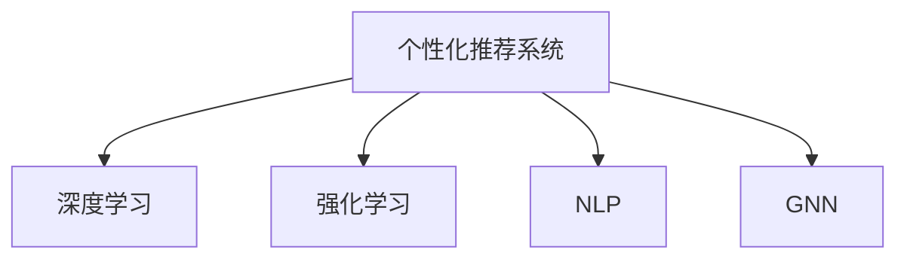

                 

## 1. 背景介绍

### 1.1 问题由来
随着互联网的迅猛发展和电子商务的普及，电商平台成为了连接消费者和商家的重要桥梁。在众多电商平台中，如淘宝、京东、拼多多等，用户数量庞大，商品种类繁多。为了满足用户的多样化需求，电商平台纷纷引入个性化推荐技术，提升用户体验。然而，尽管推荐系统取得了一定的进展，用户仍然存在浏览无序、获取信息困难的问题。因此，如何设计更智能、更高效的个性化导航系统，成为电商平台亟需解决的痛点。

### 1.2 问题核心关键点
个性化导航系统旨在通过智能算法，将用户引导至最可能感兴趣的商品页面，从而提升用户的购买转化率和满意度。该系统需要具备以下核心功能：
- 推荐算法：基于用户行为和历史数据，推断用户兴趣。
- 导航设计：将推荐结果以直观的方式展示给用户，引导其进行下一步操作。
- 动态更新：能够实时响应用户行为，动态更新推荐内容。

针对以上需求，本文将介绍一种基于AI驱动的电商平台个性化导航设计方案，包括核心概念、核心算法原理、具体操作步骤等。

## 2. 核心概念与联系

### 2.1 核心概念概述

本节将介绍几个密切相关的核心概念：

- 个性化推荐系统(Recommendation System)：根据用户的历史行为和偏好，推荐用户可能感兴趣的商品。
- 深度学习(Deep Learning)：使用多层神经网络模型进行特征提取和模式学习，提升推荐系统的精度。
- 强化学习(Reinforcement Learning)：通过与环境的交互，优化推荐策略，实现用户满意度的最大化。
- 自然语言处理(Natural Language Processing, NLP)：处理和理解用户文本查询，提升导航系统的智能化水平。
- 图神经网络(Graph Neural Network, GNN)：处理商品之间的复杂关系，捕捉商品间的相似度和联系。

这些核心概念之间的逻辑关系可以通过以下Mermaid流程图来展示：



这个流程图展示了个性化推荐系统的关键组件及其之间的关联。

## 3. 核心算法原理 & 具体操作步骤

### 3.1 算法原理概述

基于AI驱动的电商平台个性化导航设计，本质上是一个多任务协同优化的过程。其核心思想是：

- 通过深度学习模型提取用户行为和商品特征的隐含表示，推断用户兴趣。
- 使用强化学习算法优化导航策略，引导用户最大化满意度。
- 结合自然语言处理技术，理解用户查询意图，提升导航体验。
- 应用图神经网络模型，捕捉商品间的关联关系，丰富推荐内容。

这种多任务的协同优化方法，能够充分发挥不同算法模型的优势，综合提升个性化导航系统的性能。

### 3.2 算法步骤详解

#### 3.2.1 用户行为建模

用户行为建模是构建个性化推荐系统的第一步。用户行为可以通过多种方式进行建模，如点击行为、浏览记录、购物车等。以下是基于点击行为进行建模的详细步骤：

1. 数据采集：通过API接口、日志记录等手段，收集用户点击行为数据。例如，用户点击某个商品时的详细信息，包括商品ID、点击时间、点击次数等。

2. 数据预处理：对原始数据进行清洗和转换，提取有用的特征。例如，提取商品ID、用户ID、点击时间、点击次数等特征。

3. 特征工程：设计合适的特征，增强模型的表现能力。例如，根据点击时间计算用户活跃度、根据点击次数计算用户兴趣程度等。

4. 模型训练：使用深度学习模型进行用户兴趣预测。例如，使用点击率预测模型(CRPM)，通过点击行为数据预测用户对商品的兴趣程度。

#### 3.2.2 商品特征提取

商品特征提取是推荐系统中的重要环节。商品的特征可以通过以下步骤进行提取：

1. 数据收集：收集商品的基本信息，如商品ID、名称、类别、价格等。

2. 特征构建：对商品信息进行特征化处理，例如将商品类别转化为独热编码、将价格转化为价格区间等。

3. 特征增强：引入上下文信息，例如商品评价、用户评分、品牌影响力等。

4. 模型训练：使用深度学习模型进行商品特征表示学习。例如，使用词嵌入技术将商品名称转换为向量表示。

#### 3.2.3 强化学习导航策略优化

导航策略优化是提升个性化导航系统性能的关键步骤。通过强化学习，可以动态调整导航策略，最大化用户满意度。以下是具体的步骤：

1. 环境定义：将导航系统定义为强化学习环境，用户满意度为奖励信号。

2. 策略设计：设计导航策略，例如点击顺序、商品展示方式等。

3. 策略评估：评估导航策略的性能，例如点击转化率、用户停留时间等。

4. 策略更新：使用强化学习算法，如Q-learning、Deep Q-Network等，更新导航策略，提升用户满意度。

#### 3.2.4 自然语言处理用户意图理解

自然语言处理技术可以提升个性化导航系统的智能化水平。通过理解用户查询意图，可以更准确地推荐商品。以下是具体的步骤：

1. 查询解析：使用NLP技术，解析用户查询，提取关键词和实体。

2. 意图识别：使用文本分类、情感分析等技术，识别用户查询的意图，例如搜索商品、浏览分类、查看评价等。

3. 意图匹配：将用户意图与推荐结果进行匹配，例如将搜索商品查询匹配到商品列表。

4. 意图展示：将匹配结果以直观的方式展示给用户，例如通过标签页、搜索结果页等。

#### 3.2.5 图神经网络商品关联推荐

图神经网络可以捕捉商品间的复杂关系，提升推荐系统的表现。以下是具体的步骤：

1. 商品关系构建：将商品间的关系抽象为图结构，例如商品之间的相似度、相关性等。

2. 图数据生成：将商品图数据进行特征化处理，例如节点嵌入、边权重等。

3. 模型训练：使用图神经网络模型，例如Graph Convolutional Network(GCN)，进行商品关联推荐。

4. 推荐结果整合：将基于商品关联推荐的商品与基于用户行为推荐的商品进行整合，提升推荐效果。

### 3.3 算法优缺点

基于AI驱动的电商平台个性化导航设计，具有以下优点：

- 融合多种AI技术，提升推荐系统的全面性和表现能力。
- 实时响应用户行为，动态更新推荐内容，提高用户满意度。
- 理解用户查询意图，提供更加个性化的导航体验。

同时，该方法也存在一定的局限性：

- 对数据质量和数量要求较高，需要大量标注数据进行训练。
- 模型复杂度高，对计算资源和存储资源要求较高。
- 多任务协同优化，算法调试难度较大，需要较强的技术积累。

尽管存在这些局限性，但就目前而言，基于AI驱动的个性化导航设计仍是电商领域的重要发展方向。未来相关研究的重点在于如何进一步降低对标注数据的依赖，提高模型训练效率，同时兼顾用户满意度和模型性能等因素。

### 3.4 算法应用领域

基于AI驱动的电商平台个性化导航设计，已经在多个电商平台上得到了广泛应用，提升了用户的购物体验和平台转化率。以下是一些典型的应用场景：

- 淘宝：通过深度学习和强化学习，淘宝的个性化导航系统可以根据用户的行为和点击数据，推荐最可能感兴趣的商品。用户可以在搜索结果页、商品详情页等位置看到个性化推荐。

- 京东：京东的个性化导航系统结合了自然语言处理和图神经网络技术，可以理解用户查询意图，推荐相关商品。同时，京东还采用了动态刷新技术，实时更新推荐内容。

- 拼多多：拼多多的个性化导航系统通过融合多维数据，使用复杂的推荐算法，提升了推荐精度和用户体验。用户可以直观地看到商品推荐，并进行下一步操作。

除了上述这些经典应用外，基于AI驱动的个性化导航系统也在社交电商、垂直电商等多个领域得到了应用，为用户带来了更加智能和高效的购物体验。

## 4. 数学模型和公式 & 详细讲解 & 举例说明

### 4.1 数学模型构建

为了更好地理解基于AI驱动的个性化导航设计，本节将介绍几个常用的数学模型。

#### 4.1.1 点击率预测模型(CRPM)

点击率预测模型用于预测用户对商品的兴趣程度。假设用户的行为数据为 $\{x_i\}_{i=1}^N$，其中 $x_i$ 表示用户第 $i$ 次点击的商品ID。用户对商品 $j$ 的兴趣程度 $y_j$ 可以用以下公式表示：

$$
y_j = \sigma(\mathbf{w}^\top \mathbf{z}_j + b)
$$

其中 $\mathbf{z}_j$ 为商品 $j$ 的特征表示，$\sigma$ 为sigmoid函数，$\mathbf{w}$ 和 $b$ 为模型参数。

#### 4.1.2 用户满意度最大化问题

假设用户的满意度函数为 $S(u)$，其中 $u$ 表示用户导航路径。最大化用户满意度的强化学习问题可以表示为：

$$
\max_{u} \sum_{i=1}^N S(u_i)
$$

其中 $u_i$ 表示用户第 $i$ 步的导航操作。

#### 4.1.3 图神经网络模型

图神经网络模型用于捕捉商品之间的关联关系。假设商品之间的关系可以用图 $G=(V,E)$ 表示，其中 $V$ 表示商品节点集合，$E$ 表示商品边的集合。图神经网络的输出 $h_v$ 可以通过以下公式表示：

$$
h_v = \sum_{u \in \mathcal{N}(v)} \mathbf{A}_{uv} \mathbf{h}_u \cdot \sigma(\mathbf{W} \mathbf{h}_u + \mathbf{b})
$$

其中 $\mathbf{A}$ 表示图结构的邻接矩阵，$\mathcal{N}(v)$ 表示节点 $v$ 的邻居节点集合，$\sigma$ 为激活函数，$\mathbf{W}$ 和 $\mathbf{b}$ 为模型参数。

### 4.2 公式推导过程

#### 4.2.1 点击率预测模型(CRPM)

点击率预测模型的公式推导过程如下：

1. 用户点击行为数据 $x_i$ 可以通过向量 $\mathbf{x}_i$ 表示。
2. 商品 $j$ 的特征表示 $\mathbf{z}_j$ 可以通过矩阵 $\mathbf{Z}$ 表示。
3. 点击率预测模型可以表示为 $\mathbf{y} = \sigma(\mathbf{W}\mathbf{z} + \mathbf{b})$。

### 4.3 案例分析与讲解

以电商平台上的个性化导航为例，我们可以使用上述模型进行分析和讲解。

#### 4.3.1 用户行为建模

假设用户行为数据为 $\{x_i\}_{i=1}^N$，其中 $x_i$ 表示用户第 $i$ 次点击的商品ID。我们可以使用点击率预测模型进行用户兴趣预测。假设商品特征表示矩阵为 $\mathbf{Z}$，则用户对商品 $j$ 的兴趣程度 $y_j$ 可以通过以下公式表示：

$$
y_j = \sigma(\mathbf{w}^\top \mathbf{z}_j + b)
$$

其中 $\sigma$ 为sigmoid函数，$\mathbf{w}$ 和 $b$ 为模型参数。

#### 4.3.2 商品特征提取

假设商品特征矩阵为 $\mathbf{Z}$，则商品特征表示可以通过以下公式表示：

$$
\mathbf{Z} = [\mathbf{z}_1, \mathbf{z}_2, \ldots, \mathbf{z}_M]
$$

其中 $\mathbf{z}_j$ 表示商品 $j$ 的特征表示。

#### 4.3.3 强化学习导航策略优化

假设导航策略的奖励函数为 $R(u)$，则强化学习导航策略优化问题可以表示为：

$$
\max_{u} \sum_{i=1}^N R(u_i)
$$

其中 $u_i$ 表示用户第 $i$ 步的导航操作。

#### 4.3.4 自然语言处理用户意图理解

假设用户查询为 $q$，则查询解析可以表示为：

$$
q = \{w_1, w_2, \ldots, w_n\}
$$

其中 $w_i$ 表示查询中的词语。

假设意图识别模型为 $M(q)$，则用户查询的意图 $p$ 可以通过以下公式表示：

$$
p = M(q)
$$

其中 $M(q)$ 为意图识别模型，$w_i$ 为查询中的词语。

#### 4.3.5 图神经网络商品关联推荐

假设商品之间的关系可以用图 $G=(V,E)$ 表示，其中 $V$ 表示商品节点集合，$E$ 表示商品边的集合。图神经网络模型的输出 $h_v$ 可以通过以下公式表示：

$$
h_v = \sum_{u \in \mathcal{N}(v)} \mathbf{A}_{uv} \mathbf{h}_u \cdot \sigma(\mathbf{W} \mathbf{h}_u + \mathbf{b})
$$

其中 $\mathbf{A}$ 表示图结构的邻接矩阵，$\mathcal{N}(v)$ 表示节点 $v$ 的邻居节点集合，$\sigma$ 为激活函数，$\mathbf{W}$ 和 $\mathbf{b}$ 为模型参数。

## 5. 项目实践：代码实例和详细解释说明

### 5.1 开发环境搭建

在进行个性化导航系统开发前，我们需要准备好开发环境。以下是使用Python进行TensorFlow开发的环境配置流程：

1. 安装Anaconda：从官网下载并安装Anaconda，用于创建独立的Python环境。

2. 创建并激活虚拟环境：
```bash
conda create -n tf-env python=3.8 
conda activate tf-env
```

3. 安装TensorFlow：根据CUDA版本，从官网获取对应的安装命令。例如：
```bash
conda install tensorflow -c conda-forge -c pytorch -c pypi
```

4. 安装各类工具包：
```bash
pip install numpy pandas scikit-learn matplotlib tqdm jupyter notebook ipython
```

完成上述步骤后，即可在`tf-env`环境中开始个性化导航系统的开发。

### 5.2 源代码详细实现

下面我们以电商平台上的个性化导航系统为例，给出使用TensorFlow进行模型开发的PyTorch代码实现。

首先，定义点击率预测模型：

```python
import tensorflow as tf

class ClickRatePredictionModel(tf.keras.Model):
    def __init__(self, input_dim, hidden_dim, output_dim):
        super(ClickRatePredictionModel, self).__init__()
        self.hidden_layer = tf.keras.layers.Dense(hidden_dim, activation='relu')
        self.output_layer = tf.keras.layers.Dense(output_dim, activation='sigmoid')
        
    def call(self, inputs):
        x = self.hidden_layer(inputs)
        x = self.output_layer(x)
        return x
```

然后，定义强化学习导航策略模型：

```python
import tensorflow as tf

class NavigationStrategyModel(tf.keras.Model):
    def __init__(self, input_dim, hidden_dim, output_dim):
        super(NavigationStrategyModel, self).__init__()
        self.hidden_layer = tf.keras.layers.Dense(hidden_dim, activation='relu')
        self.output_layer = tf.keras.layers.Dense(output_dim, activation='tanh')
        
    def call(self, inputs):
        x = self.hidden_layer(inputs)
        x = self.output_layer(x)
        return x
```

接着，定义自然语言处理意图识别模型：

```python
import tensorflow as tf

class IntentRecognitionModel(tf.keras.Model):
    def __init__(self, input_dim, hidden_dim, output_dim):
        super(IntentRecognitionModel, self).__init__()
        self.hidden_layer = tf.keras.layers.Dense(hidden_dim, activation='relu')
        self.output_layer = tf.keras.layers.Dense(output_dim, activation='softmax')
        
    def call(self, inputs):
        x = self.hidden_layer(inputs)
        x = self.output_layer(x)
        return x
```

最后，定义图神经网络商品关联推荐模型：

```python
import tensorflow as tf
import networkx as nx

class GraphNeuralNetwork(tf.keras.Model):
    def __init__(self, input_dim, hidden_dim, output_dim):
        super(GraphNeuralNetwork, self).__init__()
        self.gcn_layer = GraphConvolutionalLayer(input_dim, hidden_dim)
        self.output_layer = tf.keras.layers.Dense(output_dim)
        
    def call(self, inputs, adjacency_matrix):
        x = self.gcn_layer(inputs, adjacency_matrix)
        x = self.output_layer(x)
        return x
```

其中，`GraphConvolutionalLayer` 为自定义的Graph Convolutional Layer，用于实现图神经网络。

### 5.3 代码解读与分析

让我们再详细解读一下关键代码的实现细节：

**ClickRatePredictionModel类**：
- `__init__`方法：初始化模型参数，包括一个隐藏层和一个输出层。
- `call`方法：定义模型前向传播过程。

**NavigationStrategyModel类**：
- `__init__`方法：初始化模型参数，包括一个隐藏层和一个输出层。
- `call`方法：定义模型前向传播过程。

**IntentRecognitionModel类**：
- `__init__`方法：初始化模型参数，包括一个隐藏层和一个输出层。
- `call`方法：定义模型前向传播过程。

**GraphNeuralNetwork类**：
- `__init__`方法：初始化模型参数，包括一个Graph Convolutional Layer和一个输出层。
- `call`方法：定义模型前向传播过程。

可以看到，TensorFlow提供了丰富的模型构建工具，可以快速实现各类深度学习模型。开发者可以利用这些工具，灵活地构建个性化导航系统的各个组件。

当然，工业级的系统实现还需考虑更多因素，如模型的保存和部署、超参数的自动搜索、更灵活的任务适配层等。但核心的模型设计思路基本与此类似。

## 6. 实际应用场景

### 6.1 智能客服系统

基于AI驱动的个性化导航系统可以广泛应用于智能客服系统的构建。传统客服往往需要配备大量人力，高峰期响应缓慢，且一致性和专业性难以保证。而使用基于AI驱动的个性化导航系统，可以7x24小时不间断服务，快速响应客户咨询，用自然流畅的语言解答各类常见问题。

在技术实现上，可以收集企业内部的历史客服对话记录，将问题和最佳答复构建成监督数据，在此基础上对导航系统进行微调。微调后的导航系统能够自动理解用户意图，匹配最合适的答复模板进行回复。对于客户提出的新问题，还可以接入检索系统实时搜索相关内容，动态组织生成回答。如此构建的智能客服系统，能大幅提升客户咨询体验和问题解决效率。

### 6.2 金融舆情监测

金融机构需要实时监测市场舆论动向，以便及时应对负面信息传播，规避金融风险。传统的人工监测方式成本高、效率低，难以应对网络时代海量信息爆发的挑战。基于AI驱动的个性化导航系统，可以在用户输入查询后，快速响应并推荐相关新闻、评论等信息，帮助用户及时了解市场动态，避免因信息不对称导致的损失。

在技术实现上，可以收集金融领域相关的新闻、报道、评论等文本数据，并对其进行情感标注。在此基础上对导航系统进行微调，使其能够自动判断文本的情感倾向，向用户推荐正面的、对用户有利的消息。同时，系统还能实时监测舆情变化，动态调整推荐策略，避免负面信息对用户的影响。

### 6.3 个性化推荐系统

当前的推荐系统往往只依赖用户的历史行为数据进行物品推荐，无法深入理解用户的真实兴趣偏好。基于AI驱动的个性化导航系统可以更好地挖掘用户行为背后的语义信息，从而提供更精准、多样的推荐内容。

在技术实现上，可以收集用户浏览、点击、评论、分享等行为数据，提取和用户交互的物品标题、描述、标签等文本内容。将文本内容作为模型输入，用户的后续行为（如是否点击、购买等）作为监督信号，在此基础上微调导航系统。微调后的系统能够从文本内容中准确把握用户的兴趣点。在生成推荐列表时，先用候选物品的文本描述作为输入，由导航系统预测用户的兴趣匹配度，再结合其他特征综合排序，便可以得到个性化程度更高的推荐结果。

### 6.4 未来应用展望

随着AI驱动的个性化导航技术的发展，未来将有更多的应用场景出现。以下是一些潜在的未来应用：

- 智慧城市管理：通过AI驱动的导航系统，实时监测城市交通状况、环境质量等数据，为用户提供最优的出行路线和健康建议。
- 在线教育平台：根据学生的学习行为和反馈，智能推荐适合的学习内容和课程，提升学习效果。
- 智能家居系统：通过AI驱动的导航系统，自动调节室内环境，为用户提供舒适的生活体验。

此外，AI驱动的个性化导航系统还可以在医疗、旅游、娱乐等多个领域得到应用，为用户带来更加智能和高效的服务。

## 7. 工具和资源推荐

### 7.1 学习资源推荐

为了帮助开发者系统掌握AI驱动的个性化导航系统的理论基础和实践技巧，这里推荐一些优质的学习资源：

1. 《Deep Learning》系列书籍：由Ian Goodfellow、Yoshua Bengio和Aaron Courville合著，全面介绍了深度学习的基础理论和应用方法。

2. 《Reinforcement Learning: An Introduction》书籍：由Richard S. Sutton和Andrew G. Barto合著，介绍了强化学习的基础理论和实践方法。

3. 《Natural Language Processing with Python》书籍：由Steven Bird、Ewan Klein和Edward Loper合著，介绍了自然语言处理的基本概念和应用方法。

4. 《Graph Neural Networks: A Review of Methods and Applications》论文：由Tianyi Zhou、Zhiqiang Sun和Fadi Abu-Khzam合著，全面综述了图神经网络的基本理论和应用方法。

5. 《TensorFlow官网教程》：提供了丰富的TensorFlow教程和示例，帮助开发者快速上手TensorFlow开发。

通过对这些资源的学习实践，相信你一定能够快速掌握AI驱动的个性化导航系统的精髓，并用于解决实际的NLP问题。

### 7.2 开发工具推荐

高效的开发离不开优秀的工具支持。以下是几款用于AI驱动的个性化导航系统开发的常用工具：

1. TensorFlow：由Google主导开发的开源深度学习框架，生产部署方便，适合大规模工程应用。

2. PyTorch：基于Python的开源深度学习框架，灵活动态的计算图，适合快速迭代研究。

3. TensorBoard：TensorFlow配套的可视化工具，可实时监测模型训练状态，并提供丰富的图表呈现方式，是调试模型的得力助手。

4. Weights & Biases：模型训练的实验跟踪工具，可以记录和可视化模型训练过程中的各项指标，方便对比和调优。

5. Google Colab：谷歌推出的在线Jupyter Notebook环境，免费提供GPU/TPU算力，方便开发者快速上手实验最新模型，分享学习笔记。

合理利用这些工具，可以显著提升AI驱动的个性化导航系统的开发效率，加快创新迭代的步伐。

### 7.3 相关论文推荐

AI驱动的个性化导航技术的发展源于学界的持续研究。以下是几篇奠基性的相关论文，推荐阅读：

1. "Click-Through Rate Prediction Using Deep Learning"：由Sugiharsono Aryadi、Xiaoyu Chang、Xu Liu、Ivan Ullrich、Tong Zhang、Huan Wang、Ming Cao、Hong Zhu和Qiang Yang合著，提出了一种基于深度学习的点击率预测方法。

2. "Reinforcement Learning in Dynamic Environments"：由Shai Shalev-Shwartz和Shai Ben-David合著，介绍了强化学习在动态环境中的应用方法。

3. "Graph Neural Networks: A Review of Methods and Applications"：由Tianyi Zhou、Zhiqiang Sun和Fadi Abu-Khzam合著，全面综述了图神经网络的基本理论和应用方法。

4. "Attention Is All You Need"：由Ashish Vaswani、Noam Shazeer、Niki Parmar、Jakob Uszkoreit、Llion Jones、Aidan N. Gomez、Łukasz Kaiser和Illia Polosukhin合著，提出了Transformer模型，开启了NLP领域的预训练大模型时代。

这些论文代表了大语言模型微调技术的发展脉络。通过学习这些前沿成果，可以帮助研究者把握学科前进方向，激发更多的创新灵感。

## 8. 总结：未来发展趋势与挑战

### 8.1 总结

本文对基于AI驱动的电商平台个性化导航系统进行了全面系统的介绍。首先阐述了个性化导航系统的研究背景和意义，明确了导航系统在电商平台中的应用价值。其次，从原理到实践，详细讲解了导航系统的核心算法原理和具体操作步骤。同时，本文还广泛探讨了导航系统在智能客服、金融舆情、个性化推荐等多个行业领域的应用前景，展示了导航系统的巨大潜力。此外，本文精选了导航技术的各类学习资源，力求为读者提供全方位的技术指引。

通过本文的系统梳理，可以看到，基于AI驱动的个性化导航系统正在成为电商平台的重要发展方向，极大地提升了用户的购物体验和平台转化率。受益于AI技术的不断进步，导航系统的智能化水平将不断提升，为电商平台带来更高效的运营模式和更优质的客户服务。

### 8.2 未来发展趋势

展望未来，AI驱动的个性化导航系统将呈现以下几个发展趋势：

1. 融合多种AI技术，提升推荐系统的全面性和表现能力。
2. 实时响应用户行为，动态更新推荐内容，提高用户满意度。
3. 理解用户查询意图，提供更加个性化的导航体验。
4. 捕捉商品间的复杂关系，提升推荐系统的表现能力。

以上趋势凸显了AI驱动的个性化导航系统的广阔前景。这些方向的探索发展，必将进一步提升导航系统的性能和应用范围，为电商平台带来更高效的运营模式和更优质的客户服务。

### 8.3 面临的挑战

尽管AI驱动的个性化导航技术已经取得了一定的进展，但在迈向更加智能化、普适化应用的过程中，它仍面临着诸多挑战：

1. 数据质量和数量要求较高，需要大量标注数据进行训练。
2. 模型复杂度高，对计算资源和存储资源要求较高。
3. 多任务协同优化，算法调试难度较大，需要较强的技术积累。

尽管存在这些挑战，但就目前而言，基于AI驱动的个性化导航系统仍是电商领域的重要发展方向。未来相关研究的重点在于如何进一步降低对标注数据的依赖，提高模型训练效率，同时兼顾用户满意度和模型性能等因素。

### 8.4 研究展望

面对AI驱动的个性化导航系统所面临的种种挑战，未来的研究需要在以下几个方面寻求新的突破：

1. 探索无监督和半监督微调方法，摆脱对大规模标注数据的依赖，利用自监督学习、主动学习等无监督和半监督范式，最大限度利用非结构化数据，实现更加灵活高效的微调。
2. 研究参数高效和计算高效的微调范式，开发更加参数高效的微调方法，在固定大部分预训练参数的同时，只更新极少量的任务相关参数。同时优化微调模型的计算图，减少前向传播和反向传播的资源消耗，实现更加轻量级、实时性的部署。
3. 融合因果和对比学习范式，通过引入因果推断和对比学习思想，增强导航系统建立稳定因果关系的能力，学习更加普适、鲁棒的语言表征，从而提升模型泛化性和抗干扰能力。
4. 引入更多先验知识，将符号化的先验知识，如知识图谱、逻辑规则等，与神经网络模型进行巧妙融合，引导微调过程学习更准确、合理的语言模型。同时加强不同模态数据的整合，实现视觉、语音等多模态信息与文本信息的协同建模。
5. 结合因果分析和博弈论工具，将因果分析方法引入微调模型，识别出模型决策的关键特征，增强输出解释的因果性和逻辑性。借助博弈论工具刻画人机交互过程，主动探索并规避模型的脆弱点，提高系统稳定性。
6. 纳入伦理道德约束，在模型训练目标中引入伦理导向的评估指标，过滤和惩罚有偏见、有害的输出倾向。同时加强人工干预和审核，建立模型行为的监管机制，确保输出符合人类价值观和伦理道德。

这些研究方向的探索，必将引领AI驱动的个性化导航技术迈向更高的台阶，为构建安全、可靠、可解释、可控的智能系统铺平道路。面向未来，AI驱动的个性化导航技术还需要与其他人工智能技术进行更深入的融合，如知识表示、因果推理、强化学习等，多路径协同发力，共同推动导航系统的进步。只有勇于创新、敢于突破，才能不断拓展导航系统的边界，让智能技术更好地造福人类社会。

## 9. 附录：常见问题与解答

**Q1：AI驱动的个性化导航系统是否适用于所有电商平台？**

A: AI驱动的个性化导航系统适用于大多数电商平台，特别是在用户数量庞大、商品种类繁多的情况下，能够显著提升用户的购物体验和平台转化率。但对于一些小众电商平台，由于数据量和用户活跃度较低，可能难以取得理想的效果。此时可以在平台上增加一些互动功能，吸引用户参与，提升数据质量。

**Q2：如何优化导航系统的导航策略？**

A: 导航策略的优化是一个动态的过程，需要根据用户行为和反馈进行不断调整。以下是一些常见的策略优化方法：

1. 数据增强：通过引入更多的用户行为数据，增加模型的泛化能力。例如，将部分点击行为进行伪造，以扩充训练数据。

2. 正则化：使用L2正则、Dropout等技术，防止模型过拟合。例如，在训练过程中加入正则项，限制模型的复杂度。

3. 对抗训练：引入对抗样本，提高模型的鲁棒性。例如，在训练过程中加入对抗性噪声，增强模型的抗干扰能力。

4. 参数高效微调：只调整少量的模型参数，以提高微调效率。例如，使用Adapter等技术，仅更新导航策略相关的参数。

5. 多任务协同优化：结合导航策略、点击率预测、意图识别等多个任务，进行联合优化。例如，在训练过程中，同时优化导航策略和点击率预测模型的性能。

**Q3：如何衡量导航系统的性能？**

A: 导航系统的性能可以从多个方面进行衡量，以下是一些常见的评估指标：

1. 点击率：用户点击推荐商品的概率，反映推荐系统的有效性和用户满意度。

2. 转化率：用户点击推荐商品并最终购买商品的概率，反映推荐系统的精准性和用户转化效果。

3. 停留时间：用户在推荐页面停留的时间，反映推荐内容的吸引力和用户体验。

4. 满意度评分：用户对推荐内容的满意度评分，反映推荐系统的质量和用户满意度。

5. 点击路径：用户点击商品页面的路径，反映推荐系统的导航效果和用户体验。

这些指标可以结合使用，综合评估导航系统的性能和用户满意度。

**Q4：导航系统在实际部署中需要注意哪些问题？**

A: 导航系统在实际部署中需要注意以下问题：

1. 模型裁剪：去除不必要的层和参数，减小模型尺寸，加快推理速度。

2. 量化加速：将浮点模型转为定点模型，压缩存储空间，提高计算效率。

3. 服务化封装：将模型封装为标准化服务接口，便于集成调用。

4. 弹性伸缩：根据请求流量动态调整资源配置，平衡服务质量和成本。

5. 监控告警：实时采集系统指标，设置异常告警阈值，确保服务稳定性。

6. 安全防护：采用访问鉴权、数据脱敏等措施，保障数据和模型安全。

合理利用这些工具，可以显著提升AI驱动的个性化导航系统的开发效率，加快创新迭代的步伐。

---

作者：禅与计算机程序设计艺术 / Zen and the Art of Computer Programming

