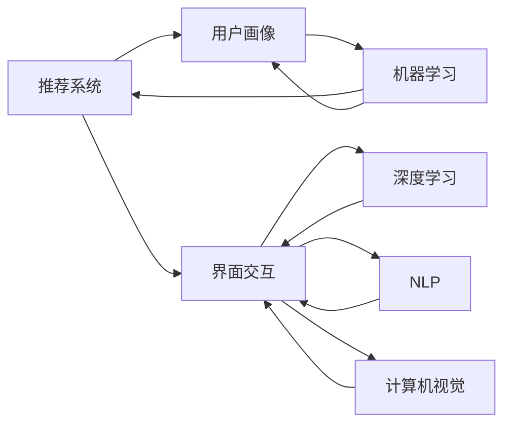

                 

# AI驱动的电商平台个性化导航设计

## 1. 背景介绍

随着电子商务的快速发展，电商平台已不再仅仅作为一个商品展示和交易的平台，而是成为用户获取信息、进行社交和娱乐的综合性平台。因此，个性化导航设计变得尤为重要。而随着人工智能技术的发展，AI驱动的个性化导航设计已经成为电商平台提升用户体验和增加销售额的关键手段。本文将详细探讨AI在电商平台个性化导航设计中的应用，包括推荐系统、用户画像、界面交互等方面。

## 2. 核心概念与联系

### 2.1 核心概念概述

为了更好地理解AI驱动的个性化导航设计，首先需要明确几个核心概念：

1. **推荐系统(Recommendation System)**：根据用户历史行为和偏好，自动推荐可能感兴趣的商品或内容。推荐系统包括协同过滤、基于内容的推荐、混合推荐等技术。

2. **用户画像(User Profile)**：对用户行为、偏好、兴趣等信息进行全面记录和分析，构建详细的用户画像。用户画像有助于个性化推荐和界面设计。

3. **界面交互(UI/UX)**：涉及界面设计、用户交互、响应时间等方面，直接影响用户的购物体验。

4. **机器学习(Machine Learning)**：通过构建数学模型，对用户数据进行分析、分类、预测等，从而提升个性化推荐效果。

5. **深度学习(Deep Learning)**：一种基于神经网络的机器学习方法，能够自动提取和学习数据特征，适用于复杂的数据处理任务。

6. **自然语言处理(NLP)**：通过理解用户输入的自然语言，实现语音识别、意图识别、情感分析等。

7. **计算机视觉(Computer Vision)**：利用计算机算法从图像或视频中提取信息，进行商品识别、图像搜索等。

这些概念相互联系，共同构成AI驱动的个性化导航设计的核心框架。推荐系统、用户画像、机器学习等技术，为个性化导航设计提供了数据基础和技术支持；而界面交互、深度学习、自然语言处理、计算机视觉等技术，则提供了实现手段和用户体验保障。

### 2.2 核心概念原理和架构的 Mermaid 流程图



这个流程图展示了AI驱动的个性化导航设计中各个核心概念的相互联系：推荐系统根据用户画像和机器学习模型推荐商品，界面交互则通过深度学习、自然语言处理和计算机视觉技术，提升用户体验和导航效果。

## 3. 核心算法原理 & 具体操作步骤

### 3.1 算法原理概述

AI驱动的个性化导航设计的核心算法原理，主要基于协同过滤、内容推荐和深度学习等技术。其中，协同过滤算法根据用户和商品之间的相似性进行推荐，内容推荐算法根据商品属性和用户偏好进行推荐，深度学习则通过神经网络自动提取和建模数据特征。

### 3.2 算法步骤详解

1. **数据收集与预处理**：收集用户行为数据（如浏览历史、购买记录、评分等）和商品属性数据（如商品类别、价格、品牌等），并进行清洗和处理。

2. **特征提取与建模**：对用户和商品数据进行特征提取和建模，构建用户画像和商品特征向量。常用的特征提取方法包括TF-IDF、Word2Vec等。

3. **协同过滤推荐**：利用用户-商品矩阵，通过协同过滤算法（如基于用户的协同过滤、基于物品的协同过滤）计算相似性度量，推荐可能感兴趣的商品。

4. **内容推荐算法**：根据用户画像和商品属性，使用内容推荐算法（如基于内容的推荐、矩阵分解等）进行推荐。

5. **深度学习建模**：利用深度学习模型（如神经网络、CNN、RNN等）对用户行为数据进行建模，预测用户可能感兴趣的商品。

6. **实时推荐与动态调整**：根据用户实时行为数据和系统反馈，动态调整推荐算法和模型参数，进行实时推荐。

### 3.3 算法优缺点

**优点**：

- 能够根据用户历史行为和偏好进行个性化推荐，提升用户满意度和购买转化率。
- 基于深度学习的模型可以自动提取数据特征，无需手工设计特征。
- 能够适应数据分布变化，动态调整推荐策略，提高推荐效果。

**缺点**：

- 推荐结果可能受到数据质量和数据量的影响，存在冷启动问题。
- 深度学习模型需要大量的训练数据和计算资源，对于小规模平台可能不适用。
- 推荐算法可能存在偏差，导致部分用户被忽略或误导。

### 3.4 算法应用领域

AI驱动的个性化导航设计，在电商平台、视频流媒体、社交媒体等众多领域都有广泛应用。通过推荐系统、用户画像、机器学习等技术，可以有效提升用户体验和平台运营效率。

## 4. 数学模型和公式 & 详细讲解 & 举例说明

### 4.1 数学模型构建

以基于协同过滤的推荐系统为例，用户和商品的评分矩阵为$R \in \mathbb{R}^{M \times N}$，其中$M$为商品数，$N$为用户数。设用户$u$对商品$i$的评分$R_{ui} = r_{ui}$。

协同过滤算法通过计算用户$u$与商品$i$的相似性$S_{ui}$，计算推荐分数$P_{ui} = \alpha r_{ui} + (1-\alpha) S_{ui}$。

### 4.2 公式推导过程

协同过滤算法中，用户和商品的相似性$S_{ui}$通常使用余弦相似度或皮尔逊相关系数计算：

$$
S_{ui} = \frac{\sum_{j=1}^{N} R_{uj} R_{vj}}{\sqrt{\sum_{j=1}^{N} R_{uj}^2} \sqrt{\sum_{j=1}^{N} R_{vj}^2}}
$$

其中，$\alpha$为模型的超参数，通常取值0.5。

### 4.3 案例分析与讲解

以Amazon电商平台为例，用户$u$对商品$i$的评分$R_{ui} = 4.5$。设用户$u$与商品$i$的相似性$S_{ui} = 0.9$，模型参数$\alpha = 0.5$，计算推荐分数：

$$
P_{ui} = 0.5 \times 4.5 + 0.5 \times 0.9 = 4.525
$$

推荐分数越高，表示商品$i$越可能被用户$u$感兴趣。根据推荐分数，从商品库中排序推荐给用户$u$。

## 5. 项目实践：代码实例和详细解释说明

### 5.1 开发环境搭建

在开始项目实践前，需要准备以下开发环境：

1. **Python 环境**：安装Python 3.6及以上版本，使用Anaconda创建虚拟环境。
2. **数据集**：获取Amazon商品数据集，包含用户评分和商品属性信息。
3. **工具包**：安装必要的工具包，如pandas、numpy、scikit-learn、scipy等。

### 5.2 源代码详细实现

以下是基于协同过滤算法的推荐系统代码实现：

```python
import pandas as pd
import numpy as np
from sklearn.metrics.pairwise import cosine_similarity

# 加载数据集
data = pd.read_csv('amazon_product_ratings.csv')

# 构建用户-商品评分矩阵
R = data.pivot(index='product_id', columns='user_id', values='rating').fillna(0)

# 计算用户-商品相似性
S = cosine_similarity(R)

# 计算推荐分数
alpha = 0.5
P = alpha * R + (1 - alpha) * S

# 选取商品进行推荐
top_products = P.max(axis=1).argsort()[::-1].tolist()

# 输出推荐商品ID
print(top_products[:10])
```

### 5.3 代码解读与分析

**数据加载与预处理**：
- 使用pandas加载Amazon商品评分数据集，并进行填充缺失值和数据清洗。

**构建用户-商品评分矩阵**：
- 使用pivot函数将评分数据转换为用户-商品评分矩阵，其中商品ID为行，用户ID为列，评分值为元素。

**计算相似性**：
- 使用scikit-learn中的cosine_similarity函数计算用户-商品相似性，得到一个相似性矩阵。

**计算推荐分数**：
- 根据协同过滤公式计算推荐分数，得到用户对所有商品的推荐分数矩阵。

**选取推荐商品**：
- 选取推荐分数最高的商品进行排序，输出前10个推荐商品ID。

**运行结果展示**：
- 输出前10个推荐商品ID，作为电商平台的个性化导航推荐结果。

## 6. 实际应用场景

### 6.1 电商搜索排序

电商平台的搜索排序功能，可以借助AI驱动的个性化导航设计提升用户体验。通过对用户搜索历史和行为数据进行分析和建模，推荐与用户查询最相关的商品，提高搜索效率。

### 6.2 个性化商品展示

商品展示页面可以借助推荐系统，根据用户画像和历史行为，推荐可能感兴趣的商品。同时，利用界面交互和深度学习技术，提升商品展示效果，增强用户体验。

### 6.3 实时动态推荐

电商平台可以实时收集用户行为数据，动态调整推荐策略和模型参数，提供更加精准的个性化推荐。通过用户反馈，不断优化推荐算法，提升推荐效果。

### 6.4 未来应用展望

随着AI技术的不断发展，AI驱动的个性化导航设计将在更多场景中得到应用，为电商平台带来新的发展机遇。未来，个性化导航设计将与AI助手、语音搜索等技术融合，形成更加智能的电商平台。

## 7. 工具和资源推荐

### 7.1 学习资源推荐

1. **《推荐系统实战》**：讲述推荐系统基础原理和实现方法，适合初学者学习。
2. **Coursera《Recommender Systems Specialization》**：斯坦福大学提供的推荐系统课程，涵盖推荐算法、评估指标等内容。
3. **Kaggle竞赛**：参加推荐系统竞赛，实践数据处理和模型训练。
4. **Transformers库**：包含深度学习模型实现，支持基于深度学习的推荐系统开发。
5. **PyTorch官方文档**：深度学习框架PyTorch的详细文档，提供丰富的示例代码和API说明。

### 7.2 开发工具推荐

1. **Anaconda**：Python环境管理工具，提供虚拟环境和包管理功能。
2. **Jupyter Notebook**：Python代码交互式开发环境，支持代码执行和可视化展示。
3. **TensorFlow**：Google开发的深度学习框架，支持分布式训练和模型部署。
4. **PyTorch**：Facebook开发的深度学习框架，提供动态计算图和高效的模型训练功能。
5. **Scikit-learn**：Python科学计算库，提供数据处理和机器学习算法实现。

### 7.3 相关论文推荐

1. **《亚马逊个性化推荐系统：算法、工程与实时性能》**：讲述Amazon推荐系统的设计和实现，提供实践经验和案例分析。
2. **《深度学习在推荐系统中的应用》**：介绍深度学习在推荐系统中的基本原理和实现方法。
3. **《协同过滤推荐系统研究综述》**：系统总结协同过滤推荐算法的基本原理和改进方法。

## 8. 总结：未来发展趋势与挑战

### 8.1 总结

本文详细探讨了AI驱动的电商平台个性化导航设计，从推荐系统、用户画像、界面交互等方面，介绍了具体的算法原理和实现方法。通过实际项目代码示例，展示了AI驱动的个性化导航设计的实践应用。

## 8.2 未来发展趋势

1. **多模态推荐**：结合用户行为数据和多媒体信息，提升推荐效果。
2. **实时推荐系统**：实时收集用户数据，动态调整推荐策略。
3. **智能交互**：结合AI助手和自然语言处理技术，实现智能问答和交互。
4. **跨平台融合**：将电商平台与社交媒体、视频流媒体等平台进行融合，提供跨平台的个性化推荐。

## 8.3 面临的挑战

1. **数据隐私和安全**：用户行为数据涉及隐私，如何保护用户隐私和数据安全是重要挑战。
2. **推荐算法公平性**：推荐算法可能存在偏差，如何确保推荐算法的公平性和透明性是重要问题。
3. **计算资源消耗**：深度学习模型需要大量计算资源，如何优化模型训练和推理效率是重要挑战。

## 8.4 研究展望

未来的研究将集中在以下几个方面：

1. **推荐系统算法创新**：开发更加高效、公平的推荐算法，提升推荐效果。
2. **多模态数据融合**：结合用户行为数据、多媒体信息、社交网络等多模态数据，提升推荐系统性能。
3. **实时推荐系统优化**：优化实时推荐系统的数据采集、处理和模型训练，提高推荐效率。
4. **个性化界面设计**：结合深度学习和自然语言处理技术，提升个性化界面设计效果。

## 9. 附录：常见问题与解答

**Q1: 如何评估推荐系统的性能？**

A: 推荐系统性能评估常用的指标包括准确率、召回率、F1-score等。可以通过交叉验证、A/B测试等方法评估推荐系统的效果。

**Q2: 推荐系统中如何处理冷启动问题？**

A: 冷启动问题可以通过用户画像构建、社交网络推荐、物品画像推荐等方式解决。同时，可以利用先验知识和先验数据，提升推荐效果。

**Q3: 如何保护用户隐私和数据安全？**

A: 可以通过数据匿名化、差分隐私、访问控制等技术保护用户隐私。同时，加强数据加密和存储安全，确保数据不被滥用。

**Q4: 推荐系统中如何防止推荐算法偏差？**

A: 可以通过样本平衡、特征选择、模型公平性优化等方法防止推荐算法偏差。同时，引入用户反馈和人工干预，及时调整推荐策略。

**Q5: 推荐系统中如何优化计算资源消耗？**

A: 可以通过模型裁剪、稀疏化存储、分布式训练等方法优化计算资源消耗。同时，利用GPU、TPU等高性能计算资源，提高模型训练和推理效率。

---

作者：禅与计算机程序设计艺术 / Zen and the Art of Computer Programming

