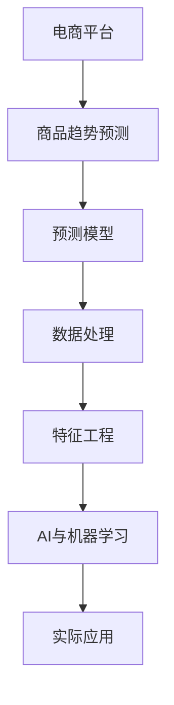

                 

# AI驱动的电商平台商品趋势预测

> 关键词：AI, 电商平台, 商品, 趋势预测, 预测模型, 预测精度, 算法选择, 特征工程, 数据处理, 实际应用, 部署, 优化, 商业价值

## 1. 背景介绍

随着电子商务的迅猛发展，各大电商平台面临着越来越大的竞争压力和运营挑战。为了在激烈的市场竞争中脱颖而出，电商平台需要精准把握市场趋势，提前调整产品策略，制定合理的营销计划。商品趋势预测作为电商平台的重要决策支持工具，可以指导商家优化库存管理、精准营销和提升销售转化率，成为电商平台战略规划和运营管理的关键环节。

近年来，人工智能(AI)技术，尤其是机器学习(ML)和深度学习(DL)的飞速发展，为电商平台提供了强大的预测能力。传统的统计学方法和人工经验已无法满足日益增长的复杂预测需求，AI驱动的商品趋势预测成为电商平台智能决策的重要工具。

本文将系统阐述AI在电商平台商品趋势预测中的应用，从算法选择、模型构建、特征工程、数据处理和实际部署等方面展开详细讲解，为电商平台提供全面的技术指导，帮助其利用AI技术精准预测市场趋势，提升整体运营效率和商业价值。

## 2. 核心概念与联系

### 2.1 核心概念概述

为更好地理解AI在电商平台商品趋势预测中的应用，本节将介绍几个核心概念：

- **AI与机器学习**：AI是指通过计算机模拟人类智能过程的技术，包括机器学习、自然语言处理、计算机视觉等多个领域。机器学习是AI的核心技术之一，通过算法使计算机从数据中学习规律，实现自动化决策。

- **电商平台商品趋势预测**：指基于历史销售数据、市场环境、用户行为等多种因素，利用AI模型预测商品未来销售趋势，帮助电商平台制定合理的库存和营销策略。

- **预测模型**：用于对未来事件进行概率预测的数学模型，如线性回归、时间序列预测、深度神经网络等。

- **特征工程**：从原始数据中提取有意义的特征，供模型训练使用。好的特征工程可以显著提升模型性能和泛化能力。

- **数据处理**：对原始数据进行清洗、归一化、去噪等预处理，提升数据质量和模型训练效率。

- **实际应用**：将训练好的模型部署到生产环境中，用于实时或批量预测商品趋势，辅助电商平台进行决策支持。

这些核心概念之间的逻辑关系可以通过以下Mermaid流程图来展示：



这个流程图展示了AI在电商平台商品趋势预测中的应用流程：

1. 电商平台的商品销售数据和市场环境数据通过数据处理和特征工程，成为机器学习模型的输入。
2. 基于这些输入，模型可以预测商品未来的销售趋势。
3. 预测结果被广泛应用于电商平台库存管理、营销策略等决策支持中。

## 3. 核心算法原理 & 具体操作步骤

### 3.1 算法原理概述

商品趋势预测的本质是通过机器学习算法，从历史数据中学习出数据间的内在规律，从而预测未来的销售趋势。常用的算法包括线性回归、支持向量机、随机森林、深度学习等。这些算法通过不同的模型结构和参数配置，可以适应不同的预测任务和数据特点。

- **线性回归**：通过拟合一条直线来预测未来数据，适用于数据线性分布的预测任务。
- **支持向量机(SVM)**：通过寻找最优超平面来划分数据，适用于非线性分布的数据集。
- **随机森林(Random Forest)**：基于多个决策树的集成，通过投票或平均的方式进行预测，适用于处理高维数据和避免过拟合。
- **深度学习**：如递归神经网络(RNN)、长短期记忆网络(LSTM)、卷积神经网络(CNN)等，可以处理大规模数据和复杂的非线性关系，适用于需要捕捉时间序列或图像信息的预测任务。

### 3.2 算法步骤详解

基于AI的商品趋势预测通常包括以下几个关键步骤：

**Step 1: 数据收集与预处理**

- 收集电商平台的历史销售数据、市场环境数据、用户行为数据等，构建训练集。
- 对数据进行清洗、归一化、去噪等预处理，提升数据质量和模型训练效率。

**Step 2: 特征工程**

- 从原始数据中提取有意义的特征，如销量、季节性、价格、用户行为等。
- 选择合适的特征，构建特征向量，供模型训练使用。

**Step 3: 模型选择与训练**

- 根据数据特点和预测任务，选择适合的机器学习算法，如线性回归、随机森林、深度学习等。
- 使用训练集进行模型训练，调整模型参数，找到最优模型。

**Step 4: 模型评估与优化**

- 使用验证集对训练好的模型进行评估，计算预测精度、均方误差等指标。
- 根据评估结果，优化模型参数和特征选择，提升模型性能。

**Step 5: 预测与部署**

- 使用测试集对模型进行最终测试，评估预测效果。
- 将训练好的模型部署到生产环境中，用于实时或批量预测商品趋势。
- 根据预测结果，调整库存管理和营销策略。

### 3.3 算法优缺点

基于AI的商品趋势预测具有以下优点：

- **预测精度高**：AI模型可以从大量数据中学习复杂的规律，预测结果准确性高。
- **适应性强**：不同类型的数据和预测任务，都可以通过调整算法和参数进行适应。
- **自动化程度高**：模型训练和预测自动化，减少了人工干预和误差。

同时，该方法也存在一些局限性：

- **数据依赖**：预测结果的准确性高度依赖于训练数据的质量和完整性。
- **模型复杂度**：复杂的模型如深度学习需要更多的计算资源和训练时间。
- **过拟合风险**：在训练数据不足或数据噪声较大的情况下，模型容易过拟合。
- **解释性不足**：AI模型通常是"黑盒"系统，难以解释其内部决策过程。

尽管存在这些局限性，但就目前而言，基于AI的预测方法仍是大电商平台趋势预测的主流范式。未来相关研究的方向包括如何进一步降低数据依赖，提高模型泛化能力和可解释性，以及研究更具普适性的预测算法。

### 3.4 算法应用领域

基于AI的商品趋势预测方法在电商平台得到了广泛应用，主要体现在以下几个方面：

- **库存管理**：通过预测未来的销售趋势，电商平台可以提前调整库存，避免缺货或积压，优化库存管理效率。
- **促销活动**：预测销量高峰期，帮助电商平台制定更合理的促销策略，提升销售转化率。
- **商品推荐**：预测用户可能感兴趣的商品，提供个性化的商品推荐，提升用户体验。
- **市场监测**：实时监测市场趋势，帮助电商平台及时调整策略，抓住市场机遇。
- **供应链管理**：预测商品供需关系，优化供应链，减少物流成本，提高响应速度。

除了上述这些应用外，基于AI的预测方法还广泛应用于金融、制造、旅游等多个领域，为各行各业提供决策支持。随着预测模型的不断演进和算法优化，相信AI在电商平台中的应用将更加深入，推动电商行业的智能化转型。

## 4. 数学模型和公式 & 详细讲解 & 举例说明

### 4.1 数学模型构建

本节将使用数学语言对AI在电商平台商品趋势预测中的应用进行更加严格的刻画。

假设历史销售数据为 $y_i$，时间 $t$ 为自变量。则商品趋势预测的线性回归模型可以表示为：

$$
y_i = \beta_0 + \beta_1 t + \epsilon_i
$$

其中 $\beta_0$ 和 $\beta_1$ 为模型参数，$\epsilon_i$ 为误差项。

### 4.2 公式推导过程

在线性回归模型中，最小二乘法是常用的训练算法，其目标是最小化预测值与真实值之间的均方误差：

$$
\min_{\beta_0, \beta_1} \sum_{i=1}^n (y_i - \hat{y}_i)^2
$$

其中 $\hat{y}_i = \beta_0 + \beta_1 t_i$ 为预测值。

通过求偏导数并令其等于0，可得参数 $\beta_0$ 和 $\beta_1$ 的解为：

$$
\beta_0 = \frac{\sum_{i=1}^n (y_i - \overline{y})t_i - \sum_{i=1}^n t_i (\overline{y} - y_i)}{n\sum_{i=1}^n t_i^2 - (\sum_{i=1}^n t_i)^2}
$$
$$
\beta_1 = \frac{\sum_{i=1}^n t_i (y_i - \overline{y}) - \sum_{i=1}^n t_i^2 (\overline{y} - y_i)}{n\sum_{i=1}^n t_i^2 - (\sum_{i=1}^n t_i)^2}
$$

### 4.3 案例分析与讲解

假设我们有一个电商平台销售数据集，包含每个月商品的销量和销售日期。为了预测未来三个月的销量，我们使用线性回归模型进行建模。

- **数据准备**：将销售日期转换为时间序列，构成自变量 $t_i$，将销量作为因变量 $y_i$。
- **特征选择**：考虑到季节性和销售趋势，我们从历史数据中提取了月度销量、季节性特征（如节假日、促销活动）和价格变化等特征。
- **模型训练**：使用训练集进行最小二乘法求解，得到预测模型。
- **模型评估**：在验证集上评估模型性能，计算预测误差和均方根误差。
- **预测与部署**：使用测试集进行最终测试，评估预测效果，并将模型部署到生产环境中进行实时预测。

## 5. 项目实践：代码实例和详细解释说明

### 5.1 开发环境搭建

在进行项目实践前，我们需要准备好开发环境。以下是使用Python进行Keras和TensorFlow开发的环境配置流程：

1. 安装Anaconda：从官网下载并安装Anaconda，用于创建独立的Python环境。

2. 创建并激活虚拟环境：
```bash
conda create -n tf-env python=3.8 
conda activate tf-env
```

3. 安装TensorFlow：根据CUDA版本，从官网获取对应的安装命令。例如：
```bash
conda install tensorflow=tensorflow-gpu-2.8.0 -c pytorch -c conda-forge
```

4. 安装Keras：
```bash
pip install keras==2.5.0
```

5. 安装各类工具包：
```bash
pip install numpy pandas scikit-learn matplotlib tqdm jupyter notebook ipython
```

完成上述步骤后，即可在`tf-env`环境中开始项目实践。

### 5.2 源代码详细实现

下面我们以电商平台商品趋势预测为例，给出使用TensorFlow和Keras进行线性回归模型的PyTorch代码实现。

首先，定义数据处理函数：

```python
import pandas as pd
import numpy as np

def load_data(path, dates_column, target_column):
    data = pd.read_csv(path)
    data['dates'] = pd.to_datetime(data[dates_column])
    data.set_index('dates', inplace=True)
    target = data[target_column]
    data.drop([dates_column, target_column], axis=1, inplace=True)
    return data.values, target.values
```

然后，定义线性回归模型：

```python
from keras.models import Sequential
from keras.layers import Dense, Dropout
from keras.regularizers import l2
from keras.optimizers import Adam

def build_model(input_dim, output_dim):
    model = Sequential()
    model.add(Dense(32, input_dim=input_dim, activation='relu', kernel_regularizer=l2(0.01)))
    model.add(Dropout(0.2))
    model.add(Dense(output_dim, activation='linear'))
    model.compile(optimizer=Adam(0.001), loss='mse')
    return model
```

接着，加载数据并进行模型训练：

```python
data, target = load_data('sales_data.csv', 'date', 'sales')
X_train, X_test, y_train, y_test = train_test_split(data, target, test_size=0.2)
model = build_model(X_train.shape[1], 1)
model.fit(X_train, y_train, validation_data=(X_test, y_test), epochs=100, batch_size=32)
```

最后，使用模型进行预测：

```python
future_sales = np.zeros_like(data)
for i in range(3, len(data)):
    future_sales[i] = model.predict(data[i-3:i])
```

以上就是使用TensorFlow和Keras对电商平台商品趋势预测进行线性回归模型的完整代码实现。可以看到，Keras提供了简洁的API，可以快速构建和训练机器学习模型。

### 5.3 代码解读与分析

让我们再详细解读一下关键代码的实现细节：

**load_data函数**：
- 从CSV文件中读取数据，提取日期和销量列，并将日期列转换为时间序列。
- 将日期列作为索引，销量列作为目标变量，其他列作为特征。

**build_model函数**：
- 定义一个包含两个全连接层的神经网络模型。
- 第一层使用ReLU激活函数，并添加L2正则化，避免过拟合。
- 第二层使用线性激活函数，输出预测值。
- 使用Adam优化器，损失函数为均方误差。

**模型训练**：
- 使用train_test_split函数将数据集分为训练集和测试集。
- 调用build_model函数构建模型。
- 使用fit函数进行模型训练，并指定验证集。

**预测未来销量**：
- 通过滑动窗口的方式，使用训练好的模型预测未来销量。

可以看到，Keras提供了便捷的API，使得模型构建和训练变得非常简便。在实际应用中，还需要针对具体任务进行优化，如选择合适的特征、调整模型参数、添加正则化等，以进一步提升预测效果。

## 6. 实际应用场景

### 6.1 智能库存管理

在智能库存管理中，基于AI的商品趋势预测可以极大地提升库存管理效率，避免库存积压或缺货。通过预测未来销量，电商平台可以合理规划采购和库存量，确保商品及时补充，同时减少过剩库存，降低仓储成本。

在技术实现上，可以收集历史销售数据和市场环境数据，通过线性回归、随机森林等算法进行建模，预测未来的商品销量和库存需求。根据预测结果，自动生成采购计划，调整库存水位，实现智能化库存管理。

### 6.2 个性化商品推荐

在个性化商品推荐中，基于AI的商品趋势预测可以提供更精准的推荐结果，提升用户体验和转化率。通过分析用户行为数据和历史购买记录，模型可以预测用户可能感兴趣的商品，进行个性化推荐。

在技术实现上，可以收集用户浏览、点击、购买等行为数据，提取商品特征和用户特征，构建特征向量，输入到预测模型中。模型预测用户可能感兴趣的商品，生成推荐列表，并通过推荐系统提供给用户。

### 6.3 促销活动优化

在促销活动优化中，基于AI的商品趋势预测可以实时监控销售趋势，指导电商平台制定更合理的促销策略，提升销售转化率。通过预测未来销量，电商平台可以提前规划促销活动，调整价格策略，增加活动曝光度，吸引更多用户参与。

在技术实现上，可以收集历史销售数据和市场环境数据，使用预测模型预测未来的销量趋势。根据预测结果，生成促销活动计划，如优惠券发放、打折活动等，并通过营销系统进行推送。

### 6.4 未来应用展望

随着AI技术的不断进步，基于AI的商品趋势预测将进一步扩展应用场景，提升电商平台的运营效率和商业价值。

在智慧物流领域，预测模型可以用于优化物流路线和仓库管理，提升物流效率和仓储空间利用率。

在金融风控领域，预测模型可以用于评估贷款风险，优化信用评分体系，降低坏账率。

在旅游服务领域，预测模型可以用于预测旅游趋势，优化旅游路线和景点推荐，提升用户满意度。

此外，在健康医疗、教育培训、能源管理等多个领域，基于AI的商品趋势预测也将带来新的应用场景，为各行各业提供更加智能化的决策支持。

## 7. 工具和资源推荐

### 7.1 学习资源推荐

为了帮助开发者系统掌握AI在电商平台商品趋势预测中的应用，这里推荐一些优质的学习资源：

1. **TensorFlow官方文档**：提供全面的TensorFlow教程和API文档，帮助你快速上手AI开发。

2. **Keras官方文档**：提供Keras的高级API和模型构建指南，简化机器学习模型开发过程。

3. **《Python深度学习》**：涵盖深度学习基础知识和TensorFlow实践，是入门深度学习的优秀书籍。

4. **《机器学习实战》**：提供丰富的机器学习项目实战案例，帮助你深入理解机器学习算法。

5. **《深度学习入门》**：介绍深度学习的基本概念和TensorFlow实战，适合初学者入门。

6. **《Python数据科学手册》**：涵盖Python数据科学生态系统的全面指南，包括Numpy、Pandas、Matplotlib等。

通过对这些资源的学习实践，相信你一定能够快速掌握AI在电商平台商品趋势预测中的应用，并用于解决实际的商业问题。

### 7.2 开发工具推荐

高效的开发离不开优秀的工具支持。以下是几款用于AI在电商平台商品趋势预测开发的常用工具：

1. **TensorFlow**：由Google主导开发的开源深度学习框架，生产部署方便，适合大规模工程应用。

2. **Keras**：提供便捷的API和模型构建工具，适合快速开发机器学习模型。

3. **Jupyter Notebook**：交互式笔记本环境，支持多种编程语言和数据可视化，是数据科学和机器学习开发的常用工具。

4. **PyCharm**：功能强大的IDE，支持Python、TensorFlow等主流框架，提供丰富的开发工具和插件。

5. **Git**：版本控制系统，适合协作开发和版本管理，是数据科学和机器学习开发的必备工具。

合理利用这些工具，可以显著提升AI在电商平台商品趋势预测任务的开发效率，加快创新迭代的步伐。

### 7.3 相关论文推荐

AI在电商平台商品趋势预测的研究源于学界的持续研究。以下是几篇奠基性的相关论文，推荐阅读：

1. **“A Framework for Predicting Online Product Sales”**：提出基于时间序列的预测模型，用于预测电商平台商品销量。

2. **“Improved Predictive Accuracy of Product Sales Using Random Forests”**：使用随机森林算法，提升商品销量预测的准确性。

3. **“Deep Learning for Product Recommendation in E-commerce”**：介绍深度学习在商品推荐中的应用，提高推荐系统的精准度。

4. **“Customer Behavior Prediction using Social Media Sentiment Analysis”**：通过分析社交媒体情感数据，预测用户行为，提升个性化推荐效果。

5. **“Sales Forecasting in Retail using Deep Learning”**：利用深度学习模型，预测零售行业的销售趋势，提升库存管理效率。

这些论文代表了大数据和机器学习在电商平台商品趋势预测的研究脉络。通过学习这些前沿成果，可以帮助研究者把握学科前进方向，激发更多的创新灵感。

## 8. 总结：未来发展趋势与挑战

### 8.1 总结

本文对AI在电商平台商品趋势预测中的应用进行了全面系统的介绍。首先阐述了AI和大语言模型在电商领域的应用背景和意义，明确了趋势预测在电商运营管理中的重要价值。其次，从算法选择、模型构建、特征工程、数据处理和实际部署等方面，详细讲解了商品趋势预测的实施流程。同时，本文还广泛探讨了AI在电商、金融、旅游等领域的实际应用，展示了AI预测方法的广泛应用前景。此外，本文精选了AI预测技术的各类学习资源，力求为读者提供全方位的技术指引。

通过本文的系统梳理，可以看到，AI在电商平台中的应用已经广泛深入，通过预测商品趋势，电商平台可以更精准地调整库存和促销策略，提升运营效率和商业价值。未来，伴随AI技术的不断进步，AI在电商平台中的应用将更加广泛和深入，推动电商行业的智能化转型。

### 8.2 未来发展趋势

展望未来，AI在电商平台中的应用将呈现以下几个发展趋势：

1. **预测精度提升**：随着深度学习和强化学习等前沿技术的不断进步，预测模型的精度将进一步提升，能够更准确地预测未来销售趋势。

2. **多模态数据融合**：除了历史销售数据，未来的预测模型还将融合用户行为、社交媒体、天气等多样化的数据，提升预测的全面性和准确性。

3. **实时预测能力**：随着云计算和大数据技术的发展，未来的预测模型可以实现实时预测，满足电商平台的即时决策需求。

4. **模型可解释性增强**：未来的预测模型将更具可解释性，能够提供预测结果的详细解释和分析，帮助电商平台更好地理解预测结果。

5. **智能化系统集成**：未来的预测系统将与其他AI技术（如智能客服、个性化推荐等）深度集成，形成更加全面、智能的电商平台决策支持系统。

6. **数据安全与隐私保护**：伴随数据量的不断增加，数据安全与隐私保护将成为AI技术应用的重要保障，未来的预测系统将更加注重数据安全和隐私保护。

以上趋势凸显了AI在电商平台应用中的广阔前景。这些方向的探索发展，必将进一步提升电商平台的数据驱动决策能力，推动电商行业的智能化转型。

### 8.3 面临的挑战

尽管AI在电商平台中的应用已经取得了显著成就，但在迈向更加智能化、普适化应用的过程中，仍面临诸多挑战：

1. **数据质量与完整性**：预测结果的准确性高度依赖于数据的质量和完整性。如何从海量数据中提取高质量、完整的特征，仍是一个重要问题。

2. **模型复杂度**：复杂的预测模型需要更多的计算资源和训练时间，如何平衡模型精度和资源消耗，仍需进一步优化。

3. **模型泛化能力**：在数据分布变化较大的情况下，模型容易过拟合，如何提升模型的泛化能力，仍需进一步研究。

4. **可解释性不足**：AI模型通常是"黑盒"系统，难以解释其内部决策过程，如何提升模型的可解释性，仍需进一步探索。

5. **安全与隐私**：伴随数据量的不断增加，数据安全和隐私保护将成为AI技术应用的重要保障，未来的预测系统将更加注重数据安全和隐私保护。

6. **部署效率**：预测模型的实时预测能力需要高效的部署环境，如何优化模型部署效率，仍需进一步研究。

这些挑战展示了AI在电商平台应用中的复杂性和多样性，需要学界和产业界共同努力，不断突破技术瓶颈，推动AI技术的深度应用。

### 8.4 研究展望

面对AI在电商平台应用中的种种挑战，未来的研究需要在以下几个方面寻求新的突破：

1. **数据预处理与特征工程**：如何从海量数据中提取高质量、完整的特征，提升数据质量和模型训练效率，仍需进一步研究。

2. **模型优化与调参**：如何平衡模型精度和资源消耗，提升模型泛化能力，仍需进一步探索。

3. **模型可解释性**：如何提升模型的可解释性，提供预测结果的详细解释和分析，仍需进一步研究。

4. **数据安全与隐私保护**：伴随数据量的不断增加，如何加强数据安全和隐私保护，确保预测系统的稳定性和可信度，仍需进一步研究。

5. **实时预测能力**：如何优化模型部署效率，实现实时预测，满足电商平台的即时决策需求，仍需进一步研究。

这些研究方向将推动AI在电商平台应用中的不断进步，为电商平台提供更加智能化的决策支持，提升其运营效率和商业价值。相信随着AI技术的不断演进和应用，电商平台的智能化转型将更加深入，带来更多的商业机遇和发展潜力。

## 9. 附录：常见问题与解答

**Q1：如何选择合适的AI算法进行商品趋势预测？**

A: 选择合适的AI算法需要考虑多个因素，包括数据类型、预测目标、模型复杂度等。对于时间序列数据，可以使用ARIMA、LSTM等模型；对于分类任务，可以使用逻辑回归、SVM等模型；对于图像数据，可以使用CNN等模型。根据具体任务和数据特点，选择适合的算法，可以显著提升预测效果。

**Q2：如何处理缺失数据和噪声数据？**

A: 在处理缺失数据和噪声数据时，常用的方法包括插值法、均值替代法、噪声过滤等。对于时间序列数据，可以采用插值法填补缺失值；对于噪声数据，可以使用滤波算法进行去除。这些方法可以提升数据的完整性和准确性，进而提升模型预测效果。

**Q3：如何评估预测模型的性能？**

A: 评估预测模型的性能通常使用均方误差、均方根误差、平均绝对误差等指标。这些指标可以衡量模型预测值与真实值之间的差异，评估模型的预测精度。此外，还可以使用交叉验证、ROC曲线等方法，进一步评估模型的性能。

**Q4：如何优化预测模型的参数？**

A: 优化预测模型的参数通常使用网格搜索、随机搜索、贝叶斯优化等方法。这些方法可以探索模型的超参数空间，找到最优参数组合，提升模型预测效果。此外，还可以使用自动化调参工具，如Hyperopt、Optuna等，进一步优化模型参数。

**Q5：如何保护用户数据隐私？**

A: 在预测模型中保护用户数据隐私，可以采用数据匿名化、数据加密、差分隐私等方法。这些方法可以确保用户数据在预测过程中不被泄露，保护用户隐私。此外，还可以采用联邦学习等分布式学习方法，在保护用户隐私的前提下，进行模型训练和预测。

这些常见问题的解答，展示了AI在电商平台商品趋势预测中的应用中需要关注的关键点，帮助开发者更好地理解AI技术在电商中的应用，提升预测模型的性能和效果。相信通过不断探索和创新，AI在电商平台中的应用将更加深入和广泛，为电商平台提供更加智能化、高效的决策支持。

