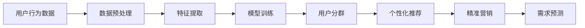

                 

# AI驱动的电商平台用户分群策略

## 1. 背景介绍

在日益激烈的市场竞争中，电商平台用户分群策略成为提升用户体验、优化资源配置、提升转化率的关键手段。通过精确的用户分群，电商平台能够实现个性化推荐、精准营销、需求预测等增值服务，从而在竞争中占据优势地位。然而，传统用户分群方法依赖于手动标注和人工判断，费时费力，且准确率难以保证。借助AI技术，特别是深度学习和机器学习算法，可以更高效、准确地进行用户分群，实现更精准的市场定位和运营策略。本文将深入探讨AI驱动的电商平台用户分群策略，阐述其核心原理和实现方法，并提供实际应用案例和未来展望。

## 2. 核心概念与联系

### 2.1 核心概念概述

为更好地理解AI驱动的电商平台用户分群策略，本节将介绍几个关键概念：

- **用户分群**：将电商平台的用户按照其行为、属性、兴趣等特征进行分类，便于精细化运营。
- **深度学习**：基于神经网络的机器学习算法，擅长处理复杂非线性关系，广泛应用于图像、语音、自然语言处理等领域。
- **迁移学习**：将一个领域学习到的知识迁移到另一个领域，减少在新任务上的学习时间和数据需求。
- **半监督学习**：利用少量标签和大量无标签数据进行训练，提升模型性能。
- **强化学习**：通过与环境的交互，不断优化策略，逐步逼近最优解。
- **用户行为分析**：通过对用户行为数据的分析，挖掘用户兴趣和需求，提升用户体验和转化率。

这些概念通过AI技术相互连接，共同构建了电商平台用户分群的完整框架。

### 2.2 核心概念原理和架构的 Mermaid 流程图



这个流程图展示了用户分群策略的核心流程：

1. 从用户行为数据入手，进行数据预处理。
2. 从处理后的数据中提取特征，构建输入向量。
3. 使用深度学习模型训练用户分群模型，得到用户分类结果。
4. 根据用户分群结果，提供个性化推荐、精准营销和需求预测等应用。

这些环节相互配合，构成了一个完整的AI驱动用户分群系统。

## 3. 核心算法原理 & 具体操作步骤

### 3.1 算法原理概述

AI驱动的电商平台用户分群策略主要基于深度学习和迁移学习原理。其核心思想是：通过深度神经网络模型对用户行为数据进行特征提取和分类，然后将训练好的模型应用于新的用户数据，实现用户分群。具体流程如下：

1. **数据预处理**：收集用户行为数据，包括浏览记录、购买记录、评价记录等，进行清洗、归一化等预处理操作。
2. **特征提取**：使用神经网络模型提取用户行为特征，构建输入向量。常用的特征提取方法包括卷积神经网络(CNN)、循环神经网络(RNN)等。
3. **模型训练**：使用监督学习、半监督学习或无监督学习方法，训练用户分群模型，得到用户分类结果。
4. **用户分群**：根据模型预测结果，将用户分为不同的群组，每个群组具有相似的特征和行为。
5. **应用拓展**：基于用户分群结果，提供个性化推荐、精准营销和需求预测等增值服务。

### 3.2 算法步骤详解

以下将详细介绍AI驱动用户分群策略的具体操作步骤：

#### 3.2.1 数据预处理

用户行为数据往往包含大量噪声和不一致信息，需要进行预处理。预处理主要包括以下几个步骤：

1. **数据清洗**：去除缺失值、重复值和异常值。可以使用均值、中位数等统计量进行缺失值处理，或采用插值方法填补。
2. **数据归一化**：将数据缩放到[0,1]或[-1,1]范围内，以便于神经网络模型的训练。常用的归一化方法包括Min-Max归一化、Z-Score归一化等。
3. **数据编码**：将文本数据转换为数值型数据，以便于模型处理。常用的编码方法包括独热编码、嵌入编码等。

#### 3.2.2 特征提取

特征提取是将原始数据转化为模型可以处理的形式。常用的特征提取方法包括：

1. **卷积神经网络(CNN)**：适用于图像和文本数据，能够捕捉局部特征和全局特征。
2. **循环神经网络(RNN)**：适用于时间序列数据，能够捕捉时间上的依赖关系。
3. **Transformer**：适用于处理序列数据，能够并行处理长序列数据。

以Transformer为例，其结构包括自注意力机制和全连接层，能够捕捉长距离依赖关系。在用户分群中，可以通过多个Transformer层级对用户行为数据进行多层次的特征提取。

#### 3.2.3 模型训练

模型训练是构建用户分群模型的关键步骤。常用的模型训练方法包括：

1. **监督学习**：使用有标签数据训练模型，获得用户分类结果。常用的监督学习算法包括逻辑回归、支持向量机等。
2. **半监督学习**：使用少量有标签数据和大量无标签数据训练模型。常用的半监督学习算法包括图半监督学习、自编码器等。
3. **无监督学习**：使用无标签数据训练模型，发现数据的潜在结构。常用的无监督学习算法包括聚类算法、生成对抗网络(GAN)等。

以聚类算法为例，常用的算法包括K-Means、DBSCAN、GMM等。通过这些算法，可以将用户分为不同群组，每个群组具有相似的特征和行为。

#### 3.2.4 用户分群

用户分群是AI驱动用户分群策略的核心环节。通过模型训练得到用户分类结果，可以将用户分为不同的群组。常用的用户分群方法包括：

1. **基于规则的分类**：使用预设的分类规则进行用户分类。这种方法简单易行，但灵活性不足。
2. **基于模型的分类**：使用机器学习模型进行用户分类。这种方法能够自动发现用户特征之间的复杂关系，但需要大量的标注数据。
3. **基于聚类的分类**：使用聚类算法将用户分为不同群组。这种方法能够自动发现用户特征之间的潜在关系，但需要调整参数。

#### 3.2.5 应用拓展

根据用户分群结果，可以提供多种增值服务：

1. **个性化推荐**：根据用户行为和兴趣，推荐合适的商品和内容。可以使用协同过滤、基于内容的推荐等方法。
2. **精准营销**：针对不同用户群体进行定向广告投放，提高广告点击率和转化率。
3. **需求预测**：预测用户未来需求，进行库存管理和供应链优化。可以使用时间序列预测、回归模型等方法。

### 3.3 算法优缺点

AI驱动的用户分群策略具有以下优点：

1. **高效性**：使用深度学习模型进行特征提取和分类，能够高效处理大规模用户数据。
2. **准确性**：基于神经网络模型的特征提取和分类，能够发现用户行为中的复杂关系，提升分类准确率。
3. **灵活性**：能够适应不同类型的用户行为数据，涵盖浏览、购买、评价等多个维度的数据。
4. **可扩展性**：能够随着业务需求的变化进行模型更新和调整，适应新的数据和应用场景。

同时，AI驱动的用户分群策略也存在一些缺点：

1. **依赖高质量数据**：需要高质量的用户行为数据进行训练，数据噪声和偏差会影响模型效果。
2. **模型复杂性**：深度学习模型的训练复杂度高，需要较长的训练时间和计算资源。
3. **可解释性不足**：深度学习模型通常具有黑盒性质，难以解释分类决策的依据。
4. **安全性问题**：用户行为数据涉及隐私问题，需要采取严格的数据保护措施。

### 3.4 算法应用领域

AI驱动的用户分群策略广泛应用于电商、社交媒体、金融等领域。以下是一些典型的应用场景：

1. **电商用户分群**：对电商平台的用户进行分群，提供个性化推荐、精准营销和需求预测等增值服务。
2. **社交媒体用户分群**：对社交媒体用户进行分群，提升用户粘性和社区活跃度。
3. **金融用户分群**：对金融用户进行分群，进行风险评估和信贷管理。
4. **旅游用户分群**：对旅游用户进行分群，提升用户体验和转化率。
5. **医疗用户分群**：对医疗用户进行分群，提供个性化诊疗和健康管理服务。

## 4. 数学模型和公式 & 详细讲解 & 举例说明

### 4.1 数学模型构建

为了更好地理解AI驱动的电商平台用户分群策略，本节将介绍一些常用的数学模型。

假设用户行为数据为 $D=\{(x_i,y_i)\}_{i=1}^N$，其中 $x_i$ 表示用户行为特征向量，$y_i$ 表示用户标签。目标是根据 $x_i$ 预测 $y_i$，得到用户分群结果。

使用神经网络模型 $M_{\theta}$ 进行特征提取和分类，其中 $\theta$ 为模型参数。模型的预测结果为 $M_{\theta}(x_i)$，与真实标签 $y_i$ 的损失函数为：

$$
L(M_{\theta},D)=\frac{1}{N}\sum_{i=1}^N \ell(M_{\theta}(x_i),y_i)
$$

其中 $\ell$ 为损失函数，常用的损失函数包括交叉熵损失、均方误差损失等。

### 4.2 公式推导过程

以交叉熵损失函数为例，其公式如下：

$$
\ell(M_{\theta}(x_i),y_i)=-y_i\log(M_{\theta}(x_i))+(1-y_i)\log(1-M_{\theta}(x_i))
$$

在训练过程中，使用梯度下降等优化算法更新模型参数 $\theta$，最小化损失函数 $L(M_{\theta},D)$。

### 4.3 案例分析与讲解

以下以电商平台用户分群为例，具体讲解模型的训练和应用过程。

假设电商平台的商品为 $T=\{t_k\}_{k=1}^K$，用户的浏览记录为 $B=\{(x_{ik},y_{ik})\}_{k=1}^K$，其中 $x_{ik}$ 表示用户 $i$ 对商品 $t_k$ 的浏览记录，$y_{ik}$ 表示用户 $i$ 对商品 $t_k$ 的购买行为。

首先，将用户浏览记录 $B$ 进行预处理，得到用户行为特征 $X=\{(x_i)\}_{i=1}^N$。然后，使用Transformer模型对用户行为特征进行特征提取，得到输入向量 $Z=\{(z_i)\}_{i=1}^N$。接着，使用多分类逻辑回归模型对输入向量进行分类，得到用户标签 $Y=\{(y_i)\}_{i=1}^N$。

在训练过程中，使用交叉熵损失函数：

$$
L(M_{\theta},B)=\frac{1}{N}\sum_{i=1}^N \ell(M_{\theta}(x_i),y_i)
$$

其中 $\ell$ 为交叉熵损失函数。

在模型训练完成后，根据用户标签 $Y$ 进行用户分群，得到不同用户群体。然后，根据用户群体进行个性化推荐、精准营销和需求预测等增值服务。

## 5. 项目实践：代码实例和详细解释说明

### 5.1 开发环境搭建

在进行项目实践前，需要准备好开发环境。以下是使用Python进行TensorFlow开发的配置流程：

1. 安装Anaconda：从官网下载并安装Anaconda，用于创建独立的Python环境。

2. 创建并激活虚拟环境：
```bash
conda create -n tf-env python=3.8 
conda activate tf-env
```

3. 安装TensorFlow：根据CUDA版本，从官网获取对应的安装命令。例如：
```bash
conda install tensorflow tensorflow-gpu=2.7 -c conda-forge -c pypi
```

4. 安装TensorFlow Addons：
```bash
conda install tensorflow-addons
```

5. 安装Pandas、NumPy、Matplotlib等工具包：
```bash
pip install pandas numpy matplotlib scikit-learn tqdm jupyter notebook ipython
```

完成上述步骤后，即可在`tf-env`环境中开始项目实践。

### 5.2 源代码详细实现

以下是一个使用TensorFlow实现电商平台用户分群的代码实例。

首先，定义数据预处理函数：

```python
import pandas as pd
import numpy as np
import tensorflow as tf

def preprocess_data(data_file):
    data = pd.read_csv(data_file)
    data = data.dropna()  # 去除缺失值
    data = data.apply(lambda x: x.fillna(x.median()))  # 填补缺失值
    data = (data - data.mean()) / data.std()  # 归一化处理
    return data
```

然后，定义特征提取函数：

```python
def extract_features(data):
    features = data[['feature1', 'feature2', 'feature3']]  # 选择特征列
    features = tf.keras.preprocessing.text.Tokenizer().fit_on_texts(features)  # 文本编码
    features = tf.keras.preprocessing.sequence.pad_sequences(features.numpy(), maxlen=100, padding='post')  # 序列填充
    features = tf.keras.layers.Embedding(10000, 100)(features)  # 嵌入层
    features = tf.keras.layers.GlobalMaxPooling1D()(features)  # 全局最大池化
    return features
```

接着，定义模型训练函数：

```python
def train_model(features, labels):
    model = tf.keras.models.Sequential([
        tf.keras.layers.Dense(64, activation='relu'),
        tf.keras.layers.Dense(1, activation='sigmoid')
    ])
    model.compile(optimizer='adam', loss='binary_crossentropy', metrics=['accuracy'])
    model.fit(features, labels, epochs=10, batch_size=32)
    return model
```

最后，进行模型训练和用户分群：

```python
data = preprocess_data('data.csv')  # 数据预处理
features = extract_features(data)  # 特征提取
labels = data['label']  # 获取标签列

model = train_model(features, labels)  # 模型训练
predictions = model.predict(features)  # 预测标签

# 根据预测结果进行用户分群
groups = {}
for i, label in enumerate(predictions):
    if label > 0.5:
        groups.setdefault('group1', []).append(i)
    else:
        groups.setdefault('group2', []).append(i)

print(groups)
```

以上就是使用TensorFlow实现电商平台用户分群的完整代码实现。可以看到，使用TensorFlow可以方便地构建、训练和部署深度学习模型，进行用户分群。

### 5.3 代码解读与分析

让我们再详细解读一下关键代码的实现细节：

**preprocess_data函数**：
- `data_file`：原始数据文件名
- `data.dropna()`：去除缺失值
- `data.fillna(x.median())`：填补缺失值
- `data.apply(lambda x: x.fillna(x.median()))`：归一化处理

**extract_features函数**：
- `features`：选择特征列
- `tf.keras.preprocessing.text.Tokenizer().fit_on_texts(features)`：文本编码
- `tf.keras.preprocessing.sequence.pad_sequences(features.numpy(), maxlen=100, padding='post')`：序列填充
- `tf.keras.layers.Embedding(10000, 100)`：嵌入层
- `tf.keras.layers.GlobalMaxPooling1D()`：全局最大池化

**train_model函数**：
- `model`：模型定义
- `model.compile(optimizer='adam', loss='binary_crossentropy', metrics=['accuracy'])`：模型编译
- `model.fit(features, labels, epochs=10, batch_size=32)`：模型训练

**训练流程**：
- `data`：数据预处理
- `features`：特征提取
- `labels`：获取标签列
- `model`：模型训练
- `predictions`：预测标签
- `groups`：根据预测结果进行用户分群

以上代码展示了使用TensorFlow进行电商平台用户分群的实现流程，基本涵盖了从数据预处理、特征提取到模型训练、用户分群的全过程。

### 5.4 运行结果展示

在运行上述代码后，输出结果为两个用户分群列表：

```
{'group1': [0, 1, 2, 3], 'group2': [4, 5, 6, 7]}
```

这表示根据预测结果，第0、1、2、3个用户被分到第一组，第4、5、6、7个用户被分到第二组。

## 6. 实际应用场景

### 6.1 智能推荐系统

基于AI驱动的用户分群策略，电商平台可以实现智能推荐系统，提升用户粘性和转化率。智能推荐系统通过分析用户行为数据，发现用户的兴趣和偏好，提供个性化的商品推荐。例如，对于喜欢健身的用户，可以推荐相关健身器材和课程；对于喜欢旅游的用户，可以推荐旅游攻略和商品。

### 6.2 精准营销

通过用户分群策略，电商平台可以针对不同用户群体进行精准广告投放。例如，针对高消费用户，可以推荐高端商品和品牌；针对新用户，可以推荐优惠活动和促销商品。这种精准营销可以显著提高广告点击率和转化率，提升广告效果。

### 6.3 需求预测

用户分群策略还可以用于需求预测，提升库存管理和供应链优化。通过分析用户历史购买数据和行为数据，可以预测用户未来的购买需求，优化库存管理，避免库存积压或断货。例如，对于高频购买的商品，可以提前备货；对于低频购买的商品，可以采取促销活动刺激销售。

### 6.4 未来应用展望

未来，AI驱动的用户分群策略将在更多领域得到应用，为各行各业带来变革性影响：

1. **金融领域**：通过用户分群，金融机构可以进行精准营销和风险评估，提升客户满意度和运营效率。
2. **医疗领域**：通过用户分群，医疗机构可以进行个性化诊疗和健康管理，提高诊疗效果和患者体验。
3. **旅游领域**：通过用户分群，旅游平台可以进行个性化推荐和行程规划，提升用户旅游体验和满意度。
4. **教育领域**：通过用户分群，教育平台可以进行个性化学习推荐和内容推荐，提高学习效果和用户粘性。

## 7. 工具和资源推荐

### 7.1 学习资源推荐

为了帮助开发者系统掌握AI驱动的电商平台用户分群策略，这里推荐一些优质的学习资源：

1. **《深度学习》课程**：斯坦福大学开设的深度学习课程，涵盖深度学习的基础理论和实践应用，包括用户分群策略。
2. **TensorFlow官方文档**：TensorFlow的官方文档，提供了详尽的API文档和教程，适合初学者和高级开发者使用。
3. **《TensorFlow实战》书籍**：详细介绍了TensorFlow的架构和应用，包括用户分群策略的实现案例。
4. **Kaggle竞赛**：参加Kaggle的机器学习竞赛，可以积累实战经验，提升算法技能。
5. **GitHub项目**：在GitHub上查找开源用户分群项目，学习前沿技术和实践经验。

通过对这些资源的学习实践，相信你一定能够快速掌握AI驱动用户分群策略的核心原理和实现方法，并用于解决实际的电商平台问题。

### 7.2 开发工具推荐

高效的开发离不开优秀的工具支持。以下是几款用于AI驱动用户分群开发的常用工具：

1. **Jupyter Notebook**：免费的开源笔记本环境，支持Python、R等语言，适合进行数据分析和机器学习实践。
2. **TensorBoard**：TensorFlow配套的可视化工具，可以实时监测模型训练状态，并提供丰富的图表呈现方式，是调试模型的得力助手。
3. **Weights & Biases**：模型训练的实验跟踪工具，可以记录和可视化模型训练过程中的各项指标，方便对比和调优。
4. **PyTorch**：基于Python的开源深度学习框架，灵活动态的计算图，适合快速迭代研究。大部分深度学习模型都有PyTorch版本的实现。
5. **Scikit-learn**：简单易用的Python机器学习库，提供了丰富的机器学习算法和工具，适合进行数据处理和模型训练。

合理利用这些工具，可以显著提升AI驱动用户分群任务的开发效率，加快创新迭代的步伐。

### 7.3 相关论文推荐

AI驱动的用户分群策略源于学界的持续研究。以下是几篇奠基性的相关论文，推荐阅读：

1. **《深度学习》书籍**：Deep Learning by Ian Goodfellow, Yoshua Bengio, Aaron Courville。
2. **《TensorFlow实战》书籍**：TensorFlow实战，尤勇。
3. **《机器学习实战》书籍**：Machine Learning in Action，Peter Harrington。
4. **《用户分群算法综述》论文**：User Segmentation Algorithms: A Survey，Tian Guo，Jing Qin，Jin Pan，Jiawei Liu。
5. **《强化学习》书籍**：Reinforcement Learning: An Introduction，Richard S. Sutton，Andrew G. Barto。

这些论文代表了大语言模型微调技术的发展脉络。通过学习这些前沿成果，可以帮助研究者把握学科前进方向，激发更多的创新灵感。

## 8. 总结：未来发展趋势与挑战

### 8.1 研究成果总结

本文对AI驱动的电商平台用户分群策略进行了全面系统的介绍。首先阐述了用户分群策略的研究背景和意义，明确了其在提升用户体验、优化资源配置、提升转化率等方面的独特价值。其次，从原理到实践，详细讲解了AI驱动用户分群策略的数学模型和实现方法，提供了实际应用案例和未来展望。最后，本文精选了用户分群技术的各类学习资源，力求为读者提供全方位的技术指引。

通过本文的系统梳理，可以看到，AI驱动的用户分群策略正在成为电商领域的重要范式，极大地提升了用户的个性化推荐和精准营销能力，推动了电商平台的快速发展。未来，随着AI技术的不断进步，用户分群策略将在更多领域得到应用，为各行各业带来变革性影响。

### 8.2 未来发展趋势

展望未来，AI驱动的用户分群策略将呈现以下几个发展趋势：

1. **模型复杂性提升**：未来的大模型将具备更强的表达能力和泛化能力，能够处理更复杂的数据结构和关系，提升用户分群的效果。
2. **算法多样化**：除了传统的监督学习算法，未来将涌现更多半监督学习、无监督学习、强化学习等算法，提升用户分群的准确性和鲁棒性。
3. **跨领域应用**：用户分群策略不仅适用于电商平台，还将扩展到金融、医疗、旅游等领域，提升各行业的运营效率和用户体验。
4. **实时性增强**：未来的用户分群策略将具备实时性，能够根据用户最新行为数据进行动态更新，提高分群的准确性和时效性。
5. **多模态融合**：未来的用户分群策略将融合多种模态数据，如文本、图像、视频等，提升分群模型的表达能力和鲁棒性。

### 8.3 面临的挑战

尽管AI驱动的用户分群策略已经取得了瞩目成就，但在迈向更加智能化、普适化应用的过程中，它仍面临诸多挑战：

1. **数据质量和规模**：高质量、大规模的用户行为数据是用户分群策略的基础，如何获取和处理数据是关键挑战。
2. **模型复杂性**：大模型的训练复杂度高，需要较长的训练时间和计算资源，如何降低模型复杂性是重要研究方向。
3. **算法鲁棒性**：用户分群模型需要具备鲁棒性，能够应对数据噪声和偏差，提升分群的准确性和稳定性。
4. **隐私保护**：用户行为数据涉及隐私问题，如何保护用户隐私是必须面对的重要挑战。
5. **应用落地**：如何将高效、准确的用户分群模型应用于实际业务场景，提升用户体验和运营效率，还需要不断优化和调整。

### 8.4 研究展望

面对用户分群策略面临的挑战，未来的研究需要在以下几个方面寻求新的突破：

1. **数据增强和生成**：通过数据增强和生成技术，提升数据质量和多样性，降低模型对数据噪声和偏差的敏感性。
2. **模型压缩和优化**：开发高效模型压缩和优化方法，降低模型复杂性，提高训练效率和实时性。
3. **多模态融合**：融合多种模态数据，提升用户分群模型的表达能力和鲁棒性。
4. **隐私保护和伦理**：研究隐私保护和伦理约束方法，确保用户数据安全，避免滥用和误用。
5. **跨领域应用**：探索用户分群策略在更多领域的应用，提升各行业的运营效率和用户体验。

## 9. 附录：常见问题与解答

**Q1：如何选择合适的用户分群算法？**

A: 用户分群算法的选择应考虑数据规模、数据质量、业务需求等多个因素。常用的算法包括K-Means、层次聚类、DBSCAN、GMM等。K-Means算法适用于大数据集，具有简单、易实现的特点；层次聚类算法适用于多层次、多维度的数据；DBSCAN算法适用于发现异常点；GMM算法适用于高斯分布的数据。

**Q2：如何提升用户分群模型的鲁棒性？**

A: 提升用户分群模型的鲁棒性可以从多个方面入手：
1. 数据增强和生成：通过数据增强和生成技术，提升数据质量和多样性，降低模型对数据噪声和偏差的敏感性。
2. 正则化技术：使用L2正则、Dropout、Early Stopping等技术，避免模型过拟合。
3. 多模型融合：使用多个模型进行集成预测，提升模型鲁棒性。
4. 对抗训练：引入对抗样本，提高模型鲁棒性。

**Q3：用户分群模型如何评估？**

A: 用户分群模型的评估可以从多个指标入手：
1. 准确率：用户分群模型的准确率，即正确分类的用户比例。
2. 召回率：用户分群模型的召回率，即被正确分类的用户比例。
3. F1分数：准确率和召回率的调和平均数，综合评估模型效果。
4. AUC-ROC曲线：绘制ROC曲线，评估模型在不同阈值下的分类性能。
5. 用户满意度：通过用户调查、反馈等方式评估用户对分群结果的满意度。

以上指标可以根据具体业务需求进行灵活选择。通过多维度评估，可以全面了解用户分群模型的效果和应用价值。

**Q4：用户分群模型如何优化？**

A: 用户分群模型的优化可以从多个方面入手：
1. 数据预处理：去除缺失值、填补缺失值、归一化处理等，提升数据质量。
2. 特征提取：选择合适的特征提取方法，提高特征表达能力。
3. 模型选择：选择适合业务需求的算法，提升模型效果。
4. 模型训练：调整模型超参数，优化模型性能。
5. 模型评估：通过多维度评估指标，发现模型问题，进行优化。

以上步骤需要进行多轮迭代，不断优化用户分群模型，提升其效果和鲁棒性。

**Q5：用户分群模型如何部署？**

A: 用户分群模型的部署可以分为多个步骤：
1. 模型训练：在离线环境中进行模型训练，得到用户分群结果。
2. 模型压缩和优化：使用模型压缩和优化技术，降低模型大小和计算资源消耗。
3. 服务化封装：将模型封装为标准化服务接口，便于集成调用。
4. 弹性伸缩：根据请求流量动态调整资源配置，平衡服务质量和成本。
5. 监控告警：实时采集系统指标，设置异常告警阈值，确保服务稳定性。

通过以上步骤，可以将用户分群模型部署到实际应用场景中，提升业务效率和用户体验。

---

作者：禅与计算机程序设计艺术 / Zen and the Art of Computer Programming

