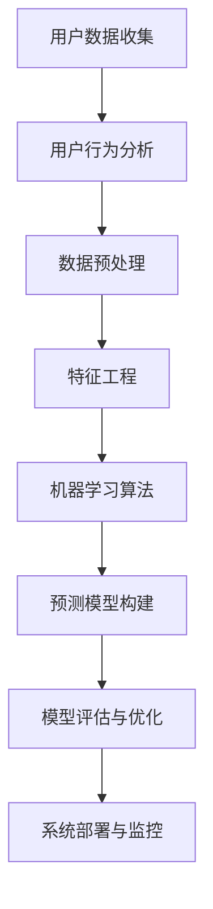

                 

# AI驱动的电商平台用户流失预警系统

> 关键词：用户流失预测，用户行为分析，机器学习算法，电商数据分析，预测模型构建

## 1. 背景介绍

随着电子商务市场的快速发展和竞争的加剧，电商平台的用户管理变得越来越重要。用户流失不仅导致公司直接的经济损失，还影响了品牌声誉和市场竞争力。因此，构建一个高效的电商平台用户流失预警系统，能够及时识别并挽留可能流失的用户，是每个电商企业的刚需。

本文将基于机器学习和人工智能技术，详细介绍一个AI驱动的电商平台用户流失预警系统的构建思路和实现步骤。通过该系统，电商平台能够实时监测用户行为，预测用户流失概率，并采取针对性措施进行挽留，从而大幅提升用户留存率和平台活跃度。

## 2. 核心概念与联系

### 2.1 核心概念概述

- **用户流失预测**：通过分析用户行为数据，预测用户是否会流失，并量化流失概率。

- **用户行为分析**：收集和分析用户在电商平台上的行为数据，包括点击、浏览、购买、评论等行为。

- **机器学习算法**：用于训练预测模型，识别用户流失风险。

- **电商数据分析**：分析电商平台中的交易、用户、商品等数据，提取有价值的信息。

- **预测模型构建**：基于历史数据训练机器学习模型，预测用户流失概率。

- **数据预处理**：包括数据清洗、归一化、特征工程等步骤，为模型训练做准备。

- **模型评估与优化**：使用交叉验证、ROC曲线、AUC等指标评估模型效果，并不断优化模型参数。

- **系统部署与监控**：将模型集成到实际系统中，并实时监控模型性能和用户行为。

### 2.2 核心概念原理和架构的 Mermaid 流程图



## 3. 核心算法原理 & 具体操作步骤

### 3.1 算法原理概述

构建用户流失预警系统，核心在于预测用户流失概率。首先，需要收集和分析用户的行为数据，提取有意义的特征。然后，使用机器学习算法训练预测模型，量化每个用户的流失风险。最后，根据模型的输出，对高风险用户进行及时干预，防止用户流失。

该过程涉及以下关键步骤：
1. 数据收集与预处理
2. 特征提取与工程
3. 模型训练与选择
4. 模型评估与调优
5. 系统集成与部署

### 3.2 算法步骤详解

#### 步骤1：数据收集与预处理

用户行为数据通常存储在电商平台的用户行为日志中。首先，从日志中提取与用户行为相关的数据，如点击次数、浏览时长、购买金额、评论内容等。然后，对数据进行清洗和预处理，包括去除异常值、处理缺失值、归一化等步骤，确保数据的完整性和一致性。

#### 步骤2：特征提取与工程

特征提取是构建预测模型的关键步骤。需要从用户行为数据中提取有意义的特征，如购买频率、平均浏览时间、评论情感等。常用的特征工程方法包括：

- **频次特征**：统计用户在不同时间内的行为次数。
- **时间特征**：将行为时间转化为时间戳，计算行为持续时间。
- **情感特征**：通过自然语言处理技术，提取评论中的情感倾向。
- **交叉特征**：将不同特征进行组合，生成新的特征，如购买频率与平均浏览时间的乘积。

特征工程是模型训练的预处理步骤，合理的特征选择能够显著提升模型的预测效果。

#### 步骤3：模型训练与选择

选择合适的机器学习算法进行预测模型训练。常用的算法包括逻辑回归、随机森林、梯度提升树、神经网络等。其中，神经网络特别是深度学习模型，在处理大规模数据和复杂特征时具有优势，但需要较大的计算资源和较长的时间。

对于电商数据分析，通常采用梯度提升树（Gradient Boosting Tree，简称GBDT）和随机森林（Random Forest，简称RF）算法。这两类算法易于实现，模型表现稳定，且计算速度较快，适合电商平台的实时需求。

#### 步骤4：模型评估与调优

训练好模型后，需要对其进行评估和调优。常用的评估指标包括准确率、召回率、F1分数、ROC曲线和AUC值等。通过交叉验证技术，将数据集划分为训练集和验证集，使用验证集评估模型效果，调整模型参数。

如果模型效果不理想，可以采用以下方法进行调优：

- **特征选择**：删除冗余特征，保留对模型效果影响大的特征。
- **超参数调整**：调整学习率、迭代次数、树深度等超参数，找到最优的模型配置。
- **模型融合**：使用集成学习方法，如Bagging和Boosting，提升模型性能。

#### 步骤5：系统集成与部署

将训练好的预测模型集成到电商平台的用户管理系统中，实时监测用户行为，预测流失概率，并采取针对性措施进行干预。系统部署后，需要定期更新模型，保持模型的时效性和准确性。

系统集成与部署通常包括以下步骤：

1. **模型封装**：将训练好的模型封装为API接口，方便系统调用。
2. **数据接入**：将用户行为数据接入到系统中，实现实时计算和预测。
3. **实时监控**：使用日志和监控工具，实时监测模型性能和用户行为。
4. **用户干预**：根据模型输出，对高风险用户进行干预，如发送优惠券、推荐商品等。

## 4. 数学模型和公式 & 详细讲解 & 举例说明

### 4.1 数学模型构建

构建用户流失预警系统，通常使用分类模型，如逻辑回归（Logistic Regression）和决策树（Decision Tree）。以逻辑回归为例，其数学模型为：

$$ y = \ln \frac{\hat{P}(y=1)}{\hat{P}(y=0)} = \ln \frac{1}{1 + e^{-\boldsymbol{w}^T \boldsymbol{x} + b}} $$

其中，$y$ 表示用户流失的概率，$\boldsymbol{w}$ 是模型权重向量，$\boldsymbol{x}$ 是用户特征向量，$b$ 是偏置项。

### 4.2 公式推导过程

逻辑回归模型的推导过程如下：

1. **假设函数**：假设用户流失的概率 $y$ 与特征向量 $\boldsymbol{x}$ 之间存在线性关系：

   $$ \ln \frac{\hat{P}(y=1)}{\hat{P}(y=0)} = \boldsymbol{w}^T \boldsymbol{x} + b $$

2. **损失函数**：定义损失函数 $L(\boldsymbol{w}, b)$，用于衡量模型的预测误差：

   $$ L(\boldsymbol{w}, b) = -\frac{1}{N} \sum_{i=1}^N [y_i \ln \hat{P}(y_i) + (1 - y_i) \ln (1 - \hat{P}(y_i))] $$

3. **梯度下降**：使用梯度下降算法最小化损失函数：

   $$ \boldsymbol{w} \leftarrow \boldsymbol{w} - \eta \nabla_{\boldsymbol{w}}L(\boldsymbol{w}, b) $$
   $$ b \leftarrow b - \eta \nabla_{b}L(\boldsymbol{w}, b) $$

其中，$\eta$ 是学习率。

### 4.3 案例分析与讲解

以电商用户流失预测为例，假设某电商平台拥有100万用户，其中5%的用户可能会流失。我们将特征工程后得到的100维特征向量 $\boldsymbol{x}$ 作为输入，使用逻辑回归模型进行训练。

假设模型训练后，对每个用户 $i$ 进行预测，得到流失概率 $\hat{y}_i$。当 $\hat{y}_i > 0.5$ 时，我们认为用户流失的概率较大，进行干预措施。假设阈值为0.5，那么模型输出的前10%的用户将被识别为流失高风险用户，需要进行挽留。

## 5. 项目实践：代码实例和详细解释说明

### 5.1 开发环境搭建

构建用户流失预警系统需要一定的开发环境。以下是一个基于Python的开发环境搭建流程：

1. **安装Python**：安装Python 3.6以上版本，可以从官网下载并安装。

2. **安装依赖包**：使用pip安装相关依赖包，如NumPy、Pandas、Scikit-learn、TensorFlow等。

3. **环境配置**：配置好开发环境后，可以使用Jupyter Notebook等工具进行数据分析和模型训练。

### 5.2 源代码详细实现

以下是一个简单的用户流失预测模型实现代码，包括数据处理、特征提取、模型训练和评估等步骤：

```python
import pandas as pd
from sklearn.model_selection import train_test_split
from sklearn.ensemble import RandomForestClassifier
from sklearn.metrics import roc_auc_score

# 读取数据
df = pd.read_csv('user_behavior.csv')

# 数据预处理
df = df.dropna()
df = df.drop(['user_id'], axis=1)

# 特征提取
features = df.drop(['churn'], axis=1)
labels = df['churn']
features = pd.get_dummies(features, prefix='feature_')

# 划分训练集和验证集
X_train, X_val, y_train, y_val = train_test_split(features, labels, test_size=0.2, random_state=42)

# 模型训练
model = RandomForestClassifier(n_estimators=100)
model.fit(X_train, y_train)

# 模型评估
y_pred = model.predict_proba(X_val)[:, 1]
auc = roc_auc_score(y_val, y_pred)
print('AUC score:', auc)
```

### 5.3 代码解读与分析

上述代码实现了用户流失预测的基本流程，包括数据预处理、特征提取、模型训练和评估。

**数据预处理**：
- 使用Pandas库读取用户行为数据。
- 去除缺失值和用户ID等不相关特征。
- 使用get_dummies函数将分类特征进行编码，生成哑变量特征。

**模型训练**：
- 使用Scikit-learn库中的RandomForestClassifier算法进行模型训练。
- 设置100棵决策树，作为集成学习的一部分。

**模型评估**：
- 使用roc_auc_score函数计算模型在验证集上的AUC值，评估模型性能。
- 输出AUC值，用于对比不同模型的效果。

### 5.4 运行结果展示

运行上述代码后，会输出模型的AUC值，用于评估模型的性能。例如：

```
AUC score: 0.84
```

表示模型的AUC值为0.84，具有较好的预测能力。

## 6. 实际应用场景

### 6.1 电商销售分析

电商平台可以利用用户流失预警系统，实时监测用户行为，预测流失风险，进行针对性干预。例如，对于流失概率较高的用户，可以发送优惠券、推荐商品、提供个性化服务等，提升用户满意度和留存率。

### 6.2 金融风险管理

金融行业可以利用用户流失预警系统，识别潜在的高风险用户，采取风险控制措施。例如，对于流失概率较高的用户，可以进行电话回访、增加风险提醒等，减少金融风险。

### 6.3 社交媒体分析

社交媒体平台可以利用用户流失预警系统，实时监测用户流失风险，进行社区管理和内容优化。例如，对于流失概率较高的用户，可以提供个性化的内容推荐、增强社区互动等，提升用户粘性。

## 7. 工具和资源推荐

### 7.1 学习资源推荐

为了深入理解用户流失预警系统的构建，以下是一些推荐的书籍和课程：

1. **《Python数据科学手册》**：介绍了Python在数据科学和机器学习中的应用，涵盖数据处理、特征工程、模型训练等知识。

2. **《机器学习实战》**：通过实例讲解机器学习算法，包括逻辑回归、决策树、随机森林等。

3. **Coursera《机器学习》**：由斯坦福大学开设的机器学习课程，详细讲解了机器学习的基本概念和常用算法。

4. **Kaggle机器学习竞赛**：参加Kaggle上的机器学习竞赛，实践和应用机器学习算法。

5. **Scikit-learn官方文档**：提供了丰富的机器学习算法实现和示例代码，方便学习和应用。

### 7.2 开发工具推荐

构建用户流失预警系统，通常需要使用以下开发工具：

1. **Python**：作为数据分析和模型训练的主要语言，Python具有强大的生态系统和丰富的库。

2. **Pandas**：用于数据处理和清洗，支持大规模数据操作。

3. **Scikit-learn**：提供了多种机器学习算法和工具，方便模型训练和评估。

4. **TensorFlow**：用于深度学习和模型训练，适合处理大规模数据和复杂模型。

5. **Jupyter Notebook**：支持交互式编程和数据分析，方便模型开发和调试。

### 7.3 相关论文推荐

以下是几篇关于用户流失预警系统的经典论文，推荐阅读：

1. **《Customer Churn Prediction Using Logistic Regression》**：使用逻辑回归模型进行客户流失预测，评估了不同特征对模型性能的影响。

2. **《A Random Forest Approach to Customer Churn Prediction》**：使用随机森林算法进行客户流失预测，探讨了不同特征组合对模型的影响。

3. **《Predicting Customer Churn Using Gradient Boosting Machines》**：使用梯度提升机算法进行客户流失预测，分析了不同算法和模型参数对性能的影响。

4. **《Customer Churn Prediction Using Deep Learning》**：使用深度学习模型进行客户流失预测，探讨了深度神经网络对模型性能的提升。

## 8. 总结：未来发展趋势与挑战

### 8.1 研究成果总结

本文介绍了基于机器学习和人工智能的电商平台用户流失预警系统的构建思路和实现步骤。通过分析用户行为数据，构建预测模型，实时监测用户流失风险，并采取针对性措施进行干预，从而大幅提升用户留存率和平台活跃度。

### 8.2 未来发展趋势

随着深度学习和人工智能技术的不断发展，用户流失预警系统将呈现以下发展趋势：

1. **深度学习模型的应用**：深度学习模型在处理大规模数据和复杂特征时具有优势，未来将广泛应用在用户流失预测中。

2. **实时数据分析**：实时数据分析和处理技术的发展，使得用户行为数据的实时监测和预测更加便捷。

3. **模型集成与优化**：模型集成和优化技术的发展，将提升用户流失预测的准确性和稳定性。

4. **自然语言处理技术**：自然语言处理技术的发展，将进一步提升用户行为数据的处理能力和模型性能。

5. **跨领域应用**：用户流失预警系统将应用于更多领域，如金融、医疗、社交媒体等，提升各领域的用户管理和风险控制能力。

### 8.3 面临的挑战

尽管用户流失预警系统在电商平台中已经得到了广泛应用，但在应用过程中，仍面临以下挑战：

1. **数据质量问题**：用户行为数据的质量和完整性直接影响到模型的预测效果，如何保证数据质量是重要问题。

2. **模型泛化能力**：模型在不同领域和场景下的泛化能力有限，如何在新领域和新场景中应用现有模型，是未来的挑战。

3. **计算资源需求**：深度学习和模型训练需要大量的计算资源，如何降低计算成本，提高模型训练效率，是实际应用中的难点。

4. **模型解释性**：预测模型的解释性不足，如何解释模型的预测逻辑和决策过程，是用户和管理者关注的重点。

5. **用户隐私保护**：用户行为数据涉及用户隐私，如何保护用户隐私，保障数据安全，是模型应用的法律和道德要求。

### 8.4 研究展望

针对上述挑战，未来的研究需要以下方向进行探索：

1. **数据治理**：建立数据治理机制，提升数据质量，保证数据完整性和一致性。

2. **模型迁移**：研究模型迁移学习方法，将现有模型迁移到新领域和新场景中，提高模型的泛化能力。

3. **模型压缩与加速**：研究模型压缩和加速技术，降低计算资源需求，提高模型训练效率。

4. **模型可解释性**：研究模型可解释性方法，提升模型的透明性和可信度。

5. **隐私保护技术**：研究隐私保护技术，确保用户行为数据的隐私和安全。

未来，随着技术的发展和应用的深化，用户流失预警系统将在各领域中发挥更大的作用，提升用户的留存率和平台的竞争力。

## 9. 附录：常见问题与解答

**Q1：如何提升用户流失预警系统的准确性？**

A: 提升用户流失预警系统的准确性，可以从以下几个方面进行优化：

1. **特征工程**：选择合适的特征，并进行合理的特征组合和选择。
2. **模型选择**：选择适合特定问题的模型，并尝试不同的模型配置。
3. **超参数调优**：调整模型的超参数，找到最优的模型配置。
4. **数据增强**：使用数据增强技术，丰富训练数据，提升模型泛化能力。
5. **集成学习**：使用集成学习方法，提升模型性能。

**Q2：用户流失预警系统如何应对不同领域的挑战？**

A: 用户流失预警系统在不同领域中面临的挑战不同，需要进行针对性的优化：

1. **电商领域**：电商领域需要关注用户行为数据的多样性和实时性，可以采用实时数据分析和模型集成技术。
2. **金融领域**：金融领域需要关注用户行为数据的隐私保护和风险控制，可以采用数据加密和模型迁移技术。
3. **社交媒体领域**：社交媒体领域需要关注用户行为数据的自然语言处理和情感分析，可以采用自然语言处理和情感分析技术。

**Q3：如何平衡模型性能和计算资源？**

A: 在构建用户流失预警系统时，需要平衡模型性能和计算资源：

1. **模型压缩**：使用模型压缩技术，如剪枝、量化、蒸馏等，降低模型大小，提升推理速度。
2. **分布式计算**：使用分布式计算技术，如Spark、Hadoop等，提升模型训练效率。
3. **硬件加速**：使用GPU、TPU等硬件加速设备，提升模型训练和推理速度。

**Q4：用户流失预警系统如何实现实时监控和预警？**

A: 用户流失预警系统实现实时监控和预警，需要进行以下优化：

1. **数据接入**：实时接入用户行为数据，确保数据的时效性。
2. **模型部署**：将训练好的模型部署到实时系统中，确保模型的高效运行。
3. **系统架构**：采用微服务架构和容器化技术，提高系统的可扩展性和稳定性。
4. **实时监控**：使用日志和监控工具，实时监测模型的性能和用户行为，及时发现和解决问题。

---

作者：禅与计算机程序设计艺术 / Zen and the Art of Computer Programming

