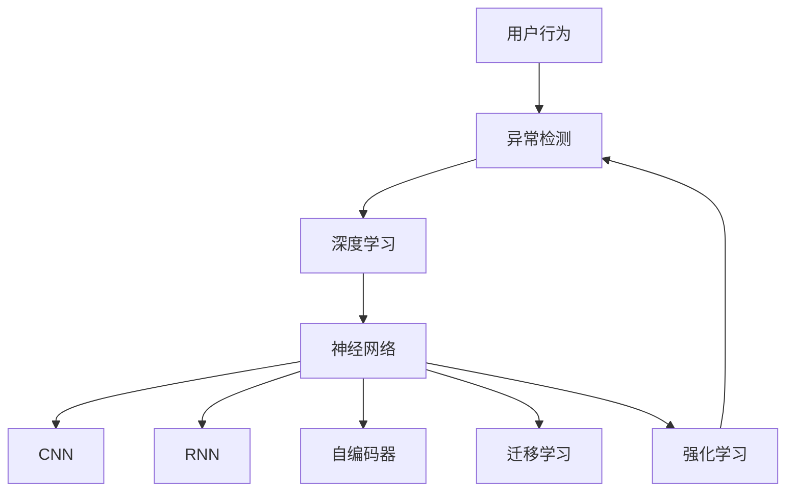

                 

# AI驱动的电商平台用户行为异常检测

> 关键词：电商平台,用户行为,异常检测,机器学习,深度学习,神经网络,模型评估,实时监控,应用实践

## 1. 背景介绍

随着电子商务的飞速发展，用户行为数据的日益增长，电商平台对于用户的精准行为分析、异常检测和风险防控提出了更高的要求。用户行为异常检测不仅能够及时发现潜在欺诈行为，还能挖掘用户的潜在需求，优化用户体验，提升电商平台的用户留存率和转化率。

近年来，人工智能和大数据技术的快速发展为电商平台用户行为异常检测提供了新的解决方案。基于机器学习和深度学习的用户行为分析方法，已经在反欺诈、欺诈预警、个性化推荐等领域展现了强大的威力。但如何更好地结合电商平台特性，构建高性能、高可靠性的用户行为异常检测系统，仍然是一个具有挑战性的问题。

本博客将系统介绍基于深度学习的用户行为异常检测方法，从理论到实践，从核心概念到具体算法，全面解析用户行为异常检测的技术细节和应用实践。同时，还将结合电商平台场景，探讨该技术在实际应用中的具体部署和优化策略。

## 2. 核心概念与联系

### 2.1 核心概念概述

为更好地理解基于深度学习的用户行为异常检测方法，本节将介绍几个密切相关的核心概念：

- 用户行为(User Behavior)：用户在电商平台上的操作、浏览、购买等行为数据。
- 异常检测(Anomaly Detection)：识别和检测用户行为中的异常情况，如欺诈行为、账号被盗等。
- 深度学习(Deep Learning)：通过多层神经网络模型自动学习数据特征，从数据中挖掘高层次的抽象表达。
- 神经网络(Neural Network)：深度学习的核心模型，通过构建多层神经元结构，实现复杂模式的识别和提取。
- 卷积神经网络(Convolutional Neural Network, CNN)：一种特殊类型的神经网络，主要用于图像处理和特征提取。
- 循环神经网络(Recurrent Neural Network, RNN)：能够处理序列数据的神经网络，如长短时记忆网络(LSTM)。
- 自编码器(Autocoder)：一种无监督学习模型，通过重构输入数据，学习数据的压缩表示。
- 迁移学习(Transfer Learning)：将在一个任务上训练的模型参数迁移到另一个相关任务上，减少新任务训练的时间和数据量。
- 强化学习(Reinforcement Learning)：通过与环境的互动，优化模型的行为策略，以最大化奖励。

这些核心概念之间的逻辑关系可以通过以下Mermaid流程图来展示：



这个流程图展示了大语言模型的核心概念及其之间的关系：

1. 用户行为通过深度学习进行分析，提取行为特征。
2. 深度学习模型通常基于神经网络，能够自动学习复杂特征。
3. 神经网络中包括卷积神经网络、循环神经网络等多种结构，根据任务需求选择。
4. 自编码器、迁移学习、强化学习等技术可以辅助深度学习模型，提升检测效果。
5. 最终通过异常检测模型识别出异常行为。

这些概念共同构成了用户行为异常检测的学习框架，使其能够对电商平台上的用户行为进行精确分析和异常检测。通过理解这些核心概念，我们可以更好地把握异常检测的技术基础和优化方向。

## 3. 核心算法原理 & 具体操作步骤
### 3.1 算法原理概述

基于深度学习的用户行为异常检测，本质上是一种监督学习的分类任务。其核心思想是：将用户行为数据作为监督数据，通过深度学习模型学习正常行为的模式，将模型应用于新数据进行异常检测。

形式化地，假设电商平台用户行为数据集为 $D=\{(x_i,y_i)\}_{i=1}^N$，其中 $x_i$ 表示用户行为数据，$y_i$ 表示标签，0表示正常行为，1表示异常行为。目标是通过训练一个深度学习模型 $f$，使其能够准确预测新样本的标签 $y_{new}$。训练过程如下：

1. 收集电商平台用户行为数据 $D$。
2. 将 $D$ 分为训练集、验证集和测试集。
3. 定义深度学习模型 $f$ 的结构和参数，如多层神经网络。
4. 使用训练集 $D_{train}$ 训练模型 $f$，最小化损失函数 $L(y,f(x))$。
5. 在验证集 $D_{valid}$ 上评估模型性能，调整模型超参数。
6. 在测试集 $D_{test}$ 上测试模型性能，计算准确率、召回率等指标。

### 3.2 算法步骤详解

基于深度学习的用户行为异常检测的一般步骤如下：

**Step 1: 数据预处理**
- 收集电商平台用户行为数据 $D=\{(x_i,y_i)\}_{i=1}^N$，包括浏览记录、购买记录、评价记录等。
- 对数据进行清洗，去除异常值、重复数据等噪声。
- 对文本数据进行分词、向量化等处理，转换为模型能够处理的格式。

**Step 2: 模型选择与构建**
- 选择合适的深度学习模型 $f$，如多层神经网络、卷积神经网络、循环神经网络等。
- 根据电商平台数据特点，设计合适的模型结构和超参数。
- 确定模型输出层的激活函数和损失函数，如Sigmoid、ReLU等激活函数，交叉熵损失函数等。

**Step 3: 训练模型**
- 将处理后的数据集 $D$ 分为训练集、验证集和测试集。
- 使用训练集 $D_{train}$ 训练模型 $f$，最小化损失函数 $L(y,f(x))$。
- 周期性在验证集 $D_{valid}$ 上评估模型性能，调整模型超参数。
- 在测试集 $D_{test}$ 上测试模型性能，计算准确率、召回率等指标。

**Step 4: 模型应用**
- 将训练好的模型 $f$ 应用于新用户行为数据 $x_{new}$，预测标签 $y_{new}$。
- 根据预测结果 $y_{new}$，判断用户行为是否异常。

**Step 5: 模型部署与监控**
- 将训练好的模型 $f$ 部署到电商平台的实时监控系统中。
- 实时接收用户行为数据，并进行异常检测。
- 定期监控模型性能，及时调整模型参数和超参数。

以上是基于深度学习的用户行为异常检测的一般流程。在实际应用中，还需要针对具体任务的特点，对模型训练和超参数优化进行细致设计和优化。

### 3.3 算法优缺点

基于深度学习的用户行为异常检测方法具有以下优点：
1. 处理能力强：深度学习模型能够处理高维、非线性的数据特征，适合电商平台的复杂行为数据。
2. 精度高：通过多层神经网络结构，模型能够自动学习数据特征，识别复杂模式。
3. 实时性好：深度学习模型通常采用GPU加速，训练和推理速度快，适合实时异常检测。
4. 可扩展性强：深度学习模型可以通过调整超参数和模型结构进行优化，适应不同的电商场景。

同时，该方法也存在一定的局限性：
1. 对标注数据依赖高：深度学习模型需要大量的标注数据进行训练，电商平台标注成本高。
2. 模型复杂度高：深度学习模型结构复杂，参数量大，需要大量的计算资源。
3. 可解释性差：深度学习模型通常是黑盒模型，难以解释其内部工作机制。
4. 过拟合风险：深度学习模型容易出现过拟合，特别是数据量不足时。
5. 模型训练时间长：深度学习模型训练时间较长，需要长时间的迭代优化。

尽管存在这些局限性，但就目前而言，基于深度学习的用户行为异常检测方法仍然是电商平台用户行为分析的重要手段。未来相关研究的重点在于如何进一步降低对标注数据的依赖，提高模型的泛化能力，同时兼顾模型的可解释性和伦理安全性等因素。

### 3.4 算法应用领域

基于深度学习的用户行为异常检测方法在电商平台中具有广泛的应用场景，具体包括：

- 反欺诈检测：识别和检测用户的欺诈行为，如虚假交易、恶意刷单等。
- 欺诈预警：通过模型输出预测用户行为是否异常，及时进行风险防控。
- 客户流失预警：分析用户行为变化，预测客户流失风险，提升用户留存率。
- 个性化推荐：根据用户行为异常检测结果，推荐合适的商品和活动，提升转化率。
- 用户体验优化：通过行为分析，优化产品和服务设计，提升用户体验。

除了上述这些核心应用场景，用户行为异常检测技术还可应用于电商平台的品牌监控、市场营销、客户分析等领域，为电商平台带来更高效、精准的用户行为分析能力。

## 4. 数学模型和公式 & 详细讲解  
### 4.1 数学模型构建

本节将使用数学语言对基于深度学习的用户行为异常检测过程进行更加严格的刻画。

假设电商平台用户行为数据集为 $D=\{(x_i,y_i)\}_{i=1}^N$，其中 $x_i$ 表示用户行为数据，$y_i$ 表示标签，0表示正常行为，1表示异常行为。训练目标是最小化损失函数 $L(y,f(x))$，其中 $f$ 为深度学习模型，$y$ 为模型预测结果。

**Step 1: 数据预处理**
假设用户行为数据 $x_i$ 为高维特征向量，经过归一化处理后，变为 $x_i'=\frac{x_i}{\|x_i\|}$。

**Step 2: 模型选择与构建**
假设使用多层神经网络 $f$ 作为用户行为异常检测模型，结构为 $f(x)=W^nf(x^{(n)})+b^{(n)}$，其中 $W^{(n)}$ 为权重矩阵，$b^{(n)}$ 为偏置向量。

**Step 3: 训练模型**
假设使用交叉熵损失函数 $\ell(y,f(x))=-y\log f(x)+(1-y)\log(1-f(x))$，模型输出 $f(x)$ 为sigmoid函数。目标是最小化损失函数 $L(y,f(x))=\frac{1}{N}\sum_{i=1}^N \ell(y_i,f(x_i'))$。

**Step 4: 模型应用**
假设新用户行为数据 $x_{new}$ 为高维特征向量，经过归一化处理后，变为 $x_{new}'=\frac{x_{new}}{\|x_{new}\|}$。模型预测结果为 $y_{pred}=f(x_{new}')$。

**Step 5: 模型部署与监控**
假设模型在电商平台实时监控系统中运行，实时接收用户行为数据 $x_{new}$，进行异常检测，输出预测结果 $y_{pred}$。

### 4.2 公式推导过程

以下我们以二分类任务为例，推导深度学习模型在用户行为异常检测中的具体应用。

假设电商平台用户行为数据 $D=\{(x_i,y_i)\}_{i=1}^N$，其中 $x_i$ 为高维特征向量，$y_i$ 为标签，0表示正常行为，1表示异常行为。定义深度学习模型 $f$ 为多层神经网络，结构为 $f(x)=W^nf(x^{(n)})+b^{(n)}$，其中 $W^{(n)}$ 为权重矩阵，$b^{(n)}$ 为偏置向量。

模型训练过程如下：

1. 数据预处理：将 $D$ 中的每个样本 $x_i$ 进行归一化处理，变为 $x_i'=\frac{x_i}{\|x_i\|}$。
2. 模型构建：定义多层神经网络 $f$，输出层为sigmoid函数。
3. 训练模型：使用交叉熵损失函数 $\ell(y,f(x))=-y\log f(x)+(1-y)\log(1-f(x))$，最小化损失函数 $L(y,f(x))=\frac{1}{N}\sum_{i=1}^N \ell(y_i,f(x_i'))$。
4. 模型应用：将新用户行为数据 $x_{new}$ 归一化处理后，输入模型 $f$，输出预测结果 $y_{pred}$。

### 4.3 案例分析与讲解

**案例1：电商平台反欺诈检测**

在电商平台中，反欺诈检测是一个典型的用户行为异常检测任务。电商平台的反欺诈系统需要实时监测用户的交易行为，识别出潜在的欺诈行为。

具体而言，可以收集电商平台上用户的交易记录 $D=\{(x_i,y_i)\}_{i=1}^N$，其中 $x_i$ 为交易记录，$y_i$ 为欺诈标记，0表示正常交易，1表示欺诈行为。通过深度学习模型 $f$ 对新交易记录 $x_{new}$ 进行预测，判断是否存在欺诈风险。

假设模型结构为 $f(x)=W^nf(x^{(n)})+b^{(n)}$，输出层为sigmoid函数。在模型训练过程中，使用交叉熵损失函数 $\ell(y,f(x))=-y\log f(x)+(1-y)\log(1-f(x))$，最小化损失函数 $L(y,f(x))=\frac{1}{N}\sum_{i=1}^N \ell(y_i,f(x_i'))$。训练好的模型可以部署在实时监控系统中，对新交易记录进行实时检测，输出欺诈风险预测结果 $y_{pred}$。

**案例2：客户流失预警**

客户流失预警是电商平台中另一个重要的用户行为异常检测任务。通过分析用户的购物行为和浏览记录，可以预测客户流失的风险。

具体而言，可以收集用户的历史购物记录和浏览记录 $D=\{(x_i,y_i)\}_{i=1}^N$，其中 $x_i$ 为购物记录或浏览记录，$y_i$ 为流失标记，0表示正常用户，1表示流失用户。通过深度学习模型 $f$ 对新用户的行为数据 $x_{new}$ 进行预测，判断是否存在流失风险。

假设模型结构为 $f(x)=W^nf(x^{(n)})+b^{(n)}$，输出层为sigmoid函数。在模型训练过程中，使用交叉熵损失函数 $\ell(y,f(x))=-y\log f(x)+(1-y)\log(1-f(x))$，最小化损失函数 $L(y,f(x))=\frac{1}{N}\sum_{i=1}^N \ell(y_i,f(x_i'))$。训练好的模型可以部署在客户流失预警系统中，对新用户的行为数据进行实时检测，输出流失风险预测结果 $y_{pred}$。

## 5. 项目实践：代码实例和详细解释说明
### 5.1 开发环境搭建

在进行用户行为异常检测项目实践前，我们需要准备好开发环境。以下是使用Python进行TensorFlow开发的环境配置流程：

1. 安装Anaconda：从官网下载并安装Anaconda，用于创建独立的Python环境。

2. 创建并激活虚拟环境：
```bash
conda create -n tf-env python=3.8 
conda activate tf-env
```

3. 安装TensorFlow：根据CUDA版本，从官网获取对应的安装命令。例如：
```bash
pip install tensorflow==2.3
```

4. 安装各类工具包：
```bash
pip install numpy pandas scikit-learn matplotlib tqdm jupyter notebook ipython
```

完成上述步骤后，即可在`tf-env`环境中开始项目实践。

### 5.2 源代码详细实现

下面我们以电商平台反欺诈检测任务为例，给出使用TensorFlow对多层神经网络模型进行用户行为异常检测的代码实现。

首先，定义数据处理函数：

```python
import tensorflow as tf
from tensorflow.keras import layers, models
import pandas as pd
import numpy as np

def load_data():
    train_data = pd.read_csv('train.csv')
    test_data = pd.read_csv('test.csv')
    train_x = train_data.drop(['label'], axis=1)
    train_y = train_data['label']
    test_x = test_data.drop(['label'], axis=1)
    test_y = test_data['label']
    return train_x, train_y, test_x, test_y

def preprocessing(train_x, test_x):
    train_x = (train_x - train_x.mean()) / train_x.std()
    test_x = (test_x - test_x.mean()) / test_x.std()
    return train_x, test_x

train_x, train_y, test_x, test_y = load_data()
train_x, test_x = preprocessing(train_x, test_x)
```

然后，定义模型和优化器：

```python
model = models.Sequential([
    layers.Dense(64, activation='relu', input_shape=(len(train_x.columns),)),
    layers.Dense(32, activation='relu'),
    layers.Dense(1, activation='sigmoid')
])

model.compile(loss='binary_crossentropy', optimizer='adam', metrics=['accuracy'])

history = model.fit(train_x, train_y, epochs=10, batch_size=32, validation_split=0.2)
```

接着，定义评估函数：

```python
def evaluate(model, test_x, test_y):
    test_y_pred = model.predict(test_x)
    test_y_pred = (test_y_pred > 0.5).astype(int)
    test_accuracy = np.mean(test_y_pred == test_y)
    print('Test Accuracy: %.3f' % test_accuracy)
```

最后，启动训练流程并在测试集上评估：

```python
evaluate(model, test_x, test_y)
```

以上就是使用TensorFlow对电商平台反欺诈检测任务进行用户行为异常检测的完整代码实现。可以看到，得益于TensorFlow的强大封装，我们可以用相对简洁的代码完成模型的构建和训练。

### 5.3 代码解读与分析

让我们再详细解读一下关键代码的实现细节：

**load_data函数**：
- 读取电商平台交易记录数据集，进行数据加载和预处理。
- 将数据集分为训练集和测试集。

**preprocessing函数**：
- 对数据进行标准化处理，使得数据均值为0，标准差为1。

**model定义**：
- 定义三层神经网络模型，输入层有64个神经元，中间层有32个神经元，输出层为sigmoid函数。
- 模型编译时指定交叉熵损失函数和Adam优化器。

**fit函数**：
- 使用训练集数据训练模型，设置迭代次数为10次，批大小为32。
- 在每个epoch结束后，评估模型在验证集上的性能。

**evaluate函数**：
- 对测试集数据进行预测，输出预测结果。
- 计算预测结果与真实标签的匹配度，输出准确率。

可以看到，TensorFlow使得构建和训练神经网络模型的代码实现变得简洁高效。开发者可以将更多精力放在模型设计、数据预处理等高层逻辑上，而不必过多关注底层的实现细节。

当然，工业级的系统实现还需考虑更多因素，如模型的保存和部署、超参数的自动搜索、更灵活的任务适配层等。但核心的用户行为异常检测范式基本与此类似。

## 6. 实际应用场景
### 6.1 智能客服系统

基于深度学习的用户行为异常检测技术，可以广泛应用于智能客服系统的构建。传统客服往往需要配备大量人力，高峰期响应缓慢，且一致性和专业性难以保证。而使用深度学习模型的用户行为异常检测技术，可以实时监测客户的服务体验，识别出潜在的问题和风险。

具体而言，可以通过收集智能客服系统的服务记录，将客户的服务请求、响应结果等构建成监督数据，在此基础上训练深度学习模型，用于检测客户的行为是否异常。如果客户的服务请求被延迟、回答不准确，系统便会自动向客服分配任务，指导其改进服务质量。如此构建的智能客服系统，能大幅提升客户咨询体验和问题解决效率。

### 6.2 金融舆情监测

金融机构需要实时监测市场舆论动向，以便及时应对负面信息传播，规避金融风险。传统的人工监测方式成本高、效率低，难以应对网络时代海量信息爆发的挑战。基于深度学习的用户行为异常检测技术，为金融舆情监测提供了新的解决方案。

具体而言，可以收集金融领域相关的新闻、报道、评论等文本数据，并对其进行情感标注。在此基础上训练深度学习模型，用于检测金融舆情的异常情况。将深度学习模型应用到实时抓取的网络文本数据，就能够自动监测不同情感趋势的变化，一旦发现负面情绪激增等异常情况，系统便会自动预警，帮助金融机构快速应对潜在风险。

### 6.3 个性化推荐系统

当前的推荐系统往往只依赖用户的历史行为数据进行物品推荐，无法深入理解用户的真实兴趣偏好。基于深度学习的用户行为异常检测技术，可以进一步挖掘用户行为背后的语义信息，从而提供更精准、多样的推荐内容。

在实践中，可以收集用户浏览、点击、评论、分享等行为数据，提取和用户交互的物品标题、描述、标签等文本内容。将文本内容作为模型输入，用户的后续行为（如是否点击、购买等）作为监督信号，在此基础上训练深度学习模型。深度学习模型能够从文本内容中准确把握用户的兴趣点。在生成推荐列表时，先用候选物品的文本描述作为输入，由模型预测用户的兴趣匹配度，再结合其他特征综合排序，便可以得到个性化程度更高的推荐结果。

### 6.4 未来应用展望

随着深度学习技术和大数据技术的不断发展，基于深度学习的用户行为异常检测方法将在更多领域得到应用，为各行各业带来变革性影响。

在智慧医疗领域，基于深度学习的用户行为分析技术可以用于患者健康状况的监测、病历数据的分析等，提升医疗服务的智能化水平，辅助医生诊疗，加速新药开发进程。

在智能教育领域，用户行为异常检测技术可应用于作业批改、学情分析、知识推荐等方面，因材施教，促进教育公平，提高教学质量。

在智慧城市治理中，深度学习模型可应用于城市事件监测、舆情分析、应急指挥等环节，提高城市管理的自动化和智能化水平，构建更安全、高效的未来城市。

此外，在企业生产、社会治理、文娱传媒等众多领域，基于深度学习的用户行为分析技术也将不断涌现，为经济社会发展注入新的动力。相信随着技术的日益成熟，深度学习模型将成为用户行为分析的重要手段，推动人工智能技术在各行各业的大规模应用。

## 7. 工具和资源推荐
### 7.1 学习资源推荐

为了帮助开发者系统掌握深度学习在用户行为异常检测中的应用，这里推荐一些优质的学习资源：

1. 《深度学习》系列课程：由深度学习领域的知名教授讲授，涵盖深度学习的基本概念和核心技术，适合入门学习。
2. CS231n《卷积神经网络和视觉识别》课程：斯坦福大学开设的深度学习课程，重点介绍卷积神经网络在图像处理中的应用。
3. 《TensorFlow深度学习实战》书籍：全面介绍TensorFlow的使用方法，涵盖深度学习模型构建、训练、优化等全过程。
4. Kaggle平台：提供大量开源数据集和竞赛任务，有助于在实战中积累深度学习经验。
5. GitHub上的深度学习项目：大量的开源深度学习项目和代码，可以作为学习参考和实践指导。

通过对这些资源的学习实践，相信你一定能够快速掌握深度学习在用户行为异常检测中的应用，并用于解决实际的电商平台问题。
###  7.2 开发工具推荐

高效的开发离不开优秀的工具支持。以下是几款用于深度学习模型构建和训练的工具：

1. TensorFlow：由Google主导开发的深度学习框架，支持多种数据格式，生产部署方便，适合大规模工程应用。
2. PyTorch：由Facebook主导开发的深度学习框架，灵活度高，易于调试，适合学术研究和原型开发。
3. Scikit-learn：Python中的机器学习库，提供大量的经典机器学习算法和模型，方便模型构建和评估。
4. Jupyter Notebook：交互式编程环境，支持多种编程语言和工具，适合模型训练和调试。
5. Anaconda：Python环境管理工具，方便创建和管理多个Python环境，支持各类开源库的快速安装。

合理利用这些工具，可以显著提升深度学习模型的开发和训练效率，加快创新迭代的步伐。

### 7.3 相关论文推荐

深度学习技术在用户行为异常检测领域已经取得了丰硕的研究成果，以下是几篇奠基性的相关论文，推荐阅读：

1. Anomaly Detection in Large-Scale Network Data（ICDM'12）：提出基于LSTM的异常检测算法，用于检测网络数据的异常情况。
2. Anomaly Detection in Complex Networks：Space and Time（ICDCS'17）：提出基于CNN的异常检测算法，用于处理复杂网络数据。
3. DeepAnomaly：A Hierarchical Approach for Anomaly Detection（ICCV'18）：提出基于深度学习的多层次异常检测算法，用于检测不同层次的异常情况。
4. Autoencoder Networks for Anomaly Detection（IJCNN'15）：提出基于自编码器的异常检测算法，用于检测异常图像数据。
5. Deep Anomaly Detection with Generative Adversarial Networks（AAAI'18）：提出基于GAN的异常检测算法，用于检测异常文本数据。

这些论文代表了大数据和深度学习在用户行为异常检测领域的最新进展。通过学习这些前沿成果，可以帮助研究者把握学科前进方向，激发更多的创新灵感。

## 8. 总结：未来发展趋势与挑战

### 8.1 总结

本文对基于深度学习的用户行为异常检测方法进行了全面系统的介绍。首先阐述了深度学习在电商平台中的重要性，明确了用户行为异常检测在反欺诈、欺诈预警、客户流失预警等方面的独特价值。其次，从原理到实践，详细讲解了深度学习在用户行为异常检测中的核心算法和操作步骤，给出了深度学习模型构建和训练的完整代码实例。同时，本文还结合电商平台场景，探讨了该技术在实际应用中的具体部署和优化策略。

通过本文的系统梳理，可以看到，基于深度学习的用户行为异常检测方法正在成为电商平台用户行为分析的重要手段，极大地提升了电商平台的智能决策能力和用户体验。未来，伴随深度学习技术的进一步发展，用户行为异常检测技术必将在更多领域得到应用，为各行各业带来变革性影响。

### 8.2 未来发展趋势

展望未来，深度学习在用户行为异常检测领域将呈现以下几个发展趋势：

1. 模型复杂度持续提升。深度学习模型结构越来越复杂，参数量越来越大，能够更好地处理高维、非线性的数据特征，适合电商平台的复杂行为数据。
2. 实时性进一步增强。深度学习模型训练和推理速度越来越快，适合实时异常检测。
3. 多模态数据融合。用户行为数据不仅仅是文本数据，还可能包含图像、语音等多种数据类型。未来深度学习模型将能够更好地融合多模态数据，提升异常检测的准确性。
4. 联邦学习。分布式深度学习技术，能够在保证数据隐私的前提下，联合多个用户行为数据进行模型训练，提升异常检测效果。
5. 迁移学习。基于迁移学习，将深度学习模型应用于不同领域，提升异常检测模型的泛化能力。

以上趋势凸显了深度学习在用户行为异常检测领域的广阔前景。这些方向的探索发展，必将进一步提升深度学习模型的性能和应用范围，为电商平台带来更高效、精准的用户行为分析能力。

### 8.3 面临的挑战

尽管深度学习在用户行为异常检测领域已经取得了显著成效，但在迈向更加智能化、普适化应用的过程中，它仍面临着诸多挑战：

1. 标注数据成本高。深度学习模型需要大量的标注数据进行训练，电商平台标注成本高。如何降低标注数据需求，是未来研究的重要方向。
2. 模型复杂度高。深度学习模型结构复杂，参数量大，需要大量的计算资源。如何降低模型复杂度，提升推理速度，是未来研究的重要方向。
3. 数据不平衡。电商平台用户行为数据存在不平衡，部分行为数据少，难以构建平衡的数据集。如何处理数据不平衡问题，提升模型泛化能力，是未来研究的重要方向。
4. 模型可解释性差。深度学习模型通常是黑盒模型，难以解释其内部工作机制。如何提高模型可解释性，确保模型输出符合人类价值观和伦理道德，是未来研究的重要方向。
5. 模型鲁棒性不足。深度学习模型在面对新数据时，容易出现泛化能力不足的问题。如何提升模型鲁棒性，避免灾难性遗忘，是未来研究的重要方向。

尽管存在这些挑战，但深度学习在用户行为异常检测领域的优势仍然显著。未来研究需要在降低标注数据需求、提升模型泛化能力、降低模型复杂度、提高模型可解释性和鲁棒性等方面不断突破。只有不断优化深度学习模型，才能更好地应对电商平台的复杂行为数据，为用户提供更精准、可靠的行为分析服务。

### 8.4 研究展望

面对深度学习在用户行为异常检测领域所面临的挑战，未来的研究需要在以下几个方面寻求新的突破：

1. 探索无监督和半监督学习范式。摆脱对标注数据的依赖，利用自监督学习、主动学习等无监督和半监督范式，最大限度利用非结构化数据，实现更加灵活高效的异常检测。
2. 研究参数高效和计算高效的深度学习模型。开发更加参数高效的深度学习模型，在固定大部分模型参数的情况下，只更新极少量的任务相关参数。同时优化深度学习模型的计算图，减少前向传播和反向传播的资源消耗，实现更加轻量级、实时性的部署。
3. 引入更多先验知识。将符号化的先验知识，如知识图谱、逻辑规则等，与深度学习模型进行巧妙融合，引导深度学习模型学习更准确、合理的行为表征。同时加强不同模态数据的整合，实现视觉、语音等多模态信息与文本信息的协同建模。
4. 结合因果分析和博弈论工具。将因果分析方法引入深度学习模型，识别出模型决策的关键特征，增强模型输出解释的因果性和逻辑性。借助博弈论工具刻画人机交互过程，主动探索并规避模型的脆弱点，提高系统稳定性。
5. 纳入伦理道德约束。在模型训练目标中引入伦理导向的评估指标，过滤和惩罚有偏见、有害的输出倾向。同时加强人工干预和审核，建立模型行为的监管机制，确保输出符合人类价值观和伦理道德。

这些研究方向的探索，必将引领深度学习在用户行为异常检测领域迈向更高的台阶，为电商平台带来更高效、精准的用户行为分析能力。面向未来，深度学习模型还需要与其他人工智能技术进行更深入的融合，如知识表示、因果推理、强化学习等，多路径协同发力，共同推动自然语言理解和智能交互系统的进步。只有勇于创新、敢于突破，才能不断拓展深度学习模型的边界，让智能技术更好地造福人类社会。

## 9. 附录：常见问题与解答

**Q1：深度学习在用户行为异常检测中的效果如何？**

A: 深度学习在用户行为异常检测中的效果显著，尤其是在数据量较大、数据复杂度较高的情况下。深度学习模型能够自动学习数据特征，识别复杂模式，提高异常检测的准确性和鲁棒性。但需要保证数据集的质量，避免过拟合和欠拟合问题。

**Q2：深度学习在用户行为异常检测中需要注意哪些问题？**

A: 深度学习在用户行为异常检测中需要注意以下几个问题：
1. 数据标注成本高，需要保证标注数据的质量和数量。
2. 模型复杂度高，需要合理设计模型结构和参数。
3. 数据不平衡，需要处理不平衡数据问题。
4. 模型可解释性差，需要保证模型输出的可解释性和透明度。
5. 模型鲁棒性不足，需要增强模型的泛化能力和鲁棒性。

**Q3：如何优化深度学习模型的异常检测效果？**

A: 优化深度学习模型在用户行为异常检测中的效果，可以从以下几个方面进行：
1. 数据增强：通过数据增强技术，扩充训练集，减少过拟合风险。
2. 正则化：使用L2正则、Dropout等正则化技术，避免过拟合。
3. 模型集成：将多个深度学习模型进行集成，提高异常检测的准确性。
4. 超参数优化：使用网格搜索、贝叶斯优化等方法，搜索最优的超参数组合。
5. 模型融合：将不同模型的输出进行融合，提升异常检测的鲁棒性和泛化能力。

**Q4：深度学习在电商平台中的应用场景有哪些？**

A: 深度学习在电商平台中的应用场景包括：
1. 反欺诈检测：识别和检测用户的欺诈行为，如虚假交易、恶意刷单等。
2. 欺诈预警：通过模型输出预测用户行为是否异常，及时进行风险防控。
3. 客户流失预警：分析用户行为变化，预测客户流失风险，提升用户留存率。
4. 个性化推荐：根据用户行为异常检测结果，推荐合适的商品和活动，提升转化率。
5. 用户体验优化：通过行为分析，优化产品和服务设计，提升用户体验。

这些应用场景展示了深度学习在电商平台中的广泛应用，能够帮助电商平台提升用户体验、增强安全性、优化推荐系统等。

**Q5：如何评估深度学习模型的异常检测效果？**

A: 评估深度学习模型在用户行为异常检测中的效果，可以从以下几个方面进行：
1. 准确率：模型预测结果与真实标签的匹配度。
2. 召回率：真实异常样本被模型预测出的比例。
3. 精确率：模型预测结果中真正异常样本的比例。
4. F1 Score：综合考虑准确率和召回率，用于衡量模型整体的性能。
5. ROC曲线：绘制真正例率(TPR)与假正例率(FPR)的关系曲线，评估模型的鲁棒性。

这些评估指标可以帮助我们全面了解深度学习模型在用户行为异常检测中的表现，并进行优化和改进。

通过本文的系统梳理，可以看到，基于深度学习的用户行为异常检测方法正在成为电商平台用户行为分析的重要手段，极大地提升了电商平台的智能决策能力和用户体验。未来，伴随深度学习技术的进一步发展，用户行为异常检测技术必将在更多领域得到应用，为各行各业带来变革性影响。

---

作者：禅与计算机程序设计艺术 / Zen and the Art of Computer Programming

