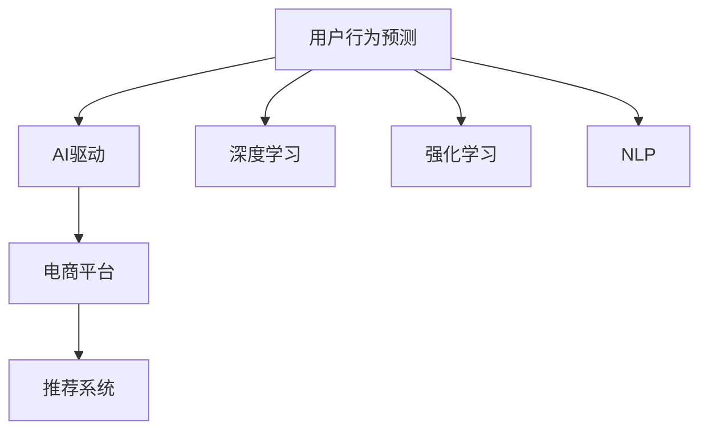

                 

# AI驱动的电商平台用户行为预测模型

> 关键词：用户行为预测, AI驱动, 电商平台, 机器学习, 推荐系统, 深度学习, 强化学习

## 1. 背景介绍

### 1.1 问题由来
在电商平台的发展过程中，如何精准预测用户行为，优化用户体验，提升转化率和收益，成为平台运营的关键问题。传统的数据挖掘和统计分析方法往往难以实时捕捉用户行为的变化，而AI技术通过深度学习、强化学习等方法，能够更为准确地预测用户行为，为平台提供实时、个性化的服务。

### 1.2 问题核心关键点
用户行为预测的难点在于数据的复杂性和多样性，涉及用户的浏览、购买、评价、退货等行为，且数据来源和格式多样，包括点击流、评价评论、社交媒体等。如何构建高效、通用的预测模型，在有限的标注数据下实现高精度的预测，是关键问题。

## 2. 核心概念与联系

### 2.1 核心概念概述

为更好地理解AI驱动的电商平台用户行为预测模型，本节将介绍几个密切相关的核心概念：

- 用户行为预测（User Behavior Prediction）：预测用户在未来某一时间点或时间段内的行为，如浏览、购买、评价等。
- AI驱动（AI-Driven）：利用AI技术（如深度学习、强化学习、自然语言处理等）构建预测模型。
- 电商平台（E-commerce Platform）：借助互联网和移动设备，在线销售商品或服务的平台。
- 推荐系统（Recommendation System）：基于用户行为，推荐个性化商品或服务的系统，提升用户体验和平台收益。
- 深度学习（Deep Learning）：基于多层神经网络的机器学习技术，擅长处理复杂数据。
- 强化学习（Reinforcement Learning）：通过与环境的互动，学习最优决策策略的机器学习技术。
- 自然语言处理（Natural Language Processing, NLP）：使计算机能够理解、处理和生成自然语言的技术。

这些核心概念之间的逻辑关系可以通过以下Mermaid流程图来展示：



这个流程图展示的核心概念及其之间的关系：

1. 用户行为预测是整个系统的目标。
2. AI技术是实现预测的核心手段。
3. 电商平台是预测模型的应用场景。
4. 推荐系统是预测结果的应用之一，通过推荐提升用户体验。
5. 深度学习、强化学习和NLP技术是AI技术的重要组成部分。

## 3. 核心算法原理 & 具体操作步骤
### 3.1 算法原理概述

AI驱动的电商平台用户行为预测模型，本质上是一个基于用户历史行为数据进行建模和预测的机器学习问题。其核心思想是：通过深度学习等算法，对用户历史行为数据进行特征提取和模型训练，预测用户在未来时间点的行为，从而提升平台的推荐效果和用户体验。

形式化地，假设用户历史行为数据为 $D=\{(x_i,y_i)\}_{i=1}^N$，其中 $x_i$ 为历史行为特征向量，$y_i$ 为用户未来行为标签。构建预测模型的目标是：找到模型 $M$，使得在新的用户行为数据 $x'$ 下，模型的预测 $M(x')$ 尽可能接近真实标签 $y'$。

### 3.2 算法步骤详解

AI驱动的电商平台用户行为预测模型的构建一般包括以下几个关键步骤：

**Step 1: 数据预处理**
- 收集用户历史行为数据，包括浏览记录、购买记录、评价评论、社交媒体互动等。
- 数据清洗：去除噪声和缺失值，处理异常值，归一化数据。
- 特征工程：构造有效的特征向量，包括用户行为特征、商品特征、时间特征等。

**Step 2: 模型选择与设计**
- 选择合适的深度学习模型或强化学习模型，如RNN、LSTM、CNN、GRU、CTC、DNN、Autoencoder、Reinforcement Learning等。
- 设计模型架构，确定输入层、隐藏层、输出层的维度、激活函数等。
- 设置模型超参数，如学习率、批大小、迭代轮数、正则化参数等。

**Step 3: 模型训练与优化**
- 使用训练数据对模型进行前向传播和反向传播，更新模型参数。
- 采用合适的损失函数，如均方误差、交叉熵、KL散度等，计算模型预测误差。
- 采用优化算法，如随机梯度下降（SGD）、Adam、RMSprop等，最小化损失函数。
- 使用正则化技术，如L1正则、L2正则、Dropout等，防止过拟合。
- 设置早停策略，在验证集上评估模型性能，避免过拟合。

**Step 4: 模型评估与测试**
- 在测试集上评估模型预测效果，计算准确率、召回率、F1分数等指标。
- 使用混淆矩阵、ROC曲线等工具，分析模型预测的优劣。
- 进行交叉验证，确保模型稳定性和泛化能力。
- 分析模型的预测误差，改进模型设计。

**Step 5: 模型部署与应用**
- 将训练好的模型保存为模型文件，便于后续调用。
- 将模型集成到推荐系统或决策系统，实时预测用户行为。
- 监测模型预测效果，根据反馈数据不断优化模型。

以上是AI驱动的电商平台用户行为预测模型的主要步骤。在实际应用中，还需要根据具体业务场景，对模型进行优化设计和调整。

### 3.3 算法优缺点

AI驱动的电商平台用户行为预测模型具有以下优点：
1. 高精度预测：深度学习等技术能够处理复杂的多模态数据，预测结果更加准确。
2. 实时性：模型可以在实时数据上更新预测结果，提供即时个性化服务。
3. 高适应性：模型能够灵活适应不同业务场景，如电商、社交、游戏等。
4. 可扩展性：通过分布式训练和推理，可以扩展到更大的数据集和更复杂的业务场景。

同时，该模型也存在一定的局限性：
1. 数据依赖：预测效果高度依赖于数据质量，标注数据不足时可能影响预测精度。
2. 模型复杂：深度学习模型参数量较大，训练和推理复杂度较高。
3. 鲁棒性问题：模型对噪声和异常值敏感，需要数据预处理和模型鲁棒性设计。
4. 泛化能力：模型可能过度拟合训练数据，泛化到新数据集时效果不佳。
5. 资源消耗：训练和推理需要大量计算资源，如GPU/TPU等。

尽管存在这些局限性，但AI驱动的用户行为预测模型在电商平台上仍然具备显著的优势和广泛的应用前景。

### 3.4 算法应用领域

AI驱动的电商平台用户行为预测模型已经在多个实际应用场景中取得了显著成效，主要包括以下几个领域：

- 商品推荐：根据用户历史浏览和购买记录，预测其未来的购买行为，提升推荐效果。
- 客户流失预测：通过分析用户行为，预测客户流失概率，提前采取措施挽留。
- 价格优化：基于用户行为预测，动态调整商品价格，提升销售收益。
- 库存管理：预测商品需求量，优化库存管理，减少库存积压。
- 营销活动效果评估：预测营销活动带来的用户行为变化，评估活动效果。

这些应用领域展示了用户行为预测模型的广泛影响力和实际应用价值。未来，随着AI技术的不断发展和数据量的积累，用户行为预测模型将在更多业务场景中发挥重要作用。

## 4. 数学模型和公式 & 详细讲解  
### 4.1 数学模型构建

本节将使用数学语言对AI驱动的电商平台用户行为预测模型进行更加严格的刻画。

记用户历史行为数据为 $D=\{(x_i,y_i)\}_{i=1}^N$，其中 $x_i$ 为历史行为特征向量，$y_i$ 为用户未来行为标签。构建预测模型的目标是找到最优模型 $M$，使得在新的用户行为数据 $x'$ 下，模型的预测 $M(x')$ 尽可能接近真实标签 $y'$。

定义损失函数 $L(y',\hat{y'})$，表示模型预测值与真实标签的差异，一般采用均方误差、交叉熵等损失函数。定义预测误差 $e(x',\hat{y'})$，表示模型在 $x'$ 上的预测误差。

AI驱动的电商平台用户行为预测模型的优化目标是：

$$
\min_{M} \mathbb{E}_{x',y'}[L(y',M(x'))]
$$

其中 $\mathbb{E}$ 表示期望，表示在所有数据上的平均预测误差。

### 4.2 公式推导过程

以深度学习中的多层感知器（MLP）模型为例，推导预测误差公式：

设 $x_i=(x_{i1},x_{i2},...,x_{in})$，$y_i=(y_{i1},y_{i2},...,y_{im})$。假设采用MLP模型进行预测，模型结构为 $(x_i;\theta) \rightarrow h(x_i;\theta) \rightarrow \hat{y'}$，其中 $h(x_i;\theta)$ 为隐藏层输出。

模型前向传播过程为：
$$
h(x_i;\theta)=\sigma(W_hx_i+b_h)
$$
$$
\hat{y'}=\sigma(W_{out}h+b_{out})
$$

模型后向传播过程为：
$$
\frac{\partial L}{\partial W_{out}}=\frac{\partial L}{\partial \hat{y'}}\frac{\partial \hat{y'}}{\partial h}\frac{\partial h}{\partial x_i}\frac{\partial x_i}{\partial W_{out}}
$$

其中 $\sigma$ 为激活函数，$\frac{\partial L}{\partial \hat{y'}}$ 为损失函数对预测值 $\hat{y'}$ 的梯度，$\frac{\partial h}{\partial x_i}$ 为隐藏层激活函数的导数，$\frac{\partial x_i}{\partial W_{out}}$ 为特征向量 $x_i$ 对输出权重 $W_{out}$ 的梯度。

通过反向传播更新模型参数 $\theta$，最小化预测误差 $e(x',\hat{y'})$。

### 4.3 案例分析与讲解

以电商平台上的商品推荐系统为例，分析用户行为预测模型的应用：

**数据预处理**
- 收集用户历史浏览和购买记录。
- 清洗数据，去除异常值和缺失值。
- 归一化特征数据，如用户浏览次数、浏览时间、商品价格等。

**模型选择与设计**
- 选择深度学习模型，如RNN、LSTM等，对用户行为序列进行建模。
- 设计模型架构，包括输入层、隐藏层、输出层，设置激活函数、权重矩阵等。
- 设置超参数，如学习率、批大小、迭代轮数等。

**模型训练与优化**
- 使用训练数据对模型进行前向传播和反向传播，更新模型参数。
- 采用均方误差损失函数，计算模型预测误差。
- 采用Adam优化算法，最小化预测误差。
- 使用正则化技术，防止过拟合。

**模型评估与测试**
- 在测试集上评估模型预测效果，计算准确率、召回率、F1分数等指标。
- 使用混淆矩阵、ROC曲线等工具，分析模型预测的优劣。
- 进行交叉验证，确保模型稳定性和泛化能力。

**模型部署与应用**
- 将训练好的模型保存为模型文件，便于后续调用。
- 将模型集成到推荐系统，实时预测用户行为。
- 监测模型预测效果，根据反馈数据不断优化模型。

## 5. 项目实践：代码实例和详细解释说明
### 5.1 开发环境搭建

在进行用户行为预测模型开发前，我们需要准备好开发环境。以下是使用Python进行TensorFlow开发的环境配置流程：

1. 安装Anaconda：从官网下载并安装Anaconda，用于创建独立的Python环境。

2. 创建并激活虚拟环境：
```bash
conda create -n tf-env python=3.8 
conda activate tf-env
```

3. 安装TensorFlow：根据CUDA版本，从官网获取对应的安装命令。例如：
```bash
conda install tensorflow -c pytorch -c conda-forge
```

4. 安装各类工具包：
```bash
pip install numpy pandas scikit-learn matplotlib tqdm jupyter notebook ipython
```

完成上述步骤后，即可在`tf-env`环境中开始项目实践。

### 5.2 源代码详细实现

下面我们以电商平台上的商品推荐系统为例，给出使用TensorFlow对MLP模型进行用户行为预测的代码实现。

首先，定义数据预处理函数：

```python
import tensorflow as tf
import numpy as np
import pandas as pd

def preprocess_data(file_path, num_features):
    data = pd.read_csv(file_path)
    features = data.columns[:-1]
    labels = data.columns[-1]
    
    # 数据归一化
    data[features] = (data[features] - data[features].mean()) / data[features].std()
    
    # 数据划分训练集和测试集
    train_data = data.sample(frac=0.8, random_state=42)
    test_data = data.drop(train_data.index)
    
    # 特征向量和标签
    train_features = train_data[features]
    train_labels = train_data[labels]
    test_features = test_data[features]
    test_labels = test_data[labels]
    
    return train_features, train_labels, test_features, test_labels
```

然后，定义模型和优化器：

```python
from tensorflow.keras.models import Sequential
from tensorflow.keras.layers import Dense, Dropout
from tensorflow.keras.optimizers import Adam

# 模型架构
model = Sequential([
    Dense(64, activation='relu', input_shape=(num_features,)),
    Dropout(0.2),
    Dense(1, activation='sigmoid')
])

# 优化器
optimizer = Adam(learning_rate=0.001)
```

接着，定义训练和评估函数：

```python
def train_model(model, train_features, train_labels, test_features, test_labels, batch_size, epochs):
    model.compile(loss='binary_crossentropy', optimizer=optimizer, metrics=['accuracy'])
    
    # 训练过程
    model.fit(train_features, train_labels, batch_size=batch_size, epochs=epochs, validation_data=(test_features, test_labels))
    
    # 评估过程
    loss, accuracy = model.evaluate(test_features, test_labels)
    print(f'Test Loss: {loss:.4f}')
    print(f'Test Accuracy: {accuracy:.4f}')
    
    return loss, accuracy

# 模型训练与评估
train_features, train_labels, test_features, test_labels = preprocess_data('data.csv', num_features=5)
train_model(model, train_features, train_labels, test_features, test_labels, batch_size=32, epochs=100)
```

以上就是使用TensorFlow对MLP模型进行电商平台用户行为预测的完整代码实现。可以看到，TensorFlow提供了丰富的深度学习模型和优化器，使得模型构建和训练过程变得相对简洁。

### 5.3 代码解读与分析

让我们再详细解读一下关键代码的实现细节：

**preprocess_data函数**
- 从CSV文件中读取数据，并进行特征工程，包括归一化和数据划分。
- 特征向量和标签从数据集中提取。

**模型定义**
- 使用Sequential模型，定义MLP模型结构。
- 设置激活函数为ReLU，使用Dropout层减少过拟合。
- 输出层使用Sigmoid函数，输出预测结果。

**优化器选择**
- 使用Adam优化器，设置学习率为0.001。

**模型训练与评估**
- 定义训练过程，设置批大小和迭代轮数。
- 使用模型编译器，定义损失函数、优化器和评估指标。
- 在训练集上训练模型，并在验证集上评估模型性能。

可以看到，TensorFlow提供的API使得模型构建和训练过程变得非常简洁。开发者可以更加专注于模型结构和优化策略的设计，而无需过多关注底层实现细节。

当然，工业级的系统实现还需考虑更多因素，如模型的保存和部署、超参数的自动搜索、更灵活的任务适配层等。但核心的用户行为预测模型基本与此类似。

## 6. 实际应用场景
### 6.1 智能客服系统

基于AI驱动的用户行为预测模型，智能客服系统可以更好地理解用户需求，提供个性化的服务。智能客服系统通过分析用户的历史互动记录，预测用户可能提出的问题，提前准备好相应答案，从而快速响应用户需求，提升用户满意度。

在技术实现上，可以收集客服系统中的历史对话记录，将问题-回答对作为监督数据，训练模型学习预测用户问题。微调后的模型能够自动理解用户意图，匹配最合适的回答模板进行回复。对于用户提出的新问题，还可以接入检索系统实时搜索相关内容，动态组织生成回答。如此构建的智能客服系统，能大幅提升客户咨询体验和问题解决效率。

### 6.2 金融舆情监测

金融机构需要实时监测市场舆论动向，以便及时应对负面信息传播，规避金融风险。传统的人工监测方式成本高、效率低，难以应对网络时代海量信息爆发的挑战。基于AI驱动的用户行为预测模型，金融舆情监测可以更好地捕捉用户情感变化，及时预警市场动向。

具体而言，可以收集金融领域相关的新闻、报道、评论等文本数据，并对其进行情感标注。在此基础上对模型进行微调，使其能够自动判断文本的情感倾向是正面、中性还是负面。将微调后的模型应用到实时抓取的网络文本数据，就能够自动监测不同情感的变化趋势，一旦发现负面情感激增等异常情况，系统便会自动预警，帮助金融机构快速应对潜在风险。

### 6.3 个性化推荐系统

当前的推荐系统往往只依赖用户的历史行为数据进行物品推荐，无法深入理解用户的真实兴趣偏好。基于AI驱动的用户行为预测模型，个性化推荐系统可以更好地挖掘用户行为背后的语义信息，从而提供更精准、多样的推荐内容。

在实践中，可以收集用户浏览、点击、评价、分享等行为数据，提取和用户交互的物品标题、描述、标签等文本内容。将文本内容作为模型输入，用户的后续行为（如是否点击、购买等）作为监督信号，在此基础上微调预训练语言模型。微调后的模型能够从文本内容中准确把握用户的兴趣点。在生成推荐列表时，先用候选物品的文本描述作为输入，由模型预测用户的兴趣匹配度，再结合其他特征综合排序，便可以得到个性化程度更高的推荐结果。

### 6.4 未来应用展望

随着AI驱动的用户行为预测技术的不断发展，基于微调范式将在更多领域得到应用，为传统行业带来变革性影响。

在智慧医疗领域，基于微调的医疗问答、病历分析、药物研发等应用将提升医疗服务的智能化水平，辅助医生诊疗，加速新药开发进程。

在智能教育领域，微调技术可应用于作业批改、学情分析、知识推荐等方面，因材施教，促进教育公平，提高教学质量。

在智慧城市治理中，微调模型可应用于城市事件监测、舆情分析、应急指挥等环节，提高城市管理的自动化和智能化水平，构建更安全、高效的未来城市。

此外，在企业生产、社会治理、文娱传媒等众多领域，基于AI驱动的用户行为预测技术也将不断涌现，为NLP技术带来全新的突破。随着预训练语言模型和微调方法的不断进步，相信AI驱动的用户行为预测技术必将在构建人机协同的智能时代中扮演越来越重要的角色。

## 7. 工具和资源推荐
### 7.1 学习资源推荐

为了帮助开发者系统掌握AI驱动的用户行为预测模型的理论基础和实践技巧，这里推荐一些优质的学习资源：

1. 《深度学习》课程：斯坦福大学开设的深度学习课程，有Lecture视频和配套作业，带你入门深度学习的基本概念和经典模型。

2. 《TensorFlow官方文档》：TensorFlow的官方文档，提供了详尽的API说明和实例代码，是学习TensorFlow的必备资料。

3. 《Natural Language Processing with TensorFlow》书籍：TensorFlow的NLP工具库官方文档，介绍了如何使用TensorFlow进行NLP任务开发，包括用户行为预测在内的诸多范式。

4. 《Reinforcement Learning: An Introduction》书籍：Reinforcement Learning领域的经典教材，系统讲解了强化学习的基本原理和应用。

5. 《Reinforcement Learning in Action》书籍：一个实战型的强化学习教程，介绍了各种强化学习算法和应用场景。

通过对这些资源的学习实践，相信你一定能够快速掌握AI驱动的用户行为预测模型的精髓，并用于解决实际的NLP问题。

### 7.2 开发工具推荐

高效的开发离不开优秀的工具支持。以下是几款用于AI驱动的用户行为预测模型开发的常用工具：

1. TensorFlow：由Google主导开发的开源深度学习框架，生产部署方便，适合大规模工程应用。

2. PyTorch：基于Python的开源深度学习框架，灵活动态的计算图，适合快速迭代研究。

3. Keras：高层次的神经网络API，可以运行在TensorFlow、CNTK等后端上，便于快速搭建模型。

4. Jupyter Notebook：交互式的数据科学和机器学习环境，支持Python代码和数学公式的混合编辑。

5. Weights & Biases：模型训练的实验跟踪工具，可以记录和可视化模型训练过程中的各项指标，方便对比和调优。

6. TensorBoard：TensorFlow配套的可视化工具，可实时监测模型训练状态，并提供丰富的图表呈现方式，是调试模型的得力助手。

合理利用这些工具，可以显著提升AI驱动的用户行为预测模型的开发效率，加快创新迭代的步伐。

### 7.3 相关论文推荐

AI驱动的用户行为预测技术的发展源于学界的持续研究。以下是几篇奠基性的相关论文，推荐阅读：

1. Deep Neural Networks for Early Warning Systems（Deep Early Warning）：提出基于深度神经网络的早期预警系统，用于金融市场风险监测。

2. Predicting the Stock Market using Deep Learning Techniques（股市预测）：利用深度学习模型预测股票市场走势，提高投资决策的准确性。

3. Predicting Customer Churn using Machine Learning Techniques（客户流失预测）：通过机器学习模型预测客户流失概率，提升客户保留率。

4. Multi-task Learning for Customer Segmentation and Churn Prediction（多任务学习客户分群与流失预测）：利用多任务学习模型同时进行客户分群和流失预测，提高模型的泛化能力。

5. Reinforcement Learning for Customer Retention in E-commerce Platforms（电商客户保留强化学习）：通过强化学习模型优化电商平台客户保留策略。

这些论文代表了大语言模型微调技术的发展脉络。通过学习这些前沿成果，可以帮助研究者把握学科前进方向，激发更多的创新灵感。

## 8. 总结：未来发展趋势与挑战
### 8.1 总结

本文对AI驱动的电商平台用户行为预测模型进行了全面系统的介绍。首先阐述了用户行为预测的难点和挑战，明确了AI驱动在其中的核心作用。其次，从原理到实践，详细讲解了AI驱动模型构建和训练的数学原理和关键步骤，给出了用户行为预测的完整代码实例。同时，本文还广泛探讨了AI驱动模型在智能客服、金融舆情、个性化推荐等多个领域的应用前景，展示了AI驱动模型的广泛影响力和实际应用价值。

通过本文的系统梳理，可以看到，AI驱动的用户行为预测模型在电商平台上具有显著的优势和广泛的应用前景。未来，随着AI技术的不断发展和数据量的积累，用户行为预测模型将在更多业务场景中发挥重要作用。

### 8.2 未来发展趋势

展望未来，AI驱动的用户行为预测技术将呈现以下几个发展趋势：

1. 模型规模持续增大。随着算力成本的下降和数据规模的扩张，模型参数量还将持续增长。超大规模模型蕴含的丰富语言知识，有望支撑更加复杂多变的用户行为预测任务。

2. 模型融合多样化。AI驱动模型将更多地与其他AI技术（如NLP、CV、RNN等）进行融合，形成多模态联合预测模型，提高预测精度。

3. 实时性增强。通过分布式计算和优化算法，模型训练和推理速度将显著提升，能够实现实时预测。

4. 算法自动化。自动调参、超参数优化等技术将使得模型训练过程更加高效，提升预测模型的效果和效率。

5. 模型部署便捷化。模型保存和部署工具将更加便捷，能够快速集成到推荐系统、客服系统等业务系统中，提升用户体验。

6. 决策透明度提升。通过模型解释性和可解释性技术，提高模型的决策透明度和用户信任度。

以上趋势凸显了AI驱动的用户行为预测技术的广阔前景。这些方向的探索发展，必将进一步提升用户行为预测模型的性能和应用范围，为构建智能服务提供坚实的技术支持。

### 8.3 面临的挑战

尽管AI驱动的用户行为预测技术已经取得了瞩目成就，但在迈向更加智能化、普适化应用的过程中，它仍面临着诸多挑战：

1. 数据依赖。预测效果高度依赖于数据质量，标注数据不足时可能影响预测精度。如何降低对标注数据的依赖，将是未来研究的重要方向。

2. 模型复杂。深度学习模型参数量较大，训练和推理复杂度较高。如何在保证预测精度的前提下，减少模型复杂度，提升模型可解释性，是重要的研究方向。

3. 鲁棒性问题。模型对噪声和异常值敏感，需要数据预处理和模型鲁棒性设计。如何在不同的业务场景下保持模型的稳定性和鲁棒性，是未来的挑战。

4. 泛化能力。模型可能过度拟合训练数据，泛化到新数据集时效果不佳。如何提高模型的泛化能力，确保在新的业务场景下仍能保持高预测精度，是需要解决的问题。

5. 资源消耗。训练和推理需要大量计算资源，如GPU/TPU等。如何在保证性能的同时，优化资源消耗，是模型部署的重要挑战。

尽管存在这些挑战，但随着技术的不断进步和研究的深入，AI驱动的用户行为预测技术必将在未来的电商平台上发挥更大作用，提升用户体验和平台收益。

### 8.4 研究展望

面向未来，AI驱动的用户行为预测技术需要在以下几个方向进行深入研究：

1. 探索无监督和半监督用户行为预测方法。摆脱对大规模标注数据的依赖，利用自监督学习、主动学习等无监督和半监督范式，最大限度利用非结构化数据，实现更加灵活高效的用户行为预测。

2. 研究多模态用户行为预测模型。将符号化的先验知识，如知识图谱、逻辑规则等，与神经网络模型进行巧妙融合，引导用户行为预测过程学习更准确、合理的语言模型。同时加强不同模态数据的整合，实现视觉、语音等多模态信息与文本信息的协同建模。

3. 纳入因果分析和博弈论工具。将因果分析方法引入用户行为预测模型，识别出模型决策的关键特征，增强预测结果的因果性和逻辑性。借助博弈论工具刻画人机交互过程，主动探索并规避模型的脆弱点，提高系统稳定性。

4. 结合因果分析和博弈论工具。将因果分析方法引入用户行为预测模型，识别出模型决策的关键特征，增强预测结果的因果性和逻辑性。借助博弈论工具刻画人机交互过程，主动探索并规避模型的脆弱点，提高系统稳定性。

5. 纳入伦理道德约束。在模型训练目标中引入伦理导向的评估指标，过滤和惩罚有偏见、有害的输出倾向。同时加强人工干预和审核，建立模型行为的监管机制，确保输出符合人类价值观和伦理道德。

这些研究方向的探索，必将引领AI驱动的用户行为预测技术迈向更高的台阶，为构建智能服务提供坚实的技术支持。只有勇于创新、敢于突破，才能不断拓展语言模型的边界，让智能技术更好地造福人类社会。

## 9. 附录：常见问题与解答

**Q1：AI驱动的用户行为预测模型是否适用于所有电商平台？**

A: AI驱动的用户行为预测模型在大多数电商平台上都能取得不错的效果，特别是对于数据量较大的平台。但对于一些特定领域的平台，如小微电商、B2B电商等，由于用户行为数据较少，预测效果可能不如预期的理想。此时需要在特定领域语料上进一步预训练，再进行微调，才能获得理想效果。

**Q2：如何选择合适的超参数？**

A: 超参数的选择对AI驱动模型效果影响较大，常见的超参数包括学习率、批大小、迭代轮数、正则化参数等。一般建议采用网格搜索或随机搜索等自动调参方法，找到最优超参数组合。同时，使用交叉验证等技术，确保模型稳定性和泛化能力。

**Q3：模型训练过程中如何避免过拟合？**

A: 过拟合是AI驱动模型训练中常见的问题，可以通过以下方法避免：
1. 数据增强：通过数据扩充、生成对抗网络等方式，扩充训练集，增加样本多样性。
2. 正则化：使用L1正则、L2正则、Dropout等技术，防止模型过度拟合训练数据。
3. 早停策略：在验证集上评估模型性能，一旦发现模型在验证集上性能停滞，立即停止训练。

这些方法通常需要根据具体业务场景和数据特点进行灵活组合。只有在数据、模型、训练、推理等各环节进行全面优化，才能最大限度地发挥AI驱动模型的威力。

**Q4：模型在部署和应用过程中需要注意哪些问题？**

A: 将AI驱动模型转化为实际应用，还需要考虑以下因素：
1. 模型裁剪：去除不必要的层和参数，减小模型尺寸，加快推理速度。
2. 量化加速：将浮点模型转为定点模型，压缩存储空间，提高计算效率。
3. 服务化封装：将模型封装为标准化服务接口，便于集成调用。
4. 弹性伸缩：根据请求流量动态调整资源配置，平衡服务质量和成本。
5. 监控告警：实时采集系统指标，设置异常告警阈值，确保服务稳定性。

AI驱动模型为电商平台提供实时、个性化的服务，但在实际部署中还需考虑资源优化、服务性能等问题，以确保模型的高效运行。

**Q5：如何保证AI驱动模型的决策透明度和可解释性？**

A: 保证AI驱动模型的决策透明度和可解释性是确保用户信任和合规的重要步骤。可以通过以下方法提高模型的可解释性：
1. 特征可视化：通过特征重要性分析，可视化模型输入和输出之间的关系。
2. 模型解释技术：使用LIME、SHAP等技术，解释模型预测结果的背后逻辑。
3. 模型验证：在训练过程中加入对抗样本，验证模型对异常数据的鲁棒性。
4. 人工审核：引入人工干预，对模型的输出结果进行审核和验证。

只有不断提升模型的可解释性和透明度，才能确保模型的可靠性和安全性，为电商平台提供更加稳定、可信的服务。

---

作者：禅与计算机程序设计艺术 / Zen and the Art of Computer Programming

