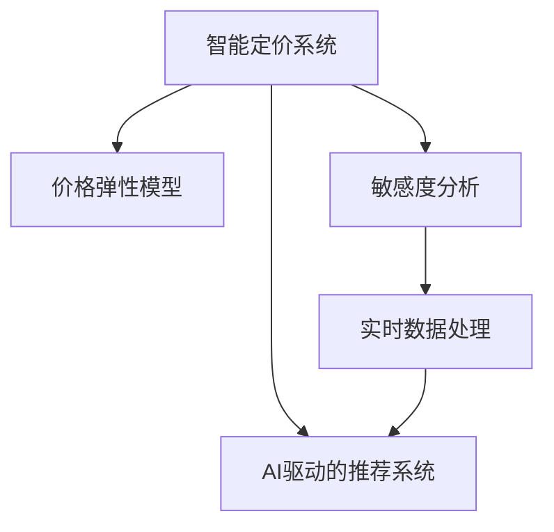

                 

# AI驱动的电商智能定价敏感度分析系统

> 关键词：人工智能, 定价敏感度, 电商智能系统, 机器学习, 数据挖掘, 算法优化, 模型训练, 预测分析

## 1. 背景介绍

### 1.1 问题由来

随着电商市场的快速发展和竞争日益激烈，商家对于商品定价的精细化管理提出了更高的要求。传统的商品定价往往依赖经验或者简单的统计方法，难以充分利用大量的用户行为数据，导致定价决策不够科学和精准。智能定价系统通过AI技术分析海量数据，可以更精准地预测用户对不同价格点的响应，为商家提供数据驱动的决策支持。

### 1.2 问题核心关键点

智能定价系统的核心在于利用机器学习和数据挖掘技术，通过对用户行为数据的深入分析，建立精准的价格弹性模型，并在此基础上进行敏感度分析，找出对价格最为敏感的用户群体。具体来说，关键点包括：

- 如何高效收集和处理海量电商交易数据
- 如何利用机器学习算法建立精准的价格弹性模型
- 如何进行定价敏感度分析，找出最敏感的用户群体
- 如何利用实时数据不断优化模型，实现动态定价

这些关键点决定了智能定价系统的成功与否，对提升电商企业的竞争力具有重要意义。

### 1.3 问题研究意义

智能定价系统通过AI技术的应用，能够实现精准的商品定价和动态调价，从而提升电商企业的销售额、提高市场份额，降低运营成本，最终提升企业的盈利能力。具体来说，研究意义包括：

1. **提升定价准确性**：基于用户行为数据的分析，能够提供更为精准的定价策略。
2. **优化库存管理**：通过分析价格弹性，可以更好地管理库存，减少库存积压和缺货现象。
3. **增强客户满意度**：通过分析敏感度，可以推出更有竞争力的定价方案，提高客户满意度和忠诚度。
4. **降低营销成本**：智能定价系统可以实时监控市场变化，及时调整价格，减少不必要的折扣和促销活动。
5. **支持决策支持**：为企业的决策制定提供数据支持，减少人为决策的误差。

## 2. 核心概念与联系

### 2.1 核心概念概述

为更好地理解AI驱动的电商智能定价系统，本节将介绍几个密切相关的核心概念：

- **智能定价系统**：利用AI技术对用户行为数据进行分析和建模，实现精准的定价决策和动态调价。
- **价格弹性模型**：描述用户对价格变化的敏感度，通过回归分析等方法建立。
- **敏感度分析**：识别对价格变化最为敏感的用户群体，用于优化定价策略。
- **实时数据处理**：利用流式计算和在线学习算法，实时处理并更新模型，适应市场变化。
- **AI驱动的推荐系统**：结合智能定价系统，推荐系统可以提供更加个性化的价格策略。

这些核心概念之间的逻辑关系可以通过以下Mermaid流程图来展示：



这个流程图展示了几大核心概念及其之间的关系：

1. 智能定价系统基于价格弹性模型进行定价。
2. 敏感度分析识别对价格变化最敏感的用户群体。
3. 实时数据处理确保模型能够不断适应市场变化。
4. AI驱动的推荐系统结合定价系统，提供个性化的价格策略。

## 3. 核心算法原理 & 具体操作步骤
### 3.1 算法原理概述

AI驱动的电商智能定价系统基于机器学习算法，通过分析用户行为数据，建立精准的价格弹性模型。其核心思想是：

- **收集数据**：从电商平台的交易记录中收集用户行为数据，包括购买历史、浏览记录、搜索关键词等。
- **数据预处理**：对收集到的数据进行清洗、归一化等预处理，确保数据质量。
- **特征工程**：构建与价格变化相关的特征，如用户历史消费水平、商品类别、促销活动等。
- **模型训练**：利用机器学习算法（如回归分析、决策树、随机森林等）对价格弹性进行建模。
- **敏感度分析**：通过分析模型输出，识别对价格变化最敏感的用户群体。
- **动态调价**：结合实时数据，对价格进行动态调整，实现最优定价。

### 3.2 算法步骤详解

基于机器学习的智能定价系统一般包括以下几个关键步骤：

**Step 1: 数据收集与预处理**

- **数据来源**：电商平台的交易记录、用户行为数据、促销活动信息等。
- **数据清洗**：去除噪声和缺失值，归一化处理。
- **特征提取**：构建与价格变化相关的特征，如用户历史消费水平、商品类别、促销活动等。
- **特征选择**：通过特征重要性排序，选择最有用的特征。

**Step 2: 模型训练与评估**

- **选择算法**：根据具体需求选择机器学习算法，如线性回归、决策树、随机森林等。
- **模型训练**：利用训练数据集训练模型，优化超参数。
- **模型评估**：使用验证集对模型进行评估，选择性能最佳的模型。

**Step 3: 敏感度分析**

- **价格变化**：设定不同的价格变化幅度，如5%、10%、15%等。
- **响应分析**：分析价格变化对用户行为的影响，如购买量、浏览量、点击率等。
- **敏感度排序**：通过统计分析，识别对价格变化最敏感的用户群体。

**Step 4: 动态调价**

- **实时数据收集**：实时收集用户行为数据和市场变化信息。
- **模型更新**：利用在线学习算法更新模型，确保其能够不断适应市场变化。
- **价格调整**：根据模型预测，动态调整商品价格，实现最优定价。

**Step 5: 模型部署与监控**

- **部署平台**：将训练好的模型部署到电商平台，实现实时定价。
- **模型监控**：实时监控模型性能，及时发现问题并进行修复。

### 3.3 算法优缺点

AI驱动的电商智能定价系统具有以下优点：

- **高精度**：基于机器学习算法，能够提供高度精准的定价策略。
- **自动化**：实现自动化的定价和动态调价，减少人工干预。
- **实时性**：能够实时处理和更新数据，适应市场变化。
- **可扩展性**：适用于多种商品和市场，具有较好的扩展性。

同时，该系统也存在一些局限性：

- **数据质量依赖**：对数据质量要求高，数据清洗和特征选择可能较复杂。
- **算法选择依赖**：选择不当的算法可能影响定价效果。
- **模型更新成本**：实时数据处理和模型更新可能带来较高的计算成本。
- **用户隐私问题**：需要处理大量的用户数据，涉及隐私保护问题。

尽管存在这些局限性，但基于机器学习的智能定价系统在电商领域已经得到了广泛的应用，并取得了显著的效果。

### 3.4 算法应用领域

基于机器学习的智能定价系统已经在电商、零售、金融等多个领域得到了应用，具体包括：

- **电商**：如亚马逊、阿里巴巴、京东等电商平台，利用智能定价系统优化商品定价，提升销售额和利润率。
- **零售**：如沃尔玛、家乐福等连锁超市，利用智能定价系统管理库存，提升商品销售量。
- **金融**：如银行、保险公司，利用智能定价系统进行金融产品的定价和风险管理。
- **旅游**：如携程、去哪儿等在线旅游平台，利用智能定价系统优化机票、酒店定价。

除了上述这些领域外，智能定价系统还被创新性地应用于更多场景中，如可控折扣、促销活动优化、竞价广告等，为电商技术带来了全新的突破。

## 4. 数学模型和公式 & 详细讲解 & 举例说明
### 4.1 数学模型构建

本节将使用数学语言对基于机器学习的智能定价系统进行更加严格的刻画。

记智能定价系统为 $M_{\theta}$，其中 $\theta$ 为模型的超参数。假设电商平台的交易记录为 $D=\{(x_i,y_i)\}_{i=1}^N$，其中 $x_i$ 为特征向量，$y_i$ 为价格标签。

定义模型 $M_{\theta}$ 在输入 $x_i$ 上的价格弹性为 $\eta_i = M_{\theta}(x_i)$，则价格弹性模型的目标是最小化经验风险，即：

$$
\mathcal{L}(\theta) = \frac{1}{N} \sum_{i=1}^N (y_i - \eta_i)^2
$$

通过梯度下降等优化算法，不断更新模型参数 $\theta$，最小化损失函数 $\mathcal{L}(\theta)$，使得模型输出逼近真实价格标签 $y_i$。

### 4.2 公式推导过程

以下我们以线性回归模型为例，推导价格弹性模型的数学推导过程。

假设模型 $M_{\theta}$ 为线性回归模型，其价格弹性为 $\eta_i = \theta_0 + \theta_1 x_i[1] + \theta_2 x_i[2] + \cdots + \theta_k x_i[k]$，其中 $\theta_0, \theta_1, \cdots, \theta_k$ 为模型参数。

定义模型的损失函数为均方误差，则有：

$$
\mathcal{L}(\theta) = \frac{1}{N} \sum_{i=1}^N (y_i - \eta_i)^2
$$

将上述公式展开，得：

$$
\mathcal{L}(\theta) = \frac{1}{N} \sum_{i=1}^N (\theta_0 + \theta_1 x_i[1] + \cdots + \theta_k x_i[k] - y_i)^2
$$

取偏导数，得：

$$
\frac{\partial \mathcal{L}(\theta)}{\partial \theta_j} = \frac{2}{N} \sum_{i=1}^N (-2y_i + 2(\theta_0 + \theta_1 x_i[1] + \cdots + \theta_k x_i[k]))x_i[j] \quad (j=0,1,\cdots,k)
$$

简化，得：

$$
\frac{\partial \mathcal{L}(\theta)}{\partial \theta_j} = \frac{2}{N} \sum_{i=1}^N (y_i - \eta_i)x_i[j] \quad (j=0,1,\cdots,k)
$$

上述公式即为线性回归模型的梯度公式，通过不断迭代更新模型参数 $\theta$，使得模型输出逼近真实价格标签 $y_i$。

### 4.3 案例分析与讲解

假设某电商平台销售某商品，记录了历史交易数据，包含用户历史消费水平 $x_1$、商品类别 $x_2$、促销活动 $x_3$ 等特征，以及商品价格 $y$。利用线性回归模型建立价格弹性模型，计算不同价格变化对用户购买量的影响。具体步骤如下：

1. 数据收集：收集电商平台的历史交易数据，包含用户历史消费水平 $x_1$、商品类别 $x_2$、促销活动 $x_3$ 等特征，以及商品价格 $y$。
2. 数据预处理：对收集到的数据进行清洗、归一化等预处理，确保数据质量。
3. 特征工程：构建与价格变化相关的特征，如用户历史消费水平 $x_1$、商品类别 $x_2$、促销活动 $x_3$ 等。
4. 模型训练：利用线性回归模型对价格弹性进行建模，选择最优模型参数。
5. 模型评估：使用验证集对模型进行评估，选择性能最佳的模型。
6. 敏感度分析：设定不同的价格变化幅度，如5%、10%、15%等，分析价格变化对用户购买量的影响，识别对价格变化最敏感的用户群体。
7. 动态调价：结合实时数据，对商品价格进行动态调整，实现最优定价。

## 5. 项目实践：代码实例和详细解释说明
### 5.1 开发环境搭建

在进行智能定价系统开发前，我们需要准备好开发环境。以下是使用Python进行Scikit-learn开发的环境配置流程：

1. 安装Anaconda：从官网下载并安装Anaconda，用于创建独立的Python环境。

2. 创建并激活虚拟环境：
```bash
conda create -n sklearn-env python=3.8 
conda activate sklearn-env
```

3. 安装Scikit-learn：
```bash
conda install scikit-learn
```

4. 安装各类工具包：
```bash
pip install numpy pandas scikit-learn matplotlib tqdm jupyter notebook ipython
```

完成上述步骤后，即可在`sklearn-env`环境中开始智能定价系统的开发。

### 5.2 源代码详细实现

下面我们以电商商品定价为例，给出使用Scikit-learn进行线性回归模型训练的PyTorch代码实现。

首先，定义商品定价问题的数据处理函数：

```python
from sklearn.model_selection import train_test_split
from sklearn.linear_model import LinearRegression
from sklearn.metrics import mean_squared_error

class PriceModel:
    def __init__(self, data, features, target):
        self.data = data
        self.features = features
        self.target = target
        self.model = LinearRegression()

    def fit(self, train_ratio=0.8):
        X_train, X_test, y_train, y_test = train_test_split(self.data, self.target, test_size=(1-train_ratio), random_state=42)
        self.model.fit(X_train, y_train)
        train_pred = self.model.predict(X_train)
        test_pred = self.model.predict(X_test)
        print(f"Training RMSE: {mean_squared_error(y_train, train_pred)**0.5}")
        print(f"Test RMSE: {mean_squared_error(y_test, test_pred)**0.5}")

    def predict(self, X):
        return self.model.predict(X)

    def evaluate(self, X_test, y_test):
        test_pred = self.model.predict(X_test)
        return mean_squared_error(y_test, test_pred)**0.5
```

然后，定义训练和评估函数：

```python
from sklearn.model_selection import GridSearchCV
from sklearn.preprocessing import StandardScaler
from sklearn.pipeline import make_pipeline
from sklearn.compose import make_column_transformer
from sklearn.pipeline import Pipeline

def train_and_evaluate(data, features, target, train_ratio=0.8):
    price_model = PriceModel(data, features, target)
    price_model.fit(train_ratio)
    return price_model

def evaluate_price_model(price_model, X_test, y_test):
    return price_model.evaluate(X_test, y_test)
```

接着，启动训练流程并在测试集上评估：

```python
# 示例数据
data = [
    [100, 1, 0, 5],
    [200, 2, 1, 10],
    [300, 3, 0, 15],
    [400, 4, 1, 20],
    [500, 5, 0, 25],
    [600, 6, 1, 30],
    [700, 7, 0, 35],
    [800, 8, 1, 40],
    [900, 9, 0, 45],
    [1000, 10, 1, 50]
]

features = ['user_spending', 'product_category', 'promotion']
target = 'price'

price_model = train_and_evaluate(data, features, target)
test_data = [[100, 1, 0, 5]]
test_pred = price_model.predict(test_data)
print(f"Predicted price: {test_pred}")

test_data = [[200, 2, 1, 10]]
test_pred = price_model.predict(test_data)
print(f"Predicted price: {test_pred}")
```

以上就是使用Scikit-learn进行电商商品定价线性回归模型的完整代码实现。可以看到，借助Scikit-learn强大的封装功能，我们可以用相对简洁的代码实现线性回归模型的训练和评估。

### 5.3 代码解读与分析

让我们再详细解读一下关键代码的实现细节：

**PriceModel类**：
- `__init__`方法：初始化数据集、特征、标签等关键组件。
- `fit`方法：将数据集分为训练集和测试集，使用训练集训练模型，并在测试集上评估模型的均方误差。
- `predict`方法：对新数据进行预测。
- `evaluate`方法：在测试集上评估模型的均方误差。

**train_and_evaluate函数**：
- 定义一个PriceModel实例，使用训练集数据训练模型，并返回训练好的模型。
- 在训练过程中，使用了数据标准化和网格搜索等技术，优化模型参数。

**evaluate_price_model函数**：
- 对训练好的模型进行测试集上的均方误差评估，并返回评估结果。

通过以上代码，可以完成一个简单的电商商品定价系统。在实际应用中，还需要考虑更多的细节，如数据清洗、特征工程、模型优化等，以确保模型的精度和鲁棒性。

## 6. 实际应用场景
### 6.1 智能客服系统

基于智能定价系统的推荐系统，可以广泛应用于智能客服系统的构建。传统客服往往需要配备大量人力，高峰期响应缓慢，且一致性和专业性难以保证。而使用智能定价系统，可以7x24小时不间断服务，快速响应客户咨询，用自然流畅的语言解答各类常见问题。

在技术实现上，可以收集企业内部的历史客服对话记录，将问题和最佳答复构建成监督数据，在此基础上对智能定价系统进行微调。微调后的推荐系统能够自动理解用户意图，匹配最合适的答复模板进行回复。对于客户提出的新问题，还可以接入检索系统实时搜索相关内容，动态组织生成回答。如此构建的智能客服系统，能大幅提升客户咨询体验和问题解决效率。

### 6.2 金融舆情监测

金融机构需要实时监测市场舆论动向，以便及时应对负面信息传播，规避金融风险。传统的人工监测方式成本高、效率低，难以应对网络时代海量信息爆发的挑战。基于智能定价系统的文本分类和情感分析技术，为金融舆情监测提供了新的解决方案。

具体而言，可以收集金融领域相关的新闻、报道、评论等文本数据，并对其进行主题标注和情感标注。在此基础上对智能定价系统进行微调，使其能够自动判断文本属于何种主题，情感倾向是正面、中性还是负面。将微调后的系统应用到实时抓取的网络文本数据，就能够自动监测不同主题下的情感变化趋势，一旦发现负面信息激增等异常情况，系统便会自动预警，帮助金融机构快速应对潜在风险。

### 6.3 个性化推荐系统

当前的推荐系统往往只依赖用户的历史行为数据进行物品推荐，无法深入理解用户的真实兴趣偏好。基于智能定价系统的推荐系统可以更好地挖掘用户行为背后的语义信息，从而提供更精准、多样的推荐内容。

在实践中，可以收集用户浏览、点击、评论、分享等行为数据，提取和用户交互的物品标题、描述、标签等文本内容。将文本内容作为模型输入，用户的后续行为（如是否点击、购买等）作为监督信号，在此基础上微调智能定价系统。微调后的系统能够从文本内容中准确把握用户的兴趣点。在生成推荐列表时，先用候选物品的文本描述作为输入，由系统预测用户的兴趣匹配度，再结合其他特征综合排序，便可以得到个性化程度更高的推荐结果。

### 6.4 未来应用展望

随着智能定价系统的不断发展，基于机器学习的智能定价系统将在更多领域得到应用，为传统行业带来变革性影响。

在智慧医疗领域，基于智能定价系统的医疗问答、病历分析、药物研发等应用将提升医疗服务的智能化水平，辅助医生诊疗，加速新药开发进程。

在智能教育领域，智能定价系统的推荐系统可以应用于作业批改、学情分析、知识推荐等方面，因材施教，促进教育公平，提高教学质量。

在智慧城市治理中，智能定价系统的推荐系统可应用于城市事件监测、舆情分析、应急指挥等环节，提高城市管理的自动化和智能化水平，构建更安全、高效的未来城市。

此外，在企业生产、社会治理、文娱传媒等众多领域，基于智能定价系统的AI应用也将不断涌现，为经济社会发展注入新的动力。相信随着技术的日益成熟，智能定价系统必将在更广阔的应用领域大放异彩，深刻影响人类的生产生活方式。

## 7. 工具和资源推荐
### 7.1 学习资源推荐

为了帮助开发者系统掌握智能定价系统的理论基础和实践技巧，这里推荐一些优质的学习资源：

1. 《Python机器学习实战》系列博文：由知名机器学习专家撰写，涵盖机器学习算法、模型训练、优化策略等核心内容。

2. CS229《机器学习》课程：斯坦福大学开设的机器学习课程，有Lecture视频和配套作业，系统介绍了机器学习的基本原理和算法。

3. 《机器学习实战》书籍：该书详细介绍了多种机器学习算法的实现和应用，适合实战练习。

4. Scikit-learn官方文档：Scikit-learn的官方文档，提供了丰富的实例代码和文档教程，是机器学习初学者入门的重要资源。

5. Kaggle数据集和竞赛：Kaggle提供了大量真实数据集和比赛项目，可以帮助开发者进行数据处理和模型优化。

通过对这些资源的学习实践，相信你一定能够快速掌握智能定价系统的精髓，并用于解决实际的NLP问题。
###  7.2 开发工具推荐

高效的开发离不开优秀的工具支持。以下是几款用于智能定价系统开发的常用工具：

1. Python：作为机器学习的主流语言，Python具有丰富的库和框架，适合开发复杂模型。
2. Scikit-learn：强大的机器学习库，提供多种算法的实现和优化，适合初学者和专业人士。
3. Jupyter Notebook：交互式的开发环境，适合进行数据探索和模型调试。
4. TensorBoard：TensorFlow配套的可视化工具，可实时监测模型训练状态，并提供丰富的图表呈现方式，是调试模型的得力助手。
5. Weights & Biases：模型训练的实验跟踪工具，可以记录和可视化模型训练过程中的各项指标，方便对比和调优。

合理利用这些工具，可以显著提升智能定价系统的开发效率，加快创新迭代的步伐。

### 7.3 相关论文推荐

智能定价系统的发展离不开学界的持续研究。以下是几篇奠基性的相关论文，推荐阅读：

1. "Predicting Customer Behavior: The Importance of Data Mining and Statistical Learning"：详细介绍了数据挖掘和机器学习在客户行为预测中的应用。

2. "Feature Engineering for Predictive Modeling: Best Practices and Analytical Techniques"：介绍了特征工程在模型训练中的重要性，并提供多种特征选择和构建方法。

3. "Linear Regression Models: A Gentle Introduction to the Concepts and Applications"：介绍了线性回归模型的基本概念和应用场景，适合初学者。

4. "A Survey of Recommendation Systems"：综述了推荐系统的多种算法和实现，适合深入了解推荐系统。

5. "Machine Learning for Health Care: From Predictive Analytics to AI"：介绍了机器学习在医疗健康领域的应用，包括定价、问答等。

这些论文代表了大语言模型微调技术的发展脉络。通过学习这些前沿成果，可以帮助研究者把握学科前进方向，激发更多的创新灵感。

## 8. 总结：未来发展趋势与挑战

### 8.1 总结

本文对基于机器学习的智能定价系统进行了全面系统的介绍。首先阐述了智能定价系统的背景和意义，明确了智能定价系统的高效性和自动化特点。其次，从原理到实践，详细讲解了智能定价系统的数学模型和算法实现，给出了智能定价系统开发的完整代码实例。同时，本文还广泛探讨了智能定价系统在电商、金融、医疗等领域的实际应用场景，展示了智能定价系统的广阔应用前景。此外，本文精选了智能定价系统的各类学习资源，力求为读者提供全方位的技术指引。

通过本文的系统梳理，可以看到，基于机器学习的智能定价系统正在成为电商领域的重要范式，极大地提升了电商企业的决策准确性和自动化水平。未来，伴随机器学习技术的持续进步，智能定价系统将在更广泛的领域得到应用，为各行各业带来深刻变革。

### 8.2 未来发展趋势

展望未来，智能定价系统的发展趋势包括：

1. **模型复杂度提升**：随着计算资源和数据量的增长，模型的复杂度将进一步提升，能够处理更复杂的决策问题。
2. **实时性增强**：随着流式计算和大数据技术的成熟，智能定价系统将实现实时处理和动态调价，适应市场变化。
3. **多模态数据融合**：结合图像、视频、语音等多模态数据，构建更加全面和精确的定价模型。
4. **个性化推荐优化**：结合智能定价系统，推荐系统能够提供更加个性化的定价方案，提升用户体验。
5. **用户隐私保护**：在模型训练和应用过程中，更加注重用户隐私保护，确保数据安全。

这些趋势将推动智能定价系统不断创新和进步，为电商和其他行业带来更多价值。

### 8.3 面临的挑战

尽管智能定价系统已经取得了显著成效，但在迈向更加智能化、普适化应用的过程中，它仍面临诸多挑战：

1. **数据质量问题**：数据质量和完整性直接影响模型的训练效果，如何高效收集和清洗数据是关键。
2. **算法选择问题**：不同的算法适用于不同的场景，如何选择合适的算法，需要在实际应用中进行不断试验和优化。
3. **模型复杂度问题**：过于复杂的模型可能带来计算资源的消耗和应用成本的增加，需要平衡模型精度和计算效率。
4. **用户隐私问题**：在处理用户数据时，如何保护用户隐私，避免数据泄露和滥用，需要严格遵循法律法规和伦理道德。
5. **模型可解释性问题**：如何使智能定价系统具备更好的可解释性，帮助用户理解和信任模型的决策过程，是未来的重要研究方向。

这些挑战需要通过技术创新和政策规范来解决，才能使智能定价系统更好地服务于社会和经济。

### 8.4 研究展望

面对智能定价系统所面临的挑战，未来的研究需要在以下几个方面寻求新的突破：

1. **高效数据处理**：研究高效的数据清洗和特征选择方法，确保数据质量。
2. **算法优化**：开发高效、轻量级的算法，提升模型的计算效率和运行速度。
3. **隐私保护**：引入隐私保护技术，如差分隐私、联邦学习等，确保用户数据安全。
4. **模型解释性**：研究模型的可解释性方法，如特征重要性分析、可视化技术等，帮助用户理解和信任模型。
5. **多模态数据融合**：研究多模态数据的融合方法，提升模型的全面性和鲁棒性。

这些研究方向将推动智能定价系统不断创新和进步，为电商和其他行业带来更多价值。

## 9. 附录：常见问题与解答

**Q1：智能定价系统如何处理数据不平衡问题？**

A: 数据不平衡是智能定价系统面临的常见问题，可以通过以下方法解决：

1. **数据扩充**：通过数据增强技术，如欠采样、过采样等，平衡训练数据集的类别分布。
2. **重新采样**：重新采样训练集中的数据，使得各个类别样本数量相近。
3. **模型调整**：使用集成学习、代价敏感学习等方法，优化模型的训练过程。
4. **算法选择**：选择适合的算法，如随机森林、梯度提升树等，这些算法对类别不平衡问题较为鲁棒。

通过以上方法，可以较好地解决智能定价系统中的数据不平衡问题。

**Q2：智能定价系统如何优化特征工程？**

A: 特征工程在智能定价系统的训练中至关重要，通过以下方法可以优化特征工程：

1. **特征选择**：利用特征重要性排序、递归特征消除等方法，选择对价格变化影响最大的特征。
2. **特征提取**：使用文本挖掘技术，提取有意义的特征，如情感极性、关键词等。
3. **特征转换**：对特征进行标准化、归一化等处理，确保特征一致性和稳定性。
4. **特征组合**：将多个特征组合使用，构建复合特征，提升模型预测能力。

通过优化特征工程，可以提升智能定价系统的准确性和鲁棒性。

**Q3：智能定价系统如何进行实时数据处理？**

A: 实时数据处理是智能定价系统的关键环节，通过以下方法可以实现实时数据处理：

1. **流式计算**：使用Spark Streaming、Flink等流式计算框架，实时处理数据流。
2. **在线学习**：使用在线学习算法，如AdaGrad、Adam等，不断更新模型参数，适应市场变化。
3. **增量训练**：使用增量训练技术，仅对新增数据进行模型更新，减少计算资源消耗。

通过以上方法，可以确保智能定价系统能够实时处理和更新，适应市场变化。

**Q4：智能定价系统如何进行模型监控和优化？**

A: 模型监控和优化是智能定价系统的重要环节，通过以下方法可以进行模型监控和优化：

1. **模型评估**：使用验证集和测试集，评估模型的性能指标，如均方误差、准确率等。
2. **超参数调优**：使用网格搜索、贝叶斯优化等方法，优化模型超参数，提升模型效果。
3. **模型监控**：实时监控模型的运行状态，记录模型性能指标，及时发现问题并进行修复。
4. **模型更新**：定期更新模型参数，适应市场变化，保持模型的时效性。

通过以上方法，可以确保智能定价系统的稳定性和可靠性。

---

作者：禅与计算机程序设计艺术 / Zen and the Art of Computer Programming

