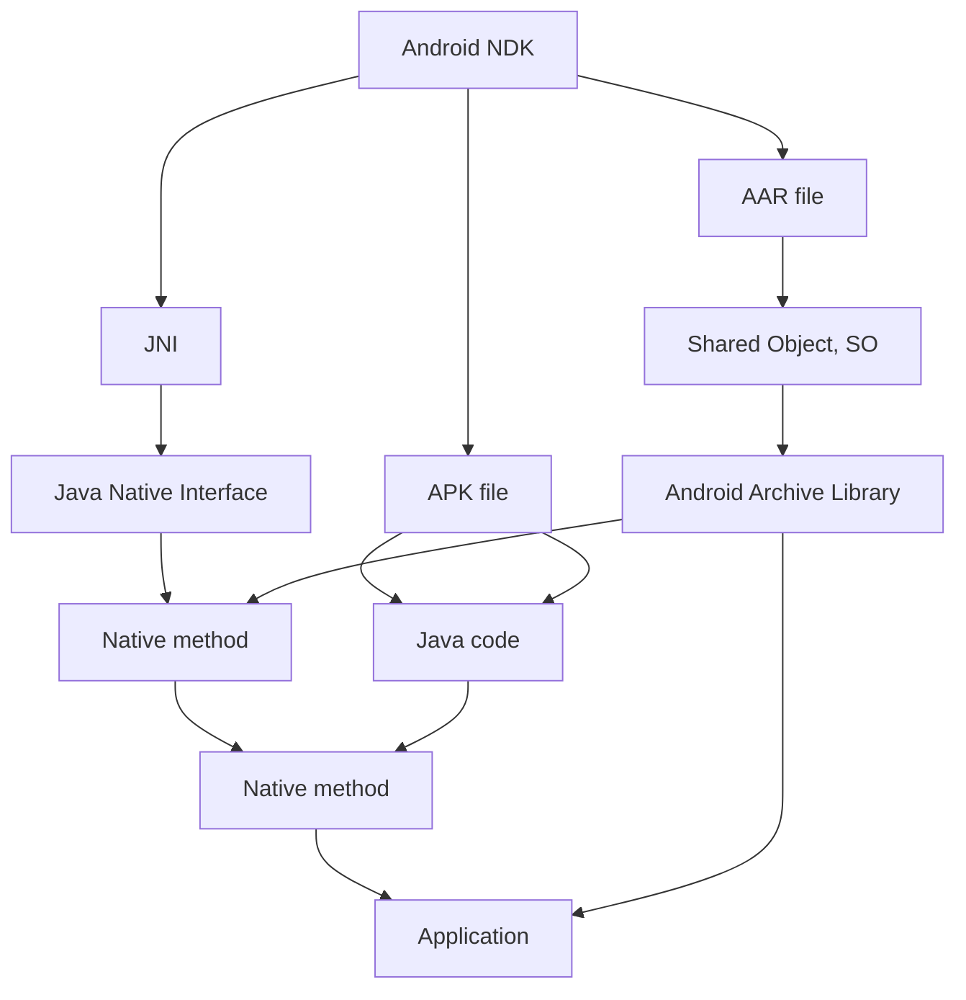

                 

# Android NDK原生开发

Android NDK（Native Development Kit）是Android平台提供的原生代码开发工具，它允许开发者使用C/C++等原生语言进行Android应用的底层开发。通过使用NDK，开发者可以更好地控制应用性能，访问硬件资源，提高应用的安全性和稳定性。本文将从背景介绍、核心概念与联系、核心算法原理与操作步骤、数学模型和公式、项目实践、实际应用场景、工具和资源推荐、总结与展望、附录等几个方面，深入探讨Android NDK原生开发的相关技术和实践。

## 1. 背景介绍

### 1.1 问题由来

Android平台的生态系统在不断增长，越来越多的开发者和企业选择基于Android构建应用程序。然而，由于Java平台的虚拟特性，在某些场景下，原生性能的追求显得尤为重要。为了实现对底层硬件的直接操作，提高应用的性能和效率，Android平台提供了NDK工具。

### 1.2 问题核心关键点

Android NDK的核心目标是允许开发者在Android平台上使用C/C++代码。它的主要优势包括：
- 提高性能：原生代码直接与硬件交互，比Java代码执行效率更高。
- 访问硬件资源：通过NDK，可以访问Android平台的底层硬件资源，如摄像头、传感器等。
- 安全性：原生代码在执行时，不需要经过Java虚拟机，可以更直接地访问内存，从而提高了应用的安全性。
- 兼容性：原生代码可以在多个平台上运行，不受Java版本限制。

这些优势使得Android NDK成为构建高性能、高安全性的Android应用不可或缺的工具。

## 2. 核心概念与联系

### 2.1 核心概念概述

为了更好地理解Android NDK原生开发，我们首先介绍几个关键概念：

- **Android NDK**：Android Native Development Kit，Android平台提供的原生代码开发工具。
- **JNI（Java Native Interface）**：Java和C/C++代码交互的桥梁。
- **APK文件**：Android应用程序包，包含Java代码和NDK生成的原生库。
- **AAR文件**：Android Archive库，用于模块化管理原生库。
- **SO文件**：Shared Object，原生库文件格式。
- **Gradle**：Android项目的构建工具，支持Java和原生代码的混合开发。

这些概念之间的联系可以通过以下Mermaid流程图来展示：



这个流程图展示了Android NDK在Android应用程序开发中的关键角色：

1. 通过JNI实现Java和原生代码的交互。
2. Java代码通过JNI调用原生方法。
3. 原生库打包到AAR文件中，用于模块化管理。
4. AAR文件打包到APK文件中，成为完整的Android应用程序。

## 3. 核心算法原理 & 具体操作步骤

### 3.1 算法原理概述

Android NDK原生开发的基本原理是通过JNI实现Java代码和C/C++代码的交互。JNI提供了Java虚拟机和C/C++代码之间的接口，使得两者可以无缝连接。Android NDK原生开发的流程大致分为以下几个步骤：

1. 编写Java代码，定义JNI接口。
2. 编写C/C++代码，实现JNI接口。
3. 打包原生库到AAR文件中。
4. 在Android项目中引入AAR文件，调用原生库中的方法。

### 3.2 算法步骤详解

#### 3.2.1 编写Java代码，定义JNI接口

在Java代码中，使用`native`关键字声明原生方法。例如：

```java
public class MainActivity {
    static {
        System.loadLibrary("mylibrary");
    }

    public native void init();

    public native void helloWorld();
}
```

在上述代码中，`init`和`helloWorld`是原生方法的名称，`mylibrary`是原生库的名称。

#### 3.2.2 编写C/C++代码，实现JNI接口

在C/C++代码中，实现上述声明的JNI接口。例如，在`mylibrary.c`文件中：

```c
#include <jni.h>

JNIEXPORT void JNICALL JavaMainActivity_init(JNIEnv* env, jobject obj) {
    // 初始化代码
}

JNIEXPORT void JNICALL JavaMainActivity_helloWorld(JNIEnv* env, jobject obj) {
    // 实现Java方法的调用
}
```

在上述代码中，`JNIEXPORT`是关键字，表示原生方法的返回类型和参数类型。`JavaMainActivity`是类名，`init`和`helloWorld`是方法名。

#### 3.2.3 打包原生库到AAR文件中

使用`ndk-build`命令生成原生库。例如，在`CMakeLists.txt`文件中：

```cmake
find_package(Android DEFAULT COMPONENTS NDK)
include(Android.mk)

define(LOCAL_PATH ${CMAKE_CURRENT_SOURCE_DIR})

include_directories(${LOCAL_PATH})

add_library(mylibrary SHARED ${LOCAL_PATH}/mylibrary.c)
```

在上述代码中，`add_library`命令定义了一个名为`mylibrary`的共享库。

生成原生库后，将其打包到AAR文件中。例如，在`build.gradle`文件中：

```groovy
dependencies {
    implementation(name: 'mylibrary', ext: 'aar')
}
```

#### 3.2.4 在Android项目中引入AAR文件，调用原生库中的方法

在Android项目的`build.gradle`文件中引入AAR文件：

```groovy
dependencies {
    implementation(name: 'mylibrary', ext: 'aar')
}
```

在Java代码中调用原生库中的方法：

```java
public class MainActivity {
    static {
        System.loadLibrary("mylibrary");
    }

    public native void init();

    public native void helloWorld();
}
```

在上述代码中，`System.loadLibrary`方法加载了原生库。

### 3.3 算法优缺点

Android NDK原生开发的主要优点包括：
- 提高性能：原生代码直接与硬件交互，比Java代码执行效率更高。
- 访问硬件资源：通过NDK，可以访问Android平台的底层硬件资源，如摄像头、传感器等。
- 安全性：原生代码在执行时，不需要经过Java虚拟机，可以更直接地访问内存，从而提高了应用的安全性。

但同时，Android NDK原生开发也存在一些缺点：
- 开发复杂度：NDK开发需要掌握C/C++和Java两种语言，开发难度较大。
- 兼容性问题：NDK开发可能导致应用在不同Android版本或设备上存在兼容性问题。
- 调试困难：原生代码的调试相对Java代码更为困难，需要借助调试工具进行调试。

### 3.4 算法应用领域

Android NDK原生开发在以下几个领域有广泛应用：

- 游戏开发：通过NDK可以实现高效的图形渲染和动画效果，提升游戏性能。
- 图像处理：NDK可以访问摄像头和传感器，进行实时图像处理。
- 传感器开发：通过NDK可以访问Android平台的传感器，实现各种传感器应用。
- 音频处理：NDK可以访问音频硬件，实现音频录制和播放。
- 实时音视频：通过NDK可以实现实时音视频的编码和解码。

## 4. 数学模型和公式 & 详细讲解 & 举例说明

本节将使用数学语言对Android NDK原生开发的相关概念进行更加严格的刻画。

### 4.1 数学模型构建

Android NDK原生开发的基本数学模型可以简单表示为：

$$
\text{Native Method} = \text{Java Code} \rightarrow \text{JNI} \rightarrow \text{C/C++ Code}
$$

其中，`Native Method`表示原生方法，`Java Code`表示Java代码，`JNI`表示Java Native Interface。

### 4.2 公式推导过程

Java代码通过JNI调用原生方法时，需要定义一个Java类和一个C/C++函数，并使用`System.loadLibrary`方法加载原生库。其基本过程如下：

1. 在Java代码中定义原生方法的声明：

   $$
   public native void myMethod(String str);
   $$

2. 在C/C++代码中定义原生方法的定义：

   $$
   JNIEXPORT void JNICALL JavaMainActivity_myMethod(JNIEnv* env, jobject obj, jstring str);
   $$

3. 在Java代码中使用`System.loadLibrary`方法加载原生库：

   $$
   System.loadLibrary("mylibrary");
   $$

4. 在C/C++代码中实现原生方法：

   $$
   JNIEXPORT void JNICALL JavaMainActivity_myMethod(JNIEnv* env, jobject obj, jstring str) {
       // 实现Java方法的调用
   }
   $$

### 4.3 案例分析与讲解

假设有一个简单的Java程序，调用一个名为`helloWorld`的Java方法，该方法通过JNI调用C/C++代码实现。其代码如下：

```java
public class MainActivity {
    static {
        System.loadLibrary("mylibrary");
    }

    public native void helloWorld();
}
```

在C/C++代码中实现`helloWorld`方法：

```c
#include <jni.h>

JNIEXPORT void JNICALL JavaMainActivity_helloWorld(JNIEnv* env, jobject obj) {
    // 实现Java方法的调用
}
```

## 5. 项目实践：代码实例和详细解释说明

### 5.1 开发环境搭建

为了搭建Android NDK原生开发环境，需要安装以下工具：

1. Android Studio：Android平台的集成开发环境。
2. JDK：Java开发所需的Java虚拟机。
3. NDK：Android Native Development Kit，用于生成原生代码。
4. Gradle：Android项目的构建工具。

### 5.2 源代码详细实现

#### 5.2.1 编写Java代码

在Java代码中定义JNI接口，并实现Java方法：

```java
public class MainActivity {
    static {
        System.loadLibrary("mylibrary");
    }

    public native void init();

    public native void helloWorld();
}
```

#### 5.2.2 编写C/C++代码

在C/C++代码中实现JNI接口：

```c
#include <jni.h>

JNIEXPORT void JNICALL JavaMainActivity_init(JNIEnv* env, jobject obj) {
    // 初始化代码
}

JNIEXPORT void JNICALL JavaMainActivity_helloWorld(JNIEnv* env, jobject obj) {
    // 实现Java方法的调用
}
```

#### 5.2.3 打包原生库到AAR文件中

使用`ndk-build`命令生成原生库：

```sh
ndk-build
```

将生成的主库文件`libmylibrary.so`打包到AAR文件中：

```sh
aapt package -a -f -u -b --repo /path/to/repo -j 4
```

### 5.3 代码解读与分析

通过NDK，Java代码可以调用原生库中的方法，从而提高应用的性能和安全性。在实现过程中，需要注意以下几个方面：

1. 定义JNI接口时，要确保Java代码和C/C++代码的接口名称、参数类型和返回类型一致。
2. 加载原生库时，要确保库文件的名称和路径正确。
3. 实现原生方法时，要确保代码的正确性和安全性。

### 5.4 运行结果展示

在Android Studio中运行程序，即可看到原生方法调用的结果。例如，在Java代码中调用`helloWorld`方法：

```java
MainActivity mainActivity = new MainActivity();
mainActivity.helloWorld();
```

## 6. 实际应用场景

### 6.1 游戏开发

Android NDK在游戏开发中具有广泛的应用，可以通过NDK实现高效的图形渲染和动画效果。例如，使用OpenGL ES和EGL库，可以实现3D图形渲染和动画特效，提升游戏的视觉效果和性能。

### 6.2 图像处理

通过NDK，可以实现对摄像头和传感器的访问，进行实时图像处理。例如，可以使用OpenCV库，实现图像增强、人脸识别等功能。

### 6.3 传感器开发

Android NDK可以实现对各种传感器数据的访问，例如加速度计、陀螺仪、磁力计等。这些传感器数据可以用于增强应用程序的功能，如计步器、游戏控制等。

### 6.4 音频处理

通过NDK，可以访问音频硬件，实现音频录制和播放。例如，可以使用OpenAL库，实现3D音频效果和空间音效。

### 6.5 实时音视频

Android NDK可以实现实时音视频的编码和解码，例如使用FFmpeg库，实现音视频的采集、编码和播放。

## 7. 工具和资源推荐

### 7.1 学习资源推荐

为了帮助开发者掌握Android NDK原生开发的相关知识和技能，这里推荐一些优质的学习资源：

1. Android Developer Guide：Android官方开发者文档，详细介绍了NDK的使用方法和API。
2. Udacity Android Developer Nanodegree：Udacity提供的Android开发者纳米学位课程，涵盖Android NDK的详细介绍和使用示例。
3. Android NDK Cookbook：Android NDK开发实战教程，涵盖NDK开发的基础知识和实践经验。
4. Android NDK API Reference：Android NDK的API文档，详细介绍了NDK的API和使用示例。

### 7.2 开发工具推荐

Android NDK开发需要使用一些工具，以下是几款常用的工具：

1. Android Studio：Android平台的集成开发环境，支持NDK开发。
2. Gradle：Android项目的构建工具，支持Java和原生代码的混合开发。
3. NDK：Android Native Development Kit，用于生成原生代码。
4. JDK：Java开发所需的Java虚拟机。
5. JUnit：Java单元测试框架，用于测试Java代码和原生代码的交互。

### 7.3 相关论文推荐

Android NDK原生开发涉及多个领域的技术，以下是几篇相关论文，推荐阅读：

1. "Android Native Development Kit: A Survey" by Q. Xiao et al.
2. "NDK Performance Optimization for Android Mobile Applications" by Y. Chen et al.
3. "Android NDK Security and Privacy: Challenges and Solutions" by X. Li et al.
4. "The Role of Native Development in Android Application Development" by T. Wang et al.
5. "NDK in Android Applications: A Practical Guide" by L. Zhang et al.

## 8. 总结：未来发展趋势与挑战

### 8.1 总结

本文从背景介绍、核心概念与联系、核心算法原理与操作步骤、数学模型和公式、项目实践、实际应用场景、工具和资源推荐、总结与展望、附录等几个方面，详细探讨了Android NDK原生开发的相关技术和实践。通过本文的系统梳理，可以看到，Android NDK原生开发已经成为Android平台开发的重要组成部分，其广泛的应用场景和重要的性能优势，使得开发者在开发高性能、高安全性的应用时，离不开NDK的支持。

### 8.2 未来发展趋势

展望未来，Android NDK原生开发将继续在Android平台中扮演重要的角色，并呈现以下几个发展趋势：

1. 更高效的原生库加载：Android NDK原生库的加载效率直接影响应用性能，未来将有更多优化手段，提升原生库加载速度。
2. 更完善的API支持：Android NDK的API将进一步完善，支持更多的原生库和工具，使得开发者能够更方便地进行NDK开发。
3. 更强大的性能优化：通过优化原生库的执行路径和内存管理，提升Android NDK应用的性能。
4. 更广泛的应用场景：随着Android NDK开发工具的不断完善，更多的开发者将使用NDK进行原生开发，从而拓展NDK应用场景。
5. 更友好的开发体验：通过优化工具链，提升Android NDK的开发效率和调试能力。

### 8.3 面临的挑战

尽管Android NDK原生开发已经取得了一定的成果，但在迈向更加智能化、普适化应用的过程中，它仍面临着诸多挑战：

1. 开发复杂度：NDK开发需要掌握C/C++和Java两种语言，开发难度较大。
2. 兼容性问题：NDK开发可能导致应用在不同Android版本或设备上存在兼容性问题。
3. 调试困难：原生代码的调试相对Java代码更为困难，需要借助调试工具进行调试。
4. 安全性问题：NDK开发可能导致应用的安全漏洞，需要严格的安全测试和防护。

### 8.4 研究展望

为了应对Android NDK原生开发所面临的挑战，未来的研究需要在以下几个方面寻求新的突破：

1. 开发工具的进一步完善：开发工具的优化和完善，将大大提升NDK开发的效率和质量。
2. 兼容性和安全性的提升：通过优化NDK的兼容性和安全性，提高应用的稳定性和安全性。
3. 跨平台开发的支持：通过跨平台开发工具，如Cordova、React Native等，提升NDK开发的灵活性。
4. 原生代码的性能优化：通过优化原生代码的执行路径和内存管理，提升应用的性能。
5. 应用场景的拓展：进一步拓展NDK的应用场景，提升其在各个领域的应用价值。

## 9. 附录：常见问题与解答

**Q1：Android NDK原生开发和Java开发有什么不同？**

A: Android NDK原生开发和Java开发的主要区别在于：
- 原生代码直接与硬件交互，Java代码通过虚拟机运行。
- 原生代码的开发复杂度较高，Java代码的开发相对简单。
- 原生代码的性能优于Java代码，但调试难度较大。

**Q2：Android NDK原生开发中，如何处理Java和C/C++代码的交互？**

A: Android NDK原生开发中，Java和C/C++代码的交互通过JNI实现。Java代码定义JNI接口，C/C++代码实现JNI接口，通过`System.loadLibrary`方法加载原生库，从而实现Java代码调用C/C++代码。

**Q3：Android NDK原生开发中，如何保证应用的安全性？**

A: 在Android NDK原生开发中，保证应用的安全性主要通过以下几个措施：
- 对原生库进行签名，防止恶意库的注入。
- 使用安全的内存管理技术，避免内存泄漏和缓冲区溢出等问题。
- 对敏感数据进行加密和解密，防止数据泄露。

**Q4：Android NDK原生开发中，如何进行调试？**

A: 在Android NDK原生开发中，可以使用Gradle工具进行调试。Gradle支持Java和原生代码的混合开发，可以方便地进行Java代码和原生代码的调试。

**Q5：Android NDK原生开发中，如何进行性能优化？**

A: 在Android NDK原生开发中，性能优化主要通过以下几个方面进行：
- 优化原生库的加载和卸载过程，减少内存消耗。
- 优化原生代码的执行路径，减少不必要的计算和操作。
- 使用线程池和异步处理，提高应用的响应速度和性能。

**Q6：Android NDK原生开发中，如何进行跨平台开发？**

A: 在Android NDK原生开发中，可以使用跨平台开发工具，如Cordova、React Native等，进行跨平台开发。这些工具可以将原生代码转换为跨平台的代码，从而提升NDK开发的灵活性和可移植性。

通过本文的系统梳理，可以看到，Android NDK原生开发已经成为Android平台开发的重要组成部分，其广泛的应用场景和重要的性能优势，使得开发者在开发高性能、高安全性的应用时，离不开NDK的支持。展望未来，Android NDK原生开发将继续在Android平台中扮演重要的角色，并呈现更高效、更完善的开发工具和更广泛的应用场景。然而，Android NDK原生开发也面临着开发复杂度、兼容性、调试困难等挑战，未来需要更多的研究和创新，才能进一步提升其开发效率和应用价值。

