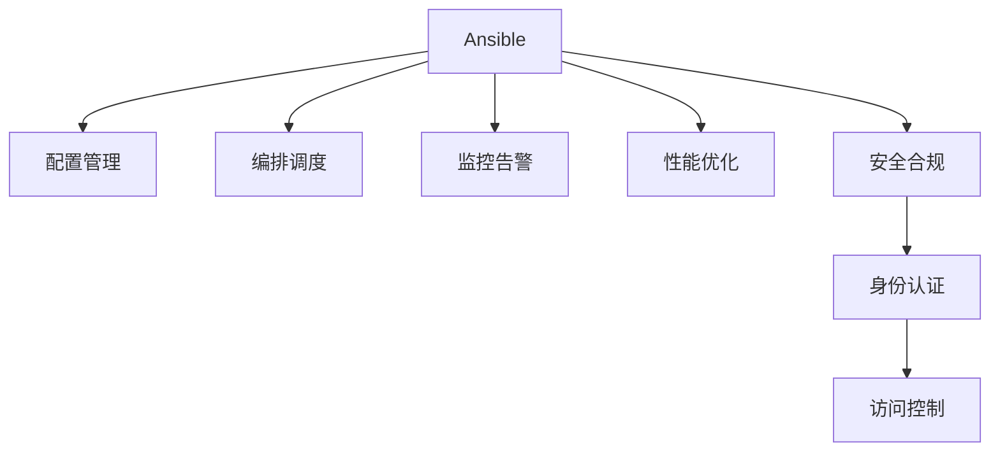

                 

## 1. 背景介绍

### 1.1 问题由来

随着信息技术在各行各业的应用不断深入，IT运维管理变得越来越复杂。企业需要管理的操作系统、网络设备、数据库、应用服务器、存储系统等基础设施的数量不断增加，维护工作量呈指数级增长。传统的手工运维方式不仅耗时耗力，还容易出错，影响了业务的稳定运行。自动化是解决这一问题的最佳途径，可以显著提高运维效率，减少人为错误。

### 1.2 问题核心关键点

IT运维自动化是目前IT领域的热点话题。自动化运维的核心在于减少人为操作，通过脚本、工具、配置管理等手段，实现系统管理的自动执行。自动化运维的关键包括：

- 配置管理：通过统一的配置管理，确保系统环境的一致性和可控性。
- 编排调度：实现任务自动化执行，支持多任务并发执行。
- 监控告警：实时监控系统运行状态，及时发现并处理异常。
- 性能优化：通过自动化测试和优化，提升系统性能和稳定性。
- 安全合规：自动化运维需要保证系统的安全性和合规性，符合企业安全标准和法规要求。

这些核心点构成了自动化运维的基本框架，是提高IT运维效率和质量的关键。

### 1.3 问题研究意义

自动化运维在提升IT运维效率、降低维护成本、保障系统稳定运行等方面具有重要意义：

- 降低维护成本。自动化运维可以大大减少人力投入，降低维护成本，提高企业盈利能力。
- 提升运维效率。通过自动化脚本和工具，可以快速响应故障，缩短问题解决时间，提升业务连续性。
- 保障系统稳定。自动化运维可以减少人为错误，提高系统稳定性和可靠性。
- 支持快速迭代。自动化运维支持快速部署和更新，支持业务的快速迭代和创新。
- 保障安全合规。自动化运维可以严格控制权限和操作，保障系统的安全性和合规性。

## 2. 核心概念与联系

### 2.1 核心概念概述

自动化运维的关键概念包括：

- Ansible：开源的自动化工具，支持通过SSH或本地执行命令的方式，实现对远程系统的管理。
- 配置管理：通过集中管理配置文件，确保系统环境的一致性。
- 编排调度：通过编排调度框架，实现任务的有序执行。
- 监控告警：通过监控工具，实时获取系统运行状态，及时发现异常并发出告警。
- 性能优化：通过自动化测试和优化工具，提升系统性能和稳定性。
- 安全合规：通过身份认证和访问控制，保障系统的安全性和合规性。

这些概念之间的逻辑关系可以通过以下Mermaid流程图来展示：



这个流程图展示了几大核心概念及其之间的关系：

1. Ansible作为自动化运维的工具，通过配置管理、编排调度、监控告警、性能优化、安全合规等模块支持自动化运维的各个方面。
2. 配置管理通过集中管理配置文件，确保系统环境的一致性。
3. 编排调度通过编排调度框架，实现任务的有序执行。
4. 监控告警通过监控工具，实时获取系统运行状态，及时发现异常并发出告警。
5. 性能优化通过自动化测试和优化工具，提升系统性能和稳定性。
6. 安全合规通过身份认证和访问控制，保障系统的安全性和合规性。

## 3. 核心算法原理 & 具体操作步骤

### 3.1 算法原理概述

Ansible的自动化运维过程可以抽象为以下几个步骤：

1. 定义自动化任务和配置。
2. 编排任务执行顺序。
3. 执行任务。
4. 监控任务状态。
5. 处理任务异常。

这些步骤可以通过Ansible的脚本、模板和插件来实现。Ansible的核心思想是通过一个中央仓库集中管理配置文件，通过编排调度框架实现任务的有序执行，并支持多任务并发执行。

### 3.2 算法步骤详解

以下是Ansible自动化运维的详细步骤：

**Step 1: 准备配置文件**

配置文件是Ansible自动化运维的基础。配置文件通常包括两个部分：主机列表和任务脚本。主机列表用于指定要管理的主机，任务脚本则用于定义具体的自动化任务。

1. 创建主机列表文件。主机列表文件通常包含要管理的所有主机的IP地址或主机名，例如：

   ```
   hosts:
     all:
       hosts:
         server1:
           ansible_host: 192.168.1.100
           ansible_user: root
           ansible_become_user: root
           ansible_become_pass: password
         server2:
           ansible_host: 192.168.1.101
           ansible_user: root
           ansible_become_user: root
           ansible_become_pass: password
   ```

   这个配置文件定义了两个主机，分别为server1和server2。

2. 创建任务脚本。任务脚本是实现具体自动化任务的代码，例如：

   ```
   - name: 安装Nginx
     apt:
       name: nginx
       state: latest
     running:
       command: systemctl status nginx
   ```

   这个任务脚本实现了在远程主机上安装Nginx服务，并检查服务状态的功能。

**Step 2: 编排任务执行顺序**

Ansible通过编排调度框架实现任务的有序执行。编排调度框架包括Playbook和角色。

1. Playbook：一个Playbook是一个或多个任务的集合，用于定义任务的执行顺序和依赖关系。例如：

   ```yaml
   ---
   - name: 自动化运维任务
     hosts: all
     roles:
       - server
       - web
   ```

   这个Playbook定义了两个角色，分别为server和web，并指定了任务执行的顺序。

2. 角色：角色是一组预定义的任务集合，用于实现特定的功能。例如：

   ```yaml
   ---
   name: web
     tasks:
       - name: 安装Nginx
         apt:
           name: nginx
           state: latest
         running:
           command: systemctl status nginx
       - name: 配置Nginx
         template:
           src: /path/to/nginx.conf
           dest: /etc/nginx/nginx.conf
   ```

   这个角色定义了两个任务，分别为安装Nginx服务和配置Nginx服务。

**Step 3: 执行任务**

通过Ansible命令执行Playbook文件，实现任务的执行。例如：

```bash
ansible-playbook playbook.yml
```

这个命令会执行playbook.yml文件中的任务，并输出执行结果。

**Step 4: 监控任务状态**

Ansible提供了一个监控工具，用于实时获取任务执行状态。例如：

```bash
ansible-playbook playbook.yml --监听
```

这个命令会启动一个监听任务，实时输出任务的执行状态和结果。

**Step 5: 处理任务异常**

Ansible提供了一个异常处理机制，用于处理任务执行过程中出现的异常。例如：

```yaml
- name: 安装Nginx
  apt:
    name: nginx
    state: latest
  running:
    command: systemctl status nginx
  ignore_errors: true
  notify:
    name: 异常通知
    message: 安装Nginx失败
```

这个任务脚本通过ignore_errors参数忽略了任务执行过程中的错误，并通过notify模块向指定用户发送异常通知。

### 3.3 算法优缺点

Ansible的自动化运维具有以下优点：

1. 简单易用。Ansible使用简单，不需要复杂的配置和命令，易于上手。
2. 跨平台支持。Ansible支持多种操作系统和网络协议，可以在多种环境中使用。
3. 高度可定制。Ansible提供了丰富的任务脚本和模块，可以灵活定制自动化任务。
4. 高度可扩展。Ansible可以与其他工具和系统集成，实现更复杂的自动化功能。
5. 高度可控。Ansible提供了详细的日志和输出，可以方便地进行问题诊断和调试。

Ansible也存在以下缺点：

1. 性能较低。Ansible的性能较低，适合小规模和简单任务的自动化，不适合大规模和复杂任务的自动化。
2. 依赖网络。Ansible依赖网络通信，网络不稳定时会导致任务执行失败。
3. 依赖SSH。Ansible依赖SSH协议，SSH协议的限制会影响任务的执行。
4. 依赖系统资源。Ansible需要占用大量系统资源，可能会影响系统性能。

尽管存在这些缺点，Ansible仍然是自动化运维领域的重要工具，得到了广泛的应用。

### 3.4 算法应用领域

Ansible的自动化运维技术在多个领域得到了广泛应用，例如：

- 服务器管理：通过Ansible管理多台服务器的配置和状态，实现系统升级和维护。
- 网络管理：通过Ansible管理网络设备和路由器的配置，实现网络自动化运维。
- 应用部署：通过Ansible管理应用的部署和更新，实现CI/CD流程的自动化。
- 数据库管理：通过Ansible管理数据库的配置和备份，实现数据库自动化运维。
- 安全管理：通过Ansible管理系统的安全配置和补丁更新，实现系统安全运维。

Ansible的自动化运维技术已经被广泛应用于云计算、大数据、互联网等众多领域，成为IT运维的重要工具。

## 4. 数学模型和公式 & 详细讲解 & 举例说明

### 4.1 数学模型构建

Ansible的自动化运维过程可以抽象为以下几个数学模型：

1. 主机列表模型：定义主机列表和主机的相关信息，例如IP地址、用户名等。

2. 任务脚本模型：定义具体的自动化任务，例如安装软件、配置文件等。

3. 编排调度模型：定义任务的执行顺序和依赖关系，例如Playbook和角色。

4. 任务执行模型：定义任务的执行方式和参数，例如命令执行、文件传输等。

5. 任务监控模型：定义任务的监控方式和告警机制，例如输出日志、邮件告警等。

这些模型通过Ansible的语法和命令实现，可以灵活配置和执行。

### 4.2 公式推导过程

以下是Ansible自动化运维的公式推导过程：

**主机列表模型**

定义主机列表和主机的相关信息，例如IP地址、用户名等。

```yaml
hosts:
  all:
    hosts:
      server1:
        ansible_host: 192.168.1.100
        ansible_user: root
        ansible_become_user: root
        ansible_become_pass: password
      server2:
        ansible_host: 192.168.1.101
        ansible_user: root
        ansible_become_user: root
        ansible_become_pass: password
```

**任务脚本模型**

定义具体的自动化任务，例如安装软件、配置文件等。

```yaml
tasks:
  - name: 安装Nginx
    apt:
      name: nginx
      state: latest
    running:
      command: systemctl status nginx
  - name: 配置Nginx
    template:
      src: /path/to/nginx.conf
      dest: /etc/nginx/nginx.conf
```

**编排调度模型**

定义任务的执行顺序和依赖关系，例如Playbook和角色。

```yaml
---
name: 自动化运维任务
hosts: all
roles:
  - server
  - web
```

**任务执行模型**

定义任务的执行方式和参数，例如命令执行、文件传输等。

```yaml
- name: 安装Nginx
  apt:
    name: nginx
    state: latest
  running:
    command: systemctl status nginx
```

**任务监控模型**

定义任务的监控方式和告警机制，例如输出日志、邮件告警等。

```yaml
- name: 安装Nginx
  apt:
    name: nginx
    state: latest
  running:
    command: systemctl status nginx
  ignore_errors: true
  notify:
    name: 异常通知
    message: 安装Nginx失败
```

### 4.3 案例分析与讲解

以安装Nginx服务的任务为例，说明Ansible的自动化运维过程：

1. 定义主机列表：

   ```yaml
   hosts:
     all:
       hosts:
         server1:
           ansible_host: 192.168.1.100
           ansible_user: root
           ansible_become_user: root
           ansible_become_pass: password
         server2:
           ansible_host: 192.168.1.101
           ansible_user: root
           ansible_become_user: root
           ansible_become_pass: password
   ```

2. 定义任务脚本：

   ```yaml
   ---
   name: 安装Nginx
   tasks:
     - name: 安装Nginx
       apt:
         name: nginx
         state: latest
       running:
         command: systemctl status nginx
     - name: 配置Nginx
       template:
         src: /path/to/nginx.conf
         dest: /etc/nginx/nginx.conf
   ```

3. 定义编排调度：

   ```yaml
   ---
   name: 自动化运维任务
   hosts: all
   roles:
     - server
     - web
   ```

4. 执行任务：

   ```bash
   ansible-playbook playbook.yml
   ```

5. 监控任务状态：

   ```bash
   ansible-playbook playbook.yml --监听
   ```

6. 处理任务异常：

   ```yaml
   - name: 安装Nginx
     - name: 安装Nginx
       apt:
         名

