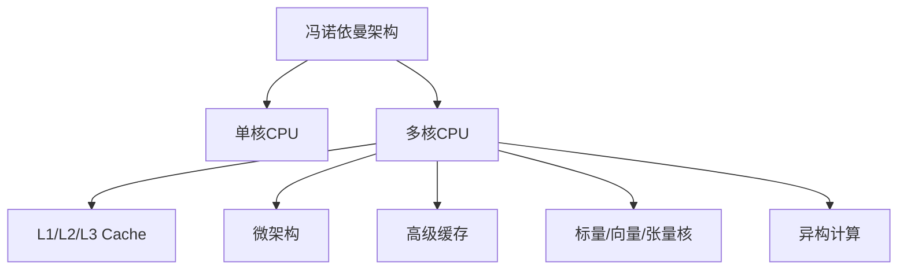

                 

## 1. 背景介绍

### 1.1 问题由来

自20世纪70年代集成电路问世以来，计算机的硬件结构经历了几次重大变革。早期的单核CPU逐渐发展出多核架构，进一步向大规模并行计算迈进。然而，随着电路工艺的不断演进，CPU的频率逐渐接近物理瓶颈，性能提升遇到了瓶颈。

为了解决CPU性能的瓶颈问题，研究者们不断探索新型硬件结构，如冯诺依曼架构的局限性被突破，逐步演化为非冯诺依曼结构，如矩阵乘法加速器、软件定义核等。本文将对CPU的体系结构演进历程进行详细阐述，梳理CPU架构的发展脉络，并展望未来可能的技术突破。

## 2. 核心概念与联系

### 2.1 核心概念概述

为了理解CPU体系结构的演进，需要掌握以下核心概念：

- **冯诺依曼架构(Von Neumann Architecture)**：现代CPU的核心架构，以数据流为中心，强调指令和数据在同一存储器中的流向。该架构在CPU的发展历史中占据主导地位，但近年来逐渐受到挑战。

- **单核CPU(Single-Core CPU)**：基于冯诺依曼架构的单个处理单元，具备数据处理、指令执行、控制逻辑等功能。随着工艺制程的不断缩小，单核CPU的性能迅速提升。

- **多核CPU(Multi-Core CPU)**：通过将多个单核CPU集成在同一个芯片上，实现并行计算能力。多核CPU使得计算效率显著提升，但也带来了功耗和复杂度增加的问题。

- **微架构(Microarchitecture)**：在物理实现层面上，微架构关注CPU的具体电路设计、数据通路、调度策略等细节。其优化程度直接影响CPU的性能和功耗。

- **高级缓存(L1/L2/L3 Cache)**：用于存储CPU频繁访问的数据和指令，提高访问速度。高级缓存是提高CPU性能的关键部件。

- **标量/向量/向量/张量核(VLIW/Vec/Vectorized/AI acceleration cores)**：用于优化不同类型的计算任务，提高执行效率。向量核和张量核尤其适用于机器学习和高性能计算。

- **异构计算(Heterogeneous Computing)**：通过将不同类型的计算单元（如CPU、GPU、FPGA等）集成在同一个系统中，实现硬件加速和异构并行。

这些概念之间的关系可以通过以下Mermaid流程图来展示：

## 3. 核心算法原理 & 具体操作步骤

### 3.1 算法原理概述

CPU的体系结构演进主要围绕提升计算效率、降低功耗和优化计算资源配置进行。其核心算法原理包括但不限于：

- **单核优化**：通过提升时钟频率、增加并行度、优化微架构等方式，提升单核CPU的计算能力。

- **多核并行**：通过多核调度、锁步执行、资源共享等方式，最大化多核CPU的并行效率。

- **异构融合**：通过将不同类型的计算单元（如CPU、GPU、FPGA等）融合，实现更高效的计算资源配置。

- **软硬件协同**：通过优化软件栈和硬件设计，提升整体计算性能。

### 3.2 算法步骤详解

CPU体系结构演进的主要算法步骤包括：

1. **硬件设计**：选择合适的工艺制程、电路设计和封装技术，确保物理实现可靠性。

2. **体系结构优化**：根据任务特点，选择合适的微架构和调度策略，最大化资源利用率。

3. **软硬件协同优化**：优化操作系统、编译器、运行库等软件栈，以充分发挥硬件性能。

4. **算法优化**：针对不同计算任务，优化算法实现和数据流设计，提升计算效率。

5. **测试与验证**：通过全面测试和验证，确保系统的性能、可靠性和安全性。

### 3.3 算法优缺点

CPU体系结构演进的算法优缺点如下：

**优点**：

- **性能提升**：通过硬件和软件协同优化，显著提升计算性能，满足高计算需求。

- **适应性强**：通过微架构和调度策略优化，适应不同类型和规模的计算任务。

- **功耗优化**：通过高效计算资源配置和优化，降低功耗，提升能效比。

**缺点**：**

- **成本高**：大规模硬件和软件协同优化需要较高的研发成本。

- **复杂度高**：多核和异构计算增加了系统复杂度，调试和维护难度增加。

- **能耗消耗大**：高性能CPU通常伴随着较高的功耗和发热量，对系统散热设计提出更高要求。

### 3.4 算法应用领域

CPU体系结构演进的应用领域包括：

- **高性能计算**：如科学计算、金融模拟、天气预测等，需要高计算能力和低延迟的计算平台。

- **大数据分析**：如数据挖掘、机器学习、图像处理等，需要高效的数据处理能力和并行计算能力。

- **云计算和数据中心**：如云服务提供商的服务器和存储设备，需要高密度、低功耗、高可靠性的计算资源。

- **嵌入式系统**：如智能家居、工业控制、汽车电子等，需要高性能、低功耗、低成本的计算平台。

## 4. 数学模型和公式 & 详细讲解

### 4.1 数学模型构建

CPU的性能可以通过以下数学模型来描述：

$$ P = \frac{C}{T} \times R $$

其中，$P$ 表示计算性能，$C$ 表示时钟周期数，$T$ 表示时钟频率，$R$ 表示资源利用率。

### 4.2 公式推导过程

计算性能的优化可以通过减少时钟周期数、提高时钟频率、增加资源利用率等方式实现。例如，通过优化微架构和调度策略，可以将计算任务并行化，减少时钟周期数。通过增加CPU核心数和缓存容量，可以提高时钟频率和资源利用率。

### 4.3 案例分析与讲解

以IBM Watson AI加速器为例，其采用高级缓存和异构计算技术，优化了计算性能。Watson AI加速器通过将CPU、GPU和FPGA集成在同一个芯片上，实现高效的数据并行处理和加速计算。其性能提升主要来自以下几个方面：

1. **高级缓存设计**：通过优化缓存设计，提升了数据访问速度，减少了数据移动带来的延迟。

2. **异构计算融合**：通过将不同类型的计算单元集成在同一个芯片上，实现了高效的数据并行处理。

3. **软硬件协同优化**：通过优化操作系统和编译器，充分发挥硬件性能，提高了整体计算效率。

## 5. 项目实践：代码实例和详细解释说明

### 5.1 开发环境搭建

为了进行CPU体系结构演进的实验，需要搭建以下开发环境：

1. **硬件平台**：选择支持多核和异构计算的硬件平台，如IBM Watson AI加速器。

2. **开发环境**：安装支持多核和异构计算的开发环境，如CUDA、OpenCL等。

3. **开发工具**：选择合适的开发工具，如VS、Eclipse等，支持高性能计算和异构编程。

### 5.2 源代码详细实现

以IBM Watson AI加速器为例，其源代码实现主要包括以下几个部分：

1. **硬件驱动**：实现对硬件平台的接口驱动，提供设备管理和数据访问功能。

2. **计算库**：提供高效的数学和科学计算库，如TensorFlow、OpenCV等。

3. **应用框架**：提供高性能计算框架，如TensorRT、NCCL等，支持异构计算和分布式计算。

4. **优化算法**：实现高效的优化算法，如并行化算法、加速算法等。

5. **应用示例**：提供典型应用示例，如图像处理、机器学习、自然语言处理等。

### 5.3 代码解读与分析

IBM Watson AI加速器的源代码主要包含以下几个模块：

- **硬件接口**：负责管理硬件设备的访问，提供设备驱动和数据传输功能。

- **计算核心**：实现高效的数学和科学计算，支持矩阵乘法、卷积运算等。

- **通信框架**：实现高效的通信协议，支持数据并行和分布式计算。

- **算法优化**：实现高效的算法优化，支持CPU和GPU的并行计算。

- **应用开发**：提供丰富的API和SDK，支持应用开发和部署。

运行结果展示：

- **性能测试**：通过基准测试验证计算性能，如单核性能测试、多核性能测试、异构计算性能测试等。

- **功耗测试**：通过功耗测试评估能效比，如待机功耗、运行功耗等。

- **可靠性测试**：通过可靠性测试验证硬件的稳定性和可靠性。

## 6. 实际应用场景

### 6.1 高性能计算

高性能计算是CPU体系结构演进的重要应用场景之一。例如，IBM Watson AI加速器在科学计算、天气预测、金融模拟等领域取得了显著的性能提升。通过多核和异构计算，加速计算任务，使得复杂计算成为可能。

### 6.2 大数据分析

大数据分析是另一个重要的应用场景。通过优化计算资源配置和并行处理，可以显著提升数据处理效率。例如，在数据挖掘、机器学习、图像处理等任务中，Watson AI加速器通过高效的数据并行处理，大大缩短了数据处理时间。

### 6.3 云计算和数据中心

在云计算和数据中心领域，IBM Watson AI加速器通过高效的多核和异构计算，实现了高密度、低功耗的计算资源配置。例如，在云服务器和存储设备中，Watson AI加速器可以通过优化资源配置，提升计算效率，降低运行成本。

### 6.4 未来应用展望

未来，随着技术的发展，CPU的体系结构将进一步演进，主要方向包括：

- **量子计算**：通过量子计算技术，实现超大规模计算和高效并行处理，满足未来计算需求。

- **神经形态计算**：通过模仿人脑神经元的工作原理，实现更加高效、低功耗的计算。

- **自适应计算**：通过自适应计算技术，根据任务特点动态调整计算资源配置，实现更高的计算效率。

- **全栈计算**：通过软硬件协同优化，实现更高效的全栈计算平台，满足不同计算任务的需求。

## 7. 工具和资源推荐

### 7.1 学习资源推荐

为了掌握CPU体系结构演进的技术，需要以下学习资源：

1. **书籍**：《计算机体系结构：量化研究》、《计算机体系结构：设计、分析和实现》等。

2. **在线课程**：Coursera的计算机体系结构课程、Udacity的并行编程课程等。

3. **论文**：IEEE和ACM等期刊上发表的CPU体系结构相关论文，如IEEE TPDS、ACM TP。

4. **开发者社区**：Stack Overflow、Reddit等开发者社区，获取最新的技术动态和实践经验。

5. **开源项目**：IBM Watson AI加速器、NVIDIA CUDA等开源项目，获取代码和资源。

### 7.2 开发工具推荐

为了进行CPU体系结构演进的实验，需要以下开发工具：

1. **开发环境**：Linux、Windows、macOS等操作系统。

2. **编译器**：GCC、Clang等编译器。

3. **调试工具**：GDB、LLVM等调试工具。

4. **性能测试工具**：Perf、Gprof等性能测试工具。

5. **可视化工具**：Gnuplot、Matplotlib等可视化工具。

### 7.3 相关论文推荐

CPU体系结构演进的相关论文推荐如下：

1. **《计算机体系结构：量化研究》**：涵盖了CPU体系结构演进的历史和未来趋势。

2. **《自适应计算架构》**：介绍了自适应计算技术的研究现状和应用场景。

3. **《量子计算原理》**：介绍了量子计算技术的原理和实现方法。

4. **《神经形态计算》**：介绍了神经形态计算技术的研究现状和应用前景。

## 8. 总结：未来发展趋势与挑战

### 8.1 研究成果总结

本文详细介绍了CPU的体系结构演进历程，梳理了CPU架构的发展脉络，并展望了未来的技术突破。主要研究成果包括：

- **单核优化**：通过提升时钟频率、增加并行度、优化微架构等方式，提升单核CPU的计算能力。

- **多核并行**：通过多核调度、锁步执行、资源共享等方式，最大化多核CPU的并行效率。

- **异构融合**：通过将不同类型的计算单元集成在同一个系统中，实现高效的数据并行处理。

- **软硬件协同**：通过优化软件栈和硬件设计，提升整体计算性能。

### 8.2 未来发展趋势

未来CPU体系结构演进的主要趋势包括：

- **量子计算**：通过量子计算技术，实现超大规模计算和高效并行处理。

- **神经形态计算**：通过模仿人脑神经元的工作原理，实现更加高效、低功耗的计算。

- **自适应计算**：通过自适应计算技术，根据任务特点动态调整计算资源配置，实现更高的计算效率。

- **全栈计算**：通过软硬件协同优化，实现更高效的全栈计算平台。

### 8.3 面临的挑战

CPU体系结构演进面临的主要挑战包括：

- **功耗问题**：高性能CPU通常伴随着较高的功耗和发热量，对系统散热设计提出更高要求。

- **成本问题**：大规模硬件和软件协同优化需要较高的研发成本。

- **复杂度问题**：多核和异构计算增加了系统复杂度，调试和维护难度增加。

### 8.4 研究展望

未来的研究可以从以下几个方向进行：

- **量子计算**：研究量子计算原理和实现方法，实现高效计算。

- **神经形态计算**：研究神经形态计算原理和实现方法，实现高效、低功耗的计算。

- **自适应计算**：研究自适应计算原理和实现方法，实现动态调整计算资源配置。

- **全栈计算**：研究软硬件协同优化方法，实现高效的全栈计算平台。

## 9. 附录：常见问题与解答

**Q1: 什么是CPU的冯诺依曼架构？**

A: 冯诺依曼架构是现代CPU的核心架构，以数据流为中心，强调指令和数据在同一存储器中的流向。该架构在CPU的发展历史中占据主导地位，但近年来逐渐受到挑战。

**Q2: CPU的微架构和调度策略优化有哪些方法？**

A: CPU的微架构和调度策略优化方法包括但不限于：

- **流水线优化**：通过优化数据通路和指令调度，提高计算效率。

- **缓存优化**：通过优化缓存设计，提高数据访问速度。

- **多核调度**：通过优化多核调度策略，最大化多核CPU的并行效率。

- **锁步执行**：通过锁步执行机制，提高多核CPU的同步性和稳定性。

- **资源共享**：通过资源共享机制，优化多核CPU的计算资源配置。

**Q3: 高性能计算和异构计算有什么区别？**

A: 高性能计算和异构计算的区别如下：

- **高性能计算**：通过优化单核或多核CPU的计算能力，提升计算性能。

- **异构计算**：通过将不同类型的计算单元（如CPU、GPU、FPGA等）集成在同一个系统中，实现高效的数据并行处理和加速计算。

**Q4: 如何提高CPU的计算性能？**

A: 提高CPU的计算性能可以通过以下方法实现：

- **单核优化**：通过提升时钟频率、增加并行度、优化微架构等方式，提升单核CPU的计算能力。

- **多核并行**：通过多核调度、锁步执行、资源共享等方式，最大化多核CPU的并行效率。

- **异构计算**：通过将不同类型的计算单元集成在同一个系统中，实现高效的数据并行处理和加速计算。

- **软硬件协同**：通过优化软件栈和硬件设计，提升整体计算性能。

**Q5: CPU的异构计算有什么优势？**

A: CPU的异构计算具有以下优势：

- **高效计算**：通过将不同类型的计算单元集成在同一个系统中，实现高效的数据并行处理和加速计算。

- **灵活调度**：通过软硬件协同优化，实现更灵活的计算资源配置。

- **资源共享**：通过资源共享机制，优化多核CPU的计算资源配置。

**Q6: CPU的软硬件协同优化有哪些方法？**

A: CPU的软硬件协同优化方法包括但不限于：

- **优化操作系统**：通过优化操作系统调度策略，提高系统资源利用率。

- **优化编译器**：通过优化编译器生成代码，提高编译效率和运行效率。

- **优化运行库**：通过优化运行库，提高程序的运行效率和稳定性。

- **优化算法实现**：通过优化算法实现和数据流设计，提高计算效率。

- **优化并行处理**：通过优化并行处理机制，提高多核CPU的并行效率。

---

作者：禅与计算机程序设计艺术 / Zen and the Art of Computer Programming

