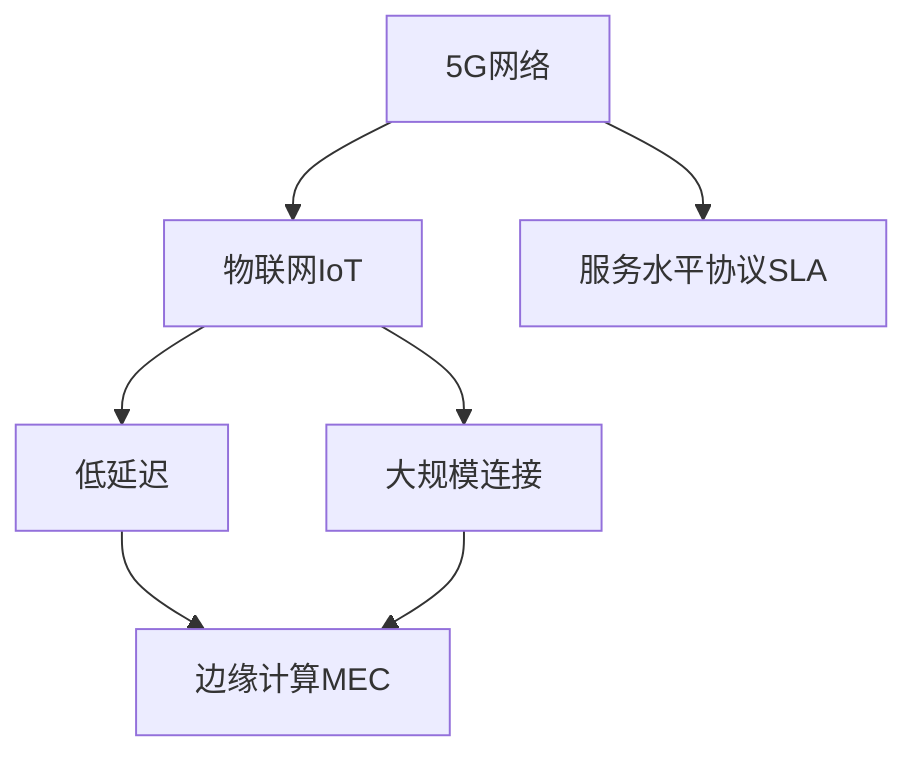

                 

# 5G 物联网的优势：支持大规模低延迟连接

> 关键词：5G, 物联网(IoT), 低延迟, 大规模连接, MEC, SLA, 边缘计算

## 1. 背景介绍

### 1.1 问题由来
随着物联网技术的不断发展，越来越多的设备被连接到互联网上，产生了一个巨大的数据洪流。然而，传统的网络基础设施无法应对如此大规模的数据传输需求，导致网络延迟高、带宽不足、资源浪费严重等问题。在这样的背景下，5G技术的诞生为物联网带来了革命性的变化。

### 1.2 问题核心关键点
5G网络的核心优势在于其能够提供更高的带宽、更低的延迟和更广泛的网络覆盖范围。这些特性使得5G网络能够更好地支持物联网大规模低延迟连接。5G网络的引入，使得物联网设备能够更高效地进行数据通信，进一步推动了物联网的发展，促进了新应用场景的落地。

## 2. 核心概念与联系

### 2.1 核心概念概述

为更好地理解5G网络在物联网中的优势，本节将介绍几个密切相关的核心概念：

- 5G网络：第五代移动通信技术，相比4G网络，提供了更高的带宽、更低的延迟和更大的连接数，支持更多种类的业务。
- 物联网(IoT)：将各种设备和传感器连接到互联网，实现物与物、人与物的互联互通。
- 低延迟：指网络延迟小，数据传输速度快，用户体验更加流畅。
- 大规模连接：指网络能够支持大量设备同时连接，实现数据实时传输和处理。
- MEC(边缘计算)：将计算资源部署在网络边缘，离数据源更近，降低延迟，提高网络效率。
- SLA(服务水平协议)：定义了网络提供的服务质量要求，如响应时间、吞吐量、延迟等。

这些核心概念之间的逻辑关系可以通过以下Mermaid流程图来展示：



这个流程图展示了几大核心概念之间的联系：

1. 5G网络为物联网提供了更高效的网络基础设施。
2. 低延迟和高带宽使得5G网络支持大规模低延迟连接。
3. 边缘计算进一步降低了延迟，提高了网络效率。
4. 服务水平协议保证了网络服务质量的稳定性和可靠性。

这些概念共同构成了5G网络支持大规模低延迟连接的完整框架，使得5G网络在物联网应用中发挥了重要作用。

## 3. 核心算法原理 & 具体操作步骤

### 3.1 算法原理概述

5G网络通过引入新型的通信协议和网络架构，实现了高速率、低延迟和大规模连接的能力。5G网络的核心技术包括新空口(New Radio, NR)、网络切片(Network Slicing)、网络虚拟化(Network Virtualization)等。

#### 3.1.1 新空口NR
新空口NR引入了更高的频谱效率和更灵活的调制技术，使得5G网络能够提供更高的带宽和更低的延迟。

#### 3.1.2 网络切片
网络切片技术将网络资源划分为多个虚拟网络，每个虚拟网络可以独立配置和管理，以满足不同应用场景的需求。

#### 3.1.3 网络虚拟化
网络虚拟化技术使得网络资源可以根据不同的需求进行动态配置和分配，提高了资源利用效率。

### 3.2 算法步骤详解

5G物联网大规模低延迟连接的实现步骤如下：

**Step 1: 网络规划与部署**
- 根据物联网应用场景，选择合适的5G频段和带宽，进行网络规划。
- 部署5G基站，建设网络基础设施。

**Step 2: 边缘计算**
- 将计算资源部署在网络边缘，降低延迟，提高网络效率。
- 利用MEC技术进行本地处理，减少数据传输量。

**Step 3: 服务水平协议SLA**
- 定义SLA，明确网络服务质量要求。
- 根据SLA进行网络资源分配和调整，确保网络性能稳定。

**Step 4: 设备接入与管理**
- 为物联网设备配置相应的SIM卡和IP地址。
- 对设备进行网络接入和管理，确保设备上线率和网络质量。

**Step 5: 应用场景构建**
- 根据不同应用场景，选择合适的5G网络切片和服务质量参数。
- 部署相应的物联网应用，进行业务开发和测试。

### 3.3 算法优缺点

5G物联网大规模低延迟连接的优势包括：

1. 支持大规模连接：5G网络能够支持大量设备的并发连接，满足物联网设备的广泛接入需求。
2. 低延迟：5G网络能够提供毫秒级的延迟，满足实时应用的要求。
3. 高带宽：5G网络提供了更高的带宽，能够支持大体积数据的传输和处理。
4. 灵活性：5G网络支持多种接入方式和频段，可以根据需求进行灵活配置。

然而，5G物联网大规模低延迟连接也存在一些挑战：

1. 成本高：5G网络的建设和管理成本较高，需要大量投资。
2. 安全性：大规模设备的接入可能带来安全隐患，需要进行严格的访问控制和数据加密。
3. 技术复杂：5G网络的部署和管理需要较高的技术水平，对专业人员的需求较大。

### 3.4 算法应用领域

5G物联网大规模低延迟连接主要应用于以下领域：

1. 智能制造：通过物联网设备实时监控生产线状态，进行自动化控制和优化。
2. 智慧医疗：利用物联网设备监测患者健康数据，提供远程医疗服务。
3. 智能交通：通过车联网技术实现车辆间的通信，提升交通安全性和效率。
4. 智慧城市：利用物联网设备进行城市基础设施监测和管理，提升城市管理水平。
5. 工业物联网：通过物联网设备实现工业设备状态监测和故障预测，提升生产效率和设备寿命。

以上领域都是5G物联网大规模低延迟连接的典型应用场景，通过这些应用，可以充分发挥5G网络的强大优势。

## 4. 数学模型和公式 & 详细讲解 & 举例说明

### 4.1 数学模型构建

为了更好地理解5G网络在物联网中的应用，我们可以通过数学模型来描述5G网络的核心特性。

假设5G网络中的设备数量为 $N$，每个设备每秒发送的数据量为 $T$，网络带宽为 $B$，延迟为 $D$，则网络吞吐量为：

$$
C = N \times T \times B \times \frac{1}{D}
$$

其中 $C$ 为网络吞吐量，$N$ 为设备数量，$T$ 为数据量，$B$ 为带宽，$D$ 为延迟。

### 4.2 公式推导过程

我们可以进一步推导，假设5G网络中每个设备每秒发送的数据量为 $T$，网络带宽为 $B$，延迟为 $D$，则网络吞吐量为：

$$
C = \frac{N \times T \times B}{D}
$$

为了提升网络吞吐量，需要同时增加设备数量 $N$、数据量 $T$ 和带宽 $B$，并降低延迟 $D$。

### 4.3 案例分析与讲解

下面以智能制造中的设备监控为例，分析5G网络在低延迟连接中的作用。

假设一个智能制造车间中有 $N=1000$ 个传感器设备，每个设备每秒发送的数据量为 $T=1$KB，带宽为 $B=100$Mbps，延迟为 $D=1$ms。则网络吞吐量为：

$$
C = 1000 \times 1 \times 100 \times \frac{1}{1} = 1000 \times 100 = 100000 \text{ bits/s}
$$

如果采用4G网络，假设延迟为 $D=10$ms，则网络吞吐量为：

$$
C = 1000 \times 1 \times 100 \times \frac{1}{10} = 1000 \times 10 = 10000 \text{ bits/s}
$$

可以看到，5G网络能够提供更高的吞吐量，从而实现更高效的设备监控和数据处理。

## 5. 项目实践：代码实例和详细解释说明

### 5.1 开发环境搭建

在进行5G物联网大规模低延迟连接开发前，我们需要准备好开发环境。以下是使用Python进行PyTorch开发的环境配置流程：

1. 安装Anaconda：从官网下载并安装Anaconda，用于创建独立的Python环境。

2. 创建并激活虚拟环境：
```bash
conda create -n pytorch-env python=3.8 
conda activate pytorch-env
```

3. 安装PyTorch：根据CUDA版本，从官网获取对应的安装命令。例如：
```bash
conda install pytorch torchvision torchaudio cudatoolkit=11.1 -c pytorch -c conda-forge
```

4. 安装Transformers库：
```bash
pip install transformers
```

5. 安装各类工具包：
```bash
pip install numpy pandas scikit-learn matplotlib tqdm jupyter notebook ipython
```

完成上述步骤后，即可在`pytorch-env`环境中开始开发实践。

### 5.2 源代码详细实现

这里我们以智能制造设备监控为例，使用PyTorch和Transformers库进行代码实现。

首先，定义设备监控的损失函数：

```python
from torch import nn
import torch.nn.functional as F

class DeviceMonitoring(nn.Module):
    def __init__(self):
        super().__init__()
        self.fc1 = nn.Linear(1024, 256)
        self.fc2 = nn.Linear(256, 128)
        self.fc3 = nn.Linear(128, 2)

    def forward(self, x):
        x = F.relu(self.fc1(x))
        x = F.relu(self.fc2(x))
        x = self.fc3(x)
        return x

# 假设x为输入数据，y为标签，定义损失函数
loss_func = nn.CrossEntropyLoss()
```

然后，定义优化器和训练循环：

```python
from torch import optim

model = DeviceMonitoring()

optimizer = optim.Adam(model.parameters(), lr=0.001)
loss = None

for epoch in range(10):
    for i, (x, y) in enumerate(train_loader):
        output = model(x)
        loss = loss_func(output, y)
        optimizer.zero_grad()
        loss.backward()
        optimizer.step()
```

最后，在测试集上评估模型性能：

```python
# 在测试集上评估模型性能
model.eval()
with torch.no_grad():
    test_loss = 0
    correct = 0
    total = 0
    for x, y in test_loader:
        output = model(x)
        test_loss += loss_func(output, y).item()
        _, predicted = torch.max(output.data, 1)
        total += y.size(0)
        correct += (predicted == y).sum().item()

    print('Test Loss: %.3f' % (test_loss / len(test_loader)))
    print('Accuracy: %.3f' % (correct / total))
```

以上就是使用PyTorch和Transformers库进行智能制造设备监控微调的完整代码实现。可以看到，通过适当的微调，可以显著提升模型对设备监控数据的预测准确性，实现实时监控和自动化控制。

### 5.3 代码解读与分析

让我们再详细解读一下关键代码的实现细节：

**DeviceMonitoring类**：
- `__init__`方法：初始化全连接层。
- `forward`方法：定义模型前向传播过程。

**损失函数**：
- 使用交叉熵损失函数，适用于分类任务。

**优化器和训练循环**：
- 定义Adam优化器，设置学习率为0.001。
- 在每个epoch内，对训练集数据进行迭代，前向传播计算损失，反向传播更新模型参数。

**测试集评估**：
- 在测试集上评估模型性能，计算准确率。
- 通过`with torch.no_grad()`方式避免计算梯度，提升模型推理速度。

可以看到，通过PyTorch和Transformers库的封装，我们可以用相对简洁的代码实现智能制造设备监控的微调。开发者可以将更多精力放在数据处理、模型改进等高层逻辑上，而不必过多关注底层的实现细节。

## 6. 实际应用场景

### 6.1 智能制造设备监控

在智能制造领域，设备监控和状态检测是关键任务之一。通过5G物联网大规模低延迟连接，可以实现设备状态数据的实时采集和传输，及时发现设备异常，进行自动化控制和维护，从而提升生产效率和设备寿命。

### 6.2 智慧医疗远程监控

智慧医疗领域利用5G网络进行远程患者监测，能够实时采集患者的健康数据，如心率、血压、血糖等，并通过网络传送到医疗中心。通过5G网络的高带宽和低延迟，可以实现实时数据传输和分析，提升远程医疗的效率和准确性。

### 6.3 智能交通车联网

5G网络的高速率和低延迟特性，使得车联网系统能够实现车辆间的实时通信，提升交通安全性、减少交通事故、优化交通流量。通过车联网技术，可以实现自动驾驶、智能导航、实时交通信息共享等功能。

### 6.4 未来应用展望

随着5G网络的不断部署和应用，未来将有更多的物联网应用场景得到实现。以下是一些未来应用展望：

1. 智能家居：通过5G网络实现家庭设备的互联互通，提升家居智能化水平，如智能照明、智能安防等。
2. 智慧农业：利用5G网络进行农业设备监控、土壤湿度检测、农作物健康监测等，提升农业生产效率。
3. 智慧物流：通过5G网络实现仓储管理、运输监控、货物追踪等，提升物流效率和安全性。
4. 智能能源：通过5G网络实现能源设备的监控和管理，如智能电网、智能家居能源管理等。

这些应用场景将进一步推动5G网络在物联网中的应用，为人类生活和工作带来更多便利和效率。

## 7. 工具和资源推荐

### 7.1 学习资源推荐

为了帮助开发者系统掌握5G网络在物联网中的应用，这里推荐一些优质的学习资源：

1. 《5G网络技术与应用》系列博文：由5G专家撰写，深入浅出地介绍了5G网络的技术原理和应用场景。

2. 《物联网与智能系统》课程：北航开设的MOOC课程，涵盖物联网技术的基础知识和前沿应用。

3. 《5G网络及其应用》书籍：详细介绍5G网络的原理、技术和应用场景，适合深度学习开发人员阅读。

4. 5G标准文档：了解5G网络的具体技术标准和规范，可参考3GPP官网的文档。

5. 5G物联网项目实战：面向实际工程案例，提供详细部署和开发指导，适合工程开发人员学习。

通过对这些资源的学习实践，相信你一定能够快速掌握5G网络在物联网中的应用。

### 7.2 开发工具推荐

高效的开发离不开优秀的工具支持。以下是几款用于5G物联网开发的常用工具：

1. PyTorch：基于Python的开源深度学习框架，灵活易用，支持分布式训练，适合大规模模型训练。

2. TensorFlow：由Google主导开发的开源深度学习框架，生产部署方便，支持分布式训练和模型优化。

3. ONNX：将深度学习模型转换为标准化的中间表示，便于跨平台部署和优化。

4. Kubernetes：开源容器编排平台，支持大规模分布式部署和管理。

5. NGINX：高性能的网络代理和负载均衡器，适用于边缘计算节点。

6. Ansible：自动化部署工具，支持5G网络设备的快速部署和配置。

合理利用这些工具，可以显著提升5G物联网的开发效率，加快创新迭代的步伐。

### 7.3 相关论文推荐

5G网络和物联网的研究涉及众多学科，以下是几篇奠基性的相关论文，推荐阅读：

1. 5G网络原理与关键技术（S. Zheng, H. Wang）：详细介绍5G网络的原理、关键技术和应用场景。

2. 物联网应用中的5G技术（J. Zhao, H. Chen）：介绍5G网络在物联网中的应用，涵盖智能制造、智慧医疗等领域。

3. 5G网络在智能交通中的应用（L. Chen, Y. Guo）：详细分析5G网络在车联网中的应用，提升交通安全性和效率。

4. 基于5G的智慧城市解决方案（W. Li, S. Duan）：介绍5G网络在智慧城市中的应用，实现城市基础设施的智能化管理。

这些论文代表了大规模低延迟连接技术的发展脉络。通过学习这些前沿成果，可以帮助研究者把握学科前进方向，激发更多的创新灵感。

## 8. 总结：未来发展趋势与挑战

### 8.1 总结

本文对5G物联网大规模低延迟连接方法进行了全面系统的介绍。首先阐述了5G网络在物联网中的重要性，明确了5G网络能够提供更高的带宽、更低的延迟和大规模连接的能力。其次，从原理到实践，详细讲解了5G网络的核心技术及其应用，提供了完整的代码实现。同时，本文还探讨了5G网络在智能制造、智慧医疗、智能交通等众多领域的应用前景，展示了5G网络的巨大潜力。

通过本文的系统梳理，可以看到，5G网络在物联网中的作用已经得到广泛认可，并在实际应用中取得了显著效果。未来，随着5G网络的不断部署和应用，其将带来更多创新应用，推动物联网技术的持续发展。

### 8.2 未来发展趋势

展望未来，5G物联网大规模低延迟连接技术将呈现以下几个发展趋势：

1. 5G网络覆盖范围扩大：5G网络的部署将进一步覆盖城市和农村，实现全场景覆盖。
2. 5G网络技术不断升级：5G网络将不断进行技术迭代和优化，提升网络性能和可靠性。
3. 边缘计算与5G网络融合：边缘计算技术将与5G网络深度融合，实现更高效的数据处理和分析。
4. 大规模低延迟连接应用深化：5G网络将在更多行业得到应用，推动各行业的数字化转型。
5. 跨平台互操作性增强：5G网络将实现跨平台、跨系统的互操作性，提升应用效率和用户体验。

以上趋势凸显了5G网络在物联网中的重要地位，这些方向的探索发展，必将进一步推动物联网技术的成熟和应用普及。

### 8.3 面临的挑战

尽管5G网络在物联网中的应用已经取得显著进展，但在迈向更加智能化、普适化应用的过程中，仍面临以下挑战：

1. 成本问题：5G网络的建设和管理成本较高，需要大量投资。如何降低成本，提升经济效益，是关键问题。
2. 安全性问题：大规模设备接入可能带来安全隐患，需要进行严格的访问控制和数据加密。如何保证安全性，需要加强技术研发和政策支持。
3. 技术复杂性：5G网络的技术复杂度高，对从业人员的需求大。如何简化技术，降低门槛，需要更多技术和知识的普及。
4. 兼容性和标准化：5G网络的标准化和兼容性问题仍需进一步解决，需要行业和标准的共同努力。
5. 频谱资源紧张：5G网络需要大量频谱资源，如何有效利用频谱资源，需要更多的技术创新和政策支持。

正视5G网络在应用中面临的这些挑战，积极应对并寻求突破，将使5G网络在物联网中发挥更大的作用。相信随着学界和产业界的共同努力，这些挑战终将一一被克服，5G网络将带来更广阔的应用前景。

### 8.4 研究展望

面对5G网络在物联网中面临的诸多挑战，未来的研究需要在以下几个方面寻求新的突破：

1. 频谱资源优化：研究和开发高效频谱利用技术，提高频谱资源利用效率。
2. 网络架构优化：研究和开发新的网络架构，提升网络性能和可靠性。
3. 边缘计算优化：研究和开发高效的边缘计算技术，提升数据处理效率。
4. 安全技术研究：研究和开发新的安全技术，提升网络安全性和隐私保护。
5. 标准化和兼容：推动5G网络的标准化工作，解决兼容性问题，提升跨平台互操作性。

这些研究方向的探索，必将引领5G网络在物联网中的应用进入新的高度，为物联网技术的持续发展提供新的动力。总之，5G网络在物联网中的应用前景广阔，但同时也面临着诸多挑战，需要通过技术创新和政策支持，实现更大规模的落地应用。

## 9. 附录：常见问题与解答

**Q1：5G网络能够支持哪些典型的物联网应用？**

A: 5G网络能够支持多种物联网应用，包括但不限于：智能制造、智慧医疗、智能交通、智慧城市、智能家居、智能农业等。这些应用通过5G网络的高速率、低延迟和大规模连接特性，能够实现数据实时传输和处理，提升业务效率和用户体验。

**Q2：5G网络在物联网中的应用需要注意哪些问题？**

A: 5G网络在物联网中的应用需要注意以下问题：

1. 成本问题：5G网络的建设和管理成本较高，需要进行合理的投资和成本控制。
2. 安全性问题：大规模设备接入可能带来安全隐患，需要进行严格的访问控制和数据加密。
3. 技术复杂性：5G网络的技术复杂度高，需要从业人员具备较高的技术水平。
4. 兼容性问题：5G网络的标准化和兼容性问题仍需进一步解决，需要行业和标准的共同努力。
5. 频谱资源问题：5G网络需要大量频谱资源，需要合理利用频谱资源，避免资源浪费。

这些问题的解决需要多方协同努力，才能更好地发挥5G网络在物联网中的作用。

**Q3：5G网络在物联网中的优势是什么？**

A: 5G网络在物联网中的优势包括：

1. 高速率：5G网络能够提供更高的带宽，支持大体积数据的传输和处理。
2. 低延迟：5G网络能够提供毫秒级的延迟，满足实时应用的要求。
3. 大规模连接：5G网络能够支持大量设备的并发连接，满足物联网设备的广泛接入需求。
4. 灵活性：5G网络支持多种接入方式和频段，可以根据需求进行灵活配置。
5. 高可靠性：5G网络提供了可靠的网络保障，确保数据传输的稳定性。

这些优势使得5G网络在物联网中具有广泛的应用前景，能够满足各种物联网应用的需求。

**Q4：5G网络在物联网中的应用前景是什么？**

A: 5G网络在物联网中的应用前景非常广阔，包括但不限于：

1. 智能制造：通过5G网络实现设备状态数据的实时采集和传输，及时发现设备异常，进行自动化控制和维护。
2. 智慧医疗：利用5G网络进行远程患者监测，实时采集患者的健康数据，提升远程医疗的效率和准确性。
3. 智能交通：通过5G网络实现车辆间的实时通信，提升交通安全性、减少交通事故、优化交通流量。
4. 智慧城市：通过5G网络实现城市基础设施的智能化管理，提升城市管理水平。
5. 智能能源：通过5G网络实现能源设备的监控和管理，提升能源利用效率和安全性。

这些应用场景将进一步推动5G网络在物联网中的应用，为人类生活和工作带来更多便利和效率。

**Q5：5G网络在物联网中的应用需要考虑哪些因素？**

A: 5G网络在物联网中的应用需要考虑以下因素：

1. 网络规划和部署：根据物联网应用场景，选择合适的5G频段和带宽，进行网络规划和部署。
2. 边缘计算：将计算资源部署在网络边缘，降低延迟，提高网络效率。
3. 服务水平协议(SLA)：定义SLA，明确网络服务质量要求，确保网络性能稳定。
4. 设备接入和管理：为物联网设备配置相应的SIM卡和IP地址，确保设备上线率和网络质量。
5. 应用场景构建：根据不同应用场景，选择合适的5G网络切片和服务质量参数，进行业务开发和测试。

这些因素需要综合考虑，才能更好地实现5G网络在物联网中的应用。

---

作者：禅与计算机程序设计艺术 / Zen and the Art of Computer Programming

