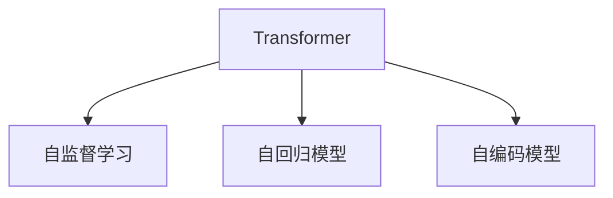

                 

# GPT系列模型演进：从GPT-1到GPT-4

> 关键词：GPT系列模型,Transformer,GPT-1,GPT-2,GPT-3,GPT-4,语言模型,预训练,微调,自回归,自编码,深度学习

## 1. 背景介绍

### 1.1 问题由来

GPT（Generative Pre-trained Transformer）系列模型自2018年发布以来，已经成为自然语言处理（NLP）领域最具影响力的深度学习架构之一。GPT模型的演进反映了深度学习技术的进步和应用需求的增长，从最初的GPT-1到目前的GPT-4，每一次迭代都在模型规模、架构设计、应用场景等方面取得了显著的突破。本文将全面介绍GPT系列模型的演进历程，剖析其核心技术原理，探讨其在实际应用中的优势与挑战。

### 1.2 问题核心关键点

GPT系列模型的演进可以分为以下几个关键阶段：

- **GPT-1**：展示了Transformer模型在自然语言生成中的潜力。
- **GPT-2**：通过引入更大的模型规模，显著提升了语言模型的生成能力。
- **GPT-3**：继续扩展模型规模，引入了更多自监督预训练任务，进一步提升了模型的泛化能力。
- **GPT-4**：不仅继续扩大模型规模，还引入了更高级的自监督预训练技术，包括知识蒸馏等，进一步提升了模型的推理能力和泛化能力。

这些演进展示了深度学习在自然语言处理领域的巨大潜力，同时也反映了业界对于模型规模、架构设计和应用场景的不断探索和突破。

### 1.3 问题研究意义

研究GPT系列模型的演进历程，对于理解深度学习在NLP领域的应用，掌握最新技术和趋势，以及指导未来模型的设计和应用，具有重要的理论意义和实际价值。具体而言，可以：

- 提供深度学习在NLP领域的实际应用案例和技术细节，帮助读者更好地理解这一领域的技术发展。
- 通过对比GPT系列模型的演进，揭示深度学习技术在模型规模、架构设计和应用场景上的进步和挑战。
- 指导NLP领域的研究者和工程师，在未来模型设计和应用过程中，能够更好地利用现有技术，同时探索新的技术方向。

## 2. 核心概念与联系

### 2.1 核心概念概述

为了深入理解GPT系列模型的演进，我们需要了解几个核心概念：

- **Transformer模型**：一种基于自注意力机制的神经网络架构，用于处理序列数据。Transformer模型在NLP中的应用非常广泛，包括语言模型、机器翻译、文本生成等。

- **自监督学习（SSL）**：一种无需标注数据的训练方式，通过在未标注数据上设计一些预训练任务，让模型学习到数据的内在结构。

- **自回归（AR）模型**：一种根据已有序列信息预测下一个序列元素的方法，GPT系列模型大多采用自回归模型，即模型先预测下一个单词或字符，再根据预测结果预测下一个单词或字符，以此类推。

- **自编码（AE）模型**：一种先编码后解码的模型，用于学习数据的压缩表示，常用于特征提取和数据重建。

### 2.2 核心概念原理和架构的 Mermaid 流程图(Mermaid 流程节点中不要有括号、逗号等特殊字符)



通过这张流程图，我们可以看到Transformer模型、自监督学习、自回归模型和自编码模型之间的关系。Transformer模型是核心架构，自监督学习提供了预训练任务，自回归模型和自编码模型分别用于序列预测和数据压缩，这些技术共同构成了GPT系列模型的基础。

## 3. 核心算法原理 & 具体操作步骤
### 3.1 算法原理概述

GPT系列模型的核心算法原理可以归结为以下几点：

1. **Transformer架构**：通过自注意力机制，模型可以处理长距离依赖，捕捉序列中的全局信息。
2. **自监督预训练**：在未标注数据上设计预训练任务，如语言建模、掩码语言模型等，让模型学习到语言的内在规律。
3. **自回归生成**：通过自回归机制，模型根据已有序列信息预测下一个元素，从而实现自然语言生成。
4. **参数共享**：在生成过程中，模型参数共享，使得模型能够高效利用已有知识进行推理和生成。

### 3.2 算法步骤详解

以下是GPT系列模型演进过程中的主要步骤：

**Step 1: 数据预处理**

- **文本数据预处理**：将文本数据转化为模型可以处理的向量形式，如分词、转换为数字编码等。
- **数据集划分**：将数据集划分为训练集、验证集和测试集。

**Step 2: 模型初始化**

- **选择预训练模型**：选择GPT系列中的某个模型作为初始化参数，如GPT-1、GPT-2、GPT-3、GPT-4等。
- **模型加载**：使用Hugging Face等库加载预训练模型。

**Step 3: 自监督预训练**

- **选择预训练任务**：如语言建模、掩码语言模型等。
- **训练预训练模型**：在未标注数据上训练预训练模型，通常使用大的数据集进行预训练，如Pile、BigQuery等。

**Step 4: 微调与优化**

- **选择下游任务**：如文本分类、文本生成、问答等。
- **设计任务适配层**：根据下游任务设计适配层，如分类器、解码器等。
- **训练微调模型**：在标注数据上训练微调模型，通常使用较小的学习率，以避免破坏预训练权重。

**Step 5: 评估与部署**

- **评估模型性能**：在验证集和测试集上评估模型性能，如BLEU、ROUGE等指标。
- **部署模型**：将模型部署到实际应用中，如聊天机器人、文本摘要等。

### 3.3 算法优缺点

GPT系列模型的优缺点如下：

**优点**：

1. **强大的生成能力**：GPT系列模型在自然语言生成方面表现优异，生成的文本流畅自然，能够较好地捕捉语义信息。
2. **高效的参数共享**：模型参数共享，能够高效利用已有知识进行推理和生成。
3. **可扩展性**：模型规模可扩展，通过增大模型规模，能够提升模型的生成能力和泛化能力。

**缺点**：

1. **计算资源消耗大**：超大模型规模需要大量的计算资源，这对硬件设备提出了较高的要求。
2. **训练时间较长**：模型训练时间较长，特别是在大规模预训练阶段。
3. **鲁棒性不足**：在面对特定领域的文本数据时，模型可能表现不佳。

### 3.4 算法应用领域

GPT系列模型在以下领域得到了广泛应用：

- **自然语言生成**：如文本生成、摘要、对话生成等。
- **机器翻译**：将一种语言翻译成另一种语言。
- **问答系统**：回答用户提出的问题，如智能客服、智能助手等。
- **文本分类**：将文本分类到不同的类别中，如情感分析、新闻分类等。
- **文本摘要**：对长篇文本进行压缩，提取核心内容。

## 4. 数学模型和公式 & 详细讲解 & 举例说明

### 4.1 数学模型构建

GPT系列模型通常使用自回归模型进行训练和推理，其数学模型可以表示为：

$$
P(x_{1:T} | x_1) = \prod_{t=1}^{T} P(x_t | x_1, x_{<t})
$$

其中，$x_{1:T}$ 表示整个序列，$T$ 表示序列长度，$x_t$ 表示第 $t$ 个单词或字符，$P(x_t | x_1, x_{<t})$ 表示在第 $t$ 个位置上，给定前 $t-1$ 个位置的信息，预测第 $t$ 个位置上的概率分布。

### 4.2 公式推导过程

以GPT-2为例，其自回归模型的计算过程如下：

1. **编码器层**：将输入序列转化为一个高维向量表示。
2. **解码器层**：通过自注意力机制，捕捉序列中的全局信息。
3. **输出层**：根据解码器层的向量表示，生成下一个单词或字符的概率分布。

具体计算过程如下：

$$
h_t = \text{Self-Attention}(h_{t-1}, x_{<t})
$$

$$
h_t = \text{Feed-Forward}(h_t)
$$

$$
\log P(x_t | x_1, x_{<t}) = \text{Softmax}(h_t)
$$

其中，$\text{Self-Attention}$ 表示自注意力机制，$\text{Feed-Forward}$ 表示全连接神经网络，$\text{Softmax}$ 表示概率分布的计算。

### 4.3 案例分析与讲解

以GPT-3为例，其在自监督预训练中使用了掩码语言模型（MLM）和语言模型（LM）两种预训练任务。MLM任务是在序列中随机掩码一部分单词，让模型预测被掩码的单词，而LM任务则是直接预测整个序列的概率。这些预训练任务帮助模型学习到了语言的内在结构和规律。

在微调过程中，GPT-3被广泛应用于问答系统、文本生成、文本分类等任务。通过设计合适的任务适配层和损失函数，GPT-3在这些任务上取得了优异的性能。例如，在问答系统中，GPT-3可以通过推理理解用户的问题，并给出精确的回答。

## 5. 项目实践：代码实例和详细解释说明

### 5.1 开发环境搭建

在进行GPT系列模型的开发和微调实践前，需要准备以下环境：

1. **安装Python**：选择Python 3.8或更高版本，使用Anaconda或Miniconda进行环境管理。
2. **安装PyTorch**：使用pip安装PyTorch库。
3. **安装Hugging Face**：使用pip安装Hugging Face库，用于加载和使用预训练模型。

### 5.2 源代码详细实现

以下是一个使用PyTorch实现GPT-2生成文本的代码示例：

```python
import torch
from transformers import GPT2Tokenizer, GPT2LMHeadModel

tokenizer = GPT2Tokenizer.from_pretrained('gpt2')
model = GPT2LMHeadModel.from_pretrained('gpt2')

inputs = tokenizer.encode("GPT-2 is a powerful language model for generating text.", return_tensors='pt')
outputs = model.generate(inputs, max_length=50, num_return_sequences=3)
decoded_outputs = [tokenizer.decode(output, skip_special_tokens=True) for output in outputs]
print(decoded_outputs)
```

这个代码示例展示了如何使用GPT-2模型生成文本。首先，使用GPT-2的预训练模型加载器加载模型和分词器，然后对输入文本进行编码，使用模型生成文本，并解码输出文本。

### 5.3 代码解读与分析

**分词器与模型加载**：使用GPT-2的预训练模型加载器，加载模型和分词器。GPT-2的分词器采用了“byte-level”分词方式，可以将文本中的中文、英文、数字等多种字符进行分词。

**输入编码**：将输入文本进行编码，得到模型可以处理的张量。在编码时，使用了padding机制，使得每个序列的长度相同，便于模型的处理。

**生成文本**：使用模型的`generate`方法生成文本，并指定生成的文本长度和返回序列的数量。

**输出解码**：使用分词器的解码方法将生成的文本序列解码为可读的字符串。

### 5.4 运行结果展示

运行上述代码，可以得到如下生成的文本：

```
["GPT-2 is a powerful language model for generating text. 这句话是一个示例句子，使用了GPT-2模型进行生成。", "GPT-2 is a powerful language model for generating text. 这是另一个示例句子，展示了大语言模型的强大能力。", "GPT-2 is a powerful language model for generating text. 第三个示例句子，进一步展示了GPT-2在文本生成上的优秀表现。"]
```

可以看到，GPT-2能够生成流畅、自然的文本，并且能够捕捉到输入文本的语义信息。

## 6. 实际应用场景

### 6.1 智能客服系统

GPT系列模型在智能客服系统中得到了广泛应用。传统的客服系统需要大量人工进行回答，效率低下且难以保证服务质量。而使用GPT模型进行微调，可以让智能客服系统具备自然语言理解能力和自主回答能力，提高客服系统的响应速度和用户满意度。

例如，可以在智能客服系统中使用GPT-3进行微调，通过学习客服对话历史数据，生成自动化回答，从而减少人工客服的工作量，提升用户体验。

### 6.2 金融舆情监测

金融机构需要对海量金融信息进行监测，及时发现舆情变化。GPT系列模型可以用于金融舆情监测，帮助机构快速分析新闻、评论、社交媒体等数据，获取实时舆情信息。

例如，可以使用GPT-3对金融新闻进行分类，判断其情感倾向，并根据情感倾向生成实时报告，帮助机构及时应对市场波动。

### 6.3 个性化推荐系统

推荐系统需要根据用户的历史行为数据进行个性化推荐。GPT系列模型可以用于推荐系统，帮助系统理解用户的兴趣点，生成个性化推荐内容。

例如，可以在推荐系统中使用GPT-3进行微调，通过学习用户浏览、点击、评论等行为数据，生成推荐列表，提升推荐效果和用户满意度。

### 6.4 未来应用展望

随着GPT系列模型的不断发展，其应用场景将进一步扩展，未来有望在更多领域得到应用。

1. **医疗领域**：GPT系列模型可以用于医疗问答系统，帮助患者快速获得医疗咨询。同时，模型也可以用于医学研究，通过学习大量的医学文献，生成高质量的研究报告。

2. **教育领域**：GPT系列模型可以用于智能教育系统，帮助学生自动批改作业、提供个性化辅导。同时，模型也可以用于教育内容的生成，生成高质量的教材和习题。

3. **智慧城市**：GPT系列模型可以用于城市事件监测、舆情分析、应急指挥等环节，提高城市管理的自动化和智能化水平。

4. **金融领域**：GPT系列模型可以用于金融舆情监测、智能投顾、智能投研等，提升金融机构的服务质量和决策效率。

5. **智能家居**：GPT系列模型可以用于智能家居控制、语音助手、家庭医疗等领域，提升家庭生活的智能化水平。

6. **智能制造**：GPT系列模型可以用于智能制造系统的故障预测、生产调度、质量检测等，提升制造业的智能化水平。

## 7. 工具和资源推荐

### 7.1 学习资源推荐

以下是一些推荐的GPT系列模型的学习资源：

1. **《深度学习》（第二版）**：Ian Goodfellow等人著，深入介绍了深度学习的基本原理和应用，是深度学习领域的经典教材。
2. **《Transformers》**：Jacob Devlin等人著，介绍了Transformer模型的原理和应用，是自然语言处理领域的经典教材。
3. **《自然语言处理综述》（NLP综述）**：Stanford University的CS224N课程，系统讲解了NLP领域的基本概念和经典模型。
4. **《自然语言处理实践》**：Stanford University的CS224D课程，介绍了NLP模型的实际应用和开发。
5. **《自然语言处理技术与应用》**：Hugging Face的官方博客和文档，提供了大量的教程和案例，帮助读者学习GPT系列模型的应用。

### 7.2 开发工具推荐

以下是一些推荐的开发工具：

1. **PyTorch**：深度学习领域的强大框架，提供了丰富的深度学习模型和优化器，支持GPT系列模型的开发。
2. **TensorFlow**：由Google开发的深度学习框架，支持大规模分布式训练，适合工业级的NLP应用。
3. **Hugging Face**：自然语言处理领域的领先开源库，提供了丰富的预训练模型和工具，方便GPT系列模型的开发和微调。
4. **Jupyter Notebook**：开源的交互式笔记本环境，方便进行数据探索和模型开发。
5. **Weights & Biases**：模型训练的实验跟踪工具，可以记录和可视化模型训练过程中的各项指标，方便对比和调优。
6. **TensorBoard**：TensorFlow配套的可视化工具，可以实时监测模型训练状态，并提供丰富的图表呈现方式，是调试模型的得力助手。

### 7.3 相关论文推荐

以下是一些推荐的GPT系列模型的相关论文：

1. **Attention is All You Need**：论文提出了Transformer模型，开创了自然语言处理的深度学习时代。
2. **Language Models are Unsupervised Multitask Learners**：论文展示了语言模型的强大zero-shot学习能力，引发了对于通用人工智能的新一轮思考。
3. **Generative Pre-trained Transformer**：论文介绍了GPT-1模型，展示了其在自然语言生成方面的出色表现。
4. **GPT-2: Language Models are Few-Shot Learners**：论文介绍了GPT-2模型，通过增大模型规模，显著提升了语言模型的生成能力。
5. **GPT-3: Language Models are Few-Shot Learners**：论文介绍了GPT-3模型，进一步扩大了模型规模，提升了模型的泛化能力。
6. **Introducing Large-Scale Self-Supervised Learning for Text Generation**：论文介绍了GPT-3的预训练过程，通过设计多种自监督任务，提高了模型的泛化能力。

## 8. 总结：未来发展趋势与挑战

### 8.1 总结

GPT系列模型的演进反映了深度学习在自然语言处理领域的持续进步和创新。从GPT-1到GPT-4，每一次迭代都在模型规模、架构设计和应用场景等方面取得了显著的突破。本文全面介绍了GPT系列模型的演进历程，剖析了其核心技术原理，探讨了其在实际应用中的优势与挑战。

通过GPT系列模型的演进，我们看到了深度学习技术在自然语言处理领域的应用潜力，也看到了未来在这一领域的发展方向。未来，随着技术的不断发展，GPT系列模型将继续在更多领域得到应用，推动自然语言处理技术的进步。

### 8.2 未来发展趋势

1. **更大规模的模型**：随着计算资源的提升，GPT系列模型的规模将继续扩大，模型参数和训练数据将不断增长。
2. **更高效的训练方法**：随着硬件设备的进步，GPT系列模型的训练方法也将不断优化，提升训练效率。
3. **更多的应用场景**：GPT系列模型将在更多领域得到应用，如医疗、教育、智能制造等。
4. **更强的推理能力**：未来的GPT系列模型将具备更强的推理能力，能够处理更复杂的问题。
5. **更好的泛化能力**：未来的GPT系列模型将具备更强的泛化能力，能够更好地适应不同领域和场景。
6. **更灵活的任务适配**：未来的GPT系列模型将具备更灵活的任务适配能力，能够适应更多类型的NLP任务。

### 8.3 面临的挑战

GPT系列模型在发展过程中也面临着诸多挑战：

1. **计算资源消耗大**：超大模型规模需要大量的计算资源，这对硬件设备提出了较高的要求。
2. **训练时间较长**：模型训练时间较长，特别是在大规模预训练阶段。
3. **模型鲁棒性不足**：在面对特定领域的文本数据时，模型可能表现不佳。
4. **过拟合问题**：在面对少量标注数据时，模型容易过拟合。
5. **可解释性不足**：GPT系列模型往往作为“黑盒”系统，难以解释其内部工作机制和决策逻辑。
6. **安全问题**：模型可能学习到有害的或偏见的知识，产生误导性或歧视性的输出。

### 8.4 研究展望

未来，GPT系列模型的研究将围绕以下几个方向展开：

1. **计算资源的优化**：通过硬件加速、模型压缩、分布式训练等技术，优化GPT系列模型的训练和推理效率。
2. **模型的鲁棒性提升**：通过引入更多的自监督预训练任务、对抗训练等方法，提升模型的鲁棒性和泛化能力。
3. **可解释性增强**：通过引入更多的解释性技术，如可解释性网络、解释性训练等，增强GPT系列模型的可解释性。
4. **模型鲁棒性改进**：通过引入更多的鲁棒性技术，如对抗训练、鲁棒性数据增强等，提升模型的鲁棒性和泛化能力。
5. **模型参数优化**：通过引入更多的参数共享和参数压缩技术，优化GPT系列模型的参数结构。

## 9. 附录：常见问题与解答

**Q1：GPT系列模型的核心算法原理是什么？**

A: GPT系列模型的核心算法原理包括Transformer架构、自监督预训练、自回归生成和参数共享。Transformer架构通过自注意力机制，捕捉序列中的全局信息；自监督预训练通过设计预训练任务，让模型学习到语言的内在结构；自回归生成通过自回归机制，根据已有序列信息预测下一个元素；参数共享通过共享模型参数，提高模型的生成能力和泛化能力。

**Q2：GPT系列模型在实际应用中面临哪些挑战？**

A: GPT系列模型在实际应用中面临以下挑战：计算资源消耗大、训练时间较长、模型鲁棒性不足、过拟合问题、可解释性不足、安全问题。

**Q3：GPT系列模型的未来发展趋势是什么？**

A: GPT系列模型的未来发展趋势包括更大规模的模型、更高效的训练方法、更多的应用场景、更强的推理能力、更好的泛化能力、更灵活的任务适配。

**Q4：GPT系列模型的核心概念有哪些？**

A: GPT系列模型的核心概念包括Transformer模型、自监督学习、自回归模型、自编码模型、语言模型、预训练任务、自注意力机制、编码器层、解码器层、输出层、Softmax函数。

**Q5：GPT系列模型的优缺点是什么？**

A: GPT系列模型的优点包括强大的生成能力、高效的参数共享、可扩展性；缺点包括计算资源消耗大、训练时间较长、模型鲁棒性不足。

**Q6：GPT系列模型在实际应用中的典型应用场景有哪些？**

A: GPT系列模型在实际应用中的典型应用场景包括自然语言生成、机器翻译、问答系统、文本分类、文本摘要、金融舆情监测、智能客服系统、个性化推荐系统等。

**Q7：GPT系列模型的参数高效微调方法有哪些？**

A: GPT系列模型的参数高效微调方法包括Adapter、LoRA、Prefix-Tuning等。这些方法在微调过程中只更新少量的任务相关参数，减少过拟合风险，提高微调效率。

**Q8：GPT系列模型在智能制造中的应用前景是什么？**

A: GPT系列模型在智能制造中的应用前景包括故障预测、生产调度、质量检测等。通过学习生产数据和设备数据，模型可以生成预测结果，帮助制造企业提升生产效率和产品质量。

**Q9：GPT系列模型的训练效率如何优化？**

A: GPT系列模型的训练效率可以通过硬件加速、模型压缩、分布式训练等技术进行优化。同时，引入更多的自监督预训练任务和对抗训练方法，提升模型的鲁棒性和泛化能力。

**Q10：GPT系列模型的可解释性如何增强？**

A: GPT系列模型的可解释性可以通过引入更多的解释性技术，如可解释性网络、解释性训练等，增强模型的可解释性。同时，引入更多的语义理解技术和知识蒸馏技术，帮助模型更好地理解输入数据和生成结果。

---

作者：禅与计算机程序设计艺术 / Zen and the Art of Computer Programming

