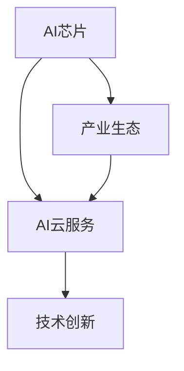

                 

# Google的AI产业生态:AI芯片和AI云服务

> 关键词：Google, AI芯片, AI云服务, 产业生态, 人工智能, 计算架构, 云计算, 深度学习, 分布式系统, 数据中心

## 1. 背景介绍

### 1.1 问题由来

随着人工智能技术的迅猛发展，Google作为全球科技巨头之一，其在AI领域的布局和进展备受关注。Google的AI产业生态，通过深度整合AI芯片与AI云服务，构建了强大的AI计算平台。本文将详细解析Google的AI产业生态系统，探索其核心算法原理、具体操作步骤，以及未来的发展趋势与挑战。

### 1.2 问题核心关键点

Google的AI产业生态主要由以下几个关键点构成：

- **AI芯片**：如TPU（Tensor Processing Unit），专门用于加速TensorFlow深度学习的计算任务。
- **AI云服务**：包括Google Cloud AI、Google AI Hub等，提供丰富的AI模型、工具和平台。
- **产业生态**：通过与OEM合作伙伴、研究机构和企业合作，构建开放的AI开发和应用环境。
- **技术创新**：在分布式系统、数据中心管理、深度学习算法等领域持续投入研发。

这些核心组件和关键点共同构成了Google的AI产业生态，推动了AI技术的广泛应用和商业落地。

## 2. 核心概念与联系

### 2.1 核心概念概述

为更好地理解Google的AI产业生态，我们需要理解几个关键概念及其相互关系：

- **AI芯片**：如TPU，一种专门用于深度学习计算的硬件加速器。Google的TPU通过优化矩阵运算，显著提升了深度学习模型的训练和推理速度。

- **AI云服务**：提供从数据存储、模型训练到应用部署的一站式服务，包括Google Cloud AI、Google AI Hub等。AI云服务使得开发者可以更加便捷地使用Google的AI技术。

- **产业生态**：包括与OEM合作伙伴、研究机构和企业合作，构建开放的AI开发和应用环境。产业生态是Google AI技术在各行各业落地应用的重要保障。

- **技术创新**：在分布式系统、数据中心管理、深度学习算法等领域持续投入研发。技术创新是Google AI产业生态不断进步的动力。

这些核心概念之间的逻辑关系可以通过以下Mermaid流程图来展示：



这个流程图展示了大语言模型的核心概念及其之间的关系：

1. AI芯片为AI云服务提供计算支持，使其能够高效处理大规模深度学习任务。
2. AI云服务为开发者提供便捷的AI开发和应用环境，促进AI技术的广泛应用。
3. 产业生态促进了AI技术的标准化和规范化，推动AI技术的商业落地。
4. 技术创新为AI产业生态注入新活力，确保其持续发展。

这些概念共同构成了Google的AI产业生态，使得Google在AI领域保持了强大的竞争力和创新力。

## 3. 核心算法原理 & 具体操作步骤

### 3.1 算法原理概述

Google的AI产业生态在算法原理上，主要依赖于分布式深度学习技术和AI芯片的硬件加速。Google的深度学习框架TensorFlow在分布式计算、自动微分、优化器等方面进行了大量创新，使其能够高效地处理大规模深度学习任务。

### 3.2 算法步骤详解

Google的AI芯片和云服务主要包括以下步骤：

**Step 1: AI芯片设计**
- Google自主设计了TPU，通过优化矩阵运算，使其能够高效地处理深度学习任务。
- TPU的硬件架构和软件栈与TensorFlow深度学习框架高度集成，支持模型并行、数据并行等多种计算模式。

**Step 2: AI云服务部署**
- Google Cloud AI提供了丰富的AI模型和工具，包括预训练模型、模型部署、数据分析等。
- Google AI Hub提供了开放的AI模型库，供开发者自由使用和定制。

**Step 3: 数据中心管理**
- Google通过自建的数据中心和全球分布式网络，确保AI云服务的稳定性和高效性。
- 数据中心采用高性能计算硬件、先进的网络设备和能源管理系统，支持大规模AI计算任务。

**Step 4: 技术创新与支持**
- Google持续在分布式系统、深度学习算法等领域进行技术创新，推动AI技术的发展。
- 通过开源项目、学术论文和技术支持等方式，促进AI技术在学术界和产业界的普及和应用。

**Step 5: 产业生态建设**
- Google与OEM合作伙伴、研究机构和企业合作，构建开放、协同的AI开发和应用环境。
- 通过技术合作、市场推广和应用示范，推动AI技术在各行各业的落地应用。

### 3.3 算法优缺点

Google的AI产业生态具有以下优点：

- **计算效率高**：通过AI芯片和分布式计算技术，能够高效处理大规模深度学习任务。
- **服务全面**：提供从数据存储、模型训练到应用部署的一站式服务，方便开发者使用。
- **产业生态强大**：通过与OEM合作伙伴、研究机构和企业合作，构建开放的AI开发和应用环境。
- **技术创新驱动**：在分布式系统、数据中心管理、深度学习算法等领域持续投入研发，推动技术进步。

同时，该生态系统也存在一定的局限性：

- **资源消耗大**：大规模深度学习任务对硬件和能源消耗较大，成本较高。
- **网络延迟高**：全球分布式网络可能导致跨地域数据传输和计算延迟较高。
- **技术门槛高**：深度学习模型和算法的复杂性要求开发者具备较高的技术水平。
- **安全风险高**：大规模数据存储和处理可能带来数据泄露和安全风险。

尽管存在这些局限性，但Google的AI产业生态仍然在全球AI技术发展中占据重要地位，其创新能力和影响力不可忽视。

### 3.4 算法应用领域

Google的AI产业生态广泛应用于多个领域：

- **计算机视觉**：如图像识别、视频分析、增强现实等。
- **自然语言处理**：如语音识别、机器翻译、文本生成等。
- **推荐系统**：如广告推荐、内容推荐、用户行为分析等。
- **医疗健康**：如影像分析、基因组学、药物发现等。
- **自动驾驶**：如图像识别、决策支持、环境感知等。

这些应用领域展示了Google AI技术的广泛应用和巨大潜力，为各行各业带来了新的商业机会和发展动力。

## 4. 数学模型和公式 & 详细讲解 & 举例说明

### 4.1 数学模型构建

Google的AI芯片和云服务在数学模型上，主要依赖于深度学习模型和分布式计算模型。深度学习模型包括卷积神经网络（CNN）、循环神经网络（RNN）、变压器（Transformer）等，分布式计算模型则包括MapReduce、Spark、GSP等。

### 4.2 公式推导过程

以卷积神经网络为例，其数学模型包括卷积层、池化层和全连接层。以下是对卷积层和池化层的基本公式推导：

$$
f(x) = \sum_{i=1}^n w_i g(x) + b
$$

其中，$f(x)$ 表示卷积层的输出，$g(x)$ 表示输入，$w_i$ 表示卷积核权重，$b$ 表示偏置项。

池化层的公式推导如下：

$$
f(x) = \frac{1}{k} \sum_{i=1}^k g(x_i)
$$

其中，$f(x)$ 表示池化层的输出，$g(x_i)$ 表示输入中的池化窗口，$k$ 表示池化窗口大小。

### 4.3 案例分析与讲解

以Google的AI云服务中的机器学习服务为例，其包含以下几个关键步骤：

1. **数据存储**：Google Cloud Storage提供高效、可靠的数据存储服务，支持大规模数据存储和读取。

2. **模型训练**：使用TensorFlow进行模型训练，支持分布式计算，加速模型训练过程。

3. **模型部署**：通过Google Cloud ML Engine进行模型部署，提供高性能的模型服务。

4. **模型优化**：使用Google Cloud AI提供的优化工具，如HyperTune、Model Training Service等，进行模型调优和优化。

## 5. 项目实践：代码实例和详细解释说明

### 5.1 开发环境搭建

在进行Google AI芯片和云服务的项目实践前，我们需要准备好开发环境。以下是使用Python进行TensorFlow开发的环境配置流程：

1. 安装Anaconda：从官网下载并安装Anaconda，用于创建独立的Python环境。

2. 创建并激活虚拟环境：
```bash
conda create -n tf-env python=3.8 
conda activate tf-env
```

3. 安装TensorFlow：根据CUDA版本，从官网获取对应的安装命令。例如：
```bash
conda install tensorflow tensorflow-gpu=cuda11.1 -c tf
```

4. 安装TensorFlow扩展库：
```bash
pip install tensorflow-estimator tensorflow-hub tensorflow-addons
```

完成上述步骤后，即可在`tf-env`环境中开始TensorFlow开发。

### 5.2 源代码详细实现

下面以图像分类任务为例，给出使用TensorFlow进行卷积神经网络（CNN）模型训练的PyTorch代码实现。

首先，定义CNN模型：

```python
import tensorflow as tf
from tensorflow.keras import layers

model = tf.keras.Sequential([
    layers.Conv2D(32, (3, 3), activation='relu', input_shape=(28, 28, 1)),
    layers.MaxPooling2D((2, 2)),
    layers.Flatten(),
    layers.Dense(10, activation='softmax')
])
```

然后，定义损失函数和优化器：

```python
from tensorflow.keras.losses import SparseCategoricalCrossentropy
from tensorflow.keras.optimizers import Adam

loss_fn = SparseCategoricalCrossentropy()
optimizer = Adam()
```

接着，定义训练和评估函数：

```python
def train_epoch(model, dataset, batch_size, optimizer):
    for batch in dataset.batch(batch_size):
        x, y = batch
        with tf.GradientTape() as tape:
            logits = model(x, training=True)
            loss = loss_fn(y, logits)
        grads = tape.gradient(loss, model.trainable_variables)
        optimizer.apply_gradients(zip(grads, model.trainable_variables))

def evaluate(model, dataset, batch_size):
    correct_predictions = 0
    total_predictions = 0
    for batch in dataset.batch(batch_size):
        x, y = batch
        logits = model(x)
        predictions = tf.argmax(logits, axis=1)
        total_predictions += y.shape[0]
        correct_predictions += tf.reduce_sum(tf.cast(tf.equal(predictions, y), tf.int32))
    accuracy = correct_predictions / total_predictions
    return accuracy
```

最后，启动训练流程并在测试集上评估：

```python
epochs = 5
batch_size = 64

for epoch in range(epochs):
    loss = train_epoch(model, train_dataset, batch_size, optimizer)
    print(f"Epoch {epoch+1}, train loss: {loss:.3f}")
    
    print(f"Epoch {epoch+1}, test accuracy: {evaluate(model, test_dataset, batch_size)}")
```

以上就是使用TensorFlow进行卷积神经网络模型训练的完整代码实现。可以看到，TensorFlow的Keras API提供了简单易用的模型定义和训练接口，使得模型开发过程变得更加高效。

### 5.3 代码解读与分析

让我们再详细解读一下关键代码的实现细节：

**CNN模型定义**：
- `Sequential`：按照顺序堆叠多个层，创建简单的线性堆叠模型。
- `Conv2D`：卷积层，通过卷积核提取特征。
- `MaxPooling2D`：池化层，减少特征维度。
- `Flatten`：展平层，将多维特征图展平为一维向量。
- `Dense`：全连接层，输出最终分类结果。

**损失函数和优化器**：
- `SparseCategoricalCrossentropy`：多类别分类任务的损失函数。
- `Adam`：常用的优化器，结合了动量项和自适应学习率。

**训练和评估函数**：
- `train_epoch`：对数据集以批为单位进行迭代，计算损失并更新模型参数。
- `evaluate`：在测试集上计算模型预测准确率。

**训练流程**：
- 定义总的epoch数和batch size，开始循环迭代
- 每个epoch内，在训练集上训练，输出平均损失
- 在测试集上评估，输出测试准确率
- 所有epoch结束后，输出最终测试结果

可以看到，TensorFlow提供了丰富的API和工具，使得深度学习模型的开发和训练过程变得更加便捷和高效。

## 6. 实际应用场景

### 6.1 计算机视觉

Google的AI芯片和云服务在计算机视觉领域得到了广泛应用。例如，Google的图像识别技术已经在Google Photos、Google Lens等产品中得到应用，帮助用户快速识别图像中的物体、场景和人物。

### 6.2 自然语言处理

Google的AI芯片和云服务在自然语言处理领域也表现出色。例如，Google Translate使用Transformer模型进行翻译，已经在全球范围内得到了广泛应用。

### 6.3 推荐系统

Google的AI芯片和云服务在推荐系统中的应用也非常成功。例如，Google Ads使用机器学习模型进行广告推荐，帮助广告主更精准地投放广告。

### 6.4 未来应用展望

随着Google的AI芯片和云服务的不断发展，未来其应用场景将更加广泛。

在智慧城市治理中，Google的AI技术可以用于交通管理、城市规划、公共安全等领域，提高城市管理的智能化水平。

在智慧医疗领域，Google的AI技术可以用于影像分析、基因组学、药物发现等领域，提升医疗服务的智能化水平。

在自动驾驶领域，Google的AI技术可以用于环境感知、决策支持、自动驾驶算法等领域，推动自动驾驶技术的商业化应用。

此外，在教育、金融、制造等多个领域，Google的AI技术也有望得到广泛应用，推动各行各业的数字化转型升级。

## 7. 工具和资源推荐

### 7.1 学习资源推荐

为了帮助开发者系统掌握Google的AI芯片和云服务，这里推荐一些优质的学习资源：

1. Google TensorFlow官方文档：包含TensorFlow的详细文档和教程，是学习TensorFlow的必备资源。

2. TensorFlow in Action：一本系统介绍TensorFlow应用的书籍，包含大量实践案例和项目实现。

3. TensorFlow实现深度学习：一本介绍TensorFlow深度学习应用的书籍，深入浅出地介绍了TensorFlow的核心概念和应用场景。

4. Google AI课程：由Google官方提供的深度学习课程，涵盖TensorFlow、机器学习、计算机视觉等多个领域，适合初学者和进阶者。

5. Kaggle竞赛平台：提供大量的深度学习竞赛和项目，帮助开发者实践TensorFlow应用。

通过对这些资源的学习实践，相信你一定能够快速掌握Google的AI芯片和云服务，并用于解决实际的NLP问题。

### 7.2 开发工具推荐

高效的开发离不开优秀的工具支持。以下是几款用于Google AI芯片和云服务开发的常用工具：

1. TensorFlow：基于Python的开源深度学习框架，灵活动态的计算图，适合快速迭代研究。大部分深度学习任务都有TensorFlow版本的实现。

2. TensorFlow Addons：TensorFlow的扩展库，提供了更多的深度学习算法和工具，如分布式计算、高性能计算等。

3. Google Cloud AI：提供从数据存储、模型训练到应用部署的一站式服务，支持多种深度学习任务。

4. Google Cloud Storage：提供高效、可靠的数据存储服务，支持大规模数据存储和读取。

5. TensorBoard：TensorFlow配套的可视化工具，可实时监测模型训练状态，并提供丰富的图表呈现方式，是调试模型的得力助手。

6. TensorFlow Extended (TFX)：Google开发的机器学习流水线工具，帮助开发者构建高效、可扩展的机器学习系统。

合理利用这些工具，可以显著提升Google AI芯片和云服务的开发效率，加快创新迭代的步伐。

### 7.3 相关论文推荐

Google的AI芯片和云服务在深度学习领域进行了大量研究。以下是几篇奠基性的相关论文，推荐阅读：

1. Exploring the Limits of Deep Learning with Transformers：提出了Transformer模型，并应用于大规模语言建模和机器翻译任务，刷新了多项NLP任务SOTA。

2. Deployment of Deep Learning to a Massive Cluster with Missing Features：介绍了Google的分布式深度学习系统，支持大规模深度学习任务的训练和推理。

3. TensorFlow: A System for Large-Scale Machine Learning：介绍了Google的TensorFlow系统，支持深度学习模型的开发和训练。

4. Scaling Distributed Machine Learning with the Parameter Server：提出了一种分布式机器学习算法，能够高效处理大规模数据集和模型。

5. TensorFlow Extended: A Flexible Platform for Experimentation with AI and Machine Learning：介绍了TensorFlow Extended (TFX)系统，支持机器学习流水线构建和管理。

这些论文代表了大规模深度学习系统的发展脉络。通过学习这些前沿成果，可以帮助研究者把握学科前进方向，激发更多的创新灵感。

## 8. 总结：未来发展趋势与挑战

### 8.1 总结

本文对Google的AI产业生态进行了全面系统的介绍。首先阐述了Google AI芯片和云服务的研究背景和意义，明确了其在AI领域的战略布局和核心竞争力。其次，从原理到实践，详细讲解了Google AI芯片和云服务的核心算法原理和具体操作步骤，给出了深度学习模型训练的完整代码实现。同时，本文还广泛探讨了Google AI技术在计算机视觉、自然语言处理、推荐系统等多个领域的应用前景，展示了其强大的技术实力和广阔的市场前景。此外，本文精选了Google AI技术的学习资源、开发工具和相关论文，力求为读者提供全方位的技术指引。

通过本文的系统梳理，可以看到，Google的AI产业生态通过深度整合AI芯片和云服务，构建了强大的AI计算平台，推动了AI技术在各行各业的广泛应用。未来，伴随AI芯片和云服务的不断进步，Google的AI技术必将在更广阔的应用领域大放异彩，为人类生产生活方式带来深刻变革。

### 8.2 未来发展趋势

展望未来，Google的AI产业生态将呈现以下几个发展趋势：

1. **计算架构优化**：通过硬件和软件协同优化，进一步提升深度学习模型的计算效率。

2. **云计算平台扩展**：通过Google Cloud AI等云服务扩展，支持更多行业和领域的AI应用。

3. **产业生态完善**：通过与更多合作伙伴合作，构建更加开放、协同的AI开发和应用环境。

4. **技术创新加速**：在分布式系统、深度学习算法等领域持续投入研发，推动技术进步。

5. **应用场景拓展**：在智慧医疗、智慧城市、自动驾驶等更多领域推动AI技术的落地应用。

6. **模型规模扩大**：通过更大规模的模型训练和部署，提升AI技术的综合性能。

这些趋势凸显了Google AI产业生态的巨大潜力和发展动力，未来必将在全球AI技术发展中占据重要地位。

### 8.3 面临的挑战

尽管Google的AI产业生态在AI领域占据重要地位，但在迈向更加智能化、普适化应用的过程中，仍面临以下挑战：

1. **资源消耗高**：大规模深度学习任务对硬件和能源消耗较大，成本较高。

2. **网络延迟高**：全球分布式网络可能导致跨地域数据传输和计算延迟较高。

3. **技术门槛高**：深度学习模型和算法的复杂性要求开发者具备较高的技术水平。

4. **数据安全问题**：大规模数据存储和处理可能带来数据泄露和安全风险。

5. **伦理道德问题**：AI模型的偏见和歧视问题需要得到重视和解决。

6. **市场竞争激烈**：来自其他科技巨头的竞争压力巨大。

尽管存在这些挑战，但Google的AI产业生态通过持续的技术创新和生态建设，有望克服这些障碍，推动AI技术在各行各业得到广泛应用。

### 8.4 研究展望

未来，Google的AI产业生态需要在以下几个方面寻求新的突破：

1. **降低资源消耗**：通过硬件和算法优化，降低深度学习任务的资源消耗。

2. **提高网络效率**：优化跨地域数据传输和计算架构，提升网络传输效率。

3. **降低技术门槛**：提供更易于使用的开发工具和平台，降低技术门槛。

4. **加强数据安全**：采用更严格的数据管理和安全措施，保护用户隐私和数据安全。

5. **解决伦理问题**：加强AI模型的公平性和可解释性，避免偏见和歧视问题。

6. **拓展市场应用**：积极探索AI技术在更多领域的应用，推动AI技术的商业化落地。

这些研究方向的探索，必将引领Google AI产业生态走向更高的台阶，为构建人机协同的智能时代贡献力量。

## 9. 附录：常见问题与解答

**Q1：Google的AI芯片和云服务是否适用于所有NLP任务？**

A: Google的AI芯片和云服务适用于大多数NLP任务，特别是对于大规模深度学习任务。但对于一些特定领域的任务，如医学、法律等，可能需要进一步优化和定制。

**Q2：使用Google AI芯片和云服务时需要注意哪些资源瓶颈？**

A: 使用Google AI芯片和云服务时需要注意以下资源瓶颈：
1. 计算资源消耗大，成本较高。
2. 数据传输和计算延迟较高，网络带宽要求高。
3. 技术门槛较高，需要较高的技术水平。
4. 数据安全和隐私保护要求严格。

**Q3：如何提高Google AI芯片和云服务的性能？**

A: 提高Google AI芯片和云服务的性能可以从以下几个方面入手：
1. 优化计算架构，提升模型训练和推理速度。
2. 采用分布式计算，提升模型并行处理能力。
3. 使用更高效的数据存储和传输技术，减少资源消耗。
4. 引入先进的网络优化技术，降低延迟和带宽需求。
5. 持续进行技术创新，提升AI芯片和云服务的技术水平。

**Q4：如何避免Google AI芯片和云服务的安全风险？**

A: 避免Google AI芯片和云服务的安全风险可以从以下几个方面入手：
1. 采用先进的数据加密和访问控制技术，保护数据安全和隐私。
2. 定期进行安全审计和漏洞扫描，及时发现和修复安全问题。
3. 引入安全机制和监控系统，实时监测和预警安全事件。
4. 遵循合规性要求，如GDPR等，确保数据使用合法合规。

通过以上措施，可以有效避免Google AI芯片和云服务的安全风险，确保其可靠性和安全性。

**Q5：Google AI芯片和云服务是否支持多模态数据处理？**

A: Google的AI芯片和云服务支持多模态数据处理，可以在图像、视频、语音等多个模态下进行数据融合和分析。例如，Google Cloud AI提供多模态分析工具，支持图像和文本数据的联合分析。

---

作者：禅与计算机程序设计艺术 / Zen and the Art of Computer Programming

