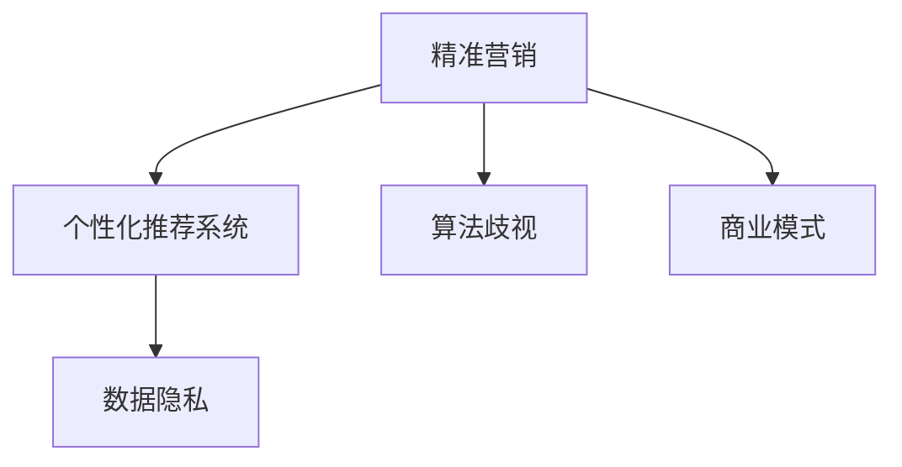

                 

# Google的广告帝国:高效但有争议的商业模式

> 关键词：Google广告,精准营销,数据隐私,人工智能,机器学习,个性化推荐,用户隐私,算法歧视,商业模式

## 1. 背景介绍

### 1.1 问题由来
Google广告业务自诞生以来，经历了从简单的点击付费（Pay-Per-Click, PPC）广告到如今先进的精准营销和个性化推荐系统的演变。这一过程中，Google不仅引领了广告业的发展方向，也引发了众多争议。

#### 1.1.1 PPC广告的诞生
1998年，Google推出了PPC广告服务，以每次点击付费的方式来吸引商家投放广告。这一模式通过搜索排名，让用户能够在最相关、最符合他们需求的结果中看到广告。PPC广告的精准性和成本效益使其迅速获得了商家和用户的青睐，Google的业务和收入也因此迅速增长。

#### 1.1.2 精准营销和个性化推荐系统
随着技术的进步，Google广告业务不断发展。机器学习和大数据技术的引入，使得Google能够实现更精准的用户画像和广告投放，极大地提升了广告的转化率和用户的满意度。这一时期，Google的广告系统逐步向精准营销和个性化推荐系统演进。

## 2. 核心概念与联系

### 2.1 核心概念概述
为全面理解Google广告业务的商业模式，我们将介绍以下几个核心概念：

- **精准营销（Precision Marketing）**：通过深入分析和理解用户的行为和偏好，实现更精准的广告投放和推荐。
- **个性化推荐系统（Personalized Recommendation System）**：根据用户的历史行为和兴趣，推荐最符合用户需求的广告或商品。
- **数据隐私（Data Privacy）**：用户对其个人信息的保护和使用，尤其是对个人数据的收集和使用方式提出了严格的规范和要求。
- **算法歧视（Algorithmic Bias）**：由于算法设计或数据偏见导致的不公平结果，尤其是在广告投放和个性化推荐中可能出现的歧视现象。
- **商业模式（Business Model）**：Google广告业务的盈利方式，包括广告收入、数据使用、用户行为分析等。

这些概念之间的逻辑关系可以通过以下Mermaid流程图来展示：



这个流程图展示了Google广告业务的核心概念及其相互关系：精准营销和个性化推荐系统基于对用户数据的深入分析，但同时也涉及到数据隐私和算法歧视问题，最终形成了Google的核心商业模式。

## 3. 核心算法原理 & 具体操作步骤
### 3.1 算法原理概述

Google广告业务的核心在于其精准营销和个性化推荐系统，这些系统基于机器学习和大数据技术，通过分析用户行为和偏好，实现高效的广告投放和推荐。

#### 3.1.1 精准营销的数学原理
精准营销的核心在于对用户行为的分析和预测，通常采用分类和回归等监督学习算法，如Logistic回归、决策树、随机森林、支持向量机等。通过收集和分析用户的历史行为数据，如搜索记录、浏览历史、购买行为等，模型可以预测用户对某类广告的兴趣程度。

#### 3.1.2 个性化推荐的数学原理
个性化推荐系统则更多地依赖于协同过滤、基于内容的推荐等技术。协同过滤算法通过分析用户之间的相似性，推荐相似用户喜欢的商品或广告。基于内容的推荐则根据商品或广告的特征与用户兴趣的匹配度进行推荐。

### 3.2 算法步骤详解

#### 3.2.1 数据收集与预处理
- **用户行为数据**：包括搜索记录、浏览历史、点击行为、购买记录等。
- **广告数据**：包括广告标题、描述、类别、预算等。
- **数据清洗**：去除异常值和噪音数据，处理缺失值，进行特征工程。

#### 3.2.2 特征工程
- **用户特征**：如地理位置、年龄、性别、兴趣标签等。
- **广告特征**：如广告类别、关键词、价格、广告主信誉等。
- **交叉特征**：如用户ID与广告ID的组合特征。

#### 3.2.3 模型训练与优化
- **监督学习**：使用分类和回归算法，训练模型预测用户对广告的兴趣。
- **强化学习**：通过不断优化广告投放策略，最大化点击率（Click-Through Rate, CTR）和转化率（Conversion Rate, CR）。
- **模型评估**：使用AUC、精确率、召回率、F1值等指标评估模型性能。

#### 3.2.4 广告投放与推荐
- **实时竞价（Real-time Bidding, RTB）**：通过拍卖机制，动态决定广告投放策略。
- **个性化推荐**：根据用户特征和行为，推荐最相关的广告或商品。

### 3.3 算法优缺点

#### 3.3.1 优点
- **高效性**：通过大规模数据分析，实现高精准度的广告投放和推荐。
- **灵活性**：能够根据用户行为实时调整广告策略。
- **个性化**：通过机器学习算法，实现高度个性化的广告推荐。

#### 3.3.2 缺点
- **数据隐私问题**：大量收集用户数据，可能侵犯用户隐私。
- **算法歧视**：模型可能因为数据偏见而产生歧视性结果。
- **技术复杂性**：需要高度专业的技术和数据处理能力。

### 3.4 算法应用领域

Google广告业务已经广泛应用于各种场景，包括电商、在线教育、金融、医疗等。以下是几个典型的应用领域：

#### 3.4.1 电商平台
- **商品推荐**：根据用户浏览和购买行为，推荐相关商品。
- **广告投放**：在用户浏览商品页面时，展示精准的广告。

#### 3.4.2 在线教育
- **课程推荐**：根据用户的学习历史和兴趣，推荐适合的课程和教材。
- **广告投放**：推广在线课程和教育机构。

#### 3.4.3 金融
- **理财产品推荐**：根据用户理财行为，推荐适合的理财产品。
- **广告投放**：推广保险、基金等金融产品。

## 4. 数学模型和公式 & 详细讲解 & 举例说明

### 4.1 数学模型构建

#### 4.1.1 分类模型
假设我们有$m$个用户和$n$个广告，每个用户和广告都有一个特征向量，记为$\boldsymbol{x}_u$和$\boldsymbol{a}_a$。使用Logistic回归模型进行分类，目标是最小化损失函数：

$$
\mathcal{L}(\boldsymbol{\theta}) = -\frac{1}{m} \sum_{i=1}^m [y_i \log(\sigma(\boldsymbol{\theta}^T \boldsymbol{x}_u)) + (1-y_i) \log(1-\sigma(\boldsymbol{\theta}^T \boldsymbol{x}_u))]
$$

其中，$\boldsymbol{\theta}$为模型参数，$\sigma(\cdot)$为sigmoid函数。

#### 4.1.2 回归模型
假设我们有$m$个用户和$n$个广告，每个用户和广告都有一个特征向量，记为$\boldsymbol{x}_u$和$\boldsymbol{a}_a$。使用线性回归模型进行预测，目标是最小化损失函数：

$$
\mathcal{L}(\boldsymbol{\theta}) = \frac{1}{2m} \sum_{i=1}^m (\boldsymbol{\theta}^T \boldsymbol{x}_u - y_i)^2
$$

其中，$\boldsymbol{\theta}$为模型参数。

### 4.2 公式推导过程

#### 4.2.1 分类模型公式推导
Logistic回归模型的公式推导如下：

假设目标函数为$\hat{y} = \sigma(\boldsymbol{\theta}^T \boldsymbol{x}_u)$，其中$\sigma(x) = \frac{1}{1+e^{-x}}$。根据极大似然估计，最小化损失函数$\mathcal{L}(\boldsymbol{\theta})$：

$$
\frac{\partial \mathcal{L}(\boldsymbol{\theta})}{\partial \boldsymbol{\theta}} = -\frac{1}{m} \sum_{i=1}^m y_i \boldsymbol{x}_u \sigma(-\boldsymbol{\theta}^T \boldsymbol{x}_u) + \frac{1}{m} \sum_{i=1}^m (1-y_i) \boldsymbol{x}_u (1-\sigma(-\boldsymbol{\theta}^T \boldsymbol{x}_u))
$$

令$\nabla_{\boldsymbol{\theta}} \mathcal{L}(\boldsymbol{\theta}) = \boldsymbol{0}$，解得：

$$
\boldsymbol{\theta} = (\sum_{i=1}^m y_i \boldsymbol{x}_u \sigma(-\boldsymbol{\theta}^T \boldsymbol{x}_u))^{-1} \sum_{i=1}^m y_i \boldsymbol{x}_u (1-\sigma(-\boldsymbol{\theta}^T \boldsymbol{x}_u))
$$

#### 4.2.2 回归模型公式推导
线性回归模型的公式推导如下：

假设目标函数为$\hat{y} = \boldsymbol{\theta}^T \boldsymbol{x}_u$，最小化损失函数$\mathcal{L}(\boldsymbol{\theta})$：

$$
\frac{\partial \mathcal{L}(\boldsymbol{\theta})}{\partial \boldsymbol{\theta}} = -\frac{1}{m} \sum_{i=1}^m (\boldsymbol{\theta}^T \boldsymbol{x}_u - y_i) \boldsymbol{x}_u
$$

令$\nabla_{\boldsymbol{\theta}} \mathcal{L}(\boldsymbol{\theta}) = \boldsymbol{0}$，解得：

$$
\boldsymbol{\theta} = (\sum_{i=1}^m \boldsymbol{x}_u \boldsymbol{x}_u^T)^{-1} \sum_{i=1}^m y_i \boldsymbol{x}_u
$$

### 4.3 案例分析与讲解

#### 4.3.1 商品推荐系统案例
假设我们有一个电商网站，希望推荐商品给用户。通过收集用户的浏览记录、购买记录等数据，使用协同过滤算法进行推荐。

1. **用户-商品矩阵**：构建用户-商品矩阵$\boldsymbol{C}$，其中每个元素表示用户对商品的态度（0或1）。
2. **相似度计算**：使用余弦相似度或皮尔逊相关系数计算用户之间的相似度。
3. **预测**：根据用户之间的相似度，预测用户对未购买商品的兴趣。

#### 4.3.2 广告投放系统案例
假设我们有一个在线广告平台，希望通过PPC广告吸引用户点击。通过收集用户的搜索记录、点击行为等数据，使用Logistic回归模型进行广告投放。

1. **广告特征提取**：提取广告的关键词、价格、类别等特征。
2. **用户特征提取**：提取用户的地理位置、浏览历史、搜索记录等特征。
3. **模型训练**：使用Logistic回归模型训练广告投放策略，最大化点击率和转化率。

## 5. 项目实践：代码实例和详细解释说明

### 5.1 开发环境搭建

#### 5.1.1 安装依赖包
```bash
pip install scikit-learn
pip install pandas
pip install numpy
pip install joblib
```

#### 5.1.2 数据集准备
```bash
# 创建数据集
import pandas as pd

# 用户数据
user_data = pd.read_csv('user_data.csv')
# 广告数据
ad_data = pd.read_csv('ad_data.csv')
# 行为数据
behavior_data = pd.read_csv('behavior_data.csv')
```

### 5.2 源代码详细实现

#### 5.2.1 分类模型实现
```python
from sklearn.linear_model import LogisticRegression

# 用户数据处理
X = user_data.drop('label', axis=1)
y = user_data['label']

# 模型训练
model = LogisticRegression()
model.fit(X, y)

# 预测用户对广告的兴趣
user_id = 1
user_browsing = behavior_data[behavior_data['user_id'] == user_id]
features = user_browsing[['feature1', 'feature2', 'feature3']]
prediction = model.predict_proba(features)
```

#### 5.2.2 回归模型实现
```python
from sklearn.linear_model import LinearRegression

# 用户数据处理
X = user_data.drop('label', axis=1)
y = user_data['label']

# 模型训练
model = LinearRegression()
model.fit(X, y)

# 预测用户对广告的兴趣
user_id = 1
user_browsing = behavior_data[behavior_data['user_id'] == user_id]
features = user_browsing[['feature1', 'feature2', 'feature3']]
prediction = model.predict(features)
```

### 5.3 代码解读与分析

#### 5.3.1 分类模型代码解释
1. **数据准备**：
   - `user_data`：用户基本信息数据集。
   - `ad_data`：广告基本信息数据集。
   - `behavior_data`：用户行为数据集。
   
2. **模型训练**：
   - `LogisticRegression`：使用逻辑回归模型进行分类。
   - `model.fit(X, y)`：拟合训练数据。

3. **预测**：
   - `user_browsing`：获取指定用户的行为数据。
   - `features`：提取特征向量。
   - `model.predict_proba(features)`：预测该用户对广告的兴趣概率。

#### 5.3.2 回归模型代码解释
1. **数据准备**：
   - `user_data`：用户基本信息数据集。
   - `ad_data`：广告基本信息数据集。
   - `behavior_data`：用户行为数据集。
   
2. **模型训练**：
   - `LinearRegression`：使用线性回归模型进行回归。
   - `model.fit(X, y)`：拟合训练数据。

3. **预测**：
   - `user_browsing`：获取指定用户的行为数据。
   - `features`：提取特征向量。
   - `model.predict(features)`：预测该用户对广告的兴趣值。

### 5.4 运行结果展示

#### 5.4.1 分类模型结果展示
```python
from sklearn.metrics import accuracy_score, precision_score, recall_score, f1_score

# 预测结果
y_pred = model.predict(X)
# 准确率
accuracy = accuracy_score(y, y_pred)
# 精确率
precision = precision_score(y, y_pred)
# 召回率
recall = recall_score(y, y_pred)
# F1值
f1 = f1_score(y, y_pred)
print('Accuracy:', accuracy)
print('Precision:', precision)
print('Recall:', recall)
print('F1 Score:', f1)
```

#### 5.4.2 回归模型结果展示
```python
from sklearn.metrics import mean_squared_error, mean_absolute_error, r2_score

# 预测结果
y_pred = model.predict(X)
# 均方误差
mse = mean_squared_error(y, y_pred)
# 平均绝对误差
mae = mean_absolute_error(y, y_pred)
# R²分数
r2 = r2_score(y, y_pred)
print('Mean Squared Error:', mse)
print('Mean Absolute Error:', mae)
print('R² Score:', r2)
```

## 6. 实际应用场景

### 6.1 电商平台推荐系统
Google广告技术在电商平台中得到了广泛应用，通过精准营销和个性化推荐，提高了用户的购买率和满意度。以下是一个典型的电商推荐系统应用场景：

#### 6.1.1 推荐算法
使用协同过滤算法和基于内容的推荐算法，结合用户历史行为数据和广告数据，实现商品推荐和广告投放。

#### 6.1.2 实际案例
- **亚马逊（Amazon）**：通过Google AdWords平台，亚马逊实现了高精准度的广告投放和商品推荐，显著提高了销售额和用户满意度。
- **淘宝（Taobao）**：通过Google AdWords和Google Display Network平台，淘宝实现了精准的购物广告推荐，提升了用户购物体验。

### 6.2 在线教育平台推荐系统
在线教育平台也需要通过精准营销和个性化推荐来提高用户的学习效果和平台黏性。以下是一个典型的在线教育平台推荐系统应用场景：

#### 6.2.1 推荐算法
使用协同过滤算法和基于内容的推荐算法，结合用户学习历史和广告数据，实现课程推荐和广告投放。

#### 6.2.2 实际案例
- **Coursera**：通过Google AdWords平台，Coursera实现了精准的课程推荐和广告投放，提高了用户的课程注册率和完成率。
- **Udacity**：通过Google AdWords和Google Display Network平台，Udacity实现了个性化课程推荐和广告投放，提升了用户的学习效果和平台黏性。

## 7. 工具和资源推荐

### 7.1 学习资源推荐

为了帮助开发者系统掌握Google广告业务的核心技术，这里推荐一些优质的学习资源：

1. **Google Ads官方文档**：提供详细的广告投放指南和API文档，是学习Google广告业务的首选资源。
2. **《广告学原理与实践》（Principles and Practices of Advertising）**：本书介绍了广告学的基础知识和实际应用，涵盖了Google广告业务的核心技术。
3. **《机器学习实战》（Machine Learning in Action）**：该书介绍了机器学习的基础知识和实践方法，包括分类、回归等常见算法。
4. **Coursera《广告策略与实践》课程**：斯坦福大学开设的课程，介绍了广告学的基本概念和实际应用。
5. **edX《数字营销》课程**：哈佛大学开设的课程，涵盖了数字营销的基本概念和实际应用。

通过对这些资源的学习实践，相信你一定能够系统掌握Google广告业务的核心技术，并用于解决实际的广告投放问题。

### 7.2 开发工具推荐

高效的开发离不开优秀的工具支持。以下是几款用于Google广告业务开发的常用工具：

1. **AdWords Express**：Google提供的免费广告投放工具，可以帮助开发者快速搭建广告投放策略。
2. **Google Analytics**：提供详细的用户行为数据统计和分析，帮助开发者优化广告投放策略。
3. **Google Display Network**：提供丰富的展示广告位，帮助开发者实现精准的广告投放。
4. **Google Ads API**：提供广告投放的API接口，帮助开发者自动化广告投放流程。
5. **Google Cloud Platform**：提供云平台支持，包括大数据处理、机器学习等，帮助开发者实现高效的数据分析和广告投放。

合理利用这些工具，可以显著提升Google广告业务的开发效率，加快创新迭代的步伐。

### 7.3 相关论文推荐

Google广告业务的发展离不开学界的持续研究。以下是几篇奠基性的相关论文，推荐阅读：

1. **《广告推荐系统的设计与实现》（Design and Implementation of an Advertising Recommendation System）**：介绍了一种基于协同过滤的推荐系统设计。
2. **《基于内容的个性化推荐算法》（A Content-Based Personalization Algorithm）**：介绍了一种基于内容的推荐算法，通过用户和商品的相似度进行推荐。
3. **《广告精准投放技术》（Precision Advertising Technology）**：介绍了Google AdWords平台的精准投放技术，包括广告竞价、广告展示等。
4. **《广告投放的机器学习优化》（Machine Learning Optimization for Ad Placement）**：介绍了一种基于机器学习的广告投放优化方法。
5. **《广告推荐系统的多目标优化》（Multi-Objective Optimization for Advertising Recommendation Systems）**：介绍了一种基于多目标优化的广告推荐系统设计。

这些论文代表了大规模广告推荐系统的理论基础，为开发者提供了深入的理论支持和实践指导。

## 8. 总结：未来发展趋势与挑战

### 8.1 总结

本文对Google广告业务的精准营销和个性化推荐系统进行了全面系统的介绍。首先阐述了Google广告业务的发展历程和核心技术，明确了其高效性、灵活性和个性化特征。其次，从原理到实践，详细讲解了Google广告业务的核心算法和操作步骤，给出了广告投放和推荐系统的代码实例。同时，本文还广泛探讨了Google广告业务在电商平台、在线教育等领域的应用前景，展示了其广阔的应用空间。此外，本文精选了Google广告业务的各类学习资源，力求为读者提供全方位的技术指引。

通过本文的系统梳理，可以看到，Google广告业务不仅在技术和业务上取得了巨大成功，也面临着诸多挑战。如何在提升广告精准度和用户体验的同时，保障用户隐私和算法公平性，成为未来研究的重点方向。相信随着技术的不断进步和规范的逐步完善，Google广告业务将继续引领市场，为广告业的发展带来新的突破。

### 8.2 未来发展趋势

展望未来，Google广告业务将呈现以下几个发展趋势：

1. **深度学习和大数据分析**：通过深度学习和大数据分析，实现更精准的广告投放和推荐，提高广告效果和用户体验。
2. **实时竞价（RTB）技术**：通过实时竞价技术，动态调整广告投放策略，最大化广告效果。
3. **跨平台广告投放**：通过跨平台广告投放，实现广告覆盖面的最大化，提高广告投放的精准度。
4. **个性化推荐**：通过个性化推荐技术，实现更贴合用户需求和兴趣的广告投放，提高广告转化率。
5. **隐私保护**：通过隐私保护技术，保护用户隐私，增强用户信任。

以上趋势凸显了Google广告业务的前景和潜力，其核心技术和方法将继续引领广告行业的发展方向。

### 8.3 面临的挑战

尽管Google广告业务已经取得了显著成就，但在迈向更加智能化、普适化应用的过程中，其仍面临诸多挑战：

1. **数据隐私**：广告业务需要大量的用户数据，如何保护用户隐私，避免数据滥用，是一个重要问题。
2. **算法歧视**：由于数据偏见和算法设计问题，广告投放和推荐可能存在歧视性结果，影响用户体验和公平性。
3. **技术复杂性**：广告投放和推荐系统需要高度专业的技术和数据处理能力，如何降低技术门槛，提高开发者易用性，是一个挑战。
4. **成本控制**：广告投放需要大量的广告预算，如何优化广告投放策略，降低成本，是一个重要问题。
5. **跨平台兼容性**：广告投放需要跨平台支持，如何实现不同平台的兼容性和稳定性，是一个挑战。

以上挑战需要Google及其合作伙伴共同努力，通过技术创新和规范制定，不断提升广告业务的服务质量和用户体验。

### 8.4 研究展望

面对Google广告业务所面临的种种挑战，未来的研究需要在以下几个方面寻求新的突破：

1. **隐私保护技术**：研究更加有效的隐私保护技术，如差分隐私、联邦学习等，保护用户隐私，增强用户信任。
2. **算法公平性**：研究更加公平的算法设计，避免广告投放和推荐中的歧视性结果，提高用户体验和公平性。
3. **跨平台兼容性**：研究跨平台广告投放技术，实现不同平台的兼容性和稳定性。
4. **成本优化**：研究更加高效的广告投放策略，降低广告成本，提高广告效果。
5. **智能化推荐**：研究更加智能化的推荐技术，提高广告投放和推荐的精准度和个性化程度。

这些研究方向将推动Google广告业务向更加智能化、普适化方向发展，为广告行业带来新的突破和变革。

## 9. 附录：常见问题与解答

**Q1：Google广告投放对用户隐私有何影响？**

A: Google广告投放需要收集用户的数据，包括搜索记录、浏览历史、点击行为等，这些数据可能涉及用户的隐私。为保护用户隐私，Google采取了多项措施，如匿名化处理、隐私保护技术等，但仍然需要不断改进和完善。

**Q2：Google广告投放中的算法歧视问题如何解决？**

A: 算法歧视是Google广告投放中存在的一个重要问题。解决算法歧视的方法包括：
1. 数据清洗：去除有偏见的数据，确保数据集的代表性。
2. 算法设计：设计公平的算法模型，如使用加权方法、对抗样本等技术。
3. 数据扩充：通过数据扩充技术，增加数据的多样性，减少算法偏见。

**Q3：Google广告业务如何应对跨平台挑战？**

A: Google广告业务面临跨平台挑战，需要通过多种方式应对：
1. 数据整合：实现不同平台之间的数据整合和共享。
2. 技术标准化：制定统一的技术标准和接口规范，实现跨平台兼容性。
3. 广告投放策略优化：根据不同平台的特点，制定不同的广告投放策略，提高广告效果。

**Q4：Google广告投放的机器学习优化方法有哪些？**

A: Google广告投放的机器学习优化方法包括：
1. 模型优化：使用更加高效的模型和算法，提高广告效果。
2. 数据增强：通过数据增强技术，增加数据的多样性，提高模型的泛化能力。
3. 超参数调优：使用自动机器学习（AutoML）等技术，优化模型参数和超参数，提高广告效果。

**Q5：Google广告投放的深度学习技术如何应用？**

A: 深度学习技术在Google广告投放中应用广泛，包括：
1. 特征提取：使用深度学习模型提取用户和广告的高级特征，提高广告投放的精准度。
2. 广告生成：使用生成对抗网络（GAN）等技术，生成高质量的广告内容。
3. 广告投放策略优化：使用深度强化学习技术，优化广告投放策略，提高广告效果。

通过以上系统梳理和深度分析，可以更好地理解Google广告业务的核心理论和实践方法，把握其发展趋势和面临的挑战，为未来研究和应用提供有力的指导。

