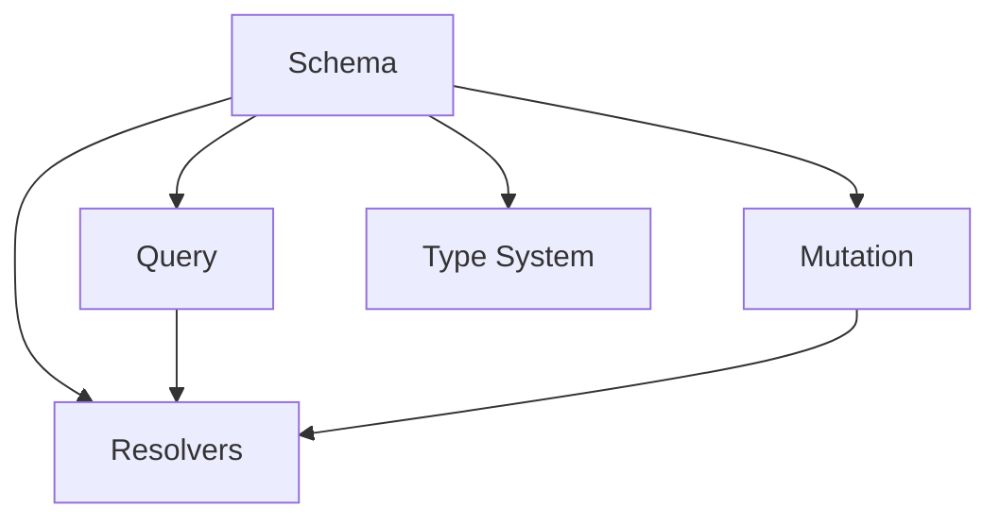
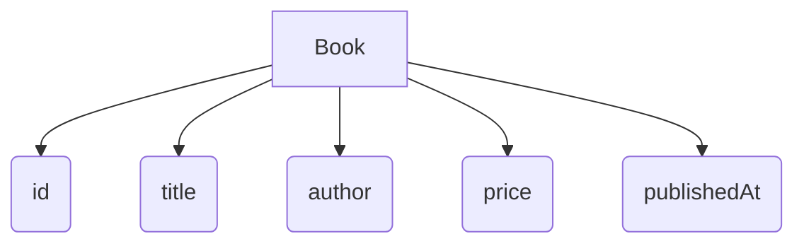

                 

# GraphQL：灵活高效的API查询语言

在现代互联网应用程序中，API（应用程序接口）扮演着至关重要的角色。它们负责在不同的系统之间传递数据，使不同的服务和组件能够协同工作。然而，传统API设计往往存在一些问题，比如，只能返回固定格式的硬编码数据，无法根据不同客户端的需求返回不同类型的数据，甚至可能面临API版本不兼容的困扰。

为了解决这些难题，一种名为GraphQL的新型API查询语言应运而生。GraphQL是由Facebook在2015年推出的一种API查询语言，它允许客户端明确地指定所需的数据，并且以最少的请求次数返回最优的数据。在本文中，我们将深入探讨GraphQL的核心概念、工作原理、实施步骤、优势和实际应用场景，帮助读者全面理解这一高效、灵活的API查询语言。

## 1. 背景介绍

### 1.1 问题由来
在Web应用开发的早期阶段，REST（Representational State Transfer） API成为了标准的选择。REST API的设计理念简单直观：使用HTTP请求的不同方法（如GET、POST、PUT、DELETE）来执行操作，通过URL传递资源和操作类型，以JSON或XML格式返回数据。然而，随着Web应用变得越来越复杂，REST API的设计缺陷逐渐显现。

- **硬编码数据格式**：REST API通常返回硬编码的JSON或XML数据格式，客户端需要按照API的指定格式解析数据，这限制了数据的灵活性。
- **无法动态调整数据**：客户端无法根据自身需求动态调整API返回的数据。
- **版本兼容性问题**：API的更新和扩展常常引发版本不兼容的问题，增加了维护成本。

为了应对这些问题，工程师们开始探索更为灵活的API设计方案。GraphQL就是其中一种解决方案，它通过允许客户端明确指定所需的数据，简化了API的设计和维护，提高了数据的灵活性和响应效率。

### 1.2 问题核心关键点
GraphQL的核心设计思想可以归纳为以下几个关键点：

- **动态数据查询**：允许客户端通过一个统一的查询语言指定所需的数据，无需事先定义API接口。
- **灵活的数据结构**：返回的数据结构可以根据客户端的需求动态调整，更加灵活。
- **强大的类型系统**：GraphQL具备强大的类型系统，可以描述数据结构，增强API的可读性和维护性。
- **高效的性能优化**：通过批量查询和延迟加载等技术，减少网络请求次数，提高API响应效率。

这些设计理念使得GraphQL成为一种高效、灵活、易于维护的API查询语言。

## 2. 核心概念与联系

### 2.1 核心概念概述

为了更好地理解GraphQL的工作原理，我们需要了解以下几个核心概念：

- **Schema**：GraphQL的Schema定义了API可返回的数据类型和它们的结构，类似于传统数据库的Schema。
- **Query**：客户端通过GraphQL查询语言查询数据，通常使用GraphQL Query语言。
- **Mutation**：与Query类似，Mutation用于修改数据。与REST API的HTTP动词对应，GraphQL中的Mutation也用于执行插入、更新、删除等操作。
- **Resolvers**：Resolvers是GraphQL查询和Mutation的实现，用于根据查询参数返回相应的数据。
- **Type System**：GraphQL使用Type System来描述数据类型和它们之间的关系，增强API的可读性和维护性。

这些概念构成了GraphQL的核心架构，下面通过一个Mermaid流程图来展示它们之间的联系：



这个流程图展示了GraphQL的基本工作流程：Schema定义了可查询和可修改的数据类型和结构，通过Query和Mutation查询和修改数据，Resolvers根据查询参数返回数据，同时Type System增强了API的可读性和维护性。

## 3. 核心算法原理 & 具体操作步骤

### 3.1 算法原理概述

GraphQL的原理可以概括为以下三个步骤：

1. **Schema定义**：定义API可返回的数据类型和结构。
2. **客户端查询**：客户端通过GraphQL查询语言指定所需的数据。
3. **数据解析**：服务端解析查询，执行Resolvers返回数据。

GraphQL的查询和数据解析过程使用了类似于事件驱动的设计模式，客户端发起查询请求，服务端根据请求解析并返回数据。这种设计使得GraphQL能够灵活地适应不同的客户端需求，并提高API的响应效率。

### 3.2 算法步骤详解

GraphQL的算法步骤如下：

1. **Schema定义**：首先，我们需要定义API的Schema，包括所有可返回的数据类型和它们之间的关系。例如，定义一个简单的图书API，Schema如下：

    ```graphql
    type Book {
        id: ID!
        title: String!
        author: String
        price: Float!
        publishedAt: String!
    }
    ```

2. **客户端查询**：客户端通过GraphQL查询语言，指定所需的数据。例如，客户端可能希望查询所有图书的信息：

    ```graphql
    query {
        allBooks {
            id
            title
            author
            price
            publishedAt
        }
    }
    ```

3. **数据解析**：服务端根据查询参数，解析并执行Resolvers返回数据。例如，在上面的查询中，服务端可以返回所有图书的id、标题、作者、价格和出版日期。

### 3.3 算法优缺点

GraphQL的优点如下：

- **灵活的数据查询**：客户端可以动态指定所需的数据，无需事先定义API接口。
- **减少网络请求次数**：通过批量查询和延迟加载等技术，减少网络请求次数，提高API响应效率。
- **强大的类型系统**：GraphQL的类型系统可以描述数据结构，增强API的可读性和维护性。

GraphQL的缺点如下：

- **学习曲线较陡**：GraphQL的查询语言较为复杂，需要一定的学习成本。
- **Schema设计复杂**：Schema的设计需要考虑数据类型之间的关系，复杂度较高。

### 3.4 算法应用领域

GraphQL在多个领域都展现出了其优势，以下是一些典型的应用场景：

- **Web应用**：用于构建灵活、高效、易于维护的Web应用API。
- **移动应用**：为移动应用提供数据查询和修改功能。
- **API聚合**：将多个独立服务的API聚合到一个GraphQL服务中，提供统一的API接口。
- **物联网**：为物联网设备提供统一的数据查询接口。
- **电子商务**：为电子商务平台提供高效的API接口。

## 4. 数学模型和公式 & 详细讲解 & 举例说明

### 4.1 数学模型构建

GraphQL的核心数学模型是类型系统（Type System），它用于描述API返回的数据类型和它们之间的关系。GraphQL的类型系统由以下几个部分组成：

- **标量类型（Scalar Types）**：基本数据类型，如Int、Float、String等。
- **对象类型（Object Types）**：复合数据类型，由多个字段组成，每个字段对应一个数据类型。
- **枚举类型（Enum Types）**：表示一组有限的值。
- **联合类型（Union Types）**：表示多种可能的数据类型。

GraphQL的类型系统可以表示为图的形式，每个节点代表一个类型，边表示类型之间的关系。例如，下面的类型系统表示一个图书API：

```graphql
type Book {
    id: ID!
    title: String!
    author: String
    price: Float!
    publishedAt: String!
}
```

### 4.2 公式推导过程

GraphQL的类型系统可以表示为一个有向无环图（DAG），其中每个节点代表一个类型，边表示类型之间的关系。例如，上面的图书类型系统可以表示为：



这个DAG表示了图书类型中各个字段之间的关系。例如，每个图书都有一个唯一的id，一个标题，一个作者，一个价格和一个出版日期。

### 4.3 案例分析与讲解

假设我们有一个图书API，包含以下数据：

```json
[
    {
        "id": 1,
        "title": "The Great Gatsby",
        "author": "F. Scott Fitzgerald",
        "price": 19.99,
        "publishedAt": "1925-04-10"
    },
    {
        "id": 2,
        "title": "To Kill a Mockingbird",
        "author": "Harper Lee",
        "price": 13.99,
        "publishedAt": "1960-07-11"
    }
]
```

我们可以定义一个GraphQL Schema，允许客户端查询所有图书的信息：

```graphql
type Book {
    id: ID!
    title: String!
    author: String
    price: Float!
    publishedAt: String!
}

type Query {
    allBooks: [Book]
}
```

然后，客户端可以通过GraphQL查询语言指定所需的数据：

```graphql
query {
    allBooks {
        id
        title
        author
        price
        publishedAt
    }
}
```

服务端根据查询参数，解析并执行Resolvers返回数据：

```python
from graphql import GraphQLError, GraphQLSchema, GraphQLObjectType
from graphql.execution import execute, execute_async

# 定义类型
book_type = GraphQLObjectType(
    name="Book",
    fields={
        "id": "id",
        "title": "title",
        "author": "author",
        "price": "price",
        "publishedAt": "publishedAt"
    }
)

# 定义查询类型
query_type = GraphQLObjectType(
    name="Query",
    fields={
        "allBooks": "allBooks"
    }
)

# 定义Schema
schema = GraphQLSchema(query=query_type, types=[book_type])

# 数据
books = [
    {
        "id": 1,
        "title": "The Great Gatsby",
        "author": "F. Scott Fitzgerald",
        "price": 19.99,
        "publishedAt": "1925-04-10"
    },
    {
        "id": 2,
        "title": "To Kill a Mockingbird",
        "author": "Harper Lee",
        "price": 13.99,
        "publishedAt": "1960-07-11"
    }
]

# 执行查询
result = execute(schema, "{ allBooks { id, title, author, price, publishedAt } }", books)
print(result)
```

执行结果为：

```json
{
    "data": {
        "allBooks": [
            {
                "id": "1",
                "title": "The Great Gatsby",
                "author": "F. Scott Fitzgerald",
                "price": 19.99,
                "publishedAt": "1925-04-10"
            },
            {
                "id": "2",
                "title": "To Kill a Mockingbird",
                "author": "Harper Lee",
                "price": 13.99,
                "publishedAt": "1960-07-11"
            }
        ]
    }
}
```

## 5. 项目实践：代码实例和详细解释说明

### 5.1 开发环境搭建

为了使用GraphQL，我们需要安装GraphQL的开发环境。首先，我们需要安装Python的GraphQL库：

```bash
pip install graphql-core
```

然后，安装GraphiQL，一个用于调试GraphQL API的工具：

```bash
npm install -g graphiql
```

### 5.2 源代码详细实现

下面是一个简单的GraphQL服务器的实现，使用Python和GraphQL库：

```python
from graphql import GraphQLError, GraphQLSchema, GraphQLObjectType, GraphQLString, GraphQLInt, GraphQLFloat
from graphql.execution import execute, execute_async
from flask import Flask, request, jsonify

# 定义类型
book_type = GraphQLObjectType(
    name="Book",
    fields={
        "id": GraphQLInt(),
        "title": GraphQLString(),
        "author": GraphQLString(),
        "price": GraphQLFloat(),
        "publishedAt": GraphQLString()
    }
)

# 定义查询类型
query_type = GraphQLObjectType(
    name="Query",
    fields={
        "allBooks": GraphQLList(book_type)
    }
)

# 定义Schema
schema = GraphQLSchema(query=query_type, types=[book_type])

# 数据
books = [
    {
        "id": 1,
        "title": "The Great Gatsby",
        "author": "F. Scott Fitzgerald",
        "price": 19.99,
        "publishedAt": "1925-04-10"
    },
    {
        "id": 2,
        "title": "To Kill a Mockingbird",
        "author": "Harper Lee",
        "price": 13.99,
        "publishedAt": "1960-07-11"
    }
]

# 创建Flask应用
app = Flask(__name__)

# 定义GraphQL查询接口
@app.route('/graphql', methods=['POST'])
def graphql():
    query = request.form.get('query')
    variables = request.form.get('variables')
    result = execute(schema, query, variables)
    return jsonify(result.data), 200

if __name__ == '__main__':
    app.run(host='0.0.0.0', port=4000)
```

### 5.3 代码解读与分析

在这段代码中，我们定义了一个简单的GraphQL服务器，使用Flask框架。首先，我们定义了图书类型book_type和查询类型query_type。然后，我们创建了一个Schema，将这两个类型作为它的子类型。接下来，我们定义了服务器的路由，接收POST请求的查询和变量，并执行查询。最后，我们将结果以JSON格式返回给客户端。

### 5.4 运行结果展示

启动服务器后，我们可以通过GraphiQL界面测试我们的GraphQL API。GraphiQL是一个基于浏览器的GraphQL IDE，可以通过访问`http://localhost:4000/graphql`来访问它。在GraphiQL界面中，输入以下查询：

```graphql
query {
    allBooks {
        id
        title
        author
        price
        publishedAt
    }
}
```

点击“Run”按钮，服务器将返回所有图书的信息。

## 6. 实际应用场景

### 6.1 智能推荐系统

GraphQL的灵活性在智能推荐系统中大放异彩。传统的推荐系统通常使用静态的API接口，返回固定格式的数据。然而，使用GraphQL，推荐系统可以根据用户的历史行为和偏好，动态返回推荐结果。例如，一个基于GraphQL的推荐系统可以接收用户的历史点击记录、浏览记录、评分等数据，动态返回推荐的商品、文章等，满足不同用户的需求。

### 6.2 实时数据处理

GraphQL的批量查询和延迟加载功能，使其成为实时数据处理的好选择。在实时数据处理场景中，GraphQL可以根据客户端的需求，动态查询最新的数据，并将变化的数据推送给客户端。例如，一个基于GraphQL的实时数据处理系统可以用于股票市场数据、实时新闻等场景。

### 6.3 移动应用

GraphQL的灵活性和高效性使其成为移动应用API的理想选择。传统的REST API通常返回固定格式的数据，而移动应用需要动态获取数据。GraphQL可以根据移动应用的需求，动态返回数据，满足不同场景下的数据需求。

## 7. 工具和资源推荐

### 7.1 学习资源推荐

为了帮助读者系统掌握GraphQL，以下是一些优质的学习资源：

1. **GraphQL官方文档**：GraphQL官方文档提供了丰富的教程、API指南和最佳实践，是学习GraphQL的必备资源。

2. **GraphQL教程**：由Microsoft提供的GraphQL教程，涵盖了GraphQL的基础知识和高级应用，适合初学者和中级开发者。

3. **GraphQL实战**：由O'Reilly出版的GraphQL实战书籍，提供了大量实际项目的代码和案例，适合实战学习。

4. **GraphQL Playground**：一个在线的GraphQL工具，可以方便地测试GraphQL API，适合初学者和开发人员。

5. **GraphQL conferences**：GraphQL Summit和GraphQL Developer Conference等会议，提供最新的GraphQL技术和应用案例，适合深度学习和交流。

### 7.2 开发工具推荐

为了提高GraphQL的开发效率，以下是一些常用的开发工具：

1. **GraphiQL**：一个基于浏览器的GraphQL IDE，用于调试和测试GraphQL API。

2. **Prisma**：一个GraphQL与数据库的连接工具，将GraphQL与关系型数据库、NoSQL数据库等进行集成，提供了数据查询和修改的功能。

3. **Apollo Server**：一个基于Node.js的GraphQL服务器，提供了丰富的API接口、数据缓存和订阅功能。

4. **GraphQL IDEs**：如GraphQL Explorer和CodeSandbox等，提供了可视化的GraphQL编辑器和调试工具。

### 7.3 相关论文推荐

GraphQL的快速发展离不开学界的持续研究。以下是几篇奠基性的相关论文，推荐阅读：

1. **GraphQL for Humans**：由Facebook的Yanick Chabert撰写，介绍了GraphQL的基本概念和设计理念。

2. **GraphQL: GraphQL - The Next Evolution of APIs**：由Facebook的Andrew Hiltbrand撰写，介绍了GraphQL的核心特性和优势。

3. **A Survey of Graph Query Languages**：由Kristoffer Hitter和Maysam Mahmoud撰写，介绍了Graph Query语言的演进和GraphQL的现状。

4. **GraphQL: A Full API for Your App**：由Vincent Couvreur撰写，介绍了GraphQL在Web开发中的应用案例。

## 8. 总结：未来发展趋势与挑战

### 8.1 研究成果总结

GraphQL作为一种新型API查询语言，凭借其灵活性、高效性和可维护性，已经在多个领域得到了广泛的应用。GraphQL的原理是通过Schema定义API的数据结构，允许客户端动态查询所需的数据，从而提高API的响应效率和灵活性。

### 8.2 未来发展趋势

未来，GraphQL将继续在Web应用、移动应用、智能推荐系统等领域发挥重要作用。随着技术的不断进步，GraphQL也将不断演进，提升其性能和功能。例如，GraphQL可能会引入更多的数据类型和操作，增强其表达能力和应用场景。

### 8.3 面临的挑战

尽管GraphQL在多个领域展现出了其优势，但仍然面临着一些挑战：

- **Schema设计复杂**：Schema的设计需要考虑数据类型之间的关系，复杂度较高。
- **学习曲线较陡**：GraphQL的查询语言较为复杂，需要一定的学习成本。
- **性能优化**：GraphQL的查询和解析过程需要优化，以提高响应效率。

### 8.4 研究展望

未来的研究将集中在以下几个方面：

- **Schema自动化生成**：自动生成Schema可以减少开发者的工作量，提高开发效率。
- **GraphQL与数据库的集成**：将GraphQL与关系型数据库、NoSQL数据库等进行集成，提供更加灵活的数据查询和修改功能。
- **GraphQL与其他API标准的一致性**：探索GraphQL与其他API标准（如REST API、WebSockets等）的一致性和兼容性，提升GraphQL的通用性。

总之，GraphQL作为一种高效、灵活的API查询语言，正在改变API设计和应用的方式。随着技术的发展，GraphQL将在更多的领域得到应用，带来更高效、更灵活的API开发和部署体验。

## 9. 附录：常见问题与解答

**Q1：GraphQL的查询语言是否简单易学？**

A: GraphQL的查询语言相对复杂，需要一定的学习成本。但是，一旦掌握了其基本概念和语法，就可以灵活地指定所需的数据，提高开发效率。

**Q2：GraphQL与REST API相比有何优势？**

A: GraphQL相对于REST API的优势在于其灵活性和高效性。GraphQL允许客户端动态查询所需的数据，减少网络请求次数，提高API响应效率。

**Q3：如何优化GraphQL的查询性能？**

A: 优化GraphQL的查询性能可以通过以下几种方法：

- 使用批量查询和延迟加载技术，减少网络请求次数。
- 优化Schema的设计，减少复杂度。
- 使用缓存技术，提高数据访问速度。

**Q4：GraphQL是否适用于所有场景？**

A: GraphQL适用于数据结构复杂、客户端需求多样的场景，如智能推荐系统、实时数据处理等。但对于一些简单的API场景，REST API可能更加适合。

总之，GraphQL作为一种高效、灵活的API查询语言，正在改变API设计和应用的方式。未来，随着技术的发展和普及，GraphQL将在更多的领域得到应用，带来更高效、更灵活的API开发和部署体验。

---

作者：禅与计算机程序设计艺术 / Zen and the Art of Computer Programming

