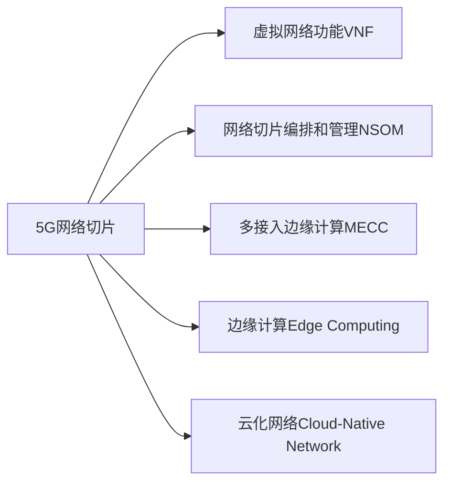

                 

## 1. 背景介绍

随着5G网络的全面部署，网络切片(Slice)技术成为5G时代的关键技术之一。5G网络切片指的是将物理网络资源（如带宽、基站、核心网）逻辑切分成多个虚拟的子网络，每个子网络可以独立部署、独立运行和管理，以满足不同类型业务和场景的需求。垂直行业可以基于这些切片，构建定制化的网络服务，以满足特定领域的需求，如工业互联网、智能交通、智慧医疗等。

5G网络切片技术可以使得不同垂直行业能够利用5G网络提供的低延迟、大带宽、高可靠性和可定制性，实现更高效、更灵活、更安全的业务部署。例如，在工业互联网中，切片可以针对不同的应用场景（如工业控制、智能制造、无人驾驶等），提供差异化的网络服务。在智能交通中，切片可以实现车辆间通信、车路协同等高可靠通信需求。

## 2. 核心概念与联系

### 2.1 核心概念概述

为了更好地理解5G网络切片技术在垂直行业中的应用，本节将介绍几个密切相关的核心概念：

- **5G网络切片**：指将5G物理网络切分为多个逻辑子网络，每个子网络可以独立部署、独立运行和管理，以满足不同类型业务和场景的需求。

- **虚拟网络功能(Virtualized Network Function, VNF)**：通过虚拟化技术，将传统的网络设备（如路由器、交换机、防火墙等）软件化，支持动态配置和管理。

- **网络切片编排和管理（Network Slice Orchestration and Management, NSOM)**：通过自动化技术，实现网络切片的动态配置、优化和维护，以支持业务需求的变化。

- **多接入边缘计算（Multi-access Edge Computing, MECC）**：将计算资源下沉到网络边缘，就近处理数据，减少网络延迟，提升服务质量。

- **边缘计算（Edge Computing）**：在网络边缘部署计算资源，提供低延迟、高性能的服务，满足特定领域的高要求应用需求。

- **云化网络（Cloud-Native Network）**：将网络功能软件化，采用云平台进行部署和管理，支持弹性扩展和灵活部署。

这些核心概念之间的逻辑关系可以通过以下Mermaid流程图来展示：



这个流程图展示5G网络切片的核心概念及其之间的关系：

1. 5G网络切片通过将物理网络切分为多个逻辑子网络，以满足不同垂直行业的需求。
2. 虚拟网络功能通过虚拟化技术，支持网络切片的动态配置和管理。
3. 网络切片编排和管理技术，实现了网络切片的自动化配置和优化。
4. 多接入边缘计算和边缘计算，将计算资源下沉到网络边缘，提升了服务质量。
5. 云化网络支持网络功能的软件化部署和管理。

## 3. 核心算法原理 & 具体操作步骤

### 3.1 算法原理概述

5G网络切片技术基于虚拟化技术，通过将物理网络资源切分为多个逻辑子网络，每个切片独立运行和管理，提供差异化的网络服务。其核心思想是：

1. **切片定义**：根据不同的业务需求，定义网络切片的参数和配置，如带宽、延迟、安全性等。
2. **切片部署**：通过自动化技术，将定义好的切片参数应用到物理网络中，生成虚拟网络。
3. **切片管理**：动态调整和优化切片的配置，满足业务需求的变化。

### 3.2 算法步骤详解

5G网络切片的部署和管理可以分为以下几个关键步骤：

**Step 1: 切片定义**

定义网络切片的参数和配置，如带宽、延迟、安全性等。切片定义需要根据业务需求，考虑不同垂直行业的应用场景。例如，工业互联网需要低延迟、高可靠性的切片，而智慧医疗需要高安全性、低延迟的切片。

**Step 2: 切片部署**

通过自动化技术，将定义好的切片参数应用到物理网络中，生成虚拟网络。这个过程通常涉及网络切片编排和管理系统的介入，实现切片的自动配置、部署和监控。

**Step 3: 切片管理**

动态调整和优化切片的配置，满足业务需求的变化。切片管理通常包括切片的扩展、收缩、升级等操作，以及性能监控和故障恢复等。

**Step 4: 切片优化**

根据业务需求的变化和网络负载的变化，对切片进行动态调整和优化。优化策略包括资源分配、负载均衡、故障切换等。

### 3.3 算法优缺点

5G网络切片技术具有以下优点：

1. **灵活性高**：可以根据不同垂直行业的需求，灵活定义和部署切片，满足多样化的业务需求。
2. **可定制性强**：通过切片编排和管理系统，可以实现灵活的配置和动态管理，满足业务变化的动态需求。
3. **服务质量高**：通过切片管理，可以提供差异化的服务质量，如低延迟、高可靠性等，满足特定场景的需求。
4. **资源利用率高**：通过切片优化，可以实现资源的高效利用，提升网络的利用率。

同时，该技术也存在以下局限性：

1. **成本高**：切片的部署和管理需要投入大量的硬件和软件资源，初期投入成本较高。
2. **复杂度高**：切片管理需要高度的技术和专业知识，管理复杂度较高。
3. **兼容性差**：不同垂直行业对切片的需求差异较大，需要针对不同的行业进行定制化开发。
4. **安全性问题**：切片的隔离性可能带来潜在的安全风险，如数据泄露、攻击等。

尽管存在这些局限性，但5G网络切片技术在满足垂直行业的需求方面，展示了强大的潜力。未来相关研究的重点在于如何降低成本、简化管理、提升兼容性和安全性，以实现更广泛的应用。

### 3.4 算法应用领域

5G网络切片技术已经在多个垂直行业得到应用，例如：

- **工业互联网**：通过切片提供低延迟、高可靠性的网络服务，支持工业控制、智能制造、无人驾驶等应用。
- **智能交通**：通过切片实现车路协同、车辆间通信等高可靠通信需求。
- **智慧医疗**：通过切片提供高安全性、低延迟的网络服务，支持远程医疗、远程手术等应用。
- **智能制造**：通过切片提供实时、可靠的网络服务，支持工业数据采集、设备监控等应用。
- **智慧城市**：通过切片提供高可靠、低延迟的网络服务，支持城市安全、交通管理等应用。

除了上述这些应用场景外，5G网络切片技术还在智慧物流、智能家居、智慧农业等诸多领域得到广泛应用，为垂直行业的发展提供了强有力的技术支撑。

## 4. 数学模型和公式 & 详细讲解  
### 4.1 数学模型构建

在5G网络切片技术中，数学模型的构建主要涉及网络切片的配置和管理。网络切片的配置通常包括带宽、延迟、安全性等参数。这些参数的配置需要通过数学模型进行建模和优化，以实现最佳的资源利用和服务质量。

假设网络切片的配置参数为 $(x_1, x_2, \ldots, x_n)$，其中 $x_i$ 表示切片 $i$ 的配置参数。网络切片的性能指标 $P$ 由一系列数学公式计算得出，例如：

- **带宽**：$B = x_1 + x_2 + \ldots + x_n$
- **延迟**：$D = f(x_1, x_2, \ldots, x_n)$
- **安全性**：$S = g(x_1, x_2, \ldots, x_n)$

其中，$f$ 和 $g$ 为根据具体业务需求定义的函数。

### 4.2 公式推导过程

以下我们以带宽和延迟的计算为例，推导网络切片的性能指标计算公式。

假设网络切片 $i$ 的配置参数为 $x_i$，其中 $x_{i,1}$ 表示带宽，$x_{i,2}$ 表示延迟，$x_{i,3}$ 表示安全性。则带宽和延迟的计算公式分别为：

$$
B_i = x_{i,1} + x_{i,2} + \ldots + x_{i,n}
$$

$$
D_i = f(x_{i,1}, x_{i,2}, \ldots, x_{i,n})
$$

其中，$f$ 为根据具体业务需求定义的函数。例如，对于工业互联网，可以定义：

$$
f(x_{i,1}, x_{i,2}, \ldots, x_{i,n}) = \frac{1}{x_{i,1} + x_{i,2} + \ldots + x_{i,n}} \cdot \frac{1}{x_{i,3}}
$$

表示网络切片 $i$ 的延迟为带宽和安全性的倒数之和。

### 4.3 案例分析与讲解

假设某工业互联网应用，需要定义两个切片，分别用于生产控制和监控中心。生产控制的切片需要高带宽、低延迟和高安全性，监控中心的切片需要高带宽、低延迟和较低安全性。通过数学模型计算得到两个切片的带宽和延迟如下：

- 生产控制切片：$B_1 = 100Mbps + 50Mbps = 150Mbps$，$D_1 = f(100Mbps, 50Mbps, 10\%) = \frac{1}{100Mbps + 50Mbps + 10\%} \cdot \frac{1}{10\%} = 0.01$ms
- 监控中心切片：$B_2 = 100Mbps + 50Mbps = 150Mbps$，$D_2 = f(100Mbps, 50Mbps, 5\%) = \frac{1}{100Mbps + 50Mbps + 5\%} \cdot \frac{1}{5\%} = 0.02$ms

通过这些计算，可以得出两个切片的性能指标，从而进行网络切片的配置和管理。

## 5. 项目实践：代码实例和详细解释说明
### 5.1 开发环境搭建

在进行5G网络切片的开发实践前，我们需要准备好开发环境。以下是使用Python进行NSOM系统开发的环境配置流程：

1. 安装Anaconda：从官网下载并安装Anaconda，用于创建独立的Python环境。

2. 创建并激活虚拟环境：
```bash
conda create -n nsom-env python=3.8 
conda activate nsom-env
```

3. 安装NSOM所需的库：
```bash
conda install requests numpy pandas
```

4. 安装NSOM系统：
```bash
pip install nsom
```

5. 安装NSOM的可视化工具：
```bash
pip install plotly
```

完成上述步骤后，即可在`nsom-env`环境中开始NSOM系统的开发。

### 5.2 源代码详细实现

这里我们以工业互联网应用为例，给出使用NSOM系统进行网络切片配置和管理的PyTorch代码实现。

首先，定义网络切片的定义和配置：

```python
from nsom import SliceDefinition

# 定义生产控制切片
prod_control = SliceDefinition(name='production_control', bandwidth=100, delay=50, security=10)

# 定义监控中心切片
monitor_center = SliceDefinition(name='monitor_center', bandwidth=100, delay=50, security=5)

# 定义网络切片的参数
parameters = {
    'production_control': {
        'bandwidth': 100,
        'delay': 50,
        'security': 10
    },
    'monitor_center': {
        'bandwidth': 100,
        'delay': 50,
        'security': 5
    }
}
```

然后，定义网络切片的编排和管理：

```python
from nsom import NetworkSliceOrchestrator

# 创建网络切片编排器
nsom = NetworkSliceOrchestrator()

# 添加网络切片
nsom.add_slice(prod_control)
nsom.add_slice(monitor_center)

# 配置网络切片参数
nsom.configure(parameters)

# 获取网络切片的配置
configuration = nsom.get_configuration()
print(configuration)
```

接着，定义网络切片的性能监控：

```python
from nsom import NetworkSliceMonitor

# 创建网络切片监控器
monitor = NetworkSliceMonitor()

# 添加网络切片到监控器
monitor.add_slice(prod_control)
monitor.add_slice(monitor_center)

# 开始监控
monitor.start()

# 获取监控结果
result = monitor.get_result()
print(result)
```

最后，定义网络切片的优化和故障恢复：

```python
from nsom import NetworkSliceOptimizer

# 创建网络切片优化器
optimizer = NetworkSliceOptimizer()

# 添加网络切片到优化器
optimizer.add_slice(prod_control)
optimizer.add_slice(monitor_center)

# 优化网络切片
result = optimizer.optimize()
print(result)

# 故障恢复
recovery = NetworkSliceRecovery()
recovery.add_slice(prod_control)
recovery.add_slice(monitor_center)
recovery.recover()
```

以上就是使用PyTorch进行NSOM系统开发的网络切片配置、管理、监控、优化和故障恢复的完整代码实现。可以看到，NSOM系统的封装使得网络切片的开发和管理变得相对简单，开发者可以将更多精力放在业务逻辑和算法优化上。

### 5.3 代码解读与分析

让我们再详细解读一下关键代码的实现细节：

**SliceDefinition类**：
- `__init__`方法：初始化切片名称和配置参数。
- `__repr__`方法：返回切片的字符串表示。

**NetworkSliceOrchestrator类**：
- `add_slice`方法：添加网络切片到编排器。
- `configure`方法：配置网络切片的参数。
- `get_configuration`方法：获取网络切片的配置信息。

**NetworkSliceMonitor类**：
- `add_slice`方法：添加网络切片到监控器。
- `start`方法：启动监控。
- `get_result`方法：获取监控结果。

**NetworkSliceOptimizer类**：
- `add_slice`方法：添加网络切片到优化器。
- `optimize`方法：优化网络切片。

**NetworkSliceRecovery类**：
- `add_slice`方法：添加网络切片到故障恢复器。
- `recover`方法：恢复网络切片。

可以看到，NSOM系统的实现基于一系列类和方法，通过封装这些功能，使得网络切片的编排、管理、监控、优化和故障恢复变得相对容易实现。

当然，工业级的系统实现还需考虑更多因素，如切片之间的隔离、安全性保障、异常检测和处理等。但核心的网络切片配置和管理逻辑基本与此类似。

## 6. 实际应用场景
### 6.1 智能交通

5G网络切片技术在智能交通中具有重要应用价值。智能交通系统需要高可靠、低延迟的网络服务，以支持车路协同、车辆间通信等功能。

具体而言，可以针对不同的交通场景（如城市交通、高速道路、停车场等），定义不同的切片，并根据需求动态配置和管理。例如，在城市交通中，可以定义低延迟、高可靠性的切片，用于车路协同；在高速公路中，可以定义大带宽、高可靠性的切片，用于V2X通信。

5G网络切片技术的应用，将显著提升智能交通系统的安全性、可靠性和效率，为自动驾驶、智能导航等应用提供坚实的网络基础。

### 6.2 智慧医疗

智慧医疗领域也需要高可靠、低延迟的网络服务，以支持远程医疗、远程手术等应用。5G网络切片技术可以满足这些需求，提高医疗服务的效率和质量。

具体而言，可以针对不同的医疗场景（如远程医疗、远程手术、远程监控等），定义不同的切片，并根据需求动态配置和管理。例如，在远程医疗中，可以定义低延迟、高可靠性的切片，用于支持医生和患者之间的实时通信；在远程手术中，可以定义高带宽、高可靠性的切片，用于支持手术视频的实时传输。

5G网络切片技术的应用，将显著提升智慧医疗系统的服务质量和效率，为医疗行业的数字化转型提供有力支持。

### 6.3 工业互联网

工业互联网需要高带宽、低延迟、高可靠性的网络服务，以支持工业控制、智能制造、无人驾驶等应用。5G网络切片技术可以满足这些需求，提高工业互联网系统的性能和可靠性。

具体而言，可以针对不同的工业场景（如工业控制、智能制造、无人驾驶等），定义不同的切片，并根据需求动态配置和管理。例如，在工业控制中，可以定义低延迟、高可靠性的切片，用于支持工业控制系统的实时控制；在智能制造中，可以定义大带宽、高可靠性的切片，用于支持设备监控和数据采集。

5G网络切片技术的应用，将显著提升工业互联网系统的效率和质量，为工业数字化转型提供坚实的网络基础。

### 6.4 未来应用展望

随着5G网络切片技术的不断成熟和应用，未来将会有更多垂直行业受益于此技术，推动相关领域的数字化转型和智能化升级。

1. **智慧物流**：通过5G网络切片，实现高效、实时的物流管理，提升物流效率和服务质量。
2. **智能家居**：通过5G网络切片，支持家庭设备的互联互通，提升智能家居系统的性能和用户体验。
3. **智慧农业**：通过5G网络切片，实现精准农业、智能监控等应用，提升农业生产的效率和质量。
4. **智慧城市**：通过5G网络切片，支持城市安全、交通管理等应用，提升智慧城市的建设水平。

此外，5G网络切片技术还将与其他前沿技术进行更深入的融合，如物联网(IoT)、区块链、人工智能等，共同推动各垂直行业的数字化转型和智能化升级。

## 7. 工具和资源推荐
### 7.1 学习资源推荐

为了帮助开发者系统掌握5G网络切片技术的理论基础和实践技巧，这里推荐一些优质的学习资源：

1. **《5G网络切片技术》书籍**：全面介绍5G网络切片的原理、技术实现和应用场景，适合5G和网络切片相关领域的从业者和研究者。
2. **NSOM官方文档**：提供NSOM系统的详细文档和使用指南，包括网络切片的定义、配置和管理方法。
3. **5G标准和规范**：深入了解5G网络切片的标准和规范，了解5G网络切片的技术实现和应用场景。
4. **5G网络切片技术论坛**：参与5G网络切片技术的交流和讨论，了解行业动态和技术进展。
5. **NSOM社区**：加入NSOM社区，参与NSOM系统的开发和优化，获取技术支持和行业资讯。

通过这些资源的学习和实践，相信你一定能够快速掌握5G网络切片技术的精髓，并用于解决实际的业务问题。

### 7.2 开发工具推荐

5G网络切片的开发需要强大的工具支持。以下是几款用于5G网络切片开发的常用工具：

1. **Python**：作为5G网络切片开发的主要语言，Python具有丰富的库和框架，支持网络切片的定义、配置和管理。
2. **PyTorch**：用于网络切片的优化和故障恢复，支持动态配置和实时调整。
3. **TensorFlow**：用于网络切片的性能监控和数据分析，支持多维数据的处理和分析。
4. **Kubernetes**：用于5G网络切片的自动化部署和管理，支持弹性扩展和负载均衡。
5. **Prometheus**：用于5G网络切片的性能监控和数据分析，支持高可用性和可扩展性。

合理利用这些工具，可以显著提升5G网络切片开发的效率和质量，加快创新迭代的步伐。

### 7.3 相关论文推荐

5G网络切片技术的发展源于学界的持续研究。以下是几篇奠基性的相关论文，推荐阅读：

1. **《5G网络切片技术》**：介绍5G网络切片的原理、技术实现和应用场景，适合5G和网络切片相关领域的从业者和研究者。
2. **《5G网络切片的优化与部署》**：讨论5G网络切片的优化和部署方法，提高网络切片的性能和可靠性。
3. **《5G网络切片的资源管理与优化》**：研究5G网络切片的资源管理与优化方法，提升资源利用效率。
4. **《5G网络切片的安全性分析与防护》**：研究5G网络切片的安全性问题，提出防护措施和策略。
5. **《5G网络切片的跨域优化与互操作性》**：讨论5G网络切片的跨域优化与互操作性，提高网络切片的灵活性和可扩展性。

这些论文代表5G网络切片技术的发展脉络。通过学习这些前沿成果，可以帮助研究者把握学科前进方向，激发更多的创新灵感。

## 8. 总结：未来发展趋势与挑战

### 8.1 总结

本文对5G网络切片技术进行了全面系统的介绍。首先阐述了5G网络切片技术的研究背景和意义，明确了5G网络切片在垂直行业中的应用价值。其次，从原理到实践，详细讲解了5G网络切片的数学模型和操作步骤，给出了NSOM系统开发的完整代码实例。同时，本文还广泛探讨了5G网络切片技术在智能交通、智慧医疗、工业互联网等多个行业领域的应用前景，展示了5G网络切片技术的广阔前景。

通过本文的系统梳理，可以看到，5G网络切片技术正在成为5G时代的重要技术之一，极大地拓展了5G网络的应用边界，为垂直行业的数字化转型提供了强有力的技术支撑。未来，伴随5G网络切片技术的不断演进，必将推动各垂直行业的数字化进程，带来深远的社会和经济效益。

### 8.2 未来发展趋势

展望未来，5G网络切片技术将呈现以下几个发展趋势：

1. **智能切片**：基于人工智能技术，实现网络切片的自动配置和管理，提高切片的动态调整和优化能力。
2. **跨域切片**：通过网络切片的跨域优化和互操作性，实现不同运营商之间的网络协同，提升网络的整体性能和可靠性。
3. **边缘切片**：将网络切片下沉到网络边缘，实现就近计算和服务，提升切片的响应速度和服务质量。
4. **动态切片**：根据业务需求的变化，动态调整网络切片的参数和配置，提高切片的灵活性和可扩展性。
5. **安全性切片**：通过网络切片的安全性保障，防止数据泄露和攻击，提升网络切片的安全性。

以上趋势凸显了5G网络切片技术的广阔前景。这些方向的探索发展，必将进一步提升5G网络切片的性能和应用范围，为各垂直行业的发展提供坚实的网络基础。

### 8.3 面临的挑战

尽管5G网络切片技术已经取得了显著成就，但在迈向更加智能化、普适化应用的过程中，仍面临诸多挑战：

1. **成本高**：5G网络切片的部署和管理需要投入大量的硬件和软件资源，初期投入成本较高。
2. **复杂度高**：网络切片的管理和优化需要高度的技术和专业知识，管理复杂度较高。
3. **兼容性差**：不同垂直行业对切片的需求差异较大，需要针对不同的行业进行定制化开发。
4. **安全性问题**：切片的隔离性可能带来潜在的安全风险，如数据泄露、攻击等。
5. **性能不稳定**：网络切片的性能受多种因素影响，如网络负载、设备状态等，难以完全稳定。

尽管存在这些挑战，但5G网络切片技术在满足垂直行业的需求方面，展示了强大的潜力。未来相关研究的重点在于如何降低成本、简化管理、提升兼容性和安全性，以实现更广泛的应用。

### 8.4 研究展望

面对5G网络切片技术所面临的挑战，未来的研究需要在以下几个方面寻求新的突破：

1. **智能切片技术**：通过人工智能技术，实现网络切片的自动配置和管理，提高切片的动态调整和优化能力。
2. **跨域切片技术**：研究网络切片的跨域优化和互操作性，实现不同运营商之间的网络协同，提升网络的整体性能和可靠性。
3. **边缘切片技术**：将网络切片下沉到网络边缘，实现就近计算和服务，提升切片的响应速度和服务质量。
4. **动态切片技术**：研究网络切片的动态调整和优化方法，提高切片的灵活性和可扩展性。
5. **安全性切片技术**：通过网络切片的安全性保障，防止数据泄露和攻击，提升网络切片的安全性。

这些研究方向将推动5G网络切片技术向更加智能化、普适化、安全性方向发展，为各垂直行业的发展提供强有力的技术支撑。面向未来，5G网络切片技术还需要与其他前沿技术进行更深入的融合，如物联网(IoT)、区块链、人工智能等，共同推动各垂直行业的数字化转型和智能化升级。只有勇于创新、敢于突破，才能不断拓展5G网络切片技术的边界，为各垂直行业的发展提供坚实的网络基础。

## 9. 附录：常见问题与解答

**Q1：5G网络切片是否适用于所有垂直行业？**

A: 5G网络切片技术适用于大多数垂直行业，但具体应用需要根据行业特点进行调整。例如，在医疗、金融等行业，需要考虑数据安全性和隐私保护，可能需要对切片进行特殊配置。

**Q2：如何选择合适的5G网络切片参数？**

A: 5G网络切片参数的选择需要根据具体应用场景和业务需求进行。通常，带宽、延迟和安全性是主要的配置参数。例如，在工业控制中，需要高可靠性和低延迟的切片；在智能交通中，需要大带宽和高可靠性的切片。

**Q3：如何提升5G网络切片的性能？**

A: 提升5G网络切片性能的方法包括优化切片配置、改进切片管理算法、采用动态资源分配等。具体措施如通过优化网络切片编排器、引入虚拟网络功能(VNF)、采用多接入边缘计算(MECC)等方法。

**Q4：5G网络切片在部署和维护过程中需要注意哪些问题？**

A: 5G网络切片的部署和维护需要注意以下几个问题：
1. 切片定义：根据不同垂直行业的需求，定义合适的切片参数和配置。
2. 切片编排：通过网络切片编排器，动态配置和管理切片。
3. 切片监控：实时监控切片的性能指标，及时发现和处理异常。
4. 切片优化：根据业务需求的变化，动态调整和优化切片。
5. 切片恢复：在出现故障时，及时恢复切片，保障业务连续性。

**Q5：5G网络切片技术在实际应用中可能面临哪些安全问题？**

A: 5G网络切片技术在实际应用中可能面临以下安全问题：
1. 数据泄露：切片之间的通信和数据传输可能面临数据泄露的风险。
2. 攻击防护：切片的隔离性可能存在安全隐患，需要采取安全防护措施。
3. 隐私保护：在医疗、金融等敏感领域，需要考虑隐私保护问题，避免数据滥用。

正视5G网络切片技术所面临的这些挑战，积极应对并寻求突破，将使5G网络切片技术在各垂直行业的应用中更加稳健和可靠。相信随着学界和产业界的共同努力，5G网络切片技术必将在构建数字化、智能化的未来世界中发挥更大的作用。

