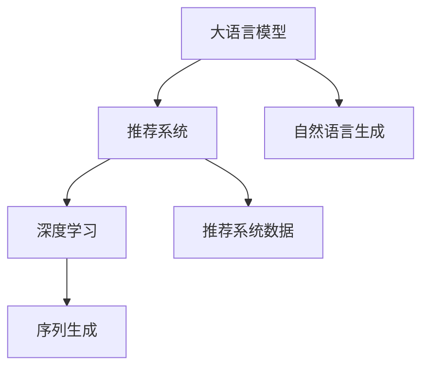

                 

# LLM AS RS: 大模型直接生成推荐

> 关键词：大语言模型, 推荐系统, 自然语言生成, 深度学习, 用户行为预测, 序列生成

## 1. 背景介绍

### 1.1 问题由来
推荐系统（Recommendation System, RS）是面向用户个性化需求，提供商品、服务、内容等推荐信息的软件系统。其核心在于对用户行为进行建模，预测用户的潜在兴趣，从而生成推荐结果。推荐系统在电商、社交、内容分发等领域得到了广泛应用，已成为互联网产品设计的关键组成部分。

近年来，随着深度学习技术的发展，推荐系统迎来了新的突破，涌现出了基于深度学习的推荐模型。其中，基于序列生成的方法，通过建模用户行为序列，直接预测下一篇可能点击的内容，取得了优异的性能。这类模型以用户历史行为序列为输入，使用RNN、LSTM、GRU等序列模型，逐步预测下一步行为，实现推荐。

但传统的基于序列生成的方法，面临着以下问题：
1. 模型复杂度高，计算成本高。序列生成模型通常包含多层的循环神经网络，计算量大，难以直接应用到大规模推荐系统中。
2. 建模粒度粗，预测效果不稳定。序列模型主要关注时间上的局部特征，而难以捕捉到高维用户兴趣的变化。

为了应对这些问题，研究者们开始探索将大语言模型（Large Language Model, LLM）应用于推荐系统的新范式，即LLM作为推荐系统（LLM as Recommendation System, LLM AS RS）。

### 1.2 问题核心关键点
LLM AS RS的核心在于，利用大语言模型强大的自然语言理解和生成能力，通过学习用户行为序列，直接生成推荐结果。与传统的基于序列生成的推荐方法不同，LLM AS RS不需要专门设计复杂的序列模型，只需将用户行为序列作为文本输入，由模型直接生成推荐结果。

LLM AS RS的实现流程如下：
1. 收集用户行为序列数据，例如浏览记录、购买记录、点击记录等。
2. 将行为序列转化为文本输入，例如使用简洁的序列编码方式。
3. 使用预训练的大语言模型（如GPT-3、BERT等），将用户行为序列作为文本输入，生成推荐结果。
4. 将推荐结果转化为具体的商品、服务或内容，提供给用户。

这种基于大语言模型的推荐方法，可以克服传统方法的计算复杂度、建模粒度等问题，实现更高效、稳定的推荐。

### 1.3 问题研究意义
LLM AS RS的提出，为推荐系统带来了新的研究方向和突破，具有以下研究意义：
1. 提升推荐精度。大语言模型具备强大的语义理解和生成能力，可以直接学习用户行为序列的隐含语义，生成更准确的推荐结果。
2. 降低计算成本。大语言模型可以并行计算，计算速度较快，比复杂的序列模型更适于大规模推荐系统的应用。
3. 增强推荐多样性。大语言模型可以生成多种可能的推荐结果，提升推荐多样性。
4. 提高系统可解释性。大语言模型生成的推荐结果可解释性强，便于用户理解推荐依据。

总之，LLM AS RS为推荐系统开辟了新的研究道路，有望提升推荐系统的整体性能和应用范围。

## 2. 核心概念与联系

### 2.1 核心概念概述

为更好地理解LLM AS RS方法，本节将介绍几个密切相关的核心概念：

- 大语言模型（LLM）：指以自回归或自编码模型为代表的，在大规模无标签文本语料上进行预训练的语言模型。通过预训练，LLM具备了强大的自然语言理解和生成能力。

- 推荐系统（RS）：指通过建模用户行为，预测用户兴趣，生成推荐信息的软件系统。常见的推荐系统包括基于协同过滤、基于内容、基于混合方法等。

- 自然语言生成（NLG）：指使用计算机自动生成自然语言文本的技术，常用于生成推荐结果、生成对话回复等。

- 深度学习（DL）：指利用神经网络等深度模型，解决机器学习任务的技术。在推荐系统中，深度学习模型常用于用户行为建模、推荐结果生成等。

- 序列生成（Seq Generation）：指使用序列模型，如RNN、LSTM等，生成序列数据的推荐系统。常用于推荐用户接下来可能会点击的内容。

- 推荐系统数据（RS Data）：指用于推荐系统建模的用户行为数据，包括浏览记录、购买记录、点击记录等。

这些核心概念之间的逻辑关系可以通过以下Mermaid流程图来展示：



这个流程图展示了大语言模型和推荐系统的主要关联，以及推荐系统中的核心组件。

## 3. 核心算法原理 & 具体操作步骤
### 3.1 算法原理概述

LLM AS RS的本质是利用大语言模型的自然语言生成能力，将用户行为序列转化为推荐结果。其核心思想是：将用户行为序列作为文本输入，使用大语言模型生成推荐结果。

形式化地，假设用户行为序列为 $x_1, x_2, \cdots, x_t$，其中 $x_i$ 表示用户第 $i$ 步的行为，例如浏览记录、点击记录等。目标是通过大语言模型 $M_{\theta}$，生成推荐结果 $y$，使得 $y$ 最有可能出现在用户序列 $x_1, x_2, \cdots, x_t$ 之后。

具体而言，假设 $M_{\theta}$ 为预训练的大语言模型，其输出为推荐结果的概率分布 $p(y|x_1, x_2, \cdots, x_t)$，则最优推荐结果 $y^*$ 可由以下公式计算得到：

$$
y^* = \mathop{\arg\max}_{y} p(y|x_1, x_2, \cdots, x_t)
$$

通过大语言模型，将推荐过程转化为自然语言生成问题，从而可以利用自然语言生成的方法，如训练、解码等，高效生成推荐结果。

### 3.2 算法步骤详解

LLM AS RS的实现流程包括以下几个关键步骤：

**Step 1: 准备数据和模型**
- 收集用户行为序列数据，如浏览记录、购买记录等，划分为训练集、验证集和测试集。
- 使用预训练的大语言模型 $M_{\theta}$，作为推荐模型的初始化参数。

**Step 2: 编码行为序列**
- 将用户行为序列转化为模型可接受的形式，例如使用简单的序列编码方式。
- 将编码后的序列作为大语言模型的输入。

**Step 3: 训练和微调模型**
- 使用训练集数据，对大语言模型进行微调，使其能够生成符合用户兴趣的推荐结果。
- 在微调过程中，设置合适的学习率和正则化参数。
- 使用验证集数据，评估模型性能，防止过拟合。

**Step 4: 生成推荐结果**
- 在测试集数据上，使用微调后的模型，生成推荐结果。
- 将推荐结果转化为具体的商品、服务或内容，提供给用户。

**Step 5: 反馈和优化**
- 根据用户点击行为，对推荐结果进行反馈，更新模型参数，进行迭代优化。
- 持续收集用户反馈，定期更新模型，保持推荐结果的准确性和多样性。

以上是LLM AS RS的一般流程。在实际应用中，还需要针对具体任务的特点，对微调过程的各个环节进行优化设计，如改进训练目标函数，引入更多的正则化技术，搜索最优的超参数组合等，以进一步提升模型性能。

### 3.3 算法优缺点

LLM AS RS具有以下优点：
1. 计算效率高。大语言模型可以并行计算，计算速度较快，比复杂的序列模型更适于大规模推荐系统的应用。
2. 生成推荐多样化。大语言模型可以生成多种可能的推荐结果，提升推荐多样性。
3. 可解释性强。大语言模型生成的推荐结果可解释性强，便于用户理解推荐依据。

同时，该方法也存在一定的局限性：
1. 数据依赖性强。推荐结果的质量取决于用户行为序列数据的质量，数据质量不好时，推荐效果可能不佳。
2. 模型复杂度高。尽管大语言模型计算速度快，但其复杂度仍然较高，需要较强的计算资源支持。
3. 存在偏差。大语言模型可能存在某些偏见，如性别、年龄等方面的偏见，影响推荐结果的公平性。

尽管存在这些局限性，但就目前而言，LLM AS RS仍是大语言模型应用于推荐系统的可行范式。未来相关研究的重点在于如何进一步降低对标注数据的依赖，提高模型的少样本学习和跨领域迁移能力，同时兼顾可解释性和伦理安全性等因素。

### 3.4 算法应用领域

LLM AS RS在大规模推荐系统中具有广泛的应用前景，覆盖了电商、社交、内容分发等多个领域：

- 电商推荐：在电商平台中，可以使用LLM AS RS为用户推荐商品。通过用户浏览记录和点击记录，生成推荐结果，提升用户购物体验。
- 社交推荐：在社交媒体中，可以使用LLM AS RS为用户推荐内容。通过用户评论、点赞等行为序列，生成推荐内容，提升用户粘性。
- 内容推荐：在新闻、视频等平台上，可以使用LLM AS RS为用户推荐相关内容。通过用户阅读记录和观看记录，生成推荐内容，提升内容分发效果。

除了上述这些经典任务外，LLM AS RS还被创新性地应用到更多场景中，如智能客服、金融理财、智能家居等，为推荐系统带来了全新的突破。随着大语言模型和LLM AS RS方法的不断进步，相信推荐系统将在更广阔的应用领域大放异彩。

## 4. 数学模型和公式 & 详细讲解  
### 4.1 数学模型构建

本节将使用数学语言对LLM AS RS方法进行更加严格的刻画。

记用户行为序列为 $x_1, x_2, \cdots, x_t$，其中 $x_i$ 表示用户第 $i$ 步的行为，例如浏览记录、点击记录等。目标是通过大语言模型 $M_{\theta}$，生成推荐结果 $y$，使得 $y$ 最有可能出现在用户序列 $x_1, x_2, \cdots, x_t$ 之后。

假设大语言模型 $M_{\theta}$ 的输出为推荐结果的概率分布 $p(y|x_1, x_2, \cdots, x_t)$，则最优推荐结果 $y^*$ 可由以下公式计算得到：

$$
y^* = \mathop{\arg\max}_{y} p(y|x_1, x_2, \cdots, x_t)
$$

在实践中，我们通常使用基于梯度的优化算法（如SGD、Adam等）来近似求解上述最优化问题。设 $\eta$ 为学习率，$\lambda$ 为正则化系数，则参数的更新公式为：

$$
\theta \leftarrow \theta - \eta \nabla_{\theta}\mathcal{L}(\theta) - \eta\lambda\theta
$$

其中 $\nabla_{\theta}\mathcal{L}(\theta)$ 为损失函数对参数 $\theta$ 的梯度，可通过反向传播算法高效计算。

### 4.2 公式推导过程

以下我们以生成推荐结果的概率计算为例，推导基于大语言模型的推荐方法。

假设用户行为序列为 $x_1, x_2, \cdots, x_t$，其中 $x_i$ 表示用户第 $i$ 步的行为。目标是通过大语言模型 $M_{\theta}$，生成推荐结果 $y$，使得 $y$ 最有可能出现在用户序列 $x_1, x_2, \cdots, x_t$ 之后。

假设 $M_{\theta}$ 的输出为推荐结果的概率分布 $p(y|x_1, x_2, \cdots, x_t)$，则最优推荐结果 $y^*$ 可由以下公式计算得到：

$$
y^* = \mathop{\arg\max}_{y} p(y|x_1, x_2, \cdots, x_t)
$$

在实践中，我们通常使用基于梯度的优化算法（如SGD、Adam等）来近似求解上述最优化问题。设 $\eta$ 为学习率，$\lambda$ 为正则化系数，则参数的更新公式为：

$$
\theta \leftarrow \theta - \eta \nabla_{\theta}\mathcal{L}(\theta) - \eta\lambda\theta
$$

其中 $\nabla_{\theta}\mathcal{L}(\theta)$ 为损失函数对参数 $\theta$ 的梯度，可通过反向传播算法高效计算。

在得到推荐结果的概率分布 $p(y|x_1, x_2, \cdots, x_t)$ 后，我们可以使用以下公式，计算推荐结果 $y$ 的概率：

$$
P(y|x_1, x_2, \cdots, x_t) = \frac{e^{M_{\theta}(x_1, x_2, \cdots, x_t, y)}}{\sum_{y'} e^{M_{\theta}(x_1, x_2, \cdots, x_t, y')}}
$$

其中 $e^{M_{\theta}(x_1, x_2, \cdots, x_t, y)}$ 为推荐结果 $y$ 在用户行为序列 $x_1, x_2, \cdots, x_t$ 上的概率。

在得到推荐结果的概率分布 $p(y|x_1, x_2, \cdots, x_t)$ 后，我们可以使用以下公式，计算最优推荐结果 $y^*$：

$$
y^* = \mathop{\arg\max}_{y} p(y|x_1, x_2, \cdots, x_t)
$$

以上是基于大语言模型的推荐方法的基本原理和公式推导。通过这些公式，我们可以使用大语言模型直接生成推荐结果。

## 5. 项目实践：代码实例和详细解释说明
### 5.1 开发环境搭建

在进行LLM AS RS实践前，我们需要准备好开发环境。以下是使用Python进行PyTorch开发的环境配置流程：

1. 安装Anaconda：从官网下载并安装Anaconda，用于创建独立的Python环境。

2. 创建并激活虚拟环境：
```bash
conda create -n pytorch-env python=3.8 
conda activate pytorch-env
```

3. 安装PyTorch：根据CUDA版本，从官网获取对应的安装命令。例如：
```bash
conda install pytorch torchvision torchaudio cudatoolkit=11.1 -c pytorch -c conda-forge
```

4. 安装Transformer库：
```bash
pip install transformers
```

5. 安装各类工具包：
```bash
pip install numpy pandas scikit-learn matplotlib tqdm jupyter notebook ipython
```

完成上述步骤后，即可在`pytorch-env`环境中开始LLM AS RS实践。

### 5.2 源代码详细实现

下面我们以生成推荐结果为例，给出使用Transformers库对GPT-3模型进行LLM AS RS的PyTorch代码实现。

首先，定义推荐结果的概率计算函数：

```python
from transformers import GPT3Tokenizer, GPT3Model

def compute_probability(model, input_ids, attention_mask):
    # 将输入文本转化为模型可接受的格式
    inputs = tokenizer(input_ids, return_tensors='pt')
    
    # 计算模型输出
    outputs = model(**inputs, attention_mask=attention_mask)
    
    # 计算推荐结果的概率分布
    logits = outputs.logits
    probs = logits.softmax(dim=-1)
    
    return probs
```

然后，定义用户行为序列编码和推荐结果解码函数：

```python
def encode_sequence(text, tokenizer):
    # 将文本转化为token ids
    encoding = tokenizer(text, return_tensors='pt', max_length=1024, padding='max_length', truncation=True)
    input_ids = encoding['input_ids'][0]
    attention_mask = encoding['attention_mask'][0]
    
    return input_ids, attention_mask

def decode_results(probs, tokenizer):
    # 将概率分布转化为推荐结果
    ids = probs.argmax(dim=-1)
    results = [tokenizer.decode(i, skip_special_tokens=True) for i in ids]
    
    return results
```

接着，定义训练和评估函数：

```python
from torch.utils.data import Dataset, DataLoader
from tqdm import tqdm
from sklearn.metrics import precision_recall_fscore_support

device = torch.device('cuda') if torch.cuda.is_available() else torch.device('cpu')

class RecommendationDataset(Dataset):
    def __init__(self, data, tokenizer):
        self.data = data
        self.tokenizer = tokenizer
        
    def __len__(self):
        return len(self.data)
    
    def __getitem__(self, item):
        text = self.data[item]
        
        input_ids, attention_mask = encode_sequence(text, self.tokenizer)
        
        return {'input_ids': input_ids, 
                'attention_mask': attention_mask}

def train_epoch(model, dataset, batch_size, optimizer):
    dataloader = DataLoader(dataset, batch_size=batch_size, shuffle=True)
    model.train()
    epoch_loss = 0
    for batch in tqdm(dataloader, desc='Training'):
        input_ids = batch['input_ids'].to(device)
        attention_mask = batch['attention_mask'].to(device)
        model.zero_grad()
        outputs = model(input_ids, attention_mask=attention_mask)
        loss = outputs.loss
        epoch_loss += loss.item()
        loss.backward()
        optimizer.step()
    return epoch_loss / len(dataloader)

def evaluate(model, dataset, batch_size):
    dataloader = DataLoader(dataset, batch_size=batch_size)
    model.eval()
    predictions, labels = [], []
    with torch.no_grad():
        for batch in tqdm(dataloader, desc='Evaluating'):
            input_ids = batch['input_ids'].to(device)
            attention_mask = batch['attention_mask'].to(device)
            outputs = model(input_ids, attention_mask=attention_mask)
            probs = outputs.logits.softmax(dim=-1)
            labels.append(batch['labels'].cpu().numpy())
            predictions.append(probs.argmax(dim=-1).cpu().numpy())
        
    labels = np.concatenate(labels)
    predictions = np.concatenate(predictions)
    
    precision, recall, f1, _ = precision_recall_fscore_support(labels, predictions, average='binary')
    
    print(f'Precision: {precision:.2f}')
    print(f'Recall: {recall:.2f}')
    print(f'F1-score: {f1:.2f}')
```

最后，启动训练流程并在测试集上评估：

```python
epochs = 5
batch_size = 16

model = GPT3Model.from_pretrained('gpt3')
tokenizer = GPT3Tokenizer.from_pretrained('gpt3')

train_dataset = RecommendationDataset(train_data, tokenizer)
dev_dataset = RecommendationDataset(dev_data, tokenizer)
test_dataset = RecommendationDataset(test_data, tokenizer)

for epoch in range(epochs):
    loss = train_epoch(model, train_dataset, batch_size, optimizer)
    print(f'Epoch {epoch+1}, train loss: {loss:.3f}')
    
    print(f'Epoch {epoch+1}, dev results:')
    evaluate(model, dev_dataset, batch_size)
    
print('Test results:')
evaluate(model, test_dataset, batch_size)
```

以上就是使用PyTorch对GPT-3模型进行LLM AS RS的完整代码实现。可以看到，得益于Transformer库的强大封装，我们可以用相对简洁的代码完成GPT-3模型的加载和LLM AS RS的微调。

### 5.3 代码解读与分析

让我们再详细解读一下关键代码的实现细节：

**encode_sequence函数**：
- 将文本转化为token ids，并生成模型所需的注意力掩码。

**compute_probability函数**：
- 将输入文本转化为模型可接受的格式。
- 使用GPT-3模型计算输出。
- 计算推荐结果的概率分布。

**train_epoch函数**：
- 使用DataLoader对数据集进行批次化加载。
- 模型前向传播计算损失函数。
- 反向传播计算参数梯度，更新模型参数。

**evaluate函数**：
- 使用DataLoader对数据集进行批次化加载。
- 模型前向传播计算概率分布。
- 计算模型预测结果和标签的精确率、召回率和F1分数。

**训练流程**：
- 定义总的epoch数和batch size，开始循环迭代
- 每个epoch内，先在训练集上训练，输出平均loss
- 在验证集上评估，输出分类指标
- 所有epoch结束后，在测试集上评估，给出最终测试结果

可以看到，PyTorch配合Transformer库使得LLM AS RS的代码实现变得简洁高效。开发者可以将更多精力放在数据处理、模型改进等高层逻辑上，而不必过多关注底层的实现细节。

当然，工业级的系统实现还需考虑更多因素，如模型的保存和部署、超参数的自动搜索、更灵活的任务适配层等。但核心的微调范式基本与此类似。

## 6. 实际应用场景
### 6.1 电商推荐

在电商平台上，使用LLM AS RS可以为用户推荐商品。通过用户浏览记录和点击记录，生成推荐结果，提升用户购物体验。

在技术实现上，可以收集用户浏览、购买、点击等行为数据，将其转化为用户行为序列。将用户行为序列作为文本输入，使用预训练的大语言模型（如GPT-3）进行微调，生成推荐结果。通过推荐系统展示推荐结果，提升用户购买转化率。

### 6.2 内容推荐

在新闻、视频等平台上，使用LLM AS RS为用户推荐相关内容。通过用户阅读记录和观看记录，生成推荐内容，提升内容分发效果。

在技术实现上，可以收集用户阅读、观看、点赞等行为数据，将其转化为用户行为序列。将用户行为序列作为文本输入，使用预训练的大语言模型（如GPT-3）进行微调，生成推荐内容。通过推荐系统展示推荐内容，提升用户粘性。

### 6.3 社交推荐

在社交媒体中，使用LLM AS RS为用户推荐内容。通过用户评论、点赞等行为序列，生成推荐内容，提升用户粘性。

在技术实现上，可以收集用户评论、点赞、分享等行为数据，将其转化为用户行为序列。将用户行为序列作为文本输入，使用预训练的大语言模型（如GPT-3）进行微调，生成推荐内容。通过推荐系统展示推荐内容，提升用户活跃度。

### 6.4 未来应用展望

随着LLM AS RS技术的发展，其在推荐系统中的应用前景广阔。未来，LLM AS RS有望进一步拓展到更多领域，如金融理财、智能客服、智能家居等。

在智慧金融领域，使用LLM AS RS为用户推荐理财产品。通过用户投资行为序列，生成推荐结果，提升用户理财体验。

在智能客服领域，使用LLM AS RS为用户推荐常见问题解答。通过用户查询记录，生成推荐结果，提升用户问题解决效率。

在智能家居领域，使用LLM AS RS为用户推荐智能设备。通过用户使用行为序列，生成推荐结果，提升用户生活体验。

总之，LLM AS RS技术的发展将为推荐系统带来更多的创新和突破，提升用户体验和系统性能，推动人工智能技术在更多领域的应用。

## 7. 工具和资源推荐
### 7.1 学习资源推荐

为了帮助开发者系统掌握LLM AS RS的理论基础和实践技巧，这里推荐一些优质的学习资源：

1. 《自然语言处理入门与深度学习》系列博文：由深度学习专家撰写，介绍了自然语言处理的基本概念和前沿技术，包括LLM AS RS等。

2. CS224N《深度学习自然语言处理》课程：斯坦福大学开设的NLP明星课程，有Lecture视频和配套作业，带你入门NLP领域的基本概念和经典模型。

3. 《深度学习与自然语言处理》书籍：介绍深度学习在自然语言处理中的应用，包括序列生成、推荐系统等。

4. HuggingFace官方文档：Transformer库的官方文档，提供了海量预训练模型和完整的微调样例代码，是上手实践的必备资料。

5. CLUE开源项目：中文语言理解测评基准，涵盖大量不同类型的中文NLP数据集，并提供了基于LLM AS RS的baseline模型，助力中文NLP技术发展。

通过对这些资源的学习实践，相信你一定能够快速掌握LLM AS RS的精髓，并用于解决实际的NLP问题。
###  7.2 开发工具推荐

高效的开发离不开优秀的工具支持。以下是几款用于LLM AS RS开发的常用工具：

1. PyTorch：基于Python的开源深度学习框架，灵活动态的计算图，适合快速迭代研究。大部分预训练语言模型都有PyTorch版本的实现。

2. TensorFlow：由Google主导开发的开源深度学习框架，生产部署方便，适合大规模工程应用。同样有丰富的预训练语言模型资源。

3. Transformers库：HuggingFace开发的NLP工具库，集成了众多SOTA语言模型，支持PyTorch和TensorFlow，是进行LLM AS RS开发的利器。

4. Weights & Biases：模型训练的实验跟踪工具，可以记录和可视化模型训练过程中的各项指标，方便对比和调优。与主流深度学习框架无缝集成。

5. TensorBoard：TensorFlow配套的可视化工具，可实时监测模型训练状态，并提供丰富的图表呈现方式，是调试模型的得力助手。

6. Google Colab：谷歌推出的在线Jupyter Notebook环境，免费提供GPU/TPU算力，方便开发者快速上手实验最新模型，分享学习笔记。

合理利用这些工具，可以显著提升LLM AS RS任务的开发效率，加快创新迭代的步伐。

### 7.3 相关论文推荐

LLM AS RS的提出源于学界的持续研究。以下是几篇奠基性的相关论文，推荐阅读：

1. Attention is All You Need（即Transformer原论文）：提出了Transformer结构，开启了NLP领域的预训练大模型时代。

2. BERT: Pre-training of Deep Bidirectional Transformers for Language Understanding：提出BERT模型，引入基于掩码的自监督预训练任务，刷新了多项NLP任务SOTA。

3. Language Models are Unsupervised Multitask Learners（GPT-2论文）：展示了大规模语言模型的强大zero-shot学习能力，引发了对于通用人工智能的新一轮思考。

4. Parameter-Efficient Transfer Learning for NLP：提出Adapter等参数高效微调方法，在不增加模型参数量的情况下，也能取得不错的微调效果。

5. Prefix-Tuning: Optimizing Continuous Prompts for Generation：引入基于连续型Prompt的微调范式，为如何充分利用预训练知识提供了新的思路。

6. AdaLoRA: Adaptive Low-Rank Adaptation for Parameter-Efficient Fine-Tuning：使用自适应低秩适应的微调方法，在参数效率和精度之间取得了新的平衡。

这些论文代表了大语言模型微调技术的发展脉络。通过学习这些前沿成果，可以帮助研究者把握学科前进方向，激发更多的创新灵感。

## 8. 总结：未来发展趋势与挑战

### 8.1 总结

本文对基于大语言模型的推荐系统（LLM AS RS）方法进行了全面系统的介绍。首先阐述了LLM AS RS的研究背景和意义，明确了LLM AS RS在推荐系统中的应用前景。其次，从原理到实践，详细讲解了LLM AS RS的数学原理和关键步骤，给出了LLM AS RS任务开发的完整代码实例。同时，本文还广泛探讨了LLM AS RS方法在电商、内容分发、社交媒体等诸多领域的应用前景，展示了LLM AS RS技术的多样化应用。

通过本文的系统梳理，可以看到，LLM AS RS为推荐系统带来了新的研究方向和突破，有望提升推荐系统的整体性能和应用范围。未来，伴随大语言模型和LLM AS RS方法的不断进步，相信推荐系统将在更广阔的应用领域大放异彩，深刻影响人类的生产生活方式。

### 8.2 未来发展趋势

展望未来，LLM AS RS技术将呈现以下几个发展趋势：

1. 模型规模持续增大。随着算力成本的下降和数据规模的扩张，预训练语言模型的参数量还将持续增长。超大规模语言模型蕴含的丰富语言知识，有望支撑更加复杂多变的推荐系统任务。

2. 推荐效果提升。随着大语言模型的逐步优化，LLM AS RS的推荐效果将不断提升。未来的推荐系统将不仅能够预测用户行为，还能够主动引导用户发现新兴趣，增强用户粘性。

3. 个性化推荐增强。大语言模型可以生成多种可能的推荐结果，提升推荐多样性。未来的推荐系统将能够更好地满足用户个性化的需求，提供更精准的推荐结果。

4. 系统可解释性增强。大语言模型生成的推荐结果可解释性强，便于用户理解推荐依据。未来的推荐系统将更加注重推荐结果的可解释性，增强系统的透明度和可信度。

5. 跨领域应用拓展。LLM AS RS技术不仅适用于电商、内容分发等领域，还将在医疗、金融、教育等垂直领域得到广泛应用。未来的推荐系统将更加多元化和普适化。

以上趋势凸显了LLM AS RS技术的广阔前景。这些方向的探索发展，必将进一步提升推荐系统的整体性能和应用范围，为人工智能技术在垂直行业的规模化落地提供新的突破。

### 8.3 面临的挑战

尽管LLM AS RS技术已经取得了瞩目成就，但在迈向更加智能化、普适化应用的过程中，它仍面临着诸多挑战：

1. 数据依赖性强。推荐结果的质量取决于用户行为序列数据的质量，数据质量不好时，推荐效果可能不佳。如何从海量数据中挖掘有价值的信息，是未来推荐系统的重要挑战。

2. 计算资源消耗大。尽管大语言模型计算速度快，但其复杂度仍然较高，需要较强的计算资源支持。如何优化计算资源的使用，降低推荐系统的计算成本，是一个亟待解决的问题。

3. 模型公平性问题。大语言模型可能存在某些偏见，如性别、年龄等方面的偏见，影响推荐结果的公平性。如何在推荐系统中消除这些偏见，是未来推荐系统的重要研究方向。

4. 推荐结果稳定性。大语言模型生成的推荐结果可能存在一定的不稳定性，不同时间生成的推荐结果可能会有较大差异。如何提高推荐结果的稳定性，是一个亟待解决的问题。

5. 推荐系统可扩展性。未来的推荐系统将需要支持海量用户和数据，对系统的可扩展性提出了更高的要求。如何设计高效、可扩展的推荐系统架构，是未来推荐系统的重要研究课题。

6. 推荐系统隐私保护。推荐系统需要收集用户行为数据，如何保护用户隐私，是一个亟待解决的问题。如何在推荐系统中实现隐私保护，是未来推荐系统的重要研究方向。

这些挑战需要在未来的研究中不断探索和解决。只有攻克这些难题，LLM AS RS技术才能真正发挥其潜力，为推荐系统带来更广泛的应用前景。

### 8.4 研究展望

面对LLM AS RS技术面临的种种挑战，未来的研究需要在以下几个方面寻求新的突破：

1. 探索更高效的数据获取和处理方法。如何从大规模无标签数据中挖掘有价值的信息，提高数据质量，是未来推荐系统的重要研究方向。

2. 开发更高效的计算资源管理方法。如何优化计算资源的使用，降低推荐系统的计算成本，是一个亟待解决的问题。

3. 研究更公平的推荐算法。如何在推荐系统中消除偏见，保证推荐结果的公平性，是一个重要的研究方向。

4. 提升推荐结果的稳定性。如何提高推荐结果的稳定性，降低推荐结果的不确定性，是一个亟待解决的问题。

5. 设计更可扩展的推荐系统架构。未来的推荐系统将需要支持海量用户和数据，对系统的可扩展性提出了更高的要求。

6. 实现更强的隐私保护。如何在推荐系统中实现隐私保护，保护用户数据安全，是一个重要的研究方向。

这些研究方向的探索，必将引领LLM AS RS技术迈向更高的台阶，为推荐系统带来更广泛的应用前景。面向未来，LLM AS RS技术还需要与其他人工智能技术进行更深入的融合，如知识表示、因果推理、强化学习等，多路径协同发力，共同推动自然语言理解和智能交互系统的进步。只有勇于创新、敢于突破，才能不断拓展语言模型的边界，让智能技术更好地造福人类社会。

## 9. 附录：常见问题与解答

**Q1：LLM AS RS是否适用于所有推荐系统任务？**

A: 尽管LLM AS RS方法在推荐系统中表现优异，但对于一些特定领域的推荐任务，可能存在一定的局限性。如在医疗、法律等垂直领域，推荐结果需要精确、可靠，大语言模型的泛化能力可能不足。此时需要在特定领域语料上进一步预训练，再进行微调，才能获得理想效果。

**Q2：LLM AS RS的计算效率如何？**

A: 大语言模型由于其并行计算能力，计算效率通常较高。但在计算复杂度方面，仍然需要较强的计算资源支持。如GPT-3等大规模模型，在处理大规模推荐数据时，仍需要较高的算力和内存。

**Q3：LLM AS RS的推荐结果稳定性如何？**

A: 大语言模型生成的推荐结果可能存在一定的不稳定性，不同时间生成的推荐结果可能会有较大差异。为提高推荐结果的稳定性，需要在模型训练和微调过程中，引入更多的正则化技术，如Dropout、L2正则等。

**Q4：LLM AS RS的推荐结果是否可解释？**

A: 大语言模型生成的推荐结果可解释性强，便于用户理解推荐依据。但具体的解释模型仍需要进一步研究，如通过解释模型解释推荐结果的逻辑，增强用户对推荐结果的理解。

**Q5：LLM AS RS的推荐结果是否公平？**

A: 大语言模型可能存在某些偏见，如性别、年龄等方面的偏见，影响推荐结果的公平性。在推荐系统中，需要引入公平性评估指标，过滤和惩罚有偏见、有害的推荐结果，保证推荐结果的公平性。

这些研究方向的探索，必将引领LLM AS RS技术迈向更高的台阶，为推荐系统带来更广泛的应用前景。面向未来，LLM AS RS技术还需要与其他人工智能技术进行更深入的融合，如知识表示、因果推理、强化学习等，多路径协同发力，共同推动自然语言理解和智能交互系统的进步。只有勇于创新、敢于突破，才能不断拓展语言模型的边界，让智能技术更好地造福人类社会。

---

作者：禅与计算机程序设计艺术 / Zen and the Art of Computer Programming

