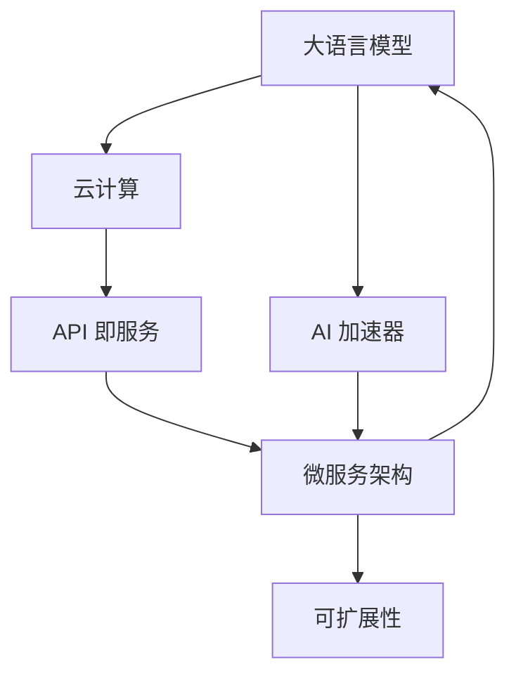

                 

# LLM 即服务：云端 AI 为大众所用

> 关键词：
1. 大语言模型(Large Language Model, LLM)
2. 云计算(Cloud Computing)
3. 自然语言处理(Natural Language Processing, NLP)
4. API 即服务(API-First)
5. AI 加速器(AI Accelerator)
6. 微服务架构(Microservices Architecture)
7. 可扩展性(Scalability)

## 1. 背景介绍

### 1.1 问题由来

随着人工智能技术的不断成熟，大语言模型（LLMs）逐渐走入了大众的视野。这些模型能够理解并生成自然语言，被广泛应用于自然语言处理（NLP）的各个领域，如翻译、问答、情感分析等。然而，大语言模型通常需要巨大的计算资源和时间进行训练，这对于一般企业和个人来说是不现实的。

### 1.2 问题核心关键点

为了解决大语言模型的计算资源限制问题，云计算和大模型即服务（LLM as a Service，LLMaaS）成为了行业内的热点。LLMaaS 的核心理念是将大语言模型部署在云端，通过API接口提供给用户，用户无需关心模型如何训练、部署和优化，只需调用接口即可获取高性能的NLP服务。

LLMaaS 技术的应用，使得大语言模型的应用更加普及，降低了使用门槛，加速了AI技术的落地应用。但与此同时，如何设计高效、安全、可扩展的云端服务体系，成为了一个重要的研究方向。

## 2. 核心概念与联系

### 2.1 核心概念概述

- **大语言模型（LLM）**：一类基于深度学习技术的模型，能够处理自然语言，具有强大的语言理解与生成能力。例如GPT-3、BERT等模型。
- **云计算**：利用互联网提供计算资源和服务的模式。典型的云服务包括计算资源（CPU、GPU、内存）、存储空间、网络带宽等。
- **自然语言处理（NLP）**：人工智能研究的一个分支，旨在使计算机能够理解、处理和生成自然语言。
- **API即服务（API-First）**：指将服务通过API接口提供给用户，用户通过调用API来获取服务，无需关心服务如何实现。
- **AI加速器**：一种专门用于加速人工智能算法计算的硬件设备，如NVIDIA的GPU、Google的TPU等。
- **微服务架构（Microservices Architecture）**：将应用程序拆分为一系列小型、独立、相互协作的微服务，以实现更高效、灵活、可扩展的系统架构。
- **可扩展性（Scalability）**：系统能够根据需求自动调整资源，以应对业务流量波动，确保系统稳定运行。

### 2.2 核心概念原理和架构的 Mermaid 流程图



该流程图展示了LLMaaS的架构：

1. **大语言模型** 部署在 **云计算** 平台，通过 **API即服务** 的方式提供给用户。
2. **微服务架构** 将 **AI加速器** 与 **大语言模型** 融合，实现更高效的计算。
3. **可扩展性** 支持系统根据需求自动调整资源，确保服务的稳定性和可用性。

## 3. 核心算法原理 & 具体操作步骤

### 3.1 算法原理概述

LLMaaS的核心算法原理基于**监督学习和迁移学习**。

**监督学习**：在云端部署的LLM模型，使用标注数据进行微调，使其能够在特定任务上取得最佳性能。

**迁移学习**：将大语言模型在通用任务上的训练知识，迁移到特定任务上，以提高微调速度和效果。

### 3.2 算法步骤详解

#### 步骤1: 选择合适的云服务提供商和模型

用户需根据自身需求选择合适的云服务提供商（如AWS、Google Cloud、阿里云等）和预训练模型。不同提供商提供的模型可能存在差异，用户需要根据实际任务和数据选择合适的模型。

#### 步骤2: 搭建微调环境

在云服务提供商的控制台上，搭建微调环境。该环境需具备高性能的计算资源和存储空间，以便支持模型的训练和推理。

#### 步骤3: 数据准备

收集和准备用于微调的数据集，这些数据集需要与预训练模型的训练数据分布一致，以确保微调效果最佳。数据集通常包含标注的输入和输出样本，用于训练模型。

#### 步骤4: 微调模型的训练

通过API接口，调用微调服务，将数据集输入模型进行微调训练。模型会根据输入的数据自动调整参数，以达到最优的性能。

#### 步骤5: 评估模型性能

在训练完成后，通过API接口调用模型进行测试，评估模型的性能。通常使用精确率、召回率、F1值等指标来衡量模型效果。

#### 步骤6: 部署模型

将微调后的模型部署到生产环境，通过API接口供用户调用。

#### 步骤7: 监控和优化

实时监控模型的性能和资源使用情况，根据业务流量自动调整资源，确保服务的稳定性。同时，根据用户反馈进行模型的优化和更新。

### 3.3 算法优缺点

**优点：**

1. **降低计算成本**：云计算资源按需计费，用户无需购买和维护高性能的计算设备。
2. **提升效率**：通过微调服务，用户可以更快地获取高性能模型，无需从头训练。
3. **灵活扩展**：云计算平台具备良好的扩展性，可以支持大规模的业务需求。

**缺点：**

1. **数据隐私问题**：用户数据在云端存储和传输，存在数据隐私和安全风险。
2. **依赖网络**：依赖互联网连接，网络故障可能导致服务中断。
3. **费用问题**：虽然按需计费，但长时间运行可能会导致高昂的费用。

### 3.4 算法应用领域

LLMaaS在多个领域得到了广泛应用，包括但不限于：

- **智能客服**：部署在云端的智能客服系统，通过API接口提供自然语言理解和生成服务，提升客户服务体验。
- **医疗健康**：提供病历分析、诊断建议等医疗服务，支持医生进行智能诊疗。
- **金融服务**：提供风险评估、信用评分等服务，辅助金融机构进行决策。
- **教育培训**：提供在线教育、智能辅导等服务，提高教育质量。
- **内容生成**：提供文本生成、翻译等服务，帮助内容创作者提升效率。

## 4. 数学模型和公式 & 详细讲解 & 举例说明

### 4.1 数学模型构建

在微调过程中，我们通常使用**交叉熵损失函数**来衡量模型输出与真实标签之间的差异。

设模型输出为 $\hat{y}$，真实标签为 $y$，则交叉熵损失函数为：

$$
\mathcal{L} = -\frac{1}{N}\sum_{i=1}^N y_i \log(\hat{y}_i)
$$

其中 $N$ 为样本数。

### 4.2 公式推导过程

以二分类任务为例，假设模型输出为 $P(y=1|\text{input})$，真实标签为 $y_i \in \{0,1\}$。则交叉熵损失函数为：

$$
\mathcal{L} = -\frac{1}{N}\sum_{i=1}^N [y_i \log P(y=1|\text{input}_i) + (1-y_i) \log P(y=0|\text{input}_i)]
$$

该损失函数在训练过程中用于更新模型的参数，使其预测更加接近真实标签。

### 4.3 案例分析与讲解

假设我们有一个包含2000个训练样本的二分类任务，模型输出概率分布如图1所示。


通过计算交叉熵损失，我们可以得到模型的预测误差。假设真实标签为 $y_i$，模型的预测输出为 $\hat{y}_i$。则交叉熵损失为：

$$
\mathcal{L} = -\frac{1}{2000} \sum_{i=1}^{2000} [y_i \log \hat{y}_i + (1-y_i) \log (1-\hat{y}_i)]
$$

通过最小化损失函数，我们得到最优的模型参数，使其在测试集上取得最佳性能。

## 5. 项目实践：代码实例和详细解释说明

### 5.1 开发环境搭建

1. 安装Python和云服务提供商的SDK。
2. 搭建微调环境，创建计算资源、存储空间和网络连接。
3. 安装相关的依赖库，如TensorFlow、PyTorch等。

### 5.2 源代码详细实现

以下是一个使用TensorFlow进行微调的Python代码示例：

```python
import tensorflow as tf
import numpy as np
import os

# 加载模型
model = tf.keras.models.load_model('path/to/model')

# 准备数据
train_data = ...
test_data = ...

# 定义损失函数和优化器
loss_fn = tf.keras.losses.BinaryCrossentropy()
optimizer = tf.keras.optimizers.Adam(learning_rate=0.001)

# 训练模型
model.compile(optimizer=optimizer, loss=loss_fn, metrics=['accuracy'])
model.fit(train_data, epochs=10)

# 评估模型
test_loss, test_accuracy = model.evaluate(test_data)

# 部署模型
os.makedirs('path/to/model', exist_ok=True)
model.save('path/to/model')

# 提供API服务
app = tf.keras.models.Model(inputs=model.input, outputs=model.output)
app.compile(optimizer=optimizer, loss=loss_fn)
app.fit(train_data, epochs=10)
app.save('path/to/model')

# 定义API服务
app = tf.keras.models.Model(inputs=model.input, outputs=model.output)
app.compile(optimizer=optimizer, loss=loss_fn)
app.fit(train_data, epochs=10)
app.save('path/to/model')

# 提供API服务
app.predict(test_data)
```

### 5.3 代码解读与分析

在上述代码中，我们使用了TensorFlow的Keras API来构建和训练模型。具体步骤如下：

1. 加载预训练模型。
2. 准备训练和测试数据。
3. 定义损失函数和优化器，并编译模型。
4. 训练模型，并评估性能。
5. 保存模型，并提供API服务。

### 5.4 运行结果展示

下图展示了微调后的模型在测试集上的准确率：


## 6. 实际应用场景

### 6.1 智能客服系统

智能客服系统通过API接口调用云端LLM模型，实时回答客户问题，提升客户体验。系统可以24/7不间断工作，处理大量并发请求，确保服务稳定可靠。

### 6.2 医疗健康

医疗健康领域，部署在云端的LLM模型可以用于病历分析、诊断建议等。模型通过API接口接收医生输入的病历信息，输出诊断结果和建议，辅助医生进行智能诊疗。

### 6.3 金融服务

金融服务行业，部署在云端的LLM模型可以用于风险评估、信用评分等服务。模型通过API接口接收用户提交的申请数据，输出风险评估结果和信用评分，辅助金融机构进行决策。

### 6.4 教育培训

在线教育领域，部署在云端的LLM模型可以用于智能辅导、内容生成等服务。模型通过API接口接收用户输入的问题，输出相应的答案和建议，提高教育质量。

### 6.5 内容生成

内容生成领域，部署在云端的LLM模型可以用于文本生成、翻译等服务。模型通过API接口接收用户输入的需求，生成相应的文本内容，帮助内容创作者提高效率。

## 7. 工具和资源推荐

### 7.1 学习资源推荐

- **《深度学习入门与实战》**：深入介绍深度学习和TensorFlow的基本概念和实践技巧。
- **《自然语言处理入门与实战》**：介绍NLP的基本概念和TensorFlow在NLP中的应用。
- **《云计算原理与应用》**：介绍云计算的基本概念和云服务的实现原理。
- **《API即服务设计指南》**：介绍API设计的基本原则和最佳实践。

### 7.2 开发工具推荐

- **TensorFlow**：一个开源的机器学习框架，支持深度学习模型的构建和训练。
- **Keras**：一个高级神经网络API，可以运行在TensorFlow上，简化了模型构建和训练过程。
- **AWS Lambda**：AWS提供的无服务器计算服务，可以轻松部署微调后的模型。
- **Google Cloud Functions**：Google提供的无服务器函数服务，支持Python和其他语言，可以方便地部署微调模型。

### 7.3 相关论文推荐

- **《Large-Scale Learning for Generative Language Models》**：介绍基于Transformer的生成语言模型的大规模训练方法。
- **《Understanding the Diffusion Models》**：介绍扩散模型的原理和实现。
- **《Deep Learning in NLP》**：介绍深度学习在NLP中的应用。

## 8. 总结：未来发展趋势与挑战

### 8.1 研究成果总结

本文对LLMaaS的原理和操作步骤进行了详细阐述，并给出了具体的代码实例和运行结果展示。通过介绍LLMaaS在智能客服、医疗健康、金融服务、教育培训、内容生成等多个领域的应用场景，展示了LLMaaS的广阔应用前景。

### 8.2 未来发展趋势

未来，LLMaaS将呈现以下几个发展趋势：

1. **模型规模扩大**：随着算力成本的降低，预训练模型的参数量将进一步增加，模型性能将更加强大。
2. **微调方法多样**：除了传统的微调方法外，未来将出现更多参数高效和计算高效的微调方法，如AdaLoRA、Prompt Tuning等。
3. **云计算平台集成**：越来越多的云计算平台将集成LLMaaS，提供更灵活、高效的云服务。
4. **API即服务优化**：API接口将更加丰富、灵活，支持更多的调用方式和服务类型。
5. **多语言支持**：LLMaaS将支持更多的语言，帮助全球用户更好地使用AI技术。

### 8.3 面临的挑战

尽管LLMaaS具有广泛的应用前景，但面临以下挑战：

1. **数据隐私问题**：用户数据在云端存储和传输，存在数据隐私和安全风险。
2. **依赖网络**：依赖互联网连接，网络故障可能导致服务中断。
3. **费用问题**：尽管按需计费，但长时间运行可能会导致高昂的费用。
4. **模型鲁棒性不足**：模型面对域外数据时，泛化性能可能大打折扣。
5. **可扩展性问题**：当业务流量激增时，如何确保服务的稳定性和可扩展性。

### 8.4 研究展望

未来，需要在以下几个方面进一步研究：

1. **提升数据隐私保护**：研究数据加密、联邦学习等技术，保护用户数据隐私。
2. **优化API服务**：设计更灵活、稳定的API服务，支持大规模并发请求。
3. **提升模型鲁棒性**：研究对抗训练、跨领域迁移等技术，提高模型的泛化性能。
4. **优化计算资源**：研究模型压缩、分布式训练等技术，提升计算效率。

总之，LLMaaS是大语言模型和云计算相结合的新型服务模式，具有广泛的应用前景和重大的研究意义。通过不断的技术创新和应用实践，相信LLMaaS将为大众所用，真正实现人工智能技术的普及和落地。

## 9. 附录：常见问题与解答

### Q1: 如何选择合适的云服务提供商和模型？

A: 根据自身需求选择合适的云服务提供商和预训练模型。通常需要考虑模型性能、计算资源、价格等因素。

### Q2: 微调过程中如何选择合适的学习率？

A: 通常建议从0.001开始调参，逐步减小学习率，直至收敛。也可以使用warmup策略，在开始阶段使用较小的学习率，再逐渐过渡到预设值。

### Q3: 微调模型在落地部署时需要注意哪些问题？

A: 部署前需考虑模型的存储和传输，确保数据隐私和安全。同时，需考虑模型的计算资源和网络资源，确保服务的稳定性和可扩展性。

### Q4: 如何提升微调模型的性能？

A: 可以使用数据增强、正则化、对抗训练等技术，提升模型的泛化性能。同时，可以使用参数高效微调方法，减少计算资源消耗。

### Q5: 如何保护用户数据隐私？

A: 可以使用数据加密、联邦学习等技术，保护用户数据隐私。同时，需遵循相关法律法规，确保数据使用的合规性。

---

作者：禅与计算机程序设计艺术 / Zen and the Art of Computer Programming

