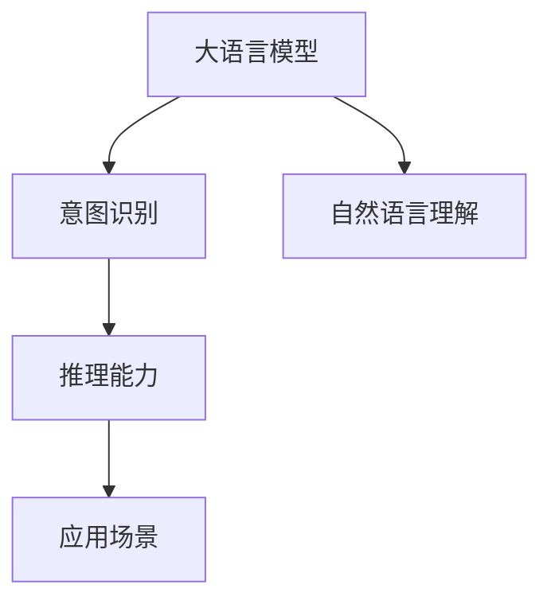

                 

# LLM与人类意图的最大公约数探寻

> 关键词：大语言模型,意图识别,自然语言理解,推理能力,应用场景,未来发展

## 1. 背景介绍

### 1.1 问题由来
近年来，大语言模型(LLM)在自然语言处理(NLP)领域取得了显著进展。这些模型通过大量文本数据的预训练，能够理解和生成人类语言，展现出强大的自然语言处理能力。然而，尽管大语言模型能够生成流畅且上下文相关的文本，其输出的内容是否真正符合人类意图，仍然是一个值得深入探讨的问题。

### 1.2 问题核心关键点
大语言模型的输出是否真正符合人类意图，取决于模型对于自然语言意图的理解和推理能力。当前的意图识别方法主要基于监督学习，但这种基于数据驱动的方法存在局限性。在实际应用中，模型可能会对输入数据进行错误的推理，产生不符合人类意图的输出。

### 1.3 问题研究意义
探索大语言模型与人类意图的最大公约数，对于提升自然语言理解系统的准确性和可靠性，确保其输出的内容与人类期望相符，具有重要意义。这一研究不仅有助于推动NLP技术的发展，还对实际应用场景中的AI决策支持具有深远影响。

## 2. 核心概念与联系

### 2.1 核心概念概述

为更好地理解大语言模型与人类意图之间的关系，本节将介绍几个关键概念：

- 大语言模型(LLM)：指通过大规模无标签文本数据预训练得到的大型语言模型，如BERT、GPT系列等。LLM能够理解并生成自然语言，具备强大的自然语言处理能力。

- 意图识别：指从用户输入的文本中识别出其真实意图，如查询意图、请求意图等。意图识别是构建基于自然语言理解系统的基础。

- 自然语言理解(NLU)：指通过计算机理解自然语言的能力，涉及语法、语义、语用等多方面。意图识别是NLU的一个重要组成部分。

- 推理能力：指模型根据输入文本推理出隐藏信息的能力，包括事实推理、逻辑推理、因果推理等。大语言模型通常具备一定的推理能力，但如何在不同场景下进行推理，仍需进一步研究。

- 应用场景：意图识别在大规模应用中具有广泛的应用，如智能客服、虚拟助手、搜索引擎、机器翻译等。

这些核心概念之间的逻辑关系可以通过以下Mermaid流程图来展示：



这个流程图展示了从大语言模型到意图识别的核心逻辑关系。通过大语言模型的推理能力，模型能够理解输入文本的语义，识别出用户的意图，并在不同应用场景中进行高效推理。

## 3. 核心算法原理 & 具体操作步骤
### 3.1 算法原理概述

大语言模型与人类意图的最大公约数探寻，本质上是一个从自然语言输入到意图识别的过程。其核心思想是：将自然语言输入转化为计算机能够理解的形式，通过模型推理出隐藏的用户意图，从而实现意图识别。

形式化地，假设输入文本为 $x$，用户意图为 $y$。意图识别模型的目标函数为：

$$
\min_{\theta} L(y, M_{\theta}(x))
$$

其中，$M_{\theta}(x)$ 表示大语言模型在输入 $x$ 上的输出，$\theta$ 为模型参数，$L$ 为损失函数，通常采用交叉熵损失。模型的目标是最小化输出与真实意图之间的差异，从而准确识别出用户的意图。

### 3.2 算法步骤详解

基于大语言模型的意图识别一般包括以下几个关键步骤：

**Step 1: 输入预处理**
- 将用户输入的文本进行分词、词性标注、句法分析等预处理，转换成模型能够理解的向量形式。

**Step 2: 模型输入**
- 将预处理后的文本向量输入到预训练的大语言模型中，得到模型在输入文本上的隐含表征。

**Step 3: 意图识别**
- 使用意图识别模型对大语言模型的输出进行解码，识别出用户的意图。常见的解码方法包括最大似然解码、束搜索、神经网络解码等。

**Step 4: 输出后处理**
- 根据意图识别模型的输出，结合上下文信息，进行后处理操作，生成最终的意图识别结果。

**Step 5: 反馈和优化**
- 将意图识别结果反馈到用户，根据用户反馈调整意图识别模型的参数，进行模型优化。

### 3.3 算法优缺点

基于大语言模型的意图识别方法具有以下优点：
1. 模型具备强大的语言理解能力，能够处理各种复杂的自然语言表达。
2. 在预训练大模型的基础上进行微调，可以显著提升模型在特定任务上的性能。
3. 适用于各种应用场景，如智能客服、虚拟助手、搜索引擎等。

同时，该方法也存在一定的局限性：
1. 数据依赖性较强。意图识别模型的性能很大程度上取决于标注数据的质量和数量。
2. 模型复杂度高。大语言模型参数量庞大，训练和推理成本较高。
3. 推理过程复杂。在推理过程中，大语言模型可能产生歧义，导致意图识别结果不准确。
4. 泛化能力有限。模型在不同领域和场景下，可能无法泛化到新的数据。

尽管存在这些局限性，但就目前而言，基于大语言模型的意图识别方法仍是大规模应用的主流范式。未来相关研究的重点在于如何进一步降低数据依赖，提高模型的推理准确性和泛化能力。

### 3.4 算法应用领域

基于大语言模型的意图识别方法，已经在多个领域得到了广泛应用，包括但不限于：

- 智能客服：通过对用户问题进行意图识别，智能客服系统能够自动匹配并生成合适的回复，提升用户体验。
- 虚拟助手：虚拟助手通过意图识别，理解用户的指令和需求，提供个性化的服务和建议。
- 搜索引擎：搜索引擎通过意图识别，优化搜索结果的排序，更好地满足用户的查询需求。
- 机器翻译：机器翻译系统通过意图识别，判断用户的翻译意图，选择合适的翻译策略。
- 智能推荐：推荐系统通过意图识别，理解用户的兴趣和需求，生成个性化的推荐内容。

这些应用场景展示了意图识别在大语言模型中的应用潜力，为构建更智能、高效的自然语言处理系统提供了重要支持。

## 4. 数学模型和公式 & 详细讲解  
### 4.1 数学模型构建

假设大语言模型的输入为 $x$，输出为 $y$，意图识别模型为 $M_{\theta}$，其损失函数为 $L$，则意图识别模型的目标函数可以表示为：

$$
\min_{\theta} L(y, M_{\theta}(x))
$$

其中 $y$ 为用户的意图，$M_{\theta}(x)$ 为大语言模型在输入 $x$ 上的输出。常见的损失函数包括交叉熵损失、均方误差损失等。

### 4.2 公式推导过程

以交叉熵损失为例，假设意图识别模型的输出为 $p$，用户的真实意图为 $y$，则交叉熵损失函数为：

$$
L(y, p) = -\sum_{i} y_i \log p_i
$$

其中 $p_i$ 为模型在类别 $i$ 上的预测概率，$y_i$ 为类别 $i$ 的标签。在实际应用中，模型输出通常是一个概率分布，如softmax输出。

### 4.3 案例分析与讲解

以智能客服系统的意图识别为例，假设用户输入的文本为 "请帮我查询明天的天气"，意图识别模型首先对其进行分词、词性标注、句法分析等预处理，得到输入向量 $x$。然后将 $x$ 输入到预训练的大语言模型中，得到模型在输入文本上的隐含表征 $z$。最后，意图识别模型对 $z$ 进行解码，得到用户意图的预测结果。

例如，假设模型的输出为一个概率分布，如 $p = [0.8, 0.1, 0.1]$，分别表示查询天气、查询新闻、查询电影的概率。根据模型输出，意图识别模型认为用户意图是查询天气，生成结果 "今天天气情况如何？"。

## 5. 项目实践：代码实例和详细解释说明
### 5.1 开发环境搭建

在进行意图识别实践前，我们需要准备好开发环境。以下是使用Python进行PyTorch开发的环境配置流程：

1. 安装Anaconda：从官网下载并安装Anaconda，用于创建独立的Python环境。

2. 创建并激活虚拟环境：
```bash
conda create -n pytorch-env python=3.8 
conda activate pytorch-env
```

3. 安装PyTorch：根据CUDA版本，从官网获取对应的安装命令。例如：
```bash
conda install pytorch torchvision torchaudio cudatoolkit=11.1 -c pytorch -c conda-forge
```

4. 安装Transformers库：
```bash
pip install transformers
```

5. 安装各类工具包：
```bash
pip install numpy pandas scikit-learn matplotlib tqdm jupyter notebook ipython
```

完成上述步骤后，即可在`pytorch-env`环境中开始意图识别实践。

### 5.2 源代码详细实现

下面我们以命名实体识别(NER)任务为例，给出使用Transformers库对BERT模型进行意图识别的PyTorch代码实现。

首先，定义意图识别任务的数据处理函数：

```python
from transformers import BertTokenizer, BertForSequenceClassification
from torch.utils.data import Dataset
import torch

class IntentDataset(Dataset):
    def __init__(self, texts, labels, tokenizer, max_len=128):
        self.texts = texts
        self.labels = labels
        self.tokenizer = tokenizer
        self.max_len = max_len
        
    def __len__(self):
        return len(self.texts)
    
    def __getitem__(self, item):
        text = self.texts[item]
        label = self.labels[item]
        
        encoding = self.tokenizer(text, return_tensors='pt', max_length=self.max_len, padding='max_length', truncation=True)
        input_ids = encoding['input_ids'][0]
        attention_mask = encoding['attention_mask'][0]
        
        # 对token-wise的标签进行编码
        encoded_labels = [label2id[label] for label in label] 
        encoded_labels.extend([label2id['O']] * (self.max_len - len(encoded_labels)))
        labels = torch.tensor(encoded_labels, dtype=torch.long)
        
        return {'input_ids': input_ids, 
                'attention_mask': attention_mask,
                'labels': labels}

# 标签与id的映射
label2id = {'query_weather': 0, 'query_news': 1, 'query_movie': 2}
id2label = {v: k for k, v in label2id.items()}

# 创建dataset
tokenizer = BertTokenizer.from_pretrained('bert-base-cased')

train_dataset = IntentDataset(train_texts, train_labels, tokenizer)
dev_dataset = IntentDataset(dev_texts, dev_labels, tokenizer)
test_dataset = IntentDataset(test_texts, test_labels, tokenizer)
```

然后，定义模型和优化器：

```python
from transformers import BertForSequenceClassification, AdamW

model = BertForSequenceClassification.from_pretrained('bert-base-cased', num_labels=len(label2id))

optimizer = AdamW(model.parameters(), lr=2e-5)
```

接着，定义训练和评估函数：

```python
from torch.utils.data import DataLoader
from tqdm import tqdm
from sklearn.metrics import classification_report

device = torch.device('cuda') if torch.cuda.is_available() else torch.device('cpu')
model.to(device)

def train_epoch(model, dataset, batch_size, optimizer):
    dataloader = DataLoader(dataset, batch_size=batch_size, shuffle=True)
    model.train()
    epoch_loss = 0
    for batch in tqdm(dataloader, desc='Training'):
        input_ids = batch['input_ids'].to(device)
        attention_mask = batch['attention_mask'].to(device)
        labels = batch['labels'].to(device)
        model.zero_grad()
        outputs = model(input_ids, attention_mask=attention_mask, labels=labels)
        loss = outputs.loss
        epoch_loss += loss.item()
        loss.backward()
        optimizer.step()
    return epoch_loss / len(dataloader)

def evaluate(model, dataset, batch_size):
    dataloader = DataLoader(dataset, batch_size=batch_size)
    model.eval()
    preds, labels = [], []
    with torch.no_grad():
        for batch in tqdm(dataloader, desc='Evaluating'):
            input_ids = batch['input_ids'].to(device)
            attention_mask = batch['attention_mask'].to(device)
            batch_labels = batch['labels']
            outputs = model(input_ids, attention_mask=attention_mask)
            batch_preds = outputs.logits.argmax(dim=2).to('cpu').tolist()
            batch_labels = batch_labels.to('cpu').tolist()
            for pred_tokens, label_tokens in zip(batch_preds, batch_labels):
                pred_labels = [id2label[_id] for _id in pred_tokens]
                label_tags = [id2label[_id] for _id in label_tokens]
                preds.append(pred_labels[:len(label_tags)])
                labels.append(label_tags)
                
    print(classification_report(labels, preds))
```

最后，启动训练流程并在测试集上评估：

```python
epochs = 5
batch_size = 16

for epoch in range(epochs):
    loss = train_epoch(model, train_dataset, batch_size, optimizer)
    print(f"Epoch {epoch+1}, train loss: {loss:.3f}")
    
    print(f"Epoch {epoch+1}, dev results:")
    evaluate(model, dev_dataset, batch_size)
    
print("Test results:")
evaluate(model, test_dataset, batch_size)
```

以上就是使用PyTorch对BERT进行意图识别任务开发的完整代码实现。可以看到，得益于Transformers库的强大封装，我们可以用相对简洁的代码完成BERT模型的加载和意图识别。

### 5.3 代码解读与分析

让我们再详细解读一下关键代码的实现细节：

**IntentDataset类**：
- `__init__`方法：初始化文本、标签、分词器等关键组件。
- `__len__`方法：返回数据集的样本数量。
- `__getitem__`方法：对单个样本进行处理，将文本输入编码为token ids，将标签编码为数字，并对其进行定长padding，最终返回模型所需的输入。

**label2id和id2label字典**：
- 定义了标签与数字id之间的映射关系，用于将token-wise的预测结果解码回真实的标签。

**训练和评估函数**：
- 使用PyTorch的DataLoader对数据集进行批次化加载，供模型训练和推理使用。
- 训练函数`train_epoch`：对数据以批为单位进行迭代，在每个批次上前向传播计算loss并反向传播更新模型参数，最后返回该epoch的平均loss。
- 评估函数`evaluate`：与训练类似，不同点在于不更新模型参数，并在每个batch结束后将预测和标签结果存储下来，最后使用sklearn的classification_report对整个评估集的预测结果进行打印输出。

**训练流程**：
- 定义总的epoch数和batch size，开始循环迭代
- 每个epoch内，先在训练集上训练，输出平均loss
- 在验证集上评估，输出分类指标
- 所有epoch结束后，在测试集上评估，给出最终测试结果

可以看到，PyTorch配合Transformers库使得BERT意图识别的代码实现变得简洁高效。开发者可以将更多精力放在数据处理、模型改进等高层逻辑上，而不必过多关注底层的实现细节。

当然，工业级的系统实现还需考虑更多因素，如模型的保存和部署、超参数的自动搜索、更灵活的任务适配层等。但核心的意图识别范式基本与此类似。

## 6. 实际应用场景
### 6.1 智能客服系统

基于大语言模型意图识别的对话技术，可以广泛应用于智能客服系统的构建。传统客服往往需要配备大量人力，高峰期响应缓慢，且一致性和专业性难以保证。而使用意图识别系统，能够7x24小时不间断服务，快速响应客户咨询，用自然流畅的语言解答各类常见问题。

在技术实现上，可以收集企业内部的历史客服对话记录，将问题和最佳答复构建成监督数据，在此基础上对预训练意图识别模型进行微调。微调后的意图识别系统能够自动理解用户意图，匹配最合适的答复模板进行回复。对于客户提出的新问题，还可以接入检索系统实时搜索相关内容，动态组织生成回答。如此构建的智能客服系统，能大幅提升客户咨询体验和问题解决效率。

### 6.2 金融舆情监测

金融机构需要实时监测市场舆论动向，以便及时应对负面信息传播，规避金融风险。传统的人工监测方式成本高、效率低，难以应对网络时代海量信息爆发的挑战。基于大语言模型意图识别的文本分类和情感分析技术，为金融舆情监测提供了新的解决方案。

具体而言，可以收集金融领域相关的新闻、报道、评论等文本数据，并对其进行主题标注和情感标注。在此基础上对预训练语言模型进行微调，使其能够自动判断文本属于何种主题，情感倾向是正面、中性还是负面。将意图识别模型应用到实时抓取的网络文本数据，就能够自动监测不同主题下的情感变化趋势，一旦发现负面信息激增等异常情况，系统便会自动预警，帮助金融机构快速应对潜在风险。

### 6.3 个性化推荐系统

当前的推荐系统往往只依赖用户的历史行为数据进行物品推荐，无法深入理解用户的真实兴趣偏好。基于大语言模型意图识别的个性化推荐系统可以更好地挖掘用户行为背后的语义信息，从而提供更精准、多样的推荐内容。

在实践中，可以收集用户浏览、点击、评论、分享等行为数据，提取和用户交互的物品标题、描述、标签等文本内容。将文本内容作为模型输入，用户的后续行为（如是否点击、购买等）作为监督信号，在此基础上微调预训练语言模型。意图识别模型能够从文本内容中准确把握用户的兴趣点。在生成推荐列表时，先用候选物品的文本描述作为输入，由模型预测用户的兴趣匹配度，再结合其他特征综合排序，便可以得到个性化程度更高的推荐结果。

### 6.4 未来应用展望

随着大语言模型和意图识别技术的不断发展，基于意图识别的应用将拓展到更多领域，为各行各业带来变革性影响。

在智慧医疗领域，基于意图识别的医疗问答、病历分析、药物研发等应用将提升医疗服务的智能化水平，辅助医生诊疗，加速新药开发进程。

在智能教育领域，意图识别技术可应用于作业批改、学情分析、知识推荐等方面，因材施教，促进教育公平，提高教学质量。

在智慧城市治理中，意图识别技术可应用于城市事件监测、舆情分析、应急指挥等环节，提高城市管理的自动化和智能化水平，构建更安全、高效的未来城市。

此外，在企业生产、社会治理、文娱传媒等众多领域，基于大语言模型意图识别的应用也将不断涌现，为经济社会发展注入新的动力。相信随着技术的日益成熟，意图识别技术将成为人工智能落地应用的重要范式，推动人工智能技术在更广阔的应用领域大放异彩。

## 7. 工具和资源推荐
### 7.1 学习资源推荐

为了帮助开发者系统掌握大语言模型意图识别的理论基础和实践技巧，这里推荐一些优质的学习资源：

1. 《自然语言处理入门》系列博文：由大模型技术专家撰写，深入浅出地介绍了自然语言处理的各个方面，包括意图识别、文本分类、情感分析等。

2. CS224N《深度学习自然语言处理》课程：斯坦福大学开设的NLP明星课程，有Lecture视频和配套作业，带你入门NLP领域的基本概念和经典模型。

3. 《自然语言处理与深度学习》书籍：涵盖自然语言处理领域的多个核心主题，包括意图识别、序列标注、语言生成等。

4. HuggingFace官方文档：Transformers库的官方文档，提供了海量预训练模型和完整的意图识别样例代码，是上手实践的必备资料。

5. CLUE开源项目：中文语言理解测评基准，涵盖大量不同类型的中文NLP数据集，并提供了基于意图识别的baseline模型，助力中文NLP技术发展。

通过对这些资源的学习实践，相信你一定能够快速掌握大语言模型意图识别的精髓，并用于解决实际的NLP问题。
###  7.2 开发工具推荐

高效的开发离不开优秀的工具支持。以下是几款用于大语言模型意图识别开发的常用工具：

1. PyTorch：基于Python的开源深度学习框架，灵活动态的计算图，适合快速迭代研究。大部分预训练语言模型都有PyTorch版本的实现。

2. TensorFlow：由Google主导开发的开源深度学习框架，生产部署方便，适合大规模工程应用。同样有丰富的预训练语言模型资源。

3. Transformers库：HuggingFace开发的NLP工具库，集成了众多SOTA语言模型，支持PyTorch和TensorFlow，是进行意图识别任务开发的利器。

4. Weights & Biases：模型训练的实验跟踪工具，可以记录和可视化模型训练过程中的各项指标，方便对比和调优。与主流深度学习框架无缝集成。

5. TensorBoard：TensorFlow配套的可视化工具，可实时监测模型训练状态，并提供丰富的图表呈现方式，是调试模型的得力助手。

6. Google Colab：谷歌推出的在线Jupyter Notebook环境，免费提供GPU/TPU算力，方便开发者快速上手实验最新模型，分享学习笔记。

合理利用这些工具，可以显著提升大语言模型意图识别的开发效率，加快创新迭代的步伐。

### 7.3 相关论文推荐

大语言模型和意图识别技术的发展源于学界的持续研究。以下是几篇奠基性的相关论文，推荐阅读：

1. Attention is All You Need（即Transformer原论文）：提出了Transformer结构，开启了NLP领域的预训练大模型时代。

2. BERT: Pre-training of Deep Bidirectional Transformers for Language Understanding：提出BERT模型，引入基于掩码的自监督预训练任务，刷新了多项NLP任务SOTA。

3. Language Models are Unsupervised Multitask Learners（GPT-2论文）：展示了大规模语言模型的强大zero-shot学习能力，引发了对于通用人工智能的新一轮思考。

4. Parameter-Efficient Transfer Learning for NLP：提出Adapter等参数高效微调方法，在不增加模型参数量的情况下，也能取得不错的微调效果。

5. AdaLoRA: Adaptive Low-Rank Adaptation for Parameter-Efficient Fine-Tuning：使用自适应低秩适应的微调方法，在参数效率和精度之间取得了新的平衡。

6. Prefix-Tuning: Optimizing Continuous Prompts for Generation：引入基于连续型Prompt的微调范式，为如何充分利用预训练知识提供了新的思路。

这些论文代表了大语言模型意图识别技术的发展脉络。通过学习这些前沿成果，可以帮助研究者把握学科前进方向，激发更多的创新灵感。

## 8. 总结：未来发展趋势与挑战

### 8.1 总结

本文对基于大语言模型的意图识别方法进行了全面系统的介绍。首先阐述了意图识别在大语言模型中的重要地位和应用意义，明确了意图识别在构建智能系统中的核心作用。其次，从原理到实践，详细讲解了意图识别的数学模型和核心步骤，给出了意图识别任务开发的完整代码实例。同时，本文还广泛探讨了意图识别方法在智能客服、金融舆情、个性化推荐等多个行业领域的应用前景，展示了意图识别在大语言模型中的应用潜力。

通过本文的系统梳理，可以看到，基于大语言模型的意图识别方法正在成为NLP领域的重要范式，极大地拓展了自然语言理解系统的应用边界，为构建更智能、高效的自然语言处理系统提供了重要支持。未来，伴随大语言模型和意图识别方法的持续演进，意图识别技术必将与更多人工智能技术进行深入融合，共同推动自然语言理解和智能交互系统的进步。

### 8.2 未来发展趋势

展望未来，大语言模型意图识别技术将呈现以下几个发展趋势：

1. 模型规模持续增大。随着算力成本的下降和数据规模的扩张，预训练语言模型的参数量还将持续增长。超大规模语言模型蕴含的丰富语言知识，有望支撑更加复杂多变的意图识别任务。

2. 意图识别范式日趋多样化。除了传统的监督学习外，未来会涌现更多无监督和半监督的意图识别方法，如自监督学习、主动学习等，能够更好地处理长尾任务和小样本数据。

3. 模型泛化能力增强。在预训练大模型的基础上进行微调，可以显著提升模型在不同场景和任务上的泛化能力，应对更多的应用需求。

4. 多模态意图识别崛起。当前的意图识别主要聚焦于文本数据，未来会进一步拓展到图像、视频、语音等多模态数据，实现多模态信息与文本信息的协同建模。

5. 交互式意图识别发展。与用户进行自然交互的意图识别系统，将根据上下文信息动态调整意图识别模型，进一步提升用户体验和系统性能。

6. 零样本和少样本意图识别能力提升。通过设计巧妙的提示模板，能够在没有标注数据的情况下，进行零样本和少样本意图识别，减少对标注数据的依赖。

以上趋势凸显了大语言模型意图识别技术的广阔前景。这些方向的探索发展，必将进一步提升意图识别系统的性能和应用范围，为构建智能交互系统提供新的动力。

### 8.3 面临的挑战

尽管大语言模型意图识别技术已经取得了显著进展，但在迈向更加智能化、普适化应用的过程中，仍面临诸多挑战：

1. 标注数据瓶颈。意图识别模型的性能很大程度上取决于标注数据的质量和数量，获取高质量标注数据的成本较高。如何进一步降低意图识别对标注样本的依赖，将是一大难题。

2. 模型鲁棒性不足。在实际应用中，意图识别模型可能会对输入数据进行错误的推理，产生不符合人类意图的输出。如何提高模型的鲁棒性，避免灾难性遗忘，还需要更多理论和实践的积累。

3. 推理过程复杂。在推理过程中，大语言模型可能产生歧义，导致意图识别结果不准确。如何简化推理过程，提升推理效率，减少模型的计算负担，将是重要的优化方向。

4. 可解释性不足。当前意图识别模型更像是"黑盒"系统，难以解释其内部工作机制和决策逻辑。对于医疗、金融等高风险应用，算法的可解释性和可审计性尤为重要。如何赋予意图识别模型更强的可解释性，将是亟待攻克的难题。

5. 安全性有待保障。意图识别模型可能会学习到有偏见、有害的信息，通过微调传递到下游任务，产生误导性、歧视性的输出，给实际应用带来安全隐患。如何从数据和算法层面消除模型偏见，避免恶意用途，确保输出的安全性，也将是重要的研究课题。

6. 知识整合能力不足。现有的意图识别模型往往局限于任务内数据，难以灵活吸收和运用更广泛的先验知识。如何让意图识别过程更好地与外部知识库、规则库等专家知识结合，形成更加全面、准确的信息整合能力，还有很大的想象空间。

正视意图识别面临的这些挑战，积极应对并寻求突破，将是大语言模型意图识别技术走向成熟的必由之路。相信随着学界和产业界的共同努力，这些挑战终将一一被克服，意图识别技术必将与更多人工智能技术进行深度融合，推动自然语言理解和智能交互系统的进步。

### 8.4 研究展望

面向未来，大语言模型意图识别技术需要在以下几个方面寻求新的突破：

1. 探索无监督和半监督意图识别方法。摆脱对大规模标注数据的依赖，利用自监督学习、主动学习等无监督和半监督范式，最大限度利用非结构化数据，实现更加灵活高效的意图识别。

2. 研究多模态意图识别方法。在预训练大模型的基础上，将图像、视频、语音等多模态信息与文本信息进行融合，构建多模态意图识别系统，提升系统的准确性和鲁棒性。

3. 引入因果分析和博弈论工具。将因果分析方法引入意图识别模型，识别出模型决策的关键特征，增强输出解释的因果性和逻辑性。借助博弈论工具刻画人机交互过程，主动探索并规避模型的脆弱点，提高系统稳定性。

4. 纳入伦理道德约束。在模型训练目标中引入伦理导向的评估指标，过滤和惩罚有偏见、有害的输出倾向。同时加强人工干预和审核，建立模型行为的监管机制，确保输出符合人类价值观和伦理道德。

5. 结合生成对抗网络(GAN)技术。利用GAN技术生成多样化的文本样本，增加模型的泛化能力和鲁棒性，减少过拟合风险。

6. 融合知识图谱和逻辑推理。将符号化的先验知识，如知识图谱、逻辑规则等，与神经网络模型进行巧妙融合，引导意图识别过程学习更准确、合理的语言模型。

这些研究方向展示了意图识别技术的未来发展方向，必将引领意图识别技术迈向更高的台阶，为构建智能交互系统提供新的动力。面向未来，大语言模型意图识别技术还需要与其他人工智能技术进行更深入的融合，如知识表示、因果推理、强化学习等，多路径协同发力，共同推动自然语言理解和智能交互系统的进步。只有勇于创新、敢于突破，才能不断拓展意图识别系统的边界，让智能技术更好地造福人类社会。

## 9. 附录：常见问题与解答

**Q1：大语言模型意图识别是否适用于所有NLP任务？**

A: 大语言模型意图识别在大多数NLP任务上都能取得不错的效果，特别是对于数据量较小的任务。但对于一些特定领域的任务，如医学、法律等，仅仅依靠通用语料预训练的模型可能难以很好地适应。此时需要在特定领域语料上进一步预训练，再进行意图识别。此外，对于一些需要时效性、个性化很强的任务，如对话、推荐等，意图识别方法也需要针对性的改进优化。

**Q2：如何选择合适的意图识别模型？**

A: 选择合适的意图识别模型，需要考虑以下几个因素：
1. 数据量和质量：数据量越多、标注质量越高，模型效果越好。
2. 任务类型：不同任务对意图识别的需求不同，需要选择合适的模型结构。
3. 计算资源：模型规模越大，计算资源需求越高，需要根据计算资源选择合适模型。
4. 应用场景：不同应用场景对意图识别的要求不同，需要选择合适的模型策略。

**Q3：意图识别过程中如何进行数据增强？**

A: 数据增强是提高意图识别模型泛化能力的重要手段，常见的数据增强方法包括：
1. 回译：将文本翻译成其他语言再回译，增加数据多样性。
2. 近义替换：替换文本中的关键词，增加数据多样性。
3. 文本生成：使用GAN等生成对抗网络生成多样化的文本样本，增加数据多样性。
4. 噪声注入：在文本中引入噪声，增加数据多样性。
5. 数据扩充：利用预训练语言模型对文本进行语义扩充，增加数据多样性。

这些数据增强方法可以有效地提高模型的泛化能力，减少过拟合风险。

**Q4：意图识别模型在落地部署时需要注意哪些问题？**

A: 将意图识别模型转化为实际应用，还需要考虑以下因素：
1. 模型裁剪：去除不必要的层和参数，减小模型尺寸，加快推理速度。
2. 量化加速：将浮点模型转为定点模型，压缩存储空间，提高计算效率。
3. 服务化封装：将模型封装为标准化服务接口，便于集成调用。
4. 弹性伸缩：根据请求流量动态调整资源配置，平衡服务质量和成本。
5. 监控告警：实时采集系统指标，设置异常告警阈值，确保服务稳定性。
6. 安全防护：采用访问鉴权、数据脱敏等措施，保障数据和模型安全。

大语言模型意图识别为NLP应用开启了广阔的想象空间，但如何将强大的性能转化为稳定、高效、安全的业务价值，还需要工程实践的不断打磨。唯有从数据、算法、工程、业务等多个维度协同发力，才能真正实现人工智能技术在垂直行业的规模化落地。总之，意图识别需要开发者根据具体任务，不断迭代和优化模型、数据和算法，方能得到理想的效果。

---

作者：禅与计算机程序设计艺术 / Zen and the Art of Computer Programming

