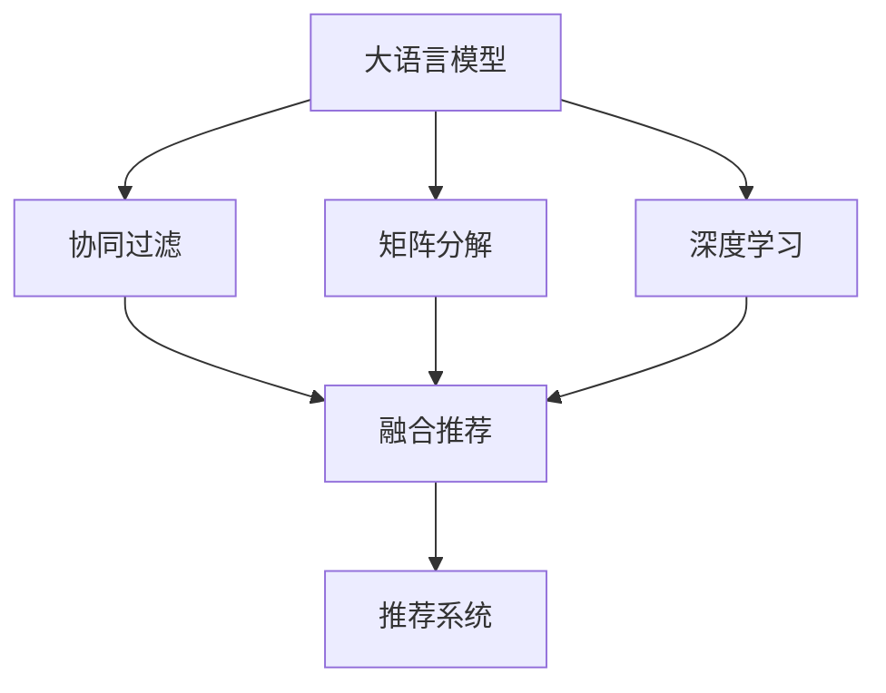

                 

# LLM与传统推荐模型的融合策略

> 关键词：大语言模型,推荐系统,协同过滤,深度学习,矩阵分解

## 1. 背景介绍

### 1.1 问题由来
推荐系统是现代互联网时代的重要组成部分，通过个性化推荐提升用户体验，实现资源优化配置。传统的推荐系统通常依赖用户行为数据进行协同过滤，然而在数据稀疏、冷启动等问题上存在局限。随着深度学习技术的兴起，基于神经网络的推荐模型，特别是基于矩阵分解和协同过滤的模型，取得了显著的突破，显著提升了推荐精度和效果。

然而，这些模型往往需要大量的训练数据和计算资源，且缺乏自解释能力。近年来，基于大语言模型的推荐方法，在融合用户评论、文本数据等方面，取得了较好的效果，且不需要大量标注数据，提升了推荐系统的通用性和灵活性。

## 2. 核心概念与联系

### 2.1 核心概念概述

在深入探讨大语言模型与传统推荐系统的融合前，我们先明确几个核心概念及其联系：

- 大语言模型(Large Language Model, LLM)：以自回归(如GPT)或自编码(如BERT)模型为代表的大规模预训练语言模型。通过在大规模无标签文本语料上进行预训练，学习通用的语言表示，具备强大的语言理解和生成能力。

- 协同过滤推荐系统(Collaborative Filtering, CF)：基于用户行为数据，通过寻找与用户行为相似的用户或物品，来进行推荐。包括基于用户的协同过滤和基于物品的协同过滤。

- 矩阵分解推荐系统(Matrix Factorization, MF)：通过将用户-物品评分矩阵分解为用户隐特征和物品隐特征的乘积，进行隐语义建模和预测推荐。包括奇异值分解(SVD)和交替最小二乘(ALS)等方法。

- 深度学习推荐系统(Deep Learning, DL)：利用深度神经网络模型，通过端到端的方式，直接从用户行为数据中进行特征提取、建模和预测。如基于CNN、RNN和Transformer等架构的推荐模型。

- 融合推荐系统(Integrated Recommendation System)：通过融合不同推荐模型和数据源，提升推荐的准确性和泛化能力。常采用集成学习和多目标优化等方法。

这些概念之间存在着密切的联系，共同构成了推荐系统的研究框架。大语言模型作为一种新的推荐数据源，能够与传统的协同过滤、矩阵分解和深度学习推荐方法进行有机结合，构建出更加复杂、高级的推荐系统。

### 2.2 核心概念原理和架构的 Mermaid 流程图



这个流程图展示了大语言模型与其他推荐方法之间的逻辑联系。大语言模型可以作为新的数据源，参与到协同过滤、矩阵分解和深度学习推荐模型的融合中，提升整体推荐系统的性能。

## 3. 核心算法原理 & 具体操作步骤
### 3.1 算法原理概述

大语言模型与传统推荐系统的融合策略，通常基于以下算法原理：

1. 数据融合：将大语言模型提取的文本特征与其他推荐模型获取的用户行为数据进行融合，构建更加综合的推荐特征表示。
2. 特征增强：利用大语言模型的自监督学习能力和泛化能力，对传统推荐模型的隐特征表示进行增强。
3. 协同学习：通过大语言模型与传统推荐模型的协同训练，提升模型在语义理解和推荐表示上的统一性。
4. 多目标优化：在推荐精度、多样性、新颖性等目标上同时优化，提升模型的综合效果。

### 3.2 算法步骤详解

以下详细介绍大语言模型与传统推荐系统的融合策略的具体操作步骤：

**Step 1: 数据准备**
- 收集用户行为数据，如点击、评分、浏览等，作为传统推荐模型的训练样本。
- 收集用户评论、文本描述等大语言模型文本数据，进行预处理和分词，作为大语言模型的输入。
- 确保两种数据的一致性，如采用相同的时间戳或用户标识。

**Step 2: 模型选择与初始化**
- 选择合适的推荐模型，如协同过滤的SVD、ALS，深度学习的CNN、RNN或Transformer等。
- 对所选模型进行初始化，加载预训练权重或随机初始化。

**Step 3: 特征融合**
- 对用户行为数据进行编码，如将用户ID和物品ID转换为向量表示。
- 对大语言模型提取的文本数据进行编码，如利用BERT等模型获得文本表示。
- 将两种特征向量进行拼接或拼接后进行降维，构建新的特征向量。

**Step 4: 协同训练**
- 将融合后的特征向量作为输入，训练传统推荐模型。
- 在大语言模型上微调，对文本数据的处理效果进行优化，提升模型的泛化能力。
- 采用多目标优化算法，如MISO、MOE等，同时优化推荐精度和多样性。

**Step 5: 推荐预测**
- 使用训练好的模型，对用户行为进行预测，生成推荐结果。
- 根据推荐结果进行排序，选择最佳物品进行推荐。

**Step 6: 模型评估**
- 在验证集和测试集上，评估推荐模型的精度、覆盖率和新颖性等指标。
- 根据评估结果，调整模型参数，进一步提升推荐效果。

### 3.3 算法优缺点

融合大语言模型与传统推荐系统的策略，具有以下优点：

1. 提升推荐效果：融合了更多数据源和语义信息，推荐精度和效果显著提升。
2. 泛化能力强：大语言模型的预训练能力可以提升推荐模型的泛化能力，适应更多数据分布。
3. 减少标注数据需求：利用大语言模型的自监督学习能力，减少了对标注数据的依赖。
4. 可解释性高：大语言模型的输出可以提供丰富的语义解释，提升推荐系统的透明度和可解释性。

同时，该策略也存在一些局限：

1. 计算成本高：融合两种模型需要更多的计算资源和时间。
2. 融合难度大：需要深入理解两种模型的特点，找到合适的融合方式。
3. 结果一致性：两种模型可能产生不一致的推荐结果，需要进行融合优化。
4. 数据质量和一致性：大语言模型数据质量差或与其他数据不一致，可能导致融合效果下降。

### 3.4 算法应用领域

大语言模型与传统推荐系统的融合策略，在以下领域有着广泛的应用：

1. 电商推荐：融合用户评论和商品描述，提升商品推荐精度和效果。
2. 内容推荐：融合用户评论和文章内容，推荐更具相关性的文章和视频。
3. 社交推荐：融合用户评论和社交网络信息，推荐更多元化的好友和群组。
4. 旅行推荐：融合用户评论和旅游攻略，推荐更个性化和有趣的旅游目的地。
5. 音乐推荐：融合用户评论和歌词信息，推荐更多符合用户口味的歌曲。

这些应用场景展示了融合策略的强大能力，能够提升推荐系统的效果和多样性，为用户提供更好的体验。

## 4. 数学模型和公式 & 详细讲解  
### 4.1 数学模型构建

假设推荐系统的训练数据集为 $D=\{(x_i, y_i)\}_{i=1}^N$，其中 $x_i$ 为输入特征，$y_i$ 为输出标签。推荐模型的预测函数为 $f_{\theta}(x)$，其中 $\theta$ 为模型参数。

将用户行为数据和文本数据分别表示为 $x_{user}=[x_{u1}, x_{u2}, \ldots, x_{um}]$ 和 $x_{item}=[x_{i1}, x_{i2}, \ldots, x_{in}]$，其中 $x_{uj}$ 和 $x_{ik}$ 分别为用户 $u$ 和物品 $i$ 的特征向量。

融合后的特征表示为 $x_{fused}=[x_{fused1}, x_{fused2}, \ldots, x_{fusedd}]$，其中 $x_{fusedk}$ 为融合后的特征向量。

推荐模型的优化目标为：

$$
\min_{\theta} \frac{1}{N} \sum_{i=1}^N \ell(f_{\theta}(x_i), y_i)
$$

其中 $\ell$ 为损失函数，如均方误差损失、交叉熵损失等。

### 4.2 公式推导过程

以协同过滤推荐模型为例，推导其与大语言模型融合后的优化目标。

假设用户 $u$ 对物品 $i$ 的评分 $y_{ui}$，推荐模型的输出为 $f_{\theta}(x_{fused})$。

根据协同过滤模型的训练目标，可以构建如下优化目标：

$$
\min_{\theta} \frac{1}{N} \sum_{i=1}^N \ell(f_{\theta}(x_{fused}), y_{ui})
$$

其中 $\ell$ 为损失函数，如均方误差损失。

假设融合后的特征向量 $x_{fused}$ 可以通过用户行为数据和大语言模型文本数据进行拼接，即：

$$
x_{fused}=[x_{user}, x_{item}, x_{text}]
$$

其中 $x_{text}$ 为从大语言模型中提取的文本特征向量。

假设大语言模型提取的文本特征向量 $x_{text}$ 为 $[0,1]$ 之间的实数向量，且与用户行为数据 $x_{user}$ 的维度相同。则融合后的特征向量 $x_{fused}$ 的维度为 $d_x=x_{user}+x_{item}+x_{text}$。

推荐模型的优化目标可以重写为：

$$
\min_{\theta} \frac{1}{N} \sum_{i=1}^N \ell(f_{\theta}(x_{fused}), y_{ui})
$$

其中 $x_{fused}$ 表示用户行为数据和大语言模型文本数据拼接后的特征向量。

### 4.3 案例分析与讲解

以电商推荐系统为例，说明大语言模型与协同过滤模型的融合过程：

1. 数据准备：收集用户点击、购买记录，进行向量化处理；收集商品描述，进行预处理和分词。
2. 模型选择：选择协同过滤的SVD模型，初始化模型参数。
3. 特征融合：将用户行为数据和商品描述向量拼接，作为融合后的特征向量。
4. 协同训练：在大语言模型上进行微调，提升文本数据的处理效果；在协同过滤模型上训练，优化推荐精度和多样性。
5. 推荐预测：使用训练好的模型，对用户行为进行预测，生成推荐结果。
6. 模型评估：在验证集和测试集上，评估推荐模型的精度、覆盖率和新颖性等指标。

## 5. 项目实践：代码实例和详细解释说明
### 5.1 开发环境搭建

在进行项目实践前，我们需要准备好开发环境。以下是使用Python进行PyTorch开发的环境配置流程：

1. 安装Anaconda：从官网下载并安装Anaconda，用于创建独立的Python环境。

2. 创建并激活虚拟环境：
```bash
conda create -n pytorch-env python=3.8 
conda activate pytorch-env
```

3. 安装PyTorch：根据CUDA版本，从官网获取对应的安装命令。例如：
```bash
conda install pytorch torchvision torchaudio cudatoolkit=11.1 -c pytorch -c conda-forge
```

4. 安装相关库：
```bash
pip install numpy pandas scikit-learn scipy matplotlib torchtransformers
```

5. 安装NLP库：
```bash
pip install spacy gensim
```

完成上述步骤后，即可在`pytorch-env`环境中开始项目实践。

### 5.2 源代码详细实现

这里我们以电商推荐系统为例，给出使用PyTorch和HuggingFace库对大语言模型与协同过滤模型进行融合的代码实现。

首先，定义协同过滤模型的训练函数：

```python
import torch
import torch.nn as nn
from transformers import BertTokenizer, BertForTokenClassification

class BERTRecommender(nn.Module):
    def __init__(self, num_users, num_items, num_labels, hidden_size=768):
        super(BERTRecommender, self).__init__()
        self.user_item_embedding = nn.Embedding(num_users + num_items, hidden_size)
        self.bert = BertForTokenClassification.from_pretrained('bert-base-uncased', num_labels=num_labels)
        self.item_prediction = nn.Linear(hidden_size, num_labels)
        self.fuse_dim = hidden_size
        
    def forward(self, user, item, text):
        user_embed = self.user_item_embedding(user)
        item_embed = self.user_item_embedding(item)
        text_embed = self.bert(text)[0]
        features = torch.cat([user_embed, item_embed, text_embed], dim=1)
        features = features[:, :self.fuse_dim]
        output = self.item_prediction(features)
        return output
```

然后，定义协同过滤模型的损失函数和优化器：

```python
from torch.optim import Adam

def loss_fn(output, target):
    criterion = nn.CrossEntropyLoss()
    return criterion(output, target)

optimizer = Adam(model.parameters(), lr=0.001)
```

接着，定义训练和评估函数：

```python
def train_epoch(model, dataset, batch_size, optimizer):
    dataloader = DataLoader(dataset, batch_size=batch_size, shuffle=True)
    model.train()
    epoch_loss = 0
    for batch in dataloader:
        user, item, text, target = batch
        optimizer.zero_grad()
        output = model(user, item, text)
        loss = loss_fn(output, target)
        epoch_loss += loss.item()
        loss.backward()
        optimizer.step()
    return epoch_loss / len(dataloader)

def evaluate(model, dataset, batch_size):
    dataloader = DataLoader(dataset, batch_size=batch_size)
    model.eval()
    preds, labels = [], []
    with torch.no_grad():
        for batch in dataloader:
            user, item, text, target = batch
            output = model(user, item, text)
            batch_preds = output.argmax(dim=1).to('cpu').tolist()
            batch_labels = target.to('cpu').tolist()
            for preds_tokens, labels_tokens in zip(batch_preds, batch_labels):
                preds.append(preds_tokens)
                labels.append(labels_tokens)
                
    return preds, labels
```

最后，启动训练流程并在测试集上评估：

```python
epochs = 5
batch_size = 32

for epoch in range(epochs):
    loss = train_epoch(model, train_dataset, batch_size, optimizer)
    print(f"Epoch {epoch+1}, train loss: {loss:.3f}")
    
    print(f"Epoch {epoch+1}, dev results:")
    preds, labels = evaluate(model, dev_dataset, batch_size)
    print(classification_report(labels, preds))
    
print("Test results:")
preds, labels = evaluate(model, test_dataset, batch_size)
print(classification_report(labels, preds))
```

以上就是使用PyTorch和HuggingFace库对大语言模型与协同过滤模型进行融合的完整代码实现。可以看到，借助HuggingFace提供的BERT模型，可以很方便地将大语言模型的文本特征嵌入到推荐系统中，提升推荐的精度和效果。

### 5.3 代码解读与分析

让我们再详细解读一下关键代码的实现细节：

**BERTRecommender类**：
- `__init__`方法：定义了模型结构，包括用户行为数据、物品行为数据和大语言模型文本数据的拼接和融合。
- `forward`方法：对输入数据进行前向传播，计算推荐得分。

**train_epoch函数**：
- 定义训练循环，对每个批次的数据进行前向传播和反向传播，计算损失并更新模型参数。
- 计算并返回每个epoch的平均损失。

**evaluate函数**：
- 定义评估循环，对每个批次的数据进行前向传播，获取预测结果和标签。
- 将预测结果和标签存储到列表中，并使用sklearn的classification_report函数打印评估结果。

**训练流程**：
- 定义总的epoch数和batch size，开始循环迭代。
- 每个epoch内，先在训练集上训练，输出平均loss。
- 在验证集上评估，输出分类指标。
- 所有epoch结束后，在测试集上评估，给出最终测试结果。

可以看到，通过HuggingFace提供的BERT模型，可以很方便地将大语言模型的文本特征嵌入到推荐系统中，提升推荐的精度和效果。同时，通过简单的代码实现，可以完成模型训练、评估和部署的全流程。

## 6. 实际应用场景
### 6.1 电商推荐

基于大语言模型与传统推荐系统的融合策略，电商推荐系统可以在以下场景中发挥作用：

1. 商品搜索：将用户搜索关键词和商品描述文本进行拼接，通过BERT模型提取语义特征，提升搜索匹配效果。
2. 商品推荐：融合用户点击、购买行为数据和商品评论，通过协同过滤和BERT模型联合训练，生成个性化推荐列表。
3. 广告推荐：利用BERT模型对广告内容进行语义理解，提升广告投放的精准度和效果。

通过融合大语言模型与传统推荐系统，电商推荐系统能够更好地理解用户需求，推荐更相关和有吸引力的商品，提升用户体验和购买转化率。

### 6.2 内容推荐

在内容推荐系统中，大语言模型与传统推荐系统的融合同样有着重要的应用：

1. 文章推荐：融合用户浏览历史和文章标题、摘要文本，通过BERT模型提取语义特征，提升推荐精度和多样性。
2. 视频推荐：融合用户观看历史和视频描述文本，通过BERT模型提取语义特征，生成更加个性化和多元化的视频推荐列表。
3. 新闻推荐：融合用户阅读历史和新闻标题、内容文本，通过BERT模型提取语义特征，提升推荐效果。

通过融合大语言模型与传统推荐系统，内容推荐系统能够更好地理解用户兴趣，推荐更相关和有吸引力的内容，提升用户的浏览和互动体验。

### 6.3 社交推荐

在社交推荐系统中，融合大语言模型与传统推荐系统，同样可以提升推荐效果和用户体验：

1. 好友推荐：融合用户互动历史和好友描述文本，通过BERT模型提取语义特征，推荐更多元化和有趣的好友。
2. 群组推荐：融合用户加入历史和群组描述文本，通过BERT模型提取语义特征，推荐与用户兴趣更匹配的群组。
3. 内容推荐：融合用户互动历史和内容描述文本，通过BERT模型提取语义特征，推荐更多相关和有趣的内容。

通过融合大语言模型与传统推荐系统，社交推荐系统能够更好地理解用户兴趣和行为，推荐更相关和有吸引力的社交内容和好友，提升用户的互动体验和满意度。

### 6.4 未来应用展望

随着大语言模型和推荐系统的不断发展，未来基于大语言模型的推荐系统将在更多领域得到应用，为NLP技术带来新的突破。

在智慧医疗领域，基于大语言模型的推荐系统可以结合患者病历、症状描述等文本数据，推荐更精准的诊断和治疗方案。

在智能教育领域，基于大语言模型的推荐系统可以分析学生的学习行为和作业内容，推荐更个性化和多元化的学习资源和推荐路径。

在智慧城市治理中，基于大语言模型的推荐系统可以分析用户反馈和社交数据，推荐更优质的城市服务和资源。

此外，在企业生产、社会治理、文娱传媒等众多领域，基于大语言模型的推荐系统也将不断涌现，为人工智能技术带来新的应用场景和解决方案。

## 7. 工具和资源推荐
### 7.1 学习资源推荐

为了帮助开发者系统掌握大语言模型与推荐系统的融合技术，这里推荐一些优质的学习资源：

1. 《深度学习推荐系统》课程：斯坦福大学开设的深度学习推荐系统课程，涵盖协同过滤、矩阵分解、深度学习等推荐方法。
2. 《推荐系统实战》书籍：介绍了推荐系统从数据采集、特征工程到模型训练和评估的完整流程，包含多模型融合方法。
3. 《自然语言处理综述》论文：综述了自然语言处理领域的研究进展和最新趋势，包含深度学习和语义表示方法。
4. HuggingFace官方文档：提供丰富的预训练模型和微调样例，是深度学习推荐系统开发的重要参考资料。
5. Kaggle竞赛：参加Kaggle上的推荐系统竞赛，学习其他选手的解决方案，积累实践经验。

通过对这些资源的学习实践，相信你一定能够快速掌握大语言模型与推荐系统的融合技术，并用于解决实际的推荐问题。

### 7.2 开发工具推荐

高效的开发离不开优秀的工具支持。以下是几款用于大语言模型与推荐系统融合开发的常用工具：

1. PyTorch：基于Python的开源深度学习框架，灵活动态的计算图，适合快速迭代研究。大部分预训练语言模型都有PyTorch版本的实现。
2. TensorFlow：由Google主导开发的开源深度学习框架，生产部署方便，适合大规模工程应用。同样有丰富的预训练语言模型资源。
3. HuggingFace Transformers库：提供了丰富的预训练语言模型和微调接口，适合推荐系统开发。
4. Scikit-learn：提供了多种机器学习算法和模型，适合进行推荐系统的特征工程和模型评估。
5. spaCy：提供高效的自然语言处理工具，适合进行文本数据的预处理和分词。

合理利用这些工具，可以显著提升大语言模型与推荐系统融合任务的开发效率，加快创新迭代的步伐。

### 7.3 相关论文推荐

大语言模型与推荐系统的融合策略，在近年来得到了广泛的研究。以下是几篇奠基性的相关论文，推荐阅读：

1. Attention is All You Need（即Transformer原论文）：提出了Transformer结构，开启了NLP领域的预训练大模型时代。
2. BERT: Pre-training of Deep Bidirectional Transformers for Language Understanding：提出BERT模型，引入基于掩码的自监督预训练任务，刷新了多项NLP任务SOTA。
3. Attention-Based Recommender Systems：提出基于注意力机制的推荐模型，融合了用户行为数据和文本特征。
4. Deep Collaborative Filtering：提出深度协同过滤模型，利用深度神经网络进行推荐。
5. Attention-Based Recommender Systems：提出基于注意力机制的推荐模型，融合了用户行为数据和文本特征。

这些论文代表了大语言模型与推荐系统融合技术的发展脉络。通过学习这些前沿成果，可以帮助研究者把握学科前进方向，激发更多的创新灵感。

## 8. 总结：未来发展趋势与挑战
### 8.1 总结

本文对基于大语言模型的推荐系统进行了全面系统的介绍。首先阐述了大语言模型和推荐系统的研究背景和融合意义，明确了融合在推荐系统中的关键作用。其次，从原理到实践，详细讲解了融合策略的数学模型和操作步骤，给出了微调任务开发的完整代码实例。同时，本文还广泛探讨了融合策略在电商、内容、社交等推荐系统中的应用前景，展示了融合范式的强大能力。

通过本文的系统梳理，可以看到，基于大语言模型的推荐系统正在成为推荐系统的重要范式，极大地提升了推荐精度和效果。未来，伴随大语言模型和推荐技术的持续演进，基于融合范式的推荐系统必将在更多领域得到应用，为自然语言处理技术带来新的突破。

### 8.2 未来发展趋势

展望未来，基于大语言模型的推荐系统将呈现以下几个发展趋势：

1. 数据融合更加多样化：除了用户行为数据和大语言模型文本数据，还会融合更多元的数据源，如社交网络数据、知识图谱数据等。
2. 模型融合更加复杂：除了传统的协同过滤、矩阵分解和深度学习推荐模型，还会融合更多复杂的模型架构，如GAN、深度强化学习等。
3. 模型训练更加高效：融合多种数据源和模型，需要更高的计算资源和更高效的训练算法。基于分布式训练和异步优化等技术，提升推荐系统训练效率。
4. 推荐结果更加个性化：通过融合大语言模型和推荐系统，推荐结果能够更好地理解用户需求和行为，生成更个性化和多元化的推荐内容。
5. 推荐系统更加透明：通过大语言模型的输出解释，推荐系统的决策过程变得更加透明和可解释，提升用户的信任和满意度。

以上趋势凸显了大语言模型与推荐系统融合技术的广阔前景。这些方向的探索发展，必将进一步提升推荐系统的效果和用户体验，为智能交互系统带来更多的可能性。

### 8.3 面临的挑战

尽管大语言模型与推荐系统融合技术已经取得了显著进展，但在迈向更加智能化、普适化应用的过程中，它仍面临着诸多挑战：

1. 数据质量和一致性：大语言模型和大数据源的数据质量和一致性问题，可能导致融合效果下降。需要进行严格的数据清洗和标准化处理。
2. 计算资源限制：融合多种数据源和模型，需要更多的计算资源和时间。需要优化算法和硬件配置，提升训练效率。
3. 模型复杂度和可解释性：融合多种模型和数据源，可能导致模型过于复杂，难以解释其内部工作机制。需要进行模型简化和可解释性研究。
4. 用户隐私和安全：融合多个数据源，涉及用户隐私和数据安全问题。需要建立隐私保护机制，确保用户数据安全。
5. 模型泛化能力：融合的模型需要具备良好的泛化能力，适应不同领域和数据分布。需要进行跨领域迁移学习研究。

正视融合面临的这些挑战，积极应对并寻求突破，将是大语言模型与推荐系统融合技术走向成熟的必由之路。相信随着学界和产业界的共同努力，这些挑战终将一一被克服，融合技术必将在构建智能推荐系统上发挥更大作用。

### 8.4 研究展望

面对大语言模型与推荐系统融合所面临的种种挑战，未来的研究需要在以下几个方面寻求新的突破：

1. 融合策略的优化：探索更加高效的融合方式，提升推荐系统的精度和效率。例如，引入注意力机制、自适应学习等方法，提升融合效果。
2. 模型简化与可解释性：对融合后的模型进行简化，提升其可解释性和可维护性。例如，引入模块化设计、可解释性分析等方法。
3. 多模态融合：将视觉、语音、文本等多种模态数据进行融合，提升推荐系统的综合表现。例如，引入多模态融合架构，利用不同模态数据的多样性。
4. 跨领域迁移学习：探索跨领域迁移学习的方法，提升推荐系统在不同领域上的适应能力。例如，引入领域自适应、知识迁移等方法。
5. 隐私保护与数据安全：研究隐私保护和数据安全机制，确保融合系统在保护用户隐私的同时，实现高效推荐。例如，引入差分隐私、联邦学习等方法。

这些研究方向的探索，必将引领大语言模型与推荐系统融合技术迈向更高的台阶，为构建更加智能、普适的推荐系统提供新的思路和方法。面向未来，大语言模型与推荐系统的融合技术还需要与其他人工智能技术进行更深入的融合，如知识表示、因果推理、强化学习等，协同发力，共同推动智能推荐系统的进步。只有勇于创新、敢于突破，才能不断拓展推荐系统的边界，让智能技术更好地服务于人类社会。

## 9. 附录：常见问题与解答

**Q1：大语言模型与传统推荐系统如何进行融合？**

A: 大语言模型与传统推荐系统的融合主要包括以下几个步骤：
1. 数据准备：收集用户行为数据，收集大语言模型文本数据，进行预处理和分词。
2. 模型选择：选择合适的传统推荐模型，如协同过滤、矩阵分解、深度学习等。
3. 特征融合：将用户行为数据和大语言模型文本数据拼接，构建融合后的特征向量。
4. 协同训练：在大语言模型上进行微调，提升文本数据的处理效果；在传统推荐模型上进行训练，优化推荐精度和多样性。
5. 推荐预测：使用训练好的模型，对用户行为进行预测，生成推荐结果。

**Q2：融合后的推荐系统在推荐精度上会有提升吗？**

A: 融合大语言模型与传统推荐系统，通常会提升推荐系统的精度和效果。大语言模型通过提取文本特征，能够更好地理解用户需求和行为，提升推荐结果的相关性和多样性。同时，传统推荐模型能够利用用户行为数据，进一步优化推荐效果。因此，融合后的推荐系统往往能够提供更精准和个性化的推荐结果。

**Q3：融合过程中需要注意哪些问题？**

A: 融合大语言模型与传统推荐系统，需要注意以下问题：
1. 数据质量和一致性：大语言模型和大数据源的数据质量和一致性问题，可能导致融合效果下降。需要进行严格的数据清洗和标准化处理。
2. 计算资源限制：融合多种数据源和模型，需要更多的计算资源和时间。需要优化算法和硬件配置，提升训练效率。
3. 模型复杂度和可解释性：融合多种模型和数据源，可能导致模型过于复杂，难以解释其内部工作机制。需要进行模型简化和可解释性研究。
4. 用户隐私和安全：融合多个数据源，涉及用户隐私和数据安全问题。需要建立隐私保护机制，确保用户数据安全。
5. 模型泛化能力：融合的模型需要具备良好的泛化能力，适应不同领域和数据分布。需要进行跨领域迁移学习研究。

**Q4：大语言模型与推荐系统的融合是否适用于所有应用场景？**

A: 大语言模型与推荐系统的融合适用于许多应用场景，特别是那些需要综合考虑用户行为和文本特征的场景。例如，电商推荐、内容推荐、社交推荐等。但对于一些特定领域的推荐场景，如医疗、法律等，可能需要进行额外的数据和模型优化。此外，对于需要实时响应的推荐场景，也需要考虑推荐系统的计算效率和可扩展性。

**Q5：融合后的推荐系统如何进行评估和优化？**

A: 融合后的推荐系统可以通过以下方法进行评估和优化：
1. 精度评估：在验证集和测试集上，评估推荐模型的精度、覆盖率和新颖性等指标。
2. 多样性评估：评估推荐结果的多样性和丰富性，避免推荐结果过于集中。
3. 计算效率评估：评估推荐系统的计算资源消耗和响应时间，优化算法和模型结构，提升推荐效率。
4. 用户反馈评估：收集用户对推荐结果的反馈，进行A/B测试，优化推荐算法和模型。
5. 持续优化：定期更新模型，加入新的数据源和特征，提升推荐系统的适应能力和效果。

大语言模型与推荐系统的融合策略，已经在诸多领域展现出强大的能力，为推荐系统的开发和应用提供了新的思路和方法。随着技术的不断进步，融合策略将在更多场景中得到应用，为智能推荐系统带来更多的创新和突破。

---

作者：禅与计算机程序设计艺术 / Zen and the Art of Computer Programming

