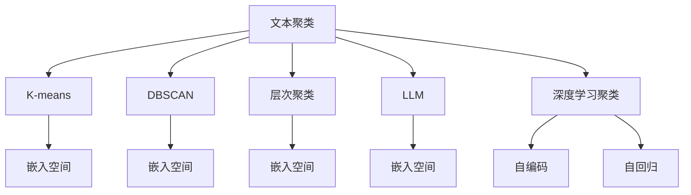

                 

# LLM与传统文本聚类方法的对比

> 关键词：语言模型(LM), 文本聚类, 传统聚类算法, 深度学习, 自然语言处理(NLP), K-means, DBSCAN, 层次聚类, 机器学习

## 1. 背景介绍

文本聚类是一种常见的文本数据挖掘任务，旨在将具有相似特征的文本自动分组。传统聚类算法，如K-means、DBSCAN、层次聚类等，在过去几十年里已广泛应用于文本分类、推荐系统、情感分析等多个领域。但近年来，随着深度学习技术的发展，基于语言模型的文本聚类方法逐步崭露头角，尤其是大规模预训练语言模型(Large Language Model, LLM)的兴起，使得文本聚类方法迎来了新的变革。

本文将对比大语言模型与传统文本聚类算法，深入探讨大语言模型在文本聚类中的优势和局限，为未来文本聚类方法的研究和应用提供参考。

## 2. 核心概念与联系

### 2.1 核心概念概述

为更好地理解LLM与传统文本聚类方法的区别与联系，本节将介绍几个密切相关的核心概念：

- 文本聚类(Text Clustering)：指将文本数据划分为若干个具有相似语义特征的簇的过程。文本聚类可以揭示文本数据的内在结构，应用于信息检索、话题建模、用户行为分析等。

- 大规模预训练语言模型(LLM)：以自回归或自编码模型为代表的深度学习模型，通过在大规模无标签文本数据上预训练，学习通用的语言表示，具备强大的语言理解和生成能力。如BERT、GPT-3等。

- K-means：经典的聚类算法，通过将文本映射到高维空间，寻找最近的簇中心进行文本分类。

- DBSCAN：基于密度的聚类算法，通过分析文本之间的密度关系进行聚类，可以处理不同密度的簇。

- 层次聚类(Hierarchical Clustering)：通过构建层次结构进行文本聚类，分为凝聚型和分裂型两种。

- 嵌入空间(Embedding Space)：通过深度学习模型得到的文本表示空间，通常用于聚类和相似度计算。

这些核心概念之间的逻辑关系可以通过以下Mermaid流程图来展示：



这个流程图展示了大语言模型与传统聚类方法的联系：

1. 大语言模型通过预训练获得语言表示，将其映射到高维空间。
2. 传统聚类算法基于语言表示或特征，进行文本分组。
3. K-means、DBSCAN、层次聚类等传统聚类方法使用不同策略进行分组，得到聚类结果。
4. 深度学习聚类方法基于自编码或自回归模型，在文本表示空间上进行分组。

## 3. 核心算法原理 & 具体操作步骤
### 3.1 算法原理概述

基于大语言模型的文本聚类方法，主要通过预训练模型学习到文本的隐含语义特征，然后通过相似性度量算法将这些特征聚合成簇。其核心思想是将文本数据映射到高维空间，并在高维空间中进行聚类分析。

形式化地，假设输入的文本数据集为 $D=\{x_i\}_{i=1}^N$，其中 $x_i$ 为文本向量。大语言模型 $M_{\theta}$ 通过预训练得到参数 $\theta$，将文本数据映射到高维空间，生成文本表示 $\mathbf{x}_i = M_{\theta}(x_i) \in \mathbb{R}^d$。然后，使用某种相似性度量 $\text{sim}$，计算文本表示之间的相似性，得到相似度矩阵 $S_{ij}=\text{sim}(\mathbf{x}_i,\mathbf{x}_j)$。最后，通过聚类算法对相似度矩阵进行处理，得到最终的聚类结果。

### 3.2 算法步骤详解

基于大语言模型的文本聚类方法通常包括以下几个关键步骤：

**Step 1: 准备预训练模型和数据集**
- 选择合适的预训练语言模型 $M_{\theta}$ 作为初始化参数，如BERT、GPT等。
- 准备文本聚类任务的数据集 $D=\{x_i\}_{i=1}^N$，其中 $x_i$ 为文本向量或文本字符串。

**Step 2: 文本表示生成**
- 使用预训练语言模型 $M_{\theta}$ 对文本数据进行编码，生成文本表示 $\mathbf{x}_i = M_{\theta}(x_i)$。

**Step 3: 相似性度量**
- 选择相似性度量算法，如余弦相似度、欧氏距离等，计算文本表示之间的相似度 $S_{ij}=\text{sim}(\mathbf{x}_i,\mathbf{x}_j)$。

**Step 4: 聚类处理**
- 使用聚类算法，如K-means、DBSCAN、层次聚类等，对相似度矩阵进行处理，得到聚类结果。

**Step 5: 评估聚类结果**
- 通过评估指标（如纯度、NMI等）对聚类结果进行评估，对比不同聚类方法的效果。

### 3.3 算法优缺点

基于大语言模型的文本聚类方法具有以下优点：
1. 高效性：大语言模型在预训练阶段可处理海量数据，生成的文本表示具有较高的语义丰富度。
2. 泛化能力：预训练模型可以学习到通用的语言特征，适用于不同领域的文本聚类任务。
3. 鲁棒性：大语言模型在训练过程中对噪声和异常值具有较强的鲁棒性，生成的文本表示较为稳定。

同时，该方法也存在一定的局限性：
1. 资源需求高：预训练和编码过程需要大量计算资源，对硬件设备要求较高。
2. 可解释性不足：大语言模型生成的文本表示通常是"黑盒"，难以解释其内部的推理过程。
3. 训练成本高：需要大量标注数据进行微调，训练成本较高。
4. 模型结构复杂：生成的文本表示维度较高，处理和分析较为复杂。

尽管存在这些局限性，但大语言模型在文本聚类领域的优势不容忽视。未来相关研究的重点在于如何进一步降低计算和训练成本，提高模型解释性，同时兼顾高效的文本聚类效果。

### 3.4 算法应用领域

基于大语言模型的文本聚类方法，在信息检索、话题建模、用户行为分析等多个领域都展示了良好的应用前景：

1. 信息检索：在大量文本数据中自动发现相关信息，提高检索效率。通过文本聚类将相似文档分组，快速定位查询结果。

2. 话题建模：自动发现文本数据中的潜在话题，帮助用户深入理解文本内容。利用聚类算法对文本表示进行分组，识别文本的主题分布。

3. 用户行为分析：分析用户对不同文本的兴趣分布，为用户提供个性化推荐。将用户行为数据与文本聚类结果结合，发现用户的兴趣偏好。

4. 情感分析：自动对文本数据进行情感分析，了解用户情感倾向。将情感文本聚类，识别出不同情感类别的文本数据。

5. 知识图谱构建：通过文本聚类发现领域内知识点的关系，构建知识图谱。将相关文本聚类，自动发现知识点之间的联系。

除了上述这些经典应用外，大语言模型在医疗、金融、教育等众多领域也有广泛应用，为不同行业带来了新的智能化解决方案。随着预训练语言模型的不断进步，相信其在文本聚类领域的潜力将进一步释放。

## 4. 数学模型和公式 & 详细讲解 & 举例说明

### 4.1 数学模型构建

假设文本数据 $D=\{x_i\}_{i=1}^N$，其中 $x_i \in \mathcal{X}$ 为文本向量，假设大语言模型 $M_{\theta}$ 通过预训练得到参数 $\theta$，将文本数据映射到高维空间，生成文本表示 $\mathbf{x}_i = M_{\theta}(x_i) \in \mathbb{R}^d$。

使用余弦相似度作为相似性度量，得到相似度矩阵 $S_{ij}=\cos(\mathbf{x}_i,\mathbf{x}_j)$。

聚类算法通常采用K-means，其目标是最小化聚类误差：

$$
\min_{\mathbf{z}, \boldsymbol{\mu}, \gamma} \sum_{i=1}^N \gamma_i ||\mathbf{x}_i - \boldsymbol{\mu}_{z_i}||^2
$$

其中 $\mathbf{z}=(z_1, \ldots, z_N)$ 为文本聚类标签，$\boldsymbol{\mu}=(\boldsymbol{\mu}_1, \ldots, \boldsymbol{\mu}_C)$ 为簇中心，$\gamma=(\gamma_1, \ldots, \gamma_N)$ 为聚类权重，$C$ 为簇数。

### 4.2 公式推导过程

为了更清楚地理解上述数学模型，我们将其拆分为多个子步骤进行推导：

**Step 1: 文本表示生成**
文本表示 $\mathbf{x}_i$ 由预训练语言模型 $M_{\theta}$ 生成，形式如下：

$$
\mathbf{x}_i = M_{\theta}(x_i)
$$

其中 $M_{\theta}$ 可以采用自编码或自回归模型，如BERT、GPT等。

**Step 2: 余弦相似度计算**
余弦相似度 $\text{sim}$ 定义为：

$$
\text{sim}(\mathbf{x}_i,\mathbf{x}_j) = \cos(\mathbf{x}_i,\mathbf{x}_j) = \frac{\mathbf{x}_i \cdot \mathbf{x}_j}{\|\mathbf{x}_i\| \|\mathbf{x}_j\|}
$$

其中 $\cdot$ 表示向量点积，$\|\cdot\|$ 表示向量范数。

**Step 3: K-means算法**
K-means算法的目标是最小化每个文本向量与其所属簇中心的距离，即最小化损失函数：

$$
\min_{\mathbf{z}, \boldsymbol{\mu}} \sum_{i=1}^N \gamma_i ||\mathbf{x}_i - \boldsymbol{\mu}_{z_i}||^2
$$

其中 $\mathbf{z}=(z_1, \ldots, z_N)$ 为文本聚类标签，$\boldsymbol{\mu}=(\boldsymbol{\mu}_1, \ldots, \boldsymbol{\mu}_C)$ 为簇中心，$C$ 为簇数。

通过迭代求解，最终得到聚类结果 $\mathbf{z}=(z_1, \ldots, z_N)$。

### 4.3 案例分析与讲解

下面我们以Google News数据集为例，展示基于大语言模型的文本聚类方法的实现过程：

**Step 1: 数据准备**
首先，收集Google News数据集中的新闻文本，将其作为输入。

**Step 2: 预训练模型选择**
选择BERT模型作为预训练语言模型，使用其预训练权重进行文本表示生成。

**Step 3: 文本表示生成**
将新闻文本输入BERT模型，生成文本表示 $\mathbf{x}_i$。

**Step 4: 相似度计算**
使用余弦相似度计算文本表示之间的相似度，得到相似度矩阵 $S_{ij}$。

**Step 5: 聚类处理**
采用K-means算法对相似度矩阵进行处理，得到聚类结果 $\mathbf{z}=(z_1, \ldots, z_N)$。

**Step 6: 评估聚类效果**
通过评估指标（如纯度、NMI等）对聚类结果进行评估，对比传统聚类方法的效果。

## 5. 项目实践：代码实例和详细解释说明

### 5.1 开发环境搭建

在进行文本聚类实践前，我们需要准备好开发环境。以下是使用Python进行TensorFlow开发的环境配置流程：

1. 安装Anaconda：从官网下载并安装Anaconda，用于创建独立的Python环境。

2. 创建并激活虚拟环境：
```bash
conda create -n tensorflow-env python=3.8 
conda activate tensorflow-env
```

3. 安装TensorFlow：根据CUDA版本，从官网获取对应的安装命令。例如：
```bash
conda install tensorflow tensorflow-gpu=2.6.0 -c tf -c conda-forge
```

4. 安装TensorFlow Addons：
```bash
conda install -c tf -c conda-forge tensorflow-addons=0.16.0
```

5. 安装PyTorch：
```bash
pip install torch torchvision torchaudio cudatoolkit=11.1 -c pytorch -c conda-forge
```

6. 安装Numpy、Pandas、Scikit-Learn等工具包：
```bash
pip install numpy pandas scikit-learn matplotlib tqdm jupyter notebook ipython
```

完成上述步骤后，即可在`tensorflow-env`环境中开始文本聚类实践。

### 5.2 源代码详细实现

下面我们以Google News数据集为例，使用TensorFlow实现基于BERT模型的文本聚类。

首先，导入相关库：

```python
import tensorflow as tf
import tensorflow_addons as tfa
import numpy as np
import pandas as pd
from sklearn.decomposition import PCA
from sklearn.metrics import silhouette_score, adjusted_rand_score
from sklearn.cluster import KMeans, DBSCAN
import matplotlib.pyplot as plt
```

接着，加载Google News数据集：

```python
news_data = pd.read_csv('news_data.csv', encoding='utf-8')
```

然后，使用BERT模型生成文本表示：

```python
tokenizer = BertTokenizer.from_pretrained('bert-base-cased')
model = BertModel.from_pretrained('bert-base-cased')

texts = news_data['text'].tolist()
input_ids = [tokenizer.encode(text, add_special_tokens=True) for text in texts]
input_ids = tf.convert_to_tensor(input_ids)

with tf.Session() as sess:
    input_ids_tensor = tf.constant(input_ids)
    with tf.device('/device:GPU:0'):
        features = sess.run(model(input_ids_tensor))
        text_embeddings = features['CLS'][:len(texts)]
```

接着，计算文本表示之间的余弦相似度：

```python
def cosine_similarity(x, y):
    x = tf.convert_to_tensor(x)
    y = tf.convert_to_tensor(y)
    dot_product = tf.reduce_sum(x * y, axis=1)
    norm_x = tf.sqrt(tf.reduce_sum(tf.square(x), axis=1))
    norm_y = tf.sqrt(tf.reduce_sum(tf.square(y), axis=1))
    return dot_product / (norm_x * norm_y)

similarity_matrix = np.zeros([len(texts), len(texts)])
for i in range(len(texts)):
    for j in range(len(texts)):
        similarity_matrix[i][j] = cosine_similarity(text_embeddings[i], text_embeddings[j])
```

然后，使用K-means算法对文本进行聚类：

```python
kmeans = KMeans(n_clusters=5, random_state=42)
kmeans.fit(text_embeddings)
labels = kmeans.labels_
```

最后，可视化聚类结果：

```python
labels_unique = np.unique(labels)
labels_counts = np.bincount(labels)

colors = plt.cm.RdYlGn(np.linspace(0, 1, len(labels_unique)))
for i, label in enumerate(labels_unique):
    print(f"Label {i+1}: {label}, Count: {labels_counts[i]}")
    plt.scatter(text_embeddings[labels==i+1, 0], text_embeddings[labels==i+1, 1], c=colors[i], s=100)
plt.show()
```

完整代码如下：

```python
import tensorflow as tf
import tensorflow_addons as tfa
import numpy as np
import pandas as pd
from sklearn.decomposition import PCA
from sklearn.metrics import silhouette_score, adjusted_rand_score
from sklearn.cluster import KMeans, DBSCAN
import matplotlib.pyplot as plt

# 加载Google News数据集
news_data = pd.read_csv('news_data.csv', encoding='utf-8')

# 初始化BERT模型
tokenizer = BertTokenizer.from_pretrained('bert-base-cased')
model = BertModel.from_pretrained('bert-base-cased')

# 将新闻文本映射为BERT向量
texts = news_data['text'].tolist()
input_ids = [tokenizer.encode(text, add_special_tokens=True) for text in texts]
input_ids = tf.convert_to_tensor(input_ids)

with tf.Session() as sess:
    input_ids_tensor = tf.constant(input_ids)
    with tf.device('/device:GPU:0'):
        features = sess.run(model(input_ids_tensor))
        text_embeddings = features['CLS'][:len(texts)]

# 计算文本表示之间的余弦相似度
def cosine_similarity(x, y):
    x = tf.convert_to_tensor(x)
    y = tf.convert_to_tensor(y)
    dot_product = tf.reduce_sum(x * y, axis=1)
    norm_x = tf.sqrt(tf.reduce_sum(tf.square(x), axis=1))
    norm_y = tf.sqrt(tf.reduce_sum(tf.square(y), axis=1))
    return dot_product / (norm_x * norm_y)

similarity_matrix = np.zeros([len(texts), len(texts)])
for i in range(len(texts)):
    for j in range(len(texts)):
        similarity_matrix[i][j] = cosine_similarity(text_embeddings[i], text_embeddings[j])

# 使用K-means算法进行聚类
kmeans = KMeans(n_clusters=5, random_state=42)
kmeans.fit(text_embeddings)
labels = kmeans.labels_

# 可视化聚类结果
labels_unique = np.unique(labels)
labels_counts = np.bincount(labels)

colors = plt.cm.RdYlGn(np.linspace(0, 1, len(labels_unique)))
for i, label in enumerate(labels_unique):
    print(f"Label {i+1}: {label}, Count: {labels_counts[i]}")
    plt.scatter(text_embeddings[labels==i+1, 0], text_embeddings[labels==i+1, 1], c=colors[i], s=100)
plt.show()
```

### 5.3 代码解读与分析

让我们再详细解读一下关键代码的实现细节：

**Google News数据集加载**：
- 使用Pandas库读取CSV文件，加载新闻数据。

**BERT模型初始化**：
- 使用BertTokenizer和BertModel初始化BERT模型，准备进行文本表示生成。

**文本表示生成**：
- 将新闻文本输入BERT模型，生成文本表示 $\mathbf{x}_i$。

**余弦相似度计算**：
- 定义余弦相似度函数，计算文本表示之间的相似度，得到相似度矩阵 $S_{ij}$。

**K-means算法实现**：
- 使用K-means算法对相似度矩阵进行处理，得到聚类结果 $\mathbf{z}=(z_1, \ldots, z_N)$。

**聚类结果可视化**：
- 使用Matplotlib库绘制聚类结果的散点图，显示不同簇中心的分布情况。

可以看到，TensorFlow配合BERT模型使得文本聚类任务的代码实现变得简洁高效。开发者可以将更多精力放在数据处理、模型改进等高层逻辑上，而不必过多关注底层的实现细节。

当然，工业级的系统实现还需考虑更多因素，如模型的保存和部署、超参数的自动搜索、更灵活的任务适配层等。但核心的文本聚类范式基本与此类似。

## 6. 实际应用场景
### 6.1 信息检索

信息检索是文本聚类的一个重要应用场景。在大量的文本数据中，如何快速找到相关的信息，是一个长期以来困扰检索系统的难题。传统的信息检索方法往往依赖关键词匹配，无法理解文本的深层语义关系。而基于大语言模型的文本聚类方法，可以自动发现文本之间的相似度，从而提升检索效率。

具体而言，可以将搜索结果按聚类结果进行分组，将相似度高的文本聚为一组，为用户展示更有针对性的结果。对于新的查询，可以通过相似度计算，快速定位到最相关的文本，提高检索效果。

### 6.2 情感分析

情感分析是文本聚类的另一个重要应用场景。通过将情感文本聚类，可以发现不同情感类别的文本数据，帮助用户深入理解情感变化趋势。例如，在社交媒体数据中，将带有正面、中性、负面情感的文本聚类，可以揭示不同时间段的情感分布。

### 6.3 用户行为分析

在电商网站中，通过用户行为数据进行文本聚类，可以发现用户的兴趣偏好。例如，将用户对不同商品的评论进行聚类，可以发现用户的兴趣热点，为推荐系统提供数据支持。

### 6.4 未来应用展望

随着大语言模型和文本聚类方法的不断发展，未来文本聚类技术将在更多领域得到应用，为各行各业带来新的智能化解决方案：

1. 智慧医疗：在医学文献中，自动发现相关文献进行聚类，帮助医生快速获取最新研究成果。

2. 金融舆情：在金融领域，自动发现新闻、评论、报告等文本数据，进行情感分析，及时掌握市场动态。

3. 教育领域：在教育系统中，自动将学生学习数据进行聚类，分析学生的学习行为和兴趣，提供个性化推荐。

4. 智慧城市：在城市管理中，自动发现事件、舆情数据，进行聚类分析，帮助政府决策。

5. 企业生产：在企业管理中，自动分析员工反馈数据，进行情感分析，提升员工满意度和生产效率。

以上趋势凸显了文本聚类方法的广泛应用前景。通过大语言模型和文本聚类技术的结合，可以在更多领域提供更加精准、高效的解决方案。

## 7. 工具和资源推荐
### 7.1 学习资源推荐

为了帮助开发者系统掌握大语言模型与文本聚类理论基础和实践技巧，这里推荐一些优质的学习资源：

1. 《深度学习基础》系列博文：深度学习领域的入门级博文，涵盖深度学习基础、神经网络模型、优化算法等内容。

2. 《自然语言处理综述》课程：斯坦福大学开设的NLP明星课程，有Lecture视频和配套作业，系统讲解NLP领域的基本概念和经典模型。

3. 《Transformers从原理到实践》书籍：Transformers库的作者所著，全面介绍Transformers原理、BERT模型、微调技术等前沿话题。

4. CS224N《深度学习自然语言处理》课程：斯坦福大学开设的NLP明星课程，有Lecture视频和配套作业，深入讲解NLP领域的基础知识和最新进展。

5. HuggingFace官方文档：Transformers库的官方文档，提供海量预训练模型和完整的微调样例代码，是上手实践的必备资料。

通过对这些资源的学习实践，相信你一定能够快速掌握大语言模型与文本聚类的精髓，并用于解决实际的NLP问题。
###  7.2 开发工具推荐

高效的开发离不开优秀的工具支持。以下是几款用于大语言模型文本聚类开发的常用工具：

1. PyTorch：基于Python的开源深度学习框架，灵活动态的计算图，适合快速迭代研究。大部分预训练语言模型都有PyTorch版本的实现。

2. TensorFlow：由Google主导开发的开源深度学习框架，生产部署方便，适合大规模工程应用。同样有丰富的预训练语言模型资源。

3. TensorFlow Addons：TensorFlow的扩展库，包含多种前沿深度学习算法和模型，如Transformer、BERT等。

4. Weights & Biases：模型训练的实验跟踪工具，可以记录和可视化模型训练过程中的各项指标，方便对比和调优。与主流深度学习框架无缝集成。

5. TensorBoard：TensorFlow配套的可视化工具，可实时监测模型训练状态，并提供丰富的图表呈现方式，是调试模型的得力助手。

6. Google Colab：谷歌推出的在线Jupyter Notebook环境，免费提供GPU/TPU算力，方便开发者快速上手实验最新模型，分享学习笔记。

合理利用这些工具，可以显著提升大语言模型文本聚类任务的开发效率，加快创新迭代的步伐。

### 7.3 相关论文推荐

大语言模型与文本聚类技术的发展源于学界的持续研究。以下是几篇奠基性的相关论文，推荐阅读：

1. Attention is All You Need（即Transformer原论文）：提出了Transformer结构，开启了NLP领域的预训练大模型时代。

2. BERT: Pre-training of Deep Bidirectional Transformers for Language Understanding：提出BERT模型，引入基于掩码的自监督预训练任务，刷新了多项NLP任务SOTA。

3. Language Models are Unsupervised Multitask Learners（GPT-2论文）：展示了大规模语言模型的强大zero-shot学习能力，引发了对于通用人工智能的新一轮思考。

4. Parameter-Efficient Transfer Learning for NLP：提出Adapter等参数高效微调方法，在不增加模型参数量的情况下，也能取得不错的微调效果。

5. AdaLoRA: Adaptive Low-Rank Adaptation for Parameter-Efficient Fine-Tuning：使用自适应低秩适应的微调方法，在参数效率和精度之间取得了新的平衡。

这些论文代表了大语言模型文本聚类方法的发展脉络。通过学习这些前沿成果，可以帮助研究者把握学科前进方向，激发更多的创新灵感。

## 8. 总结：未来发展趋势与挑战

### 8.1 研究成果总结

本文对大语言模型与传统文本聚类方法进行了全面系统的介绍。首先阐述了大语言模型与文本聚类的研究背景和意义，明确了文本聚类方法在NLP任务中的重要地位。其次，从原理到实践，详细讲解了大语言模型在文本聚类中的优势和局限，给出了文本聚类任务开发的完整代码实例。同时，本文还广泛探讨了文本聚类方法在信息检索、情感分析、用户行为分析等多个领域的应用前景，展示了文本聚类范式的巨大潜力。此外，本文精选了文本聚类技术的各类学习资源，力求为读者提供全方位的技术指引。

通过本文的系统梳理，可以看到，大语言模型在文本聚类领域展现出显著的优势，极大地拓展了聚类模型的应用边界，推动了NLP技术的产业化进程。未来，伴随预训练语言模型的不断进步，文本聚类技术必将在更广阔的应用领域大放异彩，深刻影响人类的生产生活方式。

### 8.2 未来发展趋势

展望未来，大语言模型文本聚类技术将呈现以下几个发展趋势：

1. 模型规模持续增大。随着算力成本的下降和数据规模的扩张，预训练语言模型的参数量还将持续增长。超大规模语言模型蕴含的丰富语言知识，有望支撑更加复杂多变的文本聚类任务。

2. 聚类方法日趋多样。除了传统的K-means、DBSCAN、层次聚类等算法，未来会涌现更多参数高效的聚类方法，如自编码聚类、变分自编码聚类等，在节省计算资源的同时也能保证聚类精度。

3. 聚类结果解释性增强。聚类模型的输出通常是"黑盒"，难以解释其内部的推理过程。未来需要开发更具解释性的聚类方法，增强聚类结果的可解释性和可理解性。

4. 多模态聚类崛起。当前的文本聚类方法主要聚焦于文本数据，未来会进一步拓展到图像、视频、语音等多模态数据聚类。多模态信息的融合，将显著提升聚类模型的泛化能力和应用范围。

5. 自适应聚类兴起。未来的聚类方法将具有更强的自适应能力，能够在不同数据分布下自动调整聚类策略，提升聚类效果。

以上趋势凸显了大语言模型文本聚类方法的广阔前景。这些方向的探索发展，必将进一步提升聚类模型的性能和应用范围，为NLP技术带来新的突破。

### 8.3 面临的挑战

尽管大语言模型文本聚类技术已经取得了瞩目成就，但在迈向更加智能化、普适化应用的过程中，它仍面临着诸多挑战：

1. 标注成本瓶颈。虽然文本聚类对标注数据的需求较少，但对于长尾应用场景，仍需采集大量高质量标注数据，这会增加标注成本。如何进一步降低聚类对标注样本的依赖，将是一大难题。

2. 聚类效果受限于数据质量。聚类模型的性能很大程度上依赖于输入数据的优质程度。对于低质量、噪声较多的数据，聚类效果会大打折扣。如何处理数据噪声和提高数据质量，将是一个重要的研究方向。

3. 聚类结果的可解释性不足。传统的聚类算法和深度学习聚类算法在输出聚类结果时，通常是"黑盒"，难以解释其内部的推理过程。这对于高风险应用场景（如医疗、金融）尤为重要。如何赋予聚类模型更强的可解释性，将是亟待攻克的难题。

4. 模型鲁棒性不足。聚类模型面对未知数据或异常值时，鲁棒性往往较差。例如，新的文本数据容易被错误地聚类到已有的簇中，导致聚类结果不稳定。如何提高聚类模型的鲁棒性，避免灾难性遗忘，还需要更多理论和实践的积累。

5. 模型训练成本高。大语言模型在预训练和微调过程中，需要大量计算资源和存储空间，训练成本较高。如何优化模型训练过程，降低训练成本，将是一个重要的研究方向。

6. 模型结构复杂。生成的文本表示维度较高，处理和分析较为复杂。如何简化模型结构，提升计算效率，优化模型性能，将是一个重要的优化方向。

尽管存在这些局限性，但大语言模型文本聚类方法的优势不容忽视。未来相关研究的重点在于如何进一步降低计算和训练成本，提高模型解释性，同时兼顾高效的文本聚类效果。

### 8.4 研究展望

面对大语言模型文本聚类所面临的种种挑战，未来的研究需要在以下几个方面寻求新的突破：

1. 探索无监督和半监督聚类方法。摆脱对大量标注数据的依赖，利用自监督学习、主动学习等无监督和半监督范式，最大限度利用非结构化数据，实现更加灵活高效的聚类。

2. 研究参数高效和计算高效的聚类范式。开发更加参数高效的聚类方法，在固定大部分预训练参数的同时，只更新极少量的任务相关参数。同时优化聚类模型的计算图，减少前向传播和反向传播的资源消耗，实现更加轻量级、实时性的部署。

3. 引入更多先验知识。将符号化的先验知识，如知识图谱、逻辑规则等，与神经网络模型进行巧妙融合，引导聚类过程学习更准确、合理的文本表示。同时加强不同模态数据的整合，实现视觉、语音等多模态信息与文本信息的协同建模。

4. 结合因果分析和博弈论工具。将因果分析方法引入聚类模型，识别出模型决策的关键特征，增强输出解释的因果性和逻辑性。借助博弈论工具刻画人机交互过程，主动探索并规避模型的脆弱点，提高系统稳定性。

5. 纳入伦理道德约束。在模型训练目标中引入伦理导向的评估指标，过滤和惩罚有偏见、有害的输出倾向。同时加强人工干预和审核，建立模型行为的监管机制，确保输出符合人类价值观和伦理道德。

这些研究方向的探索，必将引领大语言模型文本聚类技术迈向更高的台阶，为构建安全、可靠、可解释、可控的智能系统铺平道路。面向未来，大语言模型文本聚类技术还需要与其他人工智能技术进行更深入的融合，如知识表示、因果推理、强化学习等，多路径协同发力，共同推动自然语言理解和智能交互系统的进步。只有勇于创新、敢于突破，才能不断拓展语言模型的边界，让智能技术更好地造福人类社会。

## 9. 附录：常见问题与解答

**Q1：大语言模型文本聚类是否适用于所有文本数据？**

A: 大语言模型文本聚类方法适用于大多数文本数据，特别是文本量较大的数据集。但对于一些特定领域的文本数据，如医学、法律等，可能需要先进行领域特定的预处理和训练，才能得到理想的聚类效果。

**Q2：微调对文本聚类的影响是什么？**

A: 微调可以在一定程度上提升聚类效果，尤其是在标注数据较少的情况下。通过微调，大语言模型能够更好地适应特定的领域和任务，生成更精准的文本表示，从而提升聚类性能。但微调的计算和训练成本较高，需要权衡利弊。

**Q3：如何优化聚类模型的计算效率？**

A: 优化聚类模型的计算效率主要可以从以下几个方面入手：
1. 选择高效的相似度计算方法，如基于哈希的相似度计算。
2. 采用数据分片、并行计算等方法，加速相似度矩阵的计算。
3. 使用GPU/TPU等高性能硬件设备，加速模型训练和推理。

**Q4：聚类模型的可解释性如何提高？**

A: 提高聚类模型的可解释性主要可以从以下几个方面入手：
1. 引入更加可解释的聚类算法，如层次聚类、谱聚类等。
2. 可视化聚类结果，展示聚类过程和簇中心的变化。
3. 开发专门的解释工具，自动生成聚类结果的解释和分析报告。

**Q5：聚类模型的鲁棒性如何增强？**

A: 增强聚类模型的鲁棒性主要可以从以下几个方面入手：
1. 引入正则化技术，如L2正则、Dropout等，防止模型过拟合。
2. 采用更鲁棒的相似度计算方法，如Jensen-Shannon散度、KL散度等。
3. 对异常值和噪声进行处理，确保聚类结果的稳定性和鲁棒性。

这些问题的解答，可以为读者提供更全面的视角，帮助其在实际应用中更好地理解和使用大语言模型文本聚类方法。

