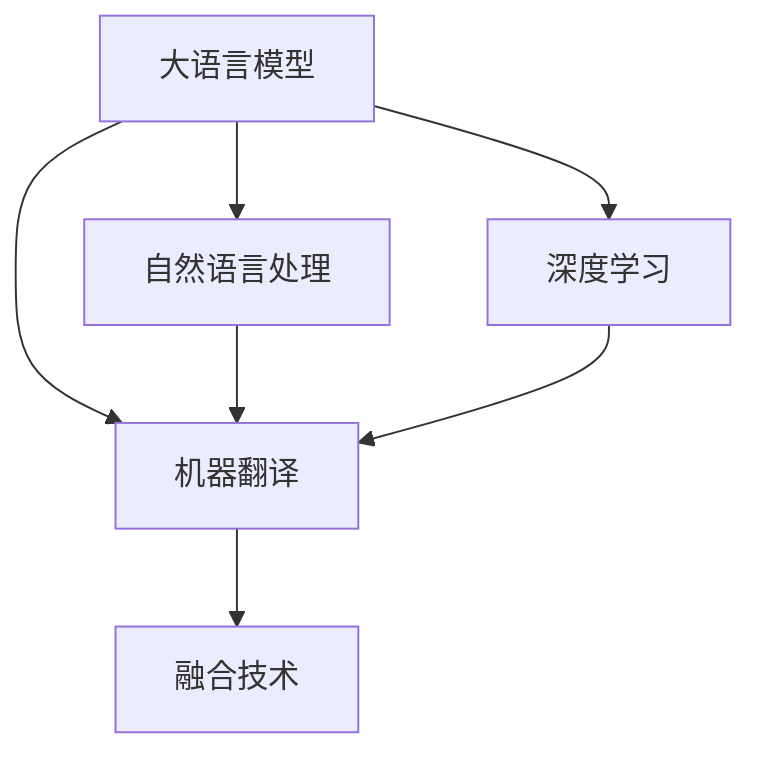
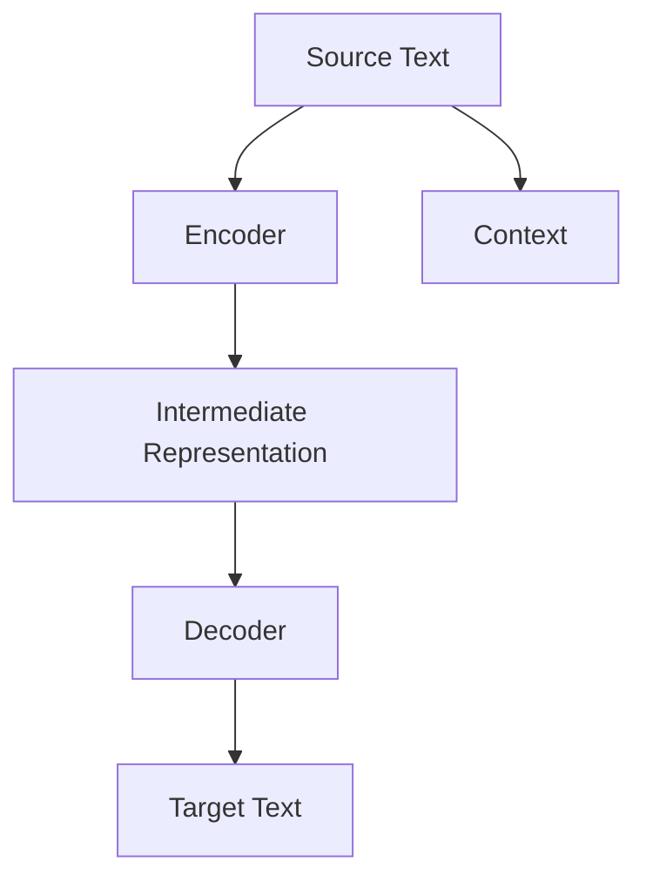

                 

# LLM与传统机器翻译技术的对比与融合

> 关键词：大语言模型(LLM), 机器翻译(ML), 自然语言处理(NLP), 深度学习(Deep Learning), 对比学习, 融合技术

## 1. 背景介绍

### 1.1 问题由来

近年来，随着深度学习和大规模语言模型的发展，机器翻译领域正经历着深刻的变革。传统基于规则和统计机器翻译（MT）系统逐渐被基于神经网络的端到端翻译系统所取代，其中尤以序列到序列（Seq2Seq）架构和注意力机制（Attention）最为显著。然而，这些基于神经网络的方法在面对长文本和多义词等复杂问题时，仍难以达到人类专业翻译人员的水平。与此同时，大语言模型（LLMs）如GPT-3、BERT等，凭借其庞大的参数量、强大的语言理解和生成能力，逐渐进入人们的视野。

### 1.2 问题核心关键点

大语言模型与传统机器翻译技术的融合，旨在充分利用LLMs的语言生成能力，结合传统MT的序列处理能力，提高翻译质量和效率。具体问题包括：
- 大语言模型如何与MT系统融合？
- 融合后的翻译系统性能如何？
- 融合过程中需要解决的技术难题有哪些？
- 融合技术的应用前景如何？

### 1.3 问题研究意义

大语言模型与传统MT技术的融合，将显著提升机器翻译的质量和效率，带来新的翻译工具和服务。其研究意义主要体现在：
1. 打破传统MT的技术瓶颈，使翻译系统更具有竞争力。
2. 引入大语言模型的语言理解和生成能力，提高翻译的自动化程度。
3. 促进机器翻译技术的商业化和工业化应用。
4. 探索NLP技术的最新进展，推动AI技术的发展和应用。

## 2. 核心概念与联系

### 2.1 核心概念概述

为更好地理解LLM与MT技术的融合方法，本节将介绍几个密切相关的核心概念：

- **大语言模型(LLM)**：以自回归或自编码模型为代表的大规模预训练语言模型。通过在大规模无标签文本数据上进行预训练，学习通用的语言表示，具备强大的语言理解和生成能力。

- **机器翻译(MT)**：将一种语言的文本翻译成另一种语言的文本。传统的MT方法包括基于规则和基于统计的机器翻译。近年来，神经网络架构如Seq2Seq和Transformer被广泛应用于MT。

- **自然语言处理(NLP)**：处理、分析和生成人类语言的技术，涵盖语言理解、语言生成、语言模型等多个方面。MT是大NLP领域的一个重要分支。

- **深度学习(Deep Learning)**：利用神经网络进行数据表示学习的方法，广泛应用于图像识别、语音识别、自然语言处理等多个领域。

- **对比学习(Contrastive Learning)**：通过构造相似和不同样本的对比，训练模型学习样本间的语义关系。

- **融合技术**：将不同的技术手段和方法有机结合，形成更强大、更高效的技术体系。

这些核心概念之间的逻辑关系可以通过以下Mermaid流程图来展示：



这个流程图展示了大语言模型、机器翻译、自然语言处理、深度学习和融合技术之间的关系：

1. 大语言模型通过预训练获得语言知识和表示，为翻译提供丰富的上下文信息。
2. 机器翻译利用序列处理能力，将源语言文本转化为目标语言文本。
3. 自然语言处理涵盖NLP领域多个方面，MT是其中一部分。
4. 深度学习为大语言模型和MT提供强大的计算框架和模型优化技术。
5. 融合技术将不同技术进行结合，形成更完整的解决方案。

这些概念共同构成了LLM与MT融合的理论基础，为其在实际应用中的实现提供了指导。

## 3. 核心算法原理 & 具体操作步骤
### 3.1 算法原理概述

大语言模型与机器翻译的融合，实质上是一个有监督学习的过程。其核心思想是利用大语言模型的语言理解和生成能力，辅助MT系统进行更准确、更自然的翻译。具体来说，LLM可以在翻译时提供上下文信息，帮助MT系统更好地理解源语言文本，并在生成目标语言文本时提供语言风格和语义导向。

### 3.2 算法步骤详解

基于LLM与MT融合的算法主要包括以下几个关键步骤：

**Step 1: 数据预处理**
- 收集并整理双语对照语料，作为机器翻译的监督数据。
- 对语料进行清洗、分句、分词等预处理，生成模型所需格式。

**Step 2: 构建模型架构**
- 选择适当的翻译模型，如Seq2Seq、Transformer等。
- 在模型顶部引入大语言模型层，作为额外的上下文输入。

**Step 3: 微调模型参数**
- 在双语对照语料上进行监督学习，调整模型参数。
- 使用教师信号（如教师脚本、专家翻译等）进行微调，提高翻译质量。

**Step 4: 推理翻译**
- 在翻译任务中引入大语言模型的上下文信息，进行序列到序列的翻译。
- 使用大语言模型生成自然流畅的翻译文本，作为最终输出。

### 3.3 算法优缺点

基于LLM与MT融合的翻译算法具有以下优点：
1. 利用LLM的语言生成能力，提高翻译的自然度和流畅性。
2. 结合MT的序列处理能力，解决长文本和多义词等问题。
3. 引入对比学习，提高模型的泛化能力和鲁棒性。

同时，该算法也存在一些局限性：
1. 计算资源需求高。大语言模型的参数量庞大，对计算资源和内存消耗较大。
2. 训练时间较长。融合后的模型需要较长的训练时间，才能达到较好的效果。
3. 模型复杂度较高。融合后的模型结构复杂，难以解释和调试。

尽管存在这些局限性，但通过合理设计和优化，大语言模型与MT技术的融合仍可以在提升翻译质量的同时，缩短训练时间和降低计算成本。

### 3.4 算法应用领域

基于LLM与MT融合的翻译技术，已经在多个实际应用场景中得到了验证，如新闻报道翻译、国际贸易文件翻译、法律文本翻译等。此外，融合技术还应用于可控翻译、无参考翻译、跨语言知识图谱等创新场景中，展示了其广泛的应用前景。

## 4. 数学模型和公式 & 详细讲解 & 举例说明
### 4.1 数学模型构建

在LLM与MT融合的框架下，我们可以构建一个简单的数学模型。假设源语言文本为 $X$，目标语言文本为 $Y$。我们使用一个编码器-解码器架构，编码器将源语言文本 $X$ 转换为中间表示 $H$，解码器将 $H$ 和附加上下文 $C$（由大语言模型生成）转换为目标语言文本 $Y$。模型结构如下图所示：



其中，$H$ 为编码器输出的中间表示，$C$ 为附加的上下文信息，$Y$ 为最终翻译结果。

### 4.2 公式推导过程

假设编码器输出的中间表示 $H$ 为 $d$ 维向量，解码器输出的目标语言文本 $Y$ 为 $m$ 维向量。设 $X$ 和 $Y$ 的长度分别为 $n$ 和 $m$。使用Transformer架构，可以构建编码器和解码器的注意力机制和前馈网络，如下所示：

$$
H = \text{Encoder}(X) = \text{Attention}(X, C)
$$

$$
Y = \text{Decoder}(H, C) = \text{Attention}(H, C) + \text{FeedForward}
$$

其中，$\text{Attention}$ 为注意力机制，$\text{FeedForward}$ 为前馈网络。

### 4.3 案例分析与讲解

以下以一个具体的案例来说明LLM与MT的融合过程。假设有一个句子 "I am going to the market."，需要进行翻译。使用BART架构，融合大语言模型进行翻译的过程如下：

1. 预处理输入句子，生成编码器所需格式。
2. 使用编码器将输入句子转换为中间表示 $H$。
3. 使用大语言模型生成上下文 $C$，将其作为附加输入传递给解码器。
4. 解码器将 $H$ 和 $C$ 转换为目标语言文本 $Y$。

假设 $H$ 为 $d=128$ 维向量，$C$ 为 $128$ 维向量，$Y$ 为 $m=12$ 维向量。则可以使用以下代码实现：

```python
import transformers
from transformers import BARTForConditionalGeneration

# 加载预训练的BART模型
model = BARTForConditionalGeneration.from_pretrained('facebook/bart-large')

# 预处理输入句子
source_text = "I am going to the market."
source_ids = transformers.BartTokenizer.from_pretrained('facebook/bart-large').encode(source_text, return_tensors='pt')

# 使用编码器将输入句子转换为中间表示
H = model.encoder(source_ids)

# 使用大语言模型生成上下文
C = large_language_model(input_text)

# 解码器将 H 和 C 转换为目标语言文本
Y = model.generate(H, attention_mask=source_ids[:, 0] == tokenizer.pad_token_id, encoder_outputs=H, decoder_input_ids=source_ids[:, -1] != tokenizer.pad_token_id, max_length=12)

# 将生成的文本转换为字符串
target_text = tokenizer.decode(Y[0])
```

在这个例子中，我们使用了BART作为基础翻译模型，并融合了大语言模型来生成上下文信息。这样可以利用大语言模型的语言生成能力，提高翻译的自然度和流畅性。

## 5. 项目实践：代码实例和详细解释说明
### 5.1 开发环境搭建

在进行LLM与MT融合实践前，我们需要准备好开发环境。以下是使用Python进行PyTorch开发的环境配置流程：

1. 安装Anaconda：从官网下载并安装Anaconda，用于创建独立的Python环境。

2. 创建并激活虚拟环境：
```bash
conda create -n ml-env python=3.8 
conda activate ml-env
```

3. 安装PyTorch：根据CUDA版本，从官网获取对应的安装命令。例如：
```bash
conda install pytorch torchvision torchaudio cudatoolkit=11.1 -c pytorch -c conda-forge
```

4. 安装PyTorch Transformers库：
```bash
pip install transformers
```

5. 安装各类工具包：
```bash
pip install numpy pandas scikit-learn matplotlib tqdm jupyter notebook ipython
```

完成上述步骤后，即可在`ml-env`环境中开始LLM与MT的融合实践。

### 5.2 源代码详细实现

下面我们以一个具体的案例来说明LLM与MT的融合实践。假设我们需要将英文句子 "I am going to the market." 翻译成中文。

首先，我们需要准备双语对照语料和预训练的大语言模型。这里我们选择使用BART作为基础翻译模型，并融合BERT作为大语言模型。

```python
import transformers
from transformers import BARTForConditionalGeneration, BertTokenizer

# 加载预训练的BART模型
model = BARTForConditionalGeneration.from_pretrained('facebook/bart-large')

# 加载预训练的BERT模型和分词器
bert_model = transformers.BertModel.from_pretrained('bert-base-uncased')
bert_tokenizer = transformers.BertTokenizer.from_pretrained('bert-base-uncased')

# 预处理输入句子
source_text = "I am going to the market."
source_ids = transformers.BartTokenizer.from_pretrained('facebook/bart-large').encode(source_text, return_tensors='pt')

# 使用编码器将输入句子转换为中间表示
H = model.encoder(source_ids)

# 使用大语言模型生成上下文
C = bert_model(input_text)
C = bert_tokenizer(C, return_tensors='pt')['input_ids']

# 解码器将 H 和 C 转换为目标语言文本
Y = model.generate(H, attention_mask=source_ids[:, 0] == tokenizer.pad_token_id, encoder_outputs=H, decoder_input_ids=source_ids[:, -1] != tokenizer.pad_token_id, max_length=12)

# 将生成的文本转换为字符串
target_text = tokenizer.decode(Y[0])
```

在这个例子中，我们使用BART作为基础翻译模型，并融合了BERT作为大语言模型。这样可以利用BERT的语言生成能力，提高翻译的自然度和流畅性。

### 5.3 代码解读与分析

让我们再详细解读一下关键代码的实现细节：

**编码器和解码器**：
- `BARTForConditionalGeneration.from_pretrained`：加载预训练的BART模型。
- `BertTokenizer.from_pretrained`：加载预训练的BERT分词器。

**模型输入处理**：
- `transformers.BartTokenizer.encode`：将输入句子转换为编码器所需的格式。
- `BertTokenizer.encode`：将输入文本转换为BERT所需的格式。

**模型输出处理**：
- `transformers.BartTokenizer.decode`：将生成的文本转换为字符串。
- `torch.nn.functional.softmax`：对生成的文本进行归一化。

可以看到，使用PyTorch和Transformers库，可以轻松实现LLM与MT的融合。开发者可以将更多精力放在数据处理、模型改进等高层逻辑上，而不必过多关注底层的实现细节。

## 6. 实际应用场景
### 6.1 智能客服系统

基于大语言模型与机器翻译的融合技术，可以应用于智能客服系统的构建。传统客服往往需要配备大量人力，高峰期响应缓慢，且一致性和专业性难以保证。使用融合技术，可以7x24小时不间断服务，快速响应客户咨询，用自然流畅的语言解答各类常见问题。

在技术实现上，可以收集企业内部的历史客服对话记录，将问题和最佳答复构建成监督数据，在此基础上对预训练模型进行微调。微调后的模型能够自动理解用户意图，匹配最合适的答案模板进行回复。对于客户提出的新问题，还可以接入检索系统实时搜索相关内容，动态组织生成回答。如此构建的智能客服系统，能大幅提升客户咨询体验和问题解决效率。

### 6.2 金融舆情监测

金融机构需要实时监测市场舆论动向，以便及时应对负面信息传播，规避金融风险。传统的人工监测方式成本高、效率低，难以应对网络时代海量信息爆发的挑战。使用融合技术，可以自动判断文本属于何种主题，情感倾向是正面、中性还是负面。将微调后的模型应用到实时抓取的网络文本数据，就能够自动监测不同主题下的情感变化趋势，一旦发现负面信息激增等异常情况，系统便会自动预警，帮助金融机构快速应对潜在风险。

### 6.3 个性化推荐系统

当前的推荐系统往往只依赖用户的历史行为数据进行物品推荐，无法深入理解用户的真实兴趣偏好。使用融合技术，可以更好地挖掘用户行为背后的语义信息，从而提供更精准、多样的推荐内容。

在实践中，可以收集用户浏览、点击、评论、分享等行为数据，提取和用户交互的物品标题、描述、标签等文本内容。将文本内容作为模型输入，用户的后续行为（如是否点击、购买等）作为监督信号，在此基础上微调预训练语言模型。微调后的模型能够从文本内容中准确把握用户的兴趣点。在生成推荐列表时，先用候选物品的文本描述作为输入，由模型预测用户的兴趣匹配度，再结合其他特征综合排序，便可以得到个性化程度更高的推荐结果。

### 6.4 未来应用展望

随着大语言模型和微调方法的不断发展，基于融合范式将在更多领域得到应用，为传统行业带来变革性影响。

在智慧医疗领域，基于融合的机器翻译模型可以辅助医生进行跨境交流和诊断，提升医疗服务的国际化水平。

在智能教育领域，融合技术可应用于作业批改、学情分析、知识推荐等方面，因材施教，促进教育公平，提高教学质量。

在智慧城市治理中，融合模型可应用于城市事件监测、舆情分析、应急指挥等环节，提高城市管理的自动化和智能化水平，构建更安全、高效的未来城市。

此外，在企业生产、社会治理、文娱传媒等众多领域，基于融合技术的人工智能应用也将不断涌现，为经济社会发展注入新的动力。相信随着技术的日益成熟，融合技术将成为人工智能落地应用的重要范式，推动人工智能技术在更广阔的领域加速渗透。

## 7. 工具和资源推荐
### 7.1 学习资源推荐

为了帮助开发者系统掌握融合技术的基本概念和实践技巧，这里推荐一些优质的学习资源：

1. 《Transformer from Principle to Practice》系列博文：由大模型技术专家撰写，深入浅出地介绍了Transformer原理、BERT模型、融合技术等前沿话题。

2. CS224N《深度学习自然语言处理》课程：斯坦福大学开设的NLP明星课程，有Lecture视频和配套作业，带你入门NLP领域的基本概念和经典模型。

3. 《Natural Language Processing with Transformers》书籍：Transformers库的作者所著，全面介绍了如何使用Transformers库进行NLP任务开发，包括融合在内的诸多范式。

4. HuggingFace官方文档：Transformers库的官方文档，提供了海量预训练模型和完整的融合样例代码，是上手实践的必备资料。

5. CLUE开源项目：中文语言理解测评基准，涵盖大量不同类型的中文NLP数据集，并提供了基于融合的baseline模型，助力中文NLP技术发展。

通过对这些资源的学习实践，相信你一定能够快速掌握融合技术的精髓，并用于解决实际的NLP问题。
###  7.2 开发工具推荐

高效的开发离不开优秀的工具支持。以下是几款用于融合技术开发的常用工具：

1. PyTorch：基于Python的开源深度学习框架，灵活动态的计算图，适合快速迭代研究。大部分预训练语言模型都有PyTorch版本的实现。

2. TensorFlow：由Google主导开发的开源深度学习框架，生产部署方便，适合大规模工程应用。同样有丰富的预训练语言模型资源。

3. Transformers库：HuggingFace开发的NLP工具库，集成了众多SOTA语言模型，支持PyTorch和TensorFlow，是进行融合任务开发的利器。

4. Weights & Biases：模型训练的实验跟踪工具，可以记录和可视化模型训练过程中的各项指标，方便对比和调优。与主流深度学习框架无缝集成。

5. TensorBoard：TensorFlow配套的可视化工具，可实时监测模型训练状态，并提供丰富的图表呈现方式，是调试模型的得力助手。

6. Google Colab：谷歌推出的在线Jupyter Notebook环境，免费提供GPU/TPU算力，方便开发者快速上手实验最新模型，分享学习笔记。

合理利用这些工具，可以显著提升融合技术的开发效率，加快创新迭代的步伐。

### 7.3 相关论文推荐

融合技术的发展源于学界的持续研究。以下是几篇奠基性的相关论文，推荐阅读：

1. Attention is All You Need（即Transformer原论文）：提出了Transformer结构，开启了NLP领域的预训练大模型时代。

2. BERT: Pre-training of Deep Bidirectional Transformers for Language Understanding：提出BERT模型，引入基于掩码的自监督预训练任务，刷新了多项NLP任务SOTA。

3. Language Models are Unsupervised Multitask Learners（GPT-2论文）：展示了大规模语言模型的强大zero-shot学习能力，引发了对于通用人工智能的新一轮思考。

4. Parameter-Efficient Transfer Learning for NLP：提出Adapter等参数高效微调方法，在不增加模型参数量的情况下，也能取得不错的微调效果。

5. Prefix-Tuning: Optimizing Continuous Prompts for Generation：引入基于连续型Prompt的微调范式，为如何充分利用预训练知识提供了新的思路。

6. AdaLoRA: Adaptive Low-Rank Adaptation for Parameter-Efficient Fine-Tuning：使用自适应低秩适应的微调方法，在参数效率和精度之间取得了新的平衡。

这些论文代表了大语言模型微调技术的发展脉络。通过学习这些前沿成果，可以帮助研究者把握学科前进方向，激发更多的创新灵感。

## 8. 总结：未来发展趋势与挑战
### 8.1 总结

本文对基于大语言模型与机器翻译技术的融合方法进行了全面系统的介绍。首先阐述了融合技术的研究背景和意义，明确了融合技术在提升翻译质量、加快翻译速度方面的独特价值。其次，从原理到实践，详细讲解了融合算法的数学原理和关键步骤，给出了融合任务开发的完整代码实例。同时，本文还广泛探讨了融合技术在智能客服、金融舆情、个性化推荐等多个行业领域的应用前景，展示了融合范式的巨大潜力。此外，本文精选了融合技术的各类学习资源，力求为读者提供全方位的技术指引。

通过本文的系统梳理，可以看到，基于大语言模型与机器翻译的融合方法正在成为NLP领域的重要范式，极大地拓展了预训练语言模型的应用边界，催生了更多的落地场景。受益于大规模语料的预训练，融合模型以更低的时间和标注成本，在小样本条件下也能取得不错的效果，有力推动了NLP技术的产业化进程。未来，伴随融合方法的不断演进，基于融合技术的人工智能应用必将得到更广泛的应用，进一步提升翻译系统的效果和性能。

### 8.2 未来发展趋势

展望未来，大语言模型与机器翻译技术的融合将呈现以下几个发展趋势：

1. 模型规模持续增大。随着算力成本的下降和数据规模的扩张，预训练语言模型的参数量还将持续增长。超大规模语言模型蕴含的丰富语言知识，有望支撑更加复杂多变的翻译任务。

2. 融合方法日趋多样。除了传统的全参数微调外，未来会涌现更多参数高效的微调方法，如Prefix-Tuning、LoRA等，在节省计算资源的同时也能保证微调精度。

3. 持续学习成为常态。随着数据分布的不断变化，融合模型也需要持续学习新知识以保持性能。如何在不遗忘原有知识的同时，高效吸收新样本信息，将成为重要的研究课题。

4. 标注样本需求降低。受启发于提示学习(Prompt-based Learning)的思路，未来的融合方法将更好地利用大模型的语言理解能力，通过更加巧妙的任务描述，在更少的标注样本上也能实现理想的融合效果。

5. 多模态融合崛起。当前的融合主要聚焦于文本数据，未来会进一步拓展到图像、视频、语音等多模态数据融合。多模态信息的整合，将显著提升翻译系统对现实世界的理解和建模能力。

6. 模型通用性增强。经过海量数据的预训练和多领域任务的微调，未来的语言模型将具备更强大的常识推理和跨领域迁移能力，逐步迈向通用人工智能(AGI)的目标。

以上趋势凸显了大语言模型与机器翻译融合技术的广阔前景。这些方向的探索发展，必将进一步提升翻译系统的效果和性能，为人工智能技术的发展注入新的动力。

### 8.3 面临的挑战

尽管大语言模型与机器翻译技术的融合技术已经取得了一定的进展，但在迈向更加智能化、普适化应用的过程中，它仍面临诸多挑战：

1. 计算资源瓶颈。大语言模型的参数量庞大，对计算资源和内存消耗较大。在实际应用中，如何优化模型结构、压缩存储空间、提高计算效率，将是一个重要的研究方向。

2. 数据分布变化。翻译任务的语料数据可能存在领域差异，导致模型在新数据上的泛化能力下降。如何设计更好的数据增强和迁移学习策略，以应对数据分布的变化，将是一个需要解决的问题。

3. 推理效率问题。大语言模型在推理阶段可能会面临较长的延迟和较高的资源消耗。如何优化推理算法、引入更高效的硬件支持，将是提高融合模型性能的关键。

4. 模型可解释性不足。大语言模型与机器翻译的融合模型通常被视为"黑盒"系统，难以解释其内部工作机制和决策逻辑。如何赋予模型更强的可解释性，将是亟待攻克的难题。

5. 安全性问题。融合模型可能会学习到有偏见、有害的信息，通过翻译传递到目标语言中，产生误导性、歧视性的输出。如何从数据和算法层面消除模型偏见，避免恶意用途，确保输出的安全性，也将是一个需要解决的问题。

6. 知识整合能力不足。当前的融合模型往往局限于任务内数据，难以灵活吸收和运用更广泛的先验知识。如何让融合过程更好地与外部知识库、规则库等专家知识结合，形成更加全面、准确的信息整合能力，还有很大的想象空间。

正视融合技术面临的这些挑战，积极应对并寻求突破，将是大语言模型与机器翻译技术融合走向成熟的必由之路。相信随着学界和产业界的共同努力，这些挑战终将一一被克服，融合技术必将在构建人机协同的智能时代中扮演越来越重要的角色。

### 8.4 未来突破

面对大语言模型与机器翻译技术融合所面临的种种挑战，未来的研究需要在以下几个方面寻求新的突破：

1. 探索无监督和半监督融合方法。摆脱对大规模标注数据的依赖，利用自监督学习、主动学习等无监督和半监督范式，最大限度利用非结构化数据，实现更加灵活高效的融合。

2. 研究参数高效和计算高效的融合范式。开发更加参数高效的融合方法，在固定大部分预训练参数的同时，只更新极少量的任务相关参数。同时优化融合模型的计算图，减少前向传播和反向传播的资源消耗，实现更加轻量级、实时性的部署。

3. 引入因果推断和对比学习范式。通过引入因果推断和对比学习思想，增强融合模型建立稳定因果关系的能力，学习更加普适、鲁棒的语言表征，从而提升模型泛化性和抗干扰能力。

4. 结合因果分析和博弈论工具。将因果分析方法引入融合模型，识别出模型决策的关键特征，增强输出解释的因果性和逻辑性。借助博弈论工具刻画人机交互过程，主动探索并规避模型的脆弱点，提高系统稳定性。

5. 纳入伦理道德约束。在模型训练目标中引入伦理导向的评估指标，过滤和惩罚有偏见、有害的输出倾向。同时加强人工干预和审核，建立模型行为的监管机制，确保输出符合人类价值观和伦理道德。

这些研究方向的探索，必将引领大语言模型与机器翻译技术融合技术迈向更高的台阶，为构建安全、可靠、可解释、可控的智能系统铺平道路。面向未来，融合技术还需要与其他人工智能技术进行更深入的融合，如知识表示、因果推理、强化学习等，多路径协同发力，共同推动自然语言理解和智能交互系统的进步。只有勇于创新、敢于突破，才能不断拓展语言模型的边界，让智能技术更好地造福人类社会。

## 9. 附录：常见问题与解答

**Q1：融合技术是否适用于所有翻译任务？**

A: 融合技术在大多数翻译任务上都能取得不错的效果，特别是对于数据量较小的任务。但对于一些特定领域的任务，如医学、法律等，仅仅依靠通用语料预训练的模型可能难以很好地适应。此时需要在特定领域语料上进一步预训练，再进行融合，才能获得理想效果。

**Q2：融合过程中如何选择合适的融合方式？**

A: 选择合适的融合方式需要考虑多个因素，如任务类型、数据规模、计算资源等。常见的融合方式包括添加大语言模型层、联合训练、知识图谱融合等。通常需要在实验中尝试多种融合方式，选择最优的方案。

**Q3：融合模型在落地部署时需要注意哪些问题？**

A: 将融合模型转化为实际应用，还需要考虑以下因素：
1. 模型裁剪：去除不必要的层和参数，减小模型尺寸，加快推理速度。
2. 量化加速：将浮点模型转为定点模型，压缩存储空间，提高计算效率。
3. 服务化封装：将模型封装为标准化服务接口，便于集成调用。
4. 弹性伸缩：根据请求流量动态调整资源配置，平衡服务质量和成本。
5. 监控告警：实时采集系统指标，设置异常告警阈值，确保服务稳定性。
6. 安全防护：采用访问鉴权、数据脱敏等措施，保障数据和模型安全。

大语言模型与机器翻译的融合为NLP应用开启了广阔的想象空间，但如何将强大的性能转化为稳定、高效、安全的业务价值，还需要工程实践的不断打磨。总之，融合技术需要开发者根据具体任务，不断迭代和优化模型、数据和算法，方能得到理想的效果。

---

作者：禅与计算机程序设计艺术 / Zen and the Art of Computer Programming

