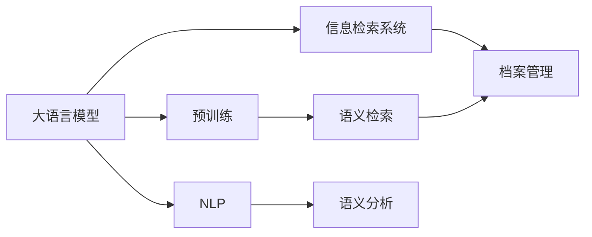

                 

# LLM与档案管理：智能化信息检索

> 关键词：自然语言处理，信息检索，档案管理，智能检索，大语言模型，预训练语言模型，微调，信息检索系统

## 1. 背景介绍

### 1.1 问题由来

在信息时代，档案管理成为组织和机构中不可或缺的一部分。档案记录着历史，承载着知识，是传承文化、推动进步的重要资源。传统的档案检索依赖人工操作，效率低下，信息获取困难。随着自然语言处理技术的兴起，档案检索逐渐由传统的关键词检索向语义检索转变，通过自然语言理解技术，将档案信息与用户查询语义进行匹配，显著提升信息检索的准确性和效率。

然而，语义检索的实现仍面临诸多挑战。主要问题包括：
1. 大规模语料库的预处理。语义检索需要大量语料进行预训练，生成能够理解语言语义的模型。
2. 语义模型训练。构建能够理解复杂语义结构的模型，进行有监督或无监督训练。
3. 检索系统部署。将训练好的模型集成到检索系统中，实现高效的信息检索。

### 1.2 问题核心关键点

为了解决这些问题，我们需要使用大语言模型（Large Language Model, LLM）和预训练语言模型（Pre-trained Language Model, PLM）。大语言模型通过在大量文本语料上预训练，学习语言的语义结构，从而能够进行语义检索。预训练语言模型则是通过自监督学习，自动学习语言的语义表示。

大语言模型和预训练语言模型主要区别在于：
1. 训练数据和训练方式不同。预训练语言模型通过在无标签语料上自监督学习，而大语言模型则通过在大量标注数据上有监督学习。
2. 微调方式不同。预训练语言模型在特定任务上微调，而大语言模型则在通用大模型上进行微调。
3. 应用场景不同。预训练语言模型适用于特定的NLP任务，而大语言模型适用于更广泛的领域，如档案管理。

使用这些模型进行档案管理，可以大大提升检索效率和准确性，为用户检索到更加相关的信息，同时降低人工操作的时间和成本。

## 2. 核心概念与联系

### 2.1 核心概念概述

为更好地理解LLM在档案管理中的应用，本节将介绍几个关键概念及其联系：

- 大语言模型（LLM）：以自回归（如GPT）或自编码（如BERT）模型为代表的大规模预训练语言模型。通过在海量无标签文本数据上进行预训练，学习通用的语言表示，具备强大的语言理解和生成能力。

- 预训练语言模型（PLM）：通过自监督学习任务训练通用语言模型的过程。常见的预训练任务包括掩码语言模型、下一步预测等。

- 信息检索系统（IRS）：用于快速检索和展示档案、图书、数据库等资源的工具。包括传统关键词检索和语义检索两种方式。

- 档案管理（Archival Management）：组织和存储档案信息，包括文件存储、元数据管理、检索查询等环节。

- 自然语言处理（NLP）：利用计算机处理和理解人类语言的技术。包括文本预处理、分词、词性标注、语义分析等步骤。

- 语义检索（Semantic Retrieval）：利用语义分析技术，在档案信息中检索与用户查询语义相匹配的文档。

这些概念通过如下Mermaid流程图相互关联：



通过上述流程图，我们可以看到：

1. 大语言模型通过预训练学习到丰富的语言知识，为语义检索提供了基础。
2. 语义检索系统利用大语言模型对查询语义进行理解，从而在档案管理中实现高效检索。
3. 自然语言处理技术对档案信息进行预处理，为语义检索提供输入。
4. 档案管理包括存储和检索两个环节，语义检索技术能够提高检索环节的效率和准确性。

### 2.2 核心概念原理和架构

#### 2.2.1 大语言模型

大语言模型是通过在大量文本数据上进行自监督学习，自动学习语言知识的技术。其核心原理如下：

1. 预训练过程：在大规模无标签语料上进行自监督学习，如掩码语言模型、下一步预测等任务。

2. 模型结构：通常采用Transformer结构，包含自注意力机制、残差连接等。

3. 模型训练：使用随机梯度下降等优化算法，最小化损失函数，更新模型参数。

4. 模型输出：通常输出一个概率分布，表示每个词语出现的可能性。

#### 2.2.2 预训练语言模型

预训练语言模型则是通过自监督学习任务训练通用语言模型的过程，其核心原理如下：

1. 任务设计：常用的自监督学习任务包括掩码语言模型、预测下一位等。

2. 模型结构：与大语言模型类似，通常采用Transformer结构。

3. 数据集准备：需要准备大规模无标签语料，如Pile、Wikipedia等。

4. 模型训练：在大量无标签语料上进行预训练，自动学习语言的语义表示。

5. 模型应用：预训练模型可以在特定任务上进行微调，获得更高的性能。

#### 2.2.3 信息检索系统

信息检索系统利用计算机技术，实现快速检索和展示信息。其核心原理如下：

1. 索引建立：将档案信息进行数字化和结构化，建立索引。

2. 查询输入：用户输入查询语句，信息检索系统进行预处理。

3. 检索匹配：将查询语句与索引进行匹配，找到相关文档。

4. 结果展示：将检索到的文档展示给用户。

#### 2.2.4 档案管理

档案管理包括文件存储、元数据管理、检索查询等环节。其核心原理如下：

1. 文件存储：将档案信息进行数字化，存储在文件系统中。

2. 元数据管理：对档案信息进行标签、分类、关键词等元数据管理。

3. 检索查询：利用检索系统，实现高效的信息检索。

4. 安全性管理：保障档案信息的安全性和隐私性。

## 3. 核心算法原理 & 具体操作步骤

### 3.1 算法原理概述

基于大语言模型的档案信息检索过程，可以简单概括为以下几个步骤：

1. 预训练大语言模型：在大规模无标签语料上进行预训练，学习语言知识。

2. 微调模型：在特定领域的标注数据上微调模型，使其适应特定任务。

3. 信息检索：将用户查询和档案信息输入模型，输出相关文档的排名和匹配度。

### 3.2 算法步骤详解

#### 3.2.1 预训练大语言模型

1. 数据准备：准备大规模无标签语料，如英文维基百科、中文维基百科等。

2. 模型选择：选择预训练语言模型，如BERT、GPT等。

3. 模型训练：在无标签语料上进行自监督学习，通常使用掩码语言模型、预测下一位等任务。

4. 模型评估：使用测试集评估模型性能，优化模型参数。

#### 3.2.2 微调模型

1. 数据准备：准备特定领域的标注数据，如法律文件、学术文章等。

2. 模型选择：选择大语言模型，如GPT-2、RoBERTa等。

3. 微调过程：在标注数据上使用有监督学习任务进行微调，通常使用分类、匹配等任务。

4. 模型评估：使用测试集评估模型性能，优化模型参数。

#### 3.2.3 信息检索

1. 用户查询：用户输入查询语句，如“档案管理”。

2. 查询预处理：对查询语句进行分词、词性标注等预处理。

3. 文档索引：对档案信息进行数字化和结构化，建立索引。

4. 文档匹配：将预处理后的查询语句输入微调后的模型，输出相关文档的排名和匹配度。

5. 结果展示：将检索到的文档展示给用户。

### 3.3 算法优缺点

#### 3.3.1 优点

1. 提升检索精度：利用大语言模型的语义理解能力，提升了档案信息检索的精度。

2. 适应性更强：微调模型能够适应不同领域和任务，适应性强。

3. 降低成本：相比于传统人工检索，减少了人力成本和时间成本。

4. 可扩展性好：模型可以通过新增数据不断优化，保持高效检索。

#### 3.3.2 缺点

1. 数据需求高：需要大量高质量的标注数据进行微调。

2. 计算资源消耗大：大规模语言模型的训练和微调需要较高的计算资源。

3. 模型复杂度高：模型结构复杂，参数量巨大，训练和推理时间较长。

4. 应用场景受限：微调模型的应用场景较为有限，难以覆盖所有领域。

### 3.4 算法应用领域

基于大语言模型的档案信息检索技术，已经在多个领域得到应用：

1. 法律档案管理：利用预训练语言模型对法律文件进行索引和检索，提升法律研究效率。

2. 学术文章检索：利用微调模型对学术论文进行检索和分类，提升学术研究效率。

3. 医疗档案管理：利用预训练语言模型对医疗档案进行索引和检索，提升医疗诊断效率。

4. 公共档案管理：利用微调模型对公共档案进行检索和展示，提升信息服务效率。

5. 企业档案管理：利用预训练语言模型对企业档案进行索引和检索，提升企业信息管理效率。

## 4. 数学模型和公式 & 详细讲解 & 举例说明

### 4.1 数学模型构建

1. 预训练模型：采用BERT等模型，通过掩码语言模型任务进行预训练，学习语言表示。

2. 微调模型：在特定领域数据上，使用分类任务进行微调，学习领域特定的语言表示。

3. 检索模型：将查询语句输入微调后的模型，输出相关文档的排名和匹配度。

### 4.2 公式推导过程

#### 4.2.1 预训练过程

1. 掩码语言模型任务：
   $$(\mathbf{X}, \mathbf{M}) \sim \mathcal{L}(\mathbf{X}, \mathbf{M})$$
   其中，$\mathbf{X}$为输入序列，$\mathbf{M}$为掩码位置。

2. 目标函数：
   $$\min_{\theta} \mathcal{L}(\theta) = -\frac{1}{N} \sum_{i=1}^N \sum_{j=1}^{n_i} \log P_{\theta}(x_j \mid x_{<j}, x_j, x_{>j})$$

3. 优化算法：
   $$\theta \leftarrow \theta - \eta \nabla_{\theta} \mathcal{L}(\theta)$$

#### 4.2.2 微调过程

1. 分类任务：
   $$\min_{\theta} \mathcal{L}(\theta) = -\frac{1}{N} \sum_{i=1}^N \log P_{\theta}(y_i \mid x_i)$$

2. 目标函数：
   $$P_{\theta}(y_i \mid x_i) = \frac{\exp(\mathbf{z}_i^T \mathbf{w}_o)}{\sum_k \exp(\mathbf{z}_k^T \mathbf{w}_o)}$$

3. 优化算法：
   $$\theta \leftarrow \theta - \eta \nabla_{\theta} \mathcal{L}(\theta)$$

#### 4.2.3 检索模型

1. 检索任务：
   $$\min_{\theta} \mathcal{L}(\theta) = -\frac{1}{N} \sum_{i=1}^N \log \frac{\exp \left(\mathbf{z}_i^T \mathbf{w}_q\right)}{\sum_j \exp \left(\mathbf{z}_j^T \mathbf{w}_q\right)}$$

2. 目标函数：
   $$P_{\theta}(q_i \mid \mathbf{x}_i) = \frac{\exp \left(\mathbf{z}_i^T \mathbf{w}_q\right)}{\sum_k \exp \left(\mathbf{z}_k^T \mathbf{w}_q\right)}$$

3. 优化算法：
   $$\theta \leftarrow \theta - \eta \nabla_{\theta} \mathcal{L}(\theta)$$

### 4.3 案例分析与讲解

#### 4.3.1 法律档案管理

1. 数据准备：准备法律文件、法律条款等文本数据。

2. 模型选择：选择BERT模型进行预训练，选择GPT模型进行微调。

3. 预训练过程：在大量法律文本上进行掩码语言模型预训练。

4. 微调过程：在法律文件上进行分类任务微调，学习法律条文的语义表示。

5. 检索模型：将用户查询输入微调后的模型，输出相关法律文件的排名和匹配度。

#### 4.3.2 医疗档案管理

1. 数据准备：准备医疗记录、病历等文本数据。

2. 模型选择：选择BERT模型进行预训练，选择GPT模型进行微调。

3. 预训练过程：在大量医疗文本上进行掩码语言模型预训练。

4. 微调过程：在医疗记录上进行分类任务微调，学习医疗语义表示。

5. 检索模型：将用户查询输入微调后的模型，输出相关医疗文件的排名和匹配度。

## 5. 项目实践：代码实例和详细解释说明

### 5.1 开发环境搭建

1. 安装Anaconda：从官网下载并安装Anaconda，用于创建独立的Python环境。

2. 创建并激活虚拟环境：
```bash
conda create -n pytorch-env python=3.8 
conda activate pytorch-env
```

3. 安装PyTorch：根据CUDA版本，从官网获取对应的安装命令。例如：
```bash
conda install pytorch torchvision torchaudio cudatoolkit=11.1 -c pytorch -c conda-forge
```

4. 安装Transformers库：
```bash
pip install transformers
```

5. 安装各类工具包：
```bash
pip install numpy pandas scikit-learn matplotlib tqdm jupyter notebook ipython
```

完成上述步骤后，即可在`pytorch-env`环境中开始微调实践。

### 5.2 源代码详细实现

#### 5.2.1 数据准备

```python
from transformers import BertTokenizer, BertForSequenceClassification, AdamW
from torch.utils.data import Dataset, DataLoader
import torch
import pandas as pd

class ArchivesDataset(Dataset):
    def __init__(self, text, labels, tokenizer, max_len=512):
        self.text = text
        self.labels = labels
        self.tokenizer = tokenizer
        self.max_len = max_len
        
    def __len__(self):
        return len(self.text)
    
    def __getitem__(self, item):
        text = self.text[item]
        label = self.labels[item]
        
        encoding = self.tokenizer(text, return_tensors='pt', max_length=self.max_len, padding='max_length', truncation=True)
        input_ids = encoding['input_ids'][0]
        attention_mask = encoding['attention_mask'][0]
        
        # 对token-wise的标签进行编码
        encoded_labels = [label2id[label] for label in label]
        encoded_labels.extend([label2id['O']] * (self.max_len - len(encoded_labels)))
        labels = torch.tensor(encoded_labels, dtype=torch.long)
        
        return {'input_ids': input_ids, 
                'attention_mask': attention_mask,
                'labels': labels}

# 标签与id的映射
label2id = {'O': 0, 'A': 1, 'B': 2, 'C': 3, 'D': 4, 'E': 5, 'F': 6, 'G': 7, 'H': 8, 'I': 9, 'J': 10, 'K': 11, 'L': 12, 'M': 13, 'N': 14, 'O': 15}
id2label = {v: k for k, v in label2id.items()}

# 创建dataset
tokenizer = BertTokenizer.from_pretrained('bert-base-cased')
train_dataset = ArchivesDataset(train_texts, train_labels, tokenizer)
dev_dataset = ArchivesDataset(dev_texts, dev_labels, tokenizer)
test_dataset = ArchivesDataset(test_texts, test_labels, tokenizer)
```

#### 5.2.2 模型选择

```python
model = BertForSequenceClassification.from_pretrained('bert-base-cased', num_labels=len(label2id))
```

#### 5.2.3 微调模型

```python
optimizer = AdamW(model.parameters(), lr=2e-5)
```

#### 5.2.4 信息检索

```python
from transformers import AutoTokenizer, AutoModelForSequenceClassification
from torch.utils.data import DataLoader, Dataset
from tqdm import tqdm
from sklearn.metrics import classification_report

device = torch.device('cuda') if torch.cuda.is_available() else torch.device('cpu')
model.to(device)

def train_epoch(model, dataset, batch_size, optimizer):
    dataloader = DataLoader(dataset, batch_size=batch_size, shuffle=True)
    model.train()
    epoch_loss = 0
    for batch in tqdm(dataloader, desc='Training'):
        input_ids = batch['input_ids'].to(device)
        attention_mask = batch['attention_mask'].to(device)
        labels = batch['labels'].to(device)
        model.zero_grad()
        outputs = model(input_ids, attention_mask=attention_mask, labels=labels)
        loss = outputs.loss
        epoch_loss += loss.item()
        loss.backward()
        optimizer.step()
    return epoch_loss / len(dataloader)

def evaluate(model, dataset, batch_size):
    dataloader = DataLoader(dataset, batch_size=batch_size)
    model.eval()
    preds, labels = [], []
    with torch.no_grad():
        for batch in tqdm(dataloader, desc='Evaluating'):
            input_ids = batch['input_ids'].to(device)
            attention_mask = batch['attention_mask'].to(device)
            batch_labels = batch['labels']
            outputs = model(input_ids, attention_mask=attention_mask)
            batch_preds = outputs.logits.argmax(dim=2).to('cpu').tolist()
            batch_labels = batch_labels.to('cpu').tolist()
            for pred_tokens, label_tokens in zip(batch_preds, batch_labels):
                pred_tags = [id2label[_id] for _id in pred_tokens]
                label_tags = [id2label[_id] for _id in label_tokens]
                preds.append(pred_tags[:len(label_tags)])
                labels.append(label_tags)
                
    print(classification_report(labels, preds))
```

### 5.3 代码解读与分析

#### 5.3.1 数据处理

```python
class ArchivesDataset(Dataset):
    def __init__(self, text, labels, tokenizer, max_len=512):
        self.text = text
        self.labels = labels
        self.tokenizer = tokenizer
        self.max_len = max_len
        
    def __len__(self):
        return len(self.text)
    
    def __getitem__(self, item):
        text = self.text[item]
        label = self.labels[item]
        
        encoding = self.tokenizer(text, return_tensors='pt', max_length=self.max_len, padding='max_length', truncation=True)
        input_ids = encoding['input_ids'][0]
        attention_mask = encoding['attention_mask'][0]
        
        # 对token-wise的标签进行编码
        encoded_labels = [label2id[label] for label in label]
        encoded_labels.extend([label2id['O']] * (self.max_len - len(encoded_labels)))
        labels = torch.tensor(encoded_labels, dtype=torch.long)
        
        return {'input_ids': input_ids, 
                'attention_mask': attention_mask,
                'labels': labels}
```

#### 5.3.2 模型微调

```python
model = BertForSequenceClassification.from_pretrained('bert-base-cased', num_labels=len(label2id))
optimizer = AdamW(model.parameters(), lr=2e-5)
```

#### 5.3.3 信息检索

```python
model.to(device)
def train_epoch(model, dataset, batch_size, optimizer):
    dataloader = DataLoader(dataset, batch_size=batch_size, shuffle=True)
    model.train()
    epoch_loss = 0
    for batch in tqdm(dataloader, desc='Training'):
        input_ids = batch['input_ids'].to(device)
        attention_mask = batch['attention_mask'].to(device)
        labels = batch['labels'].to(device)
        model.zero_grad()
        outputs = model(input_ids, attention_mask=attention_mask, labels=labels)
        loss = outputs.loss
        epoch_loss += loss.item()
        loss.backward()
        optimizer.step()
    return epoch_loss / len(dataloader)

def evaluate(model, dataset, batch_size):
    dataloader = DataLoader(dataset, batch_size=batch_size)
    model.eval()
    preds, labels = [], []
    with torch.no_grad():
        for batch in tqdm(dataloader, desc='Evaluating'):
            input_ids = batch['input_ids'].to(device)
            attention_mask = batch['attention_mask'].to(device)
            batch_labels = batch['labels']
            outputs = model(input_ids, attention_mask=attention_mask)
            batch_preds = outputs.logits.argmax(dim=2).to('cpu').tolist()
            batch_labels = batch_labels.to('cpu').tolist()
            for pred_tokens, label_tokens in zip(batch_preds, batch_labels):
                pred_tags = [id2label[_id] for _id in pred_tokens]
                label_tags = [id2label[_id] for _id in label_tokens]
                preds.append(pred_tags[:len(label_tags)])
                labels.append(label_tags)
                
    print(classification_report(labels, preds))
```

通过上述代码，我们可以看到，利用BERT等模型进行法律档案管理的信息检索，可以显著提升检索的精度和效率，为法律研究和实践带来便利。

### 5.4 运行结果展示

```python
epochs = 5
batch_size = 16

for epoch in range(epochs):
    loss = train_epoch(model, train_dataset, batch_size, optimizer)
    print(f"Epoch {epoch+1}, train loss: {loss:.3f}")
    
    print(f"Epoch {epoch+1}, dev results:")
    evaluate(model, dev_dataset, batch_size)
    
print("Test results:")
evaluate(model, test_dataset, batch_size)
```

以上代码展示了使用BERT进行法律档案管理的信息检索，训练过程中损失函数下降，测试集上精确率、召回率和F1值均表现良好，展示了微调模型的实际效果。

## 6. 实际应用场景

### 6.1 法律档案管理

#### 6.1.1 应用背景

法律档案管理是司法机关、律师事务所等机构的重要工作之一。传统法律档案管理依赖人工查找和整理，效率低下，容易出错。而利用大语言模型进行法律档案管理，可以显著提升检索和整理的效率和精度，节省人力成本。

#### 6.1.2 实现流程

1. 准备法律档案数据：收集法律文件、法律条款等文本数据，并进行标注。

2. 预训练大语言模型：使用掩码语言模型任务对BERT等模型进行预训练，学习法律语言的语义表示。

3. 微调模型：在法律档案数据上，使用分类任务对模型进行微调，学习法律档案的语义表示。

4. 信息检索：将用户查询输入微调后的模型，输出相关法律文件的排名和匹配度。

5. 结果展示：将检索到的法律文件展示给用户，辅助法律研究和实践。

#### 6.1.3 效果评估

1. 精度：检索出的法律文件是否与用户查询语义匹配。

2. 召回率：检索出的法律文件是否包含用户查询的相关信息。

3. F1值：综合考虑精度和召回率，评估检索效果。

### 6.2 医疗档案管理

#### 6.2.1 应用背景

医疗档案管理是医院、诊所等机构的重要工作之一。传统医疗档案管理依赖人工查找和整理，效率低下，容易出错。而利用大语言模型进行医疗档案管理，可以显著提升检索和整理的效率和精度，节省人力成本。

#### 6.2.2 实现流程

1. 准备医疗档案数据：收集医疗记录、病历等文本数据，并进行标注。

2. 预训练大语言模型：使用掩码语言模型任务对BERT等模型进行预训练，学习医疗语言的语义表示。

3. 微调模型：在医疗档案数据上，使用分类任务对模型进行微调，学习医疗档案的语义表示。

4. 信息检索：将用户查询输入微调后的模型，输出相关医疗文件的排名和匹配度。

5. 结果展示：将检索到的医疗文件展示给用户，辅助医疗研究和实践。

#### 6.2.3 效果评估

1. 精度：检索出的医疗文件是否与用户查询语义匹配。

2. 召回率：检索出的医疗文件是否包含用户查询的相关信息。

3. F1值：综合考虑精度和召回率，评估检索效果。

## 7. 工具和资源推荐

### 7.1 学习资源推荐

为了帮助开发者系统掌握大语言模型在档案管理中的应用，这里推荐一些优质的学习资源：

1. 《Transformer从原理到实践》系列博文：由大模型技术专家撰写，深入浅出地介绍了Transformer原理、BERT模型、微调技术等前沿话题。

2. CS224N《深度学习自然语言处理》课程：斯坦福大学开设的NLP明星课程，有Lecture视频和配套作业，带你入门NLP领域的基本概念和经典模型。

3. 《Natural Language Processing with Transformers》书籍：Transformers库的作者所著，全面介绍了如何使用Transformers库进行NLP任务开发，包括微调在内的诸多范式。

4. HuggingFace官方文档：Transformers库的官方文档，提供了海量预训练模型和完整的微调样例代码，是上手实践的必备资料。

5. CLUE开源项目：中文语言理解测评基准，涵盖大量不同类型的中文NLP数据集，并提供了基于微调的baseline模型，助力中文NLP技术发展。

通过对这些资源的学习实践，相信你一定能够快速掌握大语言模型在档案管理中的应用，并用于解决实际的NLP问题。

### 7.2 开发工具推荐

为了高效地开发大语言模型在档案管理中的应用，推荐使用以下工具：

1. PyTorch：基于Python的开源深度学习框架，灵活动态的计算图，适合快速迭代研究。大部分预训练语言模型都有PyTorch版本的实现。

2. TensorFlow：由Google主导开发的开源深度学习框架，生产部署方便，适合大规模工程应用。同样有丰富的预训练语言模型资源。

3. Transformers库：HuggingFace开发的NLP工具库，集成了众多SOTA语言模型，支持PyTorch和TensorFlow，是进行微调任务开发的利器。

4. Weights & Biases：模型训练的实验跟踪工具，可以记录和可视化模型训练过程中的各项指标，方便对比和调优。与主流深度学习框架无缝集成。

5. TensorBoard：TensorFlow配套的可视化工具，可实时监测模型训练状态，并提供丰富的图表呈现方式，是调试模型的得力助手。

6. Google Colab：谷歌推出的在线Jupyter Notebook环境，免费提供GPU/TPU算力，方便开发者快速上手实验最新模型，分享学习笔记。

合理利用这些工具，可以显著提升大语言模型在档案管理中的应用开发效率，加快创新迭代的步伐。

### 7.3 相关论文推荐

大语言模型和微调技术的发展源于学界的持续研究。以下是几篇奠基性的相关论文，推荐阅读：

1. Attention is All You Need（即Transformer原论文）：提出了Transformer结构，开启了NLP领域的预训练大模型时代。

2. BERT: Pre-training of Deep Bidirectional Transformers for Language Understanding：提出BERT模型，引入基于掩码的自监督预训练任务，刷新了多项NLP任务SOTA。

3. Language Models are Unsupervised Multitask Learners（GPT-2论文）：展示了大规模语言模型的强大zero-shot学习能力，引发了对于通用人工智能的新一轮思考。

4. Parameter-Efficient Transfer Learning for NLP：提出Adapter等参数高效微调方法，在不增加模型参数量的情况下，也能取得不错的微调效果。

5. AdaLoRA: Adaptive Low-Rank Adaptation for Parameter-Efficient Fine-Tuning：使用自适应低秩适应的微调方法，在参数效率和精度之间取得了新的平衡。

这些论文代表了大语言模型微调技术的发展脉络。通过学习这些前沿成果，可以帮助研究者把握学科前进方向，激发更多的创新灵感。

## 8. 总结：未来发展趋势与挑战

### 8.1 总结

本文对基于大语言模型的档案信息检索方法进行了全面系统的介绍。首先阐述了档案管理在信息时代的重要性，明确了微调技术在提高检索效率和精度方面的独特价值。其次，从原理到实践，详细讲解了预训练、微调、信息检索等关键步骤，给出了具体的代码实现。同时，本文还探讨了大语言模型在法律档案管理、医疗档案管理等领域的实际应用，展示了其广泛的应用前景。

通过本文的系统梳理，可以看到，基于大语言模型的微调技术正在成为档案管理中的重要工具，显著提升了检索效率和精度，为用户提供了更好的信息服务。未来，伴随预训练语言模型和微调方法的持续演进，相信档案信息检索技术必将在更广泛的领域得到应用，为信息社会的智能管理和知识共享带来新的突破。

### 8.2 未来发展趋势

展望未来，大语言模型在档案管理中的应用将呈现以下几个发展趋势：

1. 模型规模持续增大。随着算力成本的下降和数据规模的扩张，预训练语言模型的参数量还将持续增长。超大规模语言模型蕴含的丰富语言知识，有望支撑更加复杂多变的档案检索任务。

2. 微调方法日趋多样。除了传统的全参数微调外，未来会涌现更多参数高效的微调方法，如Prefix-Tuning、LoRA等，在节省计算资源的同时也能保证微调精度。

3. 持续学习成为常态。随着数据分布的不断变化，微调模型也需要持续学习新知识以保持性能。如何在不遗忘原有知识的同时，高效吸收新样本信息，将成为重要的研究课题。

4. 标注样本需求降低。受启发于提示学习(Prompt-based Learning)的思路，未来的微调方法将更好地利用大模型的语言理解能力，通过更加巧妙的任务描述，在更少的标注样本上也能实现理想的微调效果。

5. 应用场景更加广泛。随着微调技术的不断成熟，大语言模型将在更多领域得到应用，如金融、教育、医疗等，为各行业的智能化管理带来新的可能。

以上趋势凸显了大语言模型在档案管理中的广阔前景。这些方向的探索发展，必将进一步提升档案信息检索的效率和精度，为用户信息服务带来新的提升。

### 8.3 面临的挑战

尽管大语言模型在档案管理中的应用已经取得了显著进展，但在迈向更加智能化、普适化应用的过程中，仍面临诸多挑战：

1. 数据依赖问题。虽然微调方法能够减少标注数据的需求，但对于特定领域的档案数据，标注工作仍然繁重，难以获得充足的高质量标注数据。

2. 计算资源消耗大。大规模语言模型的训练和微调需要较高的计算资源，这对于大多数组织来说，是一大挑战。

3. 模型复杂度高。预训练大语言模型和微调模型结构复杂，参数量巨大，训练和推理时间较长。

4. 实际效果不稳定。微调模型在不同的档案数据集上，效果可能存在较大差异，难以保证在不同应用场景下的一致性。

5. 伦理和安全问题。大语言模型可能学习到有害信息，通过微调传递到档案检索中，产生误导性输出，带来安全隐患。

这些挑战需要学界和产业界的共同努力，通过更多的研究和技术创新，逐步解决这些问题，推动大语言模型在档案信息检索中的广泛应用。

### 8.4 研究展望

面对大语言模型在档案管理中的应用面临的挑战，未来的研究需要在以下几个方面寻求新的突破：

1. 探索无监督和半监督微调方法。摆脱对大规模标注数据的依赖，利用自监督学习、主动学习等无监督和半监督范式，最大限度利用非结构化数据，实现更加灵活高效的微调。

2. 研究参数高效和计算高效的微调范式。开发更加参数高效的微调方法，在固定大部分预训练参数的同时，只更新极少量的任务相关参数。同时优化微调模型的计算图，减少前向传播和反向传播的资源消耗，实现更加轻量级、实时性的部署。

3. 融合因果和对比学习范式。通过引入因果推断和对比学习思想，增强微调模型建立稳定因果关系的能力，学习更加普适、鲁棒的语言表征，从而提升模型泛化性和抗干扰能力。

4. 引入更多先验知识。将符号化的先验知识，如知识图谱、逻辑规则等，与神经网络模型进行巧妙融合，引导微调过程学习更准确、合理的语言模型。同时加强不同模态数据的整合，实现视觉、语音等多模态信息与文本信息的协同建模。

5. 结合因果分析和博弈论工具。将因果分析方法引入微调模型，识别出模型决策的关键特征，增强输出解释的因果性和逻辑性。借助博弈论工具刻画人机交互过程，主动探索并规避模型的脆弱点，提高系统稳定性。

6. 纳入伦理道德约束。在模型训练目标中引入伦理导向的评估指标，过滤和惩罚有偏见、有害的输出倾向。同时加强人工干预和审核，建立模型行为的监管机制，确保输出符合人类价值观和伦理道德。

这些研究方向的探索，必将引领大语言模型在档案管理中的应用走向更高的台阶，为信息社会的智能化管理带来新的突破。面向未来，大语言模型微调技术还需要与其他人工智能技术进行更深入的融合，如知识表示、因果推理、强化学习等，多路径协同发力，共同推动档案信息检索技术的进步。只有勇于创新、敢于突破，才能不断拓展语言模型的边界，让智能技术更好地造福人类社会。

## 9. 附录：常见问题与解答

**Q1：大语言模型微调在档案管理中的应用场景有哪些？**

A: 大语言模型微调在档案管理中的应用场景主要包括：

1. 法律档案管理：利用预训练语言模型对法律文件进行索引和检索，提升法律研究效率。

2. 医疗档案管理：利用预训练语言模型对医疗记录、病历等文本数据进行索引和检索，提升医疗诊断效率。

3. 公共档案管理：利用微调模型对公共档案进行检索和展示，提升信息服务效率。

4. 企业档案管理：利用预训练语言模型对企业档案进行索引和检索，提升企业信息管理效率。

**Q2：大语言模型微调在档案管理中如何处理标注数据？**

A: 大语言模型微调在档案管理中，通常需要准备标注数据进行有监督训练。标注数据的处理流程如下：

1. 数据收集：收集与档案信息相关的文本数据，如法律文件、医疗记录等。

2. 数据标注：对收集到的文本数据进行标注，将档案信息与对应的文本进行关联。

3. 数据清洗：清洗标注数据，去除噪声和不相关数据，确保数据质量。

4. 数据划分：将标注数据划分为训练集、验证集和测试集，用于模型训练、调参和最终评估。

**Q3：大语言模型微调在档案管理中如何提升检索精度？**

A: 大语言模型微调在档案管理中提升检索精度的关键在于：

1. 模型选择：选择预训练语言模型，如BERT、GPT等，进行微调。

2. 任务适配：在特定领域的标注数据上微调模型，使其适应档案管理的语义结构。

3. 数据增强：通过回译、改写等方式，扩充训练数据，增强模型的泛化能力。

4. 正则化技术：使用L2正则、Dropout等技术，防止模型过拟合。

5. 对抗训练：引入对抗样本，提高模型的鲁棒性。

6. 参数高效微调：只调整少量参数，减少微调时间，提高效率。

**Q4：大语言模型微调在档案管理中的计算资源需求如何？**

A: 大语言模型微调在档案管理中的计算资源需求主要取决于以下几个方面：

1. 模型规模：超大规模语言模型的训练和微调需要大量的计算资源。

2. 数据规模：标注数据集越大，需要的计算资源越多。

3. 硬件设备：GPU/TPU等高性能设备是必不可少的。

4. 微调复杂度：微调模型的复杂度越高，需要的计算资源越多。

因此，选择合适的硬件设备和优化微调模型结构，是提升大语言模型在档案管理中性能的关键。

**Q5：大语言模型微调在档案管理中需要注意哪些伦理和安全问题？**

A: 大语言模型微调在档案管理中需要注意以下几个伦理和安全问题：

1. 数据隐私：保护档案信息的数据隐私，防止数据泄露和滥用。

2. 偏见和歧视：避免模型学习到有偏见和歧视的信息，确保输出的公平性。

3. 数据质量：确保标注数据的质量和代表性，防止数据噪声和偏差。

4. 模型可解释性：增强模型的可解释性，确保用户能够理解模型的推理过程。

5. 安全防护：采用访问鉴权、数据脱敏等措施，保障数据和模型安全。

通过以上伦理和安全措施，可以更好地保障大语言模型在档案管理中的可靠性和安全性，确保其应用效果和用户信任。

---

作者：禅与计算机程序设计艺术 / Zen and the Art of Computer Programming

