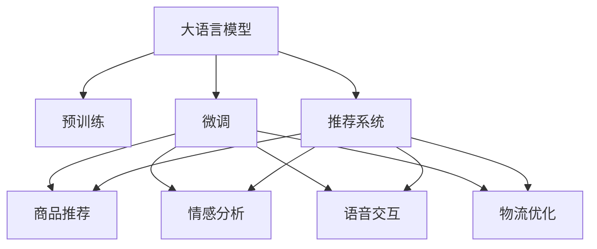

                 

# LLM与电子商务：重塑在线购物体验

> 关键词：大语言模型,电子商务,在线购物,用户体验,推荐系统,情感分析,语音交互,物流优化

## 1. 背景介绍

### 1.1 问题由来

随着电子商务的迅猛发展，消费者在线购物的体验也成为了商家关注的焦点。传统电商网站通过搜索引擎、商品描述、用户评价等方式，努力提高用户满意度和转化率。然而，这种方式存在诸多局限性：

- **搜索效率低**：用户需要手动输入关键词，才能找到相关商品，存在搜索结果不精准、耗时耗力的问题。
- **信息量大**：商品信息过载，用户难以从海量信息中筛选出最合适的商品。
- **互动性不足**：用户无法直观地与商品进行互动，体验感较差。
- **物流问题复杂**：物流配送的实时性和准确性对用户满意度影响巨大，但传统电商平台往往难以实时更新物流信息。

为了解决这些问题，电商平台逐渐引入了一系列先进的AI技术，以提升用户体验和运营效率。其中，大语言模型（Large Language Model, LLM）技术以其强大的自然语言处理能力，在提升电商平台的互动性、推荐精准性和物流优化等方面展现了巨大的潜力。

### 1.2 问题核心关键点

大语言模型在电子商务中的应用，主要体现在以下几个方面：

1. **聊天机器人**：通过大语言模型驱动的智能客服，可以24小时提供个性化问答服务，快速解答用户问题。
2. **商品推荐**：利用大语言模型的预训练能力，结合用户行为数据，生成个性化推荐，提升用户购物体验。
3. **情感分析**：通过分析用户评论和反馈，了解用户情感倾向，及时调整营销策略，优化用户满意度。
4. **语音交互**：将大语言模型与语音识别技术结合，实现语音搜索和语音下单，提高用户操作便利性。
5. **物流优化**：通过分析用户物流信息，预测配送时间和路线，优化物流资源配置，提高配送效率。

这些应用场景的大规模落地，不仅提升了电商平台的运营效率，也极大地改善了用户购物体验。然而，如何有效地利用大语言模型，在电商环境中发挥其最大效能，仍需深入研究和实践。

## 2. 核心概念与联系

### 2.1 核心概念概述

为更好地理解大语言模型在电子商务中的应用，本节将介绍几个密切相关的核心概念：

- **大语言模型(Large Language Model, LLM)**：一种基于Transformer架构的深度神经网络，通过大规模无标签文本数据进行预训练，具备强大的自然语言处理能力，可用于多种NLP任务。
- **预训练(Pre-training)**：指在大规模无标签文本语料上进行自监督学习，学习通用的语言表示。常见的预训练任务包括掩码语言模型、句子相似度计算等。
- **微调(Fine-tuning)**：指在预训练模型的基础上，使用特定任务的有标签数据进行有监督学习，优化模型在特定任务上的性能。
- **推荐系统(Recommender System)**：根据用户行为和偏好，推荐相关商品或内容，提升用户体验和转化率。
- **情感分析(Sentiment Analysis)**：通过分析文本中的情感倾向，了解用户情感状态，优化产品和服务。
- **语音交互(Voice Interaction)**：将语音识别和大语言模型结合，实现语音搜索和语音控制，提高用户操作便利性。
- **物流优化(Logistics Optimization)**：通过分析用户物流信息，预测配送时间和路线，优化物流资源配置，提高配送效率。

这些核心概念之间的逻辑关系可以通过以下Mermaid流程图来展示：



这个流程图展示了大语言模型在不同应用场景中的作用，以及它与其他核心概念的联系。

## 3. 核心算法原理 & 具体操作步骤
### 3.1 算法原理概述

大语言模型在电子商务中的应用，主要通过以下几个步骤实现：

1. **预训练**：在大规模无标签文本语料上进行自监督预训练，学习通用的语言表示。
2. **微调**：使用特定任务的有标签数据进行微调，优化模型在特定任务上的性能。
3. **任务适配**：根据具体任务设计任务适配层，实现模型的任务化。
4. **应用落地**：将微调后的模型应用到电商平台的各个环节，提升用户体验和运营效率。

### 3.2 算法步骤详解

以下详细介绍大语言模型在电子商务中的具体应用步骤：

**Step 1: 数据准备**
- 收集电商平台的商品描述、用户评论、行为数据、物流信息等，作为大语言模型预训练和微调的数据集。
- 对数据进行预处理，如分词、去噪、归一化等，确保数据质量。

**Step 2: 预训练模型选择与配置**
- 选择合适的预训练模型，如GPT、BERT等，并根据任务特点进行配置。
- 使用预训练模型对电商数据进行预训练，学习通用的语言表示。

**Step 3: 微调模型训练**
- 设计针对具体任务的任务适配层，如分类器、推荐器、情感分析器等。
- 将电商数据作为有标签数据集，对模型进行微调训练。
- 设置合适的超参数，如学习率、批大小、迭代轮数等。

**Step 4: 模型评估与优化**
- 在电商数据集上对微调后的模型进行评估，计算指标如准确率、召回率、F1值等。
- 根据评估结果，调整模型参数和训练策略，优化模型性能。

**Step 5: 应用部署与监控**
- 将优化后的模型部署到电商平台各个环节，如智能客服、商品推荐、情感分析、语音交互、物流优化等。
- 实时监控模型性能，收集反馈数据，持续优化模型。

### 3.3 算法优缺点

大语言模型在电子商务中的应用具有以下优点：

1. **自然语言处理能力强**：大语言模型能够理解和生成自然语言，提升电商平台的互动性和用户体验。
2. **个性化推荐精准**：通过分析用户行为数据，生成个性化推荐，提升用户转化率和满意度。
3. **情感分析精准**：通过情感分析，了解用户情感倾向，优化产品和服务。
4. **语音交互便利**：通过语音识别和大语言模型结合，实现语音搜索和语音控制，提高用户操作便利性。
5. **物流优化高效**：通过分析用户物流信息，优化配送时间和路线，提高配送效率。

同时，大语言模型在电商应用中也存在一些缺点：

1. **计算资源需求高**：大语言模型参数量大，计算资源需求高，需要高性能计算设备支持。
2. **数据隐私问题**：电商数据包含大量敏感信息，数据隐私和安全问题需要特别关注。
3. **模型复杂度高**：大语言模型结构复杂，训练和部署过程需要专业知识和技能。
4. **实时性问题**：模型推理速度较慢，实时性有待提高。
5. **模型泛化能力不足**：大语言模型在不同任务上的泛化能力有待进一步提升。

### 3.4 算法应用领域

大语言模型在电子商务中的应用领域非常广泛，涵盖以下几个方面：

1. **智能客服**：通过大语言模型驱动的智能客服，提供24小时不间断的个性化问答服务，提升用户体验。
2. **商品推荐**：利用大语言模型的预训练能力，结合用户行为数据，生成个性化推荐，提升用户转化率。
3. **情感分析**：通过分析用户评论和反馈，了解用户情感倾向，优化产品和服务。
4. **语音交互**：将大语言模型与语音识别技术结合，实现语音搜索和语音控制，提高用户操作便利性。
5. **物流优化**：通过分析用户物流信息，预测配送时间和路线，优化物流资源配置，提高配送效率。
6. **虚拟试穿**：利用大语言模型生成自然语言描述，配合虚拟试穿技术，提升用户的购物体验。
7. **商品生成**：通过大语言模型生成商品描述和广告文案，提升营销效果。

这些应用场景展示了大语言模型在电子商务中的巨大潜力，有望在未来进一步扩展其应用范围，提升电商平台的运营效率和用户满意度。

## 4. 数学模型和公式 & 详细讲解 & 举例说明
### 4.1 数学模型构建

本节将使用数学语言对大语言模型在电子商务中的应用进行更加严格的刻画。

记大语言模型为 $M_{\theta}$，其中 $\theta$ 为模型参数。假设电商数据集为 $D=\{(x_i,y_i)\}_{i=1}^N$，其中 $x_i$ 为商品描述、评论、行为数据等文本数据，$y_i$ 为对应标签，如商品类别、情感倾向等。

定义模型 $M_{\theta}$ 在数据样本 $(x,y)$ 上的损失函数为 $\ell(M_{\theta}(x),y)$，则在数据集 $D$ 上的经验风险为：

$$
\mathcal{L}(\theta) = \frac{1}{N} \sum_{i=1}^N \ell(M_{\theta}(x_i),y_i)
$$

微调的优化目标是最小化经验风险，即找到最优参数：

$$
\theta^* = \mathop{\arg\min}_{\theta} \mathcal{L}(\theta)
$$

在实践中，我们通常使用基于梯度的优化算法（如SGD、Adam等）来近似求解上述最优化问题。设 $\eta$ 为学习率，$\lambda$ 为正则化系数，则参数的更新公式为：

$$
\theta \leftarrow \theta - \eta \nabla_{\theta}\mathcal{L}(\theta) - \eta\lambda\theta
$$

其中 $\nabla_{\theta}\mathcal{L}(\theta)$ 为损失函数对参数 $\theta$ 的梯度，可通过反向传播算法高效计算。

### 4.2 公式推导过程

以下我们以情感分析任务为例，推导交叉熵损失函数及其梯度的计算公式。

假设模型 $M_{\theta}$ 在输入 $x$ 上的输出为 $\hat{y}=M_{\theta}(x) \in [0,1]$，表示样本属于正面情感的概率。真实标签 $y \in \{0,1\}$。则二分类交叉熵损失函数定义为：

$$
\ell(M_{\theta}(x),y) = -[y\log \hat{y} + (1-y)\log (1-\hat{y})]
$$

将其代入经验风险公式，得：

$$
\mathcal{L}(\theta) = -\frac{1}{N}\sum_{i=1}^N [y_i\log M_{\theta}(x_i)+(1-y_i)\log(1-M_{\theta}(x_i))]
$$

根据链式法则，损失函数对参数 $\theta_k$ 的梯度为：

$$
\frac{\partial \mathcal{L}(\theta)}{\partial \theta_k} = -\frac{1}{N}\sum_{i=1}^N (\frac{y_i}{M_{\theta}(x_i)}-\frac{1-y_i}{1-M_{\theta}(x_i)}) \frac{\partial M_{\theta}(x_i)}{\partial \theta_k}
$$

其中 $\frac{\partial M_{\theta}(x_i)}{\partial \theta_k}$ 可进一步递归展开，利用自动微分技术完成计算。

在得到损失函数的梯度后，即可带入参数更新公式，完成模型的迭代优化。重复上述过程直至收敛，最终得到适应电子商务任务的最优模型参数 $\theta^*$。

## 5. 项目实践：代码实例和详细解释说明
### 5.1 开发环境搭建

在进行电商应用开发前，我们需要准备好开发环境。以下是使用Python进行PyTorch开发的环境配置流程：

1. 安装Anaconda：从官网下载并安装Anaconda，用于创建独立的Python环境。

2. 创建并激活虚拟环境：
```bash
conda create -n ecommerce-env python=3.8 
conda activate ecommerce-env
```

3. 安装PyTorch：根据CUDA版本，从官网获取对应的安装命令。例如：
```bash
conda install pytorch torchvision torchaudio cudatoolkit=11.1 -c pytorch -c conda-forge
```

4. 安装HuggingFace Transformers库：
```bash
pip install transformers
```

5. 安装各类工具包：
```bash
pip install numpy pandas scikit-learn matplotlib tqdm jupyter notebook ipython
```

完成上述步骤后，即可在`ecommerce-env`环境中开始电商应用开发。

### 5.2 源代码详细实现

下面我们以情感分析任务为例，给出使用Transformers库对BERT模型进行电商情感分析的PyTorch代码实现。

首先，定义情感分析任务的数据处理函数：

```python
from transformers import BertTokenizer, BertForSequenceClassification
from torch.utils.data import Dataset
import torch

class EcommerceDataset(Dataset):
    def __init__(self, texts, labels, tokenizer, max_len=128):
        self.texts = texts
        self.labels = labels
        self.tokenizer = tokenizer
        self.max_len = max_len
        
    def __len__(self):
        return len(self.texts)
    
    def __getitem__(self, item):
        text = self.texts[item]
        label = self.labels[item]
        
        encoding = self.tokenizer(text, return_tensors='pt', max_length=self.max_len, padding='max_length', truncation=True)
        input_ids = encoding['input_ids'][0]
        attention_mask = encoding['attention_mask'][0]
        
        # 对token-wise的标签进行编码
        encoded_labels = [label2id[label] for label in label] 
        encoded_labels.extend([label2id['O']] * (self.max_len - len(encoded_labels)))
        labels = torch.tensor(encoded_labels, dtype=torch.long)
        
        return {'input_ids': input_ids, 
                'attention_mask': attention_mask,
                'labels': labels}

# 标签与id的映射
label2id = {'negative': 0, 'positive': 1}
id2label = {v: k for k, v in label2id.items()}

# 创建dataset
tokenizer = BertTokenizer.from_pretrained('bert-base-cased')

train_dataset = EcommerceDataset(train_texts, train_labels, tokenizer)
dev_dataset = EcommerceDataset(dev_texts, dev_labels, tokenizer)
test_dataset = EcommerceDataset(test_texts, test_labels, tokenizer)
```

然后，定义模型和优化器：

```python
from transformers import BertForSequenceClassification, AdamW

model = BertForSequenceClassification.from_pretrained('bert-base-cased', num_labels=len(label2id))

optimizer = AdamW(model.parameters(), lr=2e-5)
```

接着，定义训练和评估函数：

```python
from torch.utils.data import DataLoader
from tqdm import tqdm
from sklearn.metrics import classification_report

device = torch.device('cuda') if torch.cuda.is_available() else torch.device('cpu')
model.to(device)

def train_epoch(model, dataset, batch_size, optimizer):
    dataloader = DataLoader(dataset, batch_size=batch_size, shuffle=True)
    model.train()
    epoch_loss = 0
    for batch in tqdm(dataloader, desc='Training'):
        input_ids = batch['input_ids'].to(device)
        attention_mask = batch['attention_mask'].to(device)
        labels = batch['labels'].to(device)
        model.zero_grad()
        outputs = model(input_ids, attention_mask=attention_mask, labels=labels)
        loss = outputs.loss
        epoch_loss += loss.item()
        loss.backward()
        optimizer.step()
    return epoch_loss / len(dataloader)

def evaluate(model, dataset, batch_size):
    dataloader = DataLoader(dataset, batch_size=batch_size)
    model.eval()
    preds, labels = [], []
    with torch.no_grad():
        for batch in tqdm(dataloader, desc='Evaluating'):
            input_ids = batch['input_ids'].to(device)
            attention_mask = batch['attention_mask'].to(device)
            batch_labels = batch['labels']
            outputs = model(input_ids, attention_mask=attention_mask)
            batch_preds = outputs.logits.argmax(dim=2).to('cpu').tolist()
            batch_labels = batch_labels.to('cpu').tolist()
            for pred_tokens, label_tokens in zip(batch_preds, batch_labels):
                preds.append(pred_tokens[:len(label_tokens)])
                labels.append(label_tokens)
                
    print(classification_report(labels, preds))
```

最后，启动训练流程并在测试集上评估：

```python
epochs = 5
batch_size = 16

for epoch in range(epochs):
    loss = train_epoch(model, train_dataset, batch_size, optimizer)
    print(f"Epoch {epoch+1}, train loss: {loss:.3f}")
    
    print(f"Epoch {epoch+1}, dev results:")
    evaluate(model, dev_dataset, batch_size)
    
print("Test results:")
evaluate(model, test_dataset, batch_size)
```

以上就是使用PyTorch对BERT进行电商情感分析任务微调的完整代码实现。可以看到，得益于Transformers库的强大封装，我们可以用相对简洁的代码完成BERT模型的加载和微调。

### 5.3 代码解读与分析

让我们再详细解读一下关键代码的实现细节：

**EcommerceDataset类**：
- `__init__`方法：初始化文本、标签、分词器等关键组件。
- `__len__`方法：返回数据集的样本数量。
- `__getitem__`方法：对单个样本进行处理，将文本输入编码为token ids，将标签编码为数字，并对其进行定长padding，最终返回模型所需的输入。

**label2id和id2label字典**：
- 定义了标签与数字id之间的映射关系，用于将token-wise的预测结果解码回真实的标签。

**训练和评估函数**：
- 使用PyTorch的DataLoader对数据集进行批次化加载，供模型训练和推理使用。
- 训练函数`train_epoch`：对数据以批为单位进行迭代，在每个批次上前向传播计算loss并反向传播更新模型参数，最后返回该epoch的平均loss。
- 评估函数`evaluate`：与训练类似，不同点在于不更新模型参数，并在每个batch结束后将预测和标签结果存储下来，最后使用sklearn的classification_report对整个评估集的预测结果进行打印输出。

**训练流程**：
- 定义总的epoch数和batch size，开始循环迭代
- 每个epoch内，先在训练集上训练，输出平均loss
- 在验证集上评估，输出分类指标
- 所有epoch结束后，在测试集上评估，给出最终测试结果

可以看到，PyTorch配合Transformers库使得BERT微调的代码实现变得简洁高效。开发者可以将更多精力放在数据处理、模型改进等高层逻辑上，而不必过多关注底层的实现细节。

当然，工业级的系统实现还需考虑更多因素，如模型的保存和部署、超参数的自动搜索、更灵活的任务适配层等。但核心的微调范式基本与此类似。

## 6. 实际应用场景
### 6.1 智能客服系统

智能客服系统是电子商务中非常重要的一环，通过大语言模型驱动的智能客服，可以大大提升客户满意度。传统的客服系统依赖于人工，响应速度慢，效率低，而基于大语言模型的智能客服可以24小时不间断工作，提供实时响应，提高客户体验。

在技术实现上，可以收集企业的历史客服对话记录，将问题和最佳答复构建成监督数据，在此基础上对预训练客服模型进行微调。微调后的模型能够自动理解用户意图，匹配最合适的回答。对于用户提出的新问题，还可以接入检索系统实时搜索相关内容，动态生成回答。如此构建的智能客服系统，能大幅提升客户咨询体验和问题解决效率。

### 6.2 商品推荐系统

商品推荐系统是电商的核心功能之一，通过分析用户行为数据，推荐相关商品，提升用户购物体验和转化率。传统的推荐系统依赖于用户历史点击、浏览等行为数据，难以捕捉用户的真实兴趣点。而利用大语言模型的预训练能力，结合用户行为数据，生成个性化推荐，可以更好地理解用户需求。

在具体实现中，可以使用大语言模型对商品描述、用户评论等文本数据进行预训练，然后利用微调后的模型生成个性化推荐。模型可以根据用户的行为和兴趣点，生成最相关的商品推荐，从而提高用户购物体验和转化率。

### 6.3 物流优化系统

物流优化系统是电商运营中的重要环节，通过优化配送时间和路线，提高物流效率，降低配送成本。传统物流系统往往难以实时更新配送信息，而基于大语言模型的物流优化系统可以实时分析用户物流信息，预测配送时间和路线，优化物流资源配置。

在具体实现中，可以使用大语言模型对用户物流信息进行预训练，然后利用微调后的模型预测配送时间和路线。模型可以根据用户物流信息，预测配送时间和路线，优化物流资源配置，提高配送效率，降低配送成本。

### 6.4 未来应用展望

随着大语言模型和微调方法的不断发展，基于微调范式将在更多领域得到应用，为电子商务带来新的变革。

在智慧零售领域，通过大语言模型驱动的智能客服、个性化推荐、智能仓储等，可以大幅提升零售运营效率，提高用户体验。

在智慧金融领域，利用大语言模型进行金融舆情监测、风险评估、智能投顾等，可以为金融行业带来新的机遇。

在智慧城市领域，通过大语言模型进行智能交通、智慧能源、智慧医疗等，可以构建更加智能、高效的未来城市。

此外，在智能制造、智能教育、智能营销等众多领域，基于大语言模型的电商应用也将不断涌现，为各行各业带来新的变革。相信随着技术的日益成熟，大语言模型微调必将在构建智能生态系统中发挥重要作用，推动社会进步和经济繁荣。

## 7. 工具和资源推荐
### 7.1 学习资源推荐

为了帮助开发者系统掌握大语言模型在电子商务中的应用，这里推荐一些优质的学习资源：

1. 《Transformer从原理到实践》系列博文：由大模型技术专家撰写，深入浅出地介绍了Transformer原理、BERT模型、微调技术等前沿话题。

2. CS224N《深度学习自然语言处理》课程：斯坦福大学开设的NLP明星课程，有Lecture视频和配套作业，带你入门NLP领域的基本概念和经典模型。

3. 《Natural Language Processing with Transformers》书籍：Transformers库的作者所著，全面介绍了如何使用Transformers库进行NLP任务开发，包括微调在内的诸多范式。

4. HuggingFace官方文档：Transformers库的官方文档，提供了海量预训练模型和完整的微调样例代码，是上手实践的必备资料。

5. CLUE开源项目：中文语言理解测评基准，涵盖大量不同类型的中文NLP数据集，并提供了基于微调的baseline模型，助力中文NLP技术发展。

通过对这些资源的学习实践，相信你一定能够快速掌握大语言模型在电子商务中的应用，并用于解决实际的NLP问题。
###  7.2 开发工具推荐

高效的开发离不开优秀的工具支持。以下是几款用于大语言模型电商应用开发的常用工具：

1. PyTorch：基于Python的开源深度学习框架，灵活动态的计算图，适合快速迭代研究。大部分预训练语言模型都有PyTorch版本的实现。

2. TensorFlow：由Google主导开发的开源深度学习框架，生产部署方便，适合大规模工程应用。同样有丰富的预训练语言模型资源。

3. Transformers库：HuggingFace开发的NLP工具库，集成了众多SOTA语言模型，支持PyTorch和TensorFlow，是进行电商微调任务开发的利器。

4. Weights & Biases：模型训练的实验跟踪工具，可以记录和可视化模型训练过程中的各项指标，方便对比和调优。与主流深度学习框架无缝集成。

5. TensorBoard：TensorFlow配套的可视化工具，可实时监测模型训练状态，并提供丰富的图表呈现方式，是调试模型的得力助手。

6. Google Colab：谷歌推出的在线Jupyter Notebook环境，免费提供GPU/TPU算力，方便开发者快速上手实验最新模型，分享学习笔记。

合理利用这些工具，可以显著提升大语言模型电商应用的开发效率，加快创新迭代的步伐。

### 7.3 相关论文推荐

大语言模型和微调技术的发展源于学界的持续研究。以下是几篇奠基性的相关论文，推荐阅读：

1. Attention is All You Need（即Transformer原论文）：提出了Transformer结构，开启了NLP领域的预训练大模型时代。

2. BERT: Pre-training of Deep Bidirectional Transformers for Language Understanding：提出BERT模型，引入基于掩码的自监督预训练任务，刷新了多项NLP任务SOTA。

3. Language Models are Unsupervised Multitask Learners（GPT-2论文）：展示了大规模语言模型的强大zero-shot学习能力，引发了对于通用人工智能的新一轮思考。

4. Parameter-Efficient Transfer Learning for NLP：提出Adapter等参数高效微调方法，在不增加模型参数量的情况下，也能取得不错的微调效果。

5. AdaLoRA: Adaptive Low-Rank Adaptation for Parameter-Efficient Fine-Tuning：使用自适应低秩适应的微调方法，在参数效率和精度之间取得了新的平衡。

这些论文代表了大语言模型微调技术的发展脉络。通过学习这些前沿成果，可以帮助研究者把握学科前进方向，激发更多的创新灵感。

## 8. 总结：未来发展趋势与挑战
### 8.1 总结

本文对大语言模型在电子商务中的应用进行了全面系统的介绍。首先阐述了大语言模型和微调技术在电子商务中的研究背景和意义，明确了微调在提升用户体验、优化运营效率等方面的独特价值。其次，从原理到实践，详细讲解了大语言模型在电商中的具体应用步骤，给出了微调任务开发的完整代码实例。同时，本文还广泛探讨了大语言模型在智能客服、商品推荐、物流优化等电商场景中的应用前景，展示了微调范式的巨大潜力。

通过本文的系统梳理，可以看到，大语言模型在电商中的应用正逐步成为行业的新标准，极大地提升了电商平台的运营效率和用户满意度。未来，伴随大语言模型和微调方法的不断演进，相信大语言模型在电商领域的应用将更加广泛，为电商行业带来新的机遇和挑战。

### 8.2 未来发展趋势

展望未来，大语言模型在电子商务中的应用将呈现以下几个发展趋势：

1. **智能化程度提升**：随着大语言模型和微调技术的不断发展，电商平台将逐步实现更加智能化、个性化的用户体验。通过智能客服、个性化推荐等应用，提升用户购物体验和满意度。

2. **多模态融合**：未来大语言模型将更多地融合语音、图像等多模态数据，提升用户操作的便利性和互动性。通过语音搜索、虚拟试穿等应用，进一步提升用户体验。

3. **实时性增强**：随着硬件设备和计算能力的提升，大语言模型在电商应用中的实时性将不断增强。通过实时更新商品信息和物流状态，提升电商平台的响应速度和效率。

4. **跨平台适配**：未来大语言模型将支持更多平台和设备，提升跨平台的用户体验。通过适配不同设备和终端，实现跨平台无缝切换。

5. **数据隐私保护**：随着数据隐私保护法规的不断完善，电商平台将更加注重用户数据隐私保护。通过联邦学习、差分隐私等技术，保障用户数据安全。

6. **语义理解深化**：未来大语言模型将更深入地理解用户的意图和需求，提升推荐的精准度和个性化程度。通过语义分析和推理，更好地满足用户需求。

7. **知识图谱结合**：未来大语言模型将更多地与知识图谱结合，提升知识的整合和应用能力。通过结合专家知识和语义理解，提升电商平台的智能水平。

这些趋势凸显了大语言模型在电商应用中的广阔前景。这些方向的探索发展，必将进一步提升电商平台的智能化水平，为电商平台带来新的竞争优势。

### 8.3 面临的挑战

尽管大语言模型在电商应用中已经取得了显著成果，但在迈向更加智能化、普适化应用的过程中，它仍面临诸多挑战：

1. **计算资源需求高**：大语言模型参数量大，计算资源需求高，需要高性能计算设备支持。这对于中小型电商平台来说是一个难题。

2. **数据隐私问题**：电商数据包含大量敏感信息，数据隐私和安全问题需要特别关注。如何保障用户数据安全，避免数据泄露，是一个重要的研究课题。

3. **模型复杂度高**：大语言模型结构复杂，训练和部署过程需要专业知识和技能。如何降低模型复杂度，简化训练过程，是提高模型可操作性的关键。

4. **实时性问题**：模型推理速度较慢，实时性有待提高。如何优化模型结构，提高推理速度，是提升用户体验的重要方向。

5. **模型泛化能力不足**：大语言模型在不同任务上的泛化能力有待进一步提升。如何设计更加普适的模型，提升其在不同场景下的表现，是未来研究的重要方向。

6. **跨领域迁移能力**：大语言模型在不同领域间的迁移能力有待增强。如何设计通用的预训练任务，提升模型在不同领域的泛化能力，是实现跨领域应用的关键。

7. **知识整合能力不足**：大语言模型在整合外部知识方面能力不足。如何设计知识图谱和知识抽取器，提升模型对外部知识的整合能力，是提升模型智能水平的重要方向。

这些挑战需要通过技术创新和算法改进，不断突破，才能实现大语言模型在电商领域的长远发展。

### 8.4 研究展望

面对大语言模型在电商应用中面临的挑战，未来的研究需要在以下几个方面寻求新的突破：

1. **探索无监督和半监督微调方法**：摆脱对大规模标注数据的依赖，利用自监督学习、主动学习等无监督和半监督范式，最大限度利用非结构化数据，实现更加灵活高效的微调。

2. **研究参数高效和计算高效的微调范式**：开发更加参数高效的微调方法，在固定大部分预训练参数的情况下，只更新极少量的任务相关参数。同时优化微调模型的计算图，减少前向传播和反向传播的资源消耗，实现更加轻量级、实时性的部署。

3. **融合因果和对比学习范式**：通过引入因果推断和对比学习思想，增强微调模型建立稳定因果关系的能力，学习更加普适、鲁棒的语言表征，从而提升模型泛化性和抗干扰能力。

4. **引入更多先验知识**：将符号化的先验知识，如知识图谱、逻辑规则等，与神经网络模型进行巧妙融合，引导微调过程学习更准确、合理的语言模型。同时加强不同模态数据的整合，实现视觉、语音等多模态信息与文本信息的协同建模。

5. **结合因果分析和博弈论工具**：将因果分析方法引入微调模型，识别出模型决策的关键特征，增强输出解释的因果性和逻辑性。借助博弈论工具刻画人机交互过程，主动探索并规避模型的脆弱点，提高系统稳定性。

6. **纳入伦理道德约束**：在模型训练目标中引入伦理导向的评估指标，过滤和惩罚有偏见、有害的输出倾向。同时加强人工干预和审核，建立模型行为的监管机制，确保输出符合人类价值观和伦理道德。

这些研究方向的探索，必将引领大语言模型在电商领域的应用走向更高的台阶，为电商平台带来新的竞争优势。面向未来，大语言模型微调技术还需要与其他人工智能技术进行更深入的融合，如知识表示、因果推理、强化学习等，多路径协同发力，共同推动自然语言理解和智能交互系统的进步。只有勇于创新、敢于突破，才能不断拓展大语言模型的边界，让智能技术更好地造福人类社会。

## 9. 附录：常见问题与解答

**Q1：大语言模型在电商应用中如何提高用户满意度？**

A: 大语言模型在电商应用中提高用户满意度主要通过以下几个方面：

1. **智能客服**：通过大语言模型驱动的智能客服，提供24小时不间断的个性化问答服务，快速解答用户问题，提升用户体验。

2. **个性化推荐**：利用大语言模型的预训练能力，结合用户行为数据，生成个性化推荐，提升用户购物体验和转化率。

3. **情感分析**：通过分析用户评论和反馈，了解用户情感倾向，及时调整营销策略，优化产品和服务，提升用户满意度。

4. **语音交互**：将大语言模型与语音识别技术结合，实现语音搜索和语音控制，提高用户操作便利性。

5. **物流优化**：通过分析用户物流信息，预测配送时间和路线，优化物流资源配置，提高配送效率，降低配送成本。

**Q2：大语言模型在电商应用中如何应对数据隐私问题？**

A: 大语言模型在电商应用中应对数据隐私问题主要通过以下几个方面：

1. **数据匿名化**：对用户数据进行匿名化处理，去除敏感信息，保护用户隐私。

2. **差分隐私**：通过加入噪声扰动，使得模型在保证一定精度的情况下，无法反向推断出个体数据。

3. **联邦学习**：采用分布式训练方式，在本地设备上训练模型，不将数据集中存储，保护数据隐私。

4. **模型加密**：对模型参数进行加密处理，防止数据泄露。

5. **合规审查**：定期进行隐私合规审查，确保模型训练和应用符合相关法律法规。

**Q3：大语言模型在电商应用中如何提升实时性？**

A: 大语言模型在电商应用中提升实时性主要通过以下几个方面：

1. **模型压缩**：对大语言模型进行压缩优化，减小模型尺寸，提升推理速度。

2. **推理加速**：采用混合精度计算、模型并行等技术，优化模型推理过程，提升推理速度。

3. **缓存机制**：对常用查询和模型结果进行缓存，减少重复计算，提升响应速度。

4. **异步处理**：采用异步处理机制，使得模型推理过程可以并行进行，提升实时性。

5. **边缘计算**：将大语言模型部署到边缘设备，减少数据传输延迟，提升实时性。

通过这些技术手段，可以在保证模型性能的同时，显著提升大语言模型在电商应用中的实时性。

**Q4：大语言模型在电商应用中如何提升跨领域迁移能力？**

A: 大语言模型在电商应用中提升跨领域迁移能力主要通过以下几个方面：

1. **多领域预训练**：在大规模多领域语料上进行预训练，提升模型对不同领域的泛化能力。

2. **领域适配层**：在预训练模型基础上，针对具体任务设计领域适配层，提升模型在特定领域的性能。

3. **知识图谱结合**：将符号化的先验知识，如知识图谱、逻辑规则等，与神经网络模型进行巧妙融合，提升模型对外部知识的整合能力。

4. **跨领域数据融合**：将不同领域的数据进行融合，提升模型对多领域数据的理解和推理能力。

5. **多任务学习**：通过多任务学习，提升模型在不同领域间的迁移能力。

6. **迁移学习**：利用迁移学习，将预训练模型在不同领域间进行迁移，提升模型的跨领域泛化能力。

通过这些方法，可以在保证模型在特定领域性能的同时，提升模型的跨领域迁移能力，更好地适应不同的应用场景。

**Q5：大语言模型在电商应用中如何提升知识整合能力？**

A: 大语言模型在电商应用中提升知识整合能力主要通过以下几个方面：

1. **知识图谱结合**：将符号化的先验知识，如知识图谱、逻辑规则等，与神经网络模型进行巧妙融合，提升模型对外部知识的整合能力。

2. **知识抽取器**：设计知识抽取器，从电商数据中自动抽取实体和关系，整合到知识图谱中。

3. **联合训练**：将大语言模型与知识图谱进行联合训练，提升模型对知识图谱的理解和应用能力。

4. **推理机制**：在模型中引入推理机制，利用知识图谱进行事实推理，提升模型的推理能力。

5. **知识更新**：定期更新知识图谱，确保模型能够获取最新的知识信息。

通过这些方法，可以显著提升大语言模型在电商应用中的知识整合能力，更好地理解用户需求和市场变化，提升电商平台的智能水平。

**Q6：大语言模型在电商应用中如何提升模型泛化能力？**

A: 大语言模型在电商应用中提升模型泛化能力主要通过以下几个方面：

1. **多领域预训练**：在大规模多领域语料上进行预训练，提升模型对不同领域的泛化能力。

2. **数据增强**：通过数据增强技术，扩充训练集，提升模型的泛化能力。

3. **正则化技术**：使用正则化技术，如L2正则、Dropout等，防止模型过拟合，提升泛化能力。

4. **模型集成**：通过模型集成技术，将多个模型的输出进行融合，提升模型的泛化能力。

5. **迁移学习**：利用迁移学习，将预训练模型在不同领域间进行迁移，提升模型的泛化能力。

6. **主动学习**：通过主动学习，不断更新训练集，提升模型的泛化能力。

通过这些方法，可以在保证模型在特定领域性能的同时，提升模型的泛化能力，更好地适应不同的应用场景。

---

作者：禅与计算机程序设计艺术 / Zen and the Art of Computer Programming

