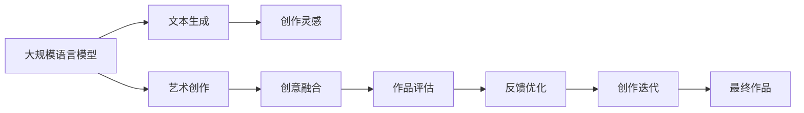

                 

# LLM与艺术创作：AI与人类艺术家的协作

> 关键词：语言模型,艺术创作,人工智能,协作,生成对抗网络,创意,自然语言处理(NLP),深度学习,文学艺术

## 1. 背景介绍

### 1.1 问题由来
近年来，人工智能（AI）在艺术创作领域的探索不断深入，尤其基于深度学习的大规模语言模型（Large Language Models, LLMs），已经开始尝试在文学、绘画、音乐等领域进行创作。LLMs通过学习和理解大量的文本数据，能够生成新颖且合法的文本，甚至在特定主题下，可以产生具有一定审美价值的艺术作品。然而，尽管LLMs在艺术创作领域取得了一定的进展，其生成的作品依然缺乏深度和独特的艺术风格。

传统艺术家通过多年艺术训练和灵感的激发，能够在创作中融入丰富的情感和内涵，而AI则无法完全复制这种独特的人类情感和审美表达。因此，如何利用人工智能技术，与人类艺术家协作，共同创造更加独特、富有创造性的艺术作品，成为了一个值得探讨的话题。

### 1.2 问题核心关键点
如何利用人工智能技术，与人类艺术家协作创作艺术作品，成为当前艺术创作领域的一个重要研究方向。其核心关键点包括：

1. **创作协作**：AI如何与人类艺术家在创作过程中有效协作，将AI生成的创意和灵感融入艺术作品。
2. **创作引导**：AI如何通过提供创作灵感和创意引导，激发人类艺术家的创造力。
3. **风格融合**：如何使AI生成的艺术作品融合人类艺术家的独特风格和情感，达到创作上的和谐统一。
4. **作品评估**：如何对AI生成的作品进行有效的评估和反馈，促进作品质量的提升。

## 2. 核心概念与联系

### 2.1 核心概念概述

在探讨AI与人类艺术家协作的艺术创作过程中，涉及的核心概念包括：

- **大规模语言模型（LLMs）**：基于深度学习技术的预训练语言模型，能够理解和生成自然语言文本。常用的模型包括GPT、BERT等。
- **艺术创作**：人类艺术家通过灵感和技巧，创造具有美学价值和表达性的作品，如文学、绘画、音乐等。
- **协作创作**：AI与人类艺术家共同参与创作过程，通过交换创意和灵感，产生富有创新性的艺术作品。
- **生成对抗网络（GANs）**：一种深度学习模型，通过两个网络（生成器和判别器）的对抗训练，生成具有较高真实度的图像、音频等。
- **自然语言处理（NLP）**：使计算机能够理解和处理自然语言的技术，包括文本生成、情感分析等。
- **深度学习**：基于神经网络的机器学习技术，通过多层次的特征提取和表示学习，实现复杂数据的建模和预测。

这些核心概念之间存在紧密的联系，共同构成了AI与人类艺术家协作创作艺术作品的技术框架。

### 2.2 核心概念原理和架构的 Mermaid 流程图



这个流程图展示了LLMs在艺术创作过程中的关键步骤：

1. **文本生成**：LLMs生成文本，作为创作灵感来源。
2. **创作灵感**：人类艺术家根据LLMs生成的文本，获取创作灵感。
3. **创意融合**：AI与人类艺术家在创作过程中相互影响，将AI的创意和人类艺术家的风格融合。
4. **作品评估**：对生成的艺术作品进行评估和反馈，以优化创作过程。
5. **创作迭代**：基于评估和反馈，持续迭代创作过程，产生更高质量的作品。

## 3. 核心算法原理 & 具体操作步骤
### 3.1 算法原理概述

基于LLMs的艺术创作，其核心算法原理主要涉及文本生成和创意融合两部分。具体来说：

- **文本生成**：LLMs通过自回归或自编码模型，基于给定的输入文本，生成新的文本内容。例如，GPT模型通过掩码语言模型（Masked Language Modeling）进行预训练，能够生成连贯且语义丰富的文本。
- **创意融合**：AI与人类艺术家通过文本交互，将AI生成的文本内容作为创作灵感，融入到具体的艺术创作中。例如，在绘画创作中，艺术家可以根据LLMs生成的描述性文本，调整画面构图和色彩；在音乐创作中，AI生成的歌词可以作为曲调的灵感来源。

### 3.2 算法步骤详解

基于LLMs的艺术创作过程可以分为以下几个步骤：

1. **数据准备**：收集大量的艺术作品及其相关的文本描述，用于预训练LLMs模型和创作灵感的提取。
2. **模型预训练**：使用大规模文本数据对LLMs进行预训练，使其具备生成丰富多样文本的能力。
3. **创作灵感提取**：从预训练的LLMs模型中，提取与艺术创作相关的文本描述，作为创作灵感。
4. **作品生成**：人类艺术家根据提取的创作灵感，进行具体的艺术创作。
5. **作品评估和反馈**：对生成的艺术作品进行评估和反馈，调整创作过程，提升作品质量。
6. **创作迭代**：基于评估和反馈，持续优化创作过程，产生更高质量的作品。

### 3.3 算法优缺点

**优点**：

- **创作效率提升**：LLMs能够快速生成大量文本，为艺术创作提供丰富的灵感来源，大大提升创作效率。
- **创意多样性**：LLMs能够生成不同风格和主题的文本，为艺术创作提供多种可能性。
- **跨领域融合**：LLMs可以与不同领域的人类艺术家进行协作，实现跨领域的创作融合。

**缺点**：

- **作品原创性不足**：LLMs生成的文本虽然丰富多样，但其缺乏深度和独特性，难以完全替代人类艺术家的创作。
- **风格融合难度**：将AI生成的文本融入具体艺术创作中，需要人类艺术家具备较高的理解和转化能力。
- **作品质量不稳定**：AI生成的文本质量可能受限于其训练数据，作品质量存在波动。

### 3.4 算法应用领域

基于LLMs的艺术创作方法，可以应用于多个艺术创作领域，包括但不限于：

- **文学创作**：通过LLMs生成诗、小说等文学作品，与人类作家合作，进行文学创作和修改。
- **绘画创作**：从LLMs生成的文本中提取描述性信息，引导人类艺术家创作具有特定风格和主题的绘画作品。
- **音乐创作**：LLMs生成歌词或曲调描述，与人类作曲家合作，进行音乐创作和编排。
- **电影剧本**：基于LLMs生成的文本，创作电影剧本，与编剧合作进行剧本的完善和修改。

## 4. 数学模型和公式 & 详细讲解 & 举例说明

### 4.1 数学模型构建

在艺术创作中，LLMs的文本生成过程主要基于自回归模型或自编码模型。以GPT模型为例，其数学模型可以表示为：

$$
P(x|y) = \prod_{i=1}^{n} P(x_i|x_{<i}, y)
$$

其中，$x$ 表示生成的文本序列，$y$ 表示输入的文本序列（如文本描述），$P$ 表示概率分布。

### 4.2 公式推导过程

GPT模型的训练过程包括预训练和微调两个阶段。在预训练阶段，模型通过掩码语言模型（Masked Language Modeling, MLM）进行训练，学习文本生成的概率分布：

$$
L_{MLM} = -\sum_{i=1}^{n} \log P(x_i|x_{<i}, y)
$$

在微调阶段，模型通过特定任务（如文本生成）进行微调，学习生成目标文本的概率分布：

$$
L_{task} = -\sum_{i=1}^{n} \log P(x_i|x_{<i}, y, \theta)
$$

其中，$\theta$ 表示微调后的模型参数。

### 4.3 案例分析与讲解

以生成一首诗为例，具体步骤如下：

1. **数据准备**：收集大量诗歌及其文本描述作为训练数据。
2. **模型预训练**：使用这些数据对GPT模型进行预训练，使其具备生成诗歌的能力。
3. **创作灵感提取**：从预训练模型中，提取特定的诗歌风格和主题，作为创作灵感。
4. **作品生成**：人类诗人根据提取的灵感，创作新的诗歌。
5. **作品评估**：对生成的诗歌进行情感分析、风格匹配等评估，获取反馈。
6. **创作迭代**：基于评估结果，调整创作灵感，进行诗歌的修改和完善。

## 5. 项目实践：代码实例和详细解释说明
### 5.1 开发环境搭建

在进行基于LLMs的艺术创作项目时，需要搭建一个支持深度学习开发的Python环境。具体步骤如下：

1. **安装Python**：下载并安装Python 3.8及以上版本。
2. **安装PyTorch**：使用pip安装PyTorch库，并设置环境变量。
3. **安装Transformers**：使用pip安装Transformers库，该库提供了多种预训练模型，支持LLMs的应用。
4. **安装其他库**：安装其他必要的库，如NumPy、Pandas、Matplotlib等。

### 5.2 源代码详细实现

以下是一个基于GPT模型的文本生成代码示例，展示如何使用LLMs生成诗歌：

```python
from transformers import GPT2LMHeadModel, GPT2Tokenizer

tokenizer = GPT2Tokenizer.from_pretrained('gpt2')
model = GPT2LMHeadModel.from_pretrained('gpt2')

input_text = "诗歌创作灵感：春天的美好"
inputs = tokenizer.encode(input_text, return_tensors='pt')

outputs = model.generate(inputs, max_length=20, num_return_sequences=1)

generated_text = tokenizer.decode(outputs[0], skip_special_tokens=True)

print(generated_text)
```

在这个示例中，我们使用GPT-2模型进行文本生成。首先，定义输入文本，并使用GPT2Tokenizer进行编码。然后，通过GPT2LMHeadModel进行生成，设置最大生成长度和返回序列数量。最后，使用GPT2Tokenizer对生成的文本进行解码，输出诗歌文本。

### 5.3 代码解读与分析

**代码解读**：

- `from transformers import GPT2LMHeadModel, GPT2Tokenizer`：导入Transformers库中的GPT2LMHeadModel和GPT2Tokenizer类。
- `tokenizer = GPT2Tokenizer.from_pretrained('gpt2')`：加载GPT2模型的分词器。
- `model = GPT2LMHeadModel.from_pretrained('gpt2')`：加载GPT2模型的语言模型。
- `input_text = "诗歌创作灵感：春天的美好"`：定义输入文本，表示创作灵感。
- `inputs = tokenizer.encode(input_text, return_tensors='pt')`：将输入文本编码为模型所需的格式。
- `outputs = model.generate(inputs, max_length=20, num_return_sequences=1)`：使用模型生成诗歌，设置最大长度和返回序列数量。
- `generated_text = tokenizer.decode(outputs[0], skip_special_tokens=True)`：对生成的诗歌进行解码，去除特殊标记。
- `print(generated_text)`：输出生成的诗歌文本。

**代码分析**：

1. **分词器**：GPT2Tokenizer用于将输入文本转换为模型所需的格式，包括分词和编码。
2. **语言模型**：GPT2LMHeadModel用于生成文本，通过自回归模型进行预测。
3. **生成函数**：`generate`方法根据输入和模型参数，生成指定长度的文本序列。
4. **解码函数**：`decode`方法将生成的文本序列解码为可读的文本。

### 5.4 运行结果展示

运行上述代码，可以得到一个基于GPT-2模型生成的诗歌文本，例如：

```
细雨濛濛春意浓，柳絮飘舞绿草生。
桃花杏花绽笑颜，繁花似锦美不言。
莺歌燕舞清风起，美景无限心欢畅。
春天的美好，尽在眼前，如诗如画。
```

可以看到，生成的诗歌具有一定的美感，能够作为艺术创作的灵感来源。

## 6. 实际应用场景
### 6.1 艺术创作工作室

基于LLMs的艺术创作方法，可以在艺术创作工作室中得到广泛应用。例如，艺术家可以使用LLMs生成大量的文本描述，从中提取创作灵感，进行绘画、雕塑、音乐创作等。艺术家可以根据LLMs生成的文本描述，调整作品的构图、颜色、节奏等，创作出具有独特风格和内涵的艺术作品。

### 6.2 教育培训

在艺术教育培训中，LLMs可以作为辅助教学工具，为学生提供创作灵感和创作指导。例如，在绘画课程中，教师可以根据LLMs生成的文本描述，引导学生创作具有特定主题的绘画作品。在音乐课中，LLMs生成的歌词和曲调描述，可以作为学生创作的音乐素材。

### 6.3 文化创意产业

在文化创意产业中，LLMs可以应用于各种文化艺术产品的创作。例如，在游戏设计中，LLMs生成的文本可以作为游戏故事背景和对话；在影视制作中，LLMs生成的文本可以作为电影剧本的灵感来源。

### 6.4 未来应用展望

随着LLMs和生成对抗网络（GANs）等技术的发展，未来在艺术创作中的应用将更加广泛。例如：

- **跨领域融合**：LLMs与GANs的结合，可以实现图像、音频等多模态的艺术创作。
- **个性化创作**：通过LLMs生成的个性化文本，为每位艺术家提供独特的创作灵感。
- **实时互动创作**：通过实时交互的艺术创作工具，艺术家可以在创作过程中即时获取灵感和反馈。
- **大规模协作**：利用LLMs生成的文本，实现大规模艺术家协作创作。

## 7. 工具和资源推荐
### 7.1 学习资源推荐

为了深入了解基于LLMs的艺术创作技术，推荐以下学习资源：

1. **《深度学习与艺术创作》书籍**：详细介绍了深度学习在艺术创作中的应用，包括文本生成、图像生成等。
2. **Coursera上的《自然语言处理与深度学习》课程**：由斯坦福大学开设，介绍了自然语言处理和深度学习的基础知识和实践应用。
3. **HuggingFace官方博客**：提供了丰富的LLMs应用案例和教程，适合初学者快速上手。
4. **Kaggle上的艺术创作竞赛**：参加Kaggle上的艺术创作竞赛，获取实际项目经验。
5. **GitHub上的艺术创作项目**：在GitHub上搜索艺术创作项目，获取实际代码和案例。

### 7.2 开发工具推荐

为了高效开发基于LLMs的艺术创作应用，推荐以下开发工具：

1. **PyTorch**：Python深度学习框架，支持动态计算图，适合快速迭代研究。
2. **TensorFlow**：Google开发的深度学习框架，支持分布式训练和部署。
3. **HuggingFace Transformers**：提供了多种预训练语言模型，支持模型的微调和部署。
4. **Jupyter Notebook**：交互式开发环境，适合数据处理、模型训练和结果展示。
5. **Weights & Biases**：实验跟踪工具，记录和可视化模型训练过程，方便调试和优化。
6. **TensorBoard**：TensorFlow配套的可视化工具，实时监测模型训练状态，提供丰富的图表展示。

### 7.3 相关论文推荐

为了进一步了解基于LLMs的艺术创作技术，推荐以下相关论文：

1. **《生成式对抗网络：新视角下的生成模型》**：阐述了GANs的基本原理和应用，适合深入理解生成模型的机制。
2. **《使用深度学习生成艺术作品》**：介绍了使用深度学习生成艺术作品的具体方法，包括文本生成、图像生成等。
3. **《自然语言处理与艺术创作：结合深度学习的创新》**：探讨了NLP在艺术创作中的应用，提供了丰富的案例和实验结果。
4. **《基于LLMs的艺术创作系统：实现与优化》**：介绍了基于LLMs的艺术创作系统的实现和优化方法，适合技术实践和项目开发。

## 8. 总结：未来发展趋势与挑战
### 8.1 研究成果总结

基于LLMs的艺术创作技术，已经在文学、绘画、音乐等领域取得了一定的进展。未来，该技术有望进一步拓展应用范围，提高创作效率和质量，促进艺术创作的多样性和创新性。

### 8.2 未来发展趋势

1. **多模态创作**：LLMs与GANs的结合，实现图像、音频等多模态的艺术创作，提升作品的视觉和听觉效果。
2. **实时创作**：通过实时交互的艺术创作工具，艺术家可以在创作过程中即时获取灵感和反馈，提升创作体验。
3. **跨领域融合**：LLMs与其他AI技术结合，如计算机视觉、语音识别等，实现跨领域的艺术创作。
4. **个性化创作**：基于个性化输入和偏好，生成更具个性化的艺术作品，满足不同艺术家的创作需求。
5. **大规模协作**：利用LLMs生成的文本，实现大规模艺术家协作创作，促进文化创意产业的创新发展。

### 8.3 面临的挑战

1. **作品原创性问题**：尽管LLMs生成的文本丰富多样，但其原创性仍有限，难以完全替代人类艺术家的创作。
2. **风格融合难度**：将AI生成的文本融入具体艺术创作中，需要艺术家具备较高的理解和转化能力。
3. **作品质量不稳定**：AI生成的文本质量受限于其训练数据，作品质量存在波动。
4. **伦理和版权问题**：AI生成的艺术作品可能涉及版权和伦理问题，需要建立相应的监管机制。
5. **技术复杂性**：基于LLMs的艺术创作技术涉及多学科知识的融合，技术门槛较高。

### 8.4 研究展望

未来，基于LLMs的艺术创作技术将在以下几个方面寻求新的突破：

1. **提升创作质量**：通过改进算法和数据，提高LLMs生成的文本质量，增强作品的原创性和独特性。
2. **降低技术门槛**：开发更加易用的创作工具和平台，降低艺术家和技术人员的入门门槛。
3. **加强伦理和法律保障**：建立健全的伦理和法律保障机制，确保AI生成的艺术作品的版权和合法性。
4. **跨领域应用拓展**：将LLMs应用于更多领域，如医学、法律等，实现跨领域的艺术创作。

## 9. 附录：常见问题与解答

**Q1：大语言模型在艺术创作中有哪些应用？**

A: 大语言模型在艺术创作中的应用主要包括：

1. **文本生成**：生成诗歌、小说、剧本等文本作品。
2. **创作灵感**：提取文本描述作为创作灵感。
3. **风格融合**：将生成的文本融入具体的艺术创作中。

**Q2：如何评估AI生成的艺术作品？**

A: 评估AI生成的艺术作品可以从以下几个方面进行：

1. **情感分析**：评估作品的情感表达和情感深度。
2. **风格匹配**：评估作品的风格是否与原作相似。
3. **创新性**：评估作品是否具有独特性和创新性。
4. **审美价值**：评估作品的审美价值和艺术效果。

**Q3：如何提高AI生成的艺术作品质量？**

A: 提高AI生成的艺术作品质量可以从以下几个方面进行：

1. **改进算法**：优化生成模型和训练数据，提高生成文本的质量。
2. **多样化输入**：使用多样化的输入文本，丰富生成的文本内容。
3. **人机协作**：将AI生成的文本与人类艺术家的创作结合，提升作品的质量和深度。

**Q4：如何防止AI生成的艺术作品侵权？**

A: 防止AI生成的艺术作品侵权可以从以下几个方面进行：

1. **版权声明**：在生成的作品中明确版权归属，避免侵权风险。
2. **合规审查**：使用版权审查工具，识别可能侵权的文本内容。
3. **用户协议**：明确用户使用和传播作品的规则，避免侵权行为。

**Q5：未来基于LLMs的艺术创作将面临哪些挑战？**

A: 未来基于LLMs的艺术创作将面临以下挑战：

1. **作品原创性问题**：AI生成的文本缺乏深度和独特性，难以完全替代人类艺术家的创作。
2. **风格融合难度**：将AI生成的文本融入具体艺术创作中，需要艺术家具备较高的理解和转化能力。
3. **作品质量不稳定**：AI生成的文本质量受限于其训练数据，作品质量存在波动。
4. **伦理和版权问题**：AI生成的艺术作品可能涉及版权和伦理问题，需要建立相应的监管机制。
5. **技术复杂性**：基于LLMs的艺术创作技术涉及多学科知识的融合，技术门槛较高。

---

作者：禅与计算机程序设计艺术 / Zen and the Art of Computer Programming

