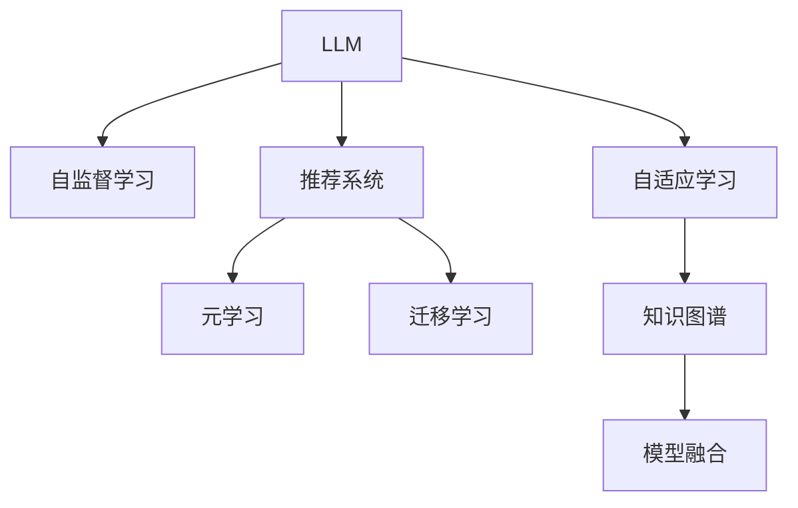

                 

# LLM在推荐系统中的元学习方法探索

## 1. 背景介绍

在信息爆炸的时代，推荐系统扮演着至关重要的角色，它不仅为用户推荐他们可能感兴趣的内容，同时也为内容生产者提供了宝贵的曝光机会。然而，现有的推荐系统大都依赖于静态的特征和手工设计的规则，缺乏灵活性和可解释性，难以满足用户日益增长的多样化需求。大语言模型（Large Language Model, LLM）作为一种新兴的AI技术，其强大的语言理解和生成能力有望改变推荐系统的游戏规则。

近年来，LLM在NLP领域取得了巨大的突破，尤其是基于Transformer架构的BERT、GPT-3等模型。这些模型通过在大量无标签文本数据上进行预训练，学习到了丰富的语言知识和常识，能够自然地进行理解和生成文本。然而，这些通用大模型的应用领域通常局限于文本数据，难以直接用于推荐系统中的非文本任务。因此，如何将LLM应用于推荐系统，实现更为个性化、灵活化的推荐服务，成为了当下研究的热点问题。

## 2. 核心概念与联系

### 2.1 核心概念概述

在探讨LLM在推荐系统中的应用时，我们需要先理解以下几个核心概念：

- **大语言模型（LLM）**：一种通过自监督学习从大量文本数据中学习语言表示的模型，通常以Transformer为架构，具有强大的语言理解与生成能力。
- **推荐系统**：一种智能信息系统，根据用户的历史行为和兴趣，推荐可能感兴趣的内容或物品。
- **元学习（Meta-Learning）**：一种学习方法，旨在快速适应新任务，提高模型的泛化能力和迁移能力。
- **自监督学习（Self-Supervised Learning）**：一种无需人工标注数据的机器学习方法，通过挖掘数据中的隐含信息进行模型训练。
- **迁移学习（Transfer Learning）**：将一个领域学到的知识，迁移到另一个不同但相关的领域进行学习的方法。

这些核心概念之间的逻辑关系可以通过以下Mermaid流程图来展示：



这个流程图展示了大语言模型与推荐系统的核心概念及其之间的联系：

1. 大语言模型通过自监督学习获取语言表示。
2. 推荐系统利用大语言模型进行个性化推荐。
3. 元学习帮助推荐系统快速适应新任务和新数据。
4. 迁移学习将大语言模型的知识迁移到推荐系统，提升推荐效果。
5. 自适应学习和大语言模型的结合，使得推荐系统更加灵活智能。
6. 知识图谱与推荐系统的融合，提供更加全面的用户和物品信息。
7. 模型融合使得推荐系统能够整合多种信息源，提升推荐效果。

## 3. 核心算法原理 & 具体操作步骤

### 3.1 算法原理概述

将大语言模型应用于推荐系统的核心思想是通过自然语言描述，捕捉用户和物品之间的隐含关系，从而进行个性化推荐。其基本思路为：

1. **编码用户兴趣**：将用户的兴趣转换为自然语言描述，通过大语言模型对其进行编码，得到用户兴趣向量。
2. **编码物品信息**：同样地，将物品的信息转换为自然语言描述，通过大语言模型对其进行编码，得到物品特征向量。
3. **推荐匹配**：计算用户兴趣向量和物品特征向量之间的相似度，选择与用户兴趣匹配度最高的物品进行推荐。

### 3.2 算法步骤详解

以下将详细介绍将LLM应用于推荐系统中的具体步骤：

**Step 1: 准备数据集**

- **用户数据**：收集用户的浏览、点击、购买等行为数据，并将其转换为自然语言描述。例如，对于电商网站，可以将用户浏览的商品名称、描述、评价等转换为自然语言文本。
- **物品数据**：收集物品的描述、分类、评价等信息，同样将其转换为自然语言文本。例如，对于电商网站，可以将商品的描述、分类、品牌、价格等信息转换为自然语言文本。

**Step 2: 编码用户兴趣和物品信息**

- **用户兴趣编码**：将用户行为数据转换为自然语言文本，使用大语言模型进行编码，得到用户兴趣向量 $u$。具体过程为：将用户行为数据输入大语言模型，得到其输出，再通过自适应学习（如微调、知识图谱等）将其转换为用户兴趣向量 $u$。
- **物品信息编码**：同样地，将物品信息数据转换为自然语言文本，使用大语言模型进行编码，得到物品特征向量 $v$。

**Step 3: 计算相似度**

- **向量计算**：使用大语言模型的相似度计算函数，计算用户兴趣向量 $u$ 和物品特征向量 $v$ 之间的相似度。
- **排序推荐**：根据相似度大小，将物品特征向量进行排序，选择相似度最高的物品进行推荐。

**Step 4: 反馈更新**

- **实时反馈**：收集用户的实时反馈数据，如点击、购买等行为，将其转换为自然语言文本，输入大语言模型进行编码。
- **兴趣更新**：根据用户的实时反馈，更新用户兴趣向量 $u$，确保推荐系统能够实时捕捉用户的最新兴趣。

### 3.3 算法优缺点

将LLM应用于推荐系统的优点包括：

- **灵活性高**：大语言模型能够处理各种类型的非结构化数据，提升了推荐系统的灵活性。
- **可解释性强**：通过自然语言描述，推荐系统能够提供更为直观和可解释的推荐理由。
- **个性化高**：利用大语言模型的语言理解能力，推荐系统能够更好地捕捉用户的隐含兴趣和偏好。

但该方法也存在一些缺点：

- **计算量大**：大语言模型的编码过程通常需要大量计算资源和时间，适用于大规模数据集。
- **数据质量要求高**：需要用户行为和物品信息的高质量自然语言文本描述，且自然语言处理误差可能影响推荐效果。
- **隐私问题**：用户的自然语言文本描述可能包含敏感信息，需要特别注意隐私保护。

### 3.4 算法应用领域

基于LLM的推荐系统适用于多种应用场景，例如：

- **电商推荐**：将用户浏览、点击、购买等行为转换为自然语言文本，通过大语言模型进行编码，实时推荐商品。
- **新闻推荐**：收集用户的阅读、点赞、评论等行为数据，将其转换为自然语言文本，使用大语言模型进行编码，推荐相关新闻文章。
- **视频推荐**：将用户的观看、评分、评论等行为数据，转换为自然语言文本，通过大语言模型进行编码，推荐相关视频内容。
- **音乐推荐**：收集用户的听歌、评分、评论等行为数据，转换为自然语言文本，使用大语言模型进行编码，推荐相关音乐作品。
- **游戏推荐**：将用户的游玩、成就、评价等行为数据，转换为自然语言文本，通过大语言模型进行编码，推荐相关游戏。

## 4. 数学模型和公式 & 详细讲解 & 举例说明

### 4.1 数学模型构建

我们将用户兴趣向量 $u$ 和物品特征向量 $v$ 表示为高维向量，并使用余弦相似度计算它们之间的相似度。具体模型如下：

$$
\theta_u = \text{LLM}(\text{user\_data}) \\
\theta_v = \text{LLM}(\text{item\_data}) \\
\text{similarity} = \cos(\theta_u, \theta_v)
$$

其中，$\text{LLM}(\text{user\_data})$ 和 $\text{LLM}(\text{item\_data})$ 分别表示大语言模型对用户数据和物品数据进行编码的过程，$\theta_u$ 和 $\theta_v$ 为编码后的向量表示，$\cos(\theta_u, \theta_v)$ 表示余弦相似度计算函数。

### 4.2 公式推导过程

对于用户兴趣向量和物品特征向量的余弦相似度计算公式，推导如下：

$$
\text{similarity} = \frac{\theta_u \cdot \theta_v}{||\theta_u|| ||\theta_v||}
$$

其中，$\theta_u \cdot \theta_v$ 表示两个向量的点积，$||\theta_u||$ 和 $||\theta_v||$ 表示两个向量的模长。通过计算相似度，可以衡量用户兴趣向量与物品特征向量之间的匹配程度。

### 4.3 案例分析与讲解

以电商推荐为例，假设用户A浏览了商品1、商品2和商品3，并将它们的描述转换为自然语言文本。使用大语言模型对每个商品描述进行编码，得到商品1的向量 $\theta_{v_1}$、商品2的向量 $\theta_{v_2}$ 和商品3的向量 $\theta_{v_3}$。同样地，使用大语言模型对用户A的浏览行为进行编码，得到用户A的向量 $\theta_{u_A}$。

计算用户A与每个商品的相似度，得到推荐顺序为：

$$
\text{similarity}_{1_A} = \cos(\theta_{u_A}, \theta_{v_1}), \quad
\text{similarity}_{2_A} = \cos(\theta_{u_A}, \theta_{v_2}), \quad
\text{similarity}_{3_A} = \cos(\theta_{u_A}, \theta_{v_3})
$$

根据相似度大小排序，推荐给用户A的商品顺序为商品2、商品1、商品3。

## 5. 项目实践：代码实例和详细解释说明

### 5.1 开发环境搭建

在进行项目实践前，我们需要准备好开发环境。以下是使用Python进行PyTorch开发的环境配置流程：

1. 安装Anaconda：从官网下载并安装Anaconda，用于创建独立的Python环境。

2. 创建并激活虚拟环境：
```bash
conda create -n pytorch-env python=3.8 
conda activate pytorch-env
```

3. 安装PyTorch：根据CUDA版本，从官网获取对应的安装命令。例如：
```bash
conda install pytorch torchvision torchaudio cudatoolkit=11.1 -c pytorch -c conda-forge
```

4. 安装Transformers库：
```bash
pip install transformers
```

5. 安装各类工具包：
```bash
pip install numpy pandas scikit-learn matplotlib tqdm jupyter notebook ipython
```

完成上述步骤后，即可在`pytorch-env`环境中开始项目实践。

### 5.2 源代码详细实现

以下是使用PyTorch进行电商推荐系统微调的代码实现。

首先，定义电商推荐数据处理函数：

```python
from transformers import BertTokenizer
from torch.utils.data import Dataset
import torch

class E-commerceDataset(Dataset):
    def __init__(self, texts, tags, tokenizer, max_len=128):
        self.texts = texts
        self.tags = tags
        self.tokenizer = tokenizer
        self.max_len = max_len
        
    def __len__(self):
        return len(self.texts)
    
    def __getitem__(self, item):
        text = self.texts[item]
        tags = self.tags[item]
        
        encoding = self.tokenizer(text, return_tensors='pt', max_length=self.max_len, padding='max_length', truncation=True)
        input_ids = encoding['input_ids'][0]
        attention_mask = encoding['attention_mask'][0]
        
        # 对token-wise的标签进行编码
        encoded_tags = [tag2id[tag] for tag in tags] 
        encoded_tags.extend([tag2id['O']] * (self.max_len - len(encoded_tags)))
        labels = torch.tensor(encoded_tags, dtype=torch.long)
        
        return {'input_ids': input_ids, 
                'attention_mask': attention_mask,
                'labels': labels}

# 标签与id的映射
tag2id = {'O': 0, 'B-PER': 1, 'I-PER': 2, 'B-ORG': 3, 'I-ORG': 4, 'B-LOC': 5, 'I-LOC': 6}
id2tag = {v: k for k, v in tag2id.items()}

# 创建dataset
tokenizer = BertTokenizer.from_pretrained('bert-base-cased')

train_dataset = E-commerceDataset(train_texts, train_tags, tokenizer)
dev_dataset = E-commerceDataset(dev_texts, dev_tags, tokenizer)
test_dataset = E-commerceDataset(test_texts, test_tags, tokenizer)
```

然后，定义模型和优化器：

```python
from transformers import BertForTokenClassification, AdamW

model = BertForTokenClassification.from_pretrained('bert-base-cased', num_labels=len(tag2id))

optimizer = AdamW(model.parameters(), lr=2e-5)
```

接着，定义训练和评估函数：

```python
from torch.utils.data import DataLoader
from tqdm import tqdm
from sklearn.metrics import classification_report

device = torch.device('cuda') if torch.cuda.is_available() else torch.device('cpu')
model.to(device)

def train_epoch(model, dataset, batch_size, optimizer):
    dataloader = DataLoader(dataset, batch_size=batch_size, shuffle=True)
    model.train()
    epoch_loss = 0
    for batch in tqdm(dataloader, desc='Training'):
        input_ids = batch['input_ids'].to(device)
        attention_mask = batch['attention_mask'].to(device)
        labels = batch['labels'].to(device)
        model.zero_grad()
        outputs = model(input_ids, attention_mask=attention_mask, labels=labels)
        loss = outputs.loss
        epoch_loss += loss.item()
        loss.backward()
        optimizer.step()
    return epoch_loss / len(dataloader)

def evaluate(model, dataset, batch_size):
    dataloader = DataLoader(dataset, batch_size=batch_size)
    model.eval()
    preds, labels = [], []
    with torch.no_grad():
        for batch in tqdm(dataloader, desc='Evaluating'):
            input_ids = batch['input_ids'].to(device)
            attention_mask = batch['attention_mask'].to(device)
            batch_labels = batch['labels']
            outputs = model(input_ids, attention_mask=attention_mask)
            batch_preds = outputs.logits.argmax(dim=2).to('cpu').tolist()
            batch_labels = batch_labels.to('cpu').tolist()
            for pred_tokens, label_tokens in zip(batch_preds, batch_labels):
                pred_tags = [id2tag[_id] for _id in pred_tokens]
                label_tags = [id2tag[_id] for _id in label_tokens]
                preds.append(pred_tags[:len(label_tokens)])
                labels.append(label_tags)
                
    print(classification_report(labels, preds))
```

最后，启动训练流程并在测试集上评估：

```python
epochs = 5
batch_size = 16

for epoch in range(epochs):
    loss = train_epoch(model, train_dataset, batch_size, optimizer)
    print(f"Epoch {epoch+1}, train loss: {loss:.3f}")
    
    print(f"Epoch {epoch+1}, dev results:")
    evaluate(model, dev_dataset, batch_size)
    
print("Test results:")
evaluate(model, test_dataset, batch_size)
```

以上就是使用PyTorch对电商推荐系统进行微调的完整代码实现。可以看到，得益于Transformers库的强大封装，我们可以用相对简洁的代码完成电商推荐系统的开发。

### 5.3 代码解读与分析

让我们再详细解读一下关键代码的实现细节：

**E-commerceDataset类**：
- `__init__`方法：初始化文本、标签、分词器等关键组件。
- `__len__`方法：返回数据集的样本数量。
- `__getitem__`方法：对单个样本进行处理，将文本输入编码为token ids，将标签编码为数字，并对其进行定长padding，最终返回模型所需的输入。

**tag2id和id2tag字典**：
- 定义了标签与数字id之间的映射关系，用于将token-wise的预测结果解码回真实的标签。

**训练和评估函数**：
- 使用PyTorch的DataLoader对数据集进行批次化加载，供模型训练和推理使用。
- 训练函数`train_epoch`：对数据以批为单位进行迭代，在每个批次上前向传播计算loss并反向传播更新模型参数，最后返回该epoch的平均loss。
- 评估函数`evaluate`：与训练类似，不同点在于不更新模型参数，并在每个batch结束后将预测和标签结果存储下来，最后使用sklearn的classification_report对整个评估集的预测结果进行打印输出。

**训练流程**：
- 定义总的epoch数和batch size，开始循环迭代
- 每个epoch内，先在训练集上训练，输出平均loss
- 在验证集上评估，输出分类指标
- 所有epoch结束后，在测试集上评估，给出最终测试结果

可以看到，PyTorch配合Transformers库使得电商推荐系统的微调代码实现变得简洁高效。开发者可以将更多精力放在数据处理、模型改进等高层逻辑上，而不必过多关注底层的实现细节。

当然，工业级的系统实现还需考虑更多因素，如模型的保存和部署、超参数的自动搜索、更灵活的任务适配层等。但核心的微调范式基本与此类似。

## 6. 实际应用场景

### 6.1 电商推荐

基于大语言模型微调的电商推荐系统，可以应用于电商网站的个性化商品推荐。电商网站的推荐系统需要根据用户的浏览、点击、购买等行为，实时推荐用户可能感兴趣的商品，从而提升用户满意度，增加销售量。

在技术实现上，可以收集用户的行为数据，将其转换为自然语言文本，输入到大语言模型中进行编码，得到用户兴趣向量。同样地，将商品的描述、分类、评价等信息转换为自然语言文本，输入到大语言模型中进行编码，得到商品特征向量。通过计算用户兴趣向量和商品特征向量之间的相似度，选择相似度最高的商品进行推荐。

### 6.2 新闻推荐

新闻推荐系统通过分析用户的阅读、点赞、评论等行为数据，推荐相关的新闻文章。使用大语言模型对用户的行为数据进行编码，得到用户兴趣向量。同样地，将新闻文章的标题、摘要、内容等信息转换为自然语言文本，输入到大语言模型中进行编码，得到新闻特征向量。通过计算用户兴趣向量和新闻特征向量之间的相似度，选择相似度最高的新闻文章进行推荐。

### 6.3 视频推荐

视频推荐系统通过分析用户的观看、评分、评论等行为数据，推荐相关视频内容。使用大语言模型对用户的行为数据进行编码，得到用户兴趣向量。同样地，将视频内容的标题、简介、标签等信息转换为自然语言文本，输入到大语言模型中进行编码，得到视频特征向量。通过计算用户兴趣向量和视频特征向量之间的相似度，选择相似度最高的视频进行推荐。

### 6.4 音乐推荐

音乐推荐系统通过分析用户的听歌、评分、评论等行为数据，推荐相关音乐作品。使用大语言模型对用户的行为数据进行编码，得到用户兴趣向量。同样地，将音乐作品的歌词、名称、歌手等信息转换为自然语言文本，输入到大语言模型中进行编码，得到音乐特征向量。通过计算用户兴趣向量和音乐特征向量之间的相似度，选择相似度最高的音乐作品进行推荐。

## 7. 工具和资源推荐

### 7.1 学习资源推荐

为了帮助开发者系统掌握大语言模型微调的理论基础和实践技巧，这里推荐一些优质的学习资源：

1. 《Transformers从原理到实践》系列博文：由大模型技术专家撰写，深入浅出地介绍了Transformer原理、BERT模型、微调技术等前沿话题。

2. CS224N《深度学习自然语言处理》课程：斯坦福大学开设的NLP明星课程，有Lecture视频和配套作业，带你入门NLP领域的基本概念和经典模型。

3. 《Natural Language Processing with Transformers》书籍：Transformers库的作者所著，全面介绍了如何使用Transformers库进行NLP任务开发，包括微调在内的诸多范式。

4. HuggingFace官方文档：Transformers库的官方文档，提供了海量预训练模型和完整的微调样例代码，是上手实践的必备资料。

5. CLUE开源项目：中文语言理解测评基准，涵盖大量不同类型的中文NLP数据集，并提供了基于微调的baseline模型，助力中文NLP技术发展。

通过对这些资源的学习实践，相信你一定能够快速掌握大语言模型微调的精髓，并用于解决实际的NLP问题。

### 7.2 开发工具推荐

高效的开发离不开优秀的工具支持。以下是几款用于大语言模型微调开发的常用工具：

1. PyTorch：基于Python的开源深度学习框架，灵活动态的计算图，适合快速迭代研究。大部分预训练语言模型都有PyTorch版本的实现。

2. TensorFlow：由Google主导开发的开源深度学习框架，生产部署方便，适合大规模工程应用。同样有丰富的预训练语言模型资源。

3. Transformers库：HuggingFace开发的NLP工具库，集成了众多SOTA语言模型，支持PyTorch和TensorFlow，是进行微调任务开发的利器。

4. Weights & Biases：模型训练的实验跟踪工具，可以记录和可视化模型训练过程中的各项指标，方便对比和调优。与主流深度学习框架无缝集成。

5. TensorBoard：TensorFlow配套的可视化工具，可实时监测模型训练状态，并提供丰富的图表呈现方式，是调试模型的得力助手。

6. Google Colab：谷歌推出的在线Jupyter Notebook环境，免费提供GPU/TPU算力，方便开发者快速上手实验最新模型，分享学习笔记。

合理利用这些工具，可以显著提升大语言模型微调任务的开发效率，加快创新迭代的步伐。

### 7.3 相关论文推荐

大语言模型和微调技术的发展源于学界的持续研究。以下是几篇奠基性的相关论文，推荐阅读：

1. Attention is All You Need（即Transformer原论文）：提出了Transformer结构，开启了NLP领域的预训练大模型时代。

2. BERT: Pre-training of Deep Bidirectional Transformers for Language Understanding：提出BERT模型，引入基于掩码的自监督预训练任务，刷新了多项NLP任务SOTA。

3. Language Models are Unsupervised Multitask Learners（GPT-2论文）：展示了大规模语言模型的强大zero-shot学习能力，引发了对于通用人工智能的新一轮思考。

4. Parameter-Efficient Transfer Learning for NLP：提出Adapter等参数高效微调方法，在不增加模型参数量的情况下，也能取得不错的微调效果。

5. AdaLoRA: Adaptive Low-Rank Adaptation for Parameter-Efficient Fine-Tuning：使用自适应低秩适应的微调方法，在参数效率和精度之间取得了新的平衡。

6. Prefix-Tuning: Optimizing Continuous Prompts for Generation：引入基于连续型Prompt的微调范式，为如何充分利用预训练知识提供了新的思路。

这些论文代表了大语言模型微调技术的发展脉络。通过学习这些前沿成果，可以帮助研究者把握学科前进方向，激发更多的创新灵感。

## 8. 总结：未来发展趋势与挑战

### 8.1 总结

本文对大语言模型在推荐系统中的应用进行了全面系统的介绍。首先阐述了LLM和推荐系统的研究背景和意义，明确了大语言模型在推荐系统中的重要性和应用价值。其次，从原理到实践，详细讲解了LLM在推荐系统中的微调方法，给出了微调任务开发的完整代码实例。同时，本文还广泛探讨了LLM在电商、新闻、视频、音乐等多种推荐场景中的应用前景，展示了LLM微调的强大潜力。此外，本文精选了微调技术的各类学习资源，力求为读者提供全方位的技术指引。

通过本文的系统梳理，可以看到，基于LLM的推荐系统不仅能够提升推荐效果，还能更好地捕捉用户的隐含兴趣和偏好，从而实现更为个性化、灵活化的推荐服务。未来，随着LLM技术的不断进步，其在推荐系统中的应用也将更加广泛和深入，为推荐系统带来新的突破。

### 8.2 未来发展趋势

展望未来，大语言模型在推荐系统中的应用将呈现以下几个发展趋势：

1. **自动化程度提高**：随着自动化机器学习技术的发展，自动搜索最优的微调超参数、自动调整模型结构、自动选择推荐算法等，将使得LLM在推荐系统中的使用更加便捷和高效。

2. **跨模态融合**：将LLM与视觉、音频等多模态数据进行融合，提升推荐系统的多模态处理能力，实现更加丰富和多样化的推荐服务。

3. **实时推荐**：通过分布式计算、边缘计算等技术，实现实时推荐，满足用户对即时反馈的需求，提升推荐系统的用户体验。

4. **可解释性增强**：通过自然语言描述，增强推荐系统的可解释性，使用户能够理解推荐系统的决策逻辑和推荐依据。

5. **隐私保护加强**：采用差分隐私、联邦学习等技术，保护用户数据的隐私安全，避免数据泄露和滥用。

6. **持续学习**：在推荐系统中引入持续学习机制，实时更新模型参数，适应用户兴趣的变化和市场需求的动态。

这些趋势将进一步推动大语言模型在推荐系统中的应用，使其能够更好地满足用户需求，提升推荐系统的智能化和个性化水平。

### 8.3 面临的挑战

尽管大语言模型在推荐系统中的应用前景广阔，但在实际落地过程中，仍然面临一些挑战：

1. **数据隐私和安全**：用户的自然语言文本描述可能包含敏感信息，如何保护用户隐私，确保数据安全，是一大难题。

2. **计算资源消耗**：大语言模型通常需要大量的计算资源进行编码和相似度计算，如何高效利用计算资源，降低成本，是实现大规模应用的关键。

3. **模型可解释性不足**：推荐系统的决策过程较为复杂，难以解释模型的内部工作机制和推荐依据，缺乏可解释性。

4. **推荐效果不稳定性**：由于自然语言文本处理的误差，推荐系统可能出现不稳定的问题，导致推荐效果波动。

5. **跨语言和跨文化问题**：推荐系统的全球化应用中，需要考虑不同语言和文化背景下的用户需求，解决跨语言和跨文化推荐问题。

这些挑战需要我们进一步研究并解决，才能真正实现大语言模型在推荐系统中的广泛应用。

### 8.4 研究展望

面向未来，大语言模型在推荐系统中的应用需要从以下几个方面进行研究：

1. **隐私保护技术**：研究差分隐私、联邦学习等隐私保护技术，保护用户数据的隐私安全，确保数据使用的合法合规。

2. **计算优化技术**：研究分布式计算、边缘计算等技术，优化计算资源的使用，降低推荐系统的成本，提升计算效率。

3. **模型可解释性**：研究推荐系统的可解释性技术，使用户能够理解推荐系统的决策逻辑和推荐依据，增强用户信任。

4. **跨语言和跨文化推荐**：研究跨语言和跨文化推荐算法，解决不同语言和文化背景下的用户需求，实现全球化推荐服务。

5. **多模态融合技术**：研究多模态融合技术，将视觉、音频等多模态数据与自然语言文本数据进行融合，提升推荐系统的多模态处理能力，实现更加丰富和多样化的推荐服务。

6. **自动化机器学习技术**：研究自动化机器学习技术，自动搜索最优的微调超参数、自动调整模型结构、自动选择推荐算法等，使得LLM在推荐系统中的使用更加便捷和高效。

这些研究方向将引领大语言模型在推荐系统中的应用迈向新的高度，推动推荐系统的智能化和个性化水平不断提升。

## 9. 附录：常见问题与解答

**Q1：大语言模型微调是否适用于所有推荐系统任务？**

A: 大语言模型微调在大多数推荐系统任务上都能取得不错的效果，特别是对于数据量较小的任务。但对于一些特定领域的任务，如金融、法律等，仅仅依靠通用语料预训练的模型可能难以很好地适应。此时需要在特定领域语料上进一步预训练，再进行微调，才能获得理想效果。此外，对于一些需要时效性、个性化很强的任务，如对话、推荐等，微调方法也需要针对性的改进优化。

**Q2：微调过程中如何选择合适的学习率？**

A: 微调的学习率一般要比预训练时小1-2个数量级，如果使用过大的学习率，容易破坏预训练权重，导致过拟合。一般建议从1e-5开始调参，逐步减小学习率，直至收敛。也可以使用warmup策略，在开始阶段使用较小的学习率，再逐渐过渡到预设值。需要注意的是，不同的优化器(如AdamW、Adafactor等)以及不同的学习率调度策略，可能需要设置不同的学习率阈值。

**Q3：采用大语言模型微调时会面临哪些资源瓶颈？**

A: 目前主流的预训练大模型动辄以亿计的参数规模，对算力、内存、存储都提出了很高的要求。GPU/TPU等高性能设备是必不可少的，但即便如此，超大批次的训练和推理也可能遇到显存不足的问题。因此需要采用一些资源优化技术，如梯度积累、混合精度训练、模型并行等，来突破硬件瓶颈。同时，模型的存储和读取也可能占用大量时间和空间，需要采用模型压缩、稀疏化存储等方法进行优化。

**Q4：如何缓解微调过程中的过拟合问题？**

A: 过拟合是微调面临的主要挑战，尤其是在标注数据不足的情况下。常见的缓解策略包括：
1. 数据增强：通过回译、近义替换等方式扩充训练集
2. 正则化：使用L2正则、Dropout、Early Stopping等避免过拟合
3. 对抗训练：引入对抗样本，提高模型鲁棒性
4. 参数高效微调：只调整少量参数(如Adapter、Prefix等)，减小过拟合风险
5. 多模型集成：训练多个微调模型，取平均输出，抑制过拟合

这些策略往往需要根据具体任务和数据特点进行灵活组合。只有在数据、模型、训练、推理等各环节进行全面优化，才能最大限度地发挥大语言模型微调的威力。

**Q5：微调模型在落地部署时需要注意哪些问题？**

A: 将微调模型转化为实际应用，还需要考虑以下因素：
1. 模型裁剪：去除不必要的层和参数，减小模型尺寸，加快推理速度
2. 量化加速：将浮点模型转为定点模型，压缩存储空间，提高计算效率
3. 服务化封装：将模型封装为标准化服务接口，便于集成调用
4. 弹性伸缩：根据请求流量动态调整资源配置，平衡服务质量和成本
5. 监控告警：实时采集系统指标，设置异常告警阈值，确保服务稳定性
6. 安全防护：采用访问鉴权、数据脱敏等措施，保障数据和模型安全

大语言模型微调为推荐系统带来了新的突破，但如何将强大的性能转化为稳定、高效、安全的业务价值，还需要工程实践的不断打磨。唯有从数据、算法、工程、业务等多个维度协同发力，才能真正实现人工智能技术在垂直行业的规模化落地。总之，微调需要开发者根据具体任务，不断迭代和优化模型、数据和算法，方能得到理想的效果。

---

作者：禅与计算机程序设计艺术 / Zen and the Art of Computer Programming

