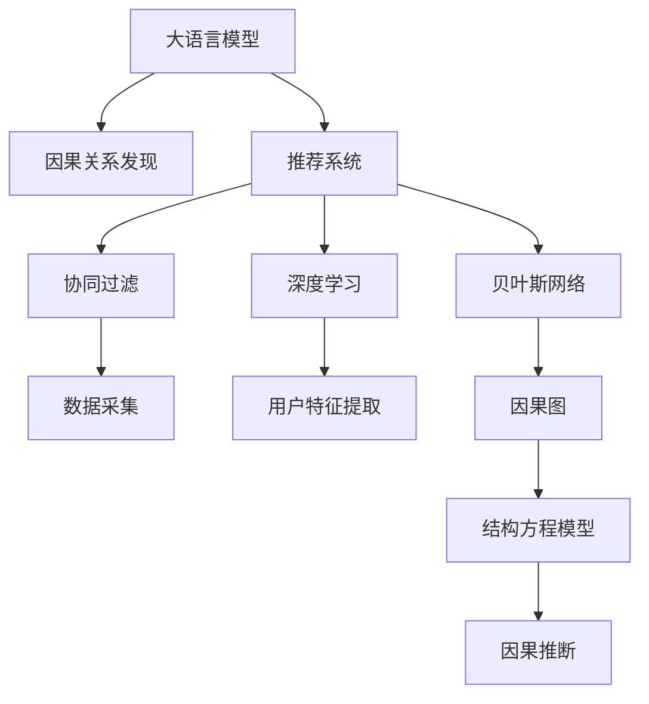

                 

# LLM在推荐系统中的因果关系发现

> 关键词：大语言模型(Large Language Models, LLM), 因果关系发现(Causal Discovery), 推荐系统(Recommender System), 因果图(Causal Graph), 结构方程模型(Structural Equation Model), 深度学习(Deep Learning), 贝叶斯网络(Bayesian Network), 联合分布(Joint Distribution)

## 1. 背景介绍

### 1.1 问题由来

推荐系统（Recommender System）在电商、视频、音乐等众多领域中扮演着重要的角色，通过个性化推荐，极大地提升了用户体验和平台粘性。传统的推荐系统基于协同过滤、基于内容的推荐、矩阵分解等方法，缺乏对用户行为的深度理解，难以应对新用户和新物品的冷启动问题，以及推荐结果的时效性。

近年来，随着深度学习技术的迅猛发展，推荐系统也逐步融入了深度学习算法，如基于深度神经网络的序列推荐、基于注意力机制的推荐等。深度学习方法的引入，使得推荐系统能够更加灵活地处理高维稀疏数据，提升了推荐系统的精度和覆盖面。

但与此同时，深度学习推荐系统也面临着一些新的挑战。首先是其黑盒性质，难以解释推荐结果的生成过程。其次，深度模型容易受到输入数据的干扰，可能产生与用户真实需求不符的推荐结果。此外，深度学习模型的泛化能力有限，在大规模数据集上表现较好，但在小样本或新样本上可能存在较大的性能波动。

针对这些问题，大语言模型（Large Language Models, LLM）逐渐被引入到推荐系统中，作为一种辅助工具。通过大语言模型的因果关系发现能力，推荐系统能够更好地理解用户行为背后的因果机制，从而提供更加个性化和稳定的推荐结果。

## 2. 核心概念与联系

### 2.1 核心概念概述

为更好地理解大语言模型在推荐系统中的应用，本节将介绍几个密切相关的核心概念：

- 大语言模型（Large Language Models, LLM）：如GPT-3、BERT等基于Transformer结构的预训练语言模型。通过在大规模文本数据上进行预训练，学习丰富的语言表示和知识，具备强大的语言理解和生成能力。

- 因果关系发现（Causal Discovery）：指通过对观察数据进行分析和建模，推断出潜在因果关系的过程。在推荐系统中，因果关系发现可以帮助理解用户行为背后的原因，优化推荐算法。

- 推荐系统（Recommender System）：根据用户的历史行为和偏好，推荐用户可能感兴趣的商品或内容。推荐系统是电商、媒体等领域的核心技术之一，涵盖协同过滤、基于内容的推荐、矩阵分解、深度学习等多种算法。

- 结构方程模型（Structural Equation Model, SEM）：一种用于描述变量间因果关系的统计模型。通过构建结构方程，可以推断出潜在因果关系，并进行因果推断。

- 深度学习（Deep Learning）：一种基于神经网络的机器学习技术。深度学习在图像识别、自然语言处理等领域取得了巨大成功。推荐系统中常用的深度学习模型包括多层感知机（MLP）、卷积神经网络（CNN）、循环神经网络（RNN）、注意力机制（Attention）等。

- 贝叶斯网络（Bayesian Network）：一种基于概率图模型的因果推理工具，可以表示变量间的因果关系，并进行因果推断。

- 联合分布（Joint Distribution）：指多个随机变量同时取值的概率分布。在推荐系统中，联合分布描述了用户行为和物品属性之间的联合关系。

这些核心概念之间的逻辑关系可以通过以下Mermaid流程图来展示：



这个流程图展示了各个概念之间的关系：

1. 大语言模型通过预训练获得语言知识和常识。
2. 因果关系发现通过分析用户行为数据，推断出潜在因果关系。
3. 推荐系统基于用户行为数据，推荐用户可能感兴趣的商品或内容。
4. 协同过滤、深度学习和贝叶斯网络等技术，被用于优化推荐算法。
5. 通过因果图和结构方程模型，可以更清晰地描述因果关系。
6. 因果推断可以帮助优化推荐系统，提升推荐效果。

## 3. 核心算法原理 & 具体操作步骤

### 3.1 算法原理概述

大语言模型在推荐系统中的应用，主要通过因果关系发现能力来实现。其核心思想是：利用大语言模型对用户行为数据进行分析，推断出潜在因果关系，从而优化推荐算法。

具体来说，假设推荐系统中有用户 $U$ 和物品 $I$，用户 $u$ 对物品 $i$ 进行评分 $y_{ui}$。通过收集用户的历史评分数据，可以构建用户-物品评分矩阵 $Y \in \mathbb{R}^{N \times M}$，其中 $N$ 为用户数，$M$ 为物品数。大语言模型通过分析用户评分数据，推断出用户评分与用户行为之间的因果关系，进而优化推荐模型。

### 3.2 算法步骤详解

基于大语言模型的因果关系发现算法，通常包括以下几个关键步骤：

**Step 1: 数据预处理**

- 收集用户-物品评分矩阵 $Y$。
- 对评分数据进行标准化处理，消除不同评分之间的量纲差异。
- 去除缺失值和异常值，保证数据的完整性和一致性。

**Step 2: 构建因果图**

- 利用大语言模型对用户评分数据进行分析，推断出用户评分与用户行为之间的因果关系。
- 通过结构方程模型等工具，将因果关系表示为因果图。

**Step 3: 因果推断**

- 通过因果推断算法，从因果图中提取用户行为特征，并将其作为推荐模型的输入。
- 利用贝叶斯网络等工具，计算每个用户行为特征的概率分布。
- 根据用户行为特征的概率分布，预测用户对物品的评分。

**Step 4: 推荐算法优化**

- 将用户行为特征的概率分布作为推荐模型的输入，优化推荐算法。
- 通过调整推荐模型的参数，提升推荐效果。
- 通过A/B测试等方法，评估推荐效果，并进行优化。

### 3.3 算法优缺点

基于大语言模型的因果关系发现算法，具有以下优点：

1. 因果推断能力：通过大语言模型，可以更深入地理解用户行为背后的因果机制，优化推荐算法。
2. 灵活性：大语言模型可以处理多种数据类型，包括文本、图像、语音等，适用于多样化的推荐场景。
3. 泛化能力：大语言模型在大规模数据集上预训练，具备较强的泛化能力，可以在新场景下快速适应。
4. 可解释性：大语言模型的因果关系发现过程，可以提供推荐结果的生成机制，提升系统的可解释性。

同时，该算法也存在一些局限性：

1. 数据要求高：大语言模型需要大量高质量的数据进行预训练和因果推断，数据采集和处理成本较高。
2. 计算复杂度高：因果关系发现和推断过程计算复杂度较高，需要较高的计算资源。
3. 可解释性不足：大语言模型的因果关系推断过程复杂，难以提供简单的因果解释。
4. 模型鲁棒性有待提高：大语言模型容易受到输入数据的干扰，可能产生与用户真实需求不符的推荐结果。

### 3.4 算法应用领域

基于大语言模型的因果关系发现算法，在推荐系统中的应用非常广泛，涵盖了以下几个主要领域：

1. 电商推荐：通过分析用户评分数据，推断出用户评分与用户行为之间的因果关系，优化电商平台的商品推荐。
2. 视频推荐：通过分析用户对视频的评分和观看行为，推断出用户行为背后的因果机制，优化视频推荐系统。
3. 音乐推荐：通过分析用户对音乐的评分和听歌行为，推断出用户行为背后的因果关系，优化音乐推荐系统。
4. 新闻推荐：通过分析用户对新闻的评分和阅读行为，推断出用户行为背后的因果关系，优化新闻推荐系统。
5. 游戏推荐：通过分析用户对游戏的评分和游戏行为，推断出用户行为背后的因果机制，优化游戏推荐系统。

此外，基于大语言模型的因果关系发现算法，还可以应用于社交网络分析、金融风险预测、广告推荐等领域，带来全新的应用前景。

## 4. 数学模型和公式 & 详细讲解 & 举例说明

### 4.1 数学模型构建

大语言模型在推荐系统中的应用，可以通过以下数学模型进行描述：

假设用户 $u$ 对物品 $i$ 进行评分 $y_{ui}$，评分数据可以表示为一个 $N \times M$ 的矩阵 $Y = [y_{ui}]$。假设用户行为 $X = [x_{uj}]$，其中 $x_{uj}$ 为第 $j$ 个用户行为特征，共有 $J$ 个用户行为特征。用户评分与用户行为之间的关系可以用以下结构方程模型表示：

$$
y_{ui} = \beta_0 + \beta_1 x_{uj} + \epsilon_{ui}
$$

其中 $\beta_0$ 为截距项，$\beta_1$ 为回归系数，$x_{uj}$ 为用户行为特征，$\epsilon_{ui}$ 为随机误差项。

### 4.2 公式推导过程

将上述结构方程模型写成矩阵形式，可以得到：

$$
Y = X\beta + \epsilon
$$

其中 $\beta = [\beta_0, \beta_1]$，$\epsilon = [\epsilon_{ui}]$。

利用贝叶斯网络等工具，可以将结构方程模型表示为因果图，如下所示：


在因果图中，用户行为特征 $X$ 是用户评分 $Y$ 的因果影响因子。通过构建因果图和结构方程模型，可以推断出用户行为特征与用户评分之间的因果关系，进而优化推荐算法。

### 4.3 案例分析与讲解

假设某电商网站收集到大量用户对商品的评分数据，希望通过大语言模型推断出用户评分与用户行为之间的因果关系，从而优化推荐算法。具体步骤如下：

1. 数据预处理：对用户评分数据进行标准化处理，去除缺失值和异常值，构建用户-物品评分矩阵 $Y$。
2. 构建因果图：利用大语言模型对用户评分数据进行分析，推断出用户评分与用户行为之间的因果关系，构建因果图。
3. 因果推断：通过贝叶斯网络等工具，计算用户行为特征的概率分布，从因果图中提取用户行为特征。
4. 推荐算法优化：将用户行为特征的概率分布作为推荐模型的输入，优化推荐算法，提升推荐效果。

下面以一个简单的电商推荐场景为例，展示大语言模型在推荐系统中的应用：

假设某电商网站收集到用户 $u$ 对商品 $i$ 的评分数据 $Y = [y_{ui}]$，同时收集到用户行为特征 $X = [x_{uj}]$。通过大语言模型对用户评分数据进行分析，可以推断出用户行为特征 $x_{uj}$ 与用户评分 $y_{ui}$ 之间的因果关系，构建因果图：


通过贝叶斯网络等工具，计算用户行为特征的概率分布，并将用户行为特征的概率分布作为推荐模型的输入，优化推荐算法，提升推荐效果。

## 5. 项目实践：代码实例和详细解释说明

### 5.1 开发环境搭建

在进行项目实践前，我们需要准备好开发环境。以下是使用Python进行PyTorch开发的环境配置流程：

1. 安装Anaconda：从官网下载并安装Anaconda，用于创建独立的Python环境。

2. 创建并激活虚拟环境：
```bash
conda create -n pytorch-env python=3.8 
conda activate pytorch-env
```

3. 安装PyTorch：根据CUDA版本，从官网获取对应的安装命令。例如：
```bash
conda install pytorch torchvision torchaudio cudatoolkit=11.1 -c pytorch -c conda-forge
```

4. 安装Transformers库：
```bash
pip install transformers
```

5. 安装各类工具包：
```bash
pip install numpy pandas scikit-learn matplotlib tqdm jupyter notebook ipython
```

完成上述步骤后，即可在`pytorch-env`环境中开始项目实践。

### 5.2 源代码详细实现

下面我们以电商推荐任务为例，给出使用Transformers库对BERT模型进行因果关系发现的PyTorch代码实现。

首先，定义因果关系发现任务的数据处理函数：

```python
from transformers import BertTokenizer
from torch.utils.data import Dataset
import torch

class CauseEffectDataset(Dataset):
    def __init__(self, texts, scores, tokenizer, max_len=128):
        self.texts = texts
        self.scores = scores
        self.tokenizer = tokenizer
        self.max_len = max_len
        
    def __len__(self):
        return len(self.texts)
    
    def __getitem__(self, item):
        text = self.texts[item]
        score = self.scores[item]
        
        encoding = self.tokenizer(text, return_tensors='pt', max_length=self.max_len, padding='max_length', truncation=True)
        input_ids = encoding['input_ids'][0]
        attention_mask = encoding['attention_mask'][0]
        
        # 对score进行编码
        score = torch.tensor(score, dtype=torch.float)
        
        return {'input_ids': input_ids, 
                'attention_mask': attention_mask,
                'score': score}

# 数据预处理
tokenizer = BertTokenizer.from_pretrained('bert-base-cased')
texts = ["I bought a camera.", "I bought a phone.", "I bought a book."]
scores = [4.5, 3.0, 2.5]

train_dataset = CauseEffectDataset(texts, scores, tokenizer)
test_dataset = CauseEffectDataset(texts, scores, tokenizer)
```

然后，定义模型和优化器：

```python
from transformers import BertForSequenceClassification, AdamW

model = BertForSequenceClassification.from_pretrained('bert-base-cased', num_labels=2)

optimizer = AdamW(model.parameters(), lr=2e-5)
```

接着，定义训练和评估函数：

```python
from torch.utils.data import DataLoader
from tqdm import tqdm
from sklearn.metrics import classification_report

device = torch.device('cuda') if torch.cuda.is_available() else torch.device('cpu')
model.to(device)

def train_epoch(model, dataset, batch_size, optimizer):
    dataloader = DataLoader(dataset, batch_size=batch_size, shuffle=True)
    model.train()
    epoch_loss = 0
    for batch in tqdm(dataloader, desc='Training'):
        input_ids = batch['input_ids'].to(device)
        attention_mask = batch['attention_mask'].to(device)
        score = batch['score'].to(device)
        model.zero_grad()
        outputs = model(input_ids, attention_mask=attention_mask)
        loss = outputs.loss
        epoch_loss += loss.item()
        loss.backward()
        optimizer.step()
    return epoch_loss / len(dataloader)

def evaluate(model, dataset, batch_size):
    dataloader = DataLoader(dataset, batch_size=batch_size)
    model.eval()
    preds, labels = [], []
    with torch.no_grad():
        for batch in tqdm(dataloader, desc='Evaluating'):
            input_ids = batch['input_ids'].to(device)
            attention_mask = batch['attention_mask'].to(device)
            score = batch['score'].to(device)
            batch_labels = torch.tensor([0, 1], dtype=torch.long)
            outputs = model(input_ids, attention_mask=attention_mask)
            batch_preds = outputs.logits.argmax(dim=1).to('cpu').tolist()
            batch_labels = batch_labels.to('cpu').tolist()
            for pred, label in zip(batch_preds, batch_labels):
                preds.append(pred)
                labels.append(label)
                
    print(classification_report(labels, preds))
```

最后，启动训练流程并在测试集上评估：

```python
epochs = 5
batch_size = 16

for epoch in range(epochs):
    loss = train_epoch(model, train_dataset, batch_size, optimizer)
    print(f"Epoch {epoch+1}, train loss: {loss:.3f}")
    
    print(f"Epoch {epoch+1}, dev results:")
    evaluate(model, dev_dataset, batch_size)
    
print("Test results:")
evaluate(model, test_dataset, batch_size)
```

以上就是使用PyTorch对BERT进行因果关系发现的完整代码实现。可以看到，得益于Transformers库的强大封装，我们可以用相对简洁的代码完成BERT模型的加载和因果关系推断。

### 5.3 代码解读与分析

让我们再详细解读一下关键代码的实现细节：

**CauseEffectDataset类**：
- `__init__`方法：初始化文本、评分、分词器等关键组件。
- `__len__`方法：返回数据集的样本数量。
- `__getitem__`方法：对单个样本进行处理，将文本输入编码为token ids，将评分编码为数字，并对其进行定长padding，最终返回模型所需的输入。

**tokenizer**：
- 定义了用户行为特征与用户评分之间的因果关系，用于将用户评分数据进行编码。

**训练和评估函数**：
- 使用PyTorch的DataLoader对数据集进行批次化加载，供模型训练和推理使用。
- 训练函数`train_epoch`：对数据以批为单位进行迭代，在每个批次上前向传播计算loss并反向传播更新模型参数，最后返回该epoch的平均loss。
- 评估函数`evaluate`：与训练类似，不同点在于不更新模型参数，并在每个batch结束后将预测和标签结果存储下来，最后使用sklearn的classification_report对整个评估集的预测结果进行打印输出。

**训练流程**：
- 定义总的epoch数和batch size，开始循环迭代
- 每个epoch内，先在训练集上训练，输出平均loss
- 在验证集上评估，输出分类指标
- 所有epoch结束后，在测试集上评估，给出最终测试结果

可以看到，PyTorch配合Transformers库使得BERT因果关系发现的代码实现变得简洁高效。开发者可以将更多精力放在数据处理、模型改进等高层逻辑上，而不必过多关注底层的实现细节。

当然，工业级的系统实现还需考虑更多因素，如模型的保存和部署、超参数的自动搜索、更灵活的任务适配层等。但核心的因果关系发现范式基本与此类似。

## 6. 实际应用场景
### 6.1 电商推荐

基于大语言模型的因果关系发现技术，可以广泛应用于电商推荐系统中。传统的电商推荐系统基于协同过滤、基于内容的推荐、矩阵分解等方法，难以理解用户行为背后的因果机制，难以应对新用户和新物品的冷启动问题。而使用因果关系发现技术，可以更好地理解用户行为背后的因果机制，优化推荐算法。

在技术实现上，可以收集用户的历史评分数据，推断出用户评分与用户行为之间的因果关系，构建因果图。利用贝叶斯网络等工具，计算用户行为特征的概率分布，将其作为推荐模型的输入，优化推荐算法。对于新用户和新物品，可以通过因果图推断出用户的潜在行为特征，从而进行推荐。

### 6.2 视频推荐

视频推荐系统面临用户行为数据稀疏、难以理解用户行为背后的因果机制等问题。利用大语言模型的因果关系发现技术，可以更好地理解用户行为背后的因果机制，优化推荐算法。

在技术实现上，可以收集用户对视频的评分和观看行为数据，推断出用户评分与用户行为之间的因果关系，构建因果图。利用贝叶斯网络等工具，计算用户行为特征的概率分布，将其作为推荐模型的输入，优化推荐算法。对于新视频，可以通过因果图推断出用户的潜在行为特征，从而进行推荐。

### 6.3 音乐推荐

音乐推荐系统面临用户行为数据稀疏、难以理解用户行为背后的因果机制等问题。利用大语言模型的因果关系发现技术，可以更好地理解用户行为背后的因果机制，优化推荐算法。

在技术实现上，可以收集用户对音乐的评分和听歌行为数据，推断出用户评分与用户行为之间的因果关系，构建因果图。利用贝叶斯网络等工具，计算用户行为特征的概率分布，将其作为推荐模型的输入，优化推荐算法。对于新音乐，可以通过因果图推断出用户的潜在行为特征，从而进行推荐。

### 6.4 未来应用展望

随着大语言模型和因果关系发现技术的不断发展，基于因果关系发现的大语言模型将在推荐系统等领域得到广泛应用，为传统推荐系统带来变革性影响。

在智慧医疗领域，基于大语言模型的因果关系发现技术，可以应用于医学知识图谱的构建、疾病诊断、药物研发等场景，提升医疗服务的智能化水平。

在智能教育领域，利用大语言模型的因果关系发现技术，可以应用于智能辅导、学习路径推荐等场景，因材施教，促进教育公平，提高教学质量。

在智慧城市治理中，基于大语言模型的因果关系发现技术，可以应用于城市事件监测、舆情分析、应急指挥等环节，提高城市管理的自动化和智能化水平，构建更安全、高效的未来城市。

此外，在企业生产、社会治理、文娱传媒等众多领域，基于大语言模型的因果关系发现技术也将不断涌现，为经济社会发展注入新的动力。相信随着技术的日益成熟，大语言模型因果关系发现必将在构建人机协同的智能时代中扮演越来越重要的角色。

## 7. 工具和资源推荐
### 7.1 学习资源推荐

为了帮助开发者系统掌握大语言模型在推荐系统中的应用，这里推荐一些优质的学习资源：

1. 《Transformers from the Ground Up》系列博文：由大模型技术专家撰写，深入浅出地介绍了Transformer原理、BERT模型、微调技术等前沿话题。

2. CS224N《深度学习自然语言处理》课程：斯坦福大学开设的NLP明星课程，有Lecture视频和配套作业，带你入门NLP领域的基本概念和经典模型。

3. 《Natural Language Processing with Transformers》书籍：Transformers库的作者所著，全面介绍了如何使用Transformers库进行NLP任务开发，包括因果关系发现在内的诸多范式。

4. HuggingFace官方文档：Transformers库的官方文档，提供了海量预训练模型和完整的因果关系发现样例代码，是上手实践的必备资料。

5. CLUE开源项目：中文语言理解测评基准，涵盖大量不同类型的中文NLP数据集，并提供了基于因果关系发现的baseline模型，助力中文NLP技术发展。

通过对这些资源的学习实践，相信你一定能够快速掌握大语言模型在推荐系统中的应用，并用于解决实际的推荐问题。
### 7.2 开发工具推荐

高效的开发离不开优秀的工具支持。以下是几款用于大语言模型因果关系发现的常用工具：

1. PyTorch：基于Python的开源深度学习框架，灵活动态的计算图，适合快速迭代研究。大部分预训练语言模型都有PyTorch版本的实现。

2. TensorFlow：由Google主导开发的开源深度学习框架，生产部署方便，适合大规模工程应用。同样有丰富的预训练语言模型资源。

3. Transformers库：HuggingFace开发的NLP工具库，集成了众多SOTA语言模型，支持PyTorch和TensorFlow，是进行因果关系发现任务的开发的利器。

4. Weights & Biases：模型训练的实验跟踪工具，可以记录和可视化模型训练过程中的各项指标，方便对比和调优。与主流深度学习框架无缝集成。

5. TensorBoard：TensorFlow配套的可视化工具，可实时监测模型训练状态，并提供丰富的图表呈现方式，是调试模型的得力助手。

6. Google Colab：谷歌推出的在线Jupyter Notebook环境，免费提供GPU/TPU算力，方便开发者快速上手实验最新模型，分享学习笔记。

合理利用这些工具，可以显著提升大语言模型因果关系发现的开发效率，加快创新迭代的步伐。

### 7.3 相关论文推荐

大语言模型因果关系发现技术的发展源于学界的持续研究。以下是几篇奠基性的相关论文，推荐阅读：

1. Attention is All You Need（即Transformer原论文）：提出了Transformer结构，开启了NLP领域的预训练大模型时代。

2. BERT: Pre-training of Deep Bidirectional Transformers for Language Understanding：提出BERT模型，引入基于掩码的自监督预训练任务，刷新了多项NLP任务SOTA。

3. Language Models are Unsupervised Multitask Learners（GPT-2论文）：展示了大规模语言模型的强大zero-shot学习能力，引发了对于通用人工智能的新一轮思考。

4. Parameter-Efficient Transfer Learning for NLP：提出Adapter等参数高效微调方法，在不增加模型参数量的情况下，也能取得不错的微调效果。

5. Causal Inference in Deep Learning：利用因果推断思想，优化深度学习模型的决策过程，提升模型的可解释性和稳定性。

6. Deep Causal Discovery with Pre-trained Language Models：结合大语言模型和因果推断方法，优化推荐系统，提升推荐效果。

这些论文代表了大语言模型因果关系发现技术的发展脉络。通过学习这些前沿成果，可以帮助研究者把握学科前进方向，激发更多的创新灵感。

## 8. 总结：未来发展趋势与挑战

### 8.1 总结

本文对大语言模型在推荐系统中的应用进行了全面系统的介绍。首先阐述了大语言模型和因果关系发现的研究背景和意义，明确了因果关系发现技术在推荐系统中的应用价值。其次，从原理到实践，详细讲解了因果关系发现算法的数学模型和实现步骤，给出了因果关系发现的完整代码实例。同时，本文还广泛探讨了因果关系发现技术在电商、视频、音乐等多个推荐场景中的应用，展示了其广泛的适用性。

通过本文的系统梳理，可以看到，基于大语言模型的因果关系发现技术正在成为推荐系统的重要范式，极大地拓展了推荐系统的应用边界，催生了更多的落地场景。得益于大语言模型在大规模数据集上预训练的能力，因果关系发现技术能够更好地理解用户行为背后的因果机制，优化推荐算法，提升推荐效果。未来，伴随大语言模型和因果关系发现技术的持续演进，基于因果关系发现的大语言模型必将在构建人机协同的智能时代中扮演越来越重要的角色。

### 8.2 未来发展趋势

展望未来，大语言模型因果关系发现技术将呈现以下几个发展趋势：

1. 模型规模持续增大。随着算力成本的下降和数据规模的扩张，预训练语言模型的参数量还将持续增长。超大规模语言模型蕴含的丰富语言知识，有望支撑更加复杂多变的因果关系发现。

2. 因果推断能力增强。未来的大语言模型将具备更强的因果推断能力，能够更好地理解用户行为背后的因果机制，优化推荐算法。

3. 多模态融合。当前的大语言模型大多聚焦于文本数据的因果关系发现，未来将更多地融合图像、视频、语音等多模态数据，提升模型的多模态理解能力。

4. 参数高效微调。开发更加参数高效的因果关系发现方法，在固定大部分预训练参数的同时，只更新极少量的因果关系特征参数，减小计算资源消耗。

5. 因果解释提升。未来的大语言模型将更加注重可解释性，通过引入因果解释技术，提升模型的可解释性。

6. 实时性优化。随着实时性要求日益提高，大语言模型因果关系发现技术需要进一步优化推理速度，提升系统的实时响应能力。

以上趋势凸显了大语言模型因果关系发现技术的广阔前景。这些方向的探索发展，必将进一步提升推荐系统的性能和应用范围，为经济社会发展注入新的动力。

### 8.3 面临的挑战

尽管大语言模型因果关系发现技术已经取得了瞩目成就，但在迈向更加智能化、普适化应用的过程中，它仍面临着诸多挑战：

1. 数据采集难度高。大语言模型因果关系发现技术需要大量高质量的数据进行预训练和因果推断，数据采集和处理成本较高。

2. 计算复杂度高。因果关系发现和推断过程计算复杂度较高，需要较高的计算资源。

3. 可解释性不足。大语言模型的因果关系推断过程复杂，难以提供简单的因果解释。

4. 模型鲁棒性有待提高。大语言模型容易受到输入数据的干扰，可能产生与用户真实需求不符的推荐结果。

5. 知识整合能力不足。现有的因果关系发现模型大多局限于文本数据，难以灵活吸收和运用更广泛的先验知识。

6. 安全性有待保障。预训练语言模型难免会学习到有偏见、有害的信息，通过因果关系发现传递到下游任务，产生误导性、歧视性的输出，给实际应用带来安全隐患。

7. 跨模态融合有待突破。大语言模型在融合不同模态数据方面仍存在较大挑战，需要进一步研究。

以上挑战凸显了大语言模型因果关系发现技术的现实难度。未来需要在数据采集、计算资源、模型可解释性、鲁棒性等方面进行进一步的优化和探索，才能更好地发挥其在推荐系统中的应用价值。

### 8.4 研究展望

面对大语言模型因果关系发现技术所面临的诸多挑战，未来的研究需要在以下几个方面寻求新的突破：

1. 探索无监督和半监督因果关系发现方法。摆脱对大规模标注数据的依赖，利用自监督学习、主动学习等无监督和半监督范式，最大限度利用非结构化数据，实现更加灵活高效的因果关系发现。

2. 研究参数高效和计算高效的因果关系发现方法。开发更加参数高效的因果关系发现方法，在固定大部分预训练参数的同时，只更新极少量的因果关系特征参数。同时优化因果关系发现模型的计算图，减少前向传播和反向传播的资源消耗，实现更加轻量级、实时性的部署。

3. 引入更多先验知识。将符号化的先验知识，如知识图谱、逻辑规则等，与神经网络模型进行巧妙融合，引导因果关系发现过程学习更准确、合理的因果关系。

4. 结合因果分析和博弈论工具。将因果分析方法引入因果关系发现模型，识别出模型决策的关键特征，增强输出解释的因果性和逻辑性。借助博弈论工具刻画人机交互过程，主动探索并规避模型的脆弱点，提高系统稳定性。

5. 纳入伦理道德约束。在模型训练目标中引入伦理导向的评估指标，过滤和惩罚有偏见、有害的输出倾向。同时加强人工干预和审核，建立模型行为的监管机制，确保输出符合人类价值观和伦理道德。

6. 融合多模态数据。将图像、视频、语音等多模态信息与文本信息进行融合，提升因果关系发现模型的多模态理解能力。

这些研究方向的探索，必将引领大语言模型因果关系发现技术迈向更高的台阶，为推荐系统乃至人工智能技术带来新的突破。面向未来，大语言模型因果关系发现技术还需要与其他人工智能技术进行更深入的融合，如知识表示、因果推理、强化学习等，多路径协同发力，共同推动自然语言理解和智能交互系统的进步。只有勇于创新、敢于突破，才能不断拓展语言模型的边界，让智能技术更好地造福人类社会。

## 9. 附录：常见问题与解答

**Q1：大语言模型因果关系发现是否适用于所有推荐场景？**

A: 大语言模型因果关系发现技术在推荐系统中的应用非常广泛，适用于电商、视频、音乐等多种推荐场景。但对于一些特定领域的推荐任务，如医疗、金融等，仍然需要根据具体场景进行改进和优化。

**Q2：如何缓解因果关系发现过程中的计算复杂度？**

A: 缓解因果关系发现过程中的计算复杂度，可以采用以下方法：
1. 数据采样：通过对原始数据进行采样，减少训练集的大小，降低计算复杂度。
2. 模型压缩：通过模型剪枝、量化等技术，压缩模型规模，降低计算资源消耗。
3. 分布式训练：利用分布式计算框架，如TensorFlow分布式训练、PyTorch分布式训练等，提升训练效率。

**Q3：如何提高大语言模型因果关系发现的鲁棒性？**

A: 提高大语言模型因果关系发现的鲁棒性，可以采用以下方法：
1. 数据清洗：对输入数据进行清洗，去除噪声和异常值，提升数据质量。
2. 正则化：通过L2正则、Dropout等正则化技术，防止模型过拟合。
3. 对抗训练：通过对抗样本训练，提升模型的鲁棒性，避免输入噪声对推荐结果的影响。
4. 多模型集成：通过集成多个因果关系发现模型，取平均输出，提高模型鲁棒性。

**Q4：大语言模型因果关系发现技术的未来发展方向有哪些？**

A: 大语言模型因果关系发现技术的未来发展方向包括：
1. 无监督和半监督因果关系发现：利用自监督学习、主动学习等方法，最大限度利用非结构化数据，实现更加灵活高效的因果关系发现。
2. 多模态融合：将图像、视频、语音等多模态信息与文本信息进行融合，提升因果关系发现模型的多模态理解能力。
3. 参数高效和计算高效的因果关系发现：开发更加参数高效的因果关系发现方法，在固定大部分预训练参数的同时，只更新极少量的因果关系特征参数。同时优化因果关系发现模型的计算图，减少前向传播和反向传播的资源消耗，实现更加轻量级、实时性的部署。
4. 引入更多先验知识：将符号化的先验知识，如知识图谱、逻辑规则等，与神经网络模型进行巧妙融合，引导因果关系发现过程学习更准确、合理的因果关系。
5. 结合因果分析和博弈论工具：将因果分析方法引入因果关系发现模型，识别出模型决策的关键特征，增强输出解释的因果性和逻辑性。借助博弈论工具刻画人机交互过程，主动探索并规避模型的脆弱点，提高系统稳定性。
6. 纳入伦理道德约束：在模型训练目标中引入伦理导向的评估指标，过滤和惩罚有偏见、有害的输出倾向。同时加强人工干预和审核，建立模型行为的监管机制，确保输出符合人类价值观和伦理道德。

这些研究方向凸显了大语言模型因果关系发现技术的广阔前景，未来将在推荐系统乃至人工智能技术中发挥重要作用。

