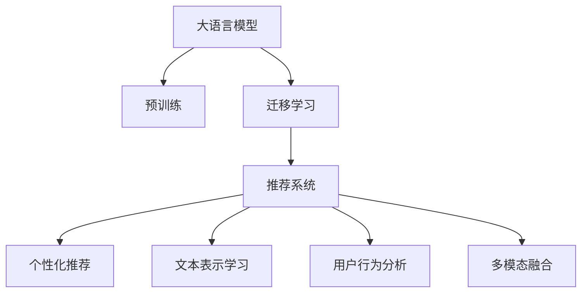

                 

## 1. 背景介绍

### 1.1 问题由来
推荐系统是互联网时代的重要技术应用之一，为用户推荐感兴趣的个性化内容，极大提升了用户体验和平台价值。然而，传统推荐系统往往仅基于用户行为数据进行推荐，难以全面理解用户需求。近年来，大语言模型(LLM)凭借其强大的语言理解和生成能力，在推荐系统中得到了越来越多的应用。

### 1.2 问题核心关键点
基于大语言模型的推荐系统，核心思想是通过自然语言理解和生成技术，从用户输入的查询、评论、评分等文本中挖掘用户兴趣，构建用户与内容的深度关联，实现个性化推荐。与传统推荐系统相比，LLM推荐系统具有以下优点：
- **语义理解能力**：LLM能够理解用户查询的自然语言描述，获取更深层次的用户兴趣。
- **动态适应**：通过文本生成技术，LLM推荐系统能够实时调整推荐结果，适配用户需求的变化。
- **跨域推荐**：LLM推荐系统不仅限于用户行为数据，还可以结合更多元化的信息源，如商品描述、用户评价等，实现更全面的推荐。

目前，基于LLM的推荐系统已经在电商、视频、音乐等多个领域实现了成功应用。例如，Amazon利用GPT-3进行推荐，显著提升了用户转化率和购物体验；Spotify使用基于语言模型的音乐推荐，为用户定制个性化歌单。

## 2. 核心概念与联系

### 2.1 核心概念概述

为了深入理解LLM在推荐系统中的应用，本节将介绍几个关键概念：

- **大语言模型(LLM)**：以Transformer等深度神经网络为基础的预训练语言模型。通过在大规模无标签文本数据上进行预训练，学习到通用的语言表示，具备强大的自然语言理解和生成能力。

- **迁移学习(Transfer Learning)**：将一个领域学到的知识，迁移到另一个相关领域的迁移学习技术。在推荐系统中，可以利用大模型在通用文本数据上的预训练知识，提升推荐效果。

- **推荐系统**：根据用户的历史行为和兴趣，推荐可能感兴趣的物品或内容的系统。传统的推荐系统基于协同过滤、矩阵分解等方法，而基于LLM的推荐系统更多依赖自然语言处理技术。

- **个性化推荐**：根据用户个性化的需求，推荐可能感兴趣的物品或内容的推荐方式。相比于传统的推荐系统，个性化推荐更加注重用户的主观偏好。

- **文本表示学习**：将自然语言文本转化为机器可处理的向量形式，以便于模型的理解和生成。

- **用户行为分析**：通过分析用户的行为数据，识别用户的兴趣和偏好。

- **多模态融合**：结合用户文本数据和行为数据，进行信息融合，提升推荐效果。

这些核心概念之间的逻辑关系可以通过以下Mermaid流程图来展示：



这个流程图展示了LLM推荐系统的核心概念及其之间的关系：

1. 大语言模型通过预训练获得基础能力。
2. 迁移学习将预训练模型应用于推荐系统。
3. 推荐系统根据用户行为数据生成推荐结果。
4. 个性化推荐通过分析用户文本数据实现。
5. 文本表示学习将自然语言转化为向量。
6. 用户行为分析挖掘用户兴趣。
7. 多模态融合结合文本和行为数据。

这些概念共同构成了LLM推荐系统的核心框架，使其能够在各种推荐场景中发挥强大的语言理解和生成能力。

## 3. 核心算法原理 & 具体操作步骤

### 3.1 算法原理概述

基于LLM的推荐系统，本质上是一个有监督的迁移学习过程。其核心思想是：将预训练的大语言模型作为特征提取器，通过用户的自然语言查询或评论数据，生成与用户兴趣相关的物品推荐。

形式化地，假设预训练模型为 $M_{\theta}$，其中 $\theta$ 为预训练得到的模型参数。给定用户 $u$ 的历史行为数据 $H_u=\{x_1, x_2, ..., x_n\}$，其中 $x_i$ 为第 $i$ 次用户行为，可以是商品浏览记录、评分、评论等文本数据。推荐任务为 $T$，目标是为用户 $u$ 生成推荐列表 $R_u$。

推荐系统基于预训练模型 $M_{\theta}$ 对用户 $u$ 的历史行为数据 $H_u$ 进行编码，生成用户兴趣向量 $V_u \in \mathbb{R}^d$。然后，根据模型 $M_{\theta}$ 对物品 $i$ 的表示 $V_i \in \mathbb{R}^d$，计算用户和物品之间的相似度 $s_u^i$。最终，选择相似度最高的前 $K$ 个物品作为推荐列表 $R_u$。

推荐过程的数学公式可以表示为：
$$
V_u = M_{\theta}(H_u)
$$
$$
s_u^i = \cos(V_u, V_i)
$$
$$
R_u = \mathop{\arg\min}_{i} s_u^i
$$

### 3.2 算法步骤详解

基于LLM的推荐系统通常包括以下关键步骤：

**Step 1: 准备预训练模型和数据集**
- 选择合适的预训练语言模型 $M_{\theta}$ 作为初始化参数，如 BERT、GPT 等。
- 收集用户历史行为数据 $H_u=\{x_1, x_2, ..., x_n\}$，将其转化为文本形式，划分为训练集和测试集。

**Step 2: 编码用户行为数据**
- 对用户历史行为数据 $H_u$ 进行编码，生成用户兴趣向量 $V_u \in \mathbb{R}^d$。
- 可以使用预训练模型对文本进行编码，或者结合用户行为分析方法，构建更加细致的兴趣表示。

**Step 3: 计算用户与物品相似度**
- 对物品 $i$ 进行编码，生成物品表示 $V_i \in \mathbb{R}^d$。
- 使用余弦相似度计算用户与物品之间的相似度 $s_u^i$。

**Step 4: 生成推荐列表**
- 根据相似度 $s_u^i$ 排序，选择相似度最高的前 $K$ 个物品作为推荐列表 $R_u$。

**Step 5: 评估和优化**
- 在测试集上评估推荐列表的准确率和相关性。
- 根据评估结果，对模型进行优化调整，如调整超参数、增加正则化等。

### 3.3 算法优缺点

基于LLM的推荐系统具有以下优点：
1. 语义理解能力强。LLM能够理解自然语言查询的深层语义，挖掘用户的真实兴趣。
2. 动态适应性好。LLM推荐系统可以实时调整推荐结果，适应用户需求的变化。
3. 跨域推荐能力。LLM可以结合多种信息源，如商品描述、用户评价等，实现更全面的推荐。

同时，该方法也存在一些局限性：
1. 计算资源消耗大。预训练模型和LLM推理过程需要大量计算资源，可能对实时推荐产生影响。
2. 对标注数据依赖大。LLM推荐系统依赖用户行为数据进行训练，标注数据质量对推荐效果有较大影响。
3. 可解释性不足。LLM推荐系统往往缺乏可解释性，难以解释推荐结果的生成逻辑。
4. 泛化能力差。LLM可能对特定领域或场景的适应性不足，需要进行领域适应的微调。

尽管存在这些局限性，但LLM推荐系统在电商、视频、音乐等多个领域已经取得了显著的效果，成为推荐系统研究的新热点。未来相关研究的重点在于如何进一步提升模型的实时性和可解释性，减少对标注数据的依赖，以及增强模型的泛化能力。

### 3.4 算法应用领域

基于LLM的推荐系统已经在多个领域得到了成功应用，例如：

- **电商推荐**：根据用户对商品的评价、评论、搜索记录等文本数据，生成个性化的商品推荐。
- **视频推荐**：根据用户对视频的评分、评论、观看历史等文本数据，生成个性化视频推荐。
- **音乐推荐**：根据用户对歌曲的评分、评论、播放记录等文本数据，生成个性化的音乐推荐。
- **新闻推荐**：根据用户对新闻文章的评价、评论、点击记录等文本数据，生成个性化的新闻推荐。

除了这些经典应用外，LLM推荐系统还被创新性地应用到更多场景中，如时尚搭配、健康饮食、旅游计划等，为推荐系统带来了新的突破。随着预训练模型和推荐方法的不断进步，相信LLM推荐系统将在更广阔的应用领域大放异彩。

## 4. 数学模型和公式 & 详细讲解 & 举例说明

### 4.1 数学模型构建

本节将使用数学语言对基于LLM的推荐系统进行更加严格的刻画。

记预训练语言模型为 $M_{\theta}$，其中 $\theta$ 为预训练得到的模型参数。假设推荐任务为 $T$，目标为推荐列表 $R_u$。给定用户 $u$ 的历史行为数据 $H_u=\{x_1, x_2, ..., x_n\}$，其中 $x_i$ 为第 $i$ 次用户行为，可以是商品浏览记录、评分、评论等文本数据。

定义用户兴趣表示为 $V_u \in \mathbb{R}^d$，物品表示为 $V_i \in \mathbb{R}^d$。假设 $M_{\theta}$ 对用户行为 $x_i$ 的编码为 $f_{\theta}(x_i) \in \mathbb{R}^d$，则用户兴趣向量 $V_u$ 可表示为：
$$
V_u = \sum_{i=1}^n \lambda_i f_{\theta}(x_i)
$$
其中 $\lambda_i$ 为第 $i$ 次行为的影响权重，可以由预设或学习得到。

推荐列表 $R_u$ 为 $K$ 个物品中与用户兴趣向量 $V_u$ 相似度最高的物品，可以表示为：
$$
R_u = \mathop{\arg\min}_{i} s(V_u, V_i)
$$
其中 $s(\cdot, \cdot)$ 为相似度函数，常用的有余弦相似度、欧式距离等。

### 4.2 公式推导过程

以下我们以余弦相似度为例，推导LLM推荐系统的核心公式。

假设预训练模型为 $M_{\theta}$，对用户行为 $x_i$ 的编码为 $f_{\theta}(x_i)$，用户兴趣向量 $V_u$ 为：
$$
V_u = \sum_{i=1}^n \lambda_i f_{\theta}(x_i)
$$

假设物品 $i$ 的表示为 $V_i$，则用户与物品之间的相似度 $s_u^i$ 为：
$$
s_u^i = \cos(V_u, V_i) = \frac{V_u \cdot V_i}{\|V_u\|\|V_i\|}
$$

最终，推荐列表 $R_u$ 为与用户兴趣向量 $V_u$ 相似度最高的前 $K$ 个物品，即：
$$
R_u = \mathop{\arg\min}_{i} s(V_u, V_i)
$$

在得到推荐列表的数学公式后，即可基于用户行为数据计算用户兴趣表示 $V_u$，然后计算用户与物品的相似度，最后选取相似度最高的物品进行推荐。

### 4.3 案例分析与讲解

假设我们有一个电商平台，用户 $u$ 的历史行为数据为 $\{x_1, x_2, ..., x_n\}$，其中 $x_i$ 为用户的第 $i$ 次浏览记录。使用预训练模型对每个浏览记录 $x_i$ 进行编码，得到对应的用户兴趣向量 $V_u$。然后，对商品库中所有商品的描述文本进行编码，得到商品向量 $V_i$。

根据用户兴趣向量 $V_u$ 和商品向量 $V_i$，计算用户与每个商品之间的余弦相似度 $s_u^i$，选取余弦相似度最高的前 $K$ 个商品作为推荐列表 $R_u$。

## 5. 项目实践：代码实例和详细解释说明

### 5.1 开发环境搭建

在进行LLM推荐系统开发前，我们需要准备好开发环境。以下是使用Python进行PyTorch开发的环境配置流程：

1. 安装Anaconda：从官网下载并安装Anaconda，用于创建独立的Python环境。

2. 创建并激活虚拟环境：
```bash
conda create -n pytorch-env python=3.8 
conda activate pytorch-env
```

3. 安装PyTorch：根据CUDA版本，从官网获取对应的安装命令。例如：
```bash
conda install pytorch torchvision torchaudio cudatoolkit=11.1 -c pytorch -c conda-forge
```

4. 安装Transformers库：
```bash
pip install transformers
```

5. 安装各类工具包：
```bash
pip install numpy pandas scikit-learn matplotlib tqdm jupyter notebook ipython
```

完成上述步骤后，即可在`pytorch-env`环境中开始推荐系统开发。

### 5.2 源代码详细实现

这里我们以电商推荐为例，使用BERT模型进行推荐系统的开发。

首先，定义推荐系统所需的数据处理函数：

```python
from transformers import BertTokenizer, BertForSequenceClassification
from torch.utils.data import Dataset
import torch

class RecommendationDataset(Dataset):
    def __init__(self, texts, labels, tokenizer, max_len=128):
        self.texts = texts
        self.labels = labels
        self.tokenizer = tokenizer
        self.max_len = max_len
        
    def __len__(self):
        return len(self.texts)
    
    def __getitem__(self, item):
        text = self.texts[item]
        label = self.labels[item]
        
        encoding = self.tokenizer(text, return_tensors='pt', max_length=self.max_len, padding='max_length', truncation=True)
        input_ids = encoding['input_ids'][0]
        attention_mask = encoding['attention_mask'][0]
        
        # 对label进行编码
        encoded_label = [label2id[label] for label in self.labels] 
        encoded_label.extend([label2id['O']] * (self.max_len - len(encoded_label)))
        labels = torch.tensor(encoded_label, dtype=torch.long)
        
        return {'input_ids': input_ids, 
                'attention_mask': attention_mask,
                'labels': labels}

# 标签与id的映射
label2id = {'O': 0, 'B': 1, 'I': 2}
id2label = {v: k for k, v in label2id.items()}

# 创建dataset
tokenizer = BertTokenizer.from_pretrained('bert-base-cased')

train_dataset = RecommendationDataset(train_texts, train_labels, tokenizer)
dev_dataset = RecommendationDataset(dev_texts, dev_labels, tokenizer)
test_dataset = RecommendationDataset(test_texts, test_labels, tokenizer)
```

然后，定义模型和优化器：

```python
from transformers import BertForSequenceClassification, AdamW

model = BertForSequenceClassification.from_pretrained('bert-base-cased', num_labels=len(label2id))

optimizer = AdamW(model.parameters(), lr=2e-5)
```

接着，定义训练和评估函数：

```python
from torch.utils.data import DataLoader
from tqdm import tqdm
from sklearn.metrics import classification_report

device = torch.device('cuda') if torch.cuda.is_available() else torch.device('cpu')
model.to(device)

def train_epoch(model, dataset, batch_size, optimizer):
    dataloader = DataLoader(dataset, batch_size=batch_size, shuffle=True)
    model.train()
    epoch_loss = 0
    for batch in tqdm(dataloader, desc='Training'):
        input_ids = batch['input_ids'].to(device)
        attention_mask = batch['attention_mask'].to(device)
        labels = batch['labels'].to(device)
        model.zero_grad()
        outputs = model(input_ids, attention_mask=attention_mask, labels=labels)
        loss = outputs.loss
        epoch_loss += loss.item()
        loss.backward()
        optimizer.step()
    return epoch_loss / len(dataloader)

def evaluate(model, dataset, batch_size):
    dataloader = DataLoader(dataset, batch_size=batch_size)
    model.eval()
    preds, labels = [], []
    with torch.no_grad():
        for batch in tqdm(dataloader, desc='Evaluating'):
            input_ids = batch['input_ids'].to(device)
            attention_mask = batch['attention_mask'].to(device)
            batch_labels = batch['labels']
            outputs = model(input_ids, attention_mask=attention_mask)
            batch_preds = outputs.logits.argmax(dim=2).to('cpu').tolist()
            batch_labels = batch_labels.to('cpu').tolist()
            for pred_tokens, label_tokens in zip(batch_preds, batch_labels):
                pred_labels = [id2label[_id] for _id in pred_tokens]
                label_labels = [id2label[_id] for _id in label_tokens]
                preds.append(pred_labels[:len(label_labels)])
                labels.append(label_labels)
                
    print(classification_report(labels, preds))
```

最后，启动训练流程并在测试集上评估：

```python
epochs = 5
batch_size = 16

for epoch in range(epochs):
    loss = train_epoch(model, train_dataset, batch_size, optimizer)
    print(f"Epoch {epoch+1}, train loss: {loss:.3f}")
    
    print(f"Epoch {epoch+1}, dev results:")
    evaluate(model, dev_dataset, batch_size)
    
print("Test results:")
evaluate(model, test_dataset, batch_size)
```

以上就是使用PyTorch对BERT进行电商推荐任务开发的完整代码实现。可以看到，得益于Transformers库的强大封装，我们可以用相对简洁的代码完成BERT模型的加载和推荐系统的微调。

### 5.3 代码解读与分析

让我们再详细解读一下关键代码的实现细节：

**RecommendationDataset类**：
- `__init__`方法：初始化文本、标签、分词器等关键组件。
- `__len__`方法：返回数据集的样本数量。
- `__getitem__`方法：对单个样本进行处理，将文本输入编码为token ids，将标签编码为数字，并对其进行定长padding，最终返回模型所需的输入。

**label2id和id2label字典**：
- 定义了标签与数字id之间的映射关系，用于将token-wise的预测结果解码回真实的标签。

**训练和评估函数**：
- 使用PyTorch的DataLoader对数据集进行批次化加载，供模型训练和推理使用。
- 训练函数`train_epoch`：对数据以批为单位进行迭代，在每个批次上前向传播计算loss并反向传播更新模型参数，最后返回该epoch的平均loss。
- 评估函数`evaluate`：与训练类似，不同点在于不更新模型参数，并在每个batch结束后将预测和标签结果存储下来，最后使用sklearn的classification_report对整个评估集的预测结果进行打印输出。

**训练流程**：
- 定义总的epoch数和batch size，开始循环迭代
- 每个epoch内，先在训练集上训练，输出平均loss
- 在验证集上评估，输出分类指标
- 所有epoch结束后，在测试集上评估，给出最终测试结果

可以看到，PyTorch配合Transformers库使得BERT微调的代码实现变得简洁高效。开发者可以将更多精力放在数据处理、模型改进等高层逻辑上，而不必过多关注底层的实现细节。

当然，工业级的系统实现还需考虑更多因素，如模型的保存和部署、超参数的自动搜索、更灵活的任务适配层等。但核心的微调范式基本与此类似。

## 6. 实际应用场景
### 6.1 智能推荐系统

基于大语言模型的推荐系统，可以广泛应用于智能推荐系统的构建。传统的推荐系统往往仅基于用户行为数据进行推荐，难以全面理解用户需求。而使用预训练语言模型进行推荐，可以更好地挖掘用户需求，实现更加个性化和动态化的推荐。

在技术实现上，可以收集用户的历史行为数据，将用户查询、评论、评分等文本数据作为监督信号，在此基础上对预训练模型进行微调。微调后的模型能够理解用户查询的自然语言描述，生成与之匹配的推荐列表。对于用户输入的新查询，还可以通过微调模型动态调整推荐结果，适配用户需求的变化。

### 6.2 电商推荐系统

电商推荐系统是推荐系统中应用最广泛的一类，基于大语言模型的推荐系统在此领域中已经取得了显著的效果。例如，Amazon利用GPT-3进行推荐，显著提升了用户转化率和购物体验。

在电商推荐系统中，可以使用大语言模型对用户的历史行为数据进行编码，生成用户兴趣向量。然后，对商品库中所有商品的描述文本进行编码，生成商品向量。根据用户兴趣向量与商品向量的相似度，选择相似度最高的前 $K$ 个商品作为推荐列表。

此外，还可以结合用户评价、商品标签等信息，对推荐结果进行综合排序，提供更加个性化和精准的电商推荐。

### 6.3 视频推荐系统

视频推荐系统同样可以受益于大语言模型的推荐能力。例如，Spotify使用基于语言模型的音乐推荐，为用户定制个性化歌单。

在视频推荐系统中，可以使用大语言模型对用户的历史观看记录进行编码，生成用户兴趣向量。然后，对视频库中所有视频的描述文本进行编码，生成视频向量。根据用户兴趣向量与视频向量的相似度，选择相似度最高的前 $K$ 个视频作为推荐列表。

此外，还可以结合视频时长、用户评分等信息，对推荐结果进行综合排序，提供更加个性化和精准的视频推荐。

### 6.4 未来应用展望

随着大语言模型和推荐方法的发展，基于大语言模型的推荐系统将在更多领域得到应用，为推荐系统带来新的突破。

在智慧城市治理中，推荐系统可以用于推荐城市事件、新闻资讯、交通路线等信息，提高城市管理的自动化和智能化水平，构建更安全、高效的未来城市。

在智能教育领域，推荐系统可以用于推荐个性化的学习资源、习题、课程等信息，因材施教，促进教育公平，提高教学质量。

在金融领域，推荐系统可以用于推荐个性化的投资产品、理财方案、风险提示等信息，提升客户理财体验和风险控制能力。

此外，在医疗、法律、旅游等多个领域，基于大语言模型的推荐系统也将不断涌现，为各行各业带来变革性影响。相信随着技术的日益成熟，大语言模型推荐系统必将在更广阔的应用领域大放异彩，为经济社会发展注入新的动力。

## 7. 工具和资源推荐
### 7.1 学习资源推荐

为了帮助开发者系统掌握大语言模型在推荐系统中的应用，这里推荐一些优质的学习资源：

1. 《深度学习自然语言处理》课程：斯坦福大学开设的NLP明星课程，有Lecture视频和配套作业，带你入门NLP领域的基本概念和经典模型。

2. 《自然语言处理与深度学习》书籍：深度学习领域经典教材，介绍了自然语言处理和推荐系统中的多种模型。

3. 《Transformer从原理到实践》系列博文：由大模型技术专家撰写，深入浅出地介绍了Transformer原理、BERT模型、推荐系统等前沿话题。

4. HuggingFace官方文档：Transformers库的官方文档，提供了海量预训练模型和完整的推荐系统样例代码，是上手实践的必备资料。

5. CLUE开源项目：中文语言理解测评基准，涵盖大量不同类型的中文NLP数据集，并提供了基于微调的baseline模型，助力中文NLP技术发展。

通过对这些资源的学习实践，相信你一定能够快速掌握大语言模型在推荐系统中的应用，并用于解决实际的推荐问题。
### 7.2 开发工具推荐

高效的开发离不开优秀的工具支持。以下是几款用于大语言模型推荐系统开发的常用工具：

1. PyTorch：基于Python的开源深度学习框架，灵活动态的计算图，适合快速迭代研究。大部分预训练语言模型都有PyTorch版本的实现。

2. TensorFlow：由Google主导开发的开源深度学习框架，生产部署方便，适合大规模工程应用。同样有丰富的预训练语言模型资源。

3. Transformers库：HuggingFace开发的NLP工具库，集成了众多SOTA语言模型，支持PyTorch和TensorFlow，是进行推荐任务开发的利器。

4. Weights & Biases：模型训练的实验跟踪工具，可以记录和可视化模型训练过程中的各项指标，方便对比和调优。与主流深度学习框架无缝集成。

5. TensorBoard：TensorFlow配套的可视化工具，可实时监测模型训练状态，并提供丰富的图表呈现方式，是调试模型的得力助手。

6. Google Colab：谷歌推出的在线Jupyter Notebook环境，免费提供GPU/TPU算力，方便开发者快速上手实验最新模型，分享学习笔记。

合理利用这些工具，可以显著提升大语言模型推荐系统的开发效率，加快创新迭代的步伐。

### 7.3 相关论文推荐

大语言模型和推荐系统的发展源于学界的持续研究。以下是几篇奠基性的相关论文，推荐阅读：

1. Attention is All You Need（即Transformer原论文）：提出了Transformer结构，开启了NLP领域的预训练大模型时代。

2. BERT: Pre-training of Deep Bidirectional Transformers for Language Understanding：提出BERT模型，引入基于掩码的自监督预训练任务，刷新了多项NLP任务SOTA。

3. Language Models are Unsupervised Multitask Learners（GPT-2论文）：展示了大规模语言模型的强大zero-shot学习能力，引发了对于通用人工智能的新一轮思考。

4. Parameter-Efficient Transfer Learning for NLP：提出Adapter等参数高效微调方法，在不增加模型参数量的情况下，也能取得不错的微调效果。

5. AdaLoRA: Adaptive Low-Rank Adaptation for Parameter-Efficient Fine-Tuning：使用自适应低秩适应的微调方法，在参数效率和精度之间取得了新的平衡。

6. Reformer: The Efficient Transformer：提出了一种基于局部敏感性哈希的稀疏矩阵乘法，使得Transformer在大规模数据上仍能高效计算，为推荐系统提供了新的优化方向。

这些论文代表了大语言模型推荐系统的发展脉络。通过学习这些前沿成果，可以帮助研究者把握学科前进方向，激发更多的创新灵感。

## 8. 总结：未来发展趋势与挑战

### 8.1 总结

本文对基于大语言模型的推荐系统进行了全面系统的介绍。首先阐述了推荐系统和大语言模型的研究背景和意义，明确了LLM在推荐系统中的应用价值。其次，从原理到实践，详细讲解了基于LLM的推荐系统的数学原理和关键步骤，给出了推荐任务开发的完整代码实例。同时，本文还广泛探讨了LLM推荐系统在电商、视频、音乐等多个领域的应用前景，展示了LLM推荐系统的巨大潜力。

通过本文的系统梳理，可以看到，基于大语言模型的推荐系统正在成为推荐系统研究的新热点，极大地拓展了推荐系统的应用边界，催生了更多的落地场景。受益于大规模语料的预训练，LLM推荐系统能够更好地理解用户需求，实现个性化推荐，显著提升了用户满意度和平台价值。未来，伴随预训练语言模型和推荐方法的持续演进，相信LLM推荐系统将在更广阔的应用领域大放异彩，深刻影响人类的生产生活方式。

### 8.2 未来发展趋势

展望未来，大语言模型推荐系统将呈现以下几个发展趋势：

1. 推荐模型的规模化。随着预训练语言模型的规模不断增大，推荐系统的模型规模也将不断扩大。超大规模语言模型蕴含的丰富语言知识，有望支撑更加复杂多变的推荐任务。

2. 推荐系统的智能化。基于大语言模型的推荐系统将具备更强的语义理解和生成能力，能够处理更加复杂的用户需求，实现更加智能化的推荐。

3. 推荐系统的实时化。通过引入缓存技术、增量学习等方法，大语言模型推荐系统可以实现实时推荐，满足用户即时的个性化需求。

4. 推荐系统的多模态融合。结合用户文本数据和行为数据，以及多媒体数据，进行信息融合，提升推荐效果。

5. 推荐系统的可解释性。通过引入因果推断等方法，增强推荐系统的可解释性，让用户理解和信任推荐结果。

6. 推荐系统的安全性。通过引入安全审核机制，确保推荐系统的输出不会传播有害信息，保护用户隐私和数据安全。

以上趋势凸显了大语言模型推荐系统的广阔前景。这些方向的探索发展，必将进一步提升推荐系统的性能和应用范围，为人类认知智能的进化带来深远影响。

### 8.3 面临的挑战

尽管大语言模型推荐系统已经取得了显著的效果，但在迈向更加智能化、普适化应用的过程中，它仍面临着诸多挑战：

1. 计算资源消耗大。预训练模型和LLM推理过程需要大量计算资源，可能对实时推荐产生影响。如何提升推荐系统的计算效率，是未来的一大挑战。

2. 对标注数据依赖大。LLM推荐系统依赖用户行为数据进行训练，标注数据质量对推荐效果有较大影响。如何降低对标注数据的依赖，将是一大难题。

3. 可解释性不足。LLM推荐系统往往缺乏可解释性，难以解释推荐结果的生成逻辑。如何赋予推荐系统更强的可解释性，将是亟待攻克的难题。

4. 泛化能力差。LLM可能对特定领域或场景的适应性不足，需要进行领域适应的微调。

尽管存在这些挑战，但LLM推荐系统在电商、视频、音乐等多个领域已经取得了显著的效果，成为推荐系统研究的新热点。未来相关研究的重点在于如何进一步提升模型的实时性和可解释性，减少对标注数据的依赖，以及增强模型的泛化能力。

### 8.4 研究展望

面对大语言模型推荐系统所面临的挑战，未来的研究需要在以下几个方面寻求新的突破：

1. 探索无监督和半监督推荐方法。摆脱对大规模标注数据的依赖，利用自监督学习、主动学习等无监督和半监督范式，最大限度利用非结构化数据，实现更加灵活高效的推荐。

2. 研究参数高效和计算高效的推荐范式。开发更加参数高效的推荐方法，在固定大部分预训练参数的情况下，只更新极少量的任务相关参数。同时优化推荐模型的计算图，减少前向传播和反向传播的资源消耗，实现更加轻量级、实时性的部署。

3. 引入更多先验知识。将符号化的先验知识，如知识图谱、逻辑规则等，与神经网络模型进行巧妙融合，引导推荐过程学习更准确、合理的语言模型。

4. 结合因果分析和博弈论工具。将因果分析方法引入推荐模型，识别出模型决策的关键特征，增强推荐结果的因果性和逻辑性。借助博弈论工具刻画人机交互过程，主动探索并规避推荐模型的脆弱点，提高系统稳定性。

5. 纳入伦理道德约束。在推荐目标中引入伦理导向的评估指标，过滤和惩罚有偏见、有害的推荐结果，确保推荐系统的公平性和安全性。

这些研究方向的探索，必将引领大语言模型推荐系统走向更高的台阶，为构建安全、可靠、可解释、可控的推荐系统铺平道路。面向未来，大语言模型推荐系统还需要与其他人工智能技术进行更深入的融合，如知识表示、因果推理、强化学习等，多路径协同发力，共同推动自然语言推荐系统的进步。只有勇于创新、敢于突破，才能不断拓展推荐系统的边界，让智能技术更好地造福人类社会。

## 9. 附录：常见问题与解答

**Q1：基于LLM的推荐系统是否适用于所有推荐场景？**

A: 基于LLM的推荐系统在大多数推荐场景上都能取得不错的效果，特别是对于数据量较小的任务。但对于一些特定领域的任务，如医学、法律等，仅仅依靠通用语料预训练的模型可能难以很好地适应。此时需要在特定领域语料上进一步预训练，再进行微调，才能获得理想效果。此外，对于一些需要时效性、个性化很强的任务，如对话、推荐等，微调方法也需要针对性的改进优化。

**Q2：如何选择合适的学习率？**

A: 推荐系统通常采用较小的学习率，以避免破坏预训练权重。一般建议从1e-5开始调参，逐步减小学习率，直至收敛。也可以使用warmup策略，在开始阶段使用较小的学习率，再逐渐过渡到预设值。需要注意的是，不同的优化器(如AdamW、Adafactor等)以及不同的学习率调度策略，可能需要设置不同的学习率阈值。

**Q3：基于LLM的推荐系统如何处理计算资源消耗大的问题？**

A: 预训练模型和LLM推理过程需要大量计算资源，可能对实时推荐产生影响。为了解决这一问题，可以采用以下方法：
1. 使用GPU/TPU等高性能设备，加速模型计算。
2. 引入缓存技术，如LRU缓存，加速模型推理。
3. 采用增量学习，只对新数据进行微调，减少计算量。
4. 优化模型结构，如使用轻量级Transformer结构，减小计算复杂度。

**Q4：如何提高基于LLM的推荐系统的可解释性？**

A: 基于LLM的推荐系统往往缺乏可解释性，难以解释推荐结果的生成逻辑。为了提高推荐系统的可解释性，可以采用以下方法：
1. 引入因果推断方法，解释推荐结果的因果关系。
2. 使用对抗样本，测试模型的鲁棒性，提高用户信任。
3. 结合知识图谱，提供推荐结果的解释信息。
4. 引入用户反馈机制，根据用户反馈优化推荐策略。

这些方法可以帮助提升推荐系统的可解释性，让用户理解推荐结果的生成逻辑，提高推荐系统的可信度。

**Q5：基于LLM的推荐系统如何进行领域适应的微调？**

A: 基于LLM的推荐系统在特定领域的应用，往往需要进行领域适应的微调。以下是一些常见的微调策略：
1. 在特定领域语料上进行预训练，如医疗领域的病历数据、法律领域的法规文本等。
2. 引入领域相关的规则和知识，对预训练模型进行融合。
3. 使用领域适应的微调方法，如 Adapter、LoRA 等，提升模型的泛化能力。
4. 结合领域专家的知识，进行人工标注和调整，优化模型参数。

通过这些微调策略，可以使得基于LLM的推荐系统更好地适应特定领域，提升推荐效果。

**Q6：基于LLM的推荐系统如何进行推荐系统的实时化？**

A: 推荐系统的实时化可以通过以下方法实现：
1. 引入缓存技术，如LRU缓存，减少模型推理的计算量。
2. 使用增量学习，只对新数据进行微调，减小计算量。
3. 优化模型结构，如使用轻量级Transformer结构，减少计算复杂度。
4. 结合缓存和增量学习，实现动态调整推荐结果，满足用户即时的个性化需求。

合理利用这些技术，可以显著提升推荐系统的实时性，满足用户即时的个性化需求，提高用户满意度和系统效率。

---

作者：禅与计算机程序设计艺术 / Zen and the Art of Computer Programming

