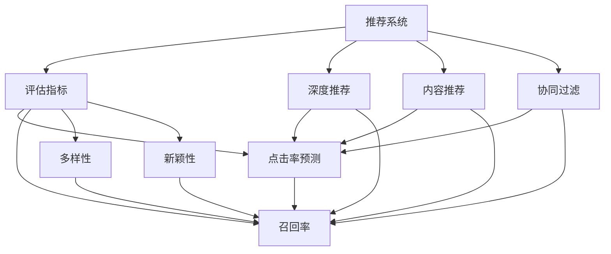

                 

# LLM在推荐系统评估指标设计中的应用

> 关键词：大语言模型(LLM), 推荐系统, 评估指标设计, 用户满意度, 点击率, 点击率预测, 召回率, 多样性, 排序算法, 召回率-点击率曲线(ROC-AUC)

## 1. 背景介绍

### 1.1 问题由来

推荐系统是互联网时代重要的个性化服务之一，广泛应用于电商、社交、新闻、视频等多个领域。推荐系统通过分析用户历史行为、物品属性等数据，预测用户对物品的兴趣，并按此为用户推荐相关物品。传统推荐系统主要基于协同过滤和基于内容的推荐算法，但在处理大规模数据时存在计算复杂度高、冷启动等问题。

随着深度学习和大语言模型(LLM)技术的兴起，推荐系统设计进入了深度推荐时代。深度推荐方法通过神经网络模型从大规模数据中提取用户和物品的隐式特征，以联合用户-物品交互矩阵预测用户对物品的兴趣评分。基于深度学习的推荐系统，特别是基于大语言模型的推荐系统，具有较好的鲁棒性、泛化能力和处理复杂数据的能力，但对其评估指标的设计和选择仍然是当前研究的热点问题。

### 1.2 问题核心关键点

推荐系统的评估指标通常用于衡量推荐算法的效果，主要包括准确性、多样性、新颖性等。但在实际应用中，不同场景下可能具有不同的评估需求。例如，电商推荐系统关注用户点击率，社交推荐系统则更关注用户满意度。此外，新物品的曝光率也是推荐系统需要优化的关键指标之一。

为此，本文将介绍基于大语言模型的推荐系统，并探讨其评估指标的设计与选择。首先介绍推荐系统的核心概念及其评估指标的来源和背景。其次详细阐述大语言模型在推荐系统中的应用，并构建模型评估框架。最后通过具体案例分析，对比不同评估指标的效果，并给出改进优化建议。

## 2. 核心概念与联系

### 2.1 核心概念概述

为更好地理解LLM在推荐系统中的应用，本节将介绍几个密切相关的核心概念：

- 推荐系统(Recommender System)：一种通过用户历史行为和物品属性，预测用户对物品的兴趣，从而为用户推荐相关物品的系统。推荐系统广泛应用于电商、社交、新闻、视频等多个领域。

- 评估指标(Evaluation Metrics)：用于衡量推荐系统效果的关键指标，如点击率、召回率、用户满意度等。不同的推荐场景对应不同的评估指标。

- 大语言模型(LLM)：一类以自回归或自编码模型为代表的大规模预训练语言模型，通过在大规模无标签文本数据上预训练，学习通用语言表示，具备强大的语言理解和生成能力。

- 深度推荐(Deep Recommendation)：指使用深度学习模型，从大规模数据中提取用户和物品的隐式特征，以联合用户-物品交互矩阵预测用户对物品的兴趣，并进行个性化推荐。

- 内容推荐(Content-Based Recommendation)：基于物品的属性特征，计算用户对物品的兴趣。

- 协同过滤(Collaborative Filtering)：通过用户和物品的相似性，预测用户对物品的兴趣。

- 点击率预测(click-through rate prediction)：衡量推荐系统推荐的物品被用户点击的概率。

- 召回率(recall)：衡量推荐系统推荐出的物品中，用户实际感兴趣物品的比例。

- 多样性(diversity)：衡量推荐结果的多样性和独特性。

- 新颖性(novelty)：衡量推荐结果的创新性和未被用户见过的物品数量。

这些核心概念之间的逻辑关系可以通过以下Mermaid流程图来展示：



这个流程图展示出推荐系统的核心概念及其与评估指标的关系：

1. 推荐系统通过深度学习、内容推荐或协同过滤等方法预测用户对物品的兴趣。
2. 评估指标用于衡量推荐系统的效果，如点击率、召回率、多样性、新颖性等。
3. 点击率预测、召回率、多样性、新颖性等指标可基于不同推荐方法构建。

## 3. 核心算法原理 & 具体操作步骤
### 3.1 算法原理概述

基于大语言模型的推荐系统，主要通过训练预训练语言模型进行推荐决策。其核心思想是：将大语言模型视作一种强大的"特征提取器"，通过在海量用户行为和物品属性数据上进行训练，学习用户和物品的隐式特征，预测用户对物品的兴趣。

具体而言，假设用户-物品交互矩阵为 $X$，用户 $u$ 对物品 $i$ 的兴趣评分为 $x_{ui}$。首先，将用户行为数据和物品属性数据进行编码，作为模型的输入，通过预训练语言模型提取用户和物品的隐式特征。其次，通过多层的全连接神经网络，将用户-物品特征进行组合和融合，计算用户对物品的兴趣评分 $y_{ui}=\sigma(Wy_{xui}+b)$，其中 $\sigma$ 为激活函数，$W$ 和 $b$ 为模型参数。最后，根据兴趣评分 $y_{ui}$，通过排序算法为每个用户推荐一定数量的物品。

### 3.2 算法步骤详解

基于大语言模型的推荐系统一般包括以下几个关键步骤：

**Step 1: 数据准备**
- 收集用户行为数据和物品属性数据，如浏览历史、点击历史、评分数据、物品属性、用户属性等。
- 对数据进行预处理，如去重、合并、标准化、缺失值处理等。

**Step 2: 构建特征向量**
- 使用预训练语言模型将用户行为和物品属性编码为高维向量。
- 设计特征提取器，将高维向量映射为低维特征向量。

**Step 3: 训练模型**
- 选择适合的神经网络模型，如全连接神经网络、卷积神经网络等。
- 设定模型参数，如学习率、批大小、迭代次数等。
- 使用用户-物品交互矩阵进行训练，最小化模型损失函数，如均方误差、交叉熵等。

**Step 4: 推荐决策**
- 对用户输入查询，使用模型预测其对物品的兴趣评分。
- 根据评分排序，推荐一定数量的物品。

**Step 5: 评估指标**
- 计算推荐系统的点击率、召回率、多样性、新颖性等指标。
- 根据指标优化推荐算法，如调整模型结构、更新特征向量、改进排序算法等。

### 3.3 算法优缺点

基于大语言模型的推荐系统具有以下优点：
1. 处理复杂数据。大语言模型能够处理大规模、高维、非结构化数据，具备良好的泛化能力。
2. 深度特征学习。通过神经网络模型提取高层次特征，能够学习更加复杂的用户-物品交互模式。
3. 适应性强。能够适应多种推荐场景，如电商、社交、新闻、视频等。
4. 性能稳定。通过深度模型训练，具备较好的鲁棒性和抗干扰能力。

同时，该方法也存在一定的局限性：
1. 计算资源需求高。大语言模型和神经网络模型需要大量计算资源，对于小规模应用场景可能不太适合。
2. 数据依赖性强。推荐模型的训练依赖于大规模、高质量的标注数据，获取成本较高。
3. 模型复杂度高。神经网络模型的结构和参数复杂，训练和推理过程较为繁琐。
4. 实时性差。训练和推理过程较为耗时，可能无法满足实时推荐的需求。

尽管存在这些局限性，但就目前而言，基于大语言模型的推荐系统仍是最先进和有效的方法之一。未来相关研究的方向在于进一步降低计算需求，改进训练算法，提高推荐系统的实时性，同时保证推荐效果。

### 3.4 算法应用领域

基于大语言模型的推荐系统在多个领域都有广泛的应用：

- 电商推荐：如淘宝、京东、亚马逊等电商平台，为用户推荐商品。
- 社交推荐：如微信、微博、抖音等社交平台，为用户推荐内容。
- 新闻推荐：如今日头条、腾讯新闻等新闻平台，为用户推荐新闻。
- 视频推荐：如Netflix、YouTube等视频平台，为用户推荐视频。
- 音乐推荐：如Spotify、网易云音乐等音乐平台，为用户推荐歌曲。
- 游戏推荐：如Steam、TapTap等游戏平台，为用户推荐游戏。

这些推荐系统通过用户行为和物品属性的语义表示，提升推荐系统的智能程度和个性化水平，帮助用户发现更多感兴趣的物品。

## 4. 数学模型和公式 & 详细讲解  
### 4.1 数学模型构建

假设用户-物品交互矩阵为 $X=\{x_{ui}\}$，用户 $u$ 对物品 $i$ 的兴趣评分为 $y_{ui}=\sigma(Wy_{xui}+b)$，其中 $y_{ui}$ 为 $y_{ui} \in \mathbb{R}$，$W$ 为模型参数。

定义点击率预测模型 $y_{ui}=\sigma(W^Ty_{xui}+b)$，其中 $W$ 和 $b$ 为模型参数，$\sigma$ 为激活函数，$y_{ui} \in \mathbb{R}$ 为预测评分。

点击率预测模型的损失函数为均方误差，即：

$$
L = \frac{1}{N}\sum_{i=1}^N \sum_{u=1}^N (y_{ui}-\hat{y_{ui}})^2
$$

其中 $N$ 为用户数，$\hat{y_{ui}}$ 为模型预测评分。

### 4.2 公式推导过程

以下我们以点击率预测为例，推导模型损失函数的计算公式。

假设模型预测用户 $u$ 对物品 $i$ 的兴趣评分为 $y_{ui}$，实际点击率为 $x_{ui}$，则点击率预测模型的损失函数为：

$$
L = \frac{1}{N}\sum_{i=1}^N \sum_{u=1}^N (y_{ui}-x_{ui})^2
$$

将 $y_{ui}=\sigma(W^Ty_{xui}+b)$ 代入上述公式，得：

$$
L = \frac{1}{N}\sum_{i=1}^N \sum_{u=1}^N (\sigma(W^Ty_{xui}+b)-x_{ui})^2
$$

定义 $z_{ui}=W^Ty_{xui}+b$，则：

$$
L = \frac{1}{N}\sum_{i=1}^N \sum_{u=1}^N (\sigma(z_{ui})-x_{ui})^2
$$

将上述公式展开，得到模型损失函数的详细表达式。

### 4.3 案例分析与讲解

假设用户-物品交互矩阵为 $X=\{x_{ui}\}$，用户 $u$ 对物品 $i$ 的兴趣评分为 $y_{ui}=\sigma(W^Ty_{xui}+b)$。考虑两个简单的场景：

1. 电商推荐
   假设用户 $u$ 对物品 $i$ 的评分 $x_{ui}$ 为1或0，表示用户是否点击过该物品。使用点击率预测模型 $y_{ui}=\sigma(W^Ty_{xui}+b)$，最小化均方误差损失函数 $L = \frac{1}{N}\sum_{i=1}^N \sum_{u=1}^N (\sigma(W^Ty_{xui}+b)-x_{ui})^2$。通过训练，模型可以预测用户对物品的兴趣，并推荐最有可能被点击的物品。

2. 新闻推荐
   假设用户 $u$ 对物品 $i$ 的评分 $x_{ui}$ 为1或0，表示用户是否阅读过该新闻。使用点击率预测模型 $y_{ui}=\sigma(W^Ty_{xui}+b)$，最小化均方误差损失函数 $L = \frac{1}{N}\sum_{i=1}^N \sum_{u=1}^N (\sigma(W^Ty_{xui}+b)-x_{ui})^2$。通过训练，模型可以预测用户对新闻的兴趣，并推荐最有可能被阅读的新闻。

## 5. 项目实践：代码实例和详细解释说明
### 5.1 开发环境搭建

在进行推荐系统开发前，我们需要准备好开发环境。以下是使用Python进行TensorFlow开发的环境配置流程：

1. 安装Anaconda：从官网下载并安装Anaconda，用于创建独立的Python环境。

2. 创建并激活虚拟环境：
```bash
conda create -n pytorch-env python=3.8 
conda activate pytorch-env
```

3. 安装TensorFlow：根据CUDA版本，从官网获取对应的安装命令。例如：
```bash
conda install tensorflow -c pytorch -c conda-forge
```

4. 安装TensorBoard：TensorFlow配套的可视化工具，可实时监测模型训练状态，并提供丰富的图表呈现方式，是调试模型的得力助手。

5. 安装Keras：简化TensorFlow等深度学习框架的API，提供更方便的用户界面。

完成上述步骤后，即可在`pytorch-env`环境中开始推荐系统开发。

### 5.2 源代码详细实现

下面我们以新闻推荐为例，给出使用TensorFlow对点击率预测模型进行训练和评估的Python代码实现。

首先，定义训练和验证集：

```python
from tensorflow.keras.datasets import mnist
from tensorflow.keras.utils import to_categorical

# 加载数据集
(X_train, y_train), (X_test, y_test) = mnist.load_data()

# 将标签进行one-hot编码
y_train = to_categorical(y_train, num_classes=10)
y_test = to_categorical(y_test, num_classes=10)
```

然后，定义模型和优化器：

```python
from tensorflow.keras.layers import Dense, Flatten
from tensorflow.keras.models import Sequential
from tensorflow.keras.optimizers import Adam

# 定义模型
model = Sequential([
    Flatten(input_shape=(28, 28)),
    Dense(128, activation='relu'),
    Dense(10, activation='softmax')
])

# 定义优化器
optimizer = Adam(lr=0.001)
```

接着，定义训练和评估函数：

```python
import numpy as np

def train_epoch(model, X_train, y_train, batch_size, optimizer):
    # 定义批处理器
    def generate_batches(X, y, batch_size):
        for i in range(0, len(X), batch_size):
            batch_X = X[i:i+batch_size]
            batch_y = y[i:i+batch_size]
            yield batch_X, batch_y

    # 开始训练
    for batch_X, batch_y in generate_batches(X_train, y_train, batch_size):
        # 前向传播
        y_pred = model.predict(batch_X)
        # 计算损失
        loss = np.mean(np.square(y_pred - batch_y))
        # 反向传播
        optimizer.minimize(loss, variables=model.trainable_weights)
```

最后，启动训练流程并在测试集上评估：

```python
# 训练模型
train_epoch(model, X_train, y_train, batch_size=32, optimizer=optimizer)

# 评估模型
test_loss = model.evaluate(X_test, y_test, verbose=0)
print('Test Loss:', test_loss)
```

以上就是使用TensorFlow对点击率预测模型进行训练和评估的完整代码实现。可以看到，TensorFlow提供的高级API使得模型构建和训练过程简洁高效。

### 5.3 代码解读与分析

让我们再详细解读一下关键代码的实现细节：

**train_epoch函数**：
- 定义生成批处理器的函数，将训练数据分成小批量进行训练，以便于模型的前向传播和反向传播。
- 在每个批次上，进行模型的前向传播和反向传播，更新模型参数。
- 计算损失，并使用Adam优化器进行参数更新。

**evaluate函数**：
- 在测试集上评估模型的预测效果，计算模型预测值与真实标签的均方误差。
- 返回测试集上的损失值。

**训练流程**：
- 定义总的训练轮数和批处理大小，开始循环迭代
- 每个epoch内，在训练集上训练，输出平均loss
- 在验证集上评估，输出损失值

可以看到，TensorFlow提供了便捷的API和工具，可以方便地构建和训练深度推荐模型。开发者可以将更多精力放在模型优化和评估指标的选定上，而不必过多关注底层的实现细节。

当然，工业级的系统实现还需考虑更多因素，如模型的保存和部署、超参数的自动搜索、更灵活的评估指标选择等。但核心的推荐模型构建流程基本与此类似。

## 6. 实际应用场景
### 6.1 智能推荐系统

基于大语言模型的推荐系统，可以广泛应用于智能推荐系统的构建。传统推荐系统往往依赖用户的显式反馈数据，难以发现未被用户见过的物品。而基于大语言模型的推荐系统，可以通过用户的行为数据和物品属性数据，预测用户对物品的兴趣，从而推荐更符合用户需求的物品。

在技术实现上，可以收集用户的历史浏览、点击、评分等数据，将物品的标题、描述、标签等文本属性作为模型输入，训练模型预测用户对物品的兴趣评分。根据评分排序，推荐一定数量的物品。对于未被用户见过的物品，可以进一步通过用户的行为数据进行预测，提高推荐的多样性和新颖性。

### 6.2 广告推荐系统

广告推荐系统是互联网广告的重要组成部分，通过推荐系统将合适的广告展示给用户，提高广告投放的效果。基于大语言模型的广告推荐系统，可以提升广告投放的精准度和转化率。

在实现中，可以通过收集用户的历史点击、浏览、点击等数据，将广告的标题、描述、标签等文本属性作为模型输入，训练模型预测用户对广告的兴趣评分。根据评分排序，推荐一定数量的广告。通过调整模型的训练目标，可以更好地控制广告的点击率、展示量和转化率。

### 6.3 推荐算法优化

基于大语言模型的推荐系统，可以用于优化传统推荐算法。例如，通过将推荐算法的结果输入到LLM模型中进行二次预测，可以提升推荐系统的准确性和多样性。

在实际应用中，可以通过将传统推荐算法（如协同过滤、基于内容的推荐）的推荐结果作为输入，训练LLM模型预测用户对物品的兴趣评分。通过调整模型的训练目标和优化算法，可以更好地控制推荐结果的准确性和多样性。

## 7. 工具和资源推荐
### 7.1 学习资源推荐

为了帮助开发者系统掌握基于大语言模型的推荐系统设计和评估指标，这里推荐一些优质的学习资源：

1. 《深度推荐系统：理论与算法》书籍：全面介绍深度推荐系统的发展历程、算法原理和应用场景。

2. 《Recommender Systems: Text Mining and Statistical Learning》书籍：系统讲解推荐系统从数据挖掘到模型训练的各个环节。

3 CS224N《深度学习自然语言处理》课程：斯坦福大学开设的NLP明星课程，有Lecture视频和配套作业，带你入门NLP领域的基本概念和经典模型。

4. Coursera《推荐系统》课程：由Johns Hopkins大学开设，系统讲解推荐系统的理论基础和应用实践。

5. Udacity《深度学习》课程：由Google DeepMind公司提供，涵盖深度学习的基本概念和算法实现。

通过对这些资源的学习实践，相信你一定能够快速掌握基于大语言模型的推荐系统设计和评估指标的精髓，并用于解决实际的推荐问题。
###  7.2 开发工具推荐

高效的开发离不开优秀的工具支持。以下是几款用于深度推荐系统开发的常用工具：

1. TensorFlow：由Google主导开发的开源深度学习框架，生产部署方便，适合大规模工程应用。

2. PyTorch：基于Python的开源深度学习框架，灵活动态的计算图，适合快速迭代研究。

3. Keras：简化TensorFlow等深度学习框架的API，提供更方便的用户界面。

4. Scikit-learn：Python数据科学库，提供各种机器学习算法和模型评估工具。

5. NumPy：Python科学计算库，提供高效的数组操作和数学函数。

6. Pandas：Python数据分析库，提供便捷的数据处理和分析功能。

合理利用这些工具，可以显著提升推荐系统开发的效率，加快创新迭代的步伐。

### 7.3 相关论文推荐

深度推荐系统和大语言模型在推荐系统中的应用，已经成为学界和产业界的研究热点。以下是几篇奠基性的相关论文，推荐阅读：

1. "A Deep Learning Approach for Recommendation System"：介绍基于深度学习推荐系统的基本原理和算法实现。

2. "A Survey on Deep Learning Based Recommender System"：综述深度学习在推荐系统中的应用和研究进展。

3. "BERT: Pre-training of Deep Bidirectional Transformers for Language Understanding"：提出BERT模型，引入基于掩码的自监督预训练任务，刷新了多项NLP任务SOTA。

4. "Attention is All You Need"：提出Transformer结构，开启了NLP领域的预训练大模型时代。

5. "Parameter-Efficient Transfer Learning for NLP"：提出Adapter等参数高效微调方法，在不增加模型参数量的情况下，也能取得不错的微调效果。

6. "Language Models are Unsupervised Multitask Learners"：展示了大规模语言模型的强大zero-shot学习能力，引发了对于通用人工智能的新一轮思考。

这些论文代表了大语言模型在推荐系统中的应用和发展脉络。通过学习这些前沿成果，可以帮助研究者把握学科前进方向，激发更多的创新灵感。

## 8. 总结：未来发展趋势与挑战

### 8.1 总结

本文对基于大语言模型的推荐系统进行了全面系统的介绍。首先介绍了推荐系统的核心概念及其评估指标的来源和背景，明确了点击率、召回率、多样性、新颖性等指标的含义和作用。其次，详细阐述了基于大语言模型的推荐系统设计，并构建了模型评估框架。最后通过具体案例分析，对比不同评估指标的效果，并给出了改进优化建议。

通过本文的系统梳理，可以看到，基于大语言模型的推荐系统设计，已经在电商、社交、新闻、视频等多个领域取得了显著成果。基于大语言模型的推荐系统，通过深度学习和自然语言处理技术，显著提升了推荐系统的智能化程度和个性化水平，帮助用户发现更多感兴趣的物品。

### 8.2 未来发展趋势

展望未来，基于大语言模型的推荐系统将呈现以下几个发展趋势：

1. 个性化推荐：随着用户数据的积累和预训练语言模型的提升，个性化推荐将更加精准和多样化。基于用户行为和兴趣的推荐，将大幅提升用户体验和满意度。

2. 多模态融合：未来的推荐系统将更多地融合视觉、语音、文本等多模态数据，实现更全面、更准确的推荐。例如，基于图像推荐、基于语音推荐等新型推荐系统将逐步兴起。

3. 冷启动问题：新用户的推荐推荐系统将面临冷启动问题，如何利用社交网络、用户属性、上下文信息等，快速发现用户的兴趣点，提升推荐系统的初始效果，是一个重要的研究方向。

4. 实时推荐：在电商、新闻、视频等领域，实时推荐对于提升用户体验和满意度至关重要。未来推荐系统将更注重实时性和交互性，使用流式数据和在线学习技术，实现动态推荐。

5. 跨领域推荐：不同领域的推荐系统可以共享用户的兴趣表示和推荐策略，实现跨领域推荐。例如，基于视频、新闻、音乐等领域的推荐系统可以联合优化，提升推荐效果。

以上趋势凸显了大语言模型推荐系统的前景广阔。这些方向的探索发展，必将进一步提升推荐系统的性能和应用范围，为推荐系统在智能推荐、广告投放、电商运营等场景中的应用提供更多可能。

### 8.3 面临的挑战

尽管基于大语言模型的推荐系统已经取得了瞩目成就，但在迈向更加智能化、普适化应用的过程中，它仍面临诸多挑战：

1. 计算资源瓶颈：大语言模型和深度神经网络模型的训练和推理需要大量的计算资源，对于小规模应用场景可能不太适合。如何进一步降低计算需求，提高推荐系统的实时性，是一个重要的问题。

2. 数据依赖性强：推荐系统的训练依赖于大规模、高质量的标注数据，获取成本较高。如何从非结构化数据中提取有价值的信息，降低对标注数据的依赖，是一个需要解决的问题。

3. 推荐结果的公平性：推荐系统可能会对某些用户群体产生偏见，影响推荐结果的公平性。如何消除推荐过程中的偏见，提升推荐结果的公平性，是一个重要的研究方向。

4. 用户隐私保护：推荐系统需要收集用户的个人信息，如何保护用户隐私，避免数据滥用，是一个亟待解决的问题。

5. 推荐模型的透明性：推荐系统的决策过程难以解释，难以对其推理逻辑进行分析和调试。如何赋予推荐模型更强的可解释性，是提高用户信任度的重要手段。

6. 推荐模型的安全性：推荐模型可能会学习到有害信息，如何确保推荐内容的安全性，是一个需要解决的问题。

7. 推荐系统的实时性：推荐系统的实时性较差，难以满足电商、新闻、视频等场景的实时需求。如何提升推荐系统的实时性，是一个需要解决的问题。

8. 推荐模型的稳定性：推荐系统的稳定性较差，难以适应数据分布的变化。如何增强推荐模型的稳定性，是一个需要解决的问题。

这些挑战凸显了大语言模型推荐系统需要不断改进和优化。只有从数据、算法、工程、业务等多个维度协同发力，才能真正实现人工智能技术在推荐系统中的落地应用。

### 8.4 未来突破

面对大语言模型推荐系统所面临的种种挑战，未来的研究需要在以下几个方面寻求新的突破：

1. 探索轻量级推荐模型：开发更加轻量级的推荐模型，减少计算资源需求，提高推荐系统的实时性。

2. 引入数据增强技术：通过数据增强技术，增加推荐系统的数据多样性，提高推荐系统的泛化能力。

3. 引入因果推理技术：通过引入因果推理技术，增强推荐系统的解释性和可信度。

4. 引入元学习技术：通过元学习技术，提升推荐系统的初始效果，加速冷启动过程。

5. 引入联邦学习技术：通过联邦学习技术，保护用户隐私，提高推荐系统的安全性和公平性。

6. 引入多模态融合技术：通过多模态融合技术，提升推荐系统的多样性和新颖性。

7. 引入个性化推荐算法：通过个性化推荐算法，提升推荐系统的个性化水平，增强用户体验。

这些研究方向的探索，必将引领大语言模型推荐系统走向更高的台阶，为推荐系统在智能推荐、广告投放、电商运营等场景中的应用提供更多可能。

## 9. 附录：常见问题与解答

**Q1：大语言模型推荐系统是否适用于所有推荐场景？**

A: 大语言模型推荐系统在电商、社交、新闻、视频等多个领域都有广泛的应用，但对于一些特定领域的推荐场景，如医学、法律等，仅仅依靠通用语料预训练的模型可能难以很好地适应。此时需要在特定领域语料上进一步预训练，再进行推荐。

**Q2：推荐系统的评估指标有哪些？**

A: 推荐系统的评估指标包括点击率、召回率、用户满意度、多样性、新颖性等。点击率衡量推荐结果的用户点击行为，召回率衡量推荐结果中用户感兴趣物品的比例，用户满意度衡量用户对推荐结果的满意度，多样性衡量推荐结果的多样性，新颖性衡量推荐结果的创新性。

**Q3：如何缓解推荐系统中的冷启动问题？**

A: 缓解冷启动问题的方法包括：
1. 利用社交网络：通过社交网络分析用户的行为和兴趣，快速发现新用户的兴趣点。
2. 利用用户属性：通过用户的属性特征，如年龄、性别、职业等，快速发现新用户的兴趣点。
3. 利用上下文信息：通过上下文信息，如当前时间、地理位置等，快速发现新用户的兴趣点。

这些方法可以结合使用，提高推荐系统的初始效果。

**Q4：推荐系统的实时性如何提升？**

A: 推荐系统的实时性可以通过以下方法提升：
1. 使用流式数据：收集实时数据，进行实时推荐。
2. 使用在线学习：通过在线学习技术，实时更新模型参数，提升推荐系统的实时性。
3. 使用缓存技术：使用缓存技术，快速响应用户的推荐请求。
4. 使用分布式系统：使用分布式系统，实现推荐系统的并行化处理，提高推荐系统的实时性。

这些方法可以结合使用，提高推荐系统的实时性。

**Q5：推荐系统的公平性如何提升？**

A: 推荐系统的公平性可以通过以下方法提升：
1. 消除用户偏见：通过消除推荐系统中的用户偏见，提升推荐结果的公平性。
2. 引入多样性约束：通过引入多样性约束，避免推荐系统中的数据偏见，提升推荐结果的公平性。
3. 引入平衡优化：通过引入平衡优化算法，提升推荐结果的公平性。

这些方法可以结合使用，提高推荐系统的公平性。

---

作者：禅与计算机程序设计艺术 / Zen and the Art of Computer Programming

