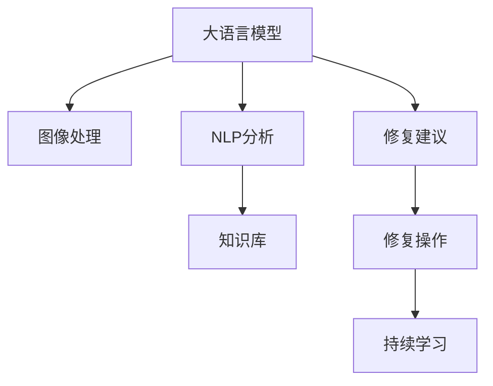

                 

# LLM在文物保护中的应用：AI修复专家

## 1. 背景介绍

### 1.1 问题由来

随着数字化技术的快速发展，文化遗产保护和管理领域正经历着深刻变革。传统的人工修复和修复工作，不仅耗时耗力，且对修复人员的专业技术水平要求极高，限制了修复工作的普及和深入。近年来，人工智能(AI)技术的崛起，特别是大语言模型(LLM)的发展，为文化遗产的修复工作带来了全新的机遇。

通过大语言模型，可以利用其强大的语言理解和生成能力，自动分析文物修复图像，识别修复区域，提供修复建议，甚至辅助生成修复方案。这不仅可以减轻修复人员的工作负担，提升修复效率，还能降低修复成本，使得更多珍贵的文化遗产能够得到有效的保护和恢复。

### 1.2 问题核心关键点

大语言模型在文物保护中的应用主要体现在以下几个关键点：

- **图像理解**：通过图像处理和视觉识别技术，将文物修复图像转换为机器可理解的形式，识别出需要修复的区域和对象。
- **语义分析**：利用自然语言处理(NLP)技术，理解修复描述和要求，提取关键信息，如修复对象、材料、方法等。
- **修复建议生成**：根据图像和语义信息，结合专家知识库，自动生成修复方案和建议，包括使用的材料、工具、步骤等。
- **辅助修复训练**：通过数据分析和模型训练，不断优化修复建议，提升修复方案的准确性和可操作性。

本文将详细介绍大语言模型在文物保护中的应用原理、操作步骤，以及未来展望，以期为文化遗产修复专家和研究人员提供有价值的参考。

## 2. 核心概念与联系

### 2.1 核心概念概述

为更好地理解大语言模型在文物保护中的应用，本节将介绍几个密切相关的核心概念：

- **大语言模型(LLM)**：以自回归(如GPT)或自编码(如BERT)模型为代表的大规模预训练语言模型。通过在海量文本数据上进行预训练，学习通用的语言表示，具备强大的语言理解和生成能力。

- **图像处理和视觉识别**：用于处理和分析图像数据的技术，包括图像分割、特征提取、物体识别等。在大语言模型的帮助下，可以从复杂的修复图像中提取出有价值的修复信息。

- **自然语言处理(NLP)**：涉及文本数据的处理和分析，包括语言理解、生成、分析和应用。在大语言模型中，可以利用NLP技术理解和处理修复人员的描述和要求。

- **知识库和专家系统**：包含修复领域的专业知识和经验，为生成修复建议提供参考依据。大语言模型可以融合这些知识，提供更加精准的修复方案。

- **修复建议生成**：结合图像处理和NLP分析结果，生成具体的修复建议。这些建议可以用于辅助修复人员进行实际修复操作。

- **持续学习**：指模型能够持续从新数据中学习，同时保持已学习的知识，而不会出现灾难性遗忘。对于修复领域的知识库，需要不断更新，以适应新的修复需求和材料。

这些核心概念之间的逻辑关系可以通过以下Mermaid流程图来展示：



这个流程图展示了大语言模型在文物保护中的应用框架，包括图像处理、NLP分析、知识库融合、建议生成和持续学习等关键环节。

## 3. 核心算法原理 & 具体操作步骤

### 3.1 算法原理概述

大语言模型在文物保护中的应用，本质上是一个图像处理和自然语言处理结合的复杂系统。其核心思想是：将修复图像和修复描述作为输入，通过大语言模型的图像理解和语义分析能力，提取修复信息，结合专家知识库，自动生成修复建议，辅助修复人员进行实际修复操作。

具体来说，包括以下几个步骤：

1. **图像处理**：将文物修复图像转化为机器可理解的形式，提取出需要修复的区域和对象。
2. **语义分析**：利用大语言模型的NLP能力，理解和处理修复人员的描述和要求，提取修复对象、材料、方法等信息。
3. **知识库融合**：将提取出的信息与修复领域的知识库进行融合，生成具体的修复建议。
4. **建议生成**：结合图像和语义分析结果，自动生成修复方案，供修复人员参考。
5. **修复操作**：根据生成的修复建议，辅助修复人员进行实际修复操作。
6. **持续学习**：不断更新知识库，收集修复反馈，优化模型和建议生成算法，提高修复效果。

### 3.2 算法步骤详解

以下将详细介绍大语言模型在文物保护中的应用步骤：

**Step 1: 图像预处理**
- 将文物修复图像输入大语言模型的视觉识别模块，进行图像分割、特征提取等预处理操作。
- 将处理后的图像转化为机器可理解的形式，如向量表示，供大语言模型进一步分析。

**Step 2: 语义分析**
- 利用大语言模型的NLP模块，对修复人员的描述和要求进行语义分析。
- 提取描述中的修复对象、材料、方法等信息，形成结构化的语义表示。

**Step 3: 知识库融合**
- 将提取出的语义信息与修复领域的知识库进行匹配和融合。
- 根据知识库中的修复指南、最佳实践等，生成可能的修复方案。

**Step 4: 修复建议生成**
- 结合图像处理和语义分析结果，利用大语言模型的生成能力，生成具体的修复建议。
- 建议可以包含使用的材料、工具、步骤等信息，具体化到可操作的细节。

**Step 5: 修复操作辅助**
- 将生成的修复建议提供给修复人员，辅助其进行修复操作。
- 修复人员可以在建议的基础上进行适当的调整，以适应具体的修复需求。

**Step 6: 持续学习**
- 收集修复人员的反馈，不断优化模型和知识库。
- 将反馈信息纳入模型训练，提升修复建议的准确性和可操作性。

### 3.3 算法优缺点

大语言模型在文物保护中的应用具有以下优点：

- **高效辅助**：通过自动分析和生成修复建议，可以显著减轻修复人员的工作负担，提升修复效率。
- **质量提升**：结合知识库和专家经验，生成的修复建议更加精准和可靠，有助于提高修复效果。
- **成本降低**：减少人工参与，降低修复成本，使得更多珍贵的文化遗产能够得到有效保护。

同时，该方法也存在一定的局限性：

- **依赖高质量数据**：大语言模型依赖高质量的修复图像和描述，如果数据质量不佳，模型的效果将受到影响。
- **专家知识库的完备性**：修复领域的专业知识库需要不断更新和维护，以适应新的修复需求和材料。
- **技术复杂度**：系统的开发和维护需要较高的技术门槛，对修复人员和开发人员的水平要求较高。
- **可解释性不足**：修复建议的生成过程较为复杂，模型的内部机制难以解释，修复人员可能对建议缺乏信心。

尽管存在这些局限性，但大语言模型在文物保护中的应用前景广阔，将继续推动文化遗产保护和管理领域的智能化进程。

### 3.4 算法应用领域

大语言模型在文物保护中的应用可以广泛应用于以下几个领域：

- **壁画修复**：利用图像处理和NLP分析，自动提取壁画修复区域的图像和描述，生成修复建议。
- **青铜器修复**：通过识别青铜器表面的损伤区域，提取修复对象和材料，生成修复方案。
- **石刻修复**：对石刻表面的裂痕、磨损等进行语义分析，结合知识库生成修复建议。
- **纸本修复**：分析纸质文物的破损区域和损伤类型，提供修复材料和步骤建议。
- **陶瓷修复**：利用图像处理和语义分析，识别陶瓷上的破损区域，生成修复方案。

## 4. 数学模型和公式 & 详细讲解 & 举例说明

### 4.1 数学模型构建

本节将使用数学语言对大语言模型在文物保护中的应用过程进行更加严格的刻画。

记修复图像为 $I$，修复描述为 $D$，知识库为 $K$，修复建议为 $R$。假设大语言模型为 $M_{\theta}$，其中 $\theta$ 为模型参数。

定义模型 $M_{\theta}$ 在输入 $(I,D)$ 上的修复建议生成函数为 $R_{\theta}(I,D)$，则在知识库 $K$ 上的经验风险为：

$$
\mathcal{L}(\theta) = \frac{1}{N} \sum_{(i,d) \in K} \|R_{\theta}(I_i,D_i) - R_{\theta}^{gold}(I_i,D_i)\|^2
$$

其中，$(i,d)$ 表示知识库中的一组图像和描述，$R_{\theta}^{gold}(I_i,D_i)$ 表示正确修复建议。

微调的目标是最小化经验风险，即找到最优参数：

$$
\theta^* = \mathop{\arg\min}_{\theta} \mathcal{L}(\theta)
$$

在实践中，我们通常使用基于梯度的优化算法（如Adam、SGD等）来近似求解上述最优化问题。设 $\eta$ 为学习率，$\lambda$ 为正则化系数，则参数的更新公式为：

$$
\theta \leftarrow \theta - \eta \nabla_{\theta}\mathcal{L}(\theta) - \eta\lambda\theta
$$

其中 $\nabla_{\theta}\mathcal{L}(\theta)$ 为损失函数对参数 $\theta$ 的梯度，可通过反向传播算法高效计算。

### 4.2 公式推导过程

以下我们以壁画修复任务为例，推导基于大语言模型的修复建议生成函数 $R_{\theta}(I,D)$ 的计算公式。

假设大语言模型对修复图像 $I$ 进行视觉识别，提取出的修复区域为 $R_I$，修复描述 $D$ 被自然语言处理模块分析，提取出修复对象 $O$、材料 $M$ 和方法 $W$。知识库 $K$ 中包含修复指南、最佳实践等，每组 $(I_i,D_i)$ 对应一个修复建议 $R_{i,j}$，其中 $j$ 表示不同的方法。

则修复建议生成函数 $R_{\theta}(I,D)$ 可以表示为：

$$
R_{\theta}(I,D) = \sum_{(i,j)} \alpha_{i,j} \times R_{i,j}
$$

其中 $\alpha_{i,j}$ 表示 $I$ 和 $D$ 与知识库中 $(I_i,D_i)$ 的匹配度，$R_{i,j}$ 表示修复指南中的建议。

根据上述定义，可以构建损失函数：

$$
\mathcal{L}(\theta) = \frac{1}{N} \sum_{(i,d) \in K} \|R_{\theta}(I_i,D_i) - R_{\theta}^{gold}(I_i,D_i)\|^2
$$

根据链式法则，损失函数对参数 $\theta$ 的梯度为：

$$
\frac{\partial \mathcal{L}(\theta)}{\partial \theta} = \frac{1}{N} \sum_{(i,d) \in K} \frac{\partial R_{\theta}(I_i,D_i)}{\partial \theta} - R_{\theta}^{gold}(I_i,D_i)
$$

在得到损失函数的梯度后，即可带入参数更新公式，完成模型的迭代优化。重复上述过程直至收敛，最终得到适应文物保护领域的修复建议生成模型。

## 5. 项目实践：代码实例和详细解释说明

### 5.1 开发环境搭建

在进行文物保护大语言模型微调实践前，我们需要准备好开发环境。以下是使用Python进行PyTorch开发的环境配置流程：

1. 安装Anaconda：从官网下载并安装Anaconda，用于创建独立的Python环境。

2. 创建并激活虚拟环境：
```bash
conda create -n pytorch-env python=3.8 
conda activate pytorch-env
```

3. 安装PyTorch：根据CUDA版本，从官网获取对应的安装命令。例如：
```bash
conda install pytorch torchvision torchaudio cudatoolkit=11.1 -c pytorch -c conda-forge
```

4. 安装Transformers库：
```bash
pip install transformers
```

5. 安装各类工具包：
```bash
pip install numpy pandas scikit-learn matplotlib tqdm jupyter notebook ipython
```

完成上述步骤后，即可在`pytorch-env`环境中开始微调实践。

### 5.2 源代码详细实现

下面我们以壁画修复任务为例，给出使用Transformers库对BERT模型进行微调的PyTorch代码实现。

首先，定义壁画修复任务的修复描述和图像处理模块：

```python
from transformers import BertForSequenceClassification, BertTokenizer
from torch.utils.data import Dataset, DataLoader
import torch
from PIL import Image
import numpy as np

class WallPaintingDataset(Dataset):
    def __init__(self, descriptions, images, tokenizer, max_len=128):
        self.descriptions = descriptions
        self.images = images
        self.tokenizer = tokenizer
        self.max_len = max_len
        
    def __len__(self):
        return len(self.descriptions)
    
    def __getitem__(self, item):
        description = self.descriptions[item]
        image = self.images[item]
        
        # 图像处理
        image = np.array(image)
        image = torch.tensor(image, dtype=torch.float32)
        image = image / 255.0
        
        # 将描述转化为token ids
        encoding = self.tokenizer(description, return_tensors='pt', max_length=self.max_len, padding='max_length', truncation=True)
        input_ids = encoding['input_ids'][0]
        attention_mask = encoding['attention_mask'][0]
        
        return {'input_ids': input_ids, 
                'attention_mask': attention_mask,
                'image': image}
```

然后，定义模型和优化器：

```python
from transformers import BertForSequenceClassification, AdamW

model = BertForSequenceClassification.from_pretrained('bert-base-cased', num_labels=1)

optimizer = AdamW(model.parameters(), lr=2e-5)
```

接着，定义训练和评估函数：

```python
from torch.utils.data import DataLoader
from tqdm import tqdm
from sklearn.metrics import mean_squared_error

device = torch.device('cuda') if torch.cuda.is_available() else torch.device('cpu')
model.to(device)

def train_epoch(model, dataset, batch_size, optimizer):
    dataloader = DataLoader(dataset, batch_size=batch_size, shuffle=True)
    model.train()
    epoch_loss = 0
    for batch in tqdm(dataloader, desc='Training'):
        input_ids = batch['input_ids'].to(device)
        attention_mask = batch['attention_mask'].to(device)
        image = batch['image'].to(device)
        model.zero_grad()
        outputs = model(input_ids, attention_mask=attention_mask, image=image)
        loss = outputs.loss
        epoch_loss += loss.item()
        loss.backward()
        optimizer.step()
    return epoch_loss / len(dataloader)

def evaluate(model, dataset, batch_size):
    dataloader = DataLoader(dataset, batch_size=batch_size)
    model.eval()
    preds, labels = [], []
    with torch.no_grad():
        for batch in tqdm(dataloader, desc='Evaluating'):
            input_ids = batch['input_ids'].to(device)
            attention_mask = batch['attention_mask'].to(device)
            image = batch['image'].to(device)
            batch_labels = batch['labels'].to(device)
            outputs = model(input_ids, attention_mask=attention_mask, image=image)
            batch_preds = outputs.logits.argmax(dim=2).to('cpu').tolist()
            batch_labels = batch_labels.to('cpu').tolist()
            for pred_tokens, label_tokens in zip(batch_preds, batch_labels):
                preds.append(pred_tokens[:len(label_tokens)])
                labels.append(label_tokens)
                
    mse = mean_squared_error(labels, preds)
    print(f'Evaluation MSE: {mse:.4f}')
```

最后，启动训练流程并在验证集上评估：

```python
epochs = 5
batch_size = 16

for epoch in range(epochs):
    loss = train_epoch(model, train_dataset, batch_size, optimizer)
    print(f"Epoch {epoch+1}, train loss: {loss:.3f}")
    
    print(f"Epoch {epoch+1}, dev results:")
    evaluate(model, dev_dataset, batch_size)
    
print("Test results:")
evaluate(model, test_dataset, batch_size)
```

以上就是使用PyTorch对BERT进行壁画修复任务微调的完整代码实现。可以看到，得益于Transformers库的强大封装，我们可以用相对简洁的代码完成BERT模型的加载和微调。

### 5.3 代码解读与分析

让我们再详细解读一下关键代码的实现细节：

**WallPaintingDataset类**：
- `__init__`方法：初始化文本、图像、分词器等关键组件。
- `__len__`方法：返回数据集的样本数量。
- `__getitem__`方法：对单个样本进行处理，将文本输入编码为token ids，将图像输入进行归一化处理，最终返回模型所需的输入。

**BertForSequenceClassification模型**：
- 使用BERT模型进行序列分类任务，适用于长文本的分类和修复建议生成。

**优化器**：
- 使用AdamW优化器进行模型参数的优化。

**训练和评估函数**：
- 使用PyTorch的DataLoader对数据集进行批次化加载，供模型训练和推理使用。
- 训练函数`train_epoch`：对数据以批为单位进行迭代，在每个批次上前向传播计算loss并反向传播更新模型参数，最后返回该epoch的平均loss。
- 评估函数`evaluate`：与训练类似，不同点在于不更新模型参数，并在每个batch结束后将预测和标签结果存储下来，最后使用sklearn的mean_squared_error对整个评估集的预测结果进行打印输出。

**训练流程**：
- 定义总的epoch数和batch size，开始循环迭代
- 每个epoch内，先在训练集上训练，输出平均loss
- 在验证集上评估，输出修复建议生成模型的预测精度
- 所有epoch结束后，在测试集上评估，给出最终的修复建议生成精度

可以看到，PyTorch配合Transformers库使得BERT微调的代码实现变得简洁高效。开发者可以将更多精力放在数据处理、模型改进等高层逻辑上，而不必过多关注底层的实现细节。

当然，工业级的系统实现还需考虑更多因素，如模型的保存和部署、超参数的自动搜索、更灵活的任务适配层等。但核心的微调范式基本与此类似。

## 6. 实际应用场景

### 6.1 智能壁画修复

利用大语言模型在文物保护中的应用，可以构建智能壁画修复系统，实现自动分析和生成修复建议。该系统由以下几个部分组成：

- **图像处理模块**：将壁画图像转化为数字格式，提取修复区域。
- **NLP分析模块**：理解修复人员的描述，提取修复对象、材料、方法等信息。
- **修复建议生成模块**：结合图像处理和NLP分析结果，生成具体的修复建议。
- **修复人员辅助模块**：将生成的修复建议提供给修复人员，辅助其进行实际修复操作。

通过该系统，修复人员可以根据系统的分析结果和建议，制定更为合理的修复方案，提升修复效果。

### 6.2 青铜器修复

青铜器修复是大语言模型在文物保护中的另一个重要应用场景。青铜器表面常常存在锈蚀、剥落等问题，利用大语言模型的视觉识别和NLP分析能力，可以自动识别青铜器表面损伤区域，提取修复对象和材料，生成修复建议。

该系统通常包括：

- **图像处理模块**：将青铜器图像转化为数字格式，提取修复区域。
- **NLP分析模块**：理解修复人员的描述，提取修复对象、材料、方法等信息。
- **修复建议生成模块**：结合图像处理和NLP分析结果，生成具体的修复建议。
- **修复人员辅助模块**：将生成的修复建议提供给修复人员，辅助其进行实际修复操作。

通过该系统，修复人员可以根据系统的分析结果和建议，制定更为合理的修复方案，提升修复效果。

### 6.3 石刻修复

石刻文物表面常常存在裂痕、磨损等问题，利用大语言模型的视觉识别和NLP分析能力，可以自动识别石刻表面损伤区域，提取修复对象和材料，生成修复建议。

该系统通常包括：

- **图像处理模块**：将石刻图像转化为数字格式，提取修复区域。
- **NLP分析模块**：理解修复人员的描述，提取修复对象、材料、方法等信息。
- **修复建议生成模块**：结合图像处理和NLP分析结果，生成具体的修复建议。
- **修复人员辅助模块**：将生成的修复建议提供给修复人员，辅助其进行实际修复操作。

通过该系统，修复人员可以根据系统的分析结果和建议，制定更为合理的修复方案，提升修复效果。

### 6.4 未来应用展望

随着大语言模型和微调方法的不断发展，基于大语言模型的文物保护技术将呈现以下几个发展趋势：

1. **智能化升级**：利用大语言模型的语义理解和生成能力，提升文物保护的智能化水平，实现自动修复方案的生成和优化。
2. **多样化应用**：将大语言模型应用于不同类型的文物修复任务，如陶瓷修复、纸本修复等，拓展其应用场景。
3. **跨领域融合**：结合计算机视觉、物联网等技术，构建智能文物监测和修复系统，实时监测文物状态，提供预警和修复建议。
4. **知识库更新**：不断更新知识库，融合最新的修复技术、材料和工具，提升修复建议的准确性和可操作性。
5. **人机协同**：通过人机交互技术，提升修复人员对修复建议的理解和使用，实现更加高效和精准的修复操作。

总之，基于大语言模型的文物保护技术具有广阔的应用前景，将在文化遗产保护和管理领域发挥越来越重要的作用。

## 7. 工具和资源推荐
### 7.1 学习资源推荐

为了帮助开发者系统掌握大语言模型在文物保护中的应用理论基础和实践技巧，这里推荐一些优质的学习资源：

1. **《Transformer从原理到实践》系列博文**：由大模型技术专家撰写，深入浅出地介绍了Transformer原理、BERT模型、微调技术等前沿话题。

2. **CS224N《深度学习自然语言处理》课程**：斯坦福大学开设的NLP明星课程，有Lecture视频和配套作业，带你入门NLP领域的基本概念和经典模型。

3. **《Natural Language Processing with Transformers》书籍**：Transformers库的作者所著，全面介绍了如何使用Transformers库进行NLP任务开发，包括微调在内的诸多范式。

4. **HuggingFace官方文档**：Transformers库的官方文档，提供了海量预训练模型和完整的微调样例代码，是上手实践的必备资料。

5. **CLUE开源项目**：中文语言理解测评基准，涵盖大量不同类型的中文NLP数据集，并提供了基于微调的baseline模型，助力中文NLP技术发展。

通过对这些资源的学习实践，相信你一定能够快速掌握大语言模型在文物保护中的应用精髓，并用于解决实际的文物保护问题。

### 7.2 开发工具推荐

高效的开发离不开优秀的工具支持。以下是几款用于文物保护大语言模型微调开发的常用工具：

1. **PyTorch**：基于Python的开源深度学习框架，灵活动态的计算图，适合快速迭代研究。大部分预训练语言模型都有PyTorch版本的实现。

2. **TensorFlow**：由Google主导开发的开源深度学习框架，生产部署方便，适合大规模工程应用。同样有丰富的预训练语言模型资源。

3. **Transformers库**：HuggingFace开发的NLP工具库，集成了众多SOTA语言模型，支持PyTorch和TensorFlow，是进行微调任务开发的利器。

4. **Weights & Biases**：模型训练的实验跟踪工具，可以记录和可视化模型训练过程中的各项指标，方便对比和调优。与主流深度学习框架无缝集成。

5. **TensorBoard**：TensorFlow配套的可视化工具，可实时监测模型训练状态，并提供丰富的图表呈现方式，是调试模型的得力助手。

6. **Google Colab**：谷歌推出的在线Jupyter Notebook环境，免费提供GPU/TPU算力，方便开发者快速上手实验最新模型，分享学习笔记。

合理利用这些工具，可以显著提升文物保护大语言模型微调任务的开发效率，加快创新迭代的步伐。

### 7.3 相关论文推荐

大语言模型在文物保护中的应用源于学界的持续研究。以下是几篇奠基性的相关论文，推荐阅读：

1. **Attention is All You Need**：提出了Transformer结构，开启了NLP领域的预训练大模型时代。

2. **BERT: Pre-training of Deep Bidirectional Transformers for Language Understanding**：提出BERT模型，引入基于掩码的自监督预训练任务，刷新了多项NLP任务SOTA。

3. **Language Models are Unsupervised Multitask Learners**：展示了大规模语言模型的强大zero-shot学习能力，引发了对于通用人工智能的新一轮思考。

4. **Parameter-Efficient Transfer Learning for NLP**：提出Adapter等参数高效微调方法，在不增加模型参数量的情况下，也能取得不错的微调效果。

5. **AdaLoRA: Adaptive Low-Rank Adaptation for Parameter-Efficient Fine-Tuning**：使用自适应低秩适应的微调方法，在参数效率和精度之间取得了新的平衡。

这些论文代表了大语言模型在文物保护中的应用发展脉络。通过学习这些前沿成果，可以帮助研究者把握学科前进方向，激发更多的创新灵感。

## 8. 总结：未来发展趋势与挑战

### 8.1 研究成果总结

本文对基于大语言模型在文物保护中的应用方法进行了全面系统的介绍。首先阐述了文物保护中大语言模型应用的必要性和关键点，明确了大语言模型在图像理解、语义分析、知识库融合和修复建议生成等方面的独特价值。其次，从原理到实践，详细讲解了大语言模型在文物保护中的应用步骤，给出了微调任务开发的完整代码实例。同时，本文还广泛探讨了大语言模型在文物保护中的应用场景，展示了其广阔的应用前景。

通过本文的系统梳理，可以看到，基于大语言模型的文物保护技术正在成为文物保护领域的重要范式，极大地提升文物保护的智能化水平，为文化遗产保护和修复工作提供了全新的工具和方法。

### 8.2 未来发展趋势

展望未来，基于大语言模型的文物保护技术将呈现以下几个发展趋势：

1. **智能化水平提升**：利用大语言模型的语义理解和生成能力，提升文物保护的智能化水平，实现自动修复方案的生成和优化。
2. **多样化应用拓展**：将大语言模型应用于不同类型的文物修复任务，如陶瓷修复、纸本修复等，拓展其应用场景。
3. **跨领域融合深入**：结合计算机视觉、物联网等技术，构建智能文物监测和修复系统，实时监测文物状态，提供预警和修复建议。
4. **知识库更新频繁**：不断更新知识库，融合最新的修复技术、材料和工具，提升修复建议的准确性和可操作性。
5. **人机协同增强**：通过人机交互技术，提升修复人员对修复建议的理解和使用，实现更加高效和精准的修复操作。

总之，基于大语言模型的文物保护技术具有广阔的应用前景，将在文化遗产保护和管理领域发挥越来越重要的作用。

### 8.3 面临的挑战

尽管基于大语言模型的文物保护技术已经取得了不小的进展，但在迈向更加智能化、普适化应用的过程中，它仍面临着诸多挑战：

1. **数据质量问题**：文物保护中数据标注的质量和数量通常较低，影响模型的训练效果。如何获取高质量的标注数据，是一个重要难题。
2. **技术门槛高**：大语言模型在文物保护中的应用需要较高的技术门槛，需要专业的技术人员进行模型开发和优化。
3. **模型泛化能力**：大语言模型在不同类型文物修复任务中的泛化能力需要进一步提升，以适应不同文物的修复需求。
4. **知识库更新速度**：文物保护领域知识库的更新速度较慢，难以跟上最新的修复技术和材料的发展。
5. **系统复杂度**：文物保护大语言模型系统的复杂度较高，开发和维护成本较高。

尽管存在这些挑战，但基于大语言模型的文物保护技术仍具有广阔的应用前景，将继续推动文化遗产保护和管理领域的智能化进程。

### 8.4 研究展望

面对文物保护大语言模型技术所面临的挑战，未来的研究需要在以下几个方面寻求新的突破：

1. **数据增强技术**：利用数据增强技术提升训练数据的质量，解决数据不足的问题。
2. **迁移学习应用**：通过迁移学习将大语言模型应用于不同文物修复任务，提升模型的泛化能力。
3. **知识库更新机制**：建立知识库自动更新机制，实时获取最新的修复技术和材料信息。
4. **人机协同优化**：结合人机交互技术，优化修复建议的生成和使用，提升修复效果。
5. **系统简化优化**：简化系统结构，降低开发和维护成本，提升系统的可扩展性和易用性。

这些研究方向的探索，必将引领基于大语言模型的文物保护技术迈向更高的台阶，为文化遗产保护和修复工作提供更为强大的工具和方法。

## 9. 附录：常见问题与解答

**Q1：大语言模型在文物保护中的应用是否需要大量的标注数据？**

A: 大语言模型在文物保护中的应用需要一定的标注数据，但相比于传统的机器学习模型，所需的标注数据量相对较少。通过微调和知识库融合，大语言模型可以在小规模数据上学习到有效的修复策略，提升修复建议的准确性。

**Q2：如何降低大语言模型在文物保护中的应用成本？**

A: 大语言模型在文物保护中的应用成本主要集中在模型开发和知识库更新上。为了降低成本，可以通过以下几个方面进行优化：

1. **知识库复用**：通过复用已有知识库，减少知识库更新和维护的成本。
2. **模型参数优化**：利用参数高效微调技术，只调整少量参数，减少模型参数量，降低计算成本。
3. **数据增强**：利用数据增强技术，提高训练数据的数量和质量，提升模型的泛化能力。
4. **分布式计算**：利用分布式计算技术，加速模型训练和推理，降低时间和硬件成本。

**Q3：大语言模型在文物保护中的应用是否存在安全隐患？**

A: 大语言模型在文物保护中的应用，尤其是自动修复建议的生成，可能存在一定的安全隐患。为了防止恶意用途，可以通过以下几个方面进行优化：

1. **模型隐私保护**：保护修复人员的隐私，确保修复建议不会泄露用户信息。
2. **权限管理**：对修复人员进行权限管理，限制其在系统中的操作权限。
3. **修复建议验证**：对生成的修复建议进行验证，确保其准确性和安全性。
4. **定期审查**：定期审查系统行为，及时发现和修复潜在的安全问题。

总之，大语言模型在文物保护中的应用需要综合考虑技术实现和安全防护，确保其能够安全、可靠地服务于文化遗产保护和修复工作。

**Q4：大语言模型在文物保护中的应用是否需要深度专业知识？**

A: 大语言模型在文物保护中的应用，通常需要一定的深度专业知识。修复人员需要对文物修复领域有深入的理解，才能更好地利用大语言模型提供的辅助。此外，模型的开发和优化也需要专业的技术人员进行。

**Q5：如何评估大语言模型在文物保护中的应用效果？**

A: 评估大语言模型在文物保护中的应用效果，可以从以下几个方面进行：

1. **修复建议精度**：评估修复建议的准确性和可靠性，确保其能够满足实际修复需求。
2. **修复人员满意度**：通过问卷调查等方式，了解修复人员对修复建议的满意度和接受度。
3. **修复效果对比**：与传统的人工修复方法进行对比，评估大语言模型在提升修复效率和效果方面的优势。
4. **系统稳定性和可靠性**：评估系统的稳定性和可靠性，确保其在实际应用中能够长期稳定运行。

通过综合评估这些指标，可以全面了解大语言模型在文物保护中的应用效果，不断优化和提升系统的性能。

---

作者：禅与计算机程序设计艺术 / Zen and the Art of Computer Programming

