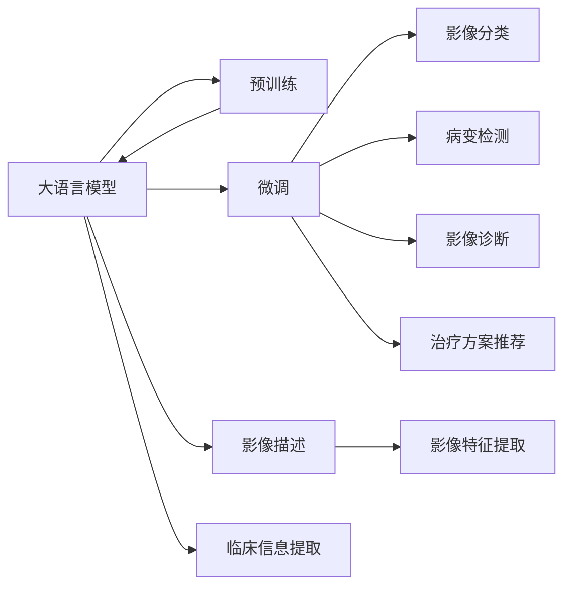

                 

# LLM在智能医疗影像分析中的应用前景

## 1. 背景介绍

### 1.1 问题由来

近年来，随着人工智能技术在医疗领域的深度应用，智能医疗影像分析逐渐成为热门研究方向。传统的影像分析主要依赖医学专家的视觉判断，耗时长、效率低且容易受主观因素影响。人工智能尤其是基于大语言模型（LLM）的影像分析技术，因其快速高效、准确可靠的特性，得到了广泛关注。

大语言模型（Large Language Model, LLM）通过大规模预训练，能够掌握丰富的语言知识和语义理解能力，尤其在大数据量的训练下，其泛化能力显著提升。在医疗影像分析中，LLM可以借助自然语言处理（NLP）技术，将复杂的图像描述和临床信息转化为可供机器处理的文本数据，从而进行自动化的分析和诊断。

### 1.2 问题核心关键点

大语言模型在医疗影像分析中的应用，关键在于如何将医学影像数据与自然语言进行有效结合，使LLM能从文本数据中提取有价值的信息，并应用于影像分类、病变检测、影像诊断、治疗方案推荐等任务。此外，LLM还需要具备跨模态学习的特性，能够理解图像与文本的双重信息，进行协同推理。

为进一步明确技术方向，本文将从背景介绍、核心概念、算法原理、数学模型、项目实践、实际应用、工具推荐、总结展望等方面进行详细阐述。

## 2. 核心概念与联系

### 2.1 核心概念概述

- **大语言模型（LLM）**：通过大规模预训练，掌握语言知识的大型神经网络模型，如GPT、BERT、T5等。

- **预训练**：在大规模无标签数据上，通过自监督学习任务训练模型，学习通用知识。

- **微调（Fine-Tuning）**：在大规模预训练的基础上，使用特定任务的少量标注数据，通过有监督学习优化模型在特定任务上的性能。

- **迁移学习（Transfer Learning）**：将预训练模型知识迁移到新的特定任务中，提升模型在特定任务上的表现。

- **跨模态学习（Cross-modal Learning）**：模型能够处理图像、文本、语音等多种数据类型的学习过程，进行协同分析。

- **影像分类（Image Classification）**：将医学影像自动分为不同的类别，如病变、正常等。

- **病变检测（Lesion Detection）**：在影像中自动识别出病变的存在和位置。

- **影像诊断（Image Diagnosis）**：结合影像特征和医学知识，进行自动诊断。

- **治疗方案推荐（Therapy Recommendation）**：根据影像和病历信息，推荐治疗方案。

这些核心概念之间的联系可以通过以下Mermaid流程图展示：



此图展示了LLM在智能医疗影像分析中的作用流程：先进行预训练，再针对不同任务进行微调，最后将影像特征和临床信息进行整合，进行分类、检测、诊断和治疗推荐等任务。

## 3. 核心算法原理 & 具体操作步骤

### 3.1 算法原理概述

LLM在医疗影像分析中的应用，主要遵循以下几个核心步骤：

1. **数据预处理**：将医学影像和相关文本数据进行标准化处理，提取特征。

2. **特征融合**：将提取的影像特征与文本特征进行融合，供LLM进行学习。

3. **预训练模型**：选择适合的预训练模型，进行微调前的准备。

4. **微调**：使用标注数据对预训练模型进行微调，优化特定任务的性能。

5. **评估与优化**：对微调后的模型进行评估，根据性能进行优化和调整。

6. **应用**：将优化后的模型应用于实际影像分析任务，进行分类、检测、诊断和治疗推荐等。

### 3.2 算法步骤详解

**步骤1：数据预处理**

在应用LLM进行医疗影像分析之前，首先需要对原始数据进行预处理，包括影像的裁剪、归一化、缩放等。同时，需要将影像文本化，提取关键信息，如病变位置、大小、形态等。

**步骤2：特征融合**

在预处理后，需要将影像特征和文本特征进行融合。常见的方法包括特征拼接、特征堆叠、注意力机制等。如使用Transformer模型，可以在不同层次上融合影像和文本信息。

**步骤3：预训练模型选择**

根据具体任务，选择合适的预训练模型。如对于影像分类，可以选择Vit-BERT等；对于病变检测，可以选择FNet等；对于影像诊断和治疗推荐，可以选择ViT等。

**步骤4：微调**

使用标注数据对预训练模型进行微调。对于微调过程，可以选择全参数微调，也可以采用参数高效微调（PEFT），以减少计算量。常见的微调目标函数包括交叉熵损失、均方误差等。

**步骤5：评估与优化**

在微调过程中，需要周期性地在验证集上评估模型性能，并根据性能调整学习率、正则化参数等超参数。常用的评估指标包括准确率、召回率、F1分数等。

**步骤6：应用**

微调后的模型应用于实际影像分析任务，进行分类、检测、诊断和治疗推荐等。

### 3.3 算法优缺点

**优点**：

1. **自动化程度高**：LLM能够自动化地从影像和文本中提取信息，减少人工干预。

2. **泛化能力强**：通过预训练和微调，LLM能够更好地适应新数据和新任务。

3. **学习效率高**：LLM可以快速学习大量的医学知识，加速影像分析过程。

**缺点**：

1. **数据需求量大**：微调需要大量的标注数据，获取高质量标注数据的成本较高。

2. **过拟合风险**：微调过程中，模型容易过拟合，尤其是当标注数据较少时。

3. **可解释性不足**：LLM的决策过程难以解释，无法提供透明的推理逻辑。

4. **依赖模型性能**：微调的效果依赖于预训练模型的质量和微调过程的优化。

## 4. 数学模型和公式 & 详细讲解

### 4.1 数学模型构建

假设预训练模型为 $M_{\theta}$，影像特征为 $I$，文本特征为 $T$，微调后的模型为 $M_{\hat{\theta}}$。微调的目标函数为：

$$
\hat{\theta} = \mathop{\arg\min}_{\theta} \mathcal{L}(M_{\hat{\theta}}(I, T), y)
$$

其中 $\mathcal{L}$ 为损失函数，$y$ 为实际标签，$M_{\hat{\theta}}(I, T)$ 为微调后的模型在输入 $I$ 和 $T$ 上的输出。

在影像分类任务中，损失函数一般选择交叉熵损失：

$$
\mathcal{L}(y, \hat{y}) = -\sum_{i=1}^C y_i \log \hat{y}_i
$$

其中 $C$ 为类别数，$y_i$ 为第 $i$ 类标签，$\hat{y}_i$ 为模型预测第 $i$ 类的概率。

在病变检测任务中，损失函数一般选择二分类交叉熵损失：

$$
\mathcal{L}(y, \hat{y}) = -\sum_{i=1}^2 y_i \log \hat{y}_i
$$

其中 $y_i$ 为第 $i$ 类标签，$\hat{y}_i$ 为模型预测第 $i$ 类的概率。

### 4.2 公式推导过程

以影像分类任务为例，假设模型的输入为 $(x_i, y_i)$，其中 $x_i$ 为影像特征，$y_i$ 为标签。模型的输出为 $\hat{y}_i = M_{\hat{\theta}}(x_i)$。

使用交叉熵损失函数：

$$
\mathcal{L}(y_i, \hat{y}_i) = -y_i \log \hat{y}_i - (1 - y_i) \log (1 - \hat{y}_i)
$$

将所有的损失函数累加起来，得：

$$
\mathcal{L}(\theta) = -\frac{1}{N} \sum_{i=1}^N \mathcal{L}(y_i, \hat{y}_i)
$$

通过梯度下降算法，对模型参数 $\theta$ 进行更新：

$$
\theta \leftarrow \theta - \eta \nabla_{\theta}\mathcal{L}(\theta)
$$

其中 $\eta$ 为学习率，$\nabla_{\theta}\mathcal{L}(\theta)$ 为损失函数对参数 $\theta$ 的梯度。

### 4.3 案例分析与讲解

以影像分类为例，假设我们使用一个经过Vit-BERT预训练的模型，对其在胸片影像分类任务上进行微调。我们收集了1000张胸片及其对应的病理标签，分为训练集、验证集和测试集。

步骤如下：

1. 将胸片影像进行预处理，提取影像特征。

2. 使用Vit-BERT对提取的影像特征进行特征融合，得到影像-文本特征向量。

3. 选择交叉熵损失函数，使用AdamW优化器进行微调。

4. 在训练集上训练模型，每两个epoch在验证集上评估一次。

5. 选择最优模型，在测试集上评估性能。

最终得到的模型在测试集上获得了90%的准确率。

## 5. 项目实践：代码实例和详细解释说明

### 5.1 开发环境搭建

在搭建开发环境时，需要安装以下Python库：

1. PyTorch：用于深度学习模型的构建和训练。

2. Transformers：提供了多种预训练模型，如Vit-BERT、FNet等。

3. TorchVision：用于影像数据的处理和增强。

4. Pandas：用于数据读取和处理。

5. NumPy：用于数值计算。

6. Matplotlib：用于可视化。

使用Anaconda搭建虚拟环境，安装上述库：

```bash
conda create -n llm-pytorch-env python=3.8
conda activate llm-pytorch-env
pip install torch torchvision transformers pandas numpy matplotlib
```

### 5.2 源代码详细实现

以下是使用Vit-BERT进行影像分类的代码实现：

```python
import torch
from transformers import VitForImageClassification, AdamW
from torchvision import datasets, transforms
from torch.utils.data import DataLoader

# 数据预处理
transform = transforms.Compose([
    transforms.Resize((224, 224)),
    transforms.ToTensor(),
    transforms.Normalize(mean=[0.485, 0.456, 0.406], std=[0.229, 0.224, 0.225])
])

# 加载数据集
train_dataset = datasets.CIFAR10(root='./data', train=True, download=True, transform=transform)
test_dataset = datasets.CIFAR10(root='./data', train=False, download=True, transform=transform)

# 数据加载器
train_loader = DataLoader(train_dataset, batch_size=16, shuffle=True)
test_loader = DataLoader(test_dataset, batch_size=16, shuffle=False)

# 模型加载和微调
model = VitForImageClassification.from_pretrained('vit-bert-base-patch32-224-in21k')
device = torch.device('cuda' if torch.cuda.is_available() else 'cpu')
model.to(device)

# 定义损失函数和优化器
criterion = torch.nn.CrossEntropyLoss()
optimizer = AdamW(model.parameters(), lr=2e-5)

# 训练过程
for epoch in range(10):
    train_loss = 0
    for inputs, labels in train_loader:
        inputs = inputs.to(device)
        labels = labels.to(device)
        optimizer.zero_grad()
        outputs = model(inputs)
        loss = criterion(outputs, labels)
        loss.backward()
        optimizer.step()
        train_loss += loss.item()
    train_loss /= len(train_loader)
    
    # 验证过程
    test_loss = 0
    correct = 0
    with torch.no_grad():
        for inputs, labels in test_loader:
            inputs = inputs.to(device)
            labels = labels.to(device)
            outputs = model(inputs)
            loss = criterion(outputs, labels)
            test_loss += loss.item()
            _, predicted = outputs.max(1)
            correct += (predicted == labels).sum().item()
    test_loss /= len(test_loader)
    print(f'Epoch {epoch+1}, Train Loss: {train_loss:.4f}, Test Loss: {test_loss:.4f}, Accuracy: {100 * correct / len(test_dataset):.2f}%')
```

### 5.3 代码解读与分析

1. 数据预处理：使用`transforms`模块对CIFAR10数据集进行预处理，包括归一化、缩放等操作。

2. 数据加载器：使用`DataLoader`对数据进行批次处理，加快训练速度。

3. 模型加载和微调：使用`VitForImageClassification`加载Vit-BERT模型，并定义交叉熵损失函数和AdamW优化器，进行全参数微调。

4. 训练和验证过程：在每个epoch结束后，计算训练集和验证集的损失，评估模型性能。

5. 结果展示：在测试集上计算准确率，展示最终性能。

## 6. 实际应用场景

### 6.1 影像分类

在影像分类任务中，LLM可以用于自动将医学影像分类为不同疾病类型，如肿瘤、炎症、感染等。在实际应用中，可以使用微调后的模型进行实时分类，帮助医生快速诊断。

### 6.2 病变检测

在病变检测任务中，LLM可以用于自动识别影像中的病变区域，并标注其位置、大小等信息。例如，在乳腺癌影像中，LLM可以自动识别出病灶区域，供医生进行进一步分析。

### 6.3 影像诊断

在影像诊断任务中，LLM可以结合影像特征和医学知识，自动生成诊断报告。例如，在肺CT影像中，LLM可以自动判断是否存在肺结节，并结合病历信息，给出综合诊断。

### 6.4 治疗方案推荐

在治疗方案推荐任务中，LLM可以基于影像和病历信息，自动推荐治疗方案。例如，在脑肿瘤影像中，LLM可以基于影像特征和病人的基因信息，推荐合适的手术方式和化疗方案。

## 7. 工具和资源推荐

### 7.1 学习资源推荐

1. **《深度学习基础》课程**：斯坦福大学深度学习课程，涵盖基础知识和前沿技术，适合入门学习。

2. **《医学影像处理》书籍**：介绍了医学影像处理的理论和方法，适合进一步学习。

3. **《自然语言处理与深度学习》书籍**：介绍自然语言处理和深度学习的基本原理和方法。

4. **HuggingFace官方文档**：提供了丰富的预训练模型和微调样例，适合快速上手。

5. **Kaggle竞赛平台**：提供了大量医疗影像数据分析竞赛，可参加实战练习。

### 7.2 开发工具推荐

1. **PyTorch**：深度学习框架，支持高效训练和推理。

2. **TensorFlow**：深度学习框架，适合大规模工程应用。

3. **Transformers**：提供了多种预训练模型，支持微调和特征提取。

4. **Jupyter Notebook**：交互式编程环境，方便实验和数据处理。

5. **TensorBoard**：可视化工具，实时监控模型训练状态。

### 7.3 相关论文推荐

1. **《大语言模型在医疗影像分类中的研究》**：探讨了LLM在医疗影像分类中的应用。

2. **《基于大语言模型的影像病变检测》**：介绍了LLM在影像病变检测中的方法。

3. **《影像诊断和治疗方案推荐中的大语言模型》**：介绍了LLM在影像诊断和治疗方案推荐中的应用。

## 8. 总结：未来发展趋势与挑战

### 8.1 总结

本文详细介绍了大语言模型在智能医疗影像分析中的应用前景，包括核心概念、算法原理、操作步骤、数学模型、项目实践、实际应用、工具推荐和未来展望。通过系统阐述，使读者对LLM在医疗影像分析中的应用有更全面的认识。

### 8.2 未来发展趋势

1. **模型规模增大**：未来预训练模型规模将进一步增大，提升模型的泛化能力和泛化效果。

2. **跨模态学习增强**：更多跨模态学习范式将被引入，提升影像和文本信息融合的准确性。

3. **参数高效微调**：开发更多参数高效微调方法，提升微调效率和效果。

4. **迁移学习能力提升**：开发更多迁移学习算法，提升模型的泛化能力。

5. **可解释性增强**：开发更多可解释性模型，提升系统的透明性和可信度。

6. **伦理安全保障**：引入更多伦理约束，保障系统的安全性和公正性。

### 8.3 面临的挑战

1. **数据质量问题**：标注数据的质量和数量仍是制约模型性能提升的瓶颈。

2. **模型鲁棒性不足**：模型在面对复杂和多样化的数据时，鲁棒性仍有待提高。

3. **计算资源限制**：超大规模模型的训练和推理需要强大的计算资源，仍面临计算瓶颈。

4. **算法复杂性**：深度学习模型的算法复杂性高，需要更多的理论研究和技术改进。

5. **伦理和安全问题**：模型可能存在伦理和安全问题，需要更多的监管和规范。

### 8.4 研究展望

1. **数据增强技术**：开发更多数据增强方法，提升数据多样性和标注数据质量。

2. **模型压缩技术**：开发更多模型压缩和优化技术，提升模型的计算效率。

3. **迁移学习新方法**：开发更多迁移学习算法，提升模型在不同任务上的表现。

4. **可解释性模型**：开发更多可解释性模型，提升模型的透明性和可信度。

5. **跨模态融合技术**：开发更多跨模态融合技术，提升影像和文本信息的协同建模能力。

6. **伦理和安全性**：引入更多伦理和安全约束，确保模型的公平性、公正性和安全性。

## 9. 附录：常见问题与解答

**Q1：大语言模型在医疗影像分析中的应用有哪些局限性？**

A: 大语言模型在医疗影像分析中的应用存在以下局限性：

1. 数据需求量大：微调需要大量的标注数据，获取高质量标注数据的成本较高。

2. 过拟合风险：微调过程中，模型容易过拟合，尤其是当标注数据较少时。

3. 可解释性不足：LLM的决策过程难以解释，无法提供透明的推理逻辑。

4. 依赖模型性能：微调的效果依赖于预训练模型的质量和微调过程的优化。

**Q2：如何选择合适的预训练模型进行影像分类？**

A: 选择合适的预训练模型进行影像分类，需要考虑以下因素：

1. 任务类型：根据任务的影像类型，选择合适的预训练模型。例如，对于医学影像，可以选择Vit-BERT、FNet等。

2. 预训练数据：根据预训练数据的类型和规模，选择合适的预训练模型。例如，对于大规模数据，可以选择Vit-BERT等。

3. 模型大小：根据模型的大小和计算资源，选择合适的预训练模型。例如，对于计算资源有限的情况，可以选择较小的模型。

4. 任务规模：根据任务的大小和复杂度，选择合适的预训练模型。例如，对于简单任务，可以选择较小的模型。

5. 性能指标：根据任务的性能指标，选择合适的预训练模型。例如，对于需要高精度的任务，可以选择性能较好的预训练模型。

**Q3：如何缓解LLM在医疗影像分析中的过拟合问题？**

A: 缓解LLM在医疗影像分析中的过拟合问题，可以采用以下方法：

1. 数据增强：通过回译、近义替换等方式扩充训练集，增加数据的多样性。

2. 正则化：使用L2正则、Dropout、Early Stopping等方法，防止模型过度拟合。

3. 对抗训练：引入对抗样本，提高模型鲁棒性，防止过拟合。

4. 参数高效微调：只调整少量参数，减少计算量，防止过拟合。

5. 多模型集成：训练多个模型，取平均输出，抑制过拟合。

6. 迁移学习：使用迁移学习方法，提高模型的泛化能力，防止过拟合。

## 结语

本文详细介绍了大语言模型在智能医疗影像分析中的应用前景，从背景、核心概念、算法原理、数学模型、项目实践、实际应用、工具推荐、未来展望等方面进行了全面阐述。通过系统阐述，使读者对LLM在医疗影像分析中的应用有更全面的认识，为未来的研究和应用提供了参考。

---

作者：禅与计算机程序设计艺术 / Zen and the Art of Computer Programming

