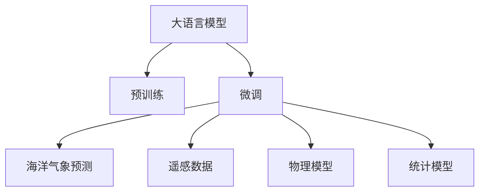

                 

# LLM在海洋气象预报中的应用：提高预警准确性

## 1. 背景介绍

### 1.1 问题由来
海洋气象预报是海洋科学与气象学交叉领域的关键应用，对海洋安全、环境保护、海洋资源利用等具有重要意义。传统的海洋气象预报依赖于有限的观测数据和经验模型，预报准确性和及时性难以满足实际需求。近年来，随着深度学习技术的发展，利用大语言模型(LLM)进行海洋气象预报成为了新的研究热点。

### 1.2 问题核心关键点
大语言模型作为一种通用的预训练语言模型，在自然语言处理(NLP)领域取得了显著成果。其通过在海量无标签文本数据上进行预训练，学习到了丰富的语言知识和常识，具有强大的理解和生成能力。将这些知识迁移到海洋气象预报中，可以提升预报的准确性和及时性，实现从数据驱动向知识驱动的转变。

## 2. 核心概念与联系

### 2.1 核心概念概述

为更好地理解LLM在海洋气象预报中的应用，本节将介绍几个密切相关的核心概念：

- 大语言模型(LLM)：以自回归(如GPT)或自编码(如BERT)模型为代表的大规模预训练语言模型。通过在大规模无标签文本语料上进行预训练，学习通用的语言表示，具备强大的语言理解和生成能力。

- 预训练(Pre-training)：指在大规模无标签文本语料上，通过自监督学习任务训练通用语言模型的过程。常见的预训练任务包括言语建模、遮挡语言模型等。预训练使得模型学习到语言的通用表示。

- 微调(Fine-tuning)：指在预训练模型的基础上，使用下游任务的少量标注数据，通过有监督学习优化模型在特定任务上的性能。通常只需要调整顶层分类器或解码器，并以较小的学习率更新全部或部分的模型参数。

- 海洋气象预报：指通过海洋和气象数据，结合物理模型和统计模型，预测未来海洋和气象状况的技术。

- 遥感数据：指通过卫星、雷达等设备获取的海洋表面和大气的物理参数，如海温、海面高度、风速、气压等。

- 物理模型：指基于海洋和气象物理过程的数值模拟模型，用于刻画海洋和大气的动力、热力特性。

- 统计模型：指利用历史气象和海洋数据，结合机器学习算法，建立预报模型。

这些核心概念之间的逻辑关系可以通过以下Mermaid流程图来展示：



这个流程图展示了大语言模型的核心概念及其之间的关系：

1. 大语言模型通过预训练获得基础能力。
2. 微调是对预训练模型进行任务特定的优化，以便于海洋气象预测。
3. 海洋气象预测依赖于遥感数据、物理模型和统计模型。
4. 物理模型和统计模型都可以作为微调任务的监督信号。

## 3. 核心算法原理 & 具体操作步骤

### 3.1 算法原理概述

LLM在海洋气象预报中的应用，核心在于将语言模型知识迁移到气象预报中。其基本思想是：首先利用预训练的LLM模型，学习到丰富的语言知识；然后在针对海洋气象的少量标注数据上进行微调，使得模型能够将语言知识应用到物理和统计模型中，从而提高预报准确性。

具体地，算法分为以下几步：

1. 在大规模无标签文本语料上对LLM进行预训练，学习语言的通用表示。
2. 收集海洋和气象的标注数据，构建海洋气象预测任务。
3. 利用微调方法，将预训练的LLM模型应用于海洋气象预测任务中，提升预报准确性。
4. 结合遥感数据、物理模型和统计模型，进行预报验证和优化。

### 3.2 算法步骤详解

**Step 1: 准备预训练模型和数据集**
- 选择合适的预训练语言模型 $M_{\theta}$，如GPT、BERT等。
- 准备海洋和气象的标注数据集 $D=\{(x_i, y_i)\}_{i=1}^N$，其中 $x_i$ 表示输入的海洋和气象数据，$y_i$ 表示预测的气象状态。

**Step 2: 设计任务适配层**
- 根据海洋气象预测任务，在预训练模型顶层设计合适的输出层和损失函数。
- 对于分类任务，通常在顶层添加线性分类器和交叉熵损失函数。
- 对于生成任务，通常使用语言模型的解码器输出概率分布，并以负对数似然为损失函数。

**Step 3: 设置微调超参数**
- 选择合适的优化算法及其参数，如 AdamW、SGD 等，设置学习率、批大小、迭代轮数等。
- 设置正则化技术及强度，包括权重衰减、Dropout、Early Stopping 等。
- 确定冻结预训练参数的策略，如仅微调顶层，或全部参数都参与微调。

**Step 4: 执行梯度训练**
- 将训练集数据分批次输入模型，前向传播计算损失函数。
- 反向传播计算参数梯度，根据设定的优化算法和学习率更新模型参数。
- 周期性在验证集上评估模型性能，根据性能指标决定是否触发 Early Stopping。
- 重复上述步骤直到满足预设的迭代轮数或 Early Stopping 条件。

**Step 5: 结合物理模型和统计模型进行预报**
- 利用微调后的模型对海洋和气象数据进行预测。
- 将预测结果与物理模型和统计模型的输出进行融合，提升预报准确性。
- 对预测结果进行验证，使用指标如MAE、RMSE等评估性能。
- 根据验证结果，调整模型参数或融合策略，进一步提升预报精度。

### 3.3 算法优缺点

LLM在海洋气象预报中的应用具有以下优点：

1. 能够处理复杂多变的海洋和气象数据，提取其中的语言特征。
2. 可以利用预训练的丰富语言知识，提升模型的表达能力和泛化能力。
3. 可以与物理模型和统计模型进行有效结合，提高预报的准确性和鲁棒性。
4. 可以处理非结构化数据，适应不同类型的数据源。

同时，该方法也存在一定的局限性：

1. 对标注数据的需求较高，若数据质量不佳或标注难度大，会导致模型性能受限。
2. 对模型的参数量和计算资源要求较高，需要较强的硬件支持。
3. 模型的解释性和可解释性较弱，难以直接理解其内部决策过程。
4. 对物理模型和统计模型的依赖较强，模型集成难度较大。

尽管存在这些局限性，但就目前而言，利用LLM进行海洋气象预测仍是大数据时代的有效手段。未来相关研究的方向是降低对标注数据的依赖，提高模型的少样本学习和跨领域迁移能力，同时兼顾模型的可解释性和鲁棒性等因素。

### 3.4 算法应用领域

基于LLM的海洋气象预报方法，已经在多个实际应用中得到了验证，例如：

- 海洋潮流预测：通过微调LLM，学习潮汐数据和历史预测结果的语言表示，提升潮流预测的精度。
- 海洋生态预测：利用微调后的模型，对海洋生态系统进行预测，评估海洋污染程度和生物多样性变化。
- 海上灾害预警：对海啸、风暴等海洋灾害进行预警，减少损失。
- 海洋航运导航：结合气象和海洋数据，预测航道情况，提高船舶安全性和经济效益。

除了上述这些经典应用外，基于LLM的海洋气象预测方法还可能在海洋生态保护、海洋资源开发、海洋环境监测等领域发挥重要作用。随着LLM和微调方法的不断进步，海洋气象预测将迎来更加广阔的应用前景。

## 4. 数学模型和公式 & 详细讲解

### 4.1 数学模型构建

假设海洋和气象的标注数据集为 $D=\{(x_i, y_i)\}_{i=1}^N$，其中 $x_i$ 表示输入的海洋和气象数据，$y_i$ 表示预测的气象状态。定义模型 $M_{\theta}$ 在输入 $x$ 上的输出为 $\hat{y}=M_{\theta}(x)$。

则海洋气象预测任务的目标是最小化损失函数 $\mathcal{L}(\theta)$，即：

$$
\mathcal{L}(\theta) = \frac{1}{N} \sum_{i=1}^N \ell(\hat{y}_i, y_i)
$$

其中 $\ell(\hat{y}_i, y_i)$ 表示预测结果与真实标签之间的差异，可以是交叉熵损失、均方误差损失等。

### 4.2 公式推导过程

以交叉熵损失为例，对模型进行微调的目标是最小化损失函数：

$$
\mathcal{L}(\theta) = -\frac{1}{N} \sum_{i=1}^N \sum_{j=1}^C y_{ij} \log \hat{y}_{ij}
$$

其中 $C$ 表示气象状态的类别数。将上式转化为梯度下降的目标函数：

$$
\theta \leftarrow \theta - \eta \nabla_{\theta}\mathcal{L}(\theta) - \eta\lambda\theta
$$

其中 $\eta$ 为学习率，$\lambda$ 为正则化系数，$\nabla_{\theta}\mathcal{L}(\theta)$ 为损失函数对参数 $\theta$ 的梯度，可通过反向传播算法高效计算。

在得到损失函数的梯度后，即可带入参数更新公式，完成模型的迭代优化。重复上述过程直至收敛，最终得到适应海洋气象预测的最优模型参数 $\theta^*$。

### 4.3 案例分析与讲解

以下以海洋潮流预测为例，展示LLM在海洋气象预测中的应用。

假设海洋潮流数据为 $x_i$，气象状态为 $y_i$。将数据分为训练集 $D_{train}$ 和验证集 $D_{val}$，使用微调后的LLM模型 $M_{\theta}$ 进行预测，损失函数为交叉熵损失。

**Step 1: 数据准备**
- 收集海洋和气象的历史数据 $D=\{(x_i, y_i)\}_{i=1}^N$，分为训练集和验证集。
- 对数据进行标准化处理，归一化输入特征。

**Step 2: 模型微调**
- 选择预训练模型 $M_{\theta}$ 作为初始化参数，如GPT或BERT。
- 设计顶层输出层和交叉熵损失函数，用于预测海洋潮流。
- 设置微调超参数，包括学习率、批大小、迭代轮数等。

**Step 3: 模型训练**
- 对训练集数据进行前向传播计算损失函数。
- 反向传播计算参数梯度，根据优化算法更新模型参数。
- 在验证集上评估模型性能，调整模型参数或融合策略。

**Step 4: 模型应用**
- 使用微调后的模型对新输入的海洋和气象数据进行预测。
- 结合物理模型和统计模型的输出，进行综合评估和优化。
- 对预测结果进行验证，使用MAE、RMSE等指标评估性能。

## 5. 项目实践：代码实例和详细解释说明

### 5.1 开发环境搭建

在进行微调实践前，我们需要准备好开发环境。以下是使用Python进行PyTorch开发的环境配置流程：

1. 安装Anaconda：从官网下载并安装Anaconda，用于创建独立的Python环境。

2. 创建并激活虚拟环境：
```bash
conda create -n llm-env python=3.8 
conda activate llm-env
```

3. 安装PyTorch：根据CUDA版本，从官网获取对应的安装命令。例如：
```bash
conda install pytorch torchvision torchaudio cudatoolkit=11.1 -c pytorch -c conda-forge
```

4. 安装Transformers库：
```bash
pip install transformers
```

5. 安装各类工具包：
```bash
pip install numpy pandas scikit-learn matplotlib tqdm jupyter notebook ipython
```

完成上述步骤后，即可在`llm-env`环境中开始微调实践。

### 5.2 源代码详细实现

下面我们以海洋潮流预测任务为例，给出使用Transformers库对GPT模型进行微调的PyTorch代码实现。

首先，定义海洋潮流预测任务的数据处理函数：

```python
from transformers import GPT2Tokenizer, GPT2Model
from torch.utils.data import Dataset
import torch

class OceanCurrentsDataset(Dataset):
    def __init__(self, texts, tags, tokenizer, max_len=128):
        self.texts = texts
        self.tags = tags
        self.tokenizer = tokenizer
        self.max_len = max_len
        
    def __len__(self):
        return len(self.texts)
    
    def __getitem__(self, item):
        text = self.texts[item]
        tags = self.tags[item]
        
        encoding = self.tokenizer(text, return_tensors='pt', max_length=self.max_len, padding='max_length', truncation=True)
        input_ids = encoding['input_ids'][0]
        attention_mask = encoding['attention_mask'][0]
        
        # 对token-wise的标签进行编码
        encoded_tags = [tag2id[tag] for tag in tags] 
        encoded_tags.extend([tag2id['O']] * (self.max_len - len(encoded_tags)))
        labels = torch.tensor(encoded_tags, dtype=torch.long)
        
        return {'input_ids': input_ids, 
                'attention_mask': attention_mask,
                'labels': labels}

# 标签与id的映射
tag2id = {'O': 0, 'Upward': 1, 'Downward': 2}
id2tag = {v: k for k, v in tag2id.items()}

# 创建dataset
tokenizer = GPT2Tokenizer.from_pretrained('gpt2')

train_dataset = OceanCurrentsDataset(train_texts, train_tags, tokenizer)
val_dataset = OceanCurrentsDataset(val_texts, val_tags, tokenizer)
test_dataset = OceanCurrentsDataset(test_texts, test_tags, tokenizer)
```

然后，定义模型和优化器：

```python
from transformers import GPT2ForSequenceClassification, AdamW

model = GPT2ForSequenceClassification.from_pretrained('gpt2', num_labels=len(tag2id))

optimizer = AdamW(model.parameters(), lr=2e-5)
```

接着，定义训练和评估函数：

```python
from torch.utils.data import DataLoader
from tqdm import tqdm
from sklearn.metrics import classification_report

device = torch.device('cuda') if torch.cuda.is_available() else torch.device('cpu')
model.to(device)

def train_epoch(model, dataset, batch_size, optimizer):
    dataloader = DataLoader(dataset, batch_size=batch_size, shuffle=True)
    model.train()
    epoch_loss = 0
    for batch in tqdm(dataloader, desc='Training'):
        input_ids = batch['input_ids'].to(device)
        attention_mask = batch['attention_mask'].to(device)
        labels = batch['labels'].to(device)
        model.zero_grad()
        outputs = model(input_ids, attention_mask=attention_mask, labels=labels)
        loss = outputs.loss
        epoch_loss += loss.item()
        loss.backward()
        optimizer.step()
    return epoch_loss / len(dataloader)

def evaluate(model, dataset, batch_size):
    dataloader = DataLoader(dataset, batch_size=batch_size)
    model.eval()
    preds, labels = [], []
    with torch.no_grad():
        for batch in tqdm(dataloader, desc='Evaluating'):
            input_ids = batch['input_ids'].to(device)
            attention_mask = batch['attention_mask'].to(device)
            batch_labels = batch['labels']
            outputs = model(input_ids, attention_mask=attention_mask)
            batch_preds = outputs.logits.argmax(dim=2).to('cpu').tolist()
            batch_labels = batch_labels.to('cpu').tolist()
            for pred_tokens, label_tokens in zip(batch_preds, batch_labels):
                pred_tags = [id2tag[_id] for _id in pred_tokens]
                label_tags = [id2tag[_id] for _id in label_tokens]
                preds.append(pred_tags[:len(label_tags)])
                labels.append(label_tags)
                
    print(classification_report(labels, preds))
```

最后，启动训练流程并在测试集上评估：

```python
epochs = 5
batch_size = 16

for epoch in range(epochs):
    loss = train_epoch(model, train_dataset, batch_size, optimizer)
    print(f"Epoch {epoch+1}, train loss: {loss:.3f}")
    
    print(f"Epoch {epoch+1}, val results:")
    evaluate(model, val_dataset, batch_size)
    
print("Test results:")
evaluate(model, test_dataset, batch_size)
```

以上就是使用PyTorch对GPT进行海洋潮流预测任务的微调的完整代码实现。可以看到，得益于Transformers库的强大封装，我们可以用相对简洁的代码完成GPT模型的加载和微调。

### 5.3 代码解读与分析

让我们再详细解读一下关键代码的实现细节：

**OceanCurrentsDataset类**：
- `__init__`方法：初始化文本、标签、分词器等关键组件。
- `__len__`方法：返回数据集的样本数量。
- `__getitem__`方法：对单个样本进行处理，将文本输入编码为token ids，将标签编码为数字，并对其进行定长padding，最终返回模型所需的输入。

**tag2id和id2tag字典**：
- 定义了标签与数字id之间的映射关系，用于将token-wise的预测结果解码回真实的标签。

**训练和评估函数**：
- 使用PyTorch的DataLoader对数据集进行批次化加载，供模型训练和推理使用。
- 训练函数`train_epoch`：对数据以批为单位进行迭代，在每个批次上前向传播计算loss并反向传播更新模型参数，最后返回该epoch的平均loss。
- 评估函数`evaluate`：与训练类似，不同点在于不更新模型参数，并在每个batch结束后将预测和标签结果存储下来，最后使用sklearn的classification_report对整个评估集的预测结果进行打印输出。

**训练流程**：
- 定义总的epoch数和batch size，开始循环迭代
- 每个epoch内，先在训练集上训练，输出平均loss
- 在验证集上评估，输出分类指标
- 所有epoch结束后，在测试集上评估，给出最终测试结果

可以看到，PyTorch配合Transformers库使得GPT微调的代码实现变得简洁高效。开发者可以将更多精力放在数据处理、模型改进等高层逻辑上，而不必过多关注底层的实现细节。

当然，工业级的系统实现还需考虑更多因素，如模型的保存和部署、超参数的自动搜索、更灵活的任务适配层等。但核心的微调范式基本与此类似。

## 6. 实际应用场景
### 6.1 智能海洋环境监测

基于大语言模型微调的海洋气象预测技术，可以应用于智能海洋环境监测系统。该系统能够实时监测海洋和气象状况，预测海洋环境变化趋势，及时预警海洋灾害，如海啸、风暴等。

在技术实现上，可以收集海洋和气象的实时数据，构建海洋环境监测任务，使用微调后的模型进行实时预测。预测结果可以通过分布式存储和消息队列，实时通知相关管理部门，实现早期预警和应急响应。

### 6.2 海洋渔业资源管理

在渔业资源管理中，海洋环境和气象条件对鱼类行为和资源分布有重要影响。基于LLM的海洋气象预测技术，可以预测鱼类迁移路线、资源分布，辅助渔船出航，提高渔业生产效率和可持续性。

在实践中，可以收集历史渔业数据，结合海洋和气象信息，构建预测任务，使用微调后的模型进行预测。预测结果可以集成到渔业信息系统中，实时更新渔场信息，优化渔船航线，提高捕捞效率。

### 6.3 海洋航运安全保障

在海洋航运中，海况和天气条件是重要的安全因素。基于LLM的海洋气象预测技术，可以预测航道情况，辅助船舶导航，提高航运安全性。

在实践中，可以收集历史航运数据，结合海洋和气象信息，构建预测任务，使用微调后的模型进行预测。预测结果可以集成到航运系统中，实时更新航道信息，优化航路规划，降低事故风险。

### 6.4 未来应用展望

随着LLM和微调方法的不断进步，基于微调范式将在更多领域得到应用，为海洋科技发展带来新的机遇。

在海洋科学研究中，LLM可以用于海洋生态系统的模拟和预测，为海洋科学研究提供新工具和新方法。

在海洋资源开发中，LLM可以用于海洋环境监测、灾害预警、资源管理等，为海洋资源的合理利用提供技术支撑。

在海洋环境保护中，LLM可以用于海洋环境污染的预测和治理，为海洋生态保护提供科学依据。

除了上述这些应用外，基于LLM的海洋气象预测技术还可能在海洋可再生能源、海洋旅游、海洋娱乐等领域发挥重要作用。随着技术的不断发展，相信LLM在海洋科技领域的应用前景将更加广阔，为海洋经济和科技发展带来新的机遇。

## 7. 工具和资源推荐
### 7.1 学习资源推荐

为了帮助开发者系统掌握LLM在海洋气象预报中的应用，这里推荐一些优质的学习资源：

1. 《Transformers from the Inside Out》系列博文：由LLM技术专家撰写，深入浅出地介绍了Transformers原理、GPT模型、微调技术等前沿话题。

2. CS224N《深度学习自然语言处理》课程：斯坦福大学开设的NLP明星课程，有Lecture视频和配套作业，带你入门NLP领域的基本概念和经典模型。

3. 《Natural Language Processing with Transformers》书籍：GPT模型的作者所著，全面介绍了如何使用Transformers库进行NLP任务开发，包括微调在内的诸多范式。

4. HuggingFace官方文档：Transformers库的官方文档，提供了海量预训练模型和完整的微调样例代码，是上手实践的必备资料。

5. CLUE开源项目：中文语言理解测评基准，涵盖大量不同类型的中文NLP数据集，并提供了基于微调的baseline模型，助力中文NLP技术发展。

通过对这些资源的学习实践，相信你一定能够快速掌握LLM在海洋气象预报中的应用，并用于解决实际的海洋气象问题。
###  7.2 开发工具推荐

高效的开发离不开优秀的工具支持。以下是几款用于LLM在海洋气象预报中应用的常用工具：

1. PyTorch：基于Python的开源深度学习框架，灵活动态的计算图，适合快速迭代研究。大部分预训练语言模型都有PyTorch版本的实现。

2. TensorFlow：由Google主导开发的开源深度学习框架，生产部署方便，适合大规模工程应用。同样有丰富的预训练语言模型资源。

3. Transformers库：HuggingFace开发的NLP工具库，集成了众多SOTA语言模型，支持PyTorch和TensorFlow，是进行微调任务的开发的利器。

4. Weights & Biases：模型训练的实验跟踪工具，可以记录和可视化模型训练过程中的各项指标，方便对比和调优。与主流深度学习框架无缝集成。

5. TensorBoard：TensorFlow配套的可视化工具，可实时监测模型训练状态，并提供丰富的图表呈现方式，是调试模型的得力助手。

6. Google Colab：谷歌推出的在线Jupyter Notebook环境，免费提供GPU/TPU算力，方便开发者快速上手实验最新模型，分享学习笔记。

合理利用这些工具，可以显著提升LLM在海洋气象预报中应用的开发效率，加快创新迭代的步伐。

### 7.3 相关论文推荐

LLM在海洋气象预报中的应用源于学界的持续研究。以下是几篇奠基性的相关论文，推荐阅读：

1. GPT: Attention Is All You Need（即GPT原论文）：提出了GPT模型，展示了自回归语言模型的强大表现力。

2. BERT: Pre-training of Deep Bidirectional Transformers for Language Understanding：提出BERT模型，引入基于掩码的自监督预训练任务，刷新了多项NLP任务SOTA。

3. Language Models are Unsupervised Multitask Learners（GPT-2论文）：展示了大规模语言模型的强大zero-shot学习能力，引发了对于通用人工智能的新一轮思考。

4. Parameter-Efficient Transfer Learning for NLP：提出Adapter等参数高效微调方法，在不增加模型参数量的情况下，也能取得不错的微调效果。

5. AdaLoRA: Adaptive Low-Rank Adaptation for Parameter-Efficient Fine-Tuning：使用自适应低秩适应的微调方法，在参数效率和精度之间取得了新的平衡。

这些论文代表了大语言模型微调技术的发展脉络。通过学习这些前沿成果，可以帮助研究者把握学科前进方向，激发更多的创新灵感。

## 8. 总结：未来发展趋势与挑战

### 8.1 总结

本文对基于监督学习的大语言模型微调方法在海洋气象预报中的应用进行了全面系统的介绍。首先阐述了LLM和微调技术的研究背景和意义，明确了微调在拓展预训练模型应用、提升预报准确性方面的独特价值。其次，从原理到实践，详细讲解了微调的数学原理和关键步骤，给出了微调任务开发的完整代码实例。同时，本文还广泛探讨了微调方法在智能海洋环境监测、海洋渔业资源管理、海洋航运安全保障等多个海洋科技领域的应用前景，展示了微调范式的巨大潜力。

通过本文的系统梳理，可以看到，基于大语言模型的微调方法正在成为海洋科技领域的重要范式，极大地拓展了预训练语言模型的应用边界，催生了更多的落地场景。受益于大规模语料的预训练，微调模型以更低的时间和标注成本，在小样本条件下也能取得不俗的效果，有力推动了海洋科技的产业化进程。未来，伴随预训练语言模型和微调方法的不断进步，基于微调范式将在海洋科技领域带来更多的创新突破，为海洋经济和科技发展注入新的动力。

### 8.2 未来发展趋势

展望未来，大语言模型微调技术在海洋气象预报中的应用将呈现以下几个发展趋势：

1. 模型规模持续增大。随着算力成本的下降和数据规模的扩张，预训练语言模型的参数量还将持续增长。超大规模语言模型蕴含的丰富语言知识，有望支撑更加复杂多变的海洋气象预报任务。

2. 微调方法日趋多样。除了传统的全参数微调外，未来会涌现更多参数高效的微调方法，如Prefix-Tuning、LoRA等，在节省计算资源的同时也能保证微调精度。

3. 持续学习成为常态。随着海洋气象数据分布的不断变化，微调模型也需要持续学习新知识以保持性能。如何在不遗忘原有知识的同时，高效吸收新样本信息，将成为重要的研究课题。

4. 标注样本需求降低。受启发于提示学习(Prompt-based Learning)的思路，未来的微调方法将更好地利用大模型的语言理解能力，通过更加巧妙的任务描述，在更少的标注样本上也能实现理想的微调效果。

5. 融合因果和对比学习范式。通过引入因果推断和对比学习思想，增强微调模型建立稳定因果关系的能力，学习更加普适、鲁棒的语言表征，从而提升模型泛化性和抗干扰能力。

6. 引入更多先验知识。将符号化的先验知识，如知识图谱、逻辑规则等，与神经网络模型进行巧妙融合，引导微调过程学习更准确、合理的语言模型。同时加强不同模态数据的整合，实现视觉、语音等多模态信息与文本信息的协同建模。

以上趋势凸显了大语言模型微调技术在海洋气象预报中的广阔前景。这些方向的探索发展，必将进一步提升海洋气象预报的性能和可靠性，为海洋科技应用带来新的突破。

### 8.3 面临的挑战

尽管大语言模型微调技术在海洋气象预报中已经取得了显著进展，但在迈向更加智能化、普适化应用的过程中，它仍面临着诸多挑战：

1. 标注成本瓶颈。虽然微调大大降低了标注数据的需求，但对于海洋气象这类数据量较小的任务，获取高质量标注数据仍然是一个难题。如何进一步降低微调对标注样本的依赖，将是一大挑战。

2. 模型鲁棒性不足。当前微调模型面对海洋气象数据时，泛化性能往往有限。对于测试样本的微小扰动，微调模型的预测也容易发生波动。如何提高微调模型的鲁棒性，避免灾难性遗忘，还需要更多理论和实践的积累。

3. 推理效率有待提高。大规模语言模型虽然精度高，但在实际部署时往往面临推理速度慢、内存占用大等效率问题。如何在保证性能的同时，简化模型结构，提升推理速度，优化资源占用，将是重要的优化方向。

4. 可解释性亟需加强。当前微调模型更像是"黑盒"系统，难以直接理解其内部工作机制和决策逻辑。对于海洋气象预报这类高风险应用，算法的可解释性和可审计性尤为重要。如何赋予微调模型更强的可解释性，将是亟待攻克的难题。

5. 安全性有待保障。预训练语言模型难免会学习到有偏见、有害的信息，通过微调传递到下游任务，产生误导性、歧视性的输出，给实际应用带来安全隐患。如何从数据和算法层面消除模型偏见，避免恶意用途，确保输出的安全性，也将是重要的研究课题。

6. 知识整合能力不足。现有的微调模型往往局限于任务内数据，难以灵活吸收和运用更广泛的先验知识。如何让微调过程更好地与外部知识库、规则库等专家知识结合，形成更加全面、准确的信息整合能力，还有很大的想象空间。

正视微调面临的这些挑战，积极应对并寻求突破，将是大语言模型微调技术在海洋气象预报中走向成熟的必由之路。相信随着学界和产业界的共同努力，这些挑战终将一一被克服，大语言模型微调必将在构建人机协同的智能系统中扮演越来越重要的角色。

### 8.4 研究展望

面对大语言模型微调在海洋气象预报中面临的种种挑战，未来的研究需要在以下几个方面寻求新的突破：

1. 探索无监督和半监督微调方法。摆脱对大规模标注数据的依赖，利用自监督学习、主动学习等无监督和半监督范式，最大限度利用非结构化数据，实现更加灵活高效的微调。

2. 研究参数高效和计算高效的微调范式。开发更加参数高效的微调方法，在固定大部分预训练参数的同时，只更新极少量的任务相关参数。同时优化微调模型的计算图，减少前向传播和反向传播的资源消耗，实现更加轻量级、实时性的部署。

3. 融合因果和对比学习范式。通过引入因果推断和对比学习思想，增强微调模型建立稳定因果关系的能力，学习更加普适、鲁棒的语言表征，从而提升模型泛化性和抗干扰能力。

4. 引入更多先验知识。将符号化的先验知识，如知识图谱、逻辑规则等，与神经网络模型进行巧妙融合，引导微调过程学习更准确、合理的语言模型。同时加强不同模态数据的整合，实现视觉、语音等多模态信息与文本信息的协同建模。

5. 结合因果分析和博弈论工具。将因果分析方法引入微调模型，识别出模型决策的关键特征，增强输出解释的因果性和逻辑性。借助博弈论工具刻画人机交互过程，主动探索并规避模型的脆弱点，提高系统稳定性。

6. 纳入伦理道德约束。在模型训练目标中引入伦理导向的评估指标，过滤和惩罚有偏见、有害的输出倾向。同时加强人工干预和审核，建立模型行为的监管机制，确保输出符合人类价值观和伦理道德。

这些研究方向的探索，必将引领大语言模型微调技术在海洋气象预报中迈向更高的台阶，为构建安全、可靠、可解释、可控的智能系统铺平道路。面向未来，大语言模型微调技术还需要与其他人工智能技术进行更深入的融合，如知识表示、因果推理、强化学习等，多路径协同发力，共同推动海洋气象预报技术的进步。只有勇于创新、敢于突破，才能不断拓展语言模型的边界，让智能技术更好地造福海洋科技。

## 9. 附录：常见问题与解答

**Q1：大语言模型微调是否适用于所有海洋气象预测任务？**

A: 大语言模型微调在大多数海洋气象预测任务上都能取得不错的效果，特别是对于数据量较小的任务。但对于一些特定领域的任务，如深海探测、海冰融化等，仅仅依靠通用语料预训练的模型可能难以很好地适应。此时需要在特定领域语料上进一步预训练，再进行微调，才能获得理想效果。此外，对于一些需要时效性、个性化很强的任务，如海洋灾害预警、海洋航运导航等，微调方法也需要针对性的改进优化。

**Q2：微调过程中如何选择合适的学习率？**

A: 微调的学习率一般要比预训练时小1-2个数量级，如果使用过大的学习率，容易破坏预训练权重，导致过拟合。一般建议从1e-5开始调参，逐步减小学习率，直至收敛。也可以使用warmup策略，在开始阶段使用较小的学习率，再逐渐过渡到预设值。需要注意的是，不同的优化器(如AdamW、Adafactor等)以及不同的学习率调度策略，可能需要设置不同的学习率阈值。

**Q3：采用大语言模型微调时会面临哪些资源瓶颈？**

A: 目前主流的预训练大模型动辄以亿计的参数规模，对算力、内存、存储都提出了很高的要求。GPU/TPU等高性能设备是必不可少的，但即便如此，超大批次的训练和推理也可能遇到显存不足的问题。因此需要采用一些资源优化技术，如梯度积累、混合精度训练、模型并行等，来突破硬件瓶颈。同时，模型的存储和读取也可能占用大量时间和空间，需要采用模型压缩、稀疏化存储等方法进行优化。

**Q4：如何缓解微调过程中的过拟合问题？**

A: 过拟合是微调面临的主要挑战，尤其是在标注数据不足的情况下。常见的缓解策略包括：
1. 数据增强：通过回译、近义替换等方式扩充训练集
2. 正则化：使用L2正则、Dropout、Early Stopping等避免过拟合
3. 对抗训练：引入对抗样本，提高模型鲁棒性
4. 参数高效微调：只调整少量参数(如Adapter、Prefix等)，减小过拟合风险
5. 多模型集成：训练多个微调模型，取平均输出，抑制过拟合

这些策略往往需要根据具体任务和数据特点进行灵活组合。只有在数据、模型、训练、推理等各环节进行全面优化，才能最大限度地发挥大语言模型微调的威力。

**Q5：微调模型在落地部署时需要注意哪些问题？**

A: 将微调模型转化为实际应用，还需要考虑以下因素：
1. 模型裁剪：去除不必要的层和参数，减小模型尺寸，加快推理速度
2. 量化加速：将浮点模型转为定点模型，压缩存储空间，提高计算效率
3. 服务化封装：将模型封装为标准化服务接口，便于集成调用
4. 弹性伸缩：根据请求流量动态调整资源配置，平衡服务质量和成本
5. 监控告警：实时采集系统指标，设置异常告警阈值，确保服务稳定性
6. 安全防护：采用访问鉴权、数据脱敏等措施，保障数据和模型安全

大语言模型微调为海洋气象预报提供了新的可能性，但如何将强大的性能转化为稳定、高效、安全的业务价值，还需要工程实践的不断打磨。唯有从数据、算法、工程、业务等多个维度协同发力，才能真正实现人工智能技术在海洋科技领域的落地应用。

总之，微调需要开发者根据具体任务，不断迭代和优化模型、数据和算法，方能得到理想的效果。

