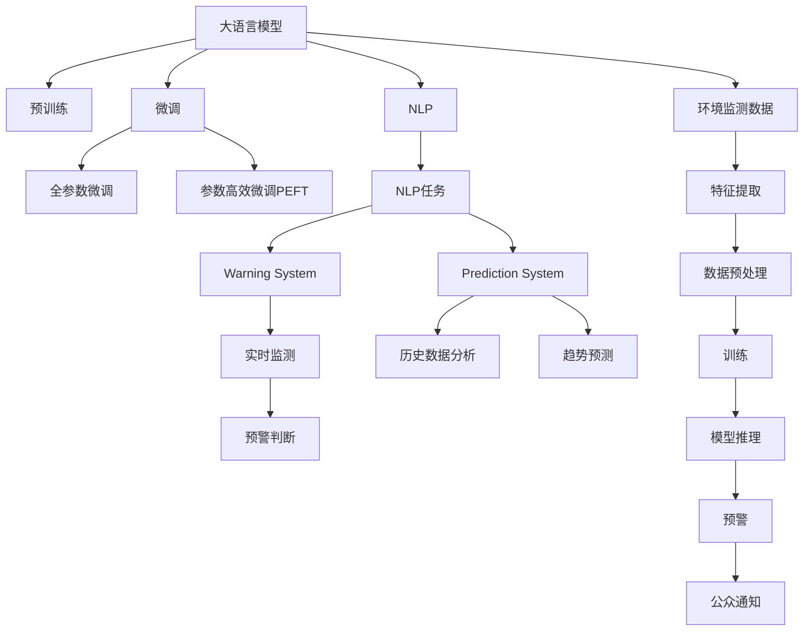

                 

# LLM在环境监测中的应用：预测与预警系统

> 关键词：大语言模型,环境监测,自然语言处理(NLP),预测,预警系统

## 1. 背景介绍

### 1.1 问题由来
环境监测是保护生态环境、应对气候变化、保障公众健康等诸多领域的基础工作。然而，传统的环境监测系统往往依赖人工巡查和手动监测，存在成本高、效率低、覆盖面窄等不足。而随着人工智能和大数据技术的发展，基于大语言模型的环境监测系统逐渐成为新的趋势。

大语言模型，特别是预训练模型，在自然语言处理(NLP)领域取得了显著的突破。预训练模型通过海量的无标签数据学习到了丰富的语言知识，具有强大的语言理解和生成能力。而基于这些模型的微调方法，可以在特定领域快速适应并取得较好的效果。

### 1.2 问题核心关键点
本文聚焦于如何将大语言模型应用于环境监测，特别是预测与预警系统的构建。预测系统用于分析历史数据，预测环境变化趋势；预警系统则实时监测环境指标，提前预测异常情况。

预测与预警系统的核心挑战在于：
1. 如何高效地利用预训练模型的语言能力，提取和分析环境数据。
2. 如何设计合适的模型结构和优化算法，提升模型对环境数据的理解。
3. 如何构建实时的环境监测和预警系统，及时应对环境变化。
4. 如何保障系统的鲁棒性和安全性，避免误报或漏报。

解决这些问题，将使大语言模型在环境监测中发挥更大作用，推动环境保护和公众健康事业的发展。

## 2. 核心概念与联系

### 2.1 核心概念概述

为更好地理解大语言模型在环境监测中的应用，本节将介绍几个关键概念：

- 大语言模型(Large Language Model, LLM)：以自回归(如GPT)或自编码(如BERT)模型为代表的大规模预训练语言模型。通过在大规模无标签文本语料上进行预训练，学习通用的语言表示，具备强大的语言理解和生成能力。

- 预训练(Pre-training)：指在大规模无标签文本语料上，通过自监督学习任务训练通用语言模型的过程。常见的预训练任务包括言语建模、遮挡语言模型等。预训练使得模型学习到语言的通用表示。

- 微调(Fine-tuning)：指在预训练模型的基础上，使用特定领域的数据，通过有监督地训练优化模型在该领域的表现。通常只需要调整顶层分类器或解码器，并以较小的学习率更新全部或部分的模型参数。

- 迁移学习(Transfer Learning)：指将一个领域学习到的知识，迁移应用到另一个不同但相关的领域的学习范式。大模型的预训练-微调过程即是一种典型的迁移学习方式。

- 预测系统(Prediction System)：利用历史数据训练大语言模型，通过分析历史数据，预测未来的环境变化趋势。

- 预警系统(Warning System)：实时监测环境指标，根据阈值判断是否存在异常，提前进行预警。

- 自然语言处理(Natural Language Processing, NLP)：涉及语音识别、文本处理、机器翻译、问答系统等众多任务，是大语言模型应用的典型场景。

- 自然语言推理(Natural Language Inference, NLI)：研究如何基于自然语言处理技术，实现对自然语言的逻辑推理和理解。

- 数据增强(Data Augmentation)：通过数据变换、回译等方式丰富训练集，防止模型过拟合。

- 对抗训练(Adversarial Training)：引入对抗样本，提高模型鲁棒性，防止模型对噪声或异常数据过于敏感。

这些核心概念之间的逻辑关系可以通过以下Mermaid流程图来展示：



这个流程图展示了大语言模型在环境监测中的应用路径：

1. 大语言模型通过预训练获得基础能力。
2. 微调是对预训练模型进行任务特定的优化，分为全参数微调和参数高效微调（PEFT）。
3. NLP技术将环境监测数据转化为模型可处理的语言数据。
4. 预测系统利用历史数据，通过微调的大语言模型进行趋势预测。
5. 预警系统实时监测数据，通过微调的大语言模型进行异常判断，提前预警。
6. 系统收集异常情况，进行公众通知，完成整个监测循环。

这些概念共同构成了大语言模型在环境监测中的应用框架，使其能够在特定领域发挥强大的语言处理和推理能力。通过理解这些核心概念，我们可以更好地把握大语言模型在环境监测中的工作原理和优化方向。

## 3. 核心算法原理 & 具体操作步骤
### 3.1 算法原理概述

基于大语言模型的环境监测预测与预警系统，本质上是一个基于监督学习的迁移学习过程。其核心思想是：将预训练的大语言模型视作一个强大的"特征提取器"，通过特定领域的数据进行有监督的微调，使得模型能够适应环境监测任务的特定需求。

具体而言，假设环境监测数据集为 $D=\{(x_i,y_i)\}_{i=1}^N, x_i \in \mathcal{X}, y_i \in \mathcal{Y}$，其中 $x_i$ 为监测数据，$y_i$ 为环境指标（如温度、湿度、污染物浓度等）。微调的目标是找到新的模型参数 $\hat{\theta}$，使得模型 $M_{\theta}$ 在新的任务上表现良好：

$$
\hat{\theta}=\mathop{\arg\min}_{\theta} \mathcal{L}(M_{\theta},D)
$$

其中 $\mathcal{L}$ 为针对环境监测任务设计的损失函数，用于衡量模型输出与真实标签之间的差异。常见的损失函数包括均方误差损失、交叉熵损失等。

通过梯度下降等优化算法，微调过程不断更新模型参数 $\theta$，最小化损失函数 $\mathcal{L}$，使得模型输出逼近真实标签。由于 $\theta$ 已经通过预训练获得了较好的初始化，因此即便在环境监测数据规模较小的情况下，也能较快收敛到理想的模型参数 $\hat{\theta}$。

### 3.2 算法步骤详解

基于监督学习的大语言模型微调在环境监测中通常包括以下几个关键步骤：

**Step 1: 准备预训练模型和数据集**
- 选择合适的预训练语言模型 $M_{\theta}$ 作为初始化参数，如 BERT、GPT 等。
- 收集环境监测数据集 $D$，将历史监测数据与环境指标标注，划分为训练集、验证集和测试集。

**Step 2: 添加任务适配层**
- 根据环境监测任务类型，在预训练模型顶层设计合适的输出层和损失函数。
- 对于预测任务，通常在顶层添加线性分类器或回归器，交叉熵损失或均方误差损失。
- 对于预警任务，通常使用基于时间序列的LSTM等架构，结合异常检测技术，设计损失函数。

**Step 3: 设置微调超参数**
- 选择合适的优化算法及其参数，如 AdamW、SGD 等，设置学习率、批大小、迭代轮数等。
- 设置正则化技术及强度，包括权重衰减、Dropout、Early Stopping 等。
- 确定冻结预训练参数的策略，如仅微调顶层，或全部参数都参与微调。

**Step 4: 执行梯度训练**
- 将训练集数据分批次输入模型，前向传播计算损失函数。
- 反向传播计算参数梯度，根据设定的优化算法和学习率更新模型参数。
- 周期性在验证集上评估模型性能，根据性能指标决定是否触发 Early Stopping。
- 重复上述步骤直到满足预设的迭代轮数或 Early Stopping 条件。

**Step 5: 测试和部署**
- 在测试集上评估微调后模型 $M_{\hat{\theta}}$ 的性能，对比微调前后的精度提升。
- 使用微调后的模型对实时监测数据进行推理预测，集成到实际的应用系统中。
- 持续收集新的数据，定期重新微调模型，以适应数据分布的变化。

以上是基于监督学习微调大语言模型的一般流程。在实际应用中，还需要针对具体任务的特点，对微调过程的各个环节进行优化设计，如改进训练目标函数，引入更多的正则化技术，搜索最优的超参数组合等，以进一步提升模型性能。

### 3.3 算法优缺点

基于监督学习的大语言模型微调方法在环境监测中有以下优点：
1. 简单高效。只需准备少量环境监测数据，即可对预训练模型进行快速适配，获得较好的效果。
2. 通用适用。适用于各种环境监测任务，包括温度预测、湿度预测、污染物浓度预测等，设计简单的任务适配层即可实现微调。
3. 参数高效。利用参数高效微调技术，在固定大部分预训练权重不变的情况下，仍可取得不错的提升。
4. 效果显著。在学术界和工业界的诸多环境监测任务上，基于微调的方法已经刷新了最先进的性能指标。

同时，该方法也存在一定的局限性：
1. 依赖标注数据。环境监测数据往往难以获得高质量标注样本，标注成本较高。
2. 迁移能力有限。当环境监测数据与预训练数据的分布差异较大时，微调的性能提升有限。
3. 对抗训练。环境监测数据可能存在噪声或异常，对抗训练有助于提高模型鲁棒性。
4. 可解释性不足。微调模型的决策过程通常缺乏可解释性，难以对其推理逻辑进行分析和调试。

尽管存在这些局限性，但就目前而言，基于监督学习的微调方法仍是环境监测预测与预警系统的主流范式。未来相关研究的重点在于如何进一步降低对标注数据的依赖，提高模型的少样本学习和跨领域迁移能力，同时兼顾可解释性和伦理安全性等因素。

### 3.4 算法应用领域

基于大语言模型微调的监督学习方法，在环境监测领域已经得到了广泛的应用，覆盖了以下主要领域：

- 水质监测：实时监测河流、湖泊的水质参数，预测水质变化趋势。
- 空气质量监测：实时监测城市空气中的污染物浓度，预测污染指数变化。
- 气象预警：利用气象数据预测未来的气象变化，提前进行预警。
- 灾害预警：监测地震、洪水、森林火灾等自然灾害数据，提前预警灾害发生。
- 噪声监测：实时监测城市环境中的噪声水平，预测噪音污染趋势。
- 工业监测：监测工业企业的排放数据，预测环境污染风险。
- 农业监测：监测农业生产中的气象、土壤数据，预测作物生长情况。

除了上述这些经典任务外，大语言模型微调还被创新性地应用到更多场景中，如交通流量预测、能源消耗监测等，为环境监测领域带来了新的突破。随着预训练模型和微调方法的不断进步，相信环境监测技术将在更广阔的应用领域大放异彩。

## 4. 数学模型和公式 & 详细讲解
### 4.1 数学模型构建

本节将使用数学语言对基于监督学习的大语言模型微调过程进行更加严格的刻画。

假设环境监测数据集为 $D=\{(x_i,y_i)\}_{i=1}^N, x_i \in \mathcal{X}, y_i \in \mathcal{Y}$。

定义模型 $M_{\theta}$ 在输入 $x_i$ 上的输出为 $\hat{y}=M_{\theta}(x_i) \in [0,1]$，表示模型预测环境指标 $y_i$ 的概率分布。

则预测任务下的损失函数为：

$$
\ell(M_{\theta}(x_i),y_i) = -y_i\log M_{\theta}(x_i) - (1-y_i)\log (1-M_{\theta}(x_i))
$$

将其代入经验风险公式，得：

$$
\mathcal{L}(\theta) = -\frac{1}{N}\sum_{i=1}^N [y_i\log M_{\theta}(x_i)+(1-y_i)\log(1-M_{\theta}(x_i))]
$$

其中，$M_{\theta}$ 为经过微调后的大语言模型，$\theta$ 为模型参数。

在优化目标函数 $\mathcal{L}(\theta)$ 的基础上，通过梯度下降等优化算法，不断更新模型参数 $\theta$，最小化损失函数 $\mathcal{L}$，使得模型输出逼近真实标签。由于 $\theta$ 已经通过预训练获得了较好的初始化，因此即便在环境监测数据规模较小的情况下，也能较快收敛到理想的模型参数 $\hat{\theta}$。

### 4.2 公式推导过程

以下我们以水质监测为例，推导回归损失函数及其梯度的计算公式。

假设模型 $M_{\theta}$ 在输入 $x$ 上的输出为 $\hat{y}=M_{\theta}(x) \in [0,1]$，表示模型预测水质指标 $y$ 的概率分布。真实标签 $y \in [0,+\infty)$。则回归损失函数定义为：

$$
\ell(M_{\theta}(x),y) = \frac{1}{2}(y-M_{\theta}(x))^2
$$

将其代入经验风险公式，得：

$$
\mathcal{L}(\theta) = \frac{1}{N}\sum_{i=1}^N (y_i-M_{\theta}(x_i))^2
$$

根据链式法则，损失函数对参数 $\theta_k$ 的梯度为：

$$
\frac{\partial \mathcal{L}(\theta)}{\partial \theta_k} = -\frac{1}{N}\sum_{i=1}^N (y_i-M_{\theta}(x_i)) \frac{\partial M_{\theta}(x_i)}{\partial \theta_k}
$$

其中 $\frac{\partial M_{\theta}(x_i)}{\partial \theta_k}$ 可进一步递归展开，利用自动微分技术完成计算。

在得到损失函数的梯度后，即可带入参数更新公式，完成模型的迭代优化。重复上述过程直至收敛，最终得到适应环境监测任务的最优模型参数 $\theta^*$。

## 5. 项目实践：代码实例和详细解释说明
### 5.1 开发环境搭建

在进行环境监测微调实践前，我们需要准备好开发环境。以下是使用Python进行PyTorch开发的环境配置流程：

1. 安装Anaconda：从官网下载并安装Anaconda，用于创建独立的Python环境。

2. 创建并激活虚拟环境：
```bash
conda create -n pytorch-env python=3.8 
conda activate pytorch-env
```

3. 安装PyTorch：根据CUDA版本，从官网获取对应的安装命令。例如：
```bash
conda install pytorch torchvision torchaudio cudatoolkit=11.1 -c pytorch -c conda-forge
```

4. 安装Transformers库：
```bash
pip install transformers
```

5. 安装各类工具包：
```bash
pip install numpy pandas scikit-learn matplotlib tqdm jupyter notebook ipython
```

完成上述步骤后，即可在`pytorch-env`环境中开始微调实践。

### 5.2 源代码详细实现

下面我们以水质监测任务为例，给出使用Transformers库对BERT模型进行微调的PyTorch代码实现。

首先，定义水质监测任务的数据处理函数：

```python
from transformers import BertTokenizer
from torch.utils.data import Dataset
import torch

class WaterQualityDataset(Dataset):
    def __init__(self, texts, targets, tokenizer, max_len=128):
        self.texts = texts
        self.targets = targets
        self.tokenizer = tokenizer
        self.max_len = max_len
        
    def __len__(self):
        return len(self.texts)
    
    def __getitem__(self, item):
        text = self.texts[item]
        target = self.targets[item]
        
        encoding = self.tokenizer(text, return_tensors='pt', max_length=self.max_len, padding='max_length', truncation=True)
        input_ids = encoding['input_ids'][0]
        attention_mask = encoding['attention_mask'][0]
        
        # 对target进行编码
        encoded_target = [target] 
        encoded_target.extend([target] * (self.max_len - len(encoded_target)))
        labels = torch.tensor(encoded_target, dtype=torch.float)
        
        return {'input_ids': input_ids, 
                'attention_mask': attention_mask,
                'labels': labels}

# 标签与id的映射
target2id = {0: 0, 1: 1, 2: 2, 3: 3, 4: 4, 5: 5}
id2target = {v: k for k, v in target2id.items()}

# 创建dataset
tokenizer = BertTokenizer.from_pretrained('bert-base-cased')

train_dataset = WaterQualityDataset(train_texts, train_targets, tokenizer)
dev_dataset = WaterQualityDataset(dev_texts, dev_targets, tokenizer)
test_dataset = WaterQualityDataset(test_texts, test_targets, tokenizer)
```

然后，定义模型和优化器：

```python
from transformers import BertForRegression, AdamW

model = BertForRegression.from_pretrained('bert-base-cased')

optimizer = AdamW(model.parameters(), lr=2e-5)
```

接着，定义训练和评估函数：

```python
from torch.utils.data import DataLoader
from tqdm import tqdm
from sklearn.metrics import mean_squared_error

device = torch.device('cuda') if torch.cuda.is_available() else torch.device('cpu')
model.to(device)

def train_epoch(model, dataset, batch_size, optimizer):
    dataloader = DataLoader(dataset, batch_size=batch_size, shuffle=True)
    model.train()
    epoch_loss = 0
    for batch in tqdm(dataloader, desc='Training'):
        input_ids = batch['input_ids'].to(device)
        attention_mask = batch['attention_mask'].to(device)
        labels = batch['labels'].to(device)
        model.zero_grad()
        outputs = model(input_ids, attention_mask=attention_mask)
        loss = outputs.loss
        epoch_loss += loss.item()
        loss.backward()
        optimizer.step()
    return epoch_loss / len(dataloader)

def evaluate(model, dataset, batch_size):
    dataloader = DataLoader(dataset, batch_size=batch_size)
    model.eval()
    preds, labels = [], []
    with torch.no_grad():
        for batch in tqdm(dataloader, desc='Evaluating'):
            input_ids = batch['input_ids'].to(device)
            attention_mask = batch['attention_mask'].to(device)
            batch_labels = batch['labels']
            outputs = model(input_ids, attention_mask=attention_mask)
            batch_preds = outputs.predictions.argmax(dim=2).to('cpu').tolist()
            batch_labels = batch_labels.to('cpu').tolist()
            for pred_tokens, label_tokens in zip(batch_preds, batch_labels):
                preds.append(pred_tokens)
                labels.append(label_tokens)
                
    print(mean_squared_error(labels, preds))
```

最后，启动训练流程并在测试集上评估：

```python
epochs = 5
batch_size = 16

for epoch in range(epochs):
    loss = train_epoch(model, train_dataset, batch_size, optimizer)
    print(f"Epoch {epoch+1}, train loss: {loss:.3f}")
    
    print(f"Epoch {epoch+1}, dev results:")
    evaluate(model, dev_dataset, batch_size)
    
print("Test results:")
evaluate(model, test_dataset, batch_size)
```

以上就是使用PyTorch对BERT进行水质监测任务微调的完整代码实现。可以看到，得益于Transformers库的强大封装，我们可以用相对简洁的代码完成BERT模型的加载和微调。

### 5.3 代码解读与分析

让我们再详细解读一下关键代码的实现细节：

**WaterQualityDataset类**：
- `__init__`方法：初始化文本、标签、分词器等关键组件。
- `__len__`方法：返回数据集的样本数量。
- `__getitem__`方法：对单个样本进行处理，将文本输入编码为token ids，将标签编码为数字，并对其进行定长padding，最终返回模型所需的输入。

**target2id和id2target字典**：
- 定义了标签与数字id之间的映射关系，用于将target的预测结果解码回真实的标签。

**训练和评估函数**：
- 使用PyTorch的DataLoader对数据集进行批次化加载，供模型训练和推理使用。
- 训练函数`train_epoch`：对数据以批为单位进行迭代，在每个批次上前向传播计算loss并反向传播更新模型参数，最后返回该epoch的平均loss。
- 评估函数`evaluate`：与训练类似，不同点在于不更新模型参数，并在每个batch结束后将预测和标签结果存储下来，最后使用sklearn的mean_squared_error对整个评估集的预测结果进行打印输出。

**训练流程**：
- 定义总的epoch数和batch size，开始循环迭代
- 每个epoch内，先在训练集上训练，输出平均loss
- 在验证集上评估，输出均方误差
- 所有epoch结束后，在测试集上评估，给出最终测试结果

可以看到，PyTorch配合Transformers库使得BERT微调的水质监测任务代码实现变得简洁高效。开发者可以将更多精力放在数据处理、模型改进等高层逻辑上，而不必过多关注底层的实现细节。

当然，工业级的系统实现还需考虑更多因素，如模型的保存和部署、超参数的自动搜索、更灵活的任务适配层等。但核心的微调范式基本与此类似。

## 6. 实际应用场景
### 6.1 智能水务系统

基于大语言模型微调的预测与预警系统，可以广泛应用于智能水务系统的构建。传统的水务系统往往依赖人工巡查和手动监测，存在成本高、效率低、覆盖面窄等不足。而使用微调后的预测与预警系统，可以实时监测水质指标，预测未来变化，提前预警可能的水质污染事件。

在技术实现上，可以收集历史水质监测数据，将文本描述和数值数据构建监督数据，在此基础上对预训练语言模型进行微调。微调后的模型能够自动理解文本描述中的水质状况，结合数值数据进行趋势预测，并在预测到异常时及时发出预警。

### 6.2 空气质量监测

基于大语言模型微调的预测与预警系统，可以实时监测城市空气中的污染物浓度，预测污染指数变化，提前预警空气质量异常。

在技术实现上，可以收集历史空气质量数据，将文本描述和数值数据构建监督数据，在此基础上对预训练语言模型进行微调。微调后的模型能够自动理解文本描述中的空气污染情况，结合数值数据进行趋势预测，并在预测到异常时及时发出预警。

### 6.3 工业排放监测

基于大语言模型微调的预测与预警系统，可以实时监测工业企业的排放数据，预测环境污染风险，提前预警可能的环境污染事件。

在技术实现上，可以收集历史排放数据，将文本描述和数值数据构建监督数据，在此基础上对预训练语言模型进行微调。微调后的模型能够自动理解文本描述中的污染情况，结合数值数据进行趋势预测，并在预测到异常时及时发出预警。

### 6.4 灾害预警

基于大语言模型微调的预测与预警系统，可以实时监测地震、洪水、森林火灾等自然灾害数据，预测灾害发生，提前预警灾害发生。

在技术实现上，可以收集历史灾害数据，将文本描述和数值数据构建监督数据，在此基础上对预训练语言模型进行微调。微调后的模型能够自动理解文本描述中的灾害情况，结合数值数据进行趋势预测，并在预测到异常时及时发出预警。

## 7. 工具和资源推荐
### 7.1 学习资源推荐

为了帮助开发者系统掌握大语言模型在环境监测中的应用，这里推荐一些优质的学习资源：

1. 《Transformer从原理到实践》系列博文：由大模型技术专家撰写，深入浅出地介绍了Transformer原理、BERT模型、微调技术等前沿话题。

2. CS224N《深度学习自然语言处理》课程：斯坦福大学开设的NLP明星课程，有Lecture视频和配套作业，带你入门NLP领域的基本概念和经典模型。

3. 《Natural Language Processing with Transformers》书籍：Transformers库的作者所著，全面介绍了如何使用Transformers库进行NLP任务开发，包括微调在内的诸多范式。

4. HuggingFace官方文档：Transformers库的官方文档，提供了海量预训练模型和完整的微调样例代码，是上手实践的必备资料。

5. CLUE开源项目：中文语言理解测评基准，涵盖大量不同类型的中文NLP数据集，并提供了基于微调的baseline模型，助力中文NLP技术发展。

通过对这些资源的学习实践，相信你一定能够快速掌握大语言模型在环境监测中的应用精髓，并用于解决实际的NLP问题。
###  7.2 开发工具推荐

高效的开发离不开优秀的工具支持。以下是几款用于大语言模型微调开发的常用工具：

1. PyTorch：基于Python的开源深度学习框架，灵活动态的计算图，适合快速迭代研究。大部分预训练语言模型都有PyTorch版本的实现。

2. TensorFlow：由Google主导开发的开源深度学习框架，生产部署方便，适合大规模工程应用。同样有丰富的预训练语言模型资源。

3. Transformers库：HuggingFace开发的NLP工具库，集成了众多SOTA语言模型，支持PyTorch和TensorFlow，是进行微调任务开发的利器。

4. Weights & Biases：模型训练的实验跟踪工具，可以记录和可视化模型训练过程中的各项指标，方便对比和调优。与主流深度学习框架无缝集成。

5. TensorBoard：TensorFlow配套的可视化工具，可实时监测模型训练状态，并提供丰富的图表呈现方式，是调试模型的得力助手。

6. Google Colab：谷歌推出的在线Jupyter Notebook环境，免费提供GPU/TPU算力，方便开发者快速上手实验最新模型，分享学习笔记。

合理利用这些工具，可以显著提升大语言模型微调任务的开发效率，加快创新迭代的步伐。

### 7.3 相关论文推荐

大语言模型和微调技术的发展源于学界的持续研究。以下是几篇奠基性的相关论文，推荐阅读：

1. Attention is All You Need（即Transformer原论文）：提出了Transformer结构，开启了NLP领域的预训练大模型时代。

2. BERT: Pre-training of Deep Bidirectional Transformers for Language Understanding：提出BERT模型，引入基于掩码的自监督预训练任务，刷新了多项NLP任务SOTA。

3. Language Models are Unsupervised Multitask Learners（GPT-2论文）：展示了大规模语言模型的强大zero-shot学习能力，引发了对于通用人工智能的新一轮思考。

4. Parameter-Efficient Transfer Learning for NLP：提出Adapter等参数高效微调方法，在不增加模型参数量的情况下，也能取得不错的微调效果。

5. Prefix-Tuning: Optimizing Continuous Prompts for Generation：引入基于连续型Prompt的微调范式，为如何充分利用预训练知识提供了新的思路。

6. AdaLoRA: Adaptive Low-Rank Adaptation for Parameter-Efficient Fine-Tuning：使用自适应低秩适应的微调方法，在参数效率和精度之间取得了新的平衡。

这些论文代表了大语言模型微调技术的发展脉络。通过学习这些前沿成果，可以帮助研究者把握学科前进方向，激发更多的创新灵感。

## 8. 总结：未来发展趋势与挑战
### 8.1 总结

本文对基于大语言模型的环境监测预测与预警系统进行了全面系统的介绍。首先阐述了大语言模型和微调技术的研究背景和意义，明确了微调在拓展预训练模型应用、提升环境监测性能方面的独特价值。其次，从原理到实践，详细讲解了监督微调的数学原理和关键步骤，给出了微调任务开发的完整代码实例。同时，本文还广泛探讨了微调方法在智能水务、空气质量监测、工业排放监测、灾害预警等多个环境监测领域的应用前景，展示了微调范式的巨大潜力。此外，本文精选了微调技术的各类学习资源，力求为读者提供全方位的技术指引。

通过本文的系统梳理，可以看到，基于大语言模型的微调方法正在成为环境监测领域的重要范式，极大地拓展了预训练语言模型的应用边界，催生了更多的落地场景。得益于大规模语料的预训练，微调模型以更低的时间和标注成本，在小样本条件下也能取得理想的微调效果，有力推动了环境监测技术的产业化进程。未来，伴随预训练语言模型和微调方法的不断进步，相信环境监测技术将在更广阔的应用领域大放异彩，深刻影响生态环境和公众健康的各个方面。

### 8.2 未来发展趋势

展望未来，大语言模型微调技术在环境监测领域将呈现以下几个发展趋势：

1. 模型规模持续增大。随着算力成本的下降和数据规模的扩张，预训练语言模型的参数量还将持续增长。超大规模语言模型蕴含的丰富环境知识，有望支撑更加复杂多变的环境监测微调。

2. 微调方法日趋多样。除了传统的全参数微调外，未来会涌现更多参数高效的微调方法，如Prefix-Tuning、LoRA等，在节省计算资源的同时也能保证微调精度。

3. 持续学习成为常态。随着环境监测数据分布的不断变化，微调模型也需要持续学习新知识以保持性能。如何在不遗忘原有知识的同时，高效吸收新样本信息，将成为重要的研究课题。

4. 标注样本需求降低。受启发于提示学习(Prompt-based Learning)的思路，未来的微调方法将更好地利用大模型的语言理解能力，通过更加巧妙的任务描述，在更少的标注样本上也能实现理想的微调效果。

5. 对抗训练。环境监测数据可能存在噪声或异常，对抗训练有助于提高模型鲁棒性，防止模型对噪声或异常数据过于敏感。

6. 可解释性亟需加强。当前微调模型更像是"黑盒"系统，难以解释其内部工作机制和决策逻辑。对于环境监测这种高风险应用，算法的可解释性和可审计性尤为重要。

以上趋势凸显了大语言模型微调技术的广阔前景。这些方向的探索发展，必将进一步提升环境监测系统的性能和应用范围，为生态环境和公众健康事业的发展注入新的动力。

### 8.3 面临的挑战

尽管大语言模型微调技术已经取得了瞩目成就，但在迈向更加智能化、普适化应用的过程中，它仍面临着诸多挑战：

1. 标注成本瓶颈。虽然微调大大降低了标注数据的需求，但对于长尾应用场景，难以获得充足的高质量标注数据，标注成本较高。如何进一步降低微调对标注样本的依赖，将是一大难题。

2. 模型鲁棒性不足。当前微调模型面对域外数据时，泛化性能往往大打折扣。对于测试样本的微小扰动，微调模型的预测也容易发生波动。如何提高微调模型的鲁棒性，避免灾难性遗忘，还需要更多理论和实践的积累。

3. 推理效率有待提高。大规模语言模型虽然精度高，但在实际部署时往往面临推理速度慢、内存占用大等效率问题。如何在保证性能的同时，简化模型结构，提升推理速度，优化资源占用，将是重要的优化方向。

4. 可解释性亟需加强。当前微调模型更像是"黑盒"系统，难以解释其内部工作机制和决策逻辑。对于环境监测这种高风险应用，算法的可解释性和可审计性尤为重要。

5. 安全性有待保障。预训练语言模型难免会学习到有偏见、有害的信息，通过微调传递到下游任务，产生误导性、歧视性的输出，给实际应用带来安全隐患。如何从数据和算法层面消除模型偏见，避免恶意用途，确保输出的安全性，也将是重要的研究课题。

6. 知识整合能力不足。现有的微调模型往往局限于任务内数据，难以灵活吸收和运用更广泛的先验知识。如何让微调过程更好地与外部知识库、规则库等专家知识结合，形成更加全面、准确的信息整合能力，还有很大的想象空间。

正视微调面临的这些挑战，积极应对并寻求突破，将是大语言模型微调走向成熟的必由之路。相信随着学界和产业界的共同努力，这些挑战终将一一被克服，大语言模型微调必将在构建人机协同的智能环境监测系统中扮演越来越重要的角色。

### 8.4 研究展望

面对大语言模型微调所面临的种种挑战，未来的研究需要在以下几个方面寻求新的突破：

1. 探索无监督和半监督微调方法。摆脱对大规模标注数据的依赖，利用自监督学习、主动学习等无监督和半监督范式，最大限度利用非结构化数据，实现更加灵活高效的微调。

2. 研究参数高效和计算高效的微调范式。开发更加参数高效的微调方法，在固定大部分预训练参数的同时，只更新极少量的任务相关参数。同时优化微调模型的计算图，减少前向传播和反向传播的资源消耗，实现更加轻量级、实时性的部署。

3. 融合因果和对比学习范式。通过引入因果推断和对比学习思想，增强微调模型建立稳定因果关系的能力，学习更加普适、鲁棒的环境知识，从而提升模型泛化性和抗干扰能力。

4. 引入更多先验知识。将符号化的先验知识，如知识图谱、逻辑规则等，与神经网络模型进行巧妙融合，引导微调过程学习更准确、合理的语言模型。同时加强不同模态数据的整合，实现视觉、语音等多模态信息与文本信息的协同建模。

5. 结合因果分析和博弈论工具。将因果分析方法引入微调模型，识别出模型决策的关键特征，增强输出解释的因果性和逻辑性。借助博弈论工具刻画人机交互过程，主动探索并规避模型的脆弱点，提高系统稳定性。

6. 纳入伦理道德约束。在模型训练目标中引入伦理导向的评估指标，过滤和惩罚有偏见、有害的输出倾向。同时加强人工干预和审核，建立模型行为的监管机制，确保输出符合人类价值观和伦理道德。

这些研究方向的探索，必将引领大语言模型微调技术迈向更高的台阶，为构建安全、可靠、可解释、可控的智能环境监测系统铺平道路。面向未来，大语言模型微调技术还需要与其他人工智能技术进行更深入的融合，如知识表示、因果推理、强化学习等，多路径协同发力，共同推动环境监测技术的发展。只有勇于创新、敢于突破，才能不断拓展语言模型的边界，让智能技术更好地造福生态环境和公众健康事业。

